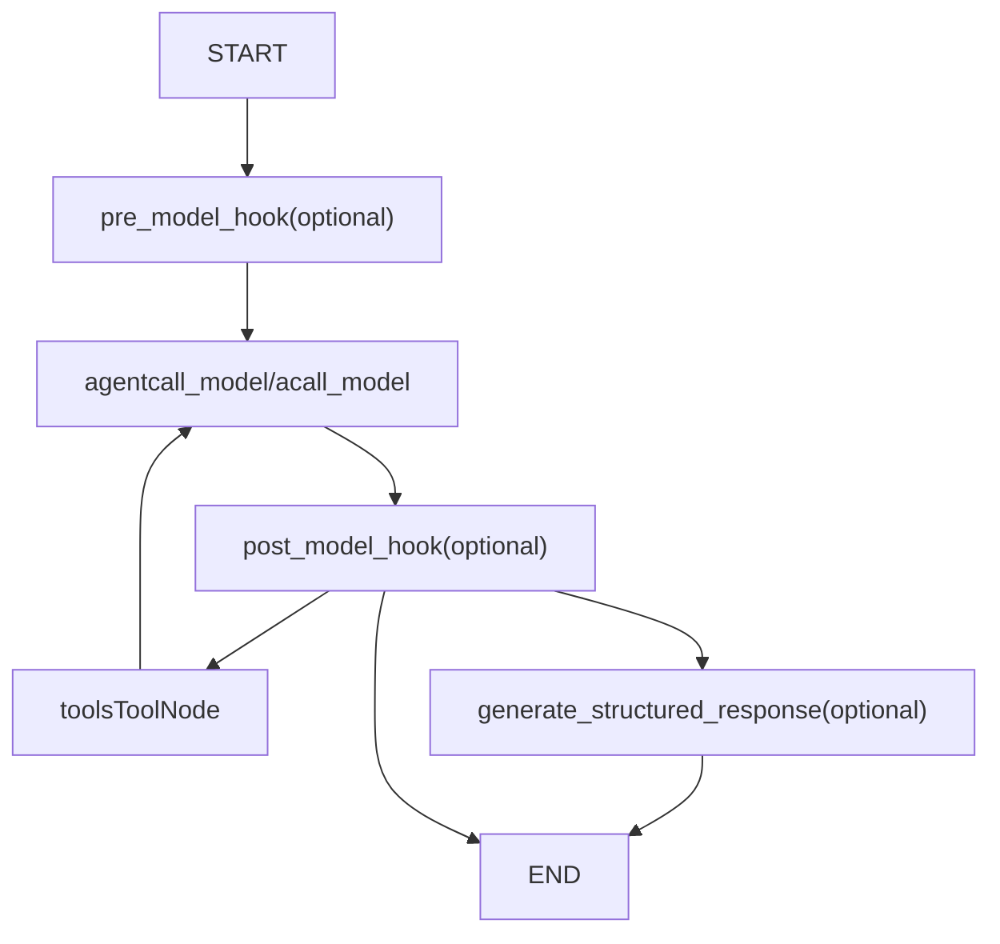
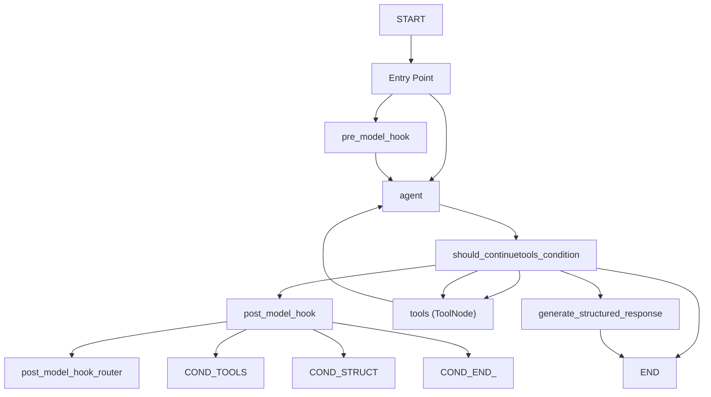
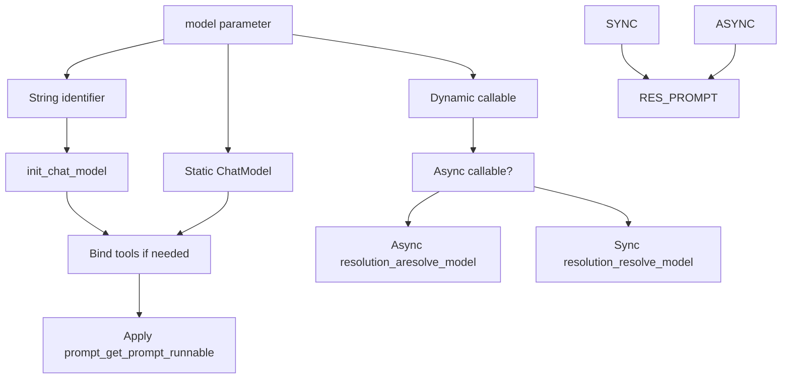
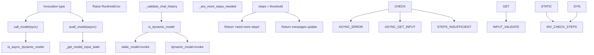
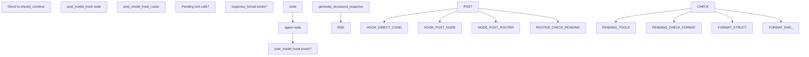
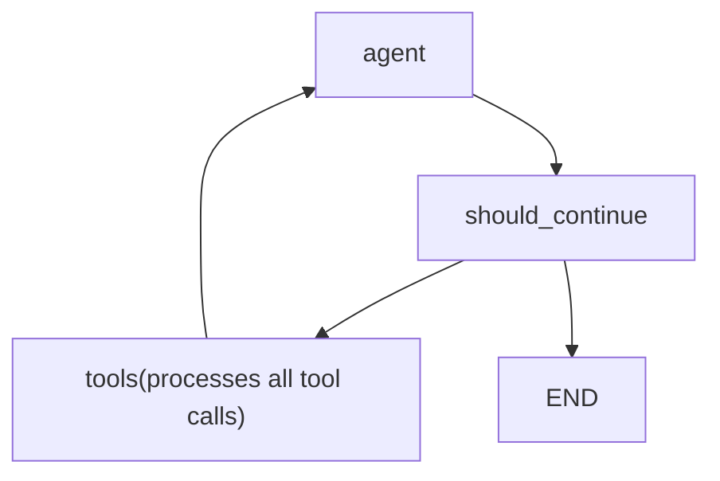
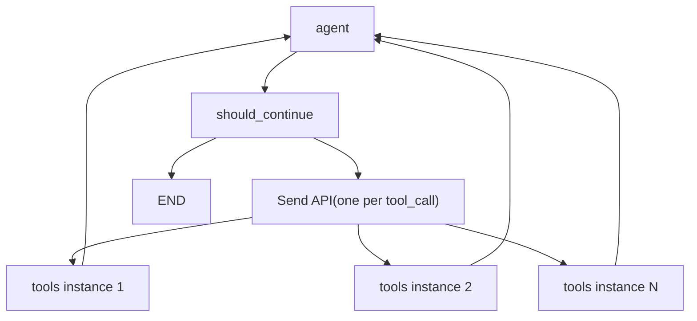

# ReAct Agent (create\_react\_agent)

Relevant source files

-   [libs/langgraph/langgraph/graph/\_\_init\_\_.py](https://github.com/langchain-ai/langgraph/blob/1fd51e8f/libs/langgraph/langgraph/graph/__init__.py)
-   [libs/prebuilt/langgraph/prebuilt/\_\_init\_\_.py](https://github.com/langchain-ai/langgraph/blob/1fd51e8f/libs/prebuilt/langgraph/prebuilt/__init__.py)
-   [libs/prebuilt/langgraph/prebuilt/chat\_agent\_executor.py](https://github.com/langchain-ai/langgraph/blob/1fd51e8f/libs/prebuilt/langgraph/prebuilt/chat_agent_executor.py)
-   [libs/prebuilt/langgraph/prebuilt/tool\_node.py](https://github.com/langchain-ai/langgraph/blob/1fd51e8f/libs/prebuilt/langgraph/prebuilt/tool_node.py)
-   [libs/prebuilt/langgraph/prebuilt/tool\_validator.py](https://github.com/langchain-ai/langgraph/blob/1fd51e8f/libs/prebuilt/langgraph/prebuilt/tool_validator.py)
-   [libs/prebuilt/tests/test\_deprecation.py](https://github.com/langchain-ai/langgraph/blob/1fd51e8f/libs/prebuilt/tests/test_deprecation.py)
-   [libs/prebuilt/tests/test\_on\_tool\_call.py](https://github.com/langchain-ai/langgraph/blob/1fd51e8f/libs/prebuilt/tests/test_on_tool_call.py)
-   [libs/prebuilt/tests/test\_react\_agent.py](https://github.com/langchain-ai/langgraph/blob/1fd51e8f/libs/prebuilt/tests/test_react_agent.py)
-   [libs/prebuilt/tests/test\_tool\_node.py](https://github.com/langchain-ai/langgraph/blob/1fd51e8f/libs/prebuilt/tests/test_tool_node.py)
-   [libs/prebuilt/tests/test\_tool\_node\_interceptor\_unregistered.py](https://github.com/langchain-ai/langgraph/blob/1fd51e8f/libs/prebuilt/tests/test_tool_node_interceptor_unregistered.py)
-   [libs/prebuilt/tests/test\_tool\_node\_validation\_error\_filtering.py](https://github.com/langchain-ai/langgraph/blob/1fd51e8f/libs/prebuilt/tests/test_tool_node_validation_error_filtering.py)

This page documents the `create_react_agent` factory function, which constructs a prebuilt ReAct (Reasoning and Acting) agent graph. This function provides a high-level API for creating agents that loop between calling a language model and executing tools until a stopping condition is met.

**Scope**: This page covers the `create_react_agent` factory function, its parameters, the generated graph structure, and execution patterns. For details on tool execution mechanics, see [ToolNode and Tool Execution (8.2)](https://github.com/langchain-ai/langgraph/blob/1fd51e8f/ToolNode and Tool Execution (8.2))

**Note**: `create_react_agent` is deprecated as of LangGraph v0.1.0 in favor of `create_agent` from the `langchain.agents` package, which provides equivalent functionality with a more flexible middleware system. This documentation describes the implementation as it exists in `langgraph-prebuilt`. [libs/prebuilt/langgraph/prebuilt/chat\_agent\_executor.py43-46](https://github.com/langchain-ai/langgraph/blob/1fd51e8f/libs/prebuilt/langgraph/prebuilt/chat_agent_executor.py#L43-L46)

---

## Factory Function Overview

The `create_react_agent` function signature:

```
def create_react_agent(    model: LanguageModelLike | Callable,    tools: Sequence[BaseTool | Callable] | ToolNode,    *,    prompt: Prompt | None = None,    response_format: StructuredResponseSchema | tuple[str, StructuredResponseSchema] | None = None,    pre_model_hook: RunnableLike | None = None,    post_model_hook: RunnableLike | None = None,    state_schema: StateSchemaType | None = None,    context_schema: type[Any] | None = None,    checkpointer: Checkpointer | None = None,    store: BaseStore | None = None,    interrupt_before: list[str] | None = None,    interrupt_after: list[str] | None = None,    debug: bool = False,    version: Literal["v1", "v2"] = "v2",    name: str | None = None,) -> CompiledStateGraph
```
**Sources**: [libs/prebuilt/langgraph/prebuilt/chat\_agent\_executor.py278-308](https://github.com/langchain-ai/langgraph/blob/1fd51e8f/libs/prebuilt/langgraph/prebuilt/chat_agent_executor.py#L278-L308)

---

## Graph Architecture

### Basic Graph Structure

The `create_react_agent` function constructs a `StateGraph` with the following node structure:


**Diagram: Generated Graph Node Structure**

The actual edges depend on optional parameters:

-   `pre_model_hook`: If provided, becomes the entry point; otherwise `agent` is the entry point. [libs/prebuilt/langgraph/prebuilt/chat\_agent\_executor.py876-881](https://github.com/langchain-ai/langgraph/blob/1fd51e8f/libs/prebuilt/langgraph/prebuilt/chat_agent_executor.py#L876-L881)
-   `post_model_hook`: If provided, inserted after `agent` node. [libs/prebuilt/langgraph/prebuilt/chat\_agent\_executor.py890-895](https://github.com/langchain-ai/langgraph/blob/1fd51e8f/libs/prebuilt/langgraph/prebuilt/chat_agent_executor.py#L890-L895)
-   `response_format`: If provided, adds `generate_structured_response` node as terminal node. [libs/prebuilt/langgraph/prebuilt/chat\_agent\_executor.py898-910](https://github.com/langchain-ai/langgraph/blob/1fd51e8f/libs/prebuilt/langgraph/prebuilt/chat_agent_executor.py#L898-L910)

**Sources**: [libs/prebuilt/langgraph/prebuilt/chat\_agent\_executor.py787-915](https://github.com/langchain-ai/langgraph/blob/1fd51e8f/libs/prebuilt/langgraph/prebuilt/chat_agent_executor.py#L787-L915)

### Execution Flow with Conditionals


**Diagram: ReAct Agent Execution Flow with Routing Logic**

The `should_continue` function routes execution based on the last message's `tool_calls` attribute:

-   If tool calls exist → route to tools. [libs/prebuilt/langgraph/prebuilt/chat\_agent\_executor.py843-859](https://github.com/langchain-ai/langgraph/blob/1fd51e8f/libs/prebuilt/langgraph/prebuilt/chat_agent_executor.py#L843-L859)
-   If no tool calls and `response_format` provided → route to structured response generation. [libs/prebuilt/langgraph/prebuilt/chat\_agent\_executor.py837-839](https://github.com/langchain-ai/langgraph/blob/1fd51e8f/libs/prebuilt/langgraph/prebuilt/chat_agent_executor.py#L837-L839)
-   Otherwise → `END`. [libs/prebuilt/langgraph/prebuilt/chat\_agent\_executor.py841](https://github.com/langchain-ai/langgraph/blob/1fd51e8f/libs/prebuilt/langgraph/prebuilt/chat_agent_executor.py#L841-L841)

**Sources**: [libs/prebuilt/langgraph/prebuilt/chat\_agent\_executor.py831-943](https://github.com/langchain-ai/langgraph/blob/1fd51e8f/libs/prebuilt/langgraph/prebuilt/chat_agent_executor.py#L831-L943)

---

## Agent State Schema

### Default State: AgentState

The default state schema used when `state_schema` is not provided:

```
class AgentState(TypedDict):    messages: Annotated[Sequence[BaseMessage], add_messages]    remaining_steps: NotRequired[RemainingSteps]
```
-   **`messages`**: Message list with `add_messages` reducer for automatic message aggregation. [libs/prebuilt/langgraph/prebuilt/chat\_agent\_executor.py60](https://github.com/langchain-ai/langgraph/blob/1fd51e8f/libs/prebuilt/langgraph/prebuilt/chat_agent_executor.py#L60-L60)
-   **`remaining_steps`**: Managed channel that tracks remaining execution steps. [libs/prebuilt/langgraph/prebuilt/chat\_agent\_executor.py62](https://github.com/langchain-ai/langgraph/blob/1fd51e8f/libs/prebuilt/langgraph/prebuilt/chat_agent_executor.py#L62-L62)

**Sources**: [libs/prebuilt/langgraph/prebuilt/chat\_agent\_executor.py53-62](https://github.com/langchain-ai/langgraph/blob/1fd51e8f/libs/prebuilt/langgraph/prebuilt/chat_agent_executor.py#L53-L62)

### Custom State Schemas

Custom state schemas must include `messages` and `remaining_steps` keys. Both `TypedDict` and Pydantic `BaseModel` schemas are supported. [libs/prebuilt/langgraph/prebuilt/chat\_agent\_executor.py538-552](https://github.com/langchain-ai/langgraph/blob/1fd51e8f/libs/prebuilt/langgraph/prebuilt/chat_agent_executor.py#L538-L552)

```
# TypedDict exampleclass CustomState(AgentState):    user_id: str    context: dict # Pydantic example  class CustomStatePydantic(AgentStatePydantic):    user_id: str    context: dict = {}
```
The function validates that required keys exist when `state_schema` is provided, raising `ValueError` if keys are missing. [libs/prebuilt/langgraph/prebuilt/chat\_agent\_executor.py548-552](https://github.com/langchain-ai/langgraph/blob/1fd51e8f/libs/prebuilt/langgraph/prebuilt/chat_agent_executor.py#L548-L552)

**Sources**: [libs/prebuilt/langgraph/prebuilt/chat\_agent\_executor.py538-552](https://github.com/langchain-ai/langgraph/blob/1fd51e8f/libs/prebuilt/langgraph/prebuilt/chat_agent_executor.py#L538-L552) [libs/prebuilt/tests/test\_react\_agent.py525-596](https://github.com/langchain-ai/langgraph/blob/1fd51e8f/libs/prebuilt/tests/test_react_agent.py#L525-L596)

---

## Model Configuration

### Static Model

A static model is provided directly as a `BaseChatModel` instance or string identifier. [libs/prebuilt/langgraph/prebuilt/chat\_agent\_executor.py568-588](https://github.com/langchain-ai/langgraph/blob/1fd51e8f/libs/prebuilt/langgraph/prebuilt/chat_agent_executor.py#L568-L588)

```
# ChatModel instanceagent = create_react_agent(ChatOpenAI(model="gpt-4"), tools) # String identifier (requires langchain package)agent = create_react_agent("openai:gpt-4", tools)
```
The function automatically binds tools to the model unless already bound via `model.bind_tools()`. [libs/prebuilt/langgraph/prebuilt/chat\_agent\_executor.py587-588](https://github.com/langchain-ai/langgraph/blob/1fd51e8f/libs/prebuilt/langgraph/prebuilt/chat_agent_executor.py#L587-L588)

**Sources**: [libs/prebuilt/langgraph/prebuilt/chat\_agent\_executor.py568-588](https://github.com/langchain-ai/langgraph/blob/1fd51e8f/libs/prebuilt/langgraph/prebuilt/chat_agent_executor.py#L568-L588)

### Dynamic Model Selection

A callable can be provided that returns a model based on runtime state and context:

```
def select_model(state: AgentState, runtime: Runtime[ModelContext]) -> BaseChatModel:    model_name = runtime.context.model_name    if model_name == "gpt-4":        return ChatOpenAI(model="gpt-4").bind_tools(tools)    else:        return ChatOpenAI(model="gpt-3.5-turbo").bind_tools(tools) agent = create_react_agent(select_model, tools, context_schema=ModelContext)
```
The callable receives `state` and `runtime`. [libs/prebuilt/langgraph/prebuilt/chat\_agent\_executor.py563-567](https://github.com/langchain-ai/langgraph/blob/1fd51e8f/libs/prebuilt/langgraph/prebuilt/chat_agent_executor.py#L563-L567) Both sync and async callables are supported. The function detects async callables via `inspect.iscoroutinefunction()` and uses appropriate async resolution. [libs/prebuilt/langgraph/prebuilt/chat\_agent\_executor.py599-618](https://github.com/langchain-ai/langgraph/blob/1fd51e8f/libs/prebuilt/langgraph/prebuilt/chat_agent_executor.py#L599-L618)

**Sources**: [libs/prebuilt/langgraph/prebuilt/chat\_agent\_executor.py563-618](https://github.com/langchain-ai/langgraph/blob/1fd51e8f/libs/prebuilt/langgraph/prebuilt/chat_agent_executor.py#L563-L618)

### Model Resolution Flow


**Diagram: Model Resolution and Binding Process**

**Sources**: [libs/prebuilt/langgraph/prebuilt/chat\_agent\_executor.py599-618](https://github.com/langchain-ai/langgraph/blob/1fd51e8f/libs/prebuilt/langgraph/prebuilt/chat_agent_executor.py#L599-L618)

---

## Prompt Configuration

The `prompt` parameter supports multiple formats:

### Prompt Format Types

| Format | Type | Behavior |
| --- | --- | --- |
| `None` | Default | Passes `state["messages"]` directly to model. [libs/prebuilt/langgraph/prebuilt/chat\_agent\_executor.py139-142](https://github.com/langchain-ai/langgraph/blob/1fd51e8f/libs/prebuilt/langgraph/prebuilt/chat_agent_executor.py#L139-L142) |
| `str` | String | Converted to `SystemMessage` and prepended to messages. [libs/prebuilt/langgraph/prebuilt/chat\_agent\_executor.py143-148](https://github.com/langchain-ai/langgraph/blob/1fd51e8f/libs/prebuilt/langgraph/prebuilt/chat_agent_executor.py#L143-L148) |
| `SystemMessage` | Message | Prepended to messages list. [libs/prebuilt/langgraph/prebuilt/chat\_agent\_executor.py149-153](https://github.com/langchain-ai/langgraph/blob/1fd51e8f/libs/prebuilt/langgraph/prebuilt/chat_agent_executor.py#L149-L153) |
| `Callable` | Function | Called with state, returns `LanguageModelInput`. [libs/prebuilt/langgraph/prebuilt/chat\_agent\_executor.py160-164](https://github.com/langchain-ai/langgraph/blob/1fd51e8f/libs/prebuilt/langgraph/prebuilt/chat_agent_executor.py#L160-L164) |
| `Runnable` | Runnable | Invoked with state, returns `LanguageModelInput`. [libs/prebuilt/langgraph/prebuilt/chat\_agent\_executor.py165-166](https://github.com/langchain-ai/langgraph/blob/1fd51e8f/libs/prebuilt/langgraph/prebuilt/chat_agent_executor.py#L165-L166) |

**Sources**: [libs/prebuilt/langgraph/prebuilt/chat\_agent\_executor.py119-170](https://github.com/langchain-ai/langgraph/blob/1fd51e8f/libs/prebuilt/langgraph/prebuilt/chat_agent_executor.py#L119-L170)

### Prompt with Store Access

Prompts can access the persistent store for user-specific context:

```
def prompt_with_store(state, config, *, store):    user_id = config["configurable"]["user_id"]    user_data = store.get(("memories", user_id), "user_name")    system_msg = SystemMessage(user_data.value["data"])    return [system_msg] + state["messages"] agent = create_react_agent(    model,    tools,    prompt=prompt_with_store,    store=InMemoryStore())
```
The store parameter is injected via runtime dependency injection when the prompt callable signature includes `store`. [libs/prebuilt/tests/test\_react\_agent.py207-251](https://github.com/langchain-ai/langgraph/blob/1fd51e8f/libs/prebuilt/tests/test_react_agent.py#L207-L251)

**Sources**: [libs/prebuilt/tests/test\_react\_agent.py207-251](https://github.com/langchain-ai/langgraph/blob/1fd51e8f/libs/prebuilt/tests/test_react_agent.py#L207-L251)

---

## Agent Node Implementation

### call\_model and acall\_model Functions

The `agent` node executes one of two functions:


**Diagram: Agent Node Execution Logic**

The `call_model` function performs input validation via `_get_model_input_state` [libs/prebuilt/langgraph/prebuilt/chat\_agent\_executor.py636-659](https://github.com/langchain-ai/langgraph/blob/1fd51e8f/libs/prebuilt/langgraph/prebuilt/chat_agent_executor.py#L636-L659) and `_validate_chat_history`. [libs/prebuilt/langgraph/prebuilt/chat\_agent\_executor.py672](https://github.com/langchain-ai/langgraph/blob/1fd51e8f/libs/prebuilt/langgraph/prebuilt/chat_agent_executor.py#L672-L672) It then invokes the model and performs a step limit check via `_are_more_steps_needed`. [libs/prebuilt/langgraph/prebuilt/chat\_agent\_executor.py684-692](https://github.com/langchain-ai/langgraph/blob/1fd51e8f/libs/prebuilt/langgraph/prebuilt/chat_agent_executor.py#L684-L692)

**Sources**: [libs/prebuilt/langgraph/prebuilt/chat\_agent\_executor.py661-721](https://github.com/langchain-ai/langgraph/blob/1fd51e8f/libs/prebuilt/langgraph/prebuilt/chat_agent_executor.py#L661-L721)

### Message History Validation

The `_validate_chat_history` function ensures all tool calls have corresponding tool messages. [libs/prebuilt/langgraph/prebuilt/chat\_agent\_executor.py243-271](https://github.com/langchain-ai/langgraph/blob/1fd51e8f/libs/prebuilt/langgraph/prebuilt/chat_agent_executor.py#L243-L271)

```
def _validate_chat_history(messages: Sequence[BaseMessage]) -> None:    """Validate that all tool calls in AIMessages have a corresponding ToolMessage."""    all_tool_calls = [        tool_call        for message in messages        if isinstance(message, AIMessage)        for tool_call in message.tool_calls    ]    tool_call_ids_with_results = {        message.tool_call_id for message in messages if isinstance(message, ToolMessage)    }    tool_calls_without_results = [        tool_call        for tool_call in all_tool_calls        if tool_call["id"] not in tool_call_ids_with_results    ]    if tool_calls_without_results:        # Raises ValueError with error code INVALID_CHAT_HISTORY
```
**Sources**: [libs/prebuilt/langgraph/prebuilt/chat\_agent\_executor.py243-271](https://github.com/langchain-ai/langgraph/blob/1fd51e8f/libs/prebuilt/langgraph/prebuilt/chat_agent_executor.py#L243-L271)

### Remaining Steps Check

The `_are_more_steps_needed` function prevents infinite loops by checking `remaining_steps`. [libs/prebuilt/langgraph/prebuilt/chat\_agent\_executor.py620-634](https://github.com/langchain-ai/langgraph/blob/1fd51e8f/libs/prebuilt/langgraph/prebuilt/chat_agent_executor.py#L620-L634)

```
def _are_more_steps_needed(state: StateSchema, response: BaseMessage) -> bool:    has_tool_calls = isinstance(response, AIMessage) and response.tool_calls    all_tools_return_direct = (        all(call["name"] in should_return_direct for call in response.tool_calls)        if isinstance(response, AIMessage)        else False    )    remaining_steps = _get_state_value(state, "remaining_steps", None)    if remaining_steps is not None:        if remaining_steps < 1 and all_tools_return_direct:            return True        elif remaining_steps < 2 and has_tool_calls:            return True    return False
```
When remaining steps are insufficient, the agent returns a message: `"Sorry, need more steps to process this request."` [libs/prebuilt/langgraph/prebuilt/chat\_agent\_executor.py688](https://github.com/langchain-ai/langgraph/blob/1fd51e8f/libs/prebuilt/langgraph/prebuilt/chat_agent_executor.py#L688-L688)

**Sources**: [libs/prebuilt/langgraph/prebuilt/chat\_agent\_executor.py620-692](https://github.com/langchain-ai/langgraph/blob/1fd51e8f/libs/prebuilt/langgraph/prebuilt/chat_agent_executor.py#L620-L692)

---

## Pre-Model and Post-Model Hooks

### Pre-Model Hook

The `pre_model_hook` executes before the agent node on every iteration. [libs/prebuilt/langgraph/prebuilt/chat\_agent\_executor.py876-881](https://github.com/langchain-ai/langgraph/blob/1fd51e8f/libs/prebuilt/langgraph/prebuilt/chat_agent_executor.py#L876-L881) Common use cases include message trimming or context injection. [libs/prebuilt/langgraph/prebuilt/chat\_agent\_executor.py396-424](https://github.com/langchain-ai/langgraph/blob/1fd51e8f/libs/prebuilt/langgraph/prebuilt/chat_agent_executor.py#L396-L424)

```
def trim_messages(state):    messages = state["messages"]    # Keep only last 10 messages    return {        "messages": [RemoveMessage(id=REMOVE_ALL_MESSAGES)] + messages[-10:],    } agent = create_react_agent(model, tools, pre_model_hook=trim_messages)
```
**Sources**: [libs/prebuilt/langgraph/prebuilt/chat\_agent\_executor.py396-881](https://github.com/langchain-ai/langgraph/blob/1fd51e8f/libs/prebuilt/langgraph/prebuilt/chat_agent_executor.py#L396-L881)

### Post-Model Hook

The `post_model_hook` executes after the agent node. [libs/prebuilt/langgraph/prebuilt/chat\_agent\_executor.py890-895](https://github.com/langchain-ai/langgraph/blob/1fd51e8f/libs/prebuilt/langgraph/prebuilt/chat_agent_executor.py#L890-L895) Use cases include human-in-the-loop approval or response validation. Available only with `version="v2"`. [libs/prebuilt/langgraph/prebuilt/chat\_agent\_executor.py425-430](https://github.com/langchain-ai/langgraph/blob/1fd51e8f/libs/prebuilt/langgraph/prebuilt/chat_agent_executor.py#L425-L430)

```
def require_approval(state):    last_message = state["messages"][-1]    if last_message.tool_calls:        # Pause for approval        approved = interrupt("Approve tool calls?")        if not approved:            return Command(goto=END)    return state agent = create_react_agent(    model,     tools,     post_model_hook=require_approval,    version="v2")
```
**Sources**: [libs/prebuilt/langgraph/prebuilt/chat\_agent\_executor.py425-895](https://github.com/langchain-ai/langgraph/blob/1fd51e8f/libs/prebuilt/langgraph/prebuilt/chat_agent_executor.py#L425-L895)

### Hook Routing Logic

When `post_model_hook` is present, routing becomes more complex:


**Diagram: Post-Model Hook Routing Flow**

The `post_model_hook_router` checks for pending tool calls by comparing tool call IDs in AI messages against existing tool messages. [libs/prebuilt/langgraph/prebuilt/chat\_agent\_executor.py917-943](https://github.com/langchain-ai/langgraph/blob/1fd51e8f/libs/prebuilt/langgraph/prebuilt/chat_agent_executor.py#L917-L943)

**Sources**: [libs/prebuilt/langgraph/prebuilt/chat\_agent\_executor.py917-943](https://github.com/langchain-ai/langgraph/blob/1fd51e8f/libs/prebuilt/langgraph/prebuilt/chat_agent_executor.py#L917-L943)

---

## Structured Response Generation

When `response_format` is provided, the agent generates structured output after the agent loop completes. [libs/prebuilt/langgraph/prebuilt/chat\_agent\_executor.py744-786](https://github.com/langchain-ai/langgraph/blob/1fd51e8f/libs/prebuilt/langgraph/prebuilt/chat_agent_executor.py#L744-L786)

### Generation Process

```
def generate_structured_response(    state: StateSchema, runtime: Runtime[ContextT], config: RunnableConfig) -> StateSchema:    messages = _get_state_value(state, "messages")    structured_response_schema = response_format    if isinstance(response_format, tuple):        system_prompt, structured_response_schema = response_format        messages = [SystemMessage(content=system_prompt)] + list(messages)     resolved_model = _resolve_model(state, runtime)    model_with_structured_output = _get_model(        resolved_model    ).with_structured_output(structured_response_schema)    response = model_with_structured_output.invoke(messages, config)    return {"structured_response": response}
```
The structured response is stored in `state["structured_response"]`. [libs/prebuilt/langgraph/prebuilt/chat\_agent\_executor.py785](https://github.com/langchain-ai/langgraph/blob/1fd51e8f/libs/prebuilt/langgraph/prebuilt/chat_agent_executor.py#L785-L785)

**Sources**: [libs/prebuilt/langgraph/prebuilt/chat\_agent\_executor.py744-910](https://github.com/langchain-ai/langgraph/blob/1fd51e8f/libs/prebuilt/langgraph/prebuilt/chat_agent_executor.py#L744-L910)

### State Schema Requirements

When using `response_format`, the state schema must include a `structured_response` key. [libs/prebuilt/langgraph/prebuilt/chat\_agent\_executor.py538-552](https://github.com/langchain-ai/langgraph/blob/1fd51e8f/libs/prebuilt/langgraph/prebuilt/chat_agent_executor.py#L538-L552)

```
class AgentStateWithStructuredResponse(AgentState):    structured_response: StructuredResponse  # dict | BaseModel
```
**Sources**: [libs/prebuilt/langgraph/prebuilt/chat\_agent\_executor.py88-552](https://github.com/langchain-ai/langgraph/blob/1fd51e8f/libs/prebuilt/langgraph/prebuilt/chat_agent_executor.py#L88-L552)

---

## Version Differences: v1 vs v2

### Version 1: Batch Tool Execution

In `version="v1"`, the `ToolNode` receives a single message containing all tool calls and executes them in parallel within one node invocation. [libs/prebuilt/langgraph/prebuilt/chat\_agent\_executor.py844-845](https://github.com/langchain-ai/langgraph/blob/1fd51e8f/libs/prebuilt/langgraph/prebuilt/chat_agent_executor.py#L844-L845)


**Diagram: Version 1 Tool Execution Flow**

**Sources**: [libs/prebuilt/langgraph/prebuilt/chat\_agent\_executor.py844-845](https://github.com/langchain-ai/langgraph/blob/1fd51e8f/libs/prebuilt/langgraph/prebuilt/chat_agent_executor.py#L844-L845)

### Version 2: Distributed Tool Execution

In `version="v2"`, each tool call is distributed to a separate `ToolNode` instance using the `Send` API. [libs/prebuilt/langgraph/prebuilt/chat\_agent\_executor.py846-859](https://github.com/langchain-ai/langgraph/blob/1fd51e8f/libs/prebuilt/langgraph/prebuilt/chat_agent_executor.py#L846-L859)


**Diagram: Version 2 Tool Execution with Send API**

The `should_continue` function returns a list of `Send` objects. [libs/prebuilt/langgraph/prebuilt/chat\_agent\_executor.py853-858](https://github.com/langchain-ai/langgraph/blob/1fd51e8f/libs/prebuilt/langgraph/prebuilt/chat_agent_executor.py#L853-L858)

**Sources**: [libs/prebuilt/langgraph/prebuilt/chat\_agent\_executor.py846-859](https://github.com/langchain-ai/langgraph/blob/1fd51e8f/libs/prebuilt/langgraph/prebuilt/chat_agent_executor.py#L846-L859)

---

## Tool Binding and Validation

### Tool Binding Logic

The `_should_bind_tools` function determines whether to bind tools to the model by checking existing `RunnableBinding` kwargs. [libs/prebuilt/langgraph/prebuilt/chat\_agent\_executor.py173-217](https://github.com/langchain-ai/langgraph/blob/1fd51e8f/libs/prebuilt/langgraph/prebuilt/chat_agent_executor.py#L173-L217)

**Sources**: [libs/prebuilt/langgraph/prebuilt/chat\_agent\_executor.py173-217](https://github.com/langchain-ai/langgraph/blob/1fd51e8f/libs/prebuilt/langgraph/prebuilt/chat_agent_executor.py#L173-L217)

### Built-in Tools

The factory supports built-in tools (e.g., MCP tools) passed as dicts. [libs/prebuilt/langgraph/prebuilt/chat\_agent\_executor.py554-561](https://github.com/langchain-ai/langgraph/blob/1fd51e8f/libs/prebuilt/langgraph/prebuilt/chat_agent_executor.py#L554-L561)

**Sources**: [libs/prebuilt/langgraph/prebuilt/chat\_agent\_executor.py554-561](https://github.com/langchain-ai/langgraph/blob/1fd51e8f/libs/prebuilt/langgraph/prebuilt/chat_agent_executor.py#L554-L561) [libs/prebuilt/tests/test\_react\_agent.py312-327](https://github.com/langchain-ai/langgraph/blob/1fd51e8f/libs/prebuilt/tests/test_react_agent.py#L312-L327)

---

## Execution Patterns

### Basic Invocation

```
agent = create_react_agent(model, [tool1, tool2])result = agent.invoke({"messages": [HumanMessage("What's the weather?")]})
```
**Sources**: [libs/prebuilt/tests/test\_react\_agent.py91-104](https://github.com/langchain-ai/langgraph/blob/1fd51e8f/libs/prebuilt/tests/test_react_agent.py#L91-L104)

### Human-in-the-Loop with Interrupts

```
@dec_tooldef sensitive_action(x: int) -> Command:    approval = interrupt("Approve this action?")    if approval:        return Command(update={"messages": [ToolMessage("Done", tool_call_id=...)]})    else:        return Command(goto=END) agent = create_react_agent(model, [sensitive_action], checkpointer=checkpointer)agent.invoke({"messages": [("user", "do action")]}, config)agent.invoke(Command(resume=True), config)
```
**Sources**: [libs/prebuilt/tests/test\_react\_agent.py533-596](https://github.com/langchain-ai/langgraph/blob/1fd51e8f/libs/prebuilt/tests/test_react_agent.py#L533-L596)

---

## Graph Construction Code Mapping

| Concept | Code Entity | Location |
| --- | --- | --- |
| Factory function | `create_react_agent()` | [libs/prebuilt/langgraph/prebuilt/chat\_agent\_executor.py278](https://github.com/langchain-ai/langgraph/blob/1fd51e8f/libs/prebuilt/langgraph/prebuilt/chat_agent_executor.py#L278-L278) |
| Default state | `AgentState` TypedDict | [libs/prebuilt/langgraph/prebuilt/chat\_agent\_executor.py57](https://github.com/langchain-ai/langgraph/blob/1fd51e8f/libs/prebuilt/langgraph/prebuilt/chat_agent_executor.py#L57-L57) |
| Agent node function | `call_model()` / `acall_model()` | [libs/prebuilt/langgraph/prebuilt/chat\_agent\_executor.py661-696](https://github.com/langchain-ai/langgraph/blob/1fd51e8f/libs/prebuilt/langgraph/prebuilt/chat_agent_executor.py#L661-L696) |
| Tool routing | `should_continue()` | [libs/prebuilt/langgraph/prebuilt/chat\_agent\_executor.py831](https://github.com/langchain-ai/langgraph/blob/1fd51e8f/libs/prebuilt/langgraph/prebuilt/chat_agent_executor.py#L831-L831) |
| Prompt processing | `_get_prompt_runnable()` | [libs/prebuilt/langgraph/prebuilt/chat\_agent\_executor.py137](https://github.com/langchain-ai/langgraph/blob/1fd51e8f/libs/prebuilt/langgraph/prebuilt/chat_agent_executor.py#L137-L137) |
| Message validation | `_validate_chat_history()` | [libs/prebuilt/langgraph/prebuilt/chat\_agent\_executor.py243](https://github.com/langchain-ai/langgraph/blob/1fd51e8f/libs/prebuilt/langgraph/prebuilt/chat_agent_executor.py#L243-L243) |
| Step limit check | `_are_more_steps_needed()` | [libs/prebuilt/langgraph/prebuilt/chat\_agent\_executor.py620](https://github.com/langchain-ai/langgraph/blob/1fd51e8f/libs/prebuilt/langgraph/prebuilt/chat_agent_executor.py#L620-L620) |
| Structured output | `generate_structured_response()` | [libs/prebuilt/langgraph/prebuilt/chat\_agent\_executor.py744](https://github.com/langchain-ai/langgraph/blob/1fd51e8f/libs/prebuilt/langgraph/prebuilt/chat_agent_executor.py#L744-L744) |
| Graph builder | `StateGraph` | [libs/prebuilt/langgraph/prebuilt/chat\_agent\_executor.py789-862](https://github.com/langchain-ai/langgraph/blob/1fd51e8f/libs/prebuilt/langgraph/prebuilt/chat_agent_executor.py#L789-L862) |

**Sources**: [libs/prebuilt/langgraph/prebuilt/chat\_agent\_executor.py1-943](https://github.com/langchain-ai/langgraph/blob/1fd51e8f/libs/prebuilt/langgraph/prebuilt/chat_agent_executor.py#L1-L943)
