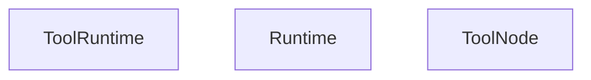
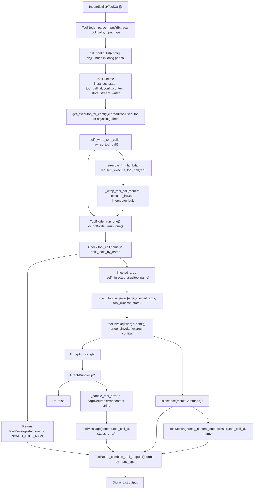
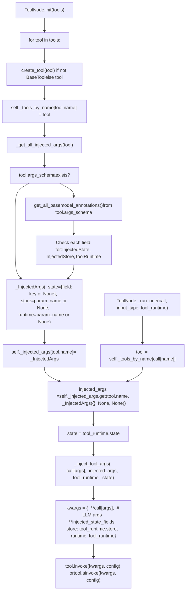
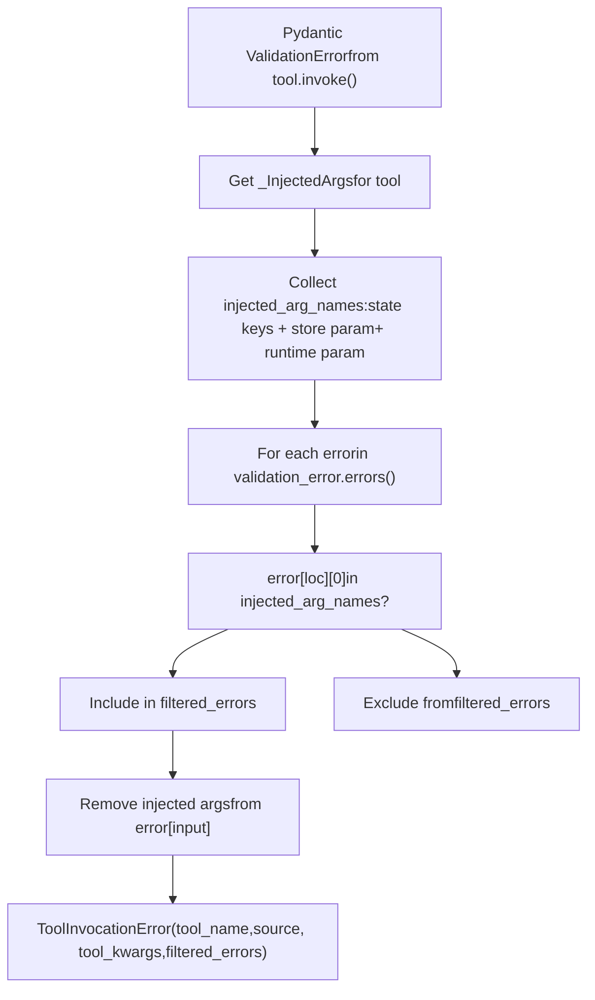
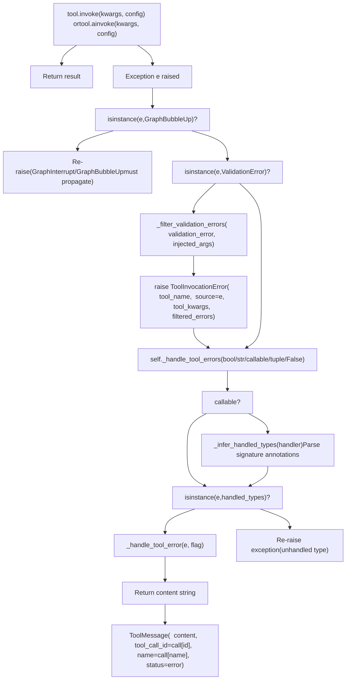
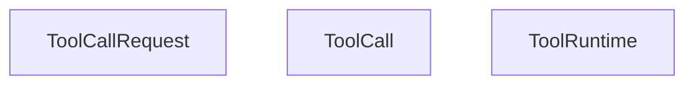
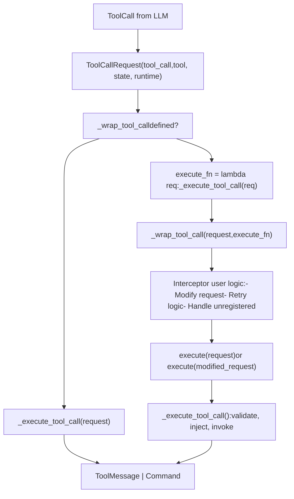
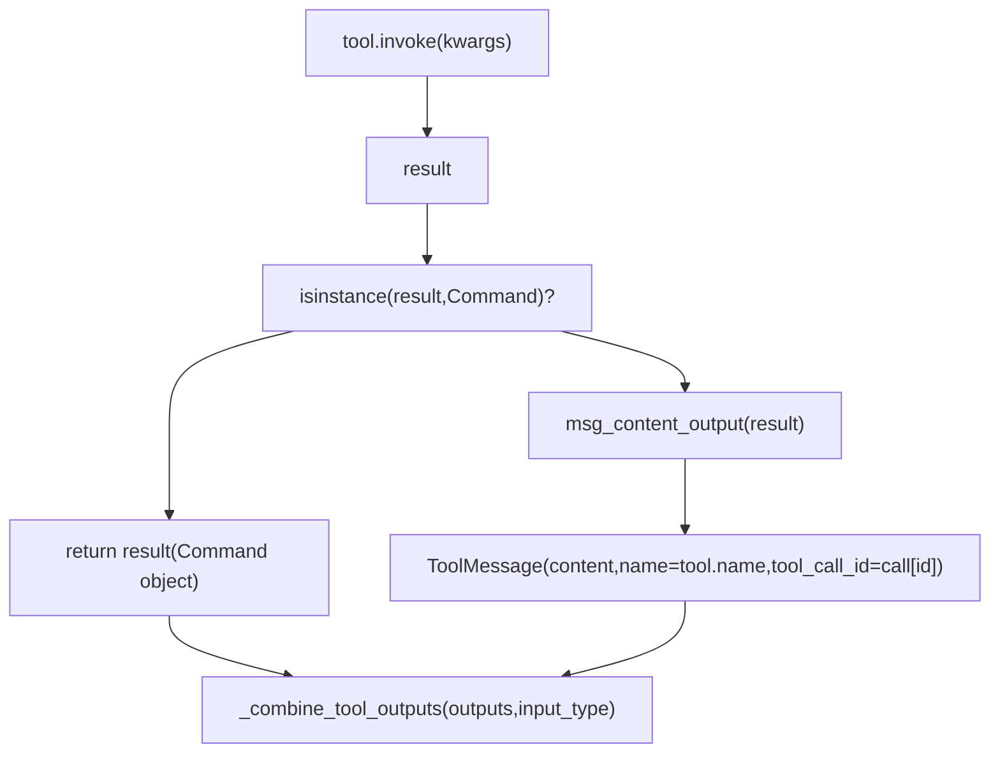
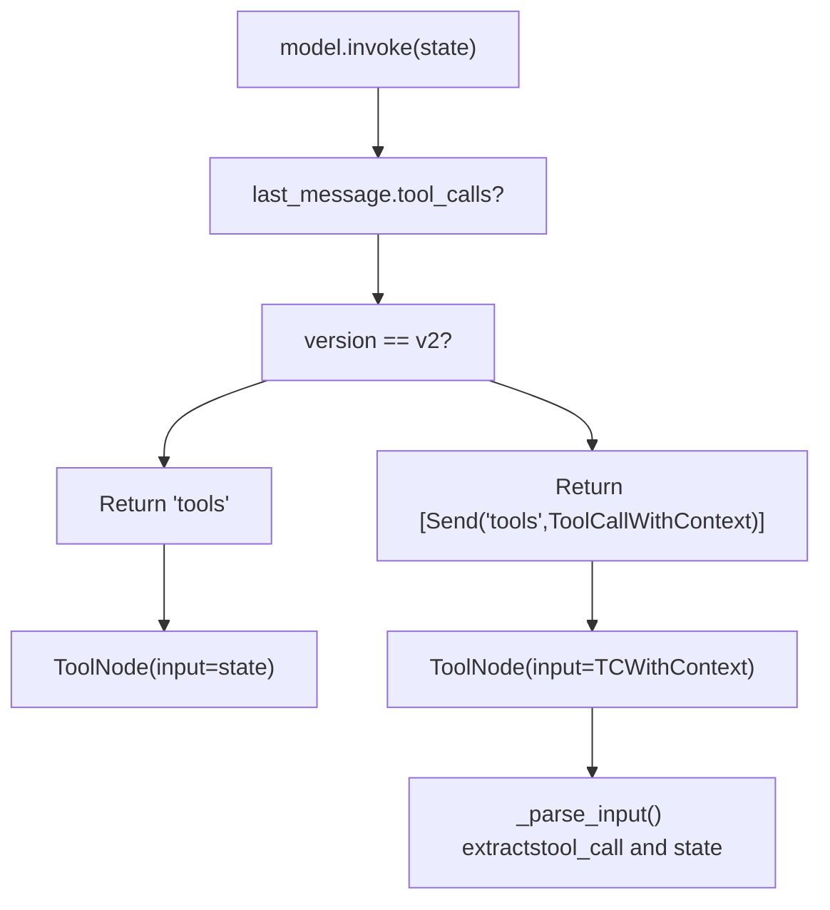

# ToolNode and Tool Execution

Relevant source files

-   [libs/langgraph/langgraph/graph/\_\_init\_\_.py](https://github.com/langchain-ai/langgraph/blob/1fd51e8f/libs/langgraph/langgraph/graph/__init__.py)
-   [libs/prebuilt/langgraph/prebuilt/\_\_init\_\_.py](https://github.com/langchain-ai/langgraph/blob/1fd51e8f/libs/prebuilt/langgraph/prebuilt/__init__.py)
-   [libs/prebuilt/langgraph/prebuilt/chat\_agent\_executor.py](https://github.com/langchain-ai/langgraph/blob/1fd51e8f/libs/prebuilt/langgraph/prebuilt/chat_agent_executor.py)
-   [libs/prebuilt/langgraph/prebuilt/tool\_node.py](https://github.com/langchain-ai/langgraph/blob/1fd51e8f/libs/prebuilt/langgraph/prebuilt/tool_node.py)
-   [libs/prebuilt/langgraph/prebuilt/tool\_validator.py](https://github.com/langchain-ai/langgraph/blob/1fd51e8f/libs/prebuilt/langgraph/prebuilt/tool_validator.py)
-   [libs/prebuilt/tests/test\_deprecation.py](https://github.com/langchain-ai/langgraph/blob/1fd51e8f/libs/prebuilt/tests/test_deprecation.py)
-   [libs/prebuilt/tests/test\_on\_tool\_call.py](https://github.com/langchain-ai/langgraph/blob/1fd51e8f/libs/prebuilt/tests/test_on_tool_call.py)
-   [libs/prebuilt/tests/test\_react\_agent.py](https://github.com/langchain-ai/langgraph/blob/1fd51e8f/libs/prebuilt/tests/test_react_agent.py)
-   [libs/prebuilt/tests/test\_tool\_node.py](https://github.com/langchain-ai/langgraph/blob/1fd51e8f/libs/prebuilt/tests/test_tool_node.py)
-   [libs/prebuilt/tests/test\_tool\_node\_interceptor\_unregistered.py](https://github.com/langchain-ai/langgraph/blob/1fd51e8f/libs/prebuilt/tests/test_tool_node_interceptor_unregistered.py)
-   [libs/prebuilt/tests/test\_tool\_node\_validation\_error\_filtering.py](https://github.com/langchain-ai/langgraph/blob/1fd51e8f/libs/prebuilt/tests/test_tool_node_validation_error_filtering.py)

## Purpose and Scope

This page documents the `ToolNode` class and the tool execution system in LangGraph's prebuilt components. `ToolNode` is a sophisticated execution engine that handles tool invocation, dependency injection, error handling, and control flow for agent workflows.

`ToolNode` provides the low-level tool execution machinery used by higher-level components. For information about building complete ReAct-style agents that use `ToolNode` internally, see [ReAct Agent (create\_react\_agent)](/langchain-ai/langgraph/8.1-react-agent-(create_react_agent)). For UI-related tool patterns, see [UI Integration](/langchain-ai/langgraph/8.3-ui-integration).

**Sources:** [libs/prebuilt/langgraph/prebuilt/tool\_node.py1-38](https://github.com/langchain-ai/langgraph/blob/1fd51e8f/libs/prebuilt/langgraph/prebuilt/tool_node.py#L1-L38)

---

## Core Components

### ToolNode Class

`ToolNode` extends `RunnableCallable` to execute tools in LangGraph workflows with parallel execution, dependency injection, and configurable error handling.

**Constructor signature:**

```
ToolNode(    tools: Sequence[BaseTool | Callable],    name: str = "tools",    tags: list[str] | None = None,    handle_tool_errors: bool | str | Callable | type[Exception] | tuple = _default_handle_tool_errors,    messages_key: str = "messages",    wrap_tool_call: ToolCallWrapper | None = None,    awrap_tool_call: AsyncToolCallWrapper | None = None,)
```
**Key attributes:**

-   `_tools_by_name: dict[str, BaseTool]` - Maps tool names to tool instances [\[libs/prebuilt/langgraph/prebuilt/tool\_node.py773-781](https://github.com/langchain-ai/langgraph/blob/1fd51e8f/[libs/prebuilt/langgraph/prebuilt/tool_node.py#L773-L781)\]
-   `_injected_args: dict[str, _InjectedArgs]` - Cached injection metadata per tool [\[libs/prebuilt/langgraph/prebuilt/tool\_node.py773-781](https://github.com/langchain-ai/langgraph/blob/1fd51e8f/[libs/prebuilt/langgraph/prebuilt/tool_node.py#L773-L781)\]
-   `_handle_tool_errors` - Error handling configuration [\[libs/prebuilt/langgraph/prebuilt/tool\_node.py769](https://github.com/langchain-ai/langgraph/blob/1fd51e8f/[libs/prebuilt/langgraph/prebuilt/tool_node.py#L769-L769)\]
-   `_messages_key` - State key for message list (default: `"messages"`) [\[libs/prebuilt/langgraph/prebuilt/tool\_node.py770](https://github.com/langchain-ai/langgraph/blob/1fd51e8f/[libs/prebuilt/langgraph/prebuilt/tool_node.py#L770-L770)\]
-   `_wrap_tool_call` / `_awrap_tool_call` - Optional interceptor functions [\[libs/prebuilt/langgraph/prebuilt/tool\_node.py771-772](https://github.com/langchain-ai/langgraph/blob/1fd51e8f/[libs/prebuilt/langgraph/prebuilt/tool_node.py#L771-L772)\]

**Key methods:**

-   `_func(input, config, runtime)` - Synchronous execution entry point [\[libs/prebuilt/langgraph/prebuilt/tool\_node.py787-817](https://github.com/langchain-ai/langgraph/blob/1fd51e8f/[libs/prebuilt/langgraph/prebuilt/tool_node.py#L787-L817)\]
-   `_afunc(input, config, runtime)` - Asynchronous execution entry point [\[libs/prebuilt/langgraph/prebuilt/tool\_node.py819-848](https://github.com/langchain-ai/langgraph/blob/1fd51e8f/[libs/prebuilt/langgraph/prebuilt/tool_node.py#L819-L848)\]
-   `_parse_input(input)` - Extracts tool calls from input (dict/list/ToolCall\[\]) [\[libs/prebuilt/langgraph/prebuilt/tool\_node.py916-976](https://github.com/langchain-ai/langgraph/blob/1fd51e8f/[libs/prebuilt/langgraph/prebuilt/tool_node.py#L916-L976)\]
-   `_run_one(call, input_type, tool_runtime)` - Executes single tool call [\[libs/prebuilt/langgraph/prebuilt/tool\_node.py978-1001](https://github.com/langchain-ai/langgraph/blob/1fd51e8f/[libs/prebuilt/langgraph/prebuilt/tool_node.py#L978-L1001)\]
-   `_execute_tool_call(request)` - Core execution logic with validation and injection [\[libs/prebuilt/langgraph/prebuilt/tool\_node.py1059-1130](https://github.com/langchain-ai/langgraph/blob/1fd51e8f/[libs/prebuilt/langgraph/prebuilt/tool_node.py#L1059-L1130)\]
-   `_combine_tool_outputs(outputs, input_type)` - Formats results by input type [\[libs/prebuilt/langgraph/prebuilt/tool\_node.py850-914](https://github.com/langchain-ai/langgraph/blob/1fd51e8f/[libs/prebuilt/langgraph/prebuilt/tool_node.py#L850-L914)\]

**Sources:** [libs/prebuilt/langgraph/prebuilt/tool\_node.py616-1130](https://github.com/langchain-ai/langgraph/blob/1fd51e8f/libs/prebuilt/langgraph/prebuilt/tool_node.py#L616-L1130)

### ToolRuntime

`ToolRuntime` is a dataclass that bundles runtime context for injection into tools. It provides access to state, tool call metadata, and graph utilities.

**ToolRuntime Structure:**


**Sources:** [libs/prebuilt/langgraph/prebuilt/tool\_node.py21-22](https://github.com/langchain-ai/langgraph/blob/1fd51e8f/libs/prebuilt/langgraph/prebuilt/tool_node.py#L21-L22) [libs/prebuilt/langgraph/prebuilt/tool\_node.py796-808](https://github.com/langchain-ai/langgraph/blob/1fd51e8f/libs/prebuilt/langgraph/prebuilt/tool_node.py#L796-L808) [libs/prebuilt/langgraph/prebuilt/tool\_node.py829-840](https://github.com/langchain-ai/langgraph/blob/1fd51e8f/libs/prebuilt/langgraph/prebuilt/tool_node.py#L829-L840)

### Dependency Injection Annotations

Three primary annotations enable dependency injection into tool arguments:

| Annotation | Purpose | Example |
| --- | --- | --- |
| `InjectedState` | Inject entire state or specific field | `state: Annotated[dict, InjectedState]` |
| `InjectedStore` | Inject persistent store | `store: Annotated[BaseStore, InjectedStore()]` |
| `ToolRuntime` | Inject complete runtime bundle | `runtime: ToolRuntime` |

**Sources:** [libs/prebuilt/langgraph/prebuilt/\_\_init\_\_.py1-22](https://github.com/langchain-ai/langgraph/blob/1fd51e8f/libs/prebuilt/langgraph/prebuilt/__init__.py#L1-L22) [libs/prebuilt/langgraph/prebuilt/tool\_node.py562-614](https://github.com/langchain-ai/langgraph/blob/1fd51e8f/libs/prebuilt/langgraph/prebuilt/tool_node.py#L562-L614)

### tools\_condition

`tools_condition` is a utility function for conditional routing based on whether the last message contains tool calls. It returns `"tools"` if tool calls are present, otherwise `END`.

**Sources:** [libs/prebuilt/langgraph/prebuilt/tool\_node.py1230-1254](https://github.com/langchain-ai/langgraph/blob/1fd51e8f/libs/prebuilt/langgraph/prebuilt/tool_node.py#L1230-L1254)

---

## Tool Execution Architecture

The following diagram illustrates how tool calls flow through the `ToolNode` execution pipeline:

**Tool Execution Flow**


**Sources:** [libs/prebuilt/langgraph/prebuilt/tool\_node.py787-848](https://github.com/langchain-ai/langgraph/blob/1fd51e8f/libs/prebuilt/langgraph/prebuilt/tool_node.py#L787-L848) [libs/prebuilt/langgraph/prebuilt/tool\_node.py916-1057](https://github.com/langchain-ai/langgraph/blob/1fd51e8f/libs/prebuilt/langgraph/prebuilt/tool_node.py#L916-L1057)

---

## Input and Output Formats

### Input Formats

`ToolNode` handles three primary input formats via `_parse_input()`:

**1\. Graph State Dictionary**

```
{    "messages": [        AIMessage("", tool_calls=[            {"name": "tool1", "args": {"x": 1}, "id": "call_1"}        ])    ]}
```
**2\. Message List**

```
[    AIMessage("", tool_calls=[        {"name": "tool1", "args": {"x": 1}, "id": "call_1"}    ])]
```
**3\. Direct Tool Calls**

```
[    {"name": "tool1", "args": {"x": 1}, "id": "call_1", "type": "tool_call"}]
```
**Sources:** [libs/prebuilt/langgraph/prebuilt/tool\_node.py631-656](https://github.com/langchain-ai/langgraph/blob/1fd51e8f/libs/prebuilt/langgraph/prebuilt/tool_node.py#L631-L656) [libs/prebuilt/langgraph/prebuilt/tool\_node.py916-976](https://github.com/langchain-ai/langgraph/blob/1fd51e8f/libs/prebuilt/langgraph/prebuilt/tool_node.py#L916-L976)

### Output Formats

Output is formatted by `_combine_tool_outputs()` based on the detected `input_type`:

-   **Dict input:** Returns `{"messages": [ToolMessage(...)]}` [\[libs/prebuilt/langgraph/prebuilt/tool\_node.py850-865](https://github.com/langchain-ai/langgraph/blob/1fd51e8f/[libs/prebuilt/langgraph/prebuilt/tool_node.py#L850-L865)\]
-   **List input:** Returns `[ToolMessage(...)]` [\[libs/prebuilt/langgraph/prebuilt/tool\_node.py866-871](https://github.com/langchain-ai/langgraph/blob/1fd51e8f/[libs/prebuilt/langgraph/prebuilt/tool_node.py#L866-L871)\]
-   **Command output:** If tools return `Command` objects, they are returned directly in the list [\[libs/prebuilt/langgraph/prebuilt/tool\_node.py850-914](https://github.com/langchain-ai/langgraph/blob/1fd51e8f/[libs/prebuilt/langgraph/prebuilt/tool_node.py#L850-L914)\]

**Sources:** [libs/prebuilt/langgraph/prebuilt/tool\_node.py850-914](https://github.com/langchain-ai/langgraph/blob/1fd51e8f/libs/prebuilt/langgraph/prebuilt/tool_node.py#L850-L914)

---

## Dependency Injection System

### Architecture

The injection system analyzes tool signatures during initialization and stores metadata in `_injected_args`.

**Dependency Injection Flow**


**Sources:** [libs/prebuilt/langgraph/prebuilt/tool\_node.py737-781](https://github.com/langchain-ai/langgraph/blob/1fd51e8f/libs/prebuilt/langgraph/prebuilt/tool_node.py#L737-L781) [libs/prebuilt/langgraph/prebuilt/tool\_node.py1132-1228](https://github.com/langchain-ai/langgraph/blob/1fd51e8f/libs/prebuilt/langgraph/prebuilt/tool_node.py#L1132-L1228) [libs/prebuilt/langgraph/prebuilt/tool\_node.py562-614](https://github.com/langchain-ai/langgraph/blob/1fd51e8f/libs/prebuilt/langgraph/prebuilt/tool_node.py#L562-L614) [libs/prebuilt/langgraph/prebuilt/tool\_node.py1059-1130](https://github.com/langchain-ai/langgraph/blob/1fd51e8f/libs/prebuilt/langgraph/prebuilt/tool_node.py#L1059-L1130)

### Validation Error Filtering

`ToolNode` implements `_filter_validation_errors()` to remove injected arguments from Pydantic `ValidationError` messages. This ensures the LLM only receives feedback about parameters it controls [\[libs/prebuilt/langgraph/prebuilt/tool\_node.py506-560](https://github.com/langchain-ai/langgraph/blob/1fd51e8f/[libs/prebuilt/langgraph/prebuilt/tool_node.py#L506-L560)\].

**Validation Error Processing:**


**Sources:** [libs/prebuilt/langgraph/prebuilt/tool\_node.py506-560](https://github.com/langchain-ai/langgraph/blob/1fd51e8f/libs/prebuilt/langgraph/prebuilt/tool_node.py#L506-L560) [libs/prebuilt/tests/test\_tool\_node\_validation\_error\_filtering.py1-471](https://github.com/langchain-ai/langgraph/blob/1fd51e8f/libs/prebuilt/tests/test_tool_node_validation_error_filtering.py#L1-L471)

---

## Error Handling

### Configuration Strategies

The `handle_tool_errors` parameter supports several modes [\[libs/prebuilt/langgraph/prebuilt/tool\_node.py668-690](https://github.com/langchain-ai/langgraph/blob/1fd51e8f/[libs/prebuilt/langgraph/prebuilt/tool_node.py#L668-L690)\]:

-   **`True`**: Catches all exceptions and returns a default error template [\[libs/prebuilt/langgraph/prebuilt/tool\_node.py423-426](https://github.com/langchain-ai/langgraph/blob/1fd51e8f/[libs/prebuilt/langgraph/prebuilt/tool_node.py#L423-L426)\].
-   **`str`**: Catches all exceptions and returns the provided string [\[libs/prebuilt/langgraph/prebuilt/tool\_node.py421-422](https://github.com/langchain-ai/langgraph/blob/1fd51e8f/[libs/prebuilt/langgraph/prebuilt/tool_node.py#L421-L422)\].
-   **`Callable`**: Invokes the function with the exception and returns the result [\[libs/prebuilt/langgraph/prebuilt/tool\_node.py419-420](https://github.com/langchain-ai/langgraph/blob/1fd51e8f/[libs/prebuilt/langgraph/prebuilt/tool_node.py#L419-L420)\].
-   **`type[Exception]`**: Only catches specific exception types [\[libs/prebuilt/langgraph/prebuilt/tool\_node.py423-426](https://github.com/langchain-ai/langgraph/blob/1fd51e8f/[libs/prebuilt/langgraph/prebuilt/tool_node.py#L423-L426)\].

### Error Handler Implementation

**Error Handling Architecture:**


**Sources:** [libs/prebuilt/langgraph/prebuilt/tool\_node.py379-438](https://github.com/langchain-ai/langgraph/blob/1fd51e8f/libs/prebuilt/langgraph/prebuilt/tool_node.py#L379-L438) [libs/prebuilt/langgraph/prebuilt/tool\_node.py978-1057](https://github.com/langchain-ai/langgraph/blob/1fd51e8f/libs/prebuilt/langgraph/prebuilt/tool_node.py#L978-L1057) [libs/prebuilt/langgraph/prebuilt/tool\_node.py440-504](https://github.com/langchain-ai/langgraph/blob/1fd51e8f/libs/prebuilt/langgraph/prebuilt/tool_node.py#L440-L504)

---

## Tool Call Interceptors

### ToolCallRequest and Interceptors

Interceptors (`wrap_tool_call`) allow wrapping tool execution with custom logic [\[libs/prebuilt/langgraph/prebuilt/tool\_node.py198-273](https://github.com/langchain-ai/langgraph/blob/1fd51e8f/[libs/prebuilt/langgraph/prebuilt/tool_node.py#L198-L273)\]. They receive a `ToolCallRequest` which can be modified using `override()` [\[libs/prebuilt/langgraph/prebuilt/tool\_node.py166-196](https://github.com/langchain-ai/langgraph/blob/1fd51e8f/[libs/prebuilt/langgraph/prebuilt/tool_node.py#L166-L196)\].

**ToolCallRequest Class Diagram:**


**Sources:** [libs/prebuilt/langgraph/prebuilt/tool\_node.py128-196](https://github.com/langchain-ai/langgraph/blob/1fd51e8f/libs/prebuilt/langgraph/prebuilt/tool_node.py#L128-L196) [libs/prebuilt/langgraph/prebuilt/tool\_node.py198-280](https://github.com/langchain-ai/langgraph/blob/1fd51e8f/libs/prebuilt/langgraph/prebuilt/tool_node.py#L198-L280)

### Interceptor Execution Flow


**Sources:** [libs/prebuilt/langgraph/prebuilt/tool\_node.py749-751](https://github.com/langchain-ai/langgraph/blob/1fd51e8f/libs/prebuilt/langgraph/prebuilt/tool_node.py#L749-L751) [libs/prebuilt/langgraph/prebuilt/tool\_node.py978-1001](https://github.com/langchain-ai/langgraph/blob/1fd51e8f/libs/prebuilt/langgraph/prebuilt/tool_node.py#L978-L1001) [libs/prebuilt/tests/test\_on\_tool\_call.py1-556](https://github.com/langchain-ai/langgraph/blob/1fd51e8f/libs/prebuilt/tests/test_on_tool_call.py#L1-L556)

---

## Command-Based Control Flow

Tools can return `Command` objects to update state or route the graph [\[libs/prebuilt/langgraph/prebuilt/tool\_node.py1003-1057](https://github.com/langchain-ai/langgraph/blob/1fd51e8f/[libs/prebuilt/langgraph/prebuilt/tool_node.py#L1003-L1057)\].

**Command Handling Flow:**


**Sources:** [libs/prebuilt/langgraph/prebuilt/tool\_node.py850-914](https://github.com/langchain-ai/langgraph/blob/1fd51e8f/libs/prebuilt/langgraph/prebuilt/tool_node.py#L850-L914) [libs/prebuilt/langgraph/prebuilt/tool\_node.py1003-1057](https://github.com/langchain-ai/langgraph/blob/1fd51e8f/libs/prebuilt/langgraph/prebuilt/tool_node.py#L1003-L1057)

---

## Integration with ReAct Agent

`create_react_agent` uses `ToolNode` to execute tool calls. In `version="v2"`, it uses `Send` to distribute tool calls to the `ToolNode` individually [\[libs/prebuilt/langgraph/prebuilt/chat\_agent\_executor.py844-860](https://github.com/langchain-ai/langgraph/blob/1fd51e8f/[libs/prebuilt/langgraph/prebuilt/chat_agent_executor.py#L844-L860)\].

**ReAct Agent Tool Flow:**


**Sources:** [libs/prebuilt/langgraph/prebuilt/chat\_agent\_executor.py787-953](https://github.com/langchain-ai/langgraph/blob/1fd51e8f/libs/prebuilt/langgraph/prebuilt/chat_agent_executor.py#L787-L953) [libs/prebuilt/langgraph/prebuilt/tool\_node.py282-303](https://github.com/langchain-ai/langgraph/blob/1fd51e8f/libs/prebuilt/langgraph/prebuilt/tool_node.py#L282-L303) [libs/prebuilt/langgraph/prebuilt/tool\_node.py916-976](https://github.com/langchain-ai/langgraph/blob/1fd51e8f/libs/prebuilt/langgraph/prebuilt/tool_node.py#L916-L976)
