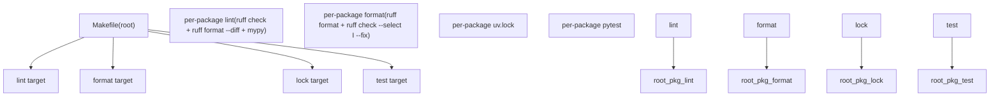
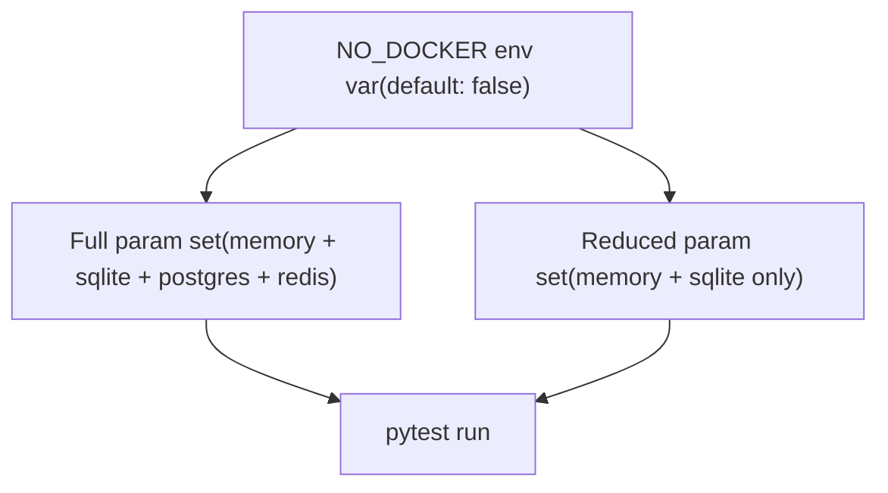

# Development Infrastructure

Relevant source files

-   [.github/ISSUE\_TEMPLATE/bug-report.yml](https://github.com/langchain-ai/langgraph/blob/1fd51e8f/.github/ISSUE_TEMPLATE/bug-report.yml)
-   [.github/ISSUE\_TEMPLATE/config.yml](https://github.com/langchain-ai/langgraph/blob/1fd51e8f/.github/ISSUE_TEMPLATE/config.yml)
-   [.github/ISSUE\_TEMPLATE/privileged.yml](https://github.com/langchain-ai/langgraph/blob/1fd51e8f/.github/ISSUE_TEMPLATE/privileged.yml)
-   [.github/PULL\_REQUEST\_TEMPLATE.md](https://github.com/langchain-ai/langgraph/blob/1fd51e8f/.github/PULL_REQUEST_TEMPLATE.md?plain=1)
-   [.github/actions/uv\_setup/action.yml](https://github.com/langchain-ai/langgraph/blob/1fd51e8f/.github/actions/uv_setup/action.yml)
-   [.github/workflows/\_integration\_test.yml](https://github.com/langchain-ai/langgraph/blob/1fd51e8f/.github/workflows/_integration_test.yml)
-   [.github/workflows/\_lint.yml](https://github.com/langchain-ai/langgraph/blob/1fd51e8f/.github/workflows/_lint.yml)
-   [.github/workflows/\_test.yml](https://github.com/langchain-ai/langgraph/blob/1fd51e8f/.github/workflows/_test.yml)
-   [.github/workflows/\_test\_langgraph.yml](https://github.com/langchain-ai/langgraph/blob/1fd51e8f/.github/workflows/_test_langgraph.yml)
-   [.github/workflows/\_test\_release.yml](https://github.com/langchain-ai/langgraph/blob/1fd51e8f/.github/workflows/_test_release.yml)
-   [.github/workflows/baseline.yml](https://github.com/langchain-ai/langgraph/blob/1fd51e8f/.github/workflows/baseline.yml)
-   [.github/workflows/bench.yml](https://github.com/langchain-ai/langgraph/blob/1fd51e8f/.github/workflows/bench.yml)
-   [.github/workflows/ci.yml](https://github.com/langchain-ai/langgraph/blob/1fd51e8f/.github/workflows/ci.yml)
-   [.github/workflows/release.yml](https://github.com/langchain-ai/langgraph/blob/1fd51e8f/.github/workflows/release.yml)
-   [.github/workflows/uv\_lock\_ugprade.yml](https://github.com/langchain-ai/langgraph/blob/1fd51e8f/.github/workflows/uv_lock_ugprade.yml)
-   [AGENTS.md](https://github.com/langchain-ai/langgraph/blob/1fd51e8f/AGENTS.md?plain=1)
-   [CLAUDE.md](https://github.com/langchain-ai/langgraph/blob/1fd51e8f/CLAUDE.md?plain=1)
-   [libs/checkpoint-postgres/Makefile](https://github.com/langchain-ai/langgraph/blob/1fd51e8f/libs/checkpoint-postgres/Makefile)
-   [libs/checkpoint-postgres/tests/compose-postgres.yml](https://github.com/langchain-ai/langgraph/blob/1fd51e8f/libs/checkpoint-postgres/tests/compose-postgres.yml)
-   [libs/checkpoint-sqlite/Makefile](https://github.com/langchain-ai/langgraph/blob/1fd51e8f/libs/checkpoint-sqlite/Makefile)
-   [libs/checkpoint/Makefile](https://github.com/langchain-ai/langgraph/blob/1fd51e8f/libs/checkpoint/Makefile)
-   [libs/cli/Makefile](https://github.com/langchain-ai/langgraph/blob/1fd51e8f/libs/cli/Makefile)
-   [libs/langgraph/Makefile](https://github.com/langchain-ai/langgraph/blob/1fd51e8f/libs/langgraph/Makefile)
-   [libs/langgraph/tests/conftest.py](https://github.com/langchain-ai/langgraph/blob/1fd51e8f/libs/langgraph/tests/conftest.py)
-   [libs/prebuilt/Makefile](https://github.com/langchain-ai/langgraph/blob/1fd51e8f/libs/prebuilt/Makefile)
-   [libs/prebuilt/tests/any\_str.py](https://github.com/langchain-ai/langgraph/blob/1fd51e8f/libs/prebuilt/tests/any_str.py)
-   [libs/prebuilt/tests/memory\_assert.py](https://github.com/langchain-ai/langgraph/blob/1fd51e8f/libs/prebuilt/tests/memory_assert.py)
-   [libs/prebuilt/tests/messages.py](https://github.com/langchain-ai/langgraph/blob/1fd51e8f/libs/prebuilt/tests/messages.py)
-   [libs/sdk-py/Makefile](https://github.com/langchain-ai/langgraph/blob/1fd51e8f/libs/sdk-py/Makefile)

This page provides an overview of the tooling and automation that supports development across the LangGraph monorepo. It covers the build system conventions, testing infrastructure, CI/CD pipelines, and release process at a high level.

For detailed information on individual topics, see:

-   [Monorepo Structure and Build System](/langchain-ai/langgraph/9.1-monorepo-structure-and-build-system)
-   [Testing Infrastructure](/langchain-ai/langgraph/9.2-testing-infrastructure)
-   [CI/CD Workflows](/langchain-ai/langgraph/9.3-cicd-workflows)
-   [Release Process](/langchain-ai/langgraph/9.4-release-process)

---

## Repository Layout

All publishable packages live under the `libs/` directory. The root of the repository contains a top-level `Makefile` that orchestrates operations across every package.

```
langgraph/               ← repository root
├── Makefile             ← root orchestrator
└── libs/
    ├── langgraph/       ← core library
    ├── checkpoint/      ← base checkpoint interfaces
    ├── checkpoint-postgres/
    ├── checkpoint-sqlite/
    ├── checkpoint-conformance/ ← interface compliance tests
    ├── prebuilt/        ← prebuilt nodes and agents
    ├── sdk-py/          ← Python SDK client
    └── cli/             ← Command line interface
```
Each package under `libs/` owns its own `Makefile`, `pyproject.toml`, and `uv.lock`. The root `Makefile` iterates over `libs/*` and delegates to each package's `Makefile`.

Sources: [Makefile1-64](https://github.com/langchain-ai/langgraph/blob/1fd51e8f/Makefile#L1-L64) [libs/langgraph/Makefile1-161](https://github.com/langchain-ai/langgraph/blob/1fd51e8f/libs/langgraph/Makefile#L1-L161)

---

## Build System Overview

**Build System Diagram**


Sources: [Makefile1-64](https://github.com/langchain-ai/langgraph/blob/1fd51e8f/Makefile#L1-L64)

### Standard Per-Package Make Targets

Every package under `libs/` exposes a consistent set of `make` targets:

| Target | Tool(s) | Description |
| --- | --- | --- |
| `lint` | `ruff check`, `ruff format --diff`, `mypy` | Static analysis and format check |
| `format` | `ruff format`, `ruff check --select I --fix` | Apply formatting and import sorting |
| `type` | `mypy` | Type checking only |
| `test` | `pytest` | Run unit tests (with Docker services if available) |
| `test_parallel` | `pytest -n auto` | Run tests in parallel using `xdist` |
| `test_watch` | `pytest-watch` (`ptw`) | Re-run tests on file change |
| `coverage` | `pytest --cov` | Run tests and emit a coverage report |
| `spell_check` | `codespell` | Spell check source files |
| `spell_fix` | `codespell -w` | Auto-fix spelling errors |

The `lock` target at the root runs `uv lock` in each package directory to regenerate lock files. `lock-upgrade` does the same with `--upgrade` to pull in newer dependency versions.

Sources: [Makefile40-58](https://github.com/langchain-ai/langgraph/blob/1fd51e8f/Makefile#L40-L58) [libs/langgraph/Makefile14-139](https://github.com/langchain-ai/langgraph/blob/1fd51e8f/libs/langgraph/Makefile#L14-L139) [libs/prebuilt/Makefile1-86](https://github.com/langchain-ai/langgraph/blob/1fd51e8f/libs/prebuilt/Makefile#L1-L86) [libs/checkpoint/Makefile1-41](https://github.com/langchain-ai/langgraph/blob/1fd51e8f/libs/checkpoint/Makefile#L1-L41) [libs/checkpoint-sqlite/Makefile1-41](https://github.com/langchain-ai/langgraph/blob/1fd51e8f/libs/checkpoint-sqlite/Makefile#L1-L41) [libs/checkpoint-postgres/Makefile1-70](https://github.com/langchain-ai/langgraph/blob/1fd51e8f/libs/checkpoint-postgres/Makefile#L1-L70) [libs/cli/Makefile1-44](https://github.com/langchain-ai/langgraph/blob/1fd51e8f/libs/cli/Makefile#L1-L44) [libs/sdk-py/Makefile1-27](https://github.com/langchain-ai/langgraph/blob/1fd51e8f/libs/sdk-py/Makefile#L1-L27)

---

## Dependency Management

All packages use [\`uv\`](https://github.com/langchain-ai/langgraph/blob/1fd51e8f/`uv`) for dependency resolution and virtual environment management.

-   Each package has its own `pyproject.toml` and `uv.lock`.
-   The root `Makefile` `install` target creates a shared venv and installs all packages as editable installs via `uv pip install -e`.
-   The `libs/langgraph` package uses `uv sync --frozen --all-extras --all-packages --group dev` to install the full development environment in one step [libs/langgraph/Makefile14-15](https://github.com/langchain-ai/langgraph/blob/1fd51e8f/libs/langgraph/Makefile#L14-L15)

---

## Testing Infrastructure

**Test Fixture Dependency Diagram**

```mermaid
flowchart TD
    conftest["libs/langgraph/tests/conftest.py"]
    conftest_cp["tests/conftest_checkpointer.py"]
    conftest_st["tests/conftest_store.py"]
    f_sync_checkpointer["sync_checkpointer fixture(memory, sqlite, sqlite_aes,postgres, postgres_pipe, postgres_pool)"]
    f_async_checkpointer["async_checkpointer fixture(memory, sqlite_aio,postgres_aio, postgres_aio_pipe,postgres_aio_pool)"]
    f_sync_store["sync_store fixture(in_memory, postgres,postgres_pipe, postgres_pool)"]
    f_async_store["async_store fixture(in_memory, postgres_aio,postgres_aio_pipe, postgres_aio_pool)"]
    f_cache["cache fixture(sqlite, memory, redis)"]
    f_deterministic["deterministic_uuids fixture(mocks uuid.uuid4)"]
    NO_DOCKER["NO_DOCKER env var"]

    conftest --> conftest_cp
    conftest --> conftest_st
    conftest --> f_sync_checkpointer
    conftest --> f_async_checkpointer
    conftest --> f_sync_store
    conftest --> f_async_store
    conftest --> f_cache
    conftest --> f_deterministic
    NO --> DOCKER_f_sync_checkpointer
    NO --> DOCKER_f_async_checkpointer
    NO --> DOCKER_f_sync_store
    NO --> DOCKER_f_async_store
    NO --> DOCKER_f_cache
```


Sources: [libs/langgraph/tests/conftest.py1-227](https://github.com/langchain-ai/langgraph/blob/1fd51e8f/libs/langgraph/tests/conftest.py#L1-L227)

### Test Fixtures

The central fixture file is [libs/langgraph/tests/conftest.py](https://github.com/langchain-ai/langgraph/blob/1fd51e8f/libs/langgraph/tests/conftest.py) which assembles parameterized fixtures that cover every supported backend combination. Each fixture is `scope="function"` and yields a fully initialized backend instance.

**Fixture parameter sets (when Docker is available):**

| Fixture | Parameters |
| --- | --- |
| `sync_checkpointer` | `memory`, `memory_migrate_sends`, `sqlite`, `sqlite_aes`, `postgres`, `postgres_pipe`, `postgres_pool` |
| `async_checkpointer` | `memory`, `sqlite_aio`, `postgres_aio`, `postgres_aio_pipe`, `postgres_aio_pool` |
| `sync_store` | `in_memory`, `postgres`, `postgres_pipe`, `postgres_pool` |
| `async_store` | `in_memory`, `postgres_aio`, `postgres_aio_pipe`, `postgres_aio_pool` |
| `cache` | `sqlite`, `memory`, `redis` |

When `NO_DOCKER=true`, Postgres and Redis variants are excluded, leaving only in-process backends.

### `NO_DOCKER` Control Flow


Sources: [libs/langgraph/tests/conftest.py39-89](https://github.com/langchain-ai/langgraph/blob/1fd51e8f/libs/langgraph/tests/conftest.py#L39-L89)

### Docker Service Management

Integration tests that require PostgreSQL or Redis use Docker Compose. The `langgraph` package's `Makefile` defines:

-   `start-services` — starts both `tests/compose-postgres.yml` and `tests/compose-redis.yml`, waiting for health checks to pass [libs/langgraph/Makefile40-41](https://github.com/langchain-ai/langgraph/blob/1fd51e8f/libs/langgraph/Makefile#L40-L41)
-   `stop-services` — tears down the containers and volumes [libs/langgraph/Makefile43-44](https://github.com/langchain-ai/langgraph/blob/1fd51e8f/libs/langgraph/Makefile#L43-L44)

The `test` target conditionally runs `start-services` and `start-dev-server` around the `pytest` invocation [libs/langgraph/Makefile61-74](https://github.com/langchain-ai/langgraph/blob/1fd51e8f/libs/langgraph/Makefile#L61-L74)

### Test Utility Classes

Several helper types used across test suites are defined in `libs/prebuilt/tests/`:

| Class / Function | File | Purpose |
| --- | --- | --- |
| `AnyStr` | [libs/prebuilt/tests/any\_str.py](https://github.com/langchain-ai/langgraph/blob/1fd51e8f/libs/prebuilt/tests/any_str.py) | A `str` subclass whose `__eq__` matches any string with a given prefix or regex pattern. Used to assert on message IDs without knowing their exact value. |
| `MemorySaverAssertImmutable` | [libs/prebuilt/tests/memory\_assert.py](https://github.com/langchain-ai/langgraph/blob/1fd51e8f/libs/prebuilt/tests/memory_assert.py) | Extends `InMemorySaver` to assert that checkpoints are never mutated after being written. |
| `_AnyIdHumanMessage` / `_AnyIdToolMessage` | [libs/prebuilt/tests/messages.py](https://github.com/langchain-ai/langgraph/blob/1fd51e8f/libs/prebuilt/tests/messages.py) | Factory functions that create LangChain message objects with an `AnyStr` id, working around a Pydantic `__eq__` issue. |

The `deterministic_uuids` fixture in [libs/langgraph/tests/conftest.py47-52](https://github.com/langchain-ai/langgraph/blob/1fd51e8f/libs/langgraph/tests/conftest.py#L47-L52) patches `uuid.uuid4` to emit a predictable sequence of UUIDs, making snapshot-style assertions stable across runs.

---

## Benchmarking

The `libs/langgraph` package includes benchmarking utilities to detect performance regressions.

| Target | Command | Description |
| --- | --- | --- |
| `benchmark` | `python -m bench -o out/benchmark.json --rigorous` | Full benchmark run |
| `benchmark-fast` | `python -m bench -o out/benchmark.json --fast` | Quick benchmark run for CI |
| `profile` | `py-spy record -g -o out/profile.svg -- python $(GRAPH)` | Flame graph profiling of a specific graph script |

The `bench.yml` workflow runs benchmarks on pull requests and compares them against a baseline stored in the GitHub Actions cache [.github/workflows/bench.yml1-72](https://github.com/langchain-ai/langgraph/blob/1fd51e8f/.github/workflows/bench.yml#L1-L72) Baselines are updated on every push to `main` [.github/workflows/baseline.yml1-38](https://github.com/langchain-ai/langgraph/blob/1fd51e8f/.github/workflows/baseline.yml#L1-L38)

Sources: [libs/langgraph/Makefile17-31](https://github.com/langchain-ai/langgraph/blob/1fd51e8f/libs/langgraph/Makefile#L17-L31) [.github/workflows/bench.yml41-58](https://github.com/langchain-ai/langgraph/blob/1fd51e8f/.github/workflows/bench.yml#L41-L58)

---

## CI/CD and Release

The GitHub Actions workflows, automated dependency lock upgrades, and PyPI publishing pipelines are described in detail in [CI/CD Workflows](/langchain-ai/langgraph/9.3-cicd-workflows) and [Release Process](/langchain-ai/langgraph/9.4-release-process).

The CI pipeline uses a `changes` job to detect which packages need linting and testing based on modified paths [.github/workflows/ci.yml26-50](https://github.com/langchain-ai/langgraph/blob/1fd51e8f/.github/workflows/ci.yml#L26-L50) It aggregates results into a final `ci_success` job to provide a single status check for pull requests [.github/workflows/ci.yml159-183](https://github.com/langchain-ai/langgraph/blob/1fd51e8f/.github/workflows/ci.yml#L159-L183)

The CLI package exposes an `update-schema` target that regenerates the `langgraph.json` JSON Schema from source, which is verified during CI to ensure the schema stays in sync with the code [.github/workflows/ci.yml116-151](https://github.com/langchain-ai/langgraph/blob/1fd51e8f/.github/workflows/ci.yml#L116-L151)

Sources: [.github/workflows/ci.yml1-184](https://github.com/langchain-ai/langgraph/blob/1fd51e8f/.github/workflows/ci.yml#L1-L184) [libs/cli/Makefile39-43](https://github.com/langchain-ai/langgraph/blob/1fd51e8f/libs/cli/Makefile#L39-L43)
