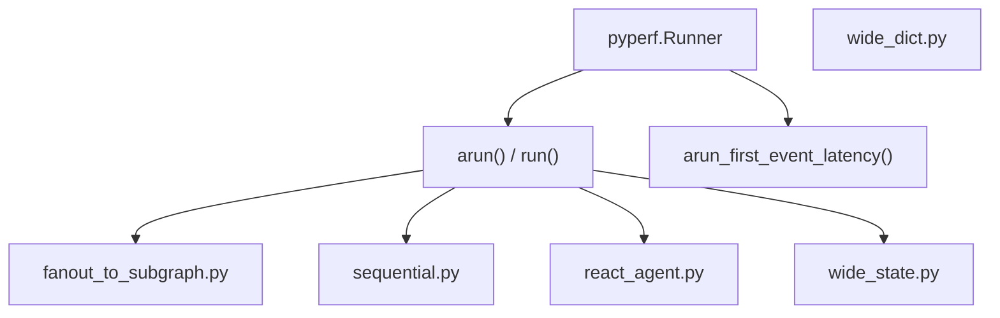

# Testing Infrastructure

Relevant source files

-   [libs/checkpoint-conformance/langgraph/checkpoint/conformance/test\_utils.py](https://github.com/langchain-ai/langgraph/blob/1fd51e8f/libs/checkpoint-conformance/langgraph/checkpoint/conformance/test_utils.py)
-   [libs/checkpoint-conformance/uv.lock](https://github.com/langchain-ai/langgraph/blob/1fd51e8f/libs/checkpoint-conformance/uv.lock)
-   [libs/checkpoint-postgres/Makefile](https://github.com/langchain-ai/langgraph/blob/1fd51e8f/libs/checkpoint-postgres/Makefile)
-   [libs/checkpoint-postgres/tests/compose-postgres.yml](https://github.com/langchain-ai/langgraph/blob/1fd51e8f/libs/checkpoint-postgres/tests/compose-postgres.yml)
-   [libs/checkpoint-sqlite/Makefile](https://github.com/langchain-ai/langgraph/blob/1fd51e8f/libs/checkpoint-sqlite/Makefile)
-   [libs/checkpoint/Makefile](https://github.com/langchain-ai/langgraph/blob/1fd51e8f/libs/checkpoint/Makefile)
-   [libs/cli/Makefile](https://github.com/langchain-ai/langgraph/blob/1fd51e8f/libs/cli/Makefile)
-   [libs/langgraph/Makefile](https://github.com/langchain-ai/langgraph/blob/1fd51e8f/libs/langgraph/Makefile)
-   [libs/langgraph/bench/\_\_main\_\_.py](https://github.com/langchain-ai/langgraph/blob/1fd51e8f/libs/langgraph/bench/__main__.py)
-   [libs/langgraph/bench/fanout\_to\_subgraph.py](https://github.com/langchain-ai/langgraph/blob/1fd51e8f/libs/langgraph/bench/fanout_to_subgraph.py)
-   [libs/langgraph/bench/pydantic\_state.py](https://github.com/langchain-ai/langgraph/blob/1fd51e8f/libs/langgraph/bench/pydantic_state.py)
-   [libs/langgraph/bench/react\_agent.py](https://github.com/langchain-ai/langgraph/blob/1fd51e8f/libs/langgraph/bench/react_agent.py)
-   [libs/langgraph/bench/sequential.py](https://github.com/langchain-ai/langgraph/blob/1fd51e8f/libs/langgraph/bench/sequential.py)
-   [libs/langgraph/bench/wide\_dict.py](https://github.com/langchain-ai/langgraph/blob/1fd51e8f/libs/langgraph/bench/wide_dict.py)
-   [libs/langgraph/bench/wide\_state.py](https://github.com/langchain-ai/langgraph/blob/1fd51e8f/libs/langgraph/bench/wide_state.py)
-   [libs/langgraph/tests/conftest.py](https://github.com/langchain-ai/langgraph/blob/1fd51e8f/libs/langgraph/tests/conftest.py)
-   [libs/prebuilt/Makefile](https://github.com/langchain-ai/langgraph/blob/1fd51e8f/libs/prebuilt/Makefile)
-   [libs/prebuilt/tests/any\_str.py](https://github.com/langchain-ai/langgraph/blob/1fd51e8f/libs/prebuilt/tests/any_str.py)
-   [libs/prebuilt/tests/memory\_assert.py](https://github.com/langchain-ai/langgraph/blob/1fd51e8f/libs/prebuilt/tests/memory_assert.py)
-   [libs/prebuilt/tests/messages.py](https://github.com/langchain-ai/langgraph/blob/1fd51e8f/libs/prebuilt/tests/messages.py)
-   [libs/sdk-py/Makefile](https://github.com/langchain-ai/langgraph/blob/1fd51e8f/libs/sdk-py/Makefile)

This page documents the pytest fixture system, test utilities, benchmarking suite, and service management used across the LangGraph monorepo. The infrastructure is designed to validate core graph logic, persistence layers (checkpointers), and cross-thread storage (stores) across multiple database backends and concurrency models.

---

## Overview

The test suite is built around a parameterized pytest fixture system that runs the same test logic against multiple backend implementations (In-Memory, SQLite, PostgreSQL, Redis). Fixtures are conditionally parameterized at collection time based on the `NO_DOCKER` environment variable, which determines whether Docker-dependent backends like PostgreSQL and Redis are included in the test matrix.

The central configuration is defined in `libs/langgraph/tests/conftest.py`, which wires together checkpointer, store, and cache fixtures.

---

## Fixture Architecture

The following diagram illustrates how high-level fixtures (e.g., `sync_checkpointer`) delegate to specific backend implementation factories.

**Fixture Dependency Diagram**

```mermaid
flowchart TD
    SC["sync_checkpointer(Iterator[BaseCheckpointSaver])"]
    AC["async_checkpointer(AsyncIterator[BaseCheckpointSaver])"]
    SS["sync_store(Iterator[BaseStore])"]
    AS["async_store(AsyncIterator[BaseStore])"]
    CF["cache(Iterator[BaseCache])"]
    DU["durabilityLiteral[sync,async,exit]"]
    DUUID["deterministic_uuids"]
    CM["_checkpointer_memory()"]
    CMS["_checkpointer_memory_migrate_sends()"]
    CS["_checkpointer_sqlite()"]
    CSA["_checkpointer_sqlite_aes()"]
    CSAI["_checkpointer_sqlite_aio()"]
    CP["_checkpointer_postgres()"]
    CPP["_checkpointer_postgres_pipe()"]
    CPPO["_checkpointer_postgres_pool()"]
    CPAIO["_checkpointer_postgres_aio()"]
    SM["_store_memory()"]
    SP["_store_postgres()"]
    SPAIO["_store_postgres_aio()"]

    SC --> CM
    SC --> CMS
    SC --> CS
    SC --> CSA
    SC --> CP
    SC --> CPP
    SC --> CPPO
    AC --> CM
    AC --> CSAI
    AC --> CPAIO
    SS --> SM
    SS --> SP
    AS --> SM
    AS --> SPAIO
```

Sources: [libs/langgraph/tests/conftest.py1-227](https://github.com/langchain-ai/langgraph/blob/1fd51e8f/libs/langgraph/tests/conftest.py#L1-L227) [libs/langgraph/tests/conftest\_checkpointer.py16-28](https://github.com/langchain-ai/langgraph/blob/1fd51e8f/libs/langgraph/tests/conftest_checkpointer.py#L16-L28) [libs/langgraph/tests/conftest\_store.py29-37](https://github.com/langchain-ai/langgraph/blob/1fd51e8f/libs/langgraph/tests/conftest_store.py#L29-L37)

---

## The `NO_DOCKER` Environment Variable

[libs/langgraph/tests/conftest.py39](https://github.com/langchain-ai/langgraph/blob/1fd51e8f/libs/langgraph/tests/conftest.py#L39-L39) reads: `NO_DOCKER = os.getenv("NO_DOCKER", "false") == "true"`

This boolean gates the parameterization of all Docker-dependent fixtures. When `NO_DOCKER=true`, fixtures fall back to in-process backends (Memory/SQLite).

**Effect on Fixture Parameterization**

| Fixture | `NO_DOCKER=false` (default) | `NO_DOCKER=true` |
| --- | --- | --- |
| `sync_checkpointer` | memory, memory\_migrate\_sends, sqlite, sqlite\_aes, postgres, postgres\_pipe, postgres\_pool | memory, sqlite, sqlite\_aes |
| `async_checkpointer` | memory, sqlite\_aio, postgres\_aio, postgres\_aio\_pipe, postgres\_aio\_pool | memory, sqlite\_aio |
| `sync_store` | in\_memory, postgres, postgres\_pipe, postgres\_pool | in\_memory |
| `async_store` | in\_memory, postgres\_aio, postgres\_aio\_pipe, postgres\_aio\_pool | in\_memory |
| `cache` | sqlite, memory, redis | sqlite, memory |

Sources: [libs/langgraph/tests/conftest.py60-205](https://github.com/langchain-ai/langgraph/blob/1fd51e8f/libs/langgraph/tests/conftest.py#L60-L205)

---

## Checkpointer and Store Fixtures

### Checkpointer Fixtures

-   **`sync_checkpointer`**: A function-scoped fixture yielding a `BaseCheckpointSaver`. It tests multiple implementations including `SqliteSaver` (with and without AES encryption) and `PostgresSaver` (with pipeline and pool variants) [libs/langgraph/tests/conftest.py162-188](https://github.com/langchain-ai/langgraph/blob/1fd51e8f/libs/langgraph/tests/conftest.py#L162-L188)
-   **`async_checkpointer`**: An async fixture yielding `BaseCheckpointSaver` for tests marked with `pytest.mark.anyio`. It includes `AsyncSqliteSaver` and `AsyncPostgresSaver` variants [libs/langgraph/tests/conftest.py206-226](https://github.com/langchain-ai/langgraph/blob/1fd51e8f/libs/langgraph/tests/conftest.py#L206-L226)

### Store Fixtures

-   **`sync_store` / `async_store`**: Function-scoped fixtures yielding `BaseStore`. These provide `InMemoryStore`, `PostgresStore`, and `AsyncPostgresStore` for cross-thread persistent storage testing [libs/langgraph/tests/conftest.py92-141](https://github.com/langchain-ai/langgraph/blob/1fd51e8f/libs/langgraph/tests/conftest.py#L92-L141)

---

## Cache Fixture

The `cache` fixture [libs/langgraph/tests/conftest.py60-89](https://github.com/langchain-ai/langgraph/blob/1fd51e8f/libs/langgraph/tests/conftest.py#L60-L89) provides implementations of `BaseCache`:

-   `SqliteCache(path=":memory:")`
-   `InMemoryCache()`
-   `RedisCache`: Connects to `localhost:6379`. To support parallel testing via `pytest-xdist`, it uses a worker-specific prefix (e.g., `test:cache:{worker_id}:*`) and performs cleanup in the fixture teardown [libs/langgraph/tests/conftest.py70-87](https://github.com/langchain-ai/langgraph/blob/1fd51e8f/libs/langgraph/tests/conftest.py#L70-L87)

---

## Benchmarking Infrastructure

LangGraph includes a dedicated benchmarking suite in `libs/langgraph/bench/` to track execution performance and latency across various graph topologies.

**Benchmarking Components**

### Key Benchmarking Scenarios

-   **Fanout to Subgraph**: Measures performance of `Send` primitives and nested graph execution [libs/langgraph/bench/fanout\_to\_subgraph.py11-108](https://github.com/langchain-ai/langgraph/blob/1fd51e8f/libs/langgraph/bench/fanout_to_subgraph.py#L11-L108)
-   **Sequential**: Creates a no-op graph with thousands of nodes to measure Pregel overhead [libs/langgraph/bench/sequential.py7-28](https://github.com/langchain-ai/langgraph/blob/1fd51e8f/libs/langgraph/bench/sequential.py#L7-L28)
-   **Wide State**: Tests performance with large state objects containing hundreds of fields and complex reducers [libs/langgraph/bench/wide\_state.py12-135](https://github.com/langchain-ai/langgraph/blob/1fd51e8f/libs/langgraph/bench/wide_state.py#L12-L135)
-   **Latency**: The `arun_first_event_latency` function measures the time taken to receive the first event from a stream [libs/langgraph/bench/\_\_main\_\_.py36-55](https://github.com/langchain-ai/langgraph/blob/1fd51e8f/libs/langgraph/bench/__main__.py#L36-L55)

Sources: [libs/langgraph/bench/\_\_main\_\_.py1-100](https://github.com/langchain-ai/langgraph/blob/1fd51e8f/libs/langgraph/bench/__main__.py#L1-L100) [libs/langgraph/bench/sequential.py1-40](https://github.com/langchain-ai/langgraph/blob/1fd51e8f/libs/langgraph/bench/sequential.py#L1-L40) [libs/langgraph/bench/fanout\_to\_subgraph.py1-110](https://github.com/langchain-ai/langgraph/blob/1fd51e8f/libs/langgraph/bench/fanout_to_subgraph.py#L1-L110)

---

## Service Management and Makefile Targets

The `libs/langgraph/Makefile` orchestrates the testing environment, including Docker services and a local development server for integration tests.

| Make Target | Action |
| --- | --- |
| `start-services` | Starts PostgreSQL and Redis containers with `--wait` [libs/langgraph/Makefile40-41](https://github.com/langchain-ai/langgraph/blob/1fd51e8f/libs/langgraph/Makefile#L40-L41) |
| `start-dev-server` | Starts a `langgraph dev` instance for testing CLI/SDK interactions [libs/langgraph/Makefile46-48](https://github.com/langchain-ai/langgraph/blob/1fd51e8f/libs/langgraph/Makefile#L46-L48) |
| `test` | Automatically handles service lifecycle and runs `pytest` [libs/langgraph/Makefile61-74](https://github.com/langchain-ai/langgraph/blob/1fd51e8f/libs/langgraph/Makefile#L61-L74) |
| `test_parallel` | Runs tests using `pytest-xdist` with `worksteal` distribution [libs/langgraph/Makefile76-83](https://github.com/langchain-ai/langgraph/blob/1fd51e8f/libs/langgraph/Makefile#L76-L83) |
| `benchmark` | Runs the rigorous benchmarking suite and outputs to JSON [libs/langgraph/Makefile17-20](https://github.com/langchain-ai/langgraph/blob/1fd51e8f/libs/langgraph/Makefile#L17-L20) |
| `profile` | Uses `py-spy` to generate a flame graph of graph execution [libs/langgraph/Makefile29-31](https://github.com/langchain-ai/langgraph/blob/1fd51e8f/libs/langgraph/Makefile#L29-L31) |

### Multi-Version Database Testing

The `libs/checkpoint-postgres/Makefile` includes a `test` target that iterates through multiple PostgreSQL versions (e.g., 15, 16) to ensure compatibility across versions [libs/checkpoint-postgres/Makefile17-35](https://github.com/langchain-ai/langgraph/blob/1fd51e8f/libs/checkpoint-postgres/Makefile#L17-L35)

Sources: [libs/langgraph/Makefile1-103](https://github.com/langchain-ai/langgraph/blob/1fd51e8f/libs/langgraph/Makefile#L1-L103) [libs/checkpoint-postgres/Makefile1-42](https://github.com/langchain-ai/langgraph/blob/1fd51e8f/libs/checkpoint-postgres/Makefile#L1-L42)

---

## Test Helper Utilities

### Matchers and Assertions

-   **`AnyStr`**: A matcher for non-deterministic strings (like IDs) [libs/prebuilt/tests/any\_str.py4-17](https://github.com/langchain-ai/langgraph/blob/1fd51e8f/libs/prebuilt/tests/any_str.py#L4-L17)
-   **`deterministic_uuids`**: A fixture that patches `uuid.uuid4` to return a predictable sequence, essential for snapshot testing [libs/langgraph/tests/conftest.py47-52](https://github.com/langchain-ai/langgraph/blob/1fd51e8f/libs/langgraph/tests/conftest.py#L47-L52)
-   **`MemorySaverAssertImmutable`**: A specialized checkpointer that validates that the execution engine does not mutate state objects after they are saved [libs/prebuilt/tests/memory\_assert.py16-58](https://github.com/langchain-ai/langgraph/blob/1fd51e8f/libs/prebuilt/tests/memory_assert.py#L16-L58)

### Message Factories

`libs/prebuilt/tests/messages.py` provides `_AnyIdAIMessage`, `_AnyIdHumanMessage`, and `_AnyIdToolMessage` which allow testing graph outputs without asserting on specific message IDs [libs/prebuilt/tests/messages.py1-28](https://github.com/langchain-ai/langgraph/blob/1fd51e8f/libs/prebuilt/tests/messages.py#L1-L28)

Sources: [libs/langgraph/tests/conftest.py47-52](https://github.com/langchain-ai/langgraph/blob/1fd51e8f/libs/langgraph/tests/conftest.py#L47-L52) [libs/prebuilt/tests/any\_str.py1-18](https://github.com/langchain-ai/langgraph/blob/1fd51e8f/libs/prebuilt/tests/any_str.py#L1-L18) [libs/prebuilt/tests/messages.py1-28](https://github.com/langchain-ai/langgraph/blob/1fd51e8f/libs/prebuilt/tests/messages.py#L1-L28) [libs/prebuilt/tests/memory\_assert.py1-60](https://github.com/langchain-ai/langgraph/blob/1fd51e8f/libs/prebuilt/tests/memory_assert.py#L1-L60)
