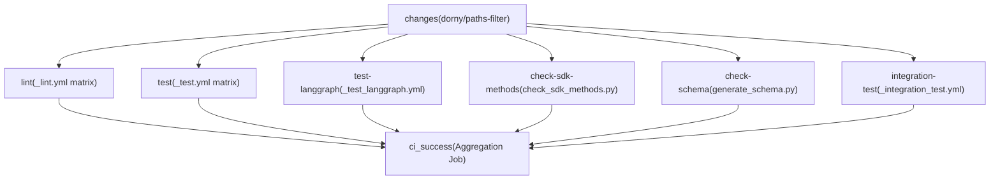
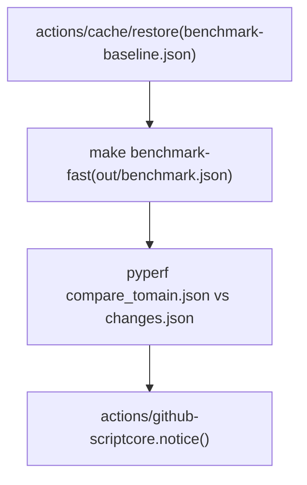
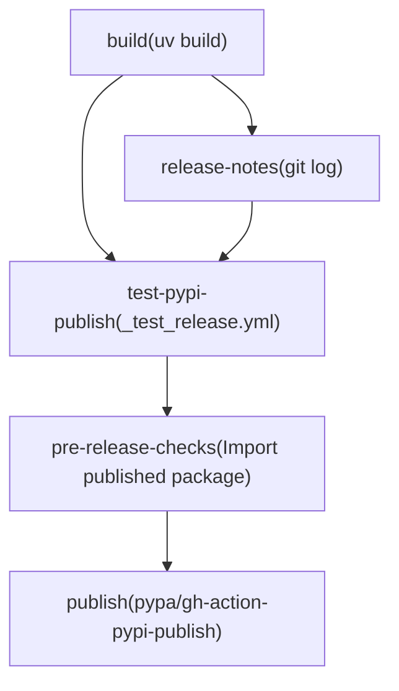

# CI/CD Workflows

Relevant source files

-   [.github/ISSUE\_TEMPLATE/bug-report.yml](https://github.com/langchain-ai/langgraph/blob/1fd51e8f/.github/ISSUE_TEMPLATE/bug-report.yml)
-   [.github/ISSUE\_TEMPLATE/config.yml](https://github.com/langchain-ai/langgraph/blob/1fd51e8f/.github/ISSUE_TEMPLATE/config.yml)
-   [.github/ISSUE\_TEMPLATE/privileged.yml](https://github.com/langchain-ai/langgraph/blob/1fd51e8f/.github/ISSUE_TEMPLATE/privileged.yml)
-   [.github/PULL\_REQUEST\_TEMPLATE.md](https://github.com/langchain-ai/langgraph/blob/1fd51e8f/.github/PULL_REQUEST_TEMPLATE.md?plain=1)
-   [.github/actions/uv\_setup/action.yml](https://github.com/langchain-ai/langgraph/blob/1fd51e8f/.github/actions/uv_setup/action.yml)
-   [.github/workflows/\_integration\_test.yml](https://github.com/langchain-ai/langgraph/blob/1fd51e8f/.github/workflows/_integration_test.yml)
-   [.github/workflows/\_lint.yml](https://github.com/langchain-ai/langgraph/blob/1fd51e8f/.github/workflows/_lint.yml)
-   [.github/workflows/\_test.yml](https://github.com/langchain-ai/langgraph/blob/1fd51e8f/.github/workflows/_test.yml)
-   [.github/workflows/\_test\_langgraph.yml](https://github.com/langchain-ai/langgraph/blob/1fd51e8f/.github/workflows/_test_langgraph.yml)
-   [.github/workflows/\_test\_release.yml](https://github.com/langchain-ai/langgraph/blob/1fd51e8f/.github/workflows/_test_release.yml)
-   [.github/workflows/baseline.yml](https://github.com/langchain-ai/langgraph/blob/1fd51e8f/.github/workflows/baseline.yml)
-   [.github/workflows/bench.yml](https://github.com/langchain-ai/langgraph/blob/1fd51e8f/.github/workflows/bench.yml)
-   [.github/workflows/ci.yml](https://github.com/langchain-ai/langgraph/blob/1fd51e8f/.github/workflows/ci.yml)
-   [.github/workflows/release.yml](https://github.com/langchain-ai/langgraph/blob/1fd51e8f/.github/workflows/release.yml)
-   [.github/workflows/uv\_lock\_ugprade.yml](https://github.com/langchain-ai/langgraph/blob/1fd51e8f/.github/workflows/uv_lock_ugprade.yml)
-   [AGENTS.md](https://github.com/langchain-ai/langgraph/blob/1fd51e8f/AGENTS.md?plain=1)
-   [CLAUDE.md](https://github.com/langchain-ai/langgraph/blob/1fd51e8f/CLAUDE.md?plain=1)

This page documents all GitHub Actions workflows in the LangGraph monorepo: the main CI pipeline, reusable job workflows, benchmarking pipelines, the weekly dependency lock upgrade, and the release workflow. For the release process itself (PyPI publishing, tagging, and release notes), see [9.4](https://github.com/langchain-ai/langgraph/blob/1fd51e8f/9.4) For test infrastructure details (fixtures, Docker services, conftest setup), see [9.2](https://github.com/langchain-ai/langgraph/blob/1fd51e8f/9.2) For the monorepo build system and `make` targets that these workflows invoke, see [9.1](https://github.com/langchain-ai/langgraph/blob/1fd51e8f/9.1)

---

## Workflow Inventory

All workflow files live under `.github/workflows/`. Filenames prefixed with `_` are reusable workflows, invoked via `workflow_call` from other workflows.

| File | Name | Trigger | Purpose |
| --- | --- | --- | --- |
| `ci.yml` | CI | `push` to `main`, `pull_request` | Orchestrates lint, test, schema and integration checks [.github/workflows/ci.yml1-10](https://github.com/langchain-ai/langgraph/blob/1fd51e8f/.github/workflows/ci.yml#L1-L10) |
| `_lint.yml` | lint | `workflow_call` | Runs ruff and mypy per package [.github/workflows/\_lint.yml1-10](https://github.com/langchain-ai/langgraph/blob/1fd51e8f/.github/workflows/_lint.yml#L1-L10) |
| `_test.yml` | test | `workflow_call` | Runs `make test` per package across Python versions [.github/workflows/\_test.yml1-10](https://github.com/langchain-ai/langgraph/blob/1fd51e8f/.github/workflows/_test.yml#L1-L10) |
| `_test_langgraph.yml` | test | `workflow_call` | Runs `make test_parallel` for `libs/langgraph` specifically [.github/workflows/\_test\_langgraph.yml1-10](https://github.com/langchain-ai/langgraph/blob/1fd51e8f/.github/workflows/_test_langgraph.yml#L1-L10) |
| `_integration_test.yml` | CLI integration test | `workflow_call` | Builds and smoke-tests Docker images via `langgraph build` [.github/workflows/\_integration\_test.yml1-10](https://github.com/langchain-ai/langgraph/blob/1fd51e8f/.github/workflows/_integration_test.yml#L1-L10) |
| `bench.yml` | bench | `pull_request` on `libs/**` | Runs benchmarks and compares to baseline [.github/workflows/bench.yml1-10](https://github.com/langchain-ai/langgraph/blob/1fd51e8f/.github/workflows/bench.yml#L1-L10) |
| `baseline.yml` | baseline | `push` to `main`, `workflow_dispatch` | Saves benchmark baseline to cache [.github/workflows/baseline.yml1-10](https://github.com/langchain-ai/langgraph/blob/1fd51e8f/.github/workflows/baseline.yml#L1-L10) |
| `uv_lock_ugprade.yml` | UV Lock Upgrade | Weekly cron, `workflow_dispatch` | Runs `make lock-upgrade` and opens a PR [.github/workflows/uv\_lock\_ugprade.yml1-10](https://github.com/langchain-ai/langgraph/blob/1fd51e8f/.github/workflows/uv_lock_ugprade.yml#L1-L10) |
| `release.yml` | release | `workflow_dispatch` | Full release pipeline (build → test PyPI → pre-check → publish → tag) [.github/workflows/release.yml1-10](https://github.com/langchain-ai/langgraph/blob/1fd51e8f/.github/workflows/release.yml#L1-L10) |
| `_test_release.yml` | test-release | `workflow_call` | Builds and publishes to test PyPI [.github/workflows/\_test\_release.yml1-10](https://github.com/langchain-ai/langgraph/blob/1fd51e8f/.github/workflows/_test_release.yml#L1-L10) |

---

## Main CI Pipeline (`ci.yml`)

The CI workflow is the primary gate on all pull requests and pushes to `main`.

### Concurrency

A concurrency group keyed on `${{ github.workflow }}-${{ github.ref }}` ensures that if a new push arrives while CI is still running for the same branch, the older run is cancelled [.github/workflows/ci.yml21-23](https://github.com/langchain-ai/langgraph/blob/1fd51e8f/.github/workflows/ci.yml#L21-L23)

### Path Filtering (`changes` job)

The first job uses the `dorny/paths-filter` action to determine which areas of the repository changed [.github/workflows/ci.yml26-50](https://github.com/langchain-ai/langgraph/blob/1fd51e8f/.github/workflows/ci.yml#L26-L50) Two output flags control downstream jobs:

| Flag | Paths Watched |
| --- | --- |
| `python` | `libs/langgraph/**`, `libs/sdk-py/**`, `libs/cli/**`, `libs/checkpoint/**`, `libs/checkpoint-sqlite/**`, `libs/checkpoint-postgres/**`, `libs/checkpoint-conformance/**`, `libs/prebuilt/**` [.github/workflows/ci.yml38-46](https://github.com/langchain-ai/langgraph/blob/1fd51e8f/.github/workflows/ci.yml#L38-L46) |
| `deps` | `**/pyproject.toml`, `**/uv.lock` [.github/workflows/ci.yml47-49](https://github.com/langchain-ai/langgraph/blob/1fd51e8f/.github/workflows/ci.yml#L47-L49) |

Downstream jobs only run if `python == 'true'` or `deps == 'true'`, which prevents unnecessary work on documentation-only changes [.github/workflows/ci.yml67-97](https://github.com/langchain-ai/langgraph/blob/1fd51e8f/.github/workflows/ci.yml#L67-L97)

### Job Graph

**CI pipeline job dependency diagram:**

Sources: [.github/workflows/ci.yml26-169](https://github.com/langchain-ai/langgraph/blob/1fd51e8f/.github/workflows/ci.yml#L26-L169)

### `ci_success` Gate Job

The final `ci_success` job [.github/workflows/ci.yml159-184](https://github.com/langchain-ai/langgraph/blob/1fd51e8f/.github/workflows/ci.yml#L159-L184) always runs (via `if: always()`) and exits non-zero if any upstream job resulted in `failure` or `cancelled` [.github/workflows/ci.yml176](https://github.com/langchain-ai/langgraph/blob/1fd51e8f/.github/workflows/ci.yml#L176-L176) This provides a single required status check that branch protection rules can target, regardless of which jobs were skipped due to path filtering.

---

## Reusable Workflows

### `_lint.yml` — Per-Package Linting

Triggered via `workflow_call` with a `working-directory` input [.github/workflows/\_lint.yml4-9](https://github.com/langchain-ai/langgraph/blob/1fd51e8f/.github/workflows/_lint.yml#L4-L9) Runs on Python 3.12 [.github/workflows/\_lint.yml31](https://github.com/langchain-ai/langgraph/blob/1fd51e8f/.github/workflows/_lint.yml#L31-L31)

Steps:

1.  **Changed-file detection** — uses `Ana06/get-changed-files` filtered to `${{ inputs.working-directory }}/**` [.github/workflows/\_lint.yml35-40](https://github.com/langchain-ai/langgraph/blob/1fd51e8f/.github/workflows/_lint.yml#L35-L40)
2.  **Install lint deps** — `uv sync --frozen --group lint` [.github/workflows/\_lint.yml52](https://github.com/langchain-ai/langgraph/blob/1fd51e8f/.github/workflows/_lint.yml#L52-L52)
3.  **mypy cache restore** — caches `.mypy_cache` keyed on `uv.lock` hash [.github/workflows/\_lint.yml54-62](https://github.com/langchain-ai/langgraph/blob/1fd51e8f/.github/workflows/_lint.yml#L54-L62)
4.  **`lint_package`** — runs `make lint_package` (falls back to `make lint`) [.github/workflows/\_lint.yml68-73](https://github.com/langchain-ai/langgraph/blob/1fd51e8f/.github/workflows/_lint.yml#L68-L73)
5.  **`lint_tests`** — runs `make lint_tests` [.github/workflows/\_lint.yml94-98](https://github.com/langchain-ai/langgraph/blob/1fd51e8f/.github/workflows/_lint.yml#L94-L98)

The `RUFF_OUTPUT_FORMAT=github` environment variable causes ruff to emit inline PR annotations [.github/workflows/\_lint.yml16](https://github.com/langchain-ai/langgraph/blob/1fd51e8f/.github/workflows/_lint.yml#L16-L16)

Sources: [.github/workflows/\_lint.yml1-98](https://github.com/langchain-ai/langgraph/blob/1fd51e8f/.github/workflows/_lint.yml#L1-L98)

### `_test.yml` — Per-Package Tests

Triggered via `workflow_call` with a `working-directory` input [.github/workflows/\_test.yml4-9](https://github.com/langchain-ai/langgraph/blob/1fd51e8f/.github/workflows/_test.yml#L4-L9) Runs a matrix across **Python 3.10, 3.11, 3.12, 3.13, 3.14** [.github/workflows/\_test.yml18-24](https://github.com/langchain-ai/langgraph/blob/1fd51e8f/.github/workflows/_test.yml#L18-L24)

Steps:

1.  **Docker Hub login** — authenticates to avoid pull rate limits [.github/workflows/\_test.yml35-40](https://github.com/langchain-ai/langgraph/blob/1fd51e8f/.github/workflows/_test.yml#L35-L40)
2.  **Install deps** — `uv sync --frozen --group test --no-dev` [.github/workflows/\_test.yml45](https://github.com/langchain-ai/langgraph/blob/1fd51e8f/.github/workflows/_test.yml#L45-L45)
3.  **Run tests** — `make test` [.github/workflows/\_test.yml50](https://github.com/langchain-ai/langgraph/blob/1fd51e8f/.github/workflows/_test.yml#L50-L50)
4.  **Clean working tree check** — fails if tests created untracked files [.github/workflows/\_test.yml52-63](https://github.com/langchain-ai/langgraph/blob/1fd51e8f/.github/workflows/_test.yml#L52-L63)

Sources: [.github/workflows/\_test.yml1-64](https://github.com/langchain-ai/langgraph/blob/1fd51e8f/.github/workflows/_test.yml#L1-L64)

### `_test_langgraph.yml` — LangGraph-Specific Tests

Nearly identical to `_test.yml` but hardcoded to `libs/langgraph` and invokes `make test_parallel` [.github/workflows/\_test\_langgraph.yml46](https://github.com/langchain-ai/langgraph/blob/1fd51e8f/.github/workflows/_test_langgraph.yml#L46-L46) It also includes a specific run for strict msgpack testing on Python 3.13 [.github/workflows/\_test\_langgraph.yml48-53](https://github.com/langchain-ai/langgraph/blob/1fd51e8f/.github/workflows/_test_langgraph.yml#L48-L53)

Sources: [.github/workflows/\_test\_langgraph.yml1-66](https://github.com/langchain-ai/langgraph/blob/1fd51e8f/.github/workflows/_test_langgraph.yml#L1-L66)

---

## Schema and SDK Consistency Checks

### `check-sdk-methods`

Runs `.github/scripts/check_sdk_methods.py` [.github/workflows/ci.yml114](https://github.com/langchain-ai/langgraph/blob/1fd51e8f/.github/workflows/ci.yml#L114-L114) This verifies that methods defined in the SDK match the server API. It only runs if Python source files changed [.github/workflows/ci.yml104](https://github.com/langchain-ai/langgraph/blob/1fd51e8f/.github/workflows/ci.yml#L104-L104)

### `check-schema`

Generates the `langgraph.json` configuration schema via `uv run python generate_schema.py` inside `libs/cli`, then diffs against the committed `schemas/schema.json` [.github/workflows/ci.yml137-149](https://github.com/langchain-ai/langgraph/blob/1fd51e8f/.github/workflows/ci.yml#L137-L149) Runs on Python 3.13 [.github/workflows/ci.yml130](https://github.com/langchain-ai/langgraph/blob/1fd51e8f/.github/workflows/ci.yml#L130-L130)

Sources: [.github/workflows/ci.yml102-151](https://github.com/langchain-ai/langgraph/blob/1fd51e8f/.github/workflows/ci.yml#L102-L151)

---

## CLI Integration Tests (`_integration_test.yml`)

This reusable workflow builds real Docker images using `langgraph build` and runs the built containers against tests [.github/workflows/\_integration\_test.yml61-74](https://github.com/langchain-ai/langgraph/blob/1fd51e8f/.github/workflows/_integration_test.yml#L61-L74)

### Matrix

The matrix covers Python versions (3.10, 3.14) and multiple example scenarios (A, B, C, D) [.github/workflows/\_integration\_test.yml17-32](https://github.com/langchain-ai/langgraph/blob/1fd51e8f/.github/workflows/_integration_test.yml#L17-L32)

| Example | Workdir | Tag |
| --- | --- | --- |
| A | `libs/cli/examples` | `langgraph-test-a` |
| B | `libs/cli/examples/graphs` | `langgraph-test-b` |
| C | `libs/cli/examples/graphs_reqs_a` | `langgraph-test-c` |
| D | `libs/cli/examples/graphs_reqs_b` | `langgraph-test-d` |

### Special Builds (Example A only)

When Example A is selected, the workflow also builds:

-   JS service (`libs/cli/js-examples`) [.github/workflows/\_integration\_test.yml76-80](https://github.com/langchain-ai/langgraph/blob/1fd51e8f/.github/workflows/_integration_test.yml#L76-L80)
-   JS monorepo service (`libs/cli/js-monorepo-example`) [.github/workflows/\_integration\_test.yml82-86](https://github.com/langchain-ai/langgraph/blob/1fd51e8f/.github/workflows/_integration_test.yml#L82-L86)
-   Python monorepo service (`libs/cli/python-monorepo-example`) [.github/workflows/\_integration\_test.yml88-92](https://github.com/langchain-ai/langgraph/blob/1fd51e8f/.github/workflows/_integration_test.yml#L88-L92)
-   Prerelease requirements service (`libs/cli/examples/graph_prerelease_reqs`) [.github/workflows/\_integration\_test.yml103-107](https://github.com/langchain-ai/langgraph/blob/1fd51e8f/.github/workflows/_integration_test.yml#L103-L107)

Sources: [.github/workflows/\_integration\_test.yml1-139](https://github.com/langchain-ai/langgraph/blob/1fd51e8f/.github/workflows/_integration_test.yml#L1-L139)

---

## Benchmarking Workflows

### `baseline.yml` — Save Baseline

**Trigger:** Push to `main` [.github/workflows/baseline.yml5-6](https://github.com/langchain-ai/langgraph/blob/1fd51e8f/.github/workflows/baseline.yml#L5-L6) Runs `make benchmark` in `libs/langgraph` and saves `out/benchmark-baseline.json` to the Actions cache [.github/workflows/baseline.yml31-37](https://github.com/langchain-ai/langgraph/blob/1fd51e8f/.github/workflows/baseline.yml#L31-L37)

### `bench.yml` — PR Comparison

**Trigger:** Pull requests touching `libs/**` [.github/workflows/bench.yml4-6](https://github.com/langchain-ai/langgraph/blob/1fd51e8f/.github/workflows/bench.yml#L4-L6)

**Benchmark comparison diagram:**

Sources: [.github/workflows/bench.yml12-71](https://github.com/langchain-ai/langgraph/blob/1fd51e8f/.github/workflows/bench.yml#L12-L71) [.github/workflows/baseline.yml14-38](https://github.com/langchain-ai/langgraph/blob/1fd51e8f/.github/workflows/baseline.yml#L14-L38)

---

## Weekly Dependency Lock Upgrade (`uv_lock_ugprade.yml`)

**Trigger:** Cron at midnight every Sunday [.github/workflows/uv\_lock\_ugprade.yml4-6](https://github.com/langchain-ai/langgraph/blob/1fd51e8f/.github/workflows/uv_lock_ugprade.yml#L4-L6) Runs `make lock-upgrade` [.github/workflows/uv\_lock\_ugprade.yml28](https://github.com/langchain-ai/langgraph/blob/1fd51e8f/.github/workflows/uv_lock_ugprade.yml#L28-L28) and uses `peter-evans/create-pull-request` to open a PR [.github/workflows/uv\_lock\_ugprade.yml31-46](https://github.com/langchain-ai/langgraph/blob/1fd51e8f/.github/workflows/uv_lock_ugprade.yml#L31-L46)

Sources: [.github/workflows/uv\_lock\_ugprade.yml1-46](https://github.com/langchain-ai/langgraph/blob/1fd51e8f/.github/workflows/uv_lock_ugprade.yml#L1-L46)

---

## Release Pipeline

The release workflow `release.yml` handles building, publishing to test PyPI, pre-release checks, and final publishing.

### Job Sequence

**Release workflow job dependency diagram:**

Sources: [.github/workflows/release.yml17-328](https://github.com/langchain-ai/langgraph/blob/1fd51e8f/.github/workflows/release.yml#L17-L328)

### Permission Isolation

The `build` job runs with `contents: read` [.github/workflows/release.yml11-12](https://github.com/langchain-ai/langgraph/blob/1fd51e8f/.github/workflows/release.yml#L11-L12) The `test-pypi-publish` and `publish` jobs require `id-token: write` for trusted publishing [.github/workflows/release.yml147-260](https://github.com/langchain-ai/langgraph/blob/1fd51e8f/.github/workflows/release.yml#L147-L260)

### `_test_release.yml` Reusable Workflow

Called by `release.yml` to build the project and publish to Test PyPI [.github/workflows/\_test\_release.yml4-90](https://github.com/langchain-ai/langgraph/blob/1fd51e8f/.github/workflows/_test_release.yml#L4-L90)

Sources: [.github/workflows/release.yml1-328](https://github.com/langchain-ai/langgraph/blob/1fd51e8f/.github/workflows/release.yml#L1-L328) [.github/workflows/\_test\_release.yml1-98](https://github.com/langchain-ai/langgraph/blob/1fd51e8f/.github/workflows/_test_release.yml#L1-L98)

---

## Python Version Coverage Summary

| Workflow | Python Versions |
| --- | --- |
| `_lint.yml` | 3.12 [.github/workflows/\_lint.yml31](https://github.com/langchain-ai/langgraph/blob/1fd51e8f/.github/workflows/_lint.yml#L31-L31) |
| `_test.yml` | 3.10, 3.11, 3.12, 3.13, 3.14 [.github/workflows/\_test.yml20-24](https://github.com/langchain-ai/langgraph/blob/1fd51e8f/.github/workflows/_test.yml#L20-L24) |
| `_test_langgraph.yml` | 3.10, 3.11, 3.12, 3.13, 3.14 [.github/workflows/\_test\_langgraph.yml15-19](https://github.com/langchain-ai/langgraph/blob/1fd51e8f/.github/workflows/_test_langgraph.yml#L15-L19) |
| `_integration_test.yml` | 3.10, 3.14 [.github/workflows/\_integration\_test.yml18-19](https://github.com/langchain-ai/langgraph/blob/1fd51e8f/.github/workflows/_integration_test.yml#L18-L19) |
| `bench.yml` | 3.11 [.github/workflows/bench.yml24](https://github.com/langchain-ai/langgraph/blob/1fd51e8f/.github/workflows/bench.yml#L24-L24) |
| `baseline.yml` | 3.11 [.github/workflows/baseline.yml22](https://github.com/langchain-ai/langgraph/blob/1fd51e8f/.github/workflows/baseline.yml#L22-L22) |
| `release.yml` | 3.11 [.github/workflows/release.yml15](https://github.com/langchain-ai/langgraph/blob/1fd51e8f/.github/workflows/release.yml#L15-L15) |
| `_test_release.yml` | 3.10 [.github/workflows/\_test\_release.yml12](https://github.com/langchain-ai/langgraph/blob/1fd51e8f/.github/workflows/_test_release.yml#L12-L12) |
| `uv_lock_ugprade.yml` | 3.10 [.github/workflows/uv\_lock\_ugprade.yml24](https://github.com/langchain-ai/langgraph/blob/1fd51e8f/.github/workflows/uv_lock_ugprade.yml#L24-L24) |
