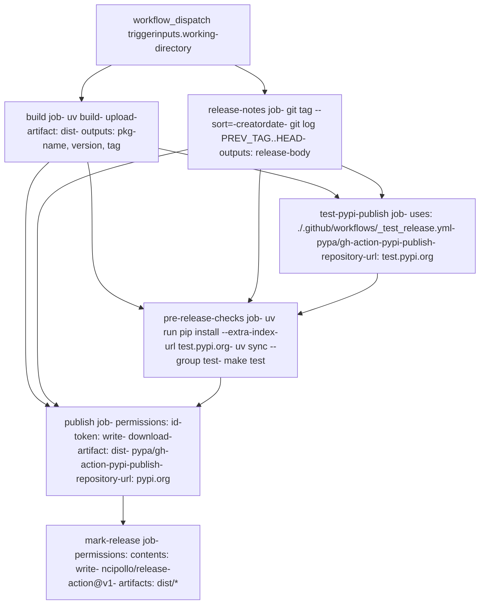
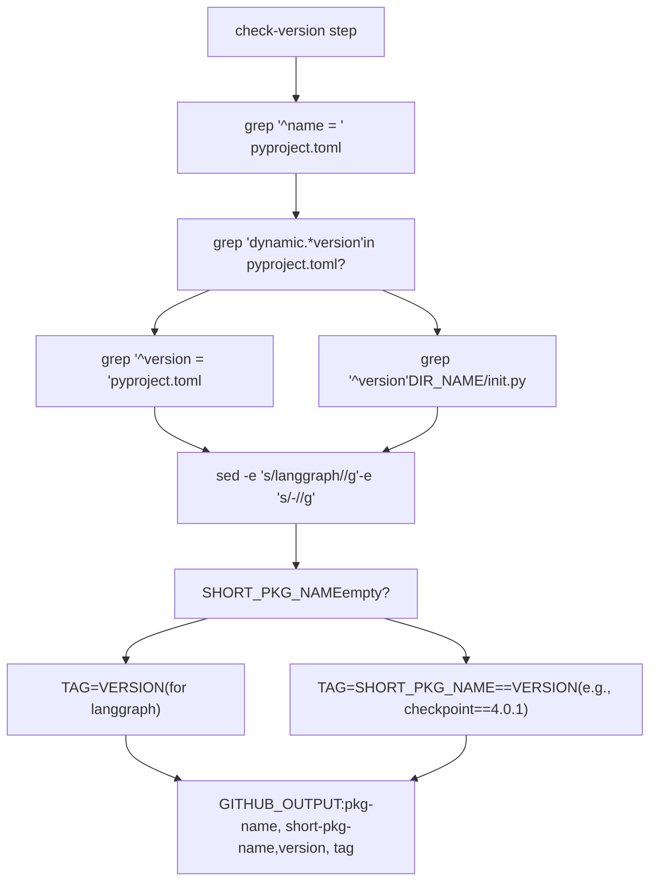

# Release Process

Relevant source files

-   [.github/workflows/\_integration\_test.yml](https://github.com/langchain-ai/langgraph/blob/1fd51e8f/.github/workflows/_integration_test.yml)
-   [.github/workflows/\_lint.yml](https://github.com/langchain-ai/langgraph/blob/1fd51e8f/.github/workflows/_lint.yml)
-   [.github/workflows/\_test.yml](https://github.com/langchain-ai/langgraph/blob/1fd51e8f/.github/workflows/_test.yml)
-   [.github/workflows/\_test\_langgraph.yml](https://github.com/langchain-ai/langgraph/blob/1fd51e8f/.github/workflows/_test_langgraph.yml)
-   [.github/workflows/\_test\_release.yml](https://github.com/langchain-ai/langgraph/blob/1fd51e8f/.github/workflows/_test_release.yml)
-   [.github/workflows/baseline.yml](https://github.com/langchain-ai/langgraph/blob/1fd51e8f/.github/workflows/baseline.yml)
-   [.github/workflows/bench.yml](https://github.com/langchain-ai/langgraph/blob/1fd51e8f/.github/workflows/bench.yml)
-   [.github/workflows/ci.yml](https://github.com/langchain-ai/langgraph/blob/1fd51e8f/.github/workflows/ci.yml)
-   [.github/workflows/release.yml](https://github.com/langchain-ai/langgraph/blob/1fd51e8f/.github/workflows/release.yml)
-   [.github/workflows/uv\_lock\_ugprade.yml](https://github.com/langchain-ai/langgraph/blob/1fd51e8f/.github/workflows/uv_lock_ugprade.yml)
-   [libs/checkpoint-postgres/uv.lock](https://github.com/langchain-ai/langgraph/blob/1fd51e8f/libs/checkpoint-postgres/uv.lock)
-   [libs/checkpoint-sqlite/uv.lock](https://github.com/langchain-ai/langgraph/blob/1fd51e8f/libs/checkpoint-sqlite/uv.lock)
-   [libs/checkpoint/langgraph/checkpoint/serde/jsonplus.py](https://github.com/langchain-ai/langgraph/blob/1fd51e8f/libs/checkpoint/langgraph/checkpoint/serde/jsonplus.py)
-   [libs/checkpoint/pyproject.toml](https://github.com/langchain-ai/langgraph/blob/1fd51e8f/libs/checkpoint/pyproject.toml)
-   [libs/checkpoint/tests/test\_jsonplus.py](https://github.com/langchain-ai/langgraph/blob/1fd51e8f/libs/checkpoint/tests/test_jsonplus.py)
-   [libs/checkpoint/uv.lock](https://github.com/langchain-ai/langgraph/blob/1fd51e8f/libs/checkpoint/uv.lock)
-   [libs/langgraph/pyproject.toml](https://github.com/langchain-ai/langgraph/blob/1fd51e8f/libs/langgraph/pyproject.toml)
-   [libs/langgraph/tests/\_\_snapshots\_\_/test\_pregel.ambr](https://github.com/langchain-ai/langgraph/blob/1fd51e8f/libs/langgraph/tests/__snapshots__/test_pregel.ambr)
-   [libs/langgraph/tests/\_\_snapshots\_\_/test\_pregel\_async.ambr](https://github.com/langchain-ai/langgraph/blob/1fd51e8f/libs/langgraph/tests/__snapshots__/test_pregel_async.ambr)
-   [libs/langgraph/uv.lock](https://github.com/langchain-ai/langgraph/blob/1fd51e8f/libs/langgraph/uv.lock)
-   [libs/prebuilt/pyproject.toml](https://github.com/langchain-ai/langgraph/blob/1fd51e8f/libs/prebuilt/pyproject.toml)
-   [libs/prebuilt/uv.lock](https://github.com/langchain-ai/langgraph/blob/1fd51e8f/libs/prebuilt/uv.lock)
-   [libs/sdk-py/uv.lock](https://github.com/langchain-ai/langgraph/blob/1fd51e8f/libs/sdk-py/uv.lock)

The LangGraph release process is implemented as a manually-triggered GitHub Actions workflow ([.github/workflows/release.yml1-328](https://github.com/langchain-ai/langgraph/blob/1fd51e8f/.github/workflows/release.yml#L1-L328)) that publishes packages to PyPI. The workflow enforces permission isolation between build and publish stages, validates packages on TestPyPI before production release, and creates GitHub releases with git-based changelogs.

Related documentation:

-   **CI/CD workflows** (page 2.3): Automated testing on pull requests
-   **Monorepo structure** (page 2.1): Package organization and build system
-   **Testing infrastructure** (page 2.2): Test configuration and helpers

## Workflow Jobs

The `release.yml` workflow executes six jobs with strict dependency ordering to ensure a secure and validated release:

| Job Name | Depends On | Purpose |
| --- | --- | --- |
| `build` | \- | Execute `uv build` and extract `pkg-name`, `version`, `tag` outputs [.github/workflows/release.yml18-81](https://github.com/langchain-ai/langgraph/blob/1fd51e8f/.github/workflows/release.yml#L18-L81) |
| `release-notes` | `build` | Compare git tags and generate changelog via `git log` [.github/workflows/release.yml82-140](https://github.com/langchain-ai/langgraph/blob/1fd51e8f/.github/workflows/release.yml#L82-L140) |
| `test-pypi-publish` | `build`, `release-notes` | Invoke reusable workflow to publish to test.pypi.org [.github/workflows/release.yml141-152](https://github.com/langchain-ai/langgraph/blob/1fd51e8f/.github/workflows/release.yml#L141-L152) |
| `pre-release-checks` | `build`, `release-notes`, `test-pypi-publish` | Install from TestPyPI and run `make test` [.github/workflows/release.yml153-242](https://github.com/langchain-ai/langgraph/blob/1fd51e8f/.github/workflows/release.yml#L153-L242) |
| `publish` | `build`, `release-notes`, `pre-release-checks` | Publish to pypi.org via trusted publishing [.github/workflows/release.yml243-285](https://github.com/langchain-ai/langgraph/blob/1fd51e8f/.github/workflows/release.yml#L243-L285) |
| `mark-release` | `publish` | Create GitHub release with git tags and artifacts [.github/workflows/release.yml286-328](https://github.com/langchain-ai/langgraph/blob/1fd51e8f/.github/workflows/release.yml#L286-L328) |

Sources: [.github/workflows/release.yml17-328](https://github.com/langchain-ai/langgraph/blob/1fd51e8f/.github/workflows/release.yml#L17-L328)

## Job Dependency Graph

The following diagram illustrates the execution flow and data movement (artifacts and outputs) between release jobs.

### Release Workflow Orchestration

**Purpose**: Maps GitHub Actions workflow job dependencies with key actions and permissions used in each job.

Sources: [.github/workflows/release.yml17-328](https://github.com/langchain-ai/langgraph/blob/1fd51e8f/.github/workflows/release.yml#L17-L328)

## Trigger and Inputs

The release workflow is triggered manually via `workflow_dispatch` [.github/workflows/release.yml4-9](https://github.com/langchain-ai/langgraph/blob/1fd51e8f/.github/workflows/release.yml#L4-L9)

| Input | Type | Default | Description |
| --- | --- | --- | --- |
| `working-directory` | string | `libs/langgraph` | Package directory to release (e.g., `libs/checkpoint`) |

**Supported packages** (monorepo structure):

-   `langgraph`: Core framework [libs/langgraph/pyproject.toml6](https://github.com/langchain-ai/langgraph/blob/1fd51e8f/libs/langgraph/pyproject.toml#L6-L6)
-   `langgraph-checkpoint`: Base interfaces [libs/checkpoint/pyproject.toml6](https://github.com/langchain-ai/langgraph/blob/1fd51e8f/libs/checkpoint/pyproject.toml#L6-L6)
-   `langgraph-prebuilt`: Prebuilt components [libs/prebuilt/pyproject.toml6](https://github.com/langchain-ai/langgraph/blob/1fd51e8f/libs/prebuilt/pyproject.toml#L6-L6)
-   `langgraph-sdk`: Python client [libs/langgraph/pyproject.toml29](https://github.com/langchain-ai/langgraph/blob/1fd51e8f/libs/langgraph/pyproject.toml#L29-L29)

Sources: [.github/workflows/release.yml4-9](https://github.com/langchain-ai/langgraph/blob/1fd51e8f/.github/workflows/release.yml#L4-L9) [libs/langgraph/pyproject.toml6-33](https://github.com/langchain-ai/langgraph/blob/1fd51e8f/libs/langgraph/pyproject.toml#L6-L33)

## Build Stage

The `build` job extracts version information and creates distribution artifacts using `uv build` [.github/workflows/release.yml49](https://github.com/langchain-ai/langgraph/blob/1fd51e8f/.github/workflows/release.yml#L49-L49)

### Version Detection Logic

The workflow uses a bash script to handle both static and dynamic versioning strategies across the monorepo packages.

### Package Metadata Extraction

**Purpose**: Shows bash script logic for extracting version information from `pyproject.toml` or `__init__.py`.

The version detection script performs the following [.github/workflows/release.yml58-80](https://github.com/langchain-ai/langgraph/blob/1fd51e8f/.github/workflows/release.yml#L58-L80):

1.  **Extract package name**: Reads the `name` field from `pyproject.toml`.
2.  **Handle Dynamic Versioning**: If `version` is marked as dynamic, it reads `__version__` from the package's `__init__.py`. Otherwise, it reads directly from `pyproject.toml`.
3.  **Generate Tag**:
    -   For the main `langgraph` package, the tag is just the version (e.g., `1.1.3`).
    -   For sub-packages (e.g., `langgraph-checkpoint`), it creates a prefixed tag (e.g., `checkpoint==4.0.1`).

### Build Artifacts

The build step uses `uv build` to create source and wheel distributions. The repository uses `hatchling` as the build backend [libs/langgraph/pyproject.toml3](https://github.com/langchain-ai/langgraph/blob/1fd51e8f/libs/langgraph/pyproject.toml#L3-L3) Artifacts are uploaded via `actions/upload-artifact@v7` [.github/workflows/release.yml52-57](https://github.com/langchain-ai/langgraph/blob/1fd51e8f/.github/workflows/release.yml#L52-L57) for use by downstream publishing jobs.

Sources: [.github/workflows/release.yml18-81](https://github.com/langchain-ai/langgraph/blob/1fd51e8f/.github/workflows/release.yml#L18-L81) [libs/langgraph/pyproject.toml1-3](https://github.com/langchain-ai/langgraph/blob/1fd51e8f/libs/langgraph/pyproject.toml#L1-L3)

## Release Notes Generation

The `release-notes` job creates a changelog by comparing the current version tag against the most recent previous tag [.github/workflows/release.yml82-140](https://github.com/langchain-ai/langgraph/blob/1fd51e8f/.github/workflows/release.yml#L82-L140)

1.  **Previous Tag Discovery**: Uses `git tag --sort=-creatordate` filtered by package-specific regex to find the last release of that specific package [.github/workflows/release.yml113](https://github.com/langchain-ai/langgraph/blob/1fd51e8f/.github/workflows/release.yml#L113-L113)
2.  **Commit Log**: Generates a bulleted list of changes using `git log --format="%s" "$PREV_TAG"..HEAD -- $WORKING_DIR` [.github/workflows/release.yml136](https://github.com/langchain-ai/langgraph/blob/1fd51e8f/.github/workflows/release.yml#L136-L136) This ensures only changes within the specific package's directory are included in its release notes.

Sources: [.github/workflows/release.yml82-140](https://github.com/langchain-ai/langgraph/blob/1fd51e8f/.github/workflows/release.yml#L82-L140)

## TestPyPI Validation

The `test-pypi-publish` job uses a reusable workflow [./.github/workflows/\_test\_release.yml](https://github.com/langchain-ai/langgraph/blob/1fd51e8f/./.github/workflows/_test_release.yml) to publish to TestPyPI [.github/workflows/release.yml141-152](https://github.com/langchain-ai/langgraph/blob/1fd51e8f/.github/workflows/release.yml#L141-L152)

### Pre-Release Verification (`pre-release-checks`)

Before production release, the workflow performs a "smoke test" by installing the newly published package from TestPyPI [.github/workflows/release.yml153-242](https://github.com/langchain-ai/langgraph/blob/1fd51e8f/.github/workflows/release.yml#L153-L242)

-   **Isolation**: Caching is explicitly disabled to ensure all dependencies are correctly declared and resolvable [.github/workflows/release.yml179](https://github.com/langchain-ai/langgraph/blob/1fd51e8f/.github/workflows/release.yml#L179-L179)
-   **Dual-Index Install**: Uses `--extra-index-url https://test.pypi.org/simple/` so that dependencies (like `langchain-core`) are pulled from production PyPI while the release candidate is pulled from TestPyPI [.github/workflows/release.yml189-192](https://github.com/langchain-ai/langgraph/blob/1fd51e8f/.github/workflows/release.yml#L189-L192)
-   **Test Execution**: Runs `make test` against the installed TestPyPI package [.github/workflows/release.yml239-241](https://github.com/langchain-ai/langgraph/blob/1fd51e8f/.github/workflows/release.yml#L239-L241)

Sources: [.github/workflows/release.yml141-242](https://github.com/langchain-ai/langgraph/blob/1fd51e8f/.github/workflows/release.yml#L141-L242) [.github/workflows/\_test\_release.yml1-98](https://github.com/langchain-ai/langgraph/blob/1fd51e8f/.github/workflows/_test_release.yml#L1-L98)

## Trusted Publishing to PyPI

LangGraph uses **Trusted Publishing** (OIDC) to publish to PyPI, eliminating the need for long-lived secrets like API tokens.

1.  **Permissions**: The `publish` job requires `id-token: write` permission to request a JWT from GitHub's OIDC provider [.github/workflows/release.yml250-256](https://github.com/langchain-ai/langgraph/blob/1fd51e8f/.github/workflows/release.yml#L250-L256)
2.  **Publishing Action**: Uses `pypa/gh-action-pypi-publish@release/v1` to upload the `dist/` artifacts [.github/workflows/release.yml277-284](https://github.com/langchain-ai/langgraph/blob/1fd51e8f/.github/workflows/release.yml#L277-L284)
3.  **Security Isolation**: The build process is kept separate from the publish process to prevent a compromised build step from accessing PyPI credentials [.github/workflows/release.yml37-47](https://github.com/langchain-ai/langgraph/blob/1fd51e8f/.github/workflows/release.yml#L37-L47)

Sources: [.github/workflows/release.yml243-285](https://github.com/langchain-ai/langgraph/blob/1fd51e8f/.github/workflows/release.yml#L243-L285)

## GitHub Release and Versioning

The final `mark-release` job creates the official GitHub release [.github/workflows/release.yml286-328](https://github.com/langchain-ai/langgraph/blob/1fd51e8f/.github/workflows/release.yml#L286-L328)

-   **Artifacts**: Uploads the same `.tar.gz` and `.whl` files published to PyPI to the GitHub release page [.github/workflows/release.yml318-327](https://github.com/langchain-ai/langgraph/blob/1fd51e8f/.github/workflows/release.yml#L318-L327)
-   **Tagging**: Creates a git tag (e.g., `1.1.3` or `checkpoint==4.0.1`) pointing to the specific commit SHA released [.github/workflows/release.yml323-327](https://github.com/langchain-ai/langgraph/blob/1fd51e8f/.github/workflows/release.yml#L323-L327)
-   **Versioning Strategy**: Follows Semantic Versioning. Main package versioning is found in [libs/langgraph/pyproject.toml7](https://github.com/langchain-ai/langgraph/blob/1fd51e8f/libs/langgraph/pyproject.toml#L7-L7) Sub-packages like `langgraph-checkpoint` maintain independent versioning [libs/checkpoint/pyproject.toml7](https://github.com/langchain-ai/langgraph/blob/1fd51e8f/libs/checkpoint/pyproject.toml#L7-L7)

Sources: [.github/workflows/release.yml286-328](https://github.com/langchain-ai/langgraph/blob/1fd51e8f/.github/workflows/release.yml#L286-L328) [libs/langgraph/pyproject.toml7](https://github.com/langchain-ai/langgraph/blob/1fd51e8f/libs/langgraph/pyproject.toml#L7-L7) [libs/checkpoint/pyproject.toml7](https://github.com/langchain-ai/langgraph/blob/1fd51e8f/libs/checkpoint/pyproject.toml#L7-L7)
