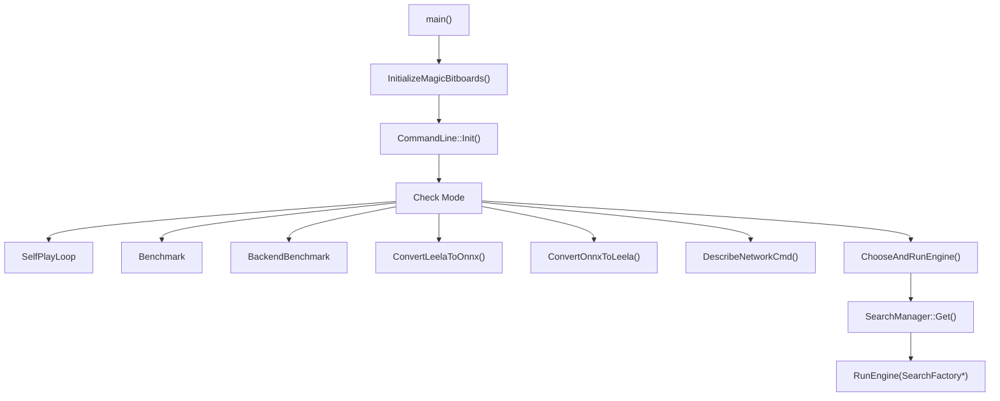
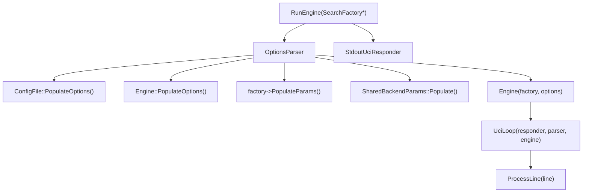
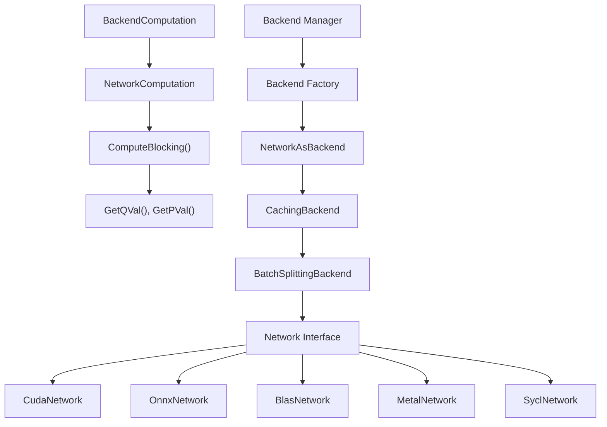
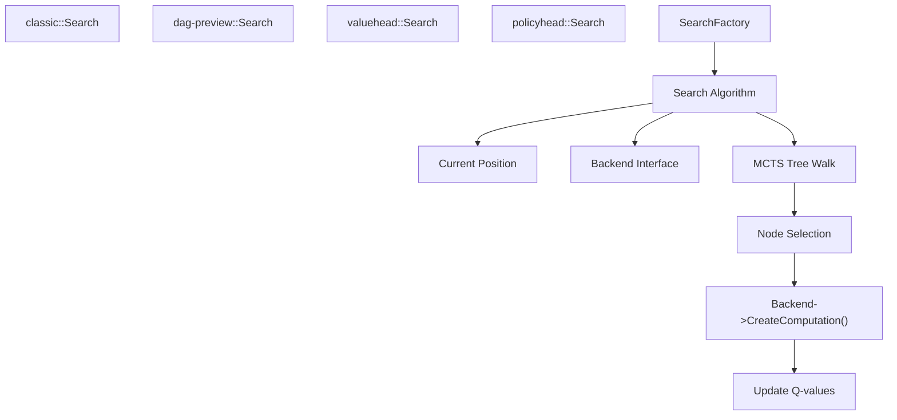
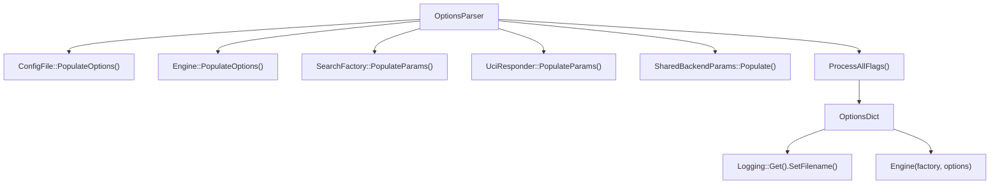
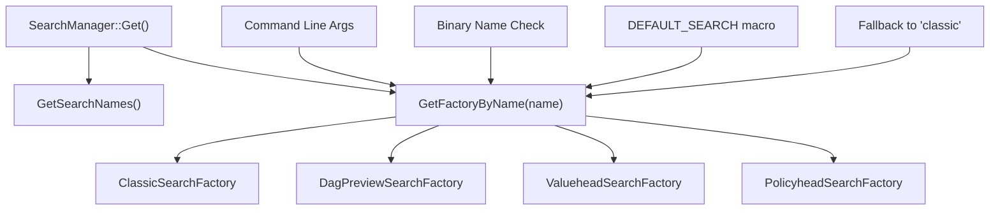
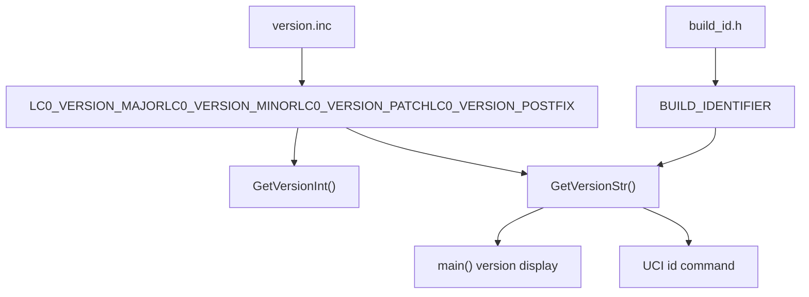
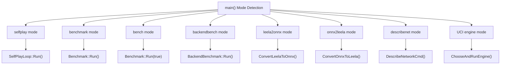
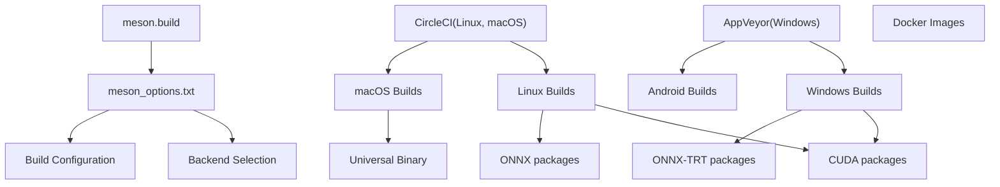

# Lc0 Overview

Relevant source files

-   [AUTHORS](https://github.com/LeelaChessZero/lc0/blob/b4e98c19/AUTHORS)
-   [CONTRIBUTING.md](https://github.com/LeelaChessZero/lc0/blob/b4e98c19/CONTRIBUTING.md)
-   [README.md](https://github.com/LeelaChessZero/lc0/blob/b4e98c19/README.md)
-   [changelog.txt](https://github.com/LeelaChessZero/lc0/blob/b4e98c19/changelog.txt)
-   [install\_openSUSE\_lc0.sh](https://github.com/LeelaChessZero/lc0/blob/b4e98c19/install_openSUSE_lc0.sh)
-   [openSUSE\_install.md](https://github.com/LeelaChessZero/lc0/blob/b4e98c19/openSUSE_install.md)
-   [pyproject.toml](https://github.com/LeelaChessZero/lc0/blob/b4e98c19/pyproject.toml)
-   [scripts/bumpversion.py](https://github.com/LeelaChessZero/lc0/blob/b4e98c19/scripts/bumpversion.py)
-   [src/engine\_loop.cc](https://github.com/LeelaChessZero/lc0/blob/b4e98c19/src/engine_loop.cc)
-   [src/engine\_loop.h](https://github.com/LeelaChessZero/lc0/blob/b4e98c19/src/engine_loop.h)
-   [src/main.cc](https://github.com/LeelaChessZero/lc0/blob/b4e98c19/src/main.cc)
-   [src/version.cc](https://github.com/LeelaChessZero/lc0/blob/b4e98c19/src/version.cc)
-   [src/version.h](https://github.com/LeelaChessZero/lc0/blob/b4e98c19/src/version.h)
-   [src/version.inc](https://github.com/LeelaChessZero/lc0/blob/b4e98c19/src/version.inc)

## Purpose and Scope

Lc0 is a UCI-compliant chess engine that uses neural network evaluation instead of traditional hand-crafted evaluation functions. The engine implements neural networks trained by the [LeelaChessZero project](https://lczero.org) and combines them with Monte Carlo Tree Search (MCTS) to select chess moves.

The codebase is structured around several key systems: UCI protocol handling, chess position representation, MCTS search algorithms, and a hardware-abstracted neural network backend system. The engine supports multiple search algorithms (`classic`, `dag-preview`, `valuehead`, `policyhead`) and neural network backends (CUDA, ONNX, BLAS, Metal, SYCL) to run efficiently across different hardware platforms.

This overview focuses on the high-level architecture and how the major systems interact. For specific implementation details, refer to the dedicated pages for each subsystem.

Sources: [README.md6](https://github.com/LeelaChessZero/lc0/blob/b4e98c19/README.md#L6-L6) [main.cc27-60](https://github.com/LeelaChessZero/lc0/blob/b4e98c19/main.cc#L27-L60) [engine\_loop.cc47-83](https://github.com/LeelaChessZero/lc0/blob/b4e98c19/engine_loop.cc#L47-L83)

## System Architecture

### Entry Point and Engine Selection

**Entry Point Flow Diagram**

The `main()` function in [main.cc78-140](https://github.com/LeelaChessZero/lc0/blob/b4e98c19/main.cc#L78-L140) serves as the entry point and determines the execution mode. For normal chess engine operation, it calls `ChooseAndRunEngine()` which uses the `SearchManager` to select an appropriate `SearchFactory` and calls `RunEngine()`.

**Core Engine Architecture**

The `RunEngine()` function creates the main engine components: an `OptionsParser` for configuration, an `Engine` instance using the selected `SearchFactory`, and a `UciLoop` for handling UCI protocol communication.

Sources: [main.cc44-75](https://github.com/LeelaChessZero/lc0/blob/b4e98c19/main.cc#L44-L75) [main.cc78-140](https://github.com/LeelaChessZero/lc0/blob/b4e98c19/main.cc#L78-L140) [engine\_loop.cc47-82](https://github.com/LeelaChessZero/lc0/blob/b4e98c19/engine_loop.cc#L47-L82)

### Neural Network Backend System

**Backend Interface Architecture**

The neural network system uses a layered architecture where `Backend` provides the main interface, wrapped by caching and batching layers, ultimately delegating to hardware-specific `Network` implementations.

**Search Algorithm Integration**

The search system supports multiple algorithms selected via `SearchManager::GetFactoryByName()`. Each search algorithm interacts with the `Backend` interface for neural network evaluation during tree traversal.

Sources: [README.md27-50](https://github.com/LeelaChessZero/lc0/blob/b4e98c19/README.md#L27-L50) [main.cc46-74](https://github.com/LeelaChessZero/lc0/blob/b4e98c19/main.cc#L46-L74) [changelog.txt27-46](https://github.com/LeelaChessZero/lc0/blob/b4e98c19/changelog.txt#L27-L46)

## Configuration and Options System

**Options Processing Flow**

The configuration system uses an `OptionsParser` that collects options from multiple sources and creates an `OptionsDict` for engine initialization.

**Key Configuration Components**

| Component | Purpose | Key Options |
| --- | --- | --- |
| `ConfigFile` | File-based configuration | Config file parsing and loading |
| `Engine::PopulateOptions()` | Core engine options | UCI options, engine behavior |
| `SearchFactory::PopulateParams()` | Search algorithm parameters | MCTS parameters, search limits |
| `SharedBackendParams` | Neural network backend options | Backend selection, hardware settings |

Sources: [engine\_loop.cc52-63](https://github.com/LeelaChessZero/lc0/blob/b4e98c19/engine_loop.cc#L52-L63) [engine\_loop.cc38-44](https://github.com/LeelaChessZero/lc0/blob/b4e98c19/engine_loop.cc#L38-L44)

## Search Algorithm Selection

**Search Algorithm Architecture**

The search algorithm selection in `ChooseAndRunEngine()` follows a priority order:

1.  Explicit command-line search name arguments
2.  `DEFAULT_SEARCH` compile-time macro
3.  Search name found in binary filename
4.  Fallback to `"classic"` search

**Available Search Algorithms**

| Algorithm | Purpose | Implementation |
| --- | --- | --- |
| `classic` | Standard MCTS with neural network evaluation | Default production algorithm |
| `dag-preview` | DAG-based search with shared nodes | Experimental algorithm from separate branch |
| `valuehead` | Value-only move selection | Replaces `ValueOnly` mode, selects best value move |
| `policyhead` | Policy-only move selection | Single-node search using policy head only |

Sources: [main.cc44-75](https://github.com/LeelaChessZero/lc0/blob/b4e98c19/main.cc#L44-L75) [changelog.txt27-46](https://github.com/LeelaChessZero/lc0/blob/b4e98c19/changelog.txt#L27-L46)

## Version and Build Information

**Version Management**

Version information is centrally managed through `version.inc` and accessed via functions in `version.h`. The current version is 0.33.0-dev.

**Build System Overview**

| Component | Technology | Purpose |
| --- | --- | --- |
| Build System | Meson | Cross-platform build configuration |
| CI/CD | CircleCI, AppVeyor | Automated testing and releases |
| Backends | Multiple | Hardware acceleration support |
| Python Bindings | meson-python | Python API access |

**Supported Backend Matrix**

| Backend | Platform | Hardware | Features |
| --- | --- | --- | --- |
| `cuda` | Linux, Windows | NVIDIA GPU | cuDNN integration, FP16 support |
| `onnx-cpu` | All | CPU | Cross-platform inference |
| `onnx-cuda` | Linux, Windows | NVIDIA GPU | ONNX Runtime with CUDA |
| `onnx-trt` | Linux, Windows | NVIDIA GPU | TensorRT acceleration |
| `onnx-dml` | Windows | GPU | DirectML backend |
| `blas` | All | CPU | OpenBLAS, DNNL support |
| `metal` | macOS | Apple GPU | Metal Performance Shaders |
| `sycl` | Linux, Windows | Intel/AMD GPU | Experimental oneAPI support |

Sources: [version.inc1-4](https://github.com/LeelaChessZero/lc0/blob/b4e98c19/version.inc#L1-L4) [version.h37-45](https://github.com/LeelaChessZero/lc0/blob/b4e98c19/version.h#L37-L45) [version.cc29-41](https://github.com/LeelaChessZero/lc0/blob/b4e98c19/version.cc#L29-L41) [README.md122-161](https://github.com/LeelaChessZero/lc0/blob/b4e98c19/README.md#L122-L161) [changelog.txt50-51](https://github.com/LeelaChessZero/lc0/blob/b4e98c19/changelog.txt#L50-L51)

## Utility Tools and Modes

**Available Execution Modes**

Lc0 supports multiple execution modes beyond the standard UCI engine operation:

| Mode | Function | Purpose |
| --- | --- | --- |
| `selfplay` | `SelfPlayLoop::Run()` | Generate training games for neural network training |
| `benchmark` | `Benchmark::Run()` | Performance testing with standard positions |
| `bench` | `Benchmark::Run(true)` | Quick performance benchmark |
| `backendbench` | `BackendBenchmark::Run()` | Neural network backend performance testing |
| `leela2onnx` | `ConvertLeelaToOnnx()` | Convert Leela weights to ONNX format |
| `onnx2leela` | `ConvertOnnxToLeela()` | Convert ONNX models to Leela format |
| `describenet` | `DescribeNetworkCmd()` | Display neural network architecture details |

**Special Binary Names**

The engine behavior can be modified by including specific terms in the binary filename:

-   `lc0simple`: Enables simplified interface mode
-   `lc0-valuehead`: Forces valuehead search algorithm
-   Search algorithm names: Automatically selects that search algorithm

Sources: [main.cc91-134](https://github.com/LeelaChessZero/lc0/blob/b4e98c19/main.cc#L91-L134) [main.cc63-71](https://github.com/LeelaChessZero/lc0/blob/b4e98c19/main.cc#L63-L71) [changelog.txt108-109](https://github.com/LeelaChessZero/lc0/blob/b4e98c19/changelog.txt#L108-L109)

## Development and Build Infrastructure

**Build System Architecture**

**Development Tools and Guidelines**

| Tool/Standard | Purpose | Configuration |
| --- | --- | --- |
| C++20 | Language standard | GCC 10+, Clang 10+, MSVC 2019+ |
| Meson | Build system | Cross-platform configuration |
| clang-format | Code formatting | Google C++ Style Guide |
| gtest/gmock | Testing framework | Unit tests in `*_test.cc` files |
| Protocol Buffers | Data serialization | Custom code generation |
| Abseil | Utility library | Since v0.32 |

**Python Bindings**

The `lczero_bindings` package provides Python access to Lc0 functionality:

-   Package name: `lczero_bindings`
-   Module: `lczero.backends`
-   Build via: `pip install --user git+https://github.com/LeelaChessZero/lc0.git`
-   Configuration: [pyproject.toml1-27](https://github.com/LeelaChessZero/lc0/blob/b4e98c19/pyproject.toml#L1-L27)

Sources: [README.md175-185](https://github.com/LeelaChessZero/lc0/blob/b4e98c19/README.md#L175-L185) [CONTRIBUTING.md78-84](https://github.com/LeelaChessZero/lc0/blob/b4e98c19/CONTRIBUTING.md#L78-L84) [CONTRIBUTING.md19-29](https://github.com/LeelaChessZero/lc0/blob/b4e98c19/CONTRIBUTING.md#L19-L29) [pyproject.toml5-8](https://github.com/LeelaChessZero/lc0/blob/b4e98c19/pyproject.toml#L5-L8)

## Summary

Lc0 is a modern chess engine that replaces traditional evaluation functions with neural network inference. The architecture centers around several key components:

1.  **Entry Point**: `main()` function handles mode selection and delegates to appropriate subsystems
2.  **Engine Core**: `RunEngine()` creates `Engine` instances using `SearchFactory` pattern for algorithm selection
3.  **Search System**: Multiple algorithms (`classic`, `dag-preview`, `valuehead`, `policyhead`) accessible via `SearchManager`
4.  **Neural Network**: Hardware-abstracted backend system supporting CUDA, ONNX, BLAS, Metal, and SYCL
5.  **Configuration**: `OptionsParser` system collecting settings from multiple sources
6.  **UCI Protocol**: `UciLoop` handles standard chess engine communication

The codebase emphasizes modularity and hardware portability, allowing the same engine to run efficiently on CPUs, NVIDIA GPUs, AMD GPUs, and Apple Silicon. The build system uses Meson for cross-platform compilation with continuous integration via CircleCI and AppVeyor.

Key technical decisions include the `SearchFactory` pattern for algorithm selection, layered backend abstractions for neural network computation, and a comprehensive options system for runtime configuration. This architecture enables both high performance and easy extensibility for research and development.

Sources: [main.cc78-140](https://github.com/LeelaChessZero/lc0/blob/b4e98c19/main.cc#L78-L140) [engine\_loop.cc47-82](https://github.com/LeelaChessZero/lc0/blob/b4e98c19/engine_loop.cc#L47-L82) [README.md6](https://github.com/LeelaChessZero/lc0/blob/b4e98c19/README.md#L6-L6)

## Summary

Lc0 is a sophisticated chess engine that combines traditional chess programming techniques with modern neural network evaluation. Its modular architecture allows it to run efficiently on various hardware platforms, from high-end GPUs to basic CPUs. The engine's strength comes from its neural network-based evaluation and efficient MCTS search algorithm.

For users looking to explore specific parts of the engine in more detail, the following wiki pages provide more in-depth information:

-   [Building and Installation](/LeelaChessZero/lc0/2-building-and-installation)
-   [Core Architecture](/LeelaChessZero/lc0/3-core-engine-architecture)
-   [Chess Representation](/LeelaChessZero/lc0/4-chess-representation)
-   [Search Algorithm](/LeelaChessZero/lc0/5-search-algorithm)
-   [Neural Network System](/LeelaChessZero/lc0/6-neural-network-system)

The Lc0 project continues to evolve, with ongoing improvements to both the engine itself and the neural networks it uses.
