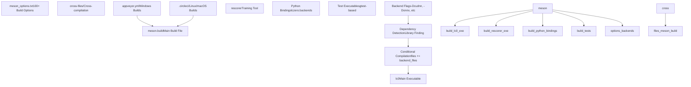

# Build System Architecture

Relevant source files

-   [appveyor.yml](https://github.com/LeelaChessZero/lc0/blob/b4e98c19/appveyor.yml)
-   [meson.build](https://github.com/LeelaChessZero/lc0/blob/b4e98c19/meson.build)
-   [meson\_options.txt](https://github.com/LeelaChessZero/lc0/blob/b4e98c19/meson_options.txt)

This document explains the build system architecture for Leela Chess Zero, including the Meson-based configuration system, backend selection matrix, and cross-platform build configuration. This covers the structural aspects of how builds are configured and organized, rather than step-by-step build instructions (see [Linux and macOS Build Process](/LeelaChessZero/lc0/2.2-linux-and-macos-build-process) and [Windows Build Process](/LeelaChessZero/lc0/2.3-windows-build-process) for platform-specific build steps).

## Core Build System Design

Leela Chess Zero uses Meson as its primary build system, providing cross-platform build configuration with extensive backend selection capabilities. The build system is designed around a modular backend architecture that allows selective compilation of neural network acceleration backends based on available hardware and dependencies.

### Meson Project Structure

Sources: [meson.build17-19](https://github.com/LeelaChessZero/lc0/blob/b4e98c19/meson.build#L17-L19) [meson\_options.txt1-261](https://github.com/LeelaChessZero/lc0/blob/b4e98c19/meson_options.txt#L1-L261) [appveyor.yml1-192](https://github.com/LeelaChessZero/lc0/blob/b4e98c19/appveyor.yml#L1-L192)

## Backend Selection Architecture

The build system implements a matrix-based backend selection system where multiple neural network acceleration backends can be enabled simultaneously. Each backend has its own dependency detection, compilation flags, and source file inclusion logic.

### Backend Detection and Configuration Flow

```mermaid
flowchart TD
    build_backends["get_option('build_backends')Master Backend Switch"]
    backend_options["Individual Backend Optionscudnn, opencl, blas, onnx, etc"]
    lib_detection["cc.find_library()Library Detection"]
    header_check["cc.has_header()Header Validation"]
    program_find["find_program()Tool Detection"]
    compile_flags["add_project_arguments()Preprocessor Defines"]
    source_files["files += backend_filesSource File Inclusion"]
    link_deps["deps += backend_libsLibrary Linking"]
    blas_backend["BLAS BackendMKL, OpenBLAS, DNNL"]
    cuda_backend["CUDA/cuDNN BackendNVIDIA GPU"]
    opencl_backend["OpenCL BackendCross-platform GPU"]
    onnx_backend["ONNX BackendCross-platform NN"]
    metal_backend["Metal BackendApple GPU"]
    dx_backend["DirectX BackendWindows GPU"]
    xla_backend["XLA BackendGoogle TPU/GPU"]
    sycl_backend["SYCL BackendIntel GPU"]

    build --> backends_backend_options
    backend --> options_lib_detection
    backend --> options_header_check
    backend --> options_program_find
    lib --> detection_compile_flags
    header --> check_compile_flags
    program --> find_compile_flags
    compile --> flags_source_files
    compile --> flags_link_deps
    source --> files_blas_backend
    source --> files_cuda_backend
    source --> files_opencl_backend
    source --> files_onnx_backend
    source --> files_metal_backend
    source --> files_dx_backend
    source --> files_xla_backend
    source --> files_sycl_backend
```

Sources: [meson.build261-777](https://github.com/LeelaChessZero/lc0/blob/b4e98c19/meson.build#L261-L777) [meson.build46-54](https://github.com/LeelaChessZero/lc0/blob/b4e98c19/meson.build#L46-L54)

## Build Options Matrix

The build system provides over 100 configuration options organized into functional categories. These options control backend selection, optimization levels, cross-compilation settings, and build targets.

| Category | Key Options | Default | Purpose |
| --- | --- | --- | --- |
| **Backends** | `blas`, `cudnn`, `opencl`, `onnx`, `metal` | varies | Enable neural network backends |
| **BLAS Libraries** | `mkl`, `openblas`, `dnnl`, `accelerate` | platform-specific | Select BLAS implementation |
| **Optimization** | `native_arch`, `popcnt`, `f16c`, `pext` | `true` | CPU instruction optimizations |
| **CUDA Settings** | `cc_cuda`, `native_cuda`, `nvcc_ccbin` | auto-detect | CUDA compilation control |
| **Build Targets** | `lc0`, `rescorer`, `gtest`, `python_bindings` | varies | Select what to build |
| **Cross-compilation** | Android, SYCL targets | platform-specific | Target platform configuration |

### Critical Backend Options

```mermaid
flowchart TD
    gpu_backends["GPU Backendscudnn, opencl, metal, dx"]
    cpu_backends["CPU Backendsblas variants"]
    portable_backends["Portable Backendsonnx, xla"]
    experimental["Experimentalsycl, tensorflow"]
    mkl["Intel MKL-Dmkl=true"]
    openblas["OpenBLAS-Dopenblas=true"]
    dnnl["Intel DNNL-Ddnnl=true"]
    accelerate["Apple Accelerate-Daccelerate=true"]
    cudnn_opt["cuDNN-Dcudnn=true"]
    plain_cuda["CUDA-Dplain_cuda=true"]
    opencl_opt["OpenCL-Dopencl=true"]
    metal_opt["Metal-Dmetal=auto"]
    dx_opt["DirectX 12-Ddx=true"]

    cpu --> backends_mkl
    cpu --> backends_openblas
    cpu --> backends_dnnl
    cpu --> backends_accelerate
    gpu --> backends_cudnn_opt
    gpu --> backends_plain_cuda
    gpu --> backends_opencl_opt
    gpu --> backends_metal_opt
    gpu --> backends_dx_opt
```

Sources: [meson\_options.txt46-261](https://github.com/LeelaChessZero/lc0/blob/b4e98c19/meson_options.txt#L46-L261) [meson.build297-422](https://github.com/LeelaChessZero/lc0/blob/b4e98c19/meson.build#L297-L422)

## Platform-Specific Configuration

The build system handles platform-specific requirements through conditional compilation, different dependency paths, and platform-specific compiler flags.

### Windows Build Configuration

```mermaid
flowchart TD
    host_check["host_machine.system() == 'windows'"]
    msvc_check["cc.get_id() == 'msvc'"]
    nominmax["add_project_arguments('-DNOMINMAX')"]
    utf8_charset["source-charset:utf-8"]
    vscrt_flags["Visual C++ Runtimeb_vscrt option"]
    filesystem_win["filesystem.win32.cc"]
    dx_native["DirectX 12Native on Windows"]
    cuda_windows["CUDAWindows-specific paths"]
    mimalloc_win["mimallocWindows MSVC linking"]
    gpu_nvidia["gpu-nvidia-cudnngpu-nvidia-cuda11/12"]
    cpu_variants["cpu-dnnlcpu-openblas"]
    onnx_variant["onnxwith gtest"]
    android_cross["androidcross-compilation"]

    host --> check_nominmax
    msvc --> check_utf8_charset
    msvc --> check_vscrt_flags
    host --> check_filesystem_win
    nominmax --> dx_native
    vscrt --> flags_cuda_windows
    vscrt --> flags_mimalloc_win
    dx --> native_gpu_nvidia
    cuda --> windows_gpu_nvidia
    mimalloc --> win_cpu_variants
```

Sources: [meson.build34-41](https://github.com/LeelaChessZero/lc0/blob/b4e98c19/meson.build#L34-L41) [meson.build237-241](https://github.com/LeelaChessZero/lc0/blob/b4e98c19/meson.build#L237-L241) [appveyor.yml6-17](https://github.com/LeelaChessZero/lc0/blob/b4e98c19/appveyor.yml#L6-L17)

## Dependency Management and Detection

The build system implements robust dependency detection with fallback mechanisms and cross-platform library finding.

### Library Detection Pattern

```mermaid
flowchart TD
    pkg_config["pkg-config Detectiondependency()"]
    manual_search["Manual Library Searchcc.find_library()"]
    header_validation["Header Verificationcc.has_header()"]
    subproject_fallback["Subproject Fallbackwrap files"]
    option_paths["User-specified Paths*_libdirs, *_include options"]
    default_paths["Default System Paths/usr/lib, /opt/cuda, etc"]
    cache_paths["CI Cache PathsC:\cache on Windows"]
    lib_found["Library Found"]
    headers_found["Headers Found"]
    compilation_test["Test Compilation"]
    backend_enabled["Backend Enabled"]

    pkg --> config_manual_search
    manual --> search_header_validation
    header --> validation_subproject_fallback
    option --> paths_manual_search
    default --> paths_manual_search
    cache --> paths_manual_search
    manual --> search_lib_found
    header --> validation_headers_found
    lib --> found_compilation_test
    headers --> found_compilation_test
    compilation --> test_backend_enabled
```

Sources: [meson.build280-622](https://github.com/LeelaChessZero/lc0/blob/b4e98c19/meson.build#L280-L622) [meson\_options.txt1-45](https://github.com/LeelaChessZero/lc0/blob/b4e98c19/meson_options.txt#L1-L45) [appveyor.yml56-103](https://github.com/LeelaChessZero/lc0/blob/b4e98c19/appveyor.yml#L56-L103)

## File Organization and Build Targets

The build system organizes source files into logical groups and creates multiple build targets with shared components.

### Source File Organization

```mermaid
flowchart TD
    common_files["common_files[]Chess logic, Utils, Neural core"]
    main_files["files[]Engine, Search, Tools"]
    pb_files["pb_files[]Protobuf generated"]
    blas_files["BLAS Backendsrc/neural/backends/blas/"]
    cuda_files["CUDA Backendsrc/neural/backends/cuda/"]
    opencl_files["OpenCL Backendsrc/neural/backends/opencl/"]
    onnx_files["ONNX Backendsrc/neural/backends/network_onnx.cc"]
    metal_files["Metal Backendsrc/neural/backends/metal/"]
    lc0_target["lc0 executablemain.cc + all files"]
    rescorer_target["rescorer executablerescorer_main.cc + common"]
    test_targets["Test executables*_test.cc + lc0_lib"]
    python_target["Python extensionbackends.cc generated"]

    common --> files_lc0_target
    main --> files_lc0_target
    pb --> files_lc0_target
    blas --> files_lc0_target
    cuda --> files_lc0_target
    opencl --> files_lc0_target
    onnx --> files_lc0_target
    metal --> files_lc0_target
    common --> files_rescorer_target
    common --> files_test_targets
    main --> files_python_target
```

Sources: [meson.build149-224](https://github.com/LeelaChessZero/lc0/blob/b4e98c19/meson.build#L149-L224) [meson.build852-867](https://github.com/LeelaChessZero/lc0/blob/b4e98c19/meson.build#L852-L867) [meson.build872-914](https://github.com/LeelaChessZero/lc0/blob/b4e98c19/meson.build#L872-L914)

## CI/CD Integration Architecture

The build system integrates with multiple CI/CD platforms to provide comprehensive cross-platform testing and binary distribution.

### Multi-Platform CI Strategy

| Platform | CI System | Build Matrix | Artifacts |
| --- | --- | --- | --- |
| **Windows** | AppVeyor | 7 configurations | `.exe`, `.zip`, `.pdb` |
| **Linux** | CircleCI | Multiple distributions | Binaries |
| **macOS** | CircleCI | Universal binaries | Native binaries |
| **Android** | AppVeyor | ARM64, ARMv7a | `.apk` files |

The CI configuration demonstrates the build system's flexibility by building multiple backend combinations automatically, ensuring compatibility across different hardware configurations and dependency versions.

Sources: [appveyor.yml1-192](https://github.com/LeelaChessZero/lc0/blob/b4e98c19/appveyor.yml#L1-L192) [meson.build119-122](https://github.com/LeelaChessZero/lc0/blob/b4e98c19/meson.build#L119-L122) [meson.build92-110](https://github.com/LeelaChessZero/lc0/blob/b4e98c19/meson.build#L92-L110)
