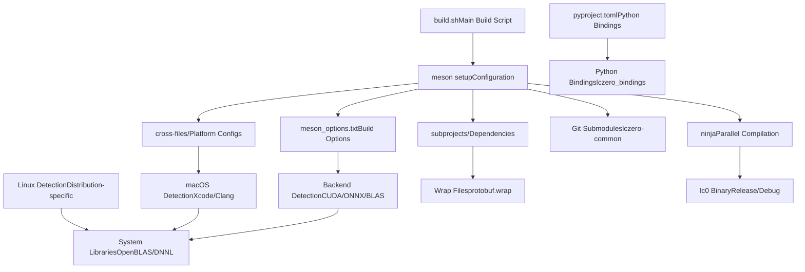
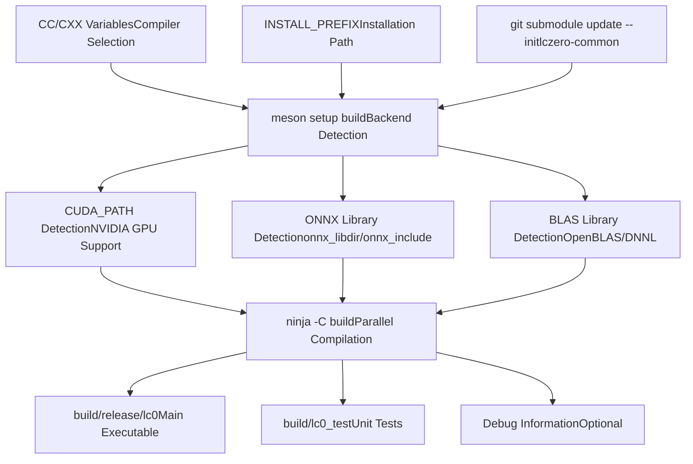
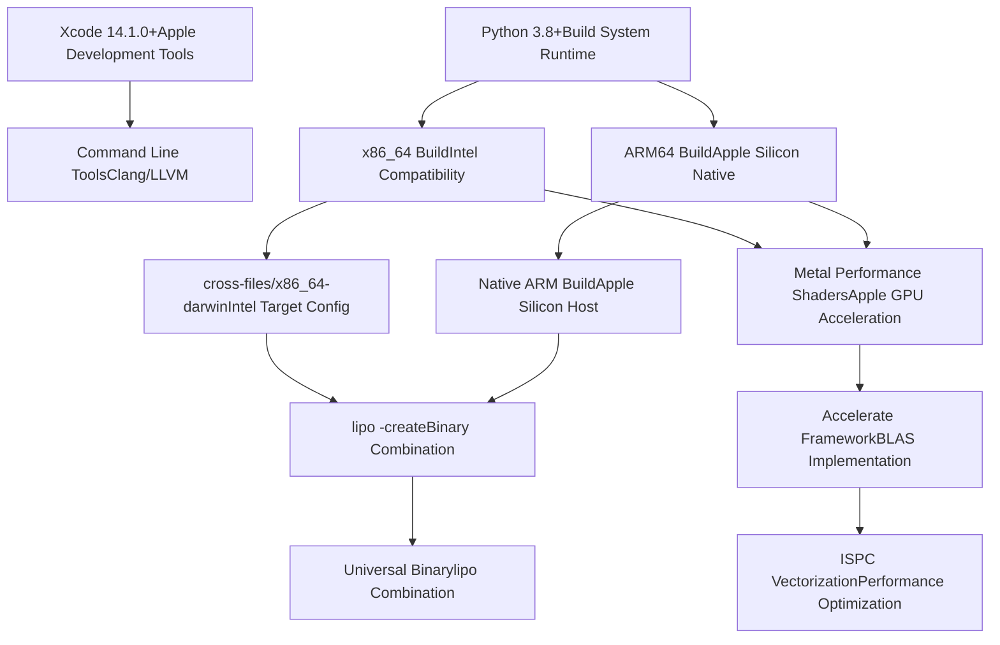
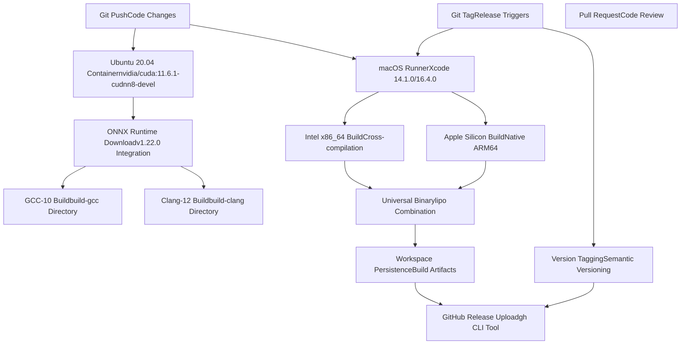
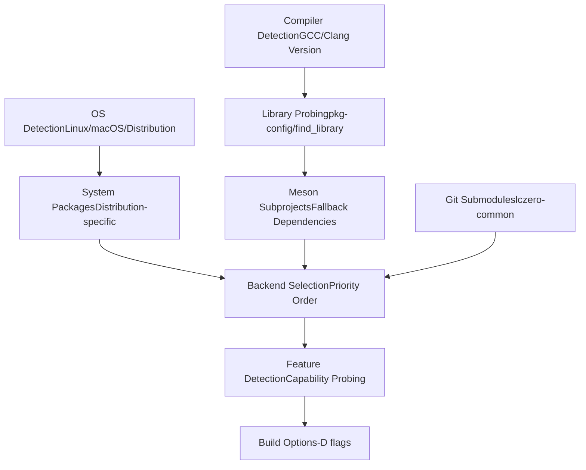

# Linux and macOS Build Process

Relevant source files

-   [.circleci/Dockerfile](https://github.com/LeelaChessZero/lc0/blob/b4e98c19/.circleci/Dockerfile)
-   [.circleci/config.yml](https://github.com/LeelaChessZero/lc0/blob/b4e98c19/.circleci/config.yml)
-   [.clang-format](https://github.com/LeelaChessZero/lc0/blob/b4e98c19/.clang-format)
-   [.gitmodules](https://github.com/LeelaChessZero/lc0/blob/b4e98c19/.gitmodules)
-   [CONTRIBUTING.md](https://github.com/LeelaChessZero/lc0/blob/b4e98c19/CONTRIBUTING.md)
-   [README.md](https://github.com/LeelaChessZero/lc0/blob/b4e98c19/README.md)
-   [cross-files/x86\_64-darwin](https://github.com/LeelaChessZero/lc0/blob/b4e98c19/cross-files/x86_64-darwin)
-   [install\_openSUSE\_lc0.sh](https://github.com/LeelaChessZero/lc0/blob/b4e98c19/install_openSUSE_lc0.sh)
-   [openSUSE\_install.md](https://github.com/LeelaChessZero/lc0/blob/b4e98c19/openSUSE_install.md)
-   [pyproject.toml](https://github.com/LeelaChessZero/lc0/blob/b4e98c19/pyproject.toml)
-   [subprojects/protobuf.wrap](https://github.com/LeelaChessZero/lc0/blob/b4e98c19/subprojects/protobuf.wrap)

This document covers the build process for Leela Chess Zero on Unix-like systems (Linux and macOS), including the Meson build system configuration, platform-specific requirements, and continuous integration workflows.

For Windows-specific build instructions, see [Windows Build Process](/LeelaChessZero/lc0/2.3-windows-build-process). For overall build system architecture and backend selection, see [Build System Architecture](/LeelaChessZero/lc0/2.1-build-system-architecture).

## Build System Overview

Lc0 uses the Meson build system for cross-platform compilation, with Ninja as the backend build tool. The build process is orchestrated through shell scripts and CI/CD pipelines that handle dependency resolution, backend selection, and platform-specific optimizations.

### Build System Architecture


Sources: [README.md43-49](https://github.com/LeelaChessZero/lc0/blob/b4e98c19/README.md#L43-L49) [build.sh](https://github.com/LeelaChessZero/lc0/blob/b4e98c19/build.sh) [meson\_options.txt](https://github.com/LeelaChessZero/lc0/blob/b4e98c19/meson_options.txt) [cross-files/x86\_64-darwin](https://github.com/LeelaChessZero/lc0/blob/b4e98c19/cross-files/x86_64-darwin) [subprojects/protobuf.wrap](https://github.com/LeelaChessZero/lc0/blob/b4e98c19/subprojects/protobuf.wrap) [pyproject.toml](https://github.com/LeelaChessZero/lc0/blob/b4e98c19/pyproject.toml)

## Linux Build Process

The Linux build process supports multiple distributions and compiler toolchains, with automatic dependency detection and backend configuration.

### Prerequisites and Dependencies

| Component | Purpose | Installation |
| --- | --- | --- |
| `meson` | Build system | `pip3 install meson` |
| `ninja-build` | Build backend | Distribution package |
| `gcc-10`/`clang-12` | C++20 compiler | Distribution package |
| `git` | Submodule handling | Distribution package |
| `python3-pip` | Python dependencies | Distribution package |

### Linux Build Workflow


Sources: [README.md51-82](https://github.com/LeelaChessZero/lc0/blob/b4e98c19/README.md#L51-L82) [install\_openSUSE\_lc0.sh46-70](https://github.com/LeelaChessZero/lc0/blob/b4e98c19/install_openSUSE_lc0.sh#L46-L70)

### Distribution-Specific Examples

#### Ubuntu 20.04 Build Commands

```
apt-get update
apt-get -y install git python3-pip gcc-10 g++-10 zlib1g zlib1g-dev
pip3 install meson ninja
CC=gcc-10 CXX=g++-10 INSTALL_PREFIX=~/.local ./build.sh
```
#### openSUSE Build Commands

```
zypper in -y git gcc-c++ gcc7-c++ meson ninja python3-abseil openblas_pthreads-devel-static
git clone --recurse-submodules https://github.com/LeelaChessZero/lc0.git
cd lc0 && ./build.sh
```
Sources: [README.md70-81](https://github.com/LeelaChessZero/lc0/blob/b4e98c19/README.md#L70-L81) [install\_openSUSE\_lc0.sh54-70](https://github.com/LeelaChessZero/lc0/blob/b4e98c19/install_openSUSE_lc0.sh#L54-L70)

## macOS Build Process

The macOS build process supports both Intel x86\_64 and Apple Silicon architectures, with universal binary creation for distribution.

### macOS Build Requirements

| Component | Version | Installation Method |
| --- | --- | --- |
| Xcode | 14.1.0+ | App Store |
| Python 3 | 3.8+ | System/Homebrew |
| Meson | 1.3.0+ | `pip3 install meson` |
| Ninja | Latest | `pip3 install ninja` |

### macOS Build Architecture


Sources: [README.md106-121](https://github.com/LeelaChessZero/lc0/blob/b4e98c19/README.md#L106-L121) [.circleci/config.yml45-88](https://github.com/LeelaChessZero/lc0/blob/b4e98c19/.circleci/config.yml#L45-L88) [cross-files/x86\_64-darwin](https://github.com/LeelaChessZero/lc0/blob/b4e98c19/cross-files/x86_64-darwin)

### macOS Build Commands

#### Basic Build Process

```
pip3 install meson ninja
git clone --recurse-submodules -b release/0.32 https://github.com/LeelaChessZero/lc0.git
cd lc0
./build.sh -Dgtest=false
```
#### Universal Binary Creation

```
# x86_64 build
meson build --buildtype=release -Dgtest=false --cross-file cross-files/x86_64-darwin
cd build && ninja && cd ..

# ARM64 build
meson build-arm --buildtype=release -Dgtest=false
cd build-arm && ninja && cd ..

# Combine architectures
lipo -create -o lc0-universal build/lc0 build-arm/lc0
```
Sources: [README.md110-117](https://github.com/LeelaChessZero/lc0/blob/b4e98c19/README.md#L110-L117) [.circleci/config.yml64-76](https://github.com/LeelaChessZero/lc0/blob/b4e98c19/.circleci/config.yml#L64-L76)

## CircleCI Continuous Integration

The CI system provides automated testing and release artifact generation for both Linux and macOS platforms.

### CircleCI Workflow Structure


Sources: [.circleci/config.yml](https://github.com/LeelaChessZero/lc0/blob/b4e98c19/.circleci/config.yml)

### CI Job Configuration Details

#### Linux Build Job

-   **Container**: `nvidia/cuda:11.6.1-cudnn8-devel-ubuntu20.04`
-   **Compilers**: GCC-10, Clang-12
-   **ONNX Integration**: Downloads onnxruntime-linux-x64-1.22.0.tgz
-   **Build Commands**:

    ```
    meson build-gcc -Dgtest=false -Donnx_include=/tmp/onnxruntime-linux-x64-1.22.0/include
    meson build-clang -Dgtest=false -Db_lto=false -Donnx_include=/tmp/onnxruntime-linux-x64-1.22.0/include
    ```


#### macOS Build Jobs

-   **Xcode Versions**: 14.1.0 (stable), 16.4.0 (latest)
-   **Resource Class**: `macos.m1.medium.gen1`
-   **ISPC Integration**: Downloads ispc-v1.21.0 for vectorization
-   **Universal Binary**: Uses `lipo -create` to combine architectures

Sources: [.circleci/config.yml3-44](https://github.com/LeelaChessZero/lc0/blob/b4e98c19/.circleci/config.yml#L3-L44) [.circleci/config.yml45-108](https://github.com/LeelaChessZero/lc0/blob/b4e98c19/.circleci/config.yml#L45-L108)

## Backend and Dependency Management

The build system automatically detects and configures various neural network backends and mathematical libraries.

### Backend Detection Matrix

| Backend | Linux Detection | macOS Detection | Configuration Options |
| --- | --- | --- | --- |
| CUDA | `CUDA_PATH` environment | Not supported | `-Dcuda=true`, `-Dnvcc_ccbin=` |
| ONNX | `onnx_libdir`/`onnx_include` | System/Homebrew | `-Donnx_include=`, `-Donnx_libdir=` |
| OpenBLAS | Package manager | Homebrew | Automatic detection |
| DNNL | Manual download | Manual download | `-Ddnnl=true`, `-Ddnnl_dir=` |
| Metal | Not supported | Automatic | macOS framework |
| Accelerate | Not supported | Automatic | macOS framework |

### Dependency Resolution Process


Sources: [README.md43-46](https://github.com/LeelaChessZero/lc0/blob/b4e98c19/README.md#L43-L46) [README.md122-170](https://github.com/LeelaChessZero/lc0/blob/b4e98c19/README.md#L122-L170) [subprojects/protobuf.wrap](https://github.com/LeelaChessZero/lc0/blob/b4e98c19/subprojects/protobuf.wrap) [.gitmodules](https://github.com/LeelaChessZero/lc0/blob/b4e98c19/.gitmodules)
