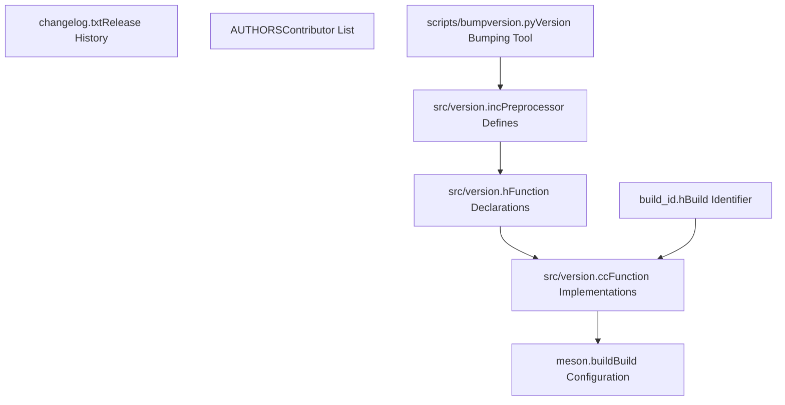
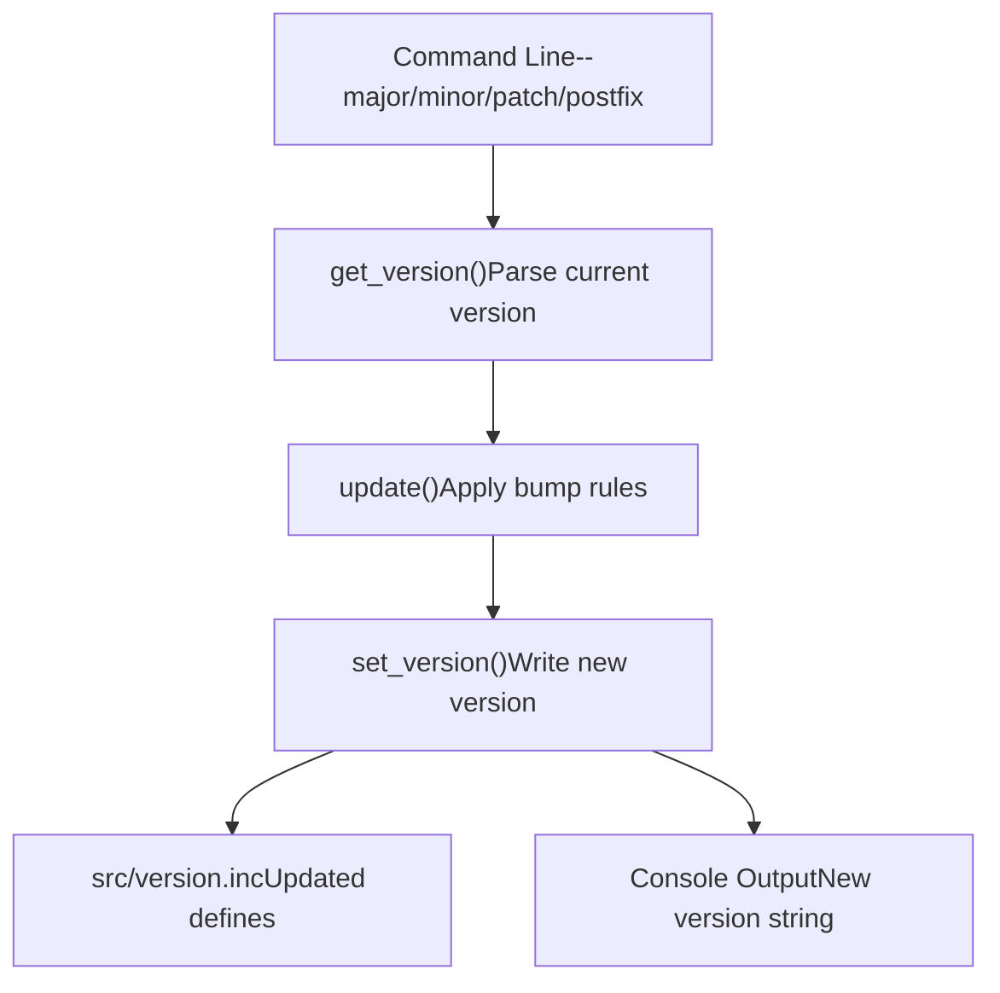
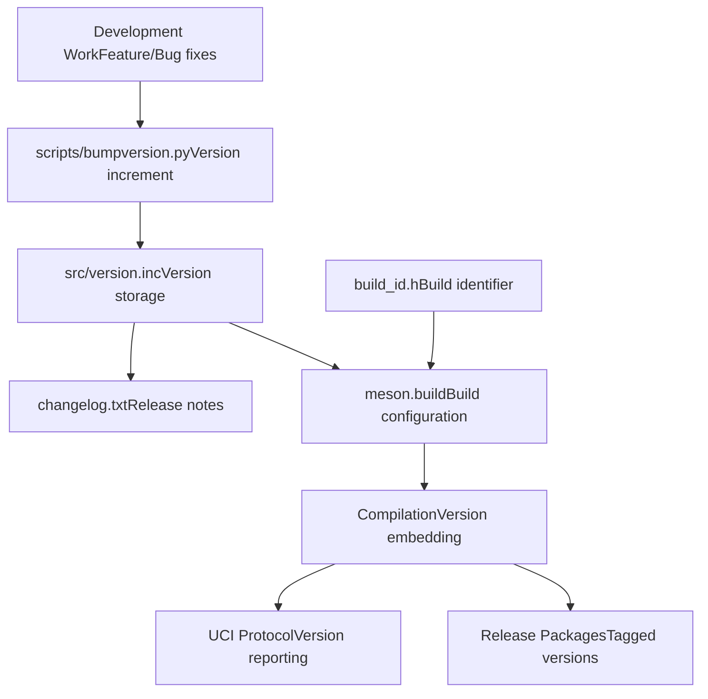

# Version Management

Relevant source files

-   [AUTHORS](https://github.com/LeelaChessZero/lc0/blob/b4e98c19/AUTHORS)
-   [changelog.txt](https://github.com/LeelaChessZero/lc0/blob/b4e98c19/changelog.txt)
-   [scripts/bumpversion.py](https://github.com/LeelaChessZero/lc0/blob/b4e98c19/scripts/bumpversion.py)
-   [src/version.cc](https://github.com/LeelaChessZero/lc0/blob/b4e98c19/src/version.cc)
-   [src/version.h](https://github.com/LeelaChessZero/lc0/blob/b4e98c19/src/version.h)
-   [src/version.inc](https://github.com/LeelaChessZero/lc0/blob/b4e98c19/src/version.inc)

This document covers the version management system in lc0, including version storage, automated version bumping, changelog maintenance, and release processes. This system follows semantic versioning principles and provides tooling for managing development, release candidate, and stable releases.

For information about the build system and release packaging, see [Build System Architecture](/LeelaChessZero/lc0/2.1-build-system-architecture) and [Windows Build Process](/LeelaChessZero/lc0/2.3-windows-build-process).

## Version Storage and Format

The lc0 version management system follows [semantic versioning](https://semver.org/) standards with major.minor.patch numbering and optional postfix identifiers for development and release candidate builds.

### Core Version Definition

Version information is centrally stored in [src/version.inc1-4](https://github.com/LeelaChessZero/lc0/blob/b4e98c19/src/version.inc#L1-L4) using C preprocessor macros:

```
#define LC0_VERSION_MAJOR 0
#define LC0_VERSION_MINOR 33
#define LC0_VERSION_PATCH 0
#define LC0_VERSION_POSTFIX "dev"
```
This approach allows the version to be embedded at compile time throughout the codebase. The postfix field supports development markers like "dev" and release candidate identifiers like "rc1", "rc2".

### Version Utility Functions

The [src/version.h37-45](https://github.com/LeelaChessZero/lc0/blob/b4e98c19/src/version.h#L37-L45) and [src/version.cc29-41](https://github.com/LeelaChessZero/lc0/blob/b4e98c19/src/version.cc#L29-L41) files provide utility functions for version handling:

-   `GetVersionInt()` - Converts version to integer format using the formula `major * 1000000 + minor * 1000 + patch`
-   `GetVersionStr()` - Formats version as string with optional postfix and build identifier

The string format follows the pattern: `major.minor.patch[-postfix][+build_id]`

**Version Management Architecture**


Sources: [src/version.inc1-4](https://github.com/LeelaChessZero/lc0/blob/b4e98c19/src/version.inc#L1-L4) [src/version.h37-45](https://github.com/LeelaChessZero/lc0/blob/b4e98c19/src/version.h#L37-L45) [src/version.cc29-41](https://github.com/LeelaChessZero/lc0/blob/b4e98c19/src/version.cc#L29-L41) [scripts/bumpversion.py7-33](https://github.com/LeelaChessZero/lc0/blob/b4e98c19/scripts/bumpversion.py#L7-L33)

## Automated Version Bumping

The [scripts/bumpversion.py1-80](https://github.com/LeelaChessZero/lc0/blob/b4e98c19/scripts/bumpversion.py#L1-L80) script provides automated version management with support for semantic versioning rules.

### Version Bump Operations

The script supports four main operations:

| Operation | Effect | Reset Rules |
| --- | --- | --- |
| `--major` | Increments major version | Resets minor=0, patch=0, postfix="" |
| `--minor` | Increments minor version | Resets patch=0, postfix="" |
| `--patch` | Increments patch version | Resets postfix="" |
| `--postfix` | Sets version postfix | Maintains major.minor.patch |

### Version Reading and Writing

The script implements version persistence through file I/O operations:

-   `get_version()` [scripts/bumpversion.py17-25](https://github.com/LeelaChessZero/lc0/blob/b4e98c19/scripts/bumpversion.py#L17-L25) - Parses current version from `version.inc`
-   `set_version()` [scripts/bumpversion.py28-32](https://github.com/LeelaChessZero/lc0/blob/b4e98c19/scripts/bumpversion.py#L28-L32) - Writes new version to `version.inc`
-   Template-based content generation using `VERSION_CONTENT` format string

**Version Bump Workflow**


Sources: [scripts/bumpversion.py17-32](https://github.com/LeelaChessZero/lc0/blob/b4e98c19/scripts/bumpversion.py#L17-L32) [scripts/bumpversion.py39-65](https://github.com/LeelaChessZero/lc0/blob/b4e98c19/scripts/bumpversion.py#L39-L65)

## Changelog System

The [changelog.txt1-856](https://github.com/LeelaChessZero/lc0/blob/b4e98c19/changelog.txt#L1-L856) file maintains comprehensive release documentation following a structured format for each version.

### Changelog Format

Each release entry follows this pattern:

```
v{major}.{minor}.{patch}[-postfix] (YYYY-MM-DD)
~~~~~~~
* Feature/fix description
* Another change description
...
```
Release candidates use the postfix format: `v0.32.0-rc2`, `v0.32.0-rc1`, etc.

### Release Categories

The changelog tracks multiple types of releases:

-   **Stable releases**: `v0.32.0`, `v0.31.2` - Production-ready versions
-   **Release candidates**: `v0.32.0-rc2`, `v0.31.0-rc1` - Pre-release testing versions
-   **Development versions**: Indicated by "dev" postfix in version.inc

### Change Documentation

Each changelog entry documents:

-   Backend improvements and new backend support
-   Search algorithm modifications
-   Neural network architecture updates
-   Build system changes
-   Bug fixes and performance optimizations
-   Breaking changes and migration notes

**Release Timeline Structure**

> **[Mermaid timeline]**
> *(图表结构无法解析)*

Sources: [changelog.txt1-65](https://github.com/LeelaChessZero/lc0/blob/b4e98c19/changelog.txt#L1-L65) [changelog.txt66-143](https://github.com/LeelaChessZero/lc0/blob/b4e98c19/changelog.txt#L66-L143) [changelog.txt144-187](https://github.com/LeelaChessZero/lc0/blob/b4e98c19/changelog.txt#L144-L187)

## Release Process Integration

The version management system integrates with the continuous integration and build processes to ensure consistent versioning across all distribution packages.

### Build Identifier Integration

The [src/version.h35](https://github.com/LeelaChessZero/lc0/blob/b4e98c19/src/version.h#L35-L35) includes `build_id.h` which provides the `BUILD_IDENTIFIER` used in version strings. This allows builds to include git commit hashes or other build-specific information.

### Version Display in UCI

The version information is exposed through the UCI (Universal Chess Interface) protocol, allowing chess GUIs to display the exact lc0 version. The [src/version.cc33-41](https://github.com/LeelaChessZero/lc0/blob/b4e98c19/src/version.cc#L33-L41) `GetVersionStr()` function formats the complete version string including build identifiers.

### Release Validation

The changelog serves as the authoritative source for release validation, with each version requiring:

-   Detailed feature and bug fix documentation
-   Release date specification
-   Migration notes for breaking changes
-   Performance and compatibility information

**Version Integration Flow**


Sources: [src/version.h34-45](https://github.com/LeelaChessZero/lc0/blob/b4e98c19/src/version.h#L34-L45) [src/version.cc33-41](https://github.com/LeelaChessZero/lc0/blob/b4e98c19/src/version.cc#L33-L41) [changelog.txt1-856](https://github.com/LeelaChessZero/lc0/blob/b4e98c19/changelog.txt#L1-L856)
