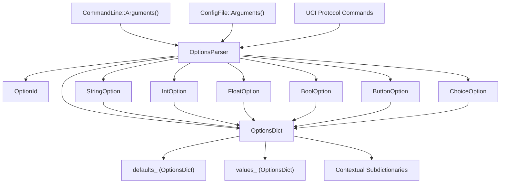
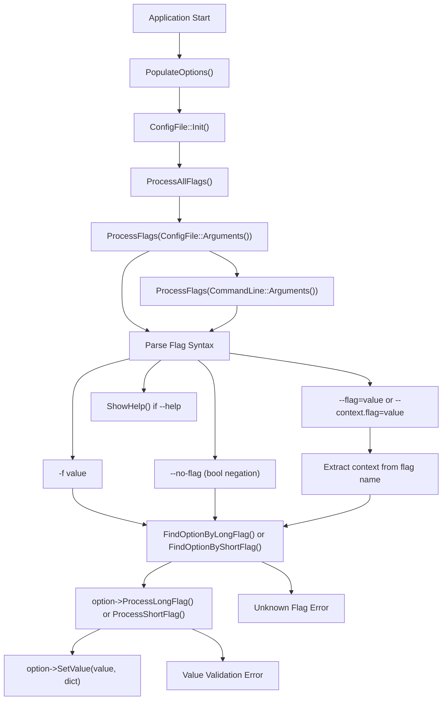
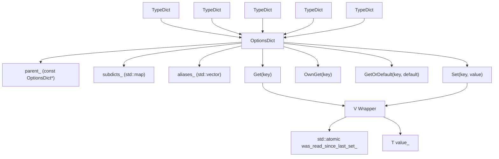
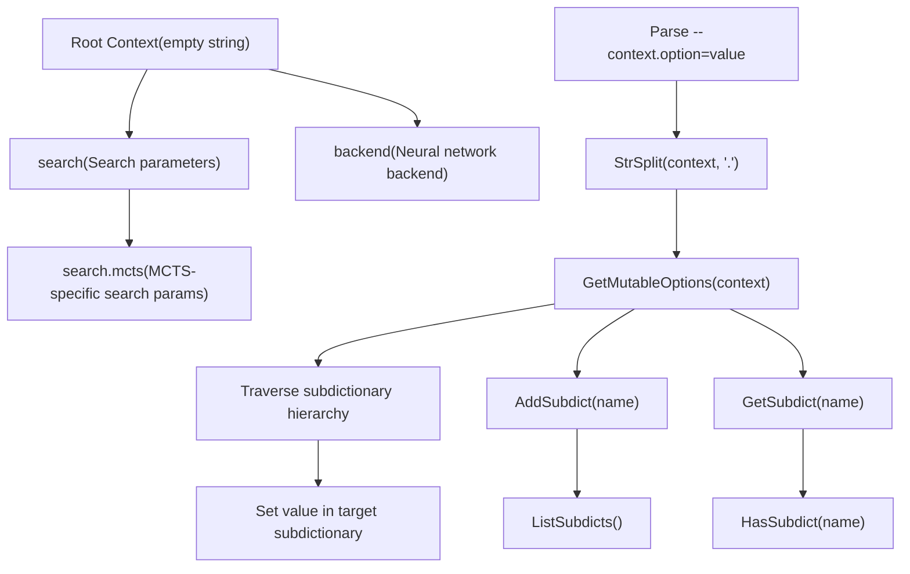
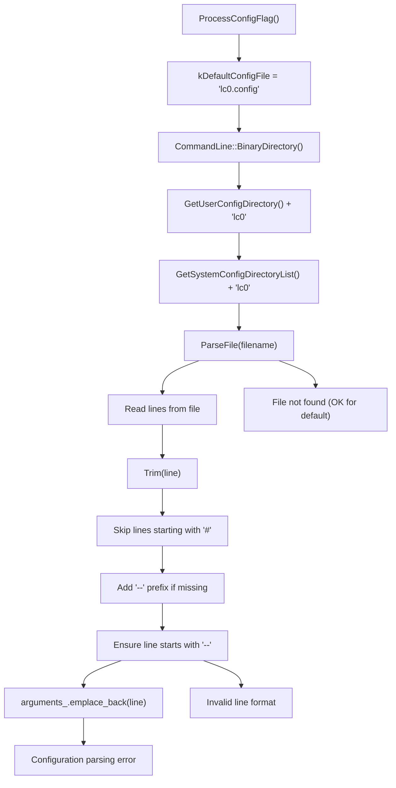

# Configuration System

Relevant source files

-   [src/utils/configfile.cc](https://github.com/LeelaChessZero/lc0/blob/b4e98c19/src/utils/configfile.cc)
-   [src/utils/configfile.h](https://github.com/LeelaChessZero/lc0/blob/b4e98c19/src/utils/configfile.h)
-   [src/utils/optionsdict.cc](https://github.com/LeelaChessZero/lc0/blob/b4e98c19/src/utils/optionsdict.cc)
-   [src/utils/optionsdict.h](https://github.com/LeelaChessZero/lc0/blob/b4e98c19/src/utils/optionsdict.h)
-   [src/utils/optionsparser.cc](https://github.com/LeelaChessZero/lc0/blob/b4e98c19/src/utils/optionsparser.cc)
-   [src/utils/optionsparser.h](https://github.com/LeelaChessZero/lc0/blob/b4e98c19/src/utils/optionsparser.h)
-   [src/utils/optionsparser\_test.cc](https://github.com/LeelaChessZero/lc0/blob/b4e98c19/src/utils/optionsparser_test.cc)

## Purpose and Scope

The Configuration System provides a unified framework for handling all configuration parameters in Leela Chess Zero. It manages command-line arguments, UCI protocol options, configuration files, and runtime parameter changes through a type-safe, hierarchical structure. The system supports multiple visibility modes for different user experience levels and contextual parameter organization.

For information about the UCI protocol implementation that uses this configuration system, see [UCI Protocol Implementation](/LeelaChessZero/lc0/3.1-uci-protocol-implementation).

## System Architecture

The configuration system consists of four main components that work together to provide flexible parameter management:

Sources: [src/utils/optionsparser.h40-130](https://github.com/LeelaChessZero/lc0/blob/b4e98c19/src/utils/optionsparser.h#L40-L130) [src/utils/optionsdict.h163-268](https://github.com/LeelaChessZero/lc0/blob/b4e98c19/src/utils/optionsdict.h#L163-L268) [src/utils/configfile.h37-48](https://github.com/LeelaChessZero/lc0/blob/b4e98c19/src/utils/configfile.h#L37-L48)

## Option Type Hierarchy

The system supports six distinct option types, each with specific validation and processing logic:

```mermaid
flowchart TD
    BaseOption["Option (Abstract)"]
    StringOption["StringOptionValueType: std::string"]
    IntOption["IntOptionValueType: intRange: min_ to max_"]
    FloatOption["FloatOptionValueType: floatRange: min_ to max_"]
    BoolOption["BoolOptionValueType: boolSupports: --flag, --no-flag"]
    ButtonOption["ButtonOptionValueType: ButtonUCI: type button"]
    ChoiceOption["ChoiceOptionValueType: std::stringChoices: choices_ vector"]
    ProcessLongFlag["ProcessLongFlag()"]
    ProcessShortFlag["ProcessShortFlag()"]
    ProcessShortFlagWithValue["ProcessShortFlagWithValue()"]
    SetValue["SetValue()"]
    GetOptionString["GetOptionString()"]

    BaseOption --> StringOption
    BaseOption --> IntOption
    BaseOption --> FloatOption
    BaseOption --> BoolOption
    BaseOption --> ButtonOption
    BaseOption --> ChoiceOption
    StringOption --> ProcessLongFlag
    StringOption --> ProcessShortFlagWithValue
    StringOption --> SetValue
    StringOption --> GetOptionString
    IntOption --> ProcessLongFlag
    IntOption --> ProcessShortFlagWithValue
    IntOption --> SetValue
    IntOption --> GetOptionString
    FloatOption --> ProcessLongFlag
    FloatOption --> ProcessShortFlagWithValue
    FloatOption --> SetValue
    FloatOption --> GetOptionString
    BoolOption --> ProcessLongFlag
    BoolOption --> ProcessShortFlag
    BoolOption --> SetValue
    BoolOption --> GetOptionString
    ButtonOption --> SetValue
    ButtonOption --> GetOptionString
    ChoiceOption --> ProcessLongFlag
    ChoiceOption --> ProcessShortFlagWithValue
    ChoiceOption --> SetValue
    ChoiceOption --> GetOptionString
```

Sources: [src/utils/optionsparser.h132-252](https://github.com/LeelaChessZero/lc0/blob/b4e98c19/src/utils/optionsparser.h#L132-L252) [src/utils/optionsparser.cc287-660](https://github.com/LeelaChessZero/lc0/blob/b4e98c19/src/utils/optionsparser.cc#L287-L660)

## Configuration Processing Flow

The system processes configuration from multiple sources in a specific order, with later sources overriding earlier ones:

Sources: [src/utils/optionsparser.cc116-200](https://github.com/LeelaChessZero/lc0/blob/b4e98c19/src/utils/optionsparser.cc#L116-L200) [src/utils/configfile.cc83-96](https://github.com/LeelaChessZero/lc0/blob/b4e98c19/src/utils/configfile.cc#L83-L96)

## OptionsDict Storage Architecture

The `OptionsDict` class provides a hierarchical, type-safe storage system with inheritance and aliasing capabilities:

Sources: [src/utils/optionsdict.h42-93](https://github.com/LeelaChessZero/lc0/blob/b4e98c19/src/utils/optionsdict.h#L42-L93) [src/utils/optionsdict.h163-267](https://github.com/LeelaChessZero/lc0/blob/b4e98c19/src/utils/optionsdict.h#L163-L267) [src/utils/optionsdict.h270-372](https://github.com/LeelaChessZero/lc0/blob/b4e98c19/src/utils/optionsdict.h#L270-L372)

## Option Visibility System

The configuration system supports three visibility modes to provide different user experience levels:

| Visibility Mode | Mask Value | Description | Usage |
| --- | --- | --- | --- |
| `kSimpleMode` | `1 << 0` | Basic options only | Beginner users |
| `kNormalMode` | `1 << 1` | Standard options | Default mode |
| `kProMode` | `1 << 2` | All options including advanced | Expert users |

### Visibility Masks

| Mask | Value | Visible In |
| --- | --- | --- |
| `kSimpleOnly` | `kSimpleMode` | Simple mode only |
| `kDefaultVisibility` | `kNormalMode | kProMode` | Normal and Pro modes |
| `kProOnly` | `kProMode` | Pro mode only |
| `kAlwaysVisible` | `kSimpleMode | kNormalMode | kProMode` | All modes |

The visibility mode is determined by the binary name or command-line flags:

-   Binary name contains "simple" → `kSimpleMode`
-   Binary name contains "pro" → `kProMode`
-   `--show-hidden` flag → `kProMode`
-   Default → `kNormalMode`

Sources: [src/utils/optionsdict.h95-147](https://github.com/LeelaChessZero/lc0/blob/b4e98c19/src/utils/optionsdict.h#L95-L147) [src/utils/optionsparser.cc123-133](https://github.com/LeelaChessZero/lc0/blob/b4e98c19/src/utils/optionsparser.cc#L123-L133)

## Contextual Configuration

The system supports hierarchical configuration contexts using dot notation:

Sources: [src/utils/optionsparser.cc98-114](https://github.com/LeelaChessZero/lc0/blob/b4e98c19/src/utils/optionsparser.cc#L98-L114) [src/utils/optionsdict.cc39-78](https://github.com/LeelaChessZero/lc0/blob/b4e98c19/src/utils/optionsdict.cc#L39-L78)

## Configuration File Processing

The configuration file system provides persistent storage for parameters with flexible location discovery:

Sources: [src/utils/configfile.cc58-160](https://github.com/LeelaChessZero/lc0/blob/b4e98c19/src/utils/configfile.cc#L58-L160) [src/utils/configfile.h37-58](https://github.com/LeelaChessZero/lc0/blob/b4e98c19/src/utils/configfile.h#L37-L58)

## Integration with Other Systems

The configuration system integrates with multiple components of the Leela Chess Zero engine:

| Integration Point | Description | Key Methods |
| --- | --- | --- |
| **UCI Protocol** | Exposes options as UCI parameters | `ListOptionsUci()`, `SetUciOption()` |
| **Command Line** | Processes startup arguments | `ProcessAllFlags()`, `CommandLine::Arguments()` |
| **Engine Options** | Provides runtime parameter access | `GetOptionsDict()`, `Get<T>()` |
| **Help System** | Generates formatted help output | `ShowHelp()`, `GetHelp()` |
| **Validation** | Ensures parameter correctness | `ValidateIntString()`, `SetVal()` |

The system serves as the central configuration hub, allowing all engine components to access their parameters through a consistent interface while maintaining type safety and validation.

Sources: [src/utils/optionsparser.cc51-72](https://github.com/LeelaChessZero/lc0/blob/b4e98c19/src/utils/optionsparser.cc#L51-L72) [src/utils/optionsparser.cc257-285](https://github.com/LeelaChessZero/lc0/blob/b4e98c19/src/utils/optionsparser.cc#L257-L285) [src/utils/optionsparser.h95-116](https://github.com/LeelaChessZero/lc0/blob/b4e98c19/src/utils/optionsparser.h#L95-L116)
