# Bitboards

Relevant source files

-   [src/chess/bitboard.h](https://github.com/LeelaChessZero/lc0/blob/b4e98c19/src/chess/bitboard.h)
-   [src/syzygy/syzygy.cc](https://github.com/LeelaChessZero/lc0/blob/b4e98c19/src/syzygy/syzygy.cc)
-   [src/syzygy/syzygy.h](https://github.com/LeelaChessZero/lc0/blob/b4e98c19/src/syzygy/syzygy.h)
-   [src/syzygy/syzygy\_test.cc](https://github.com/LeelaChessZero/lc0/blob/b4e98c19/src/syzygy/syzygy_test.cc)
-   [src/utils/bititer.h](https://github.com/LeelaChessZero/lc0/blob/b4e98c19/src/utils/bititer.h)

## Purpose and Scope

This document describes the bitboard implementation in Leela Chess Zero (lc0). Bitboards are a fundamental data structure used for efficient board representation and move generation in chess engines. This page covers the `BitBoard` class, bitboard operations, and the magic bitboard technique used for efficient sliding piece movement generation.

For information about how positions are encoded for neural network input, see [Position Encoding and History](/LeelaChessZero/lc0/4.2-position-encoding-and-history).

## What is a Bitboard?

A bitboard is a 64-bit integer where each bit represents a square on the chess board. This representation allows for efficient operations using bitwise operations like AND, OR, and XOR.

In lc0, bit enumeration goes from bottom to top, from left to right:

-   Square a1 is bit 0
-   Square h1 is bit 7
-   Square a2 is bit 8
-   ...and so on up to square h8 at bit 63

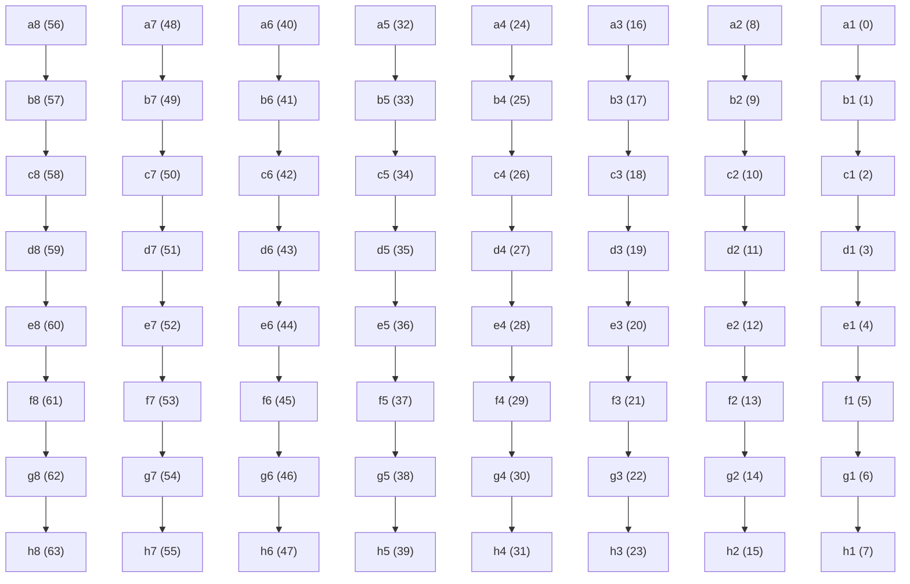
Sources: [src/chess/bitboard.h41-43](https://github.com/LeelaChessZero/lc0/blob/b4e98c19/src/chess/bitboard.h#L41-L43)

## BitBoard Class

The `BitBoard` class encapsulates a 64-bit integer and provides methods for manipulating the bits. It's defined in `src/chess/bitboard.h`.

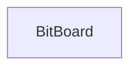
Sources: [src/chess/bitboard.h43-162](https://github.com/LeelaChessZero/lc0/blob/b4e98c19/src/chess/bitboard.h#L43-L162)

### Key BitBoard Operations

The BitBoard class offers several operations:

1.  **Creation and conversion**:

    -   Default constructor creates an empty bitboard
    -   Construction from a 64-bit integer
    -   `FromSquare` creates a bitboard with only one bit set
    -   `as_int()` returns the underlying 64-bit integer
2.  **Bit manipulation**:

    -   `set(square)`: Sets the bit for a specific square to 1
    -   `reset(square)`: Sets the bit for a specific square to 0
    -   `get(square)`: Gets the value of the bit for a specific square
    -   `set_if(square, condition)`: Sets the bit only if the condition is true
3.  **Bitboard queries**:

    -   `count()`: Counts the number of set bits (implemented using population count instructions when available)
    -   `count_few()`: Optimized for counting a small number of set bits
    -   `empty()`: Checks if all bits are 0
    -   `intersects(other)`: Checks if any bit is set in both bitboards
4.  **Bitboard transformations**:

    -   `Mirror()`: Flips the board vertically, mirroring black and white side of the board
5.  **Operators**:

    -   `|` (OR): Union of two bitboards
    -   `&` (AND): Intersection of two bitboards
    -   `-` (Subtraction): Difference between bitboards
6.  **Iteration**:

    -   `begin()` and `end()` methods support range-based for loops over set bits

Sources: [src/chess/bitboard.h45-158](https://github.com/LeelaChessZero/lc0/blob/b4e98c19/src/chess/bitboard.h#L45-L158) [src/utils/bititer.h36-121](https://github.com/LeelaChessZero/lc0/blob/b4e98c19/src/utils/bititer.h#L36-L121)

### BitBoard Iteration

The `BitBoard` class provides iteration over set bits using the `BitIterator` class. This allows iterating over all the pieces of a certain type on the board.

```
// Example of iterating over all squares set in a bitboard
for (auto square : some_bitboard) {
    // Do something with each set square
}
```
The implementation uses the `BitIterator` class defined in `src/utils/bititer.h`, which efficiently finds and iterates through set bits using bit manipulation techniques:

**BitIterator Implementation Details**

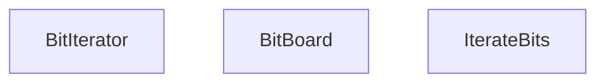
The `BitIterator` advances through set bits using the expression `value_ &= (value_ - 1)`, which efficiently clears the lowest set bit on each iteration. The `GetLowestBit` function uses platform-specific bit scan instructions:

| Platform | Implementation |
| --- | --- |
| MSVC 64-bit | `_BitScanForward64` |
| MSVC 32-bit | `_BitScanForward` with 64-bit handling |
| GCC/Clang | `__builtin_ctzll` |

Sources: [src/chess/bitboard.h112-117](https://github.com/LeelaChessZero/lc0/blob/b4e98c19/src/chess/bitboard.h#L112-L117) [src/utils/bititer.h37-54](https://github.com/LeelaChessZero/lc0/blob/b4e98c19/src/utils/bititer.h#L37-L54) [src/utils/bititer.h92-110](https://github.com/LeelaChessZero/lc0/blob/b4e98c19/src/utils/bititer.h#L92-L110) [src/utils/bititer.h112-121](https://github.com/LeelaChessZero/lc0/blob/b4e98c19/src/utils/bititer.h#L112-L121)

## Chess Board Representation and Bitboard Transformations

### Board Transformations

The `src/utils/bititer.h` file provides several board transformation functions for manipulating bitboards:

**Board Transformation Functions**

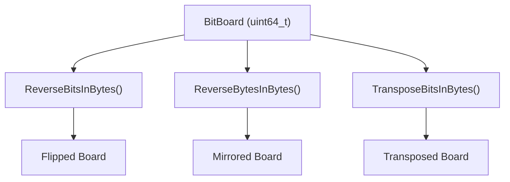
| Transform | Purpose | Implementation |
| --- | --- | --- |
| `ReverseBitsInBytes` | Horizontal mirror (flip left-right) | Bit manipulation with masks |
| `ReverseBytesInBytes` | Vertical mirror (flip top-bottom) | Byte reversal operations |
| `TransposeBitsInBytes` | Diagonal transpose (A1↔H8) | Complex bit permutation |

The `BitBoard::Mirror()` method uses `ReverseBytesInBytes` to flip the board vertically, which is used for flipping between white and black perspectives.

### Bitboard Usage in Syzygy Tablebases

The Syzygy tablebase implementation demonstrates practical bitboard usage:

**Piece Type Extraction**

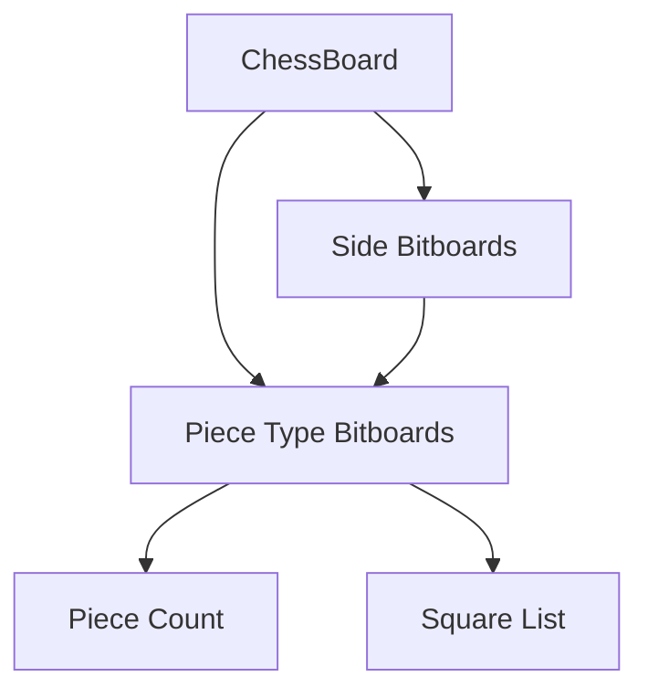
The `count_pieces` function in syzygy code shows typical bitboard operations:

```
// Extract pieces of specific type for a side
const BitBoard all = theirs ? pos.theirs() : pos.ours();
return (all & pos.queens()).count_few();
```
Sources: [src/chess/bitboard.h107](https://github.com/LeelaChessZero/lc0/blob/b4e98c19/src/chess/bitboard.h#L107-L107) [src/utils/bititer.h66-89](https://github.com/LeelaChessZero/lc0/blob/b4e98c19/src/utils/bititer.h#L66-L89) [src/syzygy/syzygy.cc185-204](https://github.com/LeelaChessZero/lc0/blob/b4e98c19/src/syzygy/syzygy.cc#L185-L204) [src/syzygy/syzygy.cc206-225](https://github.com/LeelaChessZero/lc0/blob/b4e98c19/src/syzygy/syzygy.cc#L206-L225)

## Move Generation and Bitboard Operations

### Bitboard Operations for Move Generation

Move generation in lc0 relies heavily on bitboard operations. The core operations include:

**Essential Bitboard Operations**

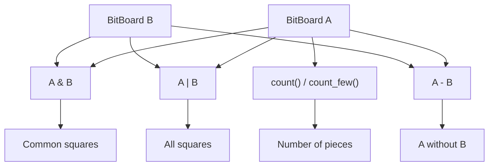
The `count_few()` method is optimized for sparse bitboards (typically used for piece types other than pawns):

| Condition | Implementation |
| --- | --- |
| `NO_POPCNT` defined | Software bit counting loop |
| Hardware POPCNT available | Delegates to `count()` |

### Practical Move Generation Examples

The Syzygy tablebase code demonstrates typical move generation patterns:

**Capture Detection**

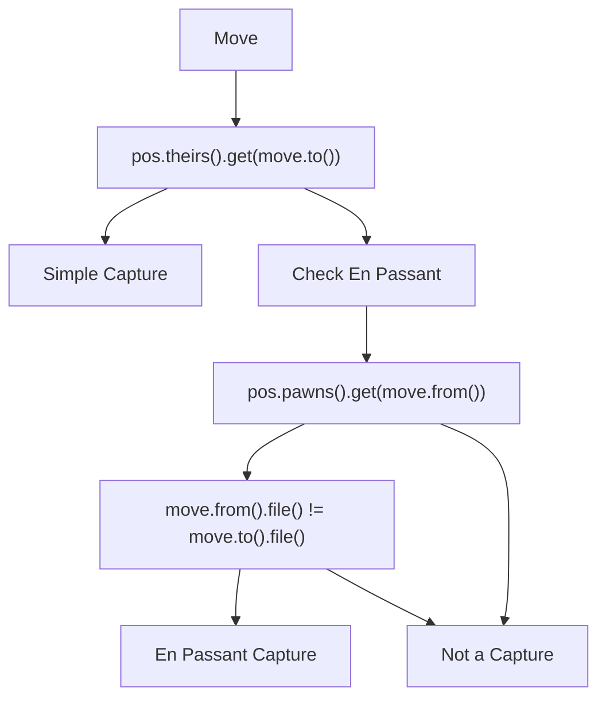
**Square Filling for Tablebase Lookup**

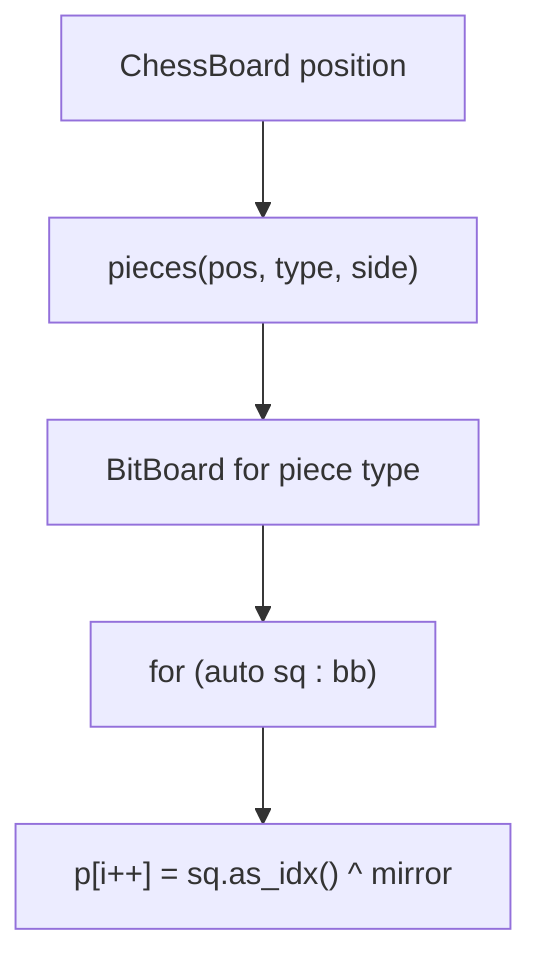
The `fill_squares` function shows how bitboards are converted to square arrays for tablebase indexing, applying board mirroring when necessary.

Sources: [src/chess/bitboard.h74-86](https://github.com/LeelaChessZero/lc0/blob/b4e98c19/src/chess/bitboard.h#L74-L86) [src/chess/bitboard.h129-158](https://github.com/LeelaChessZero/lc0/blob/b4e98c19/src/chess/bitboard.h#L129-L158) [src/syzygy/syzygy.cc227-235](https://github.com/LeelaChessZero/lc0/blob/b4e98c19/src/syzygy/syzygy.cc#L227-L235) [src/syzygy/syzygy.cc851-861](https://github.com/LeelaChessZero/lc0/blob/b4e98c19/src/syzygy/syzygy.cc#L851-L861)

## Advanced Bitboard Techniques

### Platform-Specific Optimizations

The bitboard implementation includes several platform-specific optimizations:

**Bit Scanning Functions**

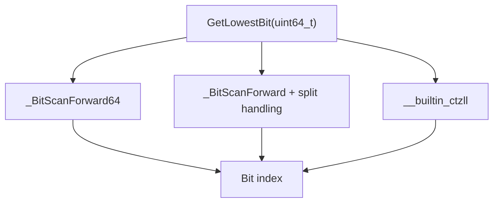
**Population Count Implementations**

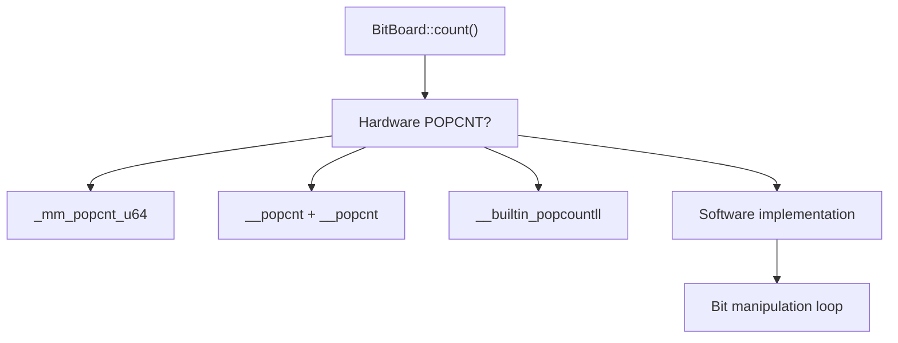
The software implementation uses the classic bit manipulation technique:

```
x -= (x >> 1) & 0x5555555555555555;
x = (x & 0x3333333333333333) + ((x >> 2) & 0x3333333333333333);
// ... continued bit manipulation
```
### Integration with Position Representation

Bitboards integrate with the broader position representation system:

**Position to Bitboard Conversion**

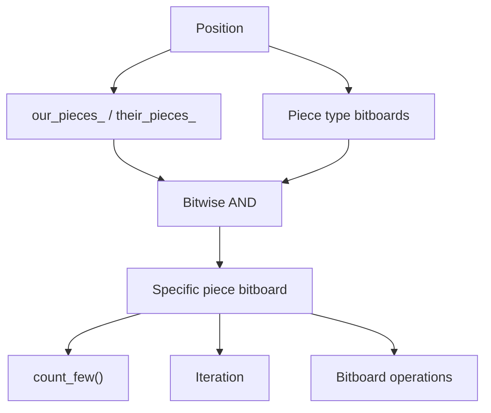
The Syzygy implementation shows how this is used in practice for determining piece material and positions for tablebase lookup.

Sources: [src/utils/bititer.h37-54](https://github.com/LeelaChessZero/lc0/blob/b4e98c19/src/utils/bititer.h#L37-L54) [src/chess/bitboard.h55-86](https://github.com/LeelaChessZero/lc0/blob/b4e98c19/src/chess/bitboard.h#L55-L86) [src/syzygy/syzygy.cc185-225](https://github.com/LeelaChessZero/lc0/blob/b4e98c19/src/syzygy/syzygy.cc#L185-L225)

## Performance Considerations

Bitboards provide several performance advantages in the lc0 engine:

### Hardware Acceleration

| Operation | Hardware Support | Performance Benefit |
| --- | --- | --- |
| Population count | POPCNT instruction | O(1) bit counting |
| Bit scanning | BSF/BSR instructions | Fast lowest bit finding |
| Parallel operations | 64-bit ALU operations | Multiple squares at once |

### Memory Efficiency

**Compact Board Representation**

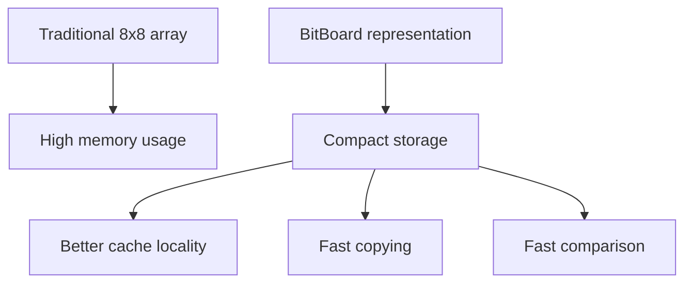
### Algorithmic Efficiency

The bitboard approach enables:

1.  **Parallel piece operations**: Operating on all pieces of a type simultaneously
2.  **Fast intersection tests**: Using bitwise AND to check piece interactions
3.  **Efficient iteration**: Using bit manipulation to iterate only over occupied squares

The `count_few()` optimization demonstrates performance consideration for sparse bitboards:

```
// Optimized for pieces with few instances (Q, R, N, B)
// Uses bit-clearing loop when POPCNT not available
x &= x - 1;  // Clears rightmost set bit
```
### Tablebase Integration Performance

The Syzygy tablebase code shows real-world bitboard performance patterns:

-   Direct bitboard access for piece counting
-   Efficient iteration over piece positions
-   Fast capture detection using bitboard intersections

Sources: [src/chess/bitboard.h55-86](https://github.com/LeelaChessZero/lc0/blob/b4e98c19/src/chess/bitboard.h#L55-L86) [src/utils/bititer.h37-54](https://github.com/LeelaChessZero/lc0/blob/b4e98c19/src/utils/bititer.h#L37-L54) [src/syzygy/syzygy.cc185-204](https://github.com/LeelaChessZero/lc0/blob/b4e98c19/src/syzygy/syzygy.cc#L185-L204)

## Summary

Bitboards are a key data structure in the Leela Chess Zero engine, providing efficient representation of the chess board and fast move generation. The implementation includes:

-   The `BitBoard` class for manipulating 64-bit board representations
-   Multiple bitboards to track different piece types and colors
-   Magic bitboards for efficient sliding piece move generation
-   Precomputed attack tables for non-sliding pieces
-   Two-step move generation (pseudolegal followed by legality check)

This efficient representation contributes significantly to the engine's performance, allowing it to evaluate positions and generate moves quickly.
