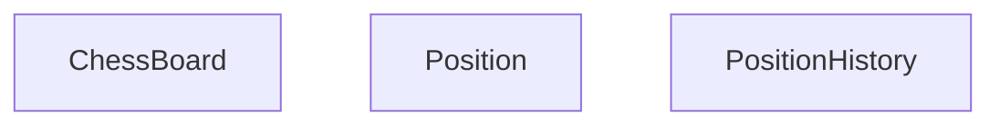
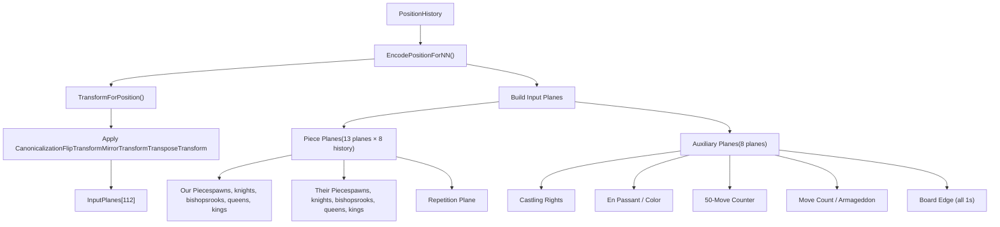
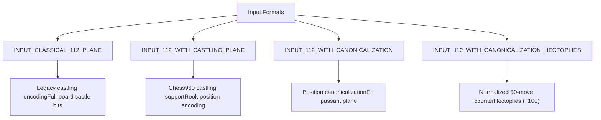
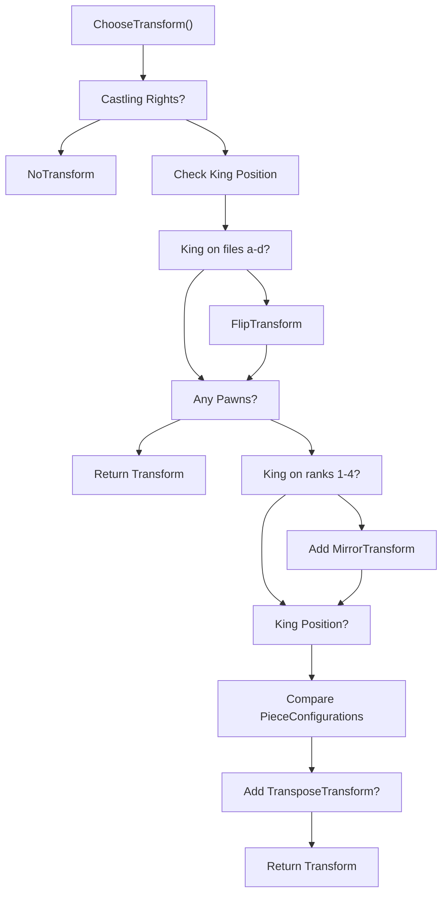

# Position Encoding and History

Relevant source files

-   [src/chess/board.cc](https://github.com/LeelaChessZero/lc0/blob/b4e98c19/src/chess/board.cc)
-   [src/chess/board.h](https://github.com/LeelaChessZero/lc0/blob/b4e98c19/src/chess/board.h)
-   [src/chess/board\_test.cc](https://github.com/LeelaChessZero/lc0/blob/b4e98c19/src/chess/board_test.cc)
-   [src/chess/position.cc](https://github.com/LeelaChessZero/lc0/blob/b4e98c19/src/chess/position.cc)
-   [src/chess/position.h](https://github.com/LeelaChessZero/lc0/blob/b4e98c19/src/chess/position.h)
-   [src/chess/position\_test.cc](https://github.com/LeelaChessZero/lc0/blob/b4e98c19/src/chess/position_test.cc)
-   [src/neural/encoder.cc](https://github.com/LeelaChessZero/lc0/blob/b4e98c19/src/neural/encoder.cc)
-   [src/neural/encoder.h](https://github.com/LeelaChessZero/lc0/blob/b4e98c19/src/neural/encoder.h)
-   [src/neural/encoder\_test.cc](https://github.com/LeelaChessZero/lc0/blob/b4e98c19/src/neural/encoder_test.cc)

## Purpose and Scope

This document covers how chess positions are represented, managed, and encoded for neural network inference in Leela Chess Zero. It encompasses the core position representation classes, game history tracking, and the encoding pipeline that converts chess positions into the 112-plane input format required by the neural network.

For information about the neural network architecture itself, see [Neural Network System](/LeelaChessZero/lc0/6-neural-network-system). For details about move generation and chess rules implementation, see [Bitboards and Move Generation](/LeelaChessZero/lc0/4.1-bitboards-and-move-generation).

## Core Position Representation

The position encoding system is built around three primary classes that work together to represent chess game states:

**Sources:** [src/chess/board.h59-254](https://github.com/LeelaChessZero/lc0/blob/b4e98c19/src/chess/board.h#L59-L254) [src/chess/position.h38-91](https://github.com/LeelaChessZero/lc0/blob/b4e98c19/src/chess/position.h#L38-L91) [src/chess/position.h99-159](https://github.com/LeelaChessZero/lc0/blob/b4e98c19/src/chess/position.h#L99-L159)

### ChessBoard Class

The `ChessBoard` class represents the fundamental board state using bitboards for efficient piece representation. Key characteristics:

-   **Player Perspective**: Always represents the position from the current player's perspective
-   **Mirroring**: Black positions are mirrored so black pieces appear on ranks 1-2 instead of 7-8
-   **Bitboard Storage**: Uses separate bitboards for piece types (`rooks_`, `bishops_`, `pawns_`) and colors (`our_pieces_`, `their_pieces_`)
-   **Castling Rights**: Tracks castling availability through the `Castlings` class with support for Chess960

**Sources:** [src/chess/board.h59-254](https://github.com/LeelaChessZero/lc0/blob/b4e98c19/src/chess/board.h#L59-L254) [src/chess/board.cc54-68](https://github.com/LeelaChessZero/lc0/blob/b4e98c19/src/chess/board.cc#L54-L68)

### Position Class

The `Position` class wraps a `ChessBoard` with additional game metadata:

-   **Rule50 Counter**: Tracks half-moves since last capture or pawn move for 50-move rule
-   **Repetition Tracking**: Counts position repetitions and cycle lengths for threefold repetition rule
-   **Game Ply**: Total half-moves since game start
-   **Hash Function**: Provides unique hash for position comparison

**Sources:** [src/chess/position.h38-91](https://github.com/LeelaChessZero/lc0/blob/b4e98c19/src/chess/position.h#L38-L91) [src/chess/position.cc40-61](https://github.com/LeelaChessZero/lc0/blob/b4e98c19/src/chess/position.cc#L40-L61)

### PositionHistory Class

The `PositionHistory` class manages the complete sequence of positions in a game:

-   **Move Application**: Appends new positions by applying moves to the last position
-   **Repetition Detection**: Automatically computes repetitions when moves are added
-   **Game Termination**: Determines draw/win conditions based on position history
-   **Hash Computation**: Provides rolling hash of recent positions

**Sources:** [src/chess/position.h99-159](https://github.com/LeelaChessZero/lc0/blob/b4e98c19/src/chess/position.h#L99-L159) [src/chess/position.cc105-149](https://github.com/LeelaChessZero/lc0/blob/b4e98c19/src/chess/position.cc#L105-L149)

## Neural Network Encoding Pipeline

The encoding system transforms chess positions into the 112-plane input format required by the neural network:

**Sources:** [src/neural/encoder.cc134-336](https://github.com/LeelaChessZero/lc0/blob/b4e98c19/src/neural/encoder.cc#L134-L336) [src/neural/encoder.h48-57](https://github.com/LeelaChessZero/lc0/blob/b4e98c19/src/neural/encoder.h#L48-L57)

### Input Plane Structure

The 112-plane input format consists of:

| Plane Range | Description | Content |
| --- | --- | --- |
| 0-103 | Position History | 8 positions × 13 planes each |
| 104-111 | Auxiliary Data | Castling, en passant, counters |

Each of the 8 historical positions uses 13 planes:

-   Planes 0-5: Our pieces (pawns, knights, bishops, rooks, queens, king)
-   Planes 6-11: Their pieces (pawns, knights, bishops, rooks, queens, king)
-   Plane 12: Repetition indicator

**Sources:** [src/neural/encoder.h38-40](https://github.com/LeelaChessZero/lc0/blob/b4e98c19/src/neural/encoder.h#L38-L40) [src/neural/encoder.cc275-290](https://github.com/LeelaChessZero/lc0/blob/b4e98c19/src/neural/encoder.cc#L275-L290)

### Encoding Formats

Multiple input formats are supported for different network architectures:

**Sources:** [src/neural/encoder.cc154-208](https://github.com/LeelaChessZero/lc0/blob/b4e98c19/src/neural/encoder.cc#L154-L208) [src/neural/encoder.h59-63](https://github.com/LeelaChessZero/lc0/blob/b4e98c19/src/neural/encoder.h#L59-L63)

## Position Canonicalization

For canonical input formats, positions undergo geometric transformations to reduce the input space:

### Transform Selection Logic

**Sources:** [src/neural/encoder.cc50-102](https://github.com/LeelaChessZero/lc0/blob/b4e98c19/src/neural/encoder.cc#L50-L102) [src/neural/encoder.cc309-325](https://github.com/LeelaChessZero/lc0/blob/b4e98c19/src/neural/encoder.cc#L309-L325)

### Transformation Types

The system applies up to three geometric transformations:

-   **FlipTransform**: Horizontal flip (files a↔h, b↔g, etc.)
-   **MirrorTransform**: Vertical flip (ranks 1↔8, 2↔7, etc.)
-   **TransposeTransform**: Diagonal transpose (files become ranks)

These transforms reduce the effective input space while preserving chess semantics, improving training efficiency.

**Sources:** [src/neural/encoder.cc314-323](https://github.com/LeelaChessZero/lc0/blob/b4e98c19/src/neural/encoder.cc#L314-L323)

## History Management and Repetition Detection

The system implements sophisticated repetition detection for draw determination:

### Repetition Detection Algorithm

> **[Mermaid sequence]**
> *(图表结构无法解析)*

**Sources:** [src/chess/position.cc105-130](https://github.com/LeelaChessZero/lc0/blob/b4e98c19/src/chess/position.cc#L105-L130) [src/chess/position.h114-151](https://github.com/LeelaChessZero/lc0/blob/b4e98c19/src/chess/position.h#L114-L151)

### Game State Tracking

The position history tracks multiple game state indicators:

-   **50-Move Rule**: Automatic reset on captures and pawn moves
-   **Threefold Repetition**: Exact position matching with same player to move
-   **Draw Detection**: Insufficient material, stalemate, repetition, 50-move rule
-   **Cycle Length**: Distance between repeated positions

**Sources:** [src/chess/position.cc75-92](https://github.com/LeelaChessZero/lc0/blob/b4e98c19/src/chess/position.cc#L75-L92) [src/chess/position.cc115-130](https://github.com/LeelaChessZero/lc0/blob/b4e98c19/src/chess/position.cc#L115-L130)

## Implementation Details

### Memory and Performance

The encoding system is optimized for neural network batch processing:

-   **Bitboard Operations**: Efficient piece queries using bitwise operations
-   **Plane Reuse**: InputPlanes use masks and values to minimize memory allocation
-   **Transform Caching**: Transformations computed once and applied to all planes
-   **History Limits**: Fixed 8-position history prevents unbounded growth

**Sources:** [src/neural/encoder.cc309-327](https://github.com/LeelaChessZero/lc0/blob/b4e98c19/src/neural/encoder.cc#L309-L327) [src/chess/board.cc429-573](https://github.com/LeelaChessZero/lc0/blob/b4e98c19/src/chess/board.cc#L429-L573)

### FEN Integration

The system provides seamless FEN (Forsyth-Edwards Notation) integration:

-   **FEN Parsing**: `ChessBoard::SetFromFen()` handles standard and partial FEN strings
-   **FEN Generation**: `PositionToFen()` exports positions in standard format
-   **Metadata Preservation**: Rule50 ply and move counters maintained through FEN round-trips

**Sources:** [src/chess/board.cc948-1103](https://github.com/LeelaChessZero/lc0/blob/b4e98c19/src/chess/board.cc#L948-L1103) [src/chess/position.cc151-157](https://github.com/LeelaChessZero/lc0/blob/b4e98c19/src/chess/position.cc#L151-L157)
