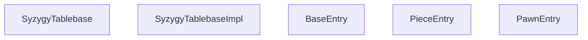
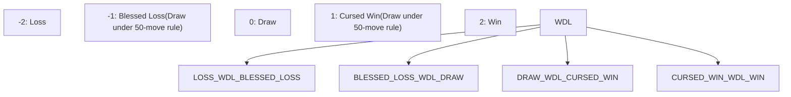
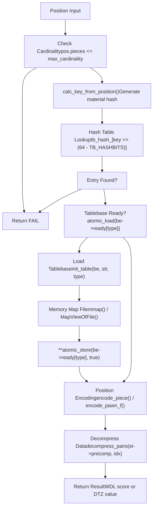
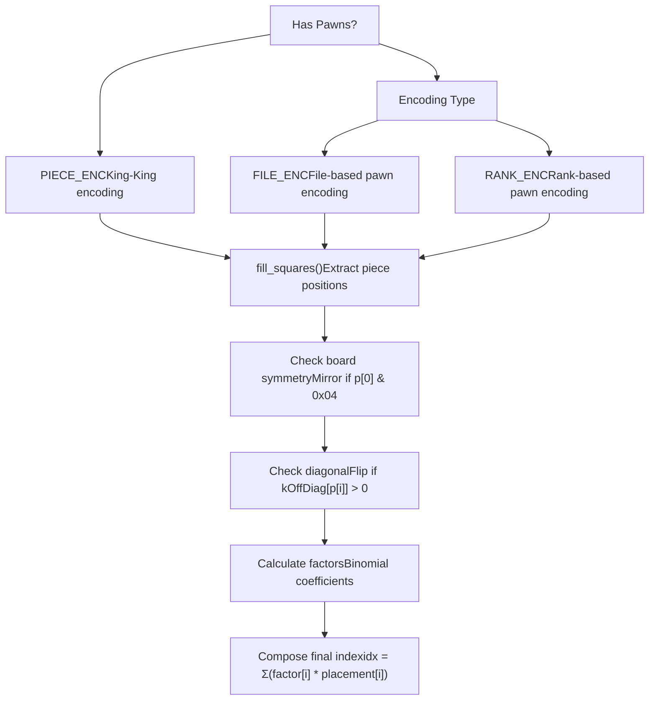
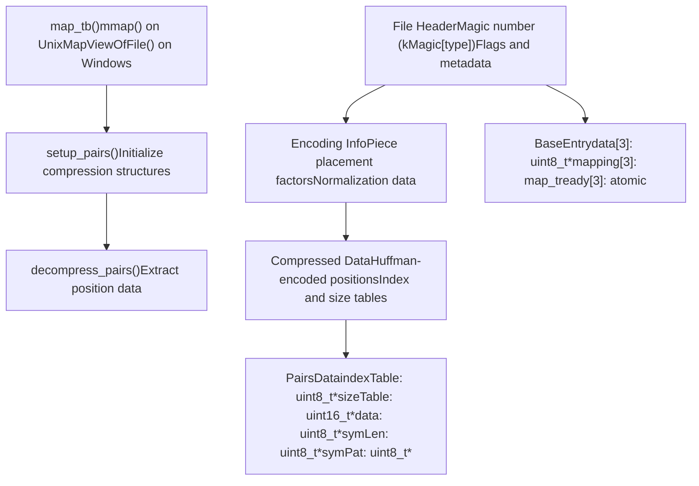

# Syzygy Tablebase Integration

Relevant source files

-   [src/chess/bitboard.h](https://github.com/LeelaChessZero/lc0/blob/b4e98c19/src/chess/bitboard.h)
-   [src/syzygy/syzygy.cc](https://github.com/LeelaChessZero/lc0/blob/b4e98c19/src/syzygy/syzygy.cc)
-   [src/syzygy/syzygy.h](https://github.com/LeelaChessZero/lc0/blob/b4e98c19/src/syzygy/syzygy.h)
-   [src/syzygy/syzygy\_test.cc](https://github.com/LeelaChessZero/lc0/blob/b4e98c19/src/syzygy/syzygy_test.cc)
-   [src/utils/bititer.h](https://github.com/LeelaChessZero/lc0/blob/b4e98c19/src/utils/bititer.h)

This document covers the Syzygy endgame tablebase integration in Leela Chess Zero, including WDL and DTZ probing, position encoding, file management, and integration with the search system. For information about the chess position representation itself, see [Chess Representation](/LeelaChessZero/lc0/4-chess-representation). For details about the search algorithm that uses tablebase probes, see [Search Algorithm](/LeelaChessZero/lc0/5-search-algorithm).

## Overview

Syzygy tablebases are compressed endgame databases that provide perfect play information for chess positions with a limited number of pieces. The lc0 integration supports both WDL (Win/Draw/Loss) and DTZ (Distance to Zero) tablebase formats, enabling the engine to play endgames with perfect accuracy when tablebase files are available.

The system uses memory-mapped file access for efficient tablebase reading, sophisticated position encoding schemes to minimize storage requirements, and thread-safe probing operations that integrate seamlessly with the Monte Carlo Tree Search.

Sources: [src/syzygy/syzygy.h1-113](https://github.com/LeelaChessZero/lc0/blob/b4e98c19/src/syzygy/syzygy.h#L1-L113) [src/syzygy/syzygy.cc1-100](https://github.com/LeelaChessZero/lc0/blob/b4e98c19/src/syzygy/syzygy.cc#L1-L100)

## Main Interface

The `SyzygyTablebase` class provides the primary interface for tablebase operations. It follows a PIMPL (Pointer to Implementation) pattern, with the actual implementation hidden in `SyzygyTablebaseImpl`.

Sources: [src/syzygy/syzygy.h58-111](https://github.com/LeelaChessZero/lc0/blob/b4e98c19/src/syzygy/syzygy.h#L58-L111) [src/syzygy/syzygy.cc865-1008](https://github.com/LeelaChessZero/lc0/blob/b4e98c19/src/syzygy/syzygy.cc#L865-L1008) [src/syzygy/syzygy.cc131-165](https://github.com/LeelaChessZero/lc0/blob/b4e98c19/src/syzygy/syzygy.cc#L131-L165)

## Tablebase Types and Scoring

The system supports three types of tablebase files, each serving different purposes in endgame evaluation:

| Type | Extension | Purpose | Value Range |
| --- | --- | --- | --- |
| WDL | `.rtbw` | Win/Draw/Loss evaluation | WDL\_LOSS (-2) to WDL\_WIN (2) |
| DTM | `.rtbm` | Distance to Mate | Plies to mate/mated |
| DTZ | `.rtbz` | Distance to Zeroing move | Plies to pawn move/capture |

The `WDLScore` enumeration includes special cases for the 50-move rule:

Sources: [src/syzygy/syzygy.h40-54](https://github.com/LeelaChessZero/lc0/blob/b4e98c19/src/syzygy/syzygy.h#L40-L54) [src/syzygy/syzygy.cc81-83](https://github.com/LeelaChessZero/lc0/blob/b4e98c19/src/syzygy/syzygy.cc#L81-L83) [src/syzygy/syzygy.cc172-177](https://github.com/LeelaChessZero/lc0/blob/b4e98c19/src/syzygy/syzygy.cc#L172-L177)

## Probing Workflow

The tablebase probing process follows a structured workflow that handles position encoding, file access, and result interpretation:

Sources: [src/syzygy/syzygy.cc1327-1443](https://github.com/LeelaChessZero/lc0/blob/b4e98c19/src/syzygy/syzygy.cc#L1327-L1443) [src/syzygy/syzygy.cc1041-1087](https://github.com/LeelaChessZero/lc0/blob/b4e98c19/src/syzygy/syzygy.cc#L1041-L1087) [src/syzygy/syzygy.cc1188-1325](https://github.com/LeelaChessZero/lc0/blob/b4e98c19/src/syzygy/syzygy.cc#L1188-L1325)

## Position Encoding System

The tablebase system uses sophisticated position encoding to compress the astronomical number of possible chess positions into manageable indices:

The encoding functions handle different piece configurations:

-   `encode_piece()` for pieceful endgames without pawns
-   `encode_pawn_f()` for pawn endgames with file-based encoding
-   `encode_pawn_r()` for pawn endgames with rank-based encoding

Sources: [src/syzygy/syzygy.cc490-601](https://github.com/LeelaChessZero/lc0/blob/b4e98c19/src/syzygy/syzygy.cc#L490-L601) [src/syzygy/syzygy.cc851-861](https://github.com/LeelaChessZero/lc0/blob/b4e98c19/src/syzygy/syzygy.cc#L851-L861) [src/syzygy/syzygy.cc1395-1416](https://github.com/LeelaChessZero/lc0/blob/b4e98c19/src/syzygy/syzygy.cc#L1395-L1416)

## File Management and Compression

The system manages tablebase files through memory mapping and uses sophisticated compression based on Huffman-like encoding:

Sources: [src/syzygy/syzygy.cc1041-1096](https://github.com/LeelaChessZero/lc0/blob/b4e98c19/src/syzygy/syzygy.cc#L1041-L1096) [src/syzygy/syzygy.cc723-781](https://github.com/LeelaChessZero/lc0/blob/b4e98c19/src/syzygy/syzygy.cc#L723-L781) [src/syzygy/syzygy.cc783-845](https://github.com/LeelaChessZero/lc0/blob/b4e98c19/src/syzygy/syzygy.cc#L783-L845) [src/syzygy/syzygy.cc110-122](https://github.com/LeelaChessZero/lc0/blob/b4e98c19/src/syzygy/syzygy.cc#L110-L122)

## Integration with Search System

The tablebase system integrates with the search algorithm through several key interfaces that provide both position evaluation and move filtering:

> **[Mermaid sequence]**
> *(图表结构无法解析)*

Key integration points:

-   `max_cardinality()` determines if tablebase can handle position
-   `probe_wdl()` provides exact evaluation for terminal positions
-   `root_probe()` filters moves to maintain optimal play
-   Thread-safe design allows concurrent probing during parallel search

Sources: [src/syzygy/syzygy.h91-99](https://github.com/LeelaChessZero/lc0/blob/b4e98c19/src/syzygy/syzygy.h#L91-L99) [src/syzygy/syzygy.cc1012-1022](https://github.com/LeelaChessZero/lc0/blob/b4e98c19/src/syzygy/syzygy.cc#L1012-L1022) [src/syzygy/syzygy\_test.cc39-77](https://github.com/LeelaChessZero/lc0/blob/b4e98c19/src/syzygy/syzygy_test.cc#L39-L77)
