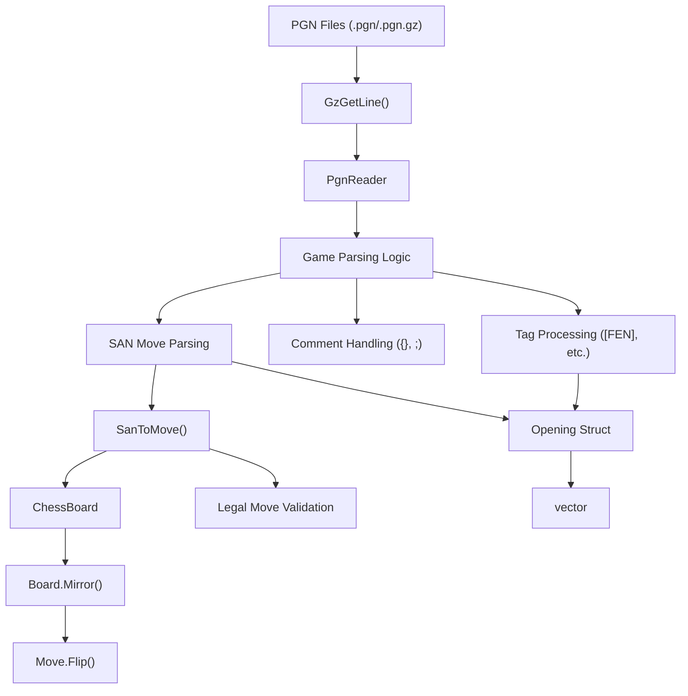
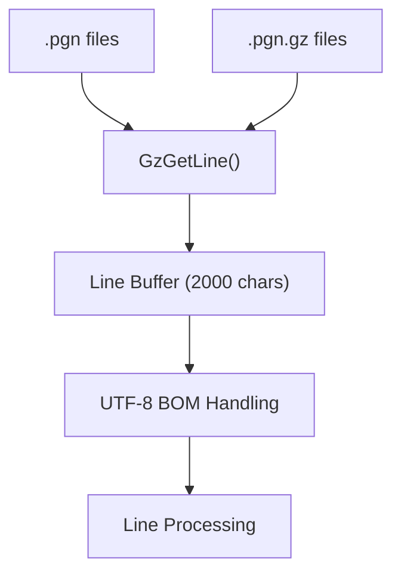
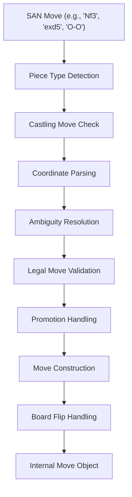

# PGN and Game Import

Relevant source files

-   [src/chess/pgn.h](https://github.com/LeelaChessZero/lc0/blob/b4e98c19/src/chess/pgn.h)
-   [src/utils/cppattributes.h](https://github.com/LeelaChessZero/lc0/blob/b4e98c19/src/utils/cppattributes.h)
-   [src/utils/mutex.h](https://github.com/LeelaChessZero/lc0/blob/b4e98c19/src/utils/mutex.h)
-   [src/utils/random.cc](https://github.com/LeelaChessZero/lc0/blob/b4e98c19/src/utils/random.cc)
-   [src/utils/random.h](https://github.com/LeelaChessZero/lc0/blob/b4e98c19/src/utils/random.h)
-   [src/utils/spinhelper.h](https://github.com/LeelaChessZero/lc0/blob/b4e98c19/src/utils/spinhelper.h)

This document describes the PGN (Portable Game Notation) parsing and game import system in Leela Chess Zero. This system enables the engine to read chess games from PGN files and convert them into internal representations suitable for opening book creation and game analysis.

For chess position representation and move encoding used by the PGN system, see [Position Encoding and History](/LeelaChessZero/lc0/4.2-position-encoding-and-history). For bitboard-based move generation that supports the PGN parser, see [Bitboards and Move Generation](/LeelaChessZero/lc0/4.1-bitboards-and-move-generation).

## System Overview

The PGN import system provides functionality to parse standard chess game files and convert them into Lc0's internal format. The system supports compressed PGN files, handles various PGN annotations and comments, and converts Standard Algebraic Notation (SAN) moves into the engine's native move representation.

## PGN Parser Architecture


*PGN parsing flow from file input to internal game representation*

Sources: [src/chess/pgn.h66-337](https://github.com/LeelaChessZero/lc0/blob/b4e98c19/src/chess/pgn.h#L66-L337)

## Core Components

### PgnReader Class

The `PgnReader` class is the primary interface for PGN file processing. It maintains internal state for parsing games and provides methods to add PGN files and retrieve parsed games.

| Method | Purpose | Return Type |
| --- | --- | --- |
| `AddPgnFile()` | Parses a PGN file and adds games to internal storage | `void` |
| `GetGames()` | Returns a copy of all parsed games | `std::vector<Opening>` |
| `ReleaseGames()` | Returns and clears all parsed games | `std::vector<Opening>&&` |

**Key State Variables:**

-   `cur_board_`: Current board position during parsing
-   `cur_game_`: Move list for the current game being parsed
-   `cur_startpos_`: Starting FEN position for current game
-   `games_`: Vector storing all completed parsed games

Sources: [src/chess/pgn.h66-164](https://github.com/LeelaChessZero/lc0/blob/b4e98c19/src/chess/pgn.h#L66-L164) [src/chess/pgn.h333-336](https://github.com/LeelaChessZero/lc0/blob/b4e98c19/src/chess/pgn.h#L333-L336)

### Opening Structure

The `Opening` struct represents a parsed chess game with its starting position and move sequence:

```
struct Opening {
  std::string start_fen = ChessBoard::kStartposFen;
  MoveList moves;
};
```
This structure stores games in a format suitable for opening book creation or game replay.

Sources: [src/chess/pgn.h45-48](https://github.com/LeelaChessZero/lc0/blob/b4e98c19/src/chess/pgn.h#L45-L48)

## File Format Support

### Gzip Compression Support

The system supports both plain text and gzip-compressed PGN files through the `GzGetLine()` function, which provides a unified interface for reading lines from compressed or uncompressed files.


*File input handling with compression support*

The function handles:

-   Automatic detection of gzip compression
-   UTF-8 BOM (Byte Order Mark) removal
-   Line ending normalization (CR/LF)
-   Buffer management for long lines

Sources: [src/chess/pgn.h50-64](https://github.com/LeelaChessZero/lc0/blob/b4e98c19/src/chess/pgn.h#L50-L64) [src/chess/pgn.h68-83](https://github.com/LeelaChessZero/lc0/blob/b4e98c19/src/chess/pgn.h#L68-L83)

### PGN Tag Processing

The parser recognizes and processes PGN tags, with special handling for the FEN tag to support games starting from non-standard positions:

-   **FEN Tag**: Sets starting position for games that don't begin from the standard starting position
-   **Other Tags**: Ignored but properly parsed to avoid interfering with move parsing

Sources: [src/chess/pgn.h84-99](https://github.com/LeelaChessZero/lc0/blob/b4e98c19/src/chess/pgn.h#L84-L99)

## SAN to Move Conversion

### SAN Parsing Logic

The `SanToMove()` function converts Standard Algebraic Notation into Lc0's internal move representation. This involves complex logic to handle:


*SAN to internal move conversion process*

**Supported SAN Features:**

-   Piece moves with disambiguation (e.g., `Nbd2`, `R1a3`)
-   Pawn moves and captures (e.g., `e4`, `exd5`)
-   Castling notation (`O-O`, `O-O-O`)
-   Promotion notation (e.g., `e8=Q`)
-   En passant captures
-   Check and checkmate annotations (parsed but not used)

Sources: [src/chess/pgn.h195-331](https://github.com/LeelaChessZero/lc0/blob/b4e98c19/src/chess/pgn.h#L195-L331)

### Move Validation and Disambiguation

The parser validates moves against the current board position and resolves ambiguous notation:

1.  **Legal Move Generation**: Uses `board.GenerateLegalMoves()` to get valid moves
2.  **Disambiguation**: Handles cases where multiple pieces can reach the same square
3.  **Error Handling**: Throws exceptions for illegal or ambiguous moves

Sources: [src/chess/pgn.h280-310](https://github.com/LeelaChessZero/lc0/blob/b4e98c19/src/chess/pgn.h#L280-L310)

## Comment and Annotation Handling

The parser processes various PGN comment formats:

| Comment Type | Syntax | Handling |
| --- | --- | --- |
| Brace Comments | `{comment}` | Completely removed from move text |
| Semicolon Comments | `;comment` | Removed from end of line |
| Game Results | `1-0`, `0-1`, `1/2-1/2`, `*` | Recognized and ignored |
| Move Numbers | `1.`, `23...` | Stripped from move notation |

The parser maintains state to handle multi-line brace comments correctly.

Sources: [src/chess/pgn.h104-124](https://github.com/LeelaChessZero/lc0/blob/b4e98c19/src/chess/pgn.h#L104-L124) [src/chess/pgn.h147-149](https://github.com/LeelaChessZero/lc0/blob/b4e98c19/src/chess/pgn.h#L147-L149)

## Board State Management

### Position Mirroring

The parser handles Lc0's internal board representation, which uses position mirroring for black moves:

1.  **White Moves**: Applied directly to board
2.  **Black Moves**: Board is mirrored before and after move application
3.  **Move Flipping**: Even-numbered moves (black) have their representation flipped

This ensures compatibility with Lc0's neural network input format.

Sources: [src/chess/pgn.h150-156](https://github.com/LeelaChessZero/lc0/blob/b4e98c19/src/chess/pgn.h#L150-L156)

## Integration Points

### Engine Integration

The PGN system integrates with several engine components:

-   **ChessBoard**: Provides position representation and legal move generation
-   **Move Objects**: Uses Lc0's internal move representation
-   **Opening Books**: Parsed games can be used to create opening book databases
-   **Self-Play System**: May utilize PGN import for training data preparation

### Error Handling

The system uses Lc0's exception framework for error reporting:

-   **File Not Found**: Specific error message for missing PGN files
-   **Illegal Moves**: Exceptions thrown for invalid SAN notation
-   **Ambiguous Moves**: Errors when disambiguation fails

Sources: [src/chess/pgn.h71-72](https://github.com/LeelaChessZero/lc0/blob/b4e98c19/src/chess/pgn.h#L71-L72) [src/chess/pgn.h302](https://github.com/LeelaChessZero/lc0/blob/b4e98c19/src/chess/pgn.h#L302-L302) [src/chess/pgn.h309](https://github.com/LeelaChessZero/lc0/blob/b4e98c19/src/chess/pgn.h#L309-L309)
