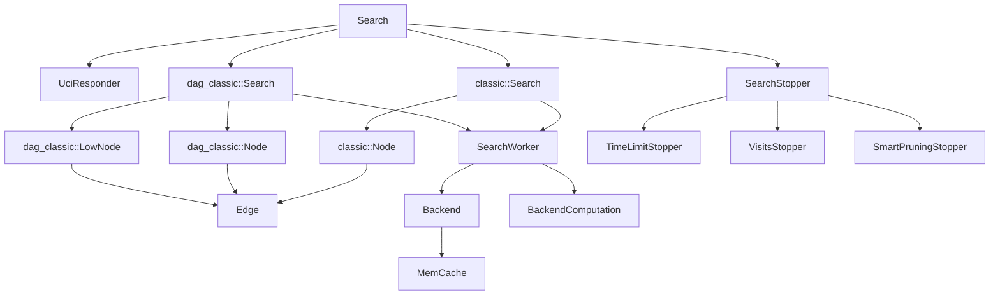
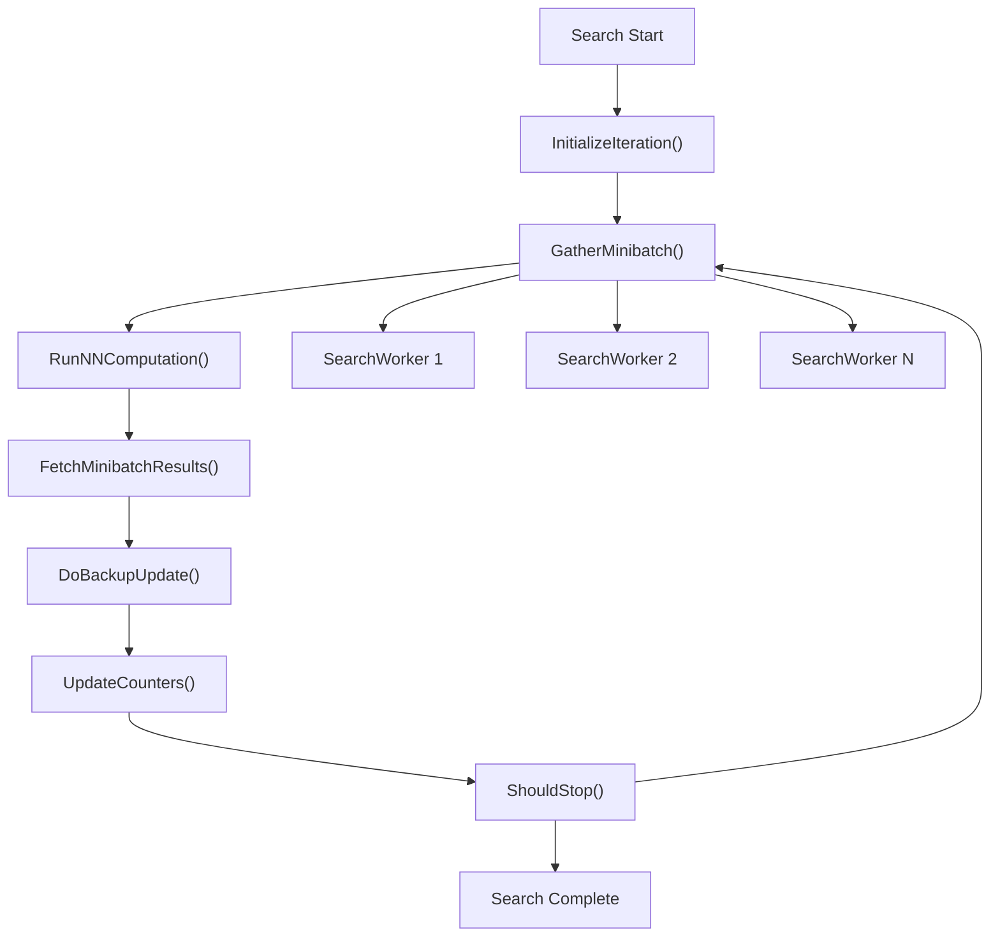
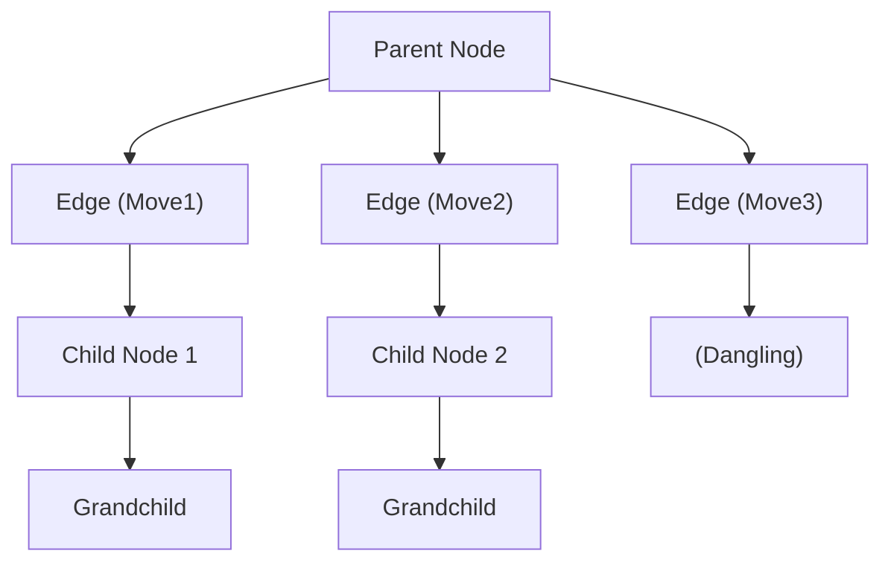
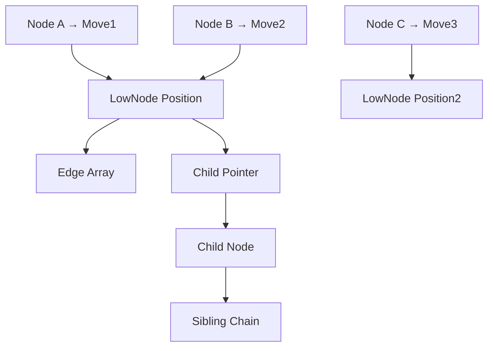
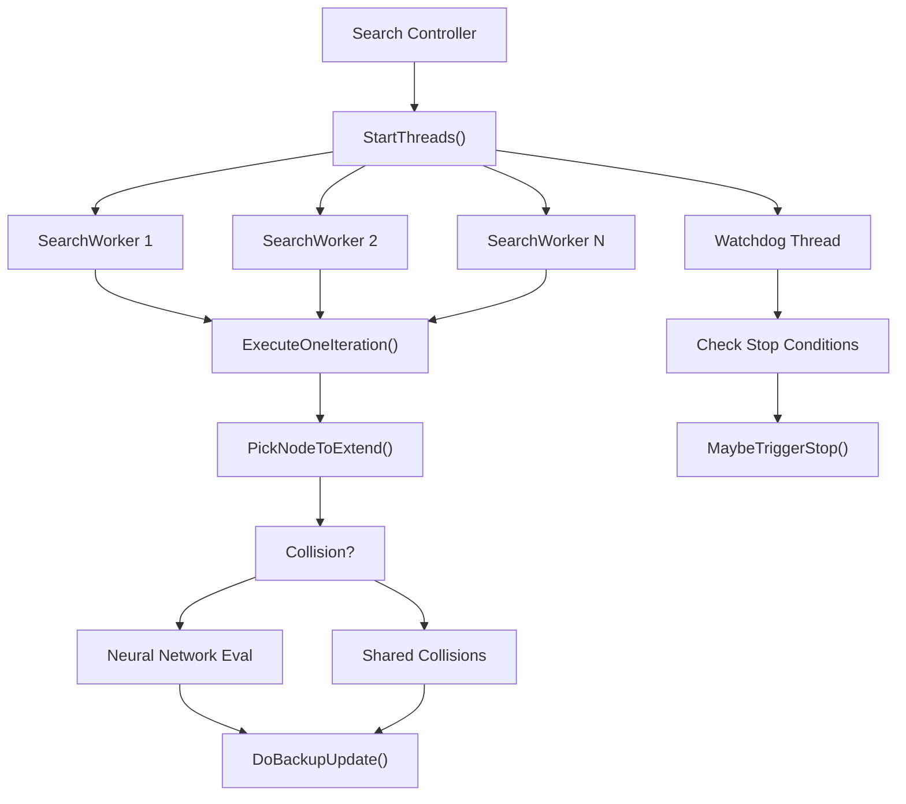
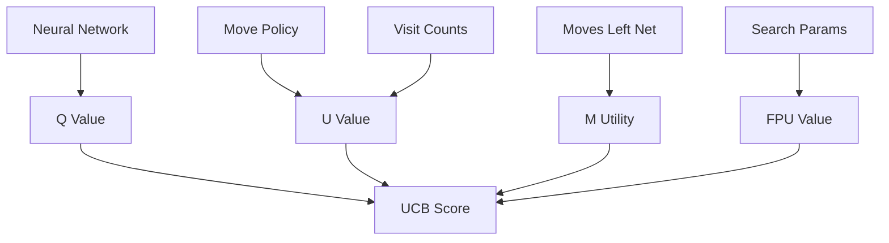
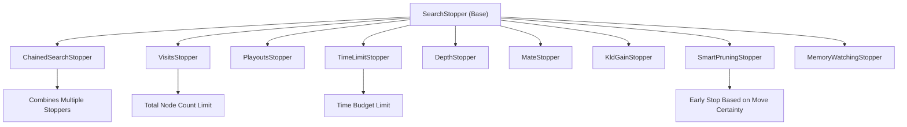

# Search Algorithm

Relevant source files

-   [src/search/classic/node.cc](https://github.com/LeelaChessZero/lc0/blob/b4e98c19/src/search/classic/node.cc)
-   [src/search/classic/node.h](https://github.com/LeelaChessZero/lc0/blob/b4e98c19/src/search/classic/node.h)
-   [src/search/classic/search.cc](https://github.com/LeelaChessZero/lc0/blob/b4e98c19/src/search/classic/search.cc)
-   [src/search/classic/search.h](https://github.com/LeelaChessZero/lc0/blob/b4e98c19/src/search/classic/search.h)
-   [src/search/classic/stoppers/stoppers.cc](https://github.com/LeelaChessZero/lc0/blob/b4e98c19/src/search/classic/stoppers/stoppers.cc)
-   [src/search/dag\_classic/node.cc](https://github.com/LeelaChessZero/lc0/blob/b4e98c19/src/search/dag_classic/node.cc)
-   [src/search/dag\_classic/node.h](https://github.com/LeelaChessZero/lc0/blob/b4e98c19/src/search/dag_classic/node.h)
-   [src/search/dag\_classic/search.cc](https://github.com/LeelaChessZero/lc0/blob/b4e98c19/src/search/dag_classic/search.cc)
-   [src/search/dag\_classic/search.h](https://github.com/LeelaChessZero/lc0/blob/b4e98c19/src/search/dag_classic/search.h)

This document covers the Monte Carlo Tree Search (MCTS) implementation that forms the core search algorithm of Leela Chess Zero. The search system evaluates chess positions by building a probabilistic search tree guided by neural network evaluations. For information about the neural network backends that provide position evaluations, see [Neural Network System](/LeelaChessZero/lc0/6-neural-network-system). For details about search parameter configuration, see [Search Parameters and Stopping Conditions](/LeelaChessZero/lc0/5.2-search-parameters-and-stopping-conditions).

## Architecture Overview

The search system implements MCTS with two distinct variants: the classic tree-based approach and a DAG (Directed Acyclic Graph) variant that supports transposition handling. Both variants share common interfaces but use different node structures and search strategies.

### Search System Components


Sources: [src/search/classic/search.h50-204](https://github.com/LeelaChessZero/lc0/blob/b4e98c19/src/search/classic/search.h#L50-L204) [src/search/dag\_classic/search.h55-211](https://github.com/LeelaChessZero/lc0/blob/b4e98c19/src/search/dag_classic/search.h#L55-L211) [src/search/classic/node.h127-339](https://github.com/LeelaChessZero/lc0/blob/b4e98c19/src/search/classic/node.h#L127-L339) [src/search/dag\_classic/node.h167-370](https://github.com/LeelaChessZero/lc0/blob/b4e98c19/src/search/dag_classic/node.h#L167-L370)

### Core MCTS Flow

The search algorithm follows the standard MCTS pattern of Selection, Expansion, Simulation (via neural network), and Backpropagation:


Sources: [src/search/classic/search.h268-307](https://github.com/LeelaChessZero/lc0/blob/b4e98c19/src/search/classic/search.h#L268-L307) [src/search/dag\_classic/search.h276-307](https://github.com/LeelaChessZero/lc0/blob/b4e98c19/src/search/dag_classic/search.h#L276-L307)

## Classic vs DAG Search Variants

### Classic Search Implementation

The classic search uses a traditional tree structure where each node has a parent pointer and children are stored as linked lists or arrays. This approach is simpler but cannot handle transpositions efficiently.

**Key Classes:**

-   `classic::Search` - Main search coordinator [src/search/classic/search.h50-204](https://github.com/LeelaChessZero/lc0/blob/b4e98c19/src/search/classic/search.h#L50-L204)
-   `classic::Node` - Tree node with parent/child relationships [src/search/classic/node.h127-339](https://github.com/LeelaChessZero/lc0/blob/b4e98c19/src/search/classic/node.h#L127-L339)
-   `classic::Edge` - Move representation with policy probability [src/search/classic/node.h85-112](https://github.com/LeelaChessZero/lc0/blob/b4e98c19/src/search/classic/node.h#L85-L112)

**Node Structure:**


Sources: [src/search/classic/node.h46-83](https://github.com/LeelaChessZero/lc0/blob/b4e98c19/src/search/classic/node.h#L46-L83) [src/search/classic/node.cc196-203](https://github.com/LeelaChessZero/lc0/blob/b4e98c19/src/search/classic/node.cc#L196-L203)

### DAG Search Implementation

The DAG variant separates the graph structure into `Node` objects (representing edges in the tree) and `LowNode` objects (representing positions). This allows multiple `Node` objects to point to the same `LowNode`, enabling transposition handling.

**Key Classes:**

-   `dag_classic::Search` - DAG-based search coordinator [src/search/dag\_classic/search.h55-211](https://github.com/LeelaChessZero/lc0/blob/b4e98c19/src/search/dag_classic/search.h#L55-L211)
-   `dag_classic::Node` - Edge wrapper with evaluation data [src/search/dag\_classic/node.h167-370](https://github.com/LeelaChessZero/lc0/blob/b4e98c19/src/search/dag_classic/node.h#L167-L370)
-   `dag_classic::LowNode` - Position node with move generation [src/search/dag\_classic/node.h375-560](https://github.com/LeelaChessZero/lc0/blob/b4e98c19/src/search/dag_classic/node.h#L375-L560)

**Node Structure:**


Sources: [src/search/dag\_classic/node.h49-89](https://github.com/LeelaChessZero/lc0/blob/b4e98c19/src/search/dag_classic/node.h#L49-L89) [src/search/dag\_classic/node.cc142-167](https://github.com/LeelaChessZero/lc0/blob/b4e98c19/src/search/dag_classic/node.cc#L142-L167)

## Search Worker Implementation

Search parallelization is handled by `SearchWorker` instances that execute MCTS iterations concurrently. Each worker follows the same iteration pattern but operates on different parts of the search tree.

### Worker Coordination


Sources: [src/search/classic/search.h205-452](https://github.com/LeelaChessZero/lc0/blob/b4e98c19/src/search/classic/search.h#L205-L452) [src/search/classic/search.cc894-922](https://github.com/LeelaChessZero/lc0/blob/b4e98c19/src/search/classic/search.cc#L894-L922)

### Collision Handling

When multiple workers select the same node for expansion, the system handles this through collision detection and shared collision processing:

**Classic Collision Handling:**

-   Uses `n_in_flight_` counters to track concurrent access [src/search/classic/node.h310-313](https://github.com/LeelaChessZero/lc0/blob/b4e98c19/src/search/classic/node.h#L310-L313)
-   Shared collisions stored in `shared_collisions_` vector [src/search/classic/search.h197-198](https://github.com/LeelaChessZero/lc0/blob/b4e98c19/src/search/classic/search.h#L197-L198)

**DAG Collision Handling:**

-   Similar approach but with `BackupPath` tracking [src/search/dag\_classic/search.h205-206](https://github.com/LeelaChessZero/lc0/blob/b4e98c19/src/search/dag_classic/search.h#L205-L206)
-   Handles transposition-related collisions [src/search/dag\_classic/search.cc1630-1650](https://github.com/LeelaChessZero/lc0/blob/b4e98c19/src/search/dag_classic/search.cc#L1630-L1650)

Sources: [src/search/classic/search.cc1200-1250](https://github.com/LeelaChessZero/lc0/blob/b4e98c19/src/search/classic/search.cc#L1200-L1250) [src/search/dag\_classic/search.cc1630-1680](https://github.com/LeelaChessZero/lc0/blob/b4e98c19/src/search/dag_classic/search.cc#L1630-L1680)

## Node Selection and Evaluation

The search uses the Upper Confidence Bound (UCB) formula to select nodes for expansion, balancing exploration and exploitation.

### UCB Calculation

The selection formula combines several components:

**UCB Formula Components:**

-   `Q` value: Expected win probability from neural network evaluation
-   `U` value: Exploration bonus based on visit counts and policy
-   `M` utility: Moves-left network bonus for shorter wins/longer losses
-   `FPU`: First Play Urgency for unvisited nodes


Sources: [src/search/classic/search.cc427-452](https://github.com/LeelaChessZero/lc0/blob/b4e98c19/src/search/classic/search.cc#L427-L452) [src/search/classic/search.cc77-147](https://github.com/LeelaChessZero/lc0/blob/b4e98c19/src/search/classic/search.cc#L77-L147)

### First Play Urgency (FPU)

For unvisited nodes, FPU provides an evaluation estimate:

```
// FPU calculation from search.cc
inline float GetFpu(const SearchParams& params, const Node* node, bool is_root_node,
                    float draw_score) {
  const auto value = params.GetFpuValue(is_root_node);
  return params.GetFpuAbsolute(is_root_node)
             ? value
             : -node->GetQ(-draw_score) -
                   value * std::sqrt(node->GetVisitedPolicy());
}
```
Sources: [src/search/classic/search.cc428-435](https://github.com/LeelaChessZero/lc0/blob/b4e98c19/src/search/classic/search.cc#L428-L435) [src/search/dag\_classic/search.cc437-444](https://github.com/LeelaChessZero/lc0/blob/b4e98c19/src/search/dag_classic/search.cc#L437-L444)

## Search Stopping Conditions

The search system uses multiple stopping criteria through the `SearchStopper` hierarchy. Stoppers can be chained to combine multiple conditions.

### Stopper Types


Sources: [src/search/classic/stoppers/stoppers.cc35-266](https://github.com/LeelaChessZero/lc0/blob/b4e98c19/src/search/classic/stoppers/stoppers.cc#L35-L266)

### Smart Pruning Logic

Smart pruning stops search early when the best move is unlikely to change:

**Smart Pruning Conditions:**

1.  Only one legal move available
2.  Terminal win found
3.  All moves but one are losing
4.  Best move has insurmountable visit lead

```
// Smart pruning check from stoppers.cc
if (remaining_playouts < (largest_n - second_largest_n)) {
  LOGFILE << std::fixed << remaining_playouts
          << " playouts remaining. Best move has " << largest_n
          << " visits, second best -- " << second_largest_n;
  return true;
}
```
Sources: [src/search/classic/stoppers/stoppers.cc189-266](https://github.com/LeelaChessZero/lc0/blob/b4e98c19/src/search/classic/stoppers/stoppers.cc#L189-L266)

## Performance Optimizations

The search system includes several optimizations for efficiency:

### Multi-Threading Optimizations

-   **Task Workers**: Additional threads per search worker for node picking [src/search/classic/search.h215-225](https://github.com/LeelaChessZero/lc0/blob/b4e98c19/src/search/classic/search.h#L215-L225)
-   **Out-of-Order Evaluation**: Processing cache hits without waiting [src/search/classic/search.h428-429](https://github.com/LeelaChessZero/lc0/blob/b4e98c19/src/search/classic/search.h#L428-L429)
-   **Batch Processing**: Grouping neural network evaluations [src/search/classic/search.h230-237](https://github.com/LeelaChessZero/lc0/blob/b4e98c19/src/search/classic/search.h#L230-L237)

### Memory Management

-   **Node Garbage Collection**: Background thread for node cleanup [src/search/classic/node.cc50-117](https://github.com/LeelaChessZero/lc0/blob/b4e98c19/src/search/classic/node.cc#L50-L117)
-   **Solid Children**: Contiguous memory layout for better cache performance [src/search/classic/node.cc245-289](https://github.com/LeelaChessZero/lc0/blob/b4e98c19/src/search/classic/node.cc#L245-L289)
-   **Memory Watching**: RAM limit enforcement [src/search/classic/stoppers/stoppers.cc94-111](https://github.com/LeelaChessZero/lc0/blob/b4e98c19/src/search/classic/stoppers/stoppers.cc#L94-L111)

### Caching Optimizations

-   **Evaluation Cache**: Reusing neural network evaluations [src/search/classic/search.cc520-538](https://github.com/LeelaChessZero/lc0/blob/b4e98c19/src/search/classic/search.cc#L520-L538)
-   **Transposition Table**: Position reuse in DAG variant [src/search/dag\_classic/search.cc174-177](https://github.com/LeelaChessZero/lc0/blob/b4e98c19/src/search/dag_classic/search.cc#L174-L177)

Sources: [src/search/classic/search.h210-250](https://github.com/LeelaChessZero/lc0/blob/b4e98c19/src/search/classic/search.h#L210-L250) [src/search/classic/node.cc245-289](https://github.com/LeelaChessZero/lc0/blob/b4e98c19/src/search/classic/node.cc#L245-L289) [src/search/classic/stoppers/stoppers.cc94-111](https://github.com/LeelaChessZero/lc0/blob/b4e98c19/src/search/classic/stoppers/stoppers.cc#L94-L111)
