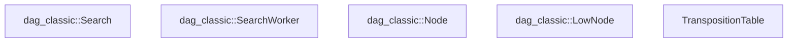
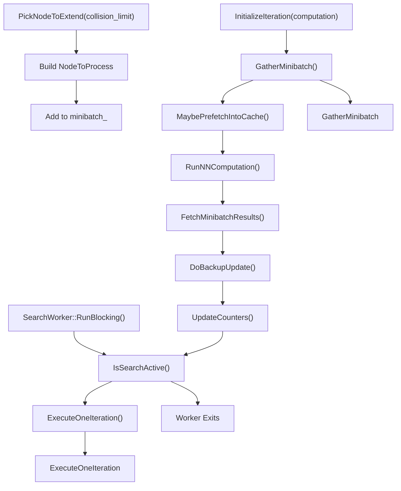
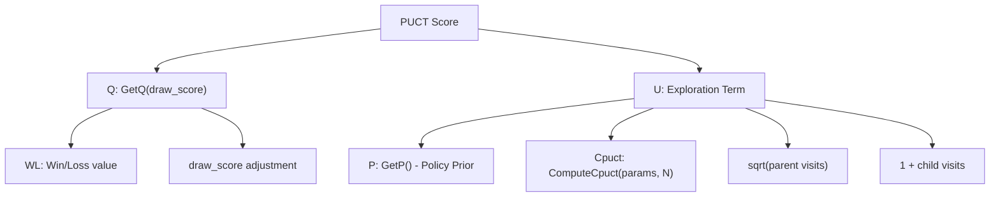
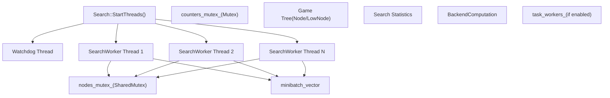
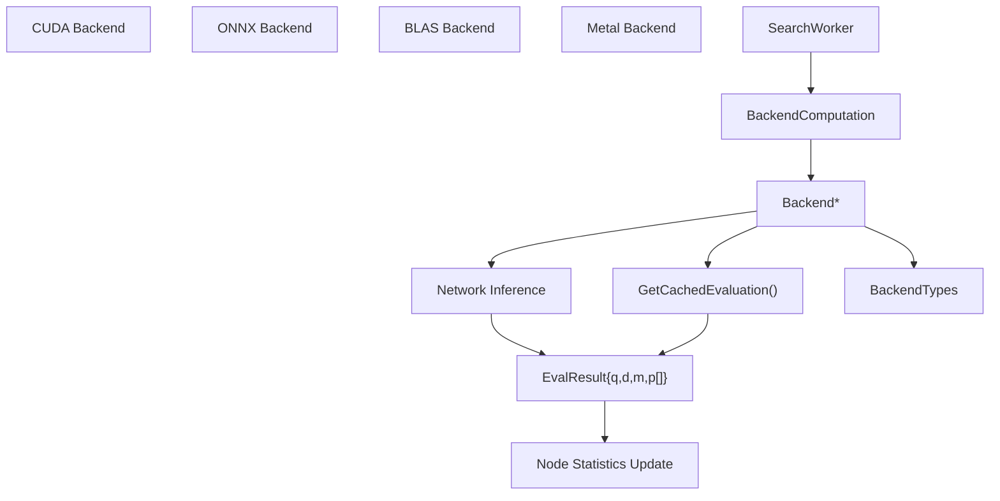

# MCTS Implementation

Relevant source files

-   [src/search/classic/node.cc](https://github.com/LeelaChessZero/lc0/blob/b4e98c19/src/search/classic/node.cc)
-   [src/search/classic/node.h](https://github.com/LeelaChessZero/lc0/blob/b4e98c19/src/search/classic/node.h)
-   [src/search/classic/search.cc](https://github.com/LeelaChessZero/lc0/blob/b4e98c19/src/search/classic/search.cc)
-   [src/search/classic/search.h](https://github.com/LeelaChessZero/lc0/blob/b4e98c19/src/search/classic/search.h)
-   [src/search/classic/stoppers/stoppers.cc](https://github.com/LeelaChessZero/lc0/blob/b4e98c19/src/search/classic/stoppers/stoppers.cc)
-   [src/search/dag\_classic/node.cc](https://github.com/LeelaChessZero/lc0/blob/b4e98c19/src/search/dag_classic/node.cc)
-   [src/search/dag\_classic/node.h](https://github.com/LeelaChessZero/lc0/blob/b4e98c19/src/search/dag_classic/node.h)
-   [src/search/dag\_classic/search.cc](https://github.com/LeelaChessZero/lc0/blob/b4e98c19/src/search/dag_classic/search.cc)
-   [src/search/dag\_classic/search.h](https://github.com/LeelaChessZero/lc0/blob/b4e98c19/src/search/dag_classic/search.h)

This document describes the Monte Carlo Tree Search (MCTS) implementation in Leela Chess Zero (Lc0), focusing on the core algorithm, the distinction between classic and DAG variants, and the worker thread architecture. For search parameters, see [Search Parameters and Stopping Conditions](/LeelaChessZero/lc0/5.2-search-parameters-and-stopping-conditions), and for caching details, see [Search Tree Caching](/LeelaChessZero/lc0/5.3-search-tree-caching).

## 1\. MCTS Overview

Lc0 implements Monte Carlo Tree Search using neural networks for position evaluation and move selection. The engine provides two main variants: **classic** search with traditional tree structures and **DAG** search supporting transpositions through shared nodes.

Key characteristics:

-   Neural network-guided tree expansion using policy and value outputs
-   PUCT formula for balancing exploration and exploitation
-   Parallel search with multiple `SearchWorker` threads
-   Efficient position batching for neural network evaluation
-   Support for both tree-based (classic) and DAG-based search

Sources: [src/search/classic/search.h50-203](https://github.com/LeelaChessZero/lc0/blob/b4e98c19/src/search/classic/search.h#L50-L203) [src/search/dag\_classic/search.h55-210](https://github.com/LeelaChessZero/lc0/blob/b4e98c19/src/search/dag_classic/search.h#L55-L210)

## 2\. Search Variants: Classic vs DAG

Lc0 provides two distinct MCTS implementations with different memory and performance characteristics.

### 2.1 Classic Search Architecture

**Classic Search Architecture**


### 2.2 DAG Search Architecture

**DAG Search Architecture with Transposition Support**


### 2.3 Key Architectural Differences

| Aspect | Classic | DAG |
| --- | --- | --- |
| **Node Structure** | Single `Node` class with parent pointers | `Node` + `LowNode` separation |
| **Transpositions** | Not supported | Shared `LowNode` instances |
| **Memory Usage** | Lower per-node overhead | Higher due to shared nodes |
| **Complexity** | Simpler tree traversal | Complex graph management |
| **Search Depth** | Limited by tree structure | Can leverage transpositions |

Sources: [src/search/classic/search.h50-203](https://github.com/LeelaChessZero/lc0/blob/b4e98c19/src/search/classic/search.h#L50-L203) [src/search/dag\_classic/search.h55-210](https://github.com/LeelaChessZero/lc0/blob/b4e98c19/src/search/dag_classic/search.h#L55-L210) [src/search/classic/node.h127-339](https://github.com/LeelaChessZero/lc0/blob/b4e98c19/src/search/classic/node.h#L127-L339) [src/search/dag\_classic/node.h167-370](https://github.com/LeelaChessZero/lc0/blob/b4e98c19/src/search/dag_classic/node.h#L167-L370)

## 3\. SearchWorker Algorithm Flow

Both classic and DAG variants use similar `SearchWorker` iteration patterns with minor differences in node handling.

**SearchWorker Execution Flow**


### 3.1 Core Worker Loop

The `SearchWorker::RunBlocking()` method implements the main worker thread loop:

```
// Classic and DAG workers use identical loop structure
do {
    ExecuteOneIteration();
} while (search_->IsSearchActive());
```
### 3.2 Node Selection with PUCT

Both variants use the PUCT formula for node selection during `PickNodeToExtend()`:

**PUCT Calculation Components**


Sources: [src/search/classic/search.cc446-452](https://github.com/LeelaChessZero/lc0/blob/b4e98c19/src/search/classic/search.cc#L446-L452) [src/search/dag\_classic/search.cc455-461](https://github.com/LeelaChessZero/lc0/blob/b4e98c19/src/search/dag_classic/search.cc#L455-L461) [src/search/classic/search.h208-276](https://github.com/LeelaChessZero/lc0/blob/b4e98c19/src/search/classic/search.h#L208-L276) [src/search/dag\_classic/search.h216-284](https://github.com/LeelaChessZero/lc0/blob/b4e98c19/src/search/dag_classic/search.h#L216-L284)

### 3.3 Selection and PUCT Implementation

Node selection uses the PUCT formula with optimized calculations in both variants:

```
// From GetFpu() and ComputeCpuct() functions
float cpuct = ComputeCpuct(params_, node->GetN(), is_root);
float U_coeff = cpuct * std::sqrt(std::max(node->GetChildrenVisits(), 1u));
float score = edge.GetQ(fpu, draw_score) + edge.GetU(U_coeff);
```
**PUCT Formula Implementation:**

-   `Q = edge.GetQ(fpu, draw_score)` - Quality value with FPU fallback
-   `U = P * U_coeff / (1 + N)` - Exploration term
-   `U_coeff = cpuct * sqrt(parent_visits)` - Precomputed coefficient
-   `cpuct = init + k * log((N + base) / base)` - Dynamic exploration constant

The `ComputeCpuct()` function allows dynamic adjustment of exploration based on visit count, while `GetFpu()` handles First Play Urgency for unvisited nodes.

Sources: [src/search/classic/search.cc427-453](https://github.com/LeelaChessZero/lc0/blob/b4e98c19/src/search/classic/search.cc#L427-L453) [src/search/dag\_classic/search.cc436-462](https://github.com/LeelaChessZero/lc0/blob/b4e98c19/src/search/dag_classic/search.cc#L436-L462)

### 3.4 Node Expansion Differences

**Classic Expansion:**

```
// Classic: Direct node creation and edge assignment
void Node::CreateEdges(const MoveList& moves) {
    edges_ = Edge::FromMovelist(moves);
    num_edges_ = moves.size();
}
```
**DAG Expansion:**

```
// DAG: LowNode creation with transposition support
auto low_node = std::make_shared<LowNode>(moves);
node->SetLowNode(low_node);
// Check transposition table for existing evaluations
```
The DAG variant checks the transposition table during expansion to potentially reuse previously computed evaluations for the same position.

Sources: [src/search/classic/node.cc205-210](https://github.com/LeelaChessZero/lc0/blob/b4e98c19/src/search/classic/node.cc#L205-L210) [src/search/dag\_classic/node.cc396-427](https://github.com/LeelaChessZero/lc0/blob/b4e98c19/src/search/dag_classic/node.cc#L396-L427)

### 3.5 Neural Network Evaluation and Batching

Both search variants use identical neural network evaluation through the `Backend` interface:

**Minibatch Processing Flow**

> **[Mermaid sequence]**
> *(图表结构无法解析)*

**Key Implementation Details:**

-   `minibatch_` contains `NodeToProcess` objects with position data
-   `target_minibatch_size_` controls batch efficiency (typically matches `Backend` recommendations)
-   `FetchSingleNodeResult()` extracts neural network outputs for each position
-   Results include value (`q`), draw probability (`d`), moves left (`m`), and policy array

Sources: [src/search/classic/search.h425-430](https://github.com/LeelaChessZero/lc0/blob/b4e98c19/src/search/classic/search.h#L425-L430) [src/search/dag\_classic/search.h479-484](https://github.com/LeelaChessZero/lc0/blob/b4e98c19/src/search/dag_classic/search.h#L479-L484) [src/search/classic/search.cc269-276](https://github.com/LeelaChessZero/lc0/blob/b4e98c19/src/search/classic/search.cc#L269-L276) [src/search/dag\_classic/search.cc276-284](https://github.com/LeelaChessZero/lc0/blob/b4e98c19/src/search/dag_classic/search.cc#L276-L284)

### 3.6 Backpropagation Implementation

**Classic Backpropagation:**

```
// Classic: Simple parent chain traversal
void Node::FinalizeScoreUpdate(float v, float d, float m, int multivisit) {
    wl_ += multivisit * (v - wl_) / (n_ + multivisit);
    d_ += multivisit * (d - d_) / (n_ + multivisit);
    m_ += multivisit * (m - m_) / (n_ + multivisit);
    n_ += multivisit;
    n_in_flight_ -= multivisit;
}
```
**DAG Backpropagation:**

```
// DAG: Update both Node and LowNode, handle transpositions
void DoBackupUpdateSingleNode(const NodeToProcess& node_to_process) {
    // Update node statistics
    node->FinalizeScoreUpdate(v, d, m, multivisit);
    // Update shared LowNode if present
    if (low_node) low_node->FinalizeScoreUpdate(v, d, m, multivisit);
}
```
The DAG variant must handle updates to shared `LowNode` instances that may be referenced by multiple transposition paths.

Sources: [src/search/classic/node.cc356-366](https://github.com/LeelaChessZero/lc0/blob/b4e98c19/src/search/classic/node.cc#L356-L366) [src/search/dag\_classic/node.cc358-371](https://github.com/LeelaChessZero/lc0/blob/b4e98c19/src/search/dag_classic/node.cc#L358-L371)

## 4\. Multi-Threading and Parallelization

Both search variants implement identical threading strategies with different node synchronization approaches.

**Threading Architecture**


### 4.1 Thread Management

**Search Thread Coordination:**

-   `Search::StartThreads(size_t how_many)` creates worker threads
-   Default thread count: `backend_attributes_.suggested_num_search_threads + !backend_attributes_.runs_on_cpu`
-   Each worker runs `SearchWorker::RunBlocking()` until `search_->IsSearchActive()` returns false
-   Watchdog thread monitors time limits and UCI stop commands

### 4.2 Synchronization Strategy

**Mutex Usage:**

-   `nodes_mutex_` (SharedMutex): Protects game tree structure, allows concurrent reads
-   `counters_mutex_` (Mutex): Protects search statistics and counters
-   Node-level synchronization via `TryStartScoreUpdate()` and `n_in_flight_` counters

**Virtual Loss System:**

-   `n_in_flight_` tracks nodes being processed by workers
-   Prevents multiple workers from expanding the same path simultaneously
-   Automatically cleaned up via `CancelScoreUpdate()` or `FinalizeScoreUpdate()`

### 4.3 Task-Level Parallelization

Advanced workers can spawn additional task threads for position picking:

```
// From SearchWorker constructor
task_workers_ = params.GetTaskWorkersPerSearchWorker();
for (int i = 0; i < task_workers_; i++) {
    task_threads_.emplace_back(<FileRef file-url="https://github.com/LeelaChessZero/lc0/blob/b4e98c19/this, i" undefined  file-path="this, i">Hii</FileRef> { this->RunTasks(i); });
}
```
Sources: [src/search/classic/search.cc894-916](https://github.com/LeelaChessZero/lc0/blob/b4e98c19/src/search/classic/search.cc#L894-L916) [src/search/dag\_classic/search.cc900-922](https://github.com/LeelaChessZero/lc0/blob/b4e98c19/src/search/dag_classic/search.cc#L900-L922) [src/search/classic/search.h208-225](https://github.com/LeelaChessZero/lc0/blob/b4e98c19/src/search/classic/search.h#L208-L225) [src/search/dag\_classic/search.h216-233](https://github.com/LeelaChessZero/lc0/blob/b4e98c19/src/search/dag_classic/search.h#L216-L233)

## 5\. Advanced Features and Optimizations

### 5.1 M-Evaluation for Moves Left Head

When neural networks support moves-left-head (MLH), both variants implement M-evaluation:

```
class MEvaluator {
public:
    MEvaluator(const SearchParams& params, const Node* parent = nullptr);
    float GetMUtility(Node* child, float q) const;
    float GetMUtility(const EdgeAndNode& child, float q) const;
};
```
**M-Utility Calculation:**

-   Favors shorter wins and longer losses based on moves-left predictions
-   Controlled by parameters: `moves_left_slope`, `moves_left_max_effect`, `moves_left_threshold`
-   Only active when `backend_attributes_.has_mlh` is true

### 5.2 Collision Handling

Workers handle node collisions during parallel search:

**Classic Collision Strategy:**

```
NodeToProcess::Collision(Node* node, uint16_t depth, int collision_count)
```
**DAG Collision Strategy:**

```
NodeToProcess::Collision(const BackupPath& path, int collision_count, int max_count)
```
Collisions occur when multiple workers select the same expansion path simultaneously.

### 5.3 Smart Pruning and Early Termination

The search implements several early termination conditions:

-   **Single Legal Move**: Immediate termination when only one move is legal
-   **Mate Found**: Stop when terminal win is discovered
-   **All But One Losing**: Stop when only one non-losing move remains
-   **KLD Gain Threshold**: Stop when move probability distribution converges

Sources: [src/search/classic/search.cc77-147](https://github.com/LeelaChessZero/lc0/blob/b4e98c19/src/search/classic/search.cc#L77-L147) [src/search/dag\_classic/search.cc77-147](https://github.com/LeelaChessZero/lc0/blob/b4e98c19/src/search/dag_classic/search.cc#L77-L147) [src/search/classic/stoppers/stoppers.cc194-266](https://github.com/LeelaChessZero/lc0/blob/b4e98c19/src/search/classic/stoppers/stoppers.cc#L194-L266)

## 6\. Search Termination and Stopping Conditions

Both variants use identical stopping logic through the `SearchStopper` interface:

**Stopper Implementation Types:**

-   `TimeLimitStopper`: Time-based termination
-   `VisitsStopper`: Node visit limits
-   `PlayoutsStopper`: Playout count limits
-   `SmartPruningStopper`: Early termination based on move strength
-   `KldGainStopper`: KL divergence convergence detection
-   `MateStopper`: Mate depth detection

**Stopping Decision Flow:**

```
// Called periodically during search
if (stopper_->ShouldStop(stats, hints)) {
    FireStopInternal();
}
```
The search maintains `IterationStats` with current search state and calls `MaybeTriggerStop()` to evaluate termination conditions.

Sources: [src/search/classic/stoppers/stoppers.cc39-266](https://github.com/LeelaChessZero/lc0/blob/b4e98c19/src/search/classic/stoppers/stoppers.cc#L39-L266) [src/search/classic/search.cc615-644](https://github.com/LeelaChessZero/lc0/blob/b4e98c19/src/search/classic/search.cc#L615-L644) [src/search/dag\_classic/search.cc618-647](https://github.com/LeelaChessZero/lc0/blob/b4e98c19/src/search/dag_classic/search.cc#L618-L647)

## 7\. Neural Network Integration

Both search variants integrate identically with the neural network backend system:

**Backend Integration Flow**


**Neural Network Outputs:**

-   `q`: Position value (win probability)
-   `d`: Draw probability
-   `m`: Moves left estimate (if supported)
-   `p[]`: Policy probabilities for each legal move

**Integration Points:**

-   `backend_->GetCachedEvaluation()` checks for cached results
-   `computation_->ComputeBlocking()` triggers batch inference
-   `FetchSingleNodeResult()` extracts results for tree updates

Sources: [src/search/classic/search.cc151-171](https://github.com/LeelaChessZero/lc0/blob/b4e98c19/src/search/classic/search.cc#L151-L171) [src/search/dag\_classic/search.cc151-173](https://github.com/LeelaChessZero/lc0/blob/b4e98c19/src/search/dag_classic/search.cc#L151-L173)

## 8\. Performance Optimizations

### 8.1 Memory Management

**Classic Memory Strategy:**

-   Garbage collection via `NodeGarbageCollector` for deleted subtrees
-   `MakeSolid()` converts linked lists to contiguous arrays for cache efficiency
-   Node size optimized to fit cache lines: `sizeof(Node) <= 64`

**DAG Memory Strategy:**

-   Shared `LowNode` instances reduce memory for transpositions
-   Reference counting via `AddParent()`/`RemoveParent()`
-   Automatic cleanup when `num_parents_` reaches zero

### 8.2 Computation Optimizations

**Fast Math Functions:**

-   `ComputeCpuct()` uses `FastLog()` for dynamic CPUCT calculation
-   WDL rescaling with `FastLogistic()` for contempt mode
-   Policy probability compression in `Edge::SetP()`/`GetP()`

**Batching Efficiency:**

-   `target_minibatch_size_` matches backend recommendations
-   Out-of-order evaluation for cache hits and terminals
-   `max_out_of_order_` limits to maintain search quality

### 8.3 Search Efficiency

**Node Selection Optimizations:**

-   FPU (First Play Urgency) reduces exploration of unvisited nodes
-   Dynamic CPUCT scaling based on visit count
-   Early termination via multiple stopper types

Sources: [src/search/classic/node.cc245-288](https://github.com/LeelaChessZero/lc0/blob/b4e98c19/src/search/classic/node.cc#L245-L288) [src/utils/fastmath.h38-93](https://github.com/LeelaChessZero/lc0/blob/b4e98c19/src/utils/fastmath.h#L38-L93) [src/search/classic/search.cc436-453](https://github.com/LeelaChessZero/lc0/blob/b4e98c19/src/search/classic/search.cc#L436-L453)

## 9\. MCTS Extensions and Innovations

Lc0 implements several extensions to the basic MCTS algorithm:

1.  **FPU Reduction**: First-play urgency reduction to better handle unexplored nodes
2.  **Policy Softmax Temperature**: Controlling the exploration vs. exploitation tradeoff
3.  **Move Probability Rescaling**: Adjusting move probabilities based on visit counts
4.  **Forced Playouts**: Ensuring minimum exploration of all legal moves
5.  **Multi-PV Analysis**: Searching for multiple principal variations simultaneously

Sources:

## Summary

The MCTS implementation in Lc0 is a sophisticated search algorithm that combines the strengths of traditional MCTS with neural network evaluation. By using batched evaluation, parallel search, and various optimizations, it achieves high performance and strong play. The search is guided by the PUCT formula, which balances exploration and exploitation based on neural network outputs and accumulated statistics.
