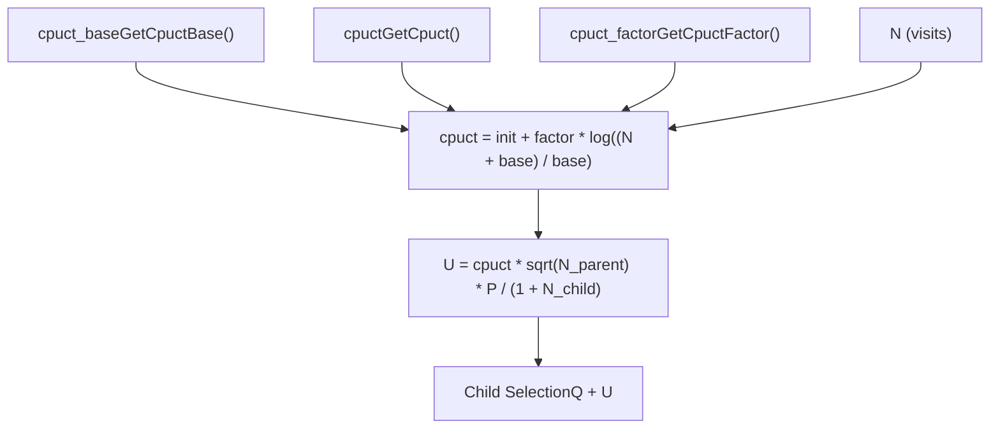
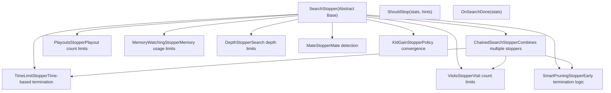

# Search Parameters and Stopping Conditions

Relevant source files

-   [src/search/classic/node.cc](https://github.com/LeelaChessZero/lc0/blob/b4e98c19/src/search/classic/node.cc)
-   [src/search/classic/node.h](https://github.com/LeelaChessZero/lc0/blob/b4e98c19/src/search/classic/node.h)
-   [src/search/classic/search.cc](https://github.com/LeelaChessZero/lc0/blob/b4e98c19/src/search/classic/search.cc)
-   [src/search/classic/search.h](https://github.com/LeelaChessZero/lc0/blob/b4e98c19/src/search/classic/search.h)
-   [src/search/classic/stoppers/stoppers.cc](https://github.com/LeelaChessZero/lc0/blob/b4e98c19/src/search/classic/stoppers/stoppers.cc)
-   [src/search/dag\_classic/node.cc](https://github.com/LeelaChessZero/lc0/blob/b4e98c19/src/search/dag_classic/node.cc)
-   [src/search/dag\_classic/node.h](https://github.com/LeelaChessZero/lc0/blob/b4e98c19/src/search/dag_classic/node.h)
-   [src/search/dag\_classic/search.cc](https://github.com/LeelaChessZero/lc0/blob/b4e98c19/src/search/dag_classic/search.cc)
-   [src/search/dag\_classic/search.h](https://github.com/LeelaChessZero/lc0/blob/b4e98c19/src/search/dag_classic/search.h)

This document covers the configurable parameters that control Leela Chess Zero's Monte Carlo Tree Search (MCTS) behavior and the various conditions that determine when search should terminate. This includes exploration vs exploitation balance, move selection temperature, time management, and resource constraints.

For information about the core MCTS algorithm implementation, see [MCTS Implementation](/LeelaChessZero/lc0/5.1-mcts-implementation). For details about search tree caching and memory management, see [Search Tree Caching](/LeelaChessZero/lc0/5.3-search-tree-caching).

## Overview

The search system provides two main categories of control mechanisms:

1.  **Search Parameters** - Configuration values that influence how the MCTS algorithm explores and evaluates positions
2.  **Stopping Conditions** - Criteria that determine when search should terminate and return the best move

Both classic and DAG search variants share the same parameter and stopping condition infrastructure, implemented through the `SearchParams` class and `SearchStopper` interface hierarchy.

## Search Parameter Categories

The search parameters can be grouped into several functional categories that control different aspects of the MCTS algorithm:

```mermaid
flowchart TD
    Temperature["Temperature SettingsGetTemperature()GetTemperatureEndgame()GetTemperatureCutoffMove()"]
    CPUCT["CPUCT ParametersGetCpuct()GetCpuctFactor()GetCpuctBase()"]
    FPU["First Play UrgencyGetFpuValue()GetFpuAbsolute()"]
    Noise["Dirichlet NoiseGetDirichletNoise()GetDirichletAlpha()"]
    Contempt["Contempt SettingsGetContemptMode()GetWDLRescaleDiff()"]
    MultiPV["Multi-PV AnalysisGetMultiPv()GetPerPvCounters()"]
    TimeControl["Time ManagementGetMiniBatchSize()GetMaxConcurrentSearchers()"]
    Exploration["Move ExplorationBalance"]
    Selection["Best MoveSelection"]
    Evaluation["PositionEvaluation"]
    Performance["SearchPerformance"]

    Temperature --> Selection
    CPUCT --> Exploration
    FPU --> Exploration
    Noise --> Exploration
    Contempt --> Evaluation
    MultiPV --> Selection
    TimeControl --> Performance
```


**Sources:** [src/search/classic/search.cc89-198](https://github.com/LeelaChessZero/lc0/blob/b4e98c19/src/search/classic/search.cc#L89-L198) [src/search/dag\_classic/search.cc89-204](https://github.com/LeelaChessZero/lc0/blob/b4e98c19/src/search/dag_classic/search.cc#L89-L204)

### Temperature and Move Selection

Temperature controls the randomness in final move selection, balancing between playing the objectively best move and exploring alternatives:

| Parameter | Function | Purpose |
| --- | --- | --- |
| `temperature` | `GetTemperature()` | Base temperature for move selection randomness |
| `temperature_endgame` | `GetTemperatureEndgame()` | Reduced temperature in endgames |
| `temperature_cutoff_move` | `GetTemperatureCutoffMove()` | Move number when temperature switches to endgame value |
| `temp_decay_moves` | `GetTempDecayMoves()` | Number of moves over which temperature decays |

The temperature implementation in `EnsureBestMoveKnown()` applies different selection strategies:

-   **Temperature = 0**: Always select move with highest visit count
-   **Temperature > 0**: Weighted random selection based on visit counts
-   **Endgame transition**: Automatic temperature reduction after specified move count

**Sources:** [src/search/classic/search.cc691-722](https://github.com/LeelaChessZero/lc0/blob/b4e98c19/src/search/classic/search.cc#L691-L722) [src/search/dag\_classic/search.cc691-722](https://github.com/LeelaChessZero/lc0/blob/b4e98c19/src/search/dag_classic/search.cc#L691-L722)

### CPUCT and Exploration Control

The CPUCT (Polynomial Upper Confidence Trees) parameters control the exploration vs exploitation balance in node selection:


The `ComputeCpuct()` function implements adaptive exploration that increases with the number of visits, encouraging deeper exploration in well-visited positions.

**Sources:** [src/search/classic/search.cc446-452](https://github.com/LeelaChessZero/lc0/blob/b4e98c19/src/search/classic/search.cc#L446-L452) [src/search/dag\_classic/search.cc455-461](https://github.com/LeelaChessZero/lc0/blob/b4e98c19/src/search/dag_classic/search.cc#L455-L461)

## Stopping Conditions Architecture

The stopping condition system uses a flexible interface hierarchy that allows combining multiple termination criteria:


**Sources:** [src/search/classic/stoppers/stoppers.cc28-267](https://github.com/LeelaChessZero/lc0/blob/b4e98c19/src/search/classic/stoppers/stoppers.cc#L28-L267)

### Resource-Based Stopping Conditions

These stoppers enforce hard limits on computational resources:

#### Time Limits

The `TimeLimitStopper` enforces wall-clock time constraints:

```
bool TimeLimitStopper::ShouldStop(const IterationStats& stats, StoppersHints* hints) {
  hints->UpdateEstimatedRemainingTimeMs(time_limit_ms_ - stats.time_since_movestart);
  if (stats.time_since_movestart >= time_limit_ms_) {
    LOGFILE << "Stopping search: Ran out of time.";
    return true;
  }
  return false;
}
```
#### Node and Visit Limits

-   `VisitsStopper`: Limits total nodes in the tree (`stats.total_nodes`)
-   `PlayoutsStopper`: Limits new nodes since move start (`stats.nodes_since_movestart`)
-   `MemoryWatchingStopper`: Calculates visit limits based on available RAM

**Sources:** [src/search/classic/stoppers/stoppers.cc117-111](https://github.com/LeelaChessZero/lc0/blob/b4e98c19/src/search/classic/stoppers/stoppers.cc#L117-L111)

### Game-State Stopping Conditions

These stoppers detect specific game states that warrant immediate termination:

#### Mate Detection

The `MateStopper` triggers when a forced mate sequence is found within the specified depth:

```
bool MateStopper::ShouldStop(const IterationStats& stats, StoppersHints*) {
  if (stats.mate_depth <= mate_) {
    LOGFILE << "Stopped search: Found mate.";
    return true;
  }
  return false;
}
```
#### Smart Pruning

The `SmartPruningStopper` implements sophisticated early termination logic:

-   **Single legal move**: Immediate termination
-   **All moves losing**: Stop when only one non-losing move remains
-   **Terminal win found**: Stop when forced win is discovered
-   **Visit count analysis**: Stop when the best move's lead is insurmountable

**Sources:** [src/search/classic/stoppers/stoppers.cc194-266](https://github.com/LeelaChessZero/lc0/blob/b4e98c19/src/search/classic/stoppers/stoppers.cc#L194-L266)

## Search Control Integration

The search process integrates parameters and stopping conditions through a centralized control flow:

> **[Mermaid sequence]**
> *(图表结构无法解析)*

The `MaybeTriggerStop()` method coordinates this process, collecting statistics and consulting all registered stoppers:

**Sources:** [src/search/classic/search.cc615-644](https://github.com/LeelaChessZero/lc0/blob/b4e98c19/src/search/classic/search.cc#L615-L644) [src/search/dag\_classic/search.cc618-647](https://github.com/LeelaChessZero/lc0/blob/b4e98c19/src/search/dag_classic/search.cc#L618-L647)

### Iteration Statistics

The `IterationStats` structure provides comprehensive search state information to stopping conditions:

| Field | Purpose |
| --- | --- |
| `total_nodes` | Total nodes in search tree |
| `nodes_since_movestart` | New nodes since current move |
| `time_since_movestart` | Elapsed time for current move |
| `time_since_first_batch` | Time since first neural network batch |
| `average_depth` | Average search depth achieved |
| `edge_n` | Visit counts for root children |
| `win_found` | Whether a terminal win was discovered |
| `mate_depth` | Depth of shortest mate found |

### Stopper Hints

The `StoppersHints` system allows stoppers to share information and coordinate decisions:

-   **Estimated NPS**: Nodes per second for time projection
-   **Remaining time**: Time budget left for current move
-   **Remaining playouts**: Estimated playouts possible within time limit

This enables sophisticated stopping logic like smart pruning, which estimates whether sufficient time remains to change the move decision.

**Sources:** [src/search/classic/search.cc928-1008](https://github.com/LeelaChessZero/lc0/blob/b4e98c19/src/search/classic/search.cc#L928-L1008) [src/search/dag\_classic/search.cc928-1008](https://github.com/LeelaChessZero/lc0/blob/b4e98c19/src/search/dag_classic/search.cc#L928-L1008)
