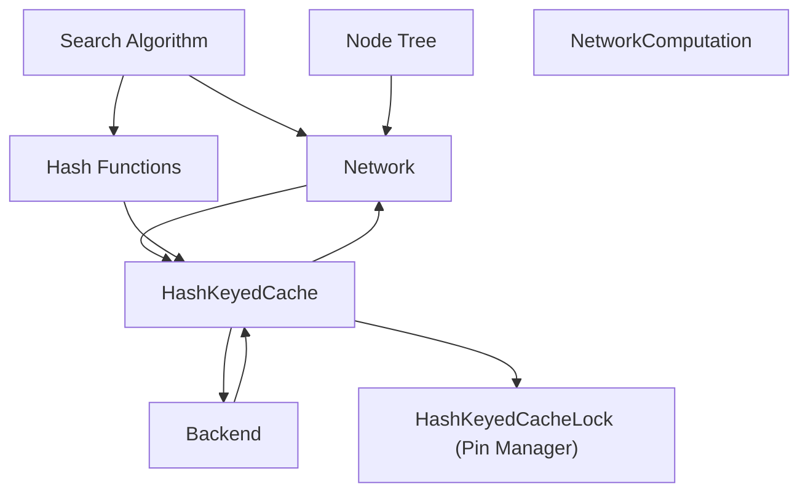
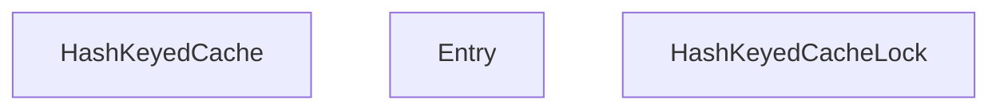

# Caching System

Relevant source files

-   [build.sh](https://github.com/LeelaChessZero/lc0/blob/b4e98c19/build.sh)
-   [src/utils/cache-old.h](https://github.com/LeelaChessZero/lc0/blob/b4e98c19/src/utils/cache-old.h)
-   [src/utils/cache.h](https://github.com/LeelaChessZero/lc0/blob/b4e98c19/src/utils/cache.h)
-   [src/utils/hashcat.h](https://github.com/LeelaChessZero/lc0/blob/b4e98c19/src/utils/hashcat.h)
-   [src/utils/hashcat\_test.cc](https://github.com/LeelaChessZero/lc0/blob/b4e98c19/src/utils/hashcat_test.cc)

## Purpose and Scope

The caching system in Leela Chess Zero (lc0) improves performance by storing and reusing costly computation results. This document covers the implementation and usage of the `HashKeyedCache` template class, which serves as the primary caching mechanism in lc0. The cache is particularly important for the neural network system, where it significantly reduces redundant position evaluations.

For information about the neural network system itself, see [Neural Network System](/LeelaChessZero/lc0/6-neural-network-system).

Sources: [src/utils/cache.h39-329](https://github.com/LeelaChessZero/lc0/blob/b4e98c19/src/utils/cache.h#L39-L329)

## Caching System Overview

The caching system in lc0 is designed to be:

-   **Thread-safe**: Multiple threads can safely access the cache concurrently
-   **Hash-based**: Uses 64-bit hash keys for efficient lookups
-   **Memory-managed**: Implements pinning mechanisms to safely handle cached values
-   **FIFO eviction**: Uses a first-in-first-out policy for cache eviction


**Diagram: Caching System Integration**

Sources: [src/utils/cache.h39-329](https://github.com/LeelaChessZero/lc0/blob/b4e98c19/src/utils/cache.h#L39-L329) [src/utils/hashcat.h32-53](https://github.com/LeelaChessZero/lc0/blob/b4e98c19/src/utils/hashcat.h#L32-L53)

## Core Cache Components

The caching system consists of two main components:

1.  `HashKeyedCache<V>`: The main cache template class that stores values of type `V` indexed by 64-bit hash keys
2.  `HashKeyedCacheLock<V>`: A convenience class that manages pinning and unpinning of cached items

### HashKeyedCache

The `HashKeyedCache` is implemented as a hash table with open addressing and uses a deque to track insertion order for FIFO eviction.


**Diagram: Cache Class Structure**

Sources: [src/utils/cache.h49-285](https://github.com/LeelaChessZero/lc0/blob/b4e98c19/src/utils/cache.h#L49-L285) [src/utils/cache.h288-327](https://github.com/LeelaChessZero/lc0/blob/b4e98c19/src/utils/cache.h#L288-L327)

## Cache Operations

### Insertion and Lookup

The cache provides two main operations:

1.  **Insertion**: Add a new value to the cache with a specific key
2.  **Lookup**: Find a value in the cache based on its key

When the cache reaches capacity, the oldest items are evicted first (FIFO policy).

> **[Mermaid sequence]**
> *(图表结构无法解析)*

**Diagram: Cache Operation Flow**

Sources: [src/utils/cache.h64-129](https://github.com/LeelaChessZero/lc0/blob/b4e98c19/src/utils/cache.h#L64-L129) [src/utils/cache.h288-321](https://github.com/LeelaChessZero/lc0/blob/b4e98c19/src/utils/cache.h#L288-L321)

## Pinning Mechanism

The cache uses a pinning mechanism to safely manage memory. When a value is accessed, it is "pinned" in the cache to prevent deletion even if it would normally be evicted. When the client is done with the value, it is "unpinned".

### Why Pinning is Necessary

The cache takes ownership of all inserted values (using `std::unique_ptr`). When a value needs to be accessed, it must be pinned to prevent it from being deleted while in use. After use, it must be unpinned to allow the cache to eventually delete it if needed.

### HashKeyedCacheLock

The `HashKeyedCacheLock` class automates this pin/unpin process using RAII (Resource Acquisition Is Initialization), similar to how `std::lock_guard` works for mutexes.

```
// Example usage of HashKeyedCacheLock
HashKeyedCacheLock<MyValue> lock(&cache, key);
if (lock) {  // Check if the key was found
    // Use the value through the lock
    lock->DoSomething();
    // No need to manually unpin - will be done automatically when lock goes out of scope
}
```
Sources: [src/utils/cache.h110-161](https://github.com/LeelaChessZero/lc0/blob/b4e98c19/src/utils/cache.h#L110-L161) [src/utils/cache.h288-327](https://github.com/LeelaChessZero/lc0/blob/b4e98c19/src/utils/cache.h#L288-L327)

## Cache Implementation Details

### Hash Table Structure

The cache uses open addressing with linear probing for collision resolution. The hash table size is determined based on the capacity and a load factor of 1.9.

```
hash_table_size = capacity * 1.9 + 1
```
When items are removed from the hash table, the implementation handles the "holes" by potentially moving subsequent items to maintain efficient lookups.

### Eviction Policy

The cache uses a strict FIFO (First-In-First-Out) eviction policy:

1.  The insertion order is tracked in a `std::deque`
2.  When eviction is needed, items are removed from the front of the deque
3.  Pinned items that would be evicted are moved to an "evicted" list instead of being deleted immediately
4.  When items in the evicted list are unpinned, they are deleted

Sources: [src/utils/cache.h213-268](https://github.com/LeelaChessZero/lc0/blob/b4e98c19/src/utils/cache.h#L213-L268)

## Cache Configuration

The cache's capacity can be configured at runtime using the `SetCapacity` method. When the capacity is reduced, older entries are evicted until the size meets the new capacity.

> **[Mermaid stateDiagram]**
> *(图表结构无法解析)*

**Diagram: Cache State Transitions**

Sources: [src/utils/cache.h166-203](https://github.com/LeelaChessZero/lc0/blob/b4e98c19/src/utils/cache.h#L166-L203)

## Integration with the Neural Network System

The primary use of the caching system in lc0 is for caching neural network evaluations. When the search algorithm needs to evaluate a position, it first checks if the evaluation already exists in the cache.

1.  The position is hashed to create a unique key
2.  The cache is checked for this key
3.  If found (cache hit), the evaluation is returned directly, avoiding expensive neural network computation
4.  If not found (cache miss), the neural network evaluates the position, and the result is stored in the cache

This significantly improves performance when the same positions are encountered multiple times during search, which is common in chess engines due to transpositions.

**Diagram: Neural Network Cache Flow**

Sources: [src/utils/cache.h39-329](https://github.com/LeelaChessZero/lc0/blob/b4e98c19/src/utils/cache.h#L39-L329) [src/utils/hashcat.h32-53](https://github.com/LeelaChessZero/lc0/blob/b4e98c19/src/utils/hashcat.h#L32-L53)

## Hashing Functions

The hash functions used by the caching system are defined in `hashcat.h`. They provide efficient ways to generate 64-bit hash keys and combine multiple values into a single hash.

The main functions are:

-   `Hash(uint64_t val)`: Scrambles a 64-bit value to generate a hash
-   `HashCat(uint64_t hash, uint64_t x)`: Appends a value to an existing hash
-   `HashCat(std::initializer_list<uint64_t> args)`: Combines multiple 64-bit values into a single hash

These functions are used to generate cache keys from board positions and other relevant data.

Sources: [src/utils/hashcat.h32-53](https://github.com/LeelaChessZero/lc0/blob/b4e98c19/src/utils/hashcat.h#L32-L53)

## Performance Considerations

The caching system is designed with performance in mind:

1.  **Thread safety** is achieved using a `SpinMutex`, which is efficient for short lock durations
2.  **Efficient memory management** through the pin/unpin mechanism
3.  **Open addressing** with linear probing for fast lookups
4.  **Configurable capacity** to balance memory usage and hit rate

The cache performance directly impacts the overall performance of the engine, especially in positions with many transpositions or when analyzing the same position at different depths.

Sources: [src/utils/cache.h39-329](https://github.com/LeelaChessZero/lc0/blob/b4e98c19/src/utils/cache.h#L39-L329)

## Summary

The caching system in Leela Chess Zero provides an efficient mechanism for storing and reusing computation results, particularly neural network evaluations. Key features include:

-   Thread-safe, hash-based caching
-   FIFO eviction policy
-   Memory safety through pinning mechanism
-   Automated resource management via `HashKeyedCacheLock`

This system significantly contributes to the overall performance of the engine by reducing redundant computations.

Sources: [src/utils/cache.h39-329](https://github.com/LeelaChessZero/lc0/blob/b4e98c19/src/utils/cache.h#L39-L329) [src/utils/hashcat.h32-53](https://github.com/LeelaChessZero/lc0/blob/b4e98c19/src/utils/hashcat.h#L32-L53)
