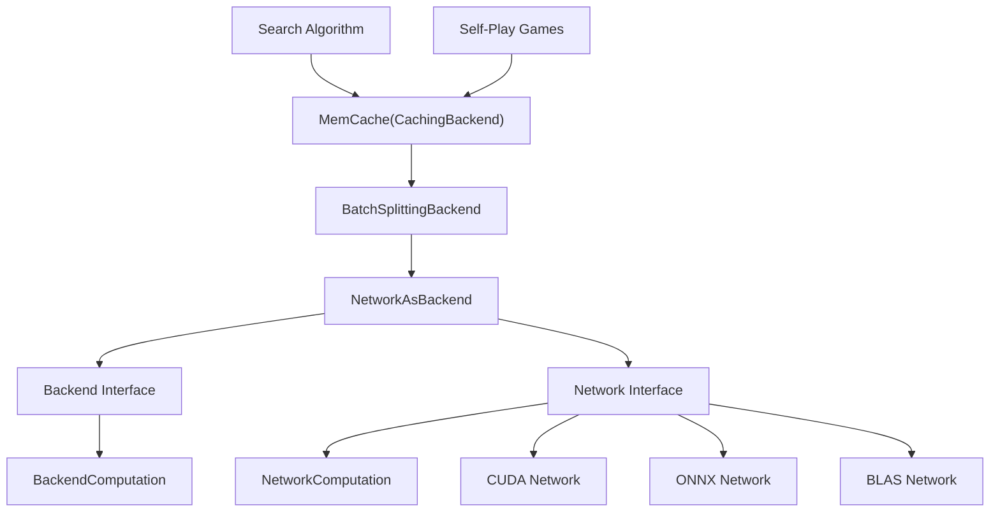
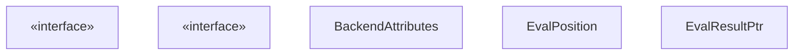
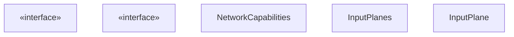
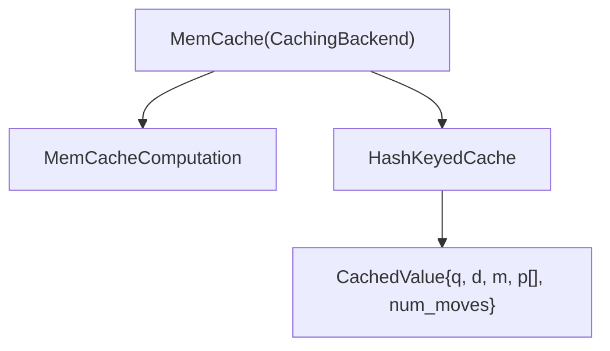
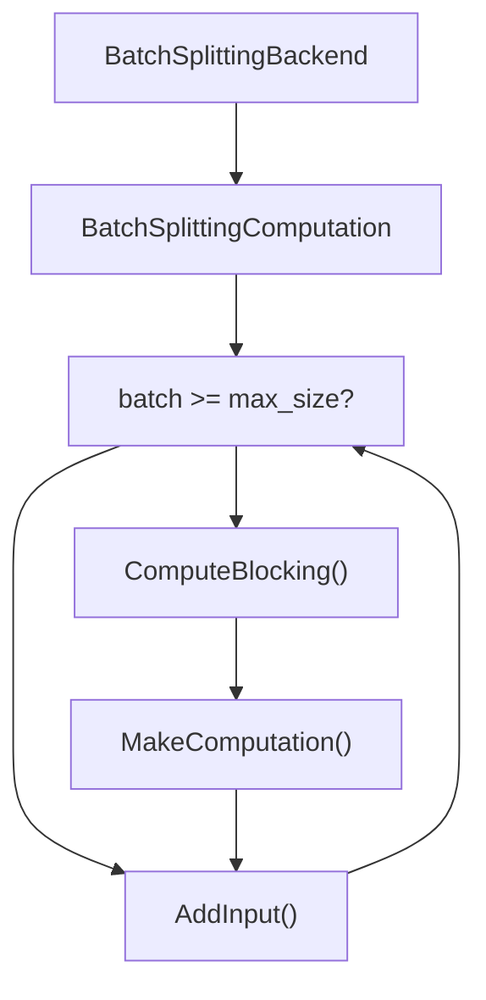
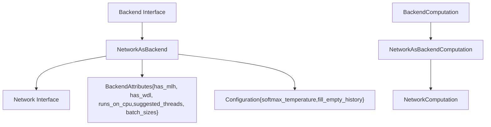
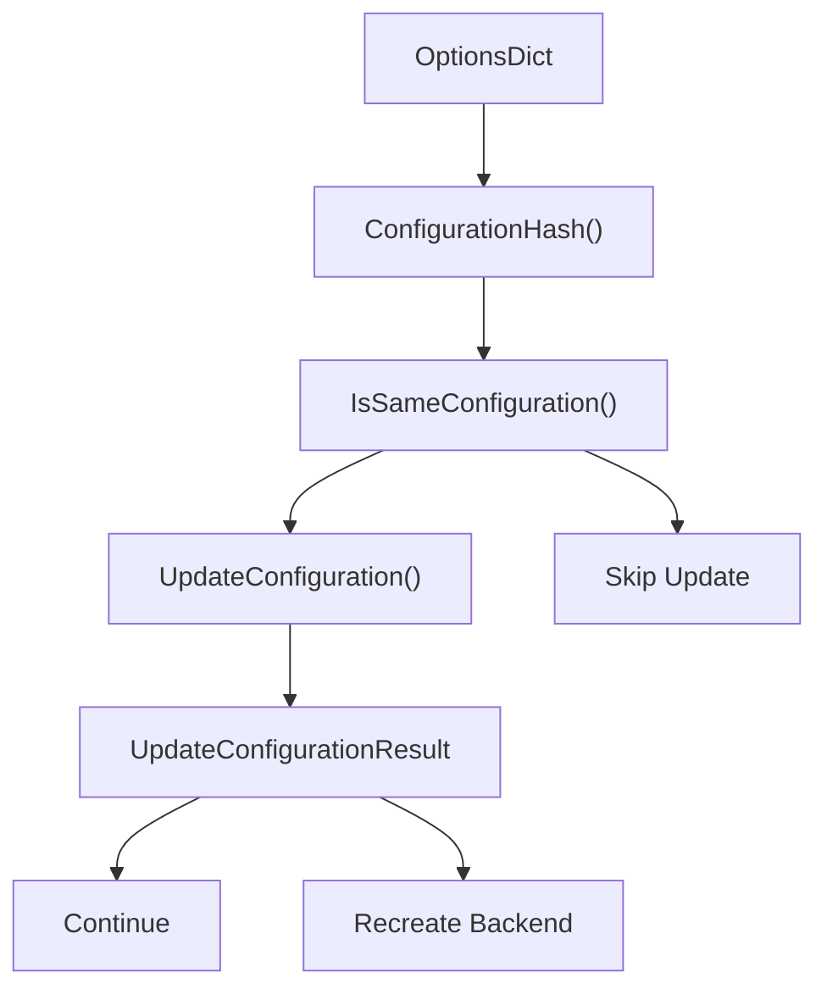

# Network Interface and Backend Architecture

Relevant source files

-   [src/neural/backend.cc](https://github.com/LeelaChessZero/lc0/blob/b4e98c19/src/neural/backend.cc)
-   [src/neural/backend.h](https://github.com/LeelaChessZero/lc0/blob/b4e98c19/src/neural/backend.h)
-   [src/neural/batchsplit.cc](https://github.com/LeelaChessZero/lc0/blob/b4e98c19/src/neural/batchsplit.cc)
-   [src/neural/memcache.cc](https://github.com/LeelaChessZero/lc0/blob/b4e98c19/src/neural/memcache.cc)
-   [src/neural/memcache.h](https://github.com/LeelaChessZero/lc0/blob/b4e98c19/src/neural/memcache.h)
-   [src/neural/network.h](https://github.com/LeelaChessZero/lc0/blob/b4e98c19/src/neural/network.h)
-   [src/neural/shared\_params.cc](https://github.com/LeelaChessZero/lc0/blob/b4e98c19/src/neural/shared_params.cc)
-   [src/neural/shared\_params.h](https://github.com/LeelaChessZero/lc0/blob/b4e98c19/src/neural/shared_params.h)
-   [src/neural/wrapper.cc](https://github.com/LeelaChessZero/lc0/blob/b4e98c19/src/neural/wrapper.cc)
-   [src/tools/backendbench.cc](https://github.com/LeelaChessZero/lc0/blob/b4e98c19/src/tools/backendbench.cc)
-   [src/tools/benchmark.cc](https://github.com/LeelaChessZero/lc0/blob/b4e98c19/src/tools/benchmark.cc)
-   [src/tools/benchmark.h](https://github.com/LeelaChessZero/lc0/blob/b4e98c19/src/tools/benchmark.h)

## Purpose and Scope

This document details Leela Chess Zero's neural network backend architecture, which provides a layered abstraction system for neural network evaluation. The architecture uses multiple interface layers (`Backend`, `Network`) with decorator patterns for caching, batch management, and configuration. This allows the engine to support diverse neural network implementations (CUDA, ONNX, BLAS, etc.) through a unified interface while providing transparent performance optimizations. For specific backend implementations, see [CUDA/cuDNN Backend](/LeelaChessZero/lc0/6.3-cuda-and-cudnn-backend), [ONNX Integration](/LeelaChessZero/lc0/6.4-onnx-integration), or [Weights Loading and Management](/LeelaChessZero/lc0/6.2-weights-loading-and-management).

## Backend Architecture Overview

The neural network evaluation system uses a layered architecture with multiple abstraction levels and decorator patterns for extensibility.

### Backend Architecture Layers

Sources: [src/neural/memcache.cc60-98](https://github.com/LeelaChessZero/lc0/blob/b4e98c19/src/neural/memcache.cc#L60-L98) [src/neural/batchsplit.cc33-57](https://github.com/LeelaChessZero/lc0/blob/b4e98c19/src/neural/batchsplit.cc#L33-L57) [src/neural/wrapper.cc48-97](https://github.com/LeelaChessZero/lc0/blob/b4e98c19/src/neural/wrapper.cc#L48-L97) [src/neural/backend.h89-125](https://github.com/LeelaChessZero/lc0/blob/b4e98c19/src/neural/backend.h#L89-L125) [src/neural/network.h116-125](https://github.com/LeelaChessZero/lc0/blob/b4e98c19/src/neural/network.h#L116-L125)

## Core Interfaces

The system defines two primary interface layers with distinct responsibilities.

### Backend Interface

The `Backend` interface serves as the primary abstraction for neural network evaluation:

The `Backend` interface provides:

-   Position evaluation with batching support
-   Configuration management and hot-reloading
-   Cache integration capabilities
-   Performance characteristics via `BackendAttributes`

Sources: [src/neural/backend.h89-125](https://github.com/LeelaChessZero/lc0/blob/b4e98c19/src/neural/backend.h#L89-L125) [src/neural/backend.h43-50](https://github.com/LeelaChessZero/lc0/blob/b4e98c19/src/neural/backend.h#L43-L50) [src/neural/backend.h52-68](https://github.com/LeelaChessZero/lc0/blob/b4e98c19/src/neural/backend.h#L52-L68) [src/neural/backend.h70-74](https://github.com/LeelaChessZero/lc0/blob/b4e98c19/src/neural/backend.h#L70-L74)

### Network Interface

The `Network` interface represents the lower-level neural network abstraction:

The `Network` interface handles:

-   Raw neural network operations with `InputPlanes`
-   Hardware-specific optimizations
-   Network capability detection
-   Low-level computation management

Sources: [src/neural/network.h116-125](https://github.com/LeelaChessZero/lc0/blob/b4e98c19/src/neural/network.h#L116-L125) [src/neural/network.h56-71](https://github.com/LeelaChessZero/lc0/blob/b4e98c19/src/neural/network.h#L56-L71) [src/neural/network.h85-114](https://github.com/LeelaChessZero/lc0/blob/b4e98c19/src/neural/network.h#L85-L114) [src/neural/network.h43-53](https://github.com/LeelaChessZero/lc0/blob/b4e98c19/src/neural/network.h#L43-L53)

## Backend Decorator Architecture

The system employs decorator patterns to add functionality transparently to backend implementations.

### Caching Layer - MemCache

The `MemCache` class implements position evaluation caching using `CachingBackend`:

Key implementation details:

-   Uses `ComputeEvalPositionHash()` to generate cache keys from position history
-   Stores evaluations in `CachedValue` structures with Q/D/M values and policy arrays
-   `MemCacheComputation` checks cache before forwarding to wrapped backend
-   Cache size configurable via `SharedBackendParams::kNNCacheSizeId`

Sources: [src/neural/memcache.cc41-43](https://github.com/LeelaChessZero/lc0/blob/b4e98c19/src/neural/memcache.cc#L41-L43) [src/neural/memcache.cc45-51](https://github.com/LeelaChessZero/lc0/blob/b4e98c19/src/neural/memcache.cc#L45-L51) [src/neural/memcache.cc60-98](https://github.com/LeelaChessZero/lc0/blob/b4e98c19/src/neural/memcache.cc#L60-L98) [src/neural/memcache.cc100-159](https://github.com/LeelaChessZero/lc0/blob/b4e98c19/src/neural/memcache.cc#L100-L159)

### Batch Management - BatchSplittingBackend

The `BatchSplittingBackend` automatically manages batch size limits:

The implementation:

-   Monitors `UsedBatchSize()` against `maximum_batch_size`
-   Automatically calls `ComputeBlocking()` when batch is full
-   Creates new computation instances transparently
-   Enables unlimited batch sizes on size-limited backends

Sources: [src/neural/batchsplit.cc33-57](https://github.com/LeelaChessZero/lc0/blob/b4e98c19/src/neural/batchsplit.cc#L33-L57) [src/neural/batchsplit.cc59-89](https://github.com/LeelaChessZero/lc0/blob/b4e98c19/src/neural/batchsplit.cc#L59-L89)

## Factory and Registration System

The system uses factory patterns with priority-based selection for backend instantiation.

### Backend Factory Architecture

### Backend Creation Flow

> **[Mermaid sequence]**
> *(图表结构无法解析)*

The `BackendManager` singleton:

-   Maintains registered `BackendFactory` instances sorted by priority
-   Selects highest priority factory when no specific backend requested
-   Supports runtime backend switching via `CreateFromParams()`

Sources: [src/neural/register.h37-72](https://github.com/LeelaChessZero/lc0/blob/b4e98c19/src/neural/register.h#L37-L72) [src/neural/wrapper.cc174-193](https://github.com/LeelaChessZero/lc0/blob/b4e98c19/src/neural/wrapper.cc#L174-L193)

### NetworkFactory

`NetworkFactory` is a singleton that manages the creation of `Network` instances:

1.  Network implementations register themselves using `NetworkFactory::Register`
2.  Each registered implementation has a name, factory function, and priority
3.  Users can create a network by name with `NetworkFactory::Create()`
4.  The factory selects the highest priority implementation when none is specified

Sources: [src/neural/factory.h42-109](https://github.com/LeelaChessZero/lc0/blob/b4e98c19/src/neural/factory.h#L42-L109)

### BackendManager

`BackendManager` serves a similar role for the newer `Backend` interface:

1.  Backend implementations register via `BackendManager::Register`
2.  Each has a name, factory, and priority
3.  `CreateFromParams()` and `CreateFromName()` create backends
4.  Priority determines the default implementation

Sources: [src/neural/register.h37-72](https://github.com/LeelaChessZero/lc0/blob/b4e98c19/src/neural/register.h#L37-L72) [src/neural/register.cc36-90](https://github.com/LeelaChessZero/lc0/blob/b4e98c19/src/neural/register.cc#L36-L90)

### Registration Mechanism

Leela Chess Zero uses macros to simplify registration:

-   `REGISTER_NETWORK`: Registers a network implementation with both `NetworkFactory` and `BackendManager`
-   `REGISTER_BACKEND`: Registers a backend-only implementation

This dual registration ensures network implementations are available through both interfaces.

Sources: [src/neural/factory.h111-140](https://github.com/LeelaChessZero/lc0/blob/b4e98c19/src/neural/factory.h#L111-L140) [src/neural/register.h74-78](https://github.com/LeelaChessZero/lc0/blob/b4e98c19/src/neural/register.h#L74-L78)

## Network-to-Backend Adapter

The `NetworkAsBackend` adapter bridges the `Network` and `Backend` interfaces using the adapter pattern.

### Adapter Architecture

### NetworkAsBackend Implementation

The adapter performs several key transformations:

| Backend Method | Network Equivalent | Transformation |
| --- | --- | --- |
| `GetAttributes()` | `GetCapabilities()` | Maps `NetworkCapabilities` to `BackendAttributes` |
| `CreateComputation()` | `NewComputation()` | Wraps with format conversion |
| `UpdateConfiguration()` | N/A | Manages softmax temperature, history fill |

Configuration parameters managed:

-   `softmax_policy_temperature_`: Derived from `SharedBackendParams::kPolicySoftmaxTemp`
-   `fill_empty_history_`: From `SharedBackendParams::kHistoryFill`
-   `input_format_`: Extracted from network capabilities

Sources: [src/neural/wrapper.cc48-97](https://github.com/LeelaChessZero/lc0/blob/b4e98c19/src/neural/wrapper.cc#L48-L97) [src/neural/wrapper.cc69-85](https://github.com/LeelaChessZero/lc0/blob/b4e98c19/src/neural/wrapper.cc#L69-L85)

### NetworkAsBackendComputation Implementation

The computation adapter handles format conversion and batching:

> **[Mermaid sequence]**
> *(图表结构无法解析)*

Key transformations:

1.  `EvalPosition` → `InputPlanes` via `EncodePositionForNN()`
2.  Raw policy logits → softmax probabilities in `SoftmaxPolicy()`
3.  Move index transformation using `MoveToNNIndex()`

Sources: [src/neural/wrapper.cc99-169](https://github.com/LeelaChessZero/lc0/blob/b4e98c19/src/neural/wrapper.cc#L99-L169) [src/neural/wrapper.cc133-153](https://github.com/LeelaChessZero/lc0/blob/b4e98c19/src/neural/wrapper.cc#L133-L153)

## Configuration and Parameters

The backend system uses shared configuration parameters managed through the `SharedBackendParams` system.

### Shared Backend Parameters

The following parameters are common across most backend implementations:

| Parameter | Type | Purpose | Default |
| --- | --- | --- | --- |
| `kWeightsId` | String | Path to neural network weights file | `<autodiscover>` |
| `kBackendId` | Choice | Backend implementation to use | First available |
| `kBackendOptionsId` | String | Backend-specific configuration | Empty |
| `kNNCacheSizeId` | Integer | Memory cache size (positions) | 2,000,000 |
| `kPolicySoftmaxTemp` | Float | Policy probability temperature | 1.359 |
| `kHistoryFill` | Choice | History filling strategy | `fen_only` |

Sources: [src/neural/shared\_params.cc33-66](https://github.com/LeelaChessZero/lc0/blob/b4e98c19/src/neural/shared_params.cc#L33-L66) [src/neural/shared\_params.cc68-84](https://github.com/LeelaChessZero/lc0/blob/b4e98c19/src/neural/shared_params.cc#L68-L84)

### Configuration Management

Backend configuration follows a hash-based change detection system:

The `Backend::ConfigurationHash()` method creates a hash from:

-   Backend name (`kBackendId`)
-   Backend options (`kBackendOptionsId`)
-   Weights path (`kWeightsId`)
-   Policy temperature (`kPolicySoftmaxTemp`)
-   History fill setting (`kHistoryFill`)

Sources: [src/neural/backend.cc54-66](https://github.com/LeelaChessZero/lc0/blob/b4e98c19/src/neural/backend.cc#L54-L66) [src/neural/backend.h106-118](https://github.com/LeelaChessZero/lc0/blob/b4e98c19/src/neural/backend.h#L106-L118)

## Usage Examples

### Creating a Backend Stack

> **[Mermaid sequence]**
> *(图表结构无法解析)*

### Evaluation Flow

> **[Mermaid sequence]**
> *(图表结构无法解析)*

Sources: [src/neural/memcache.cc112-140](https://github.com/LeelaChessZero/lc0/blob/b4e98c19/src/neural/memcache.cc#L112-L140) [src/neural/batchsplit.cc70-79](https://github.com/LeelaChessZero/lc0/blob/b4e98c19/src/neural/batchsplit.cc#L70-L79) [src/neural/wrapper.cc121-131](https://github.com/LeelaChessZero/lc0/blob/b4e98c19/src/neural/wrapper.cc#L121-L131)

## Common Usage Patterns

### Creating a Network

> **[Mermaid sequence]**
> *(图表结构无法解析)*

### Evaluating a Position

> **[Mermaid sequence]**
> *(图表结构无法解析)*

Sources: [src/neural/network.h56-71](https://github.com/LeelaChessZero/lc0/blob/b4e98c19/src/neural/network.h#L56-L71) [src/neural/network.h116-125](https://github.com/LeelaChessZero/lc0/blob/b4e98c19/src/neural/network.h#L116-L125)

## Implementation Examples

When implementing a neural network backend in lc0, developers need to:

1.  Implement the `Network` interface (and optionally `Backend` directly)
2.  Create a factory function that constructs the implementation
3.  Register the implementation using the provided macros

This pattern ensures that any neural network implementation can be seamlessly integrated into the engine regardless of the underlying technology (CUDA, OpenCL, BLAS, etc.).

Sources: [src/neural/factory.h111-140](https://github.com/LeelaChessZero/lc0/blob/b4e98c19/src/neural/factory.h#L111-L140)
