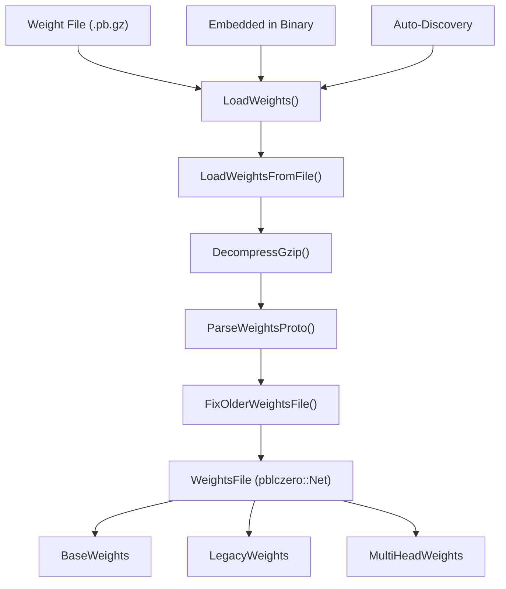
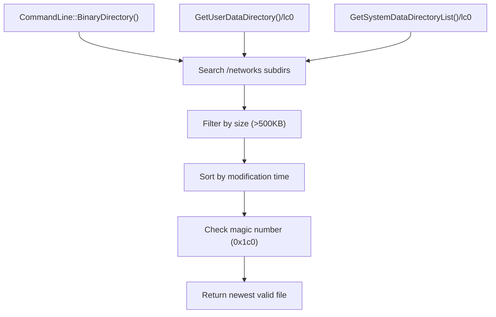
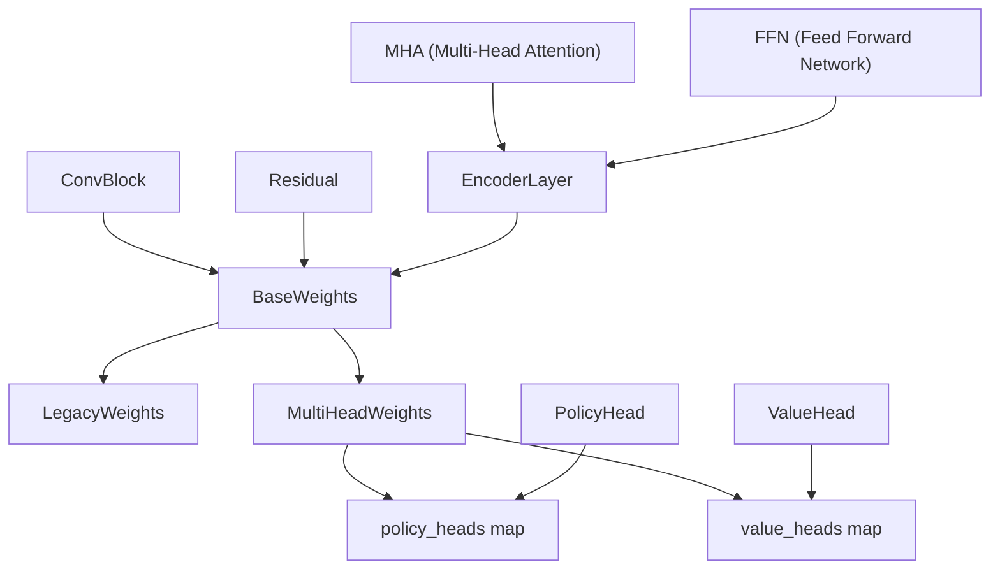
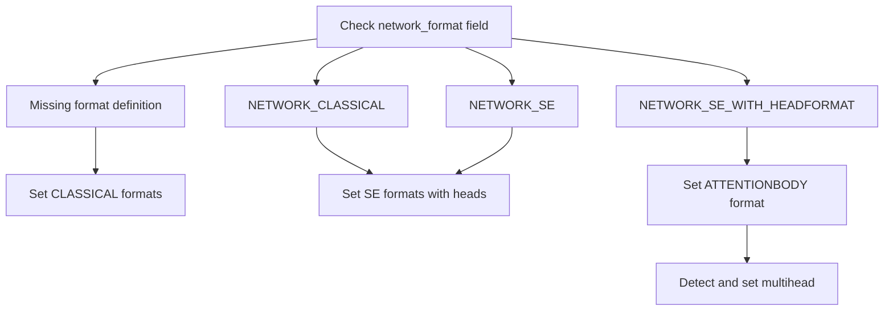

# Weights Loading and Management

Relevant source files

-   [src/neural/loader.cc](https://github.com/LeelaChessZero/lc0/blob/b4e98c19/src/neural/loader.cc)
-   [src/neural/loader.h](https://github.com/LeelaChessZero/lc0/blob/b4e98c19/src/neural/loader.h)
-   [src/neural/network\_legacy.cc](https://github.com/LeelaChessZero/lc0/blob/b4e98c19/src/neural/network_legacy.cc)
-   [src/neural/network\_legacy.h](https://github.com/LeelaChessZero/lc0/blob/b4e98c19/src/neural/network_legacy.h)

This document covers the neural network weights loading system in Leela Chess Zero, including file format handling, auto-discovery mechanisms, and weight structure management. This system is responsible for loading trained neural network models from various sources and converting them into usable C++ data structures.

For information about the neural network backends that use these weights, see [Network Interface and Backend Architecture](/LeelaChessZero/lc0/6.1-network-interface-and-backend-architecture). For details about caching neural network evaluations, see [Memory Caching and Performance](/LeelaChessZero/lc0/6.6-memory-caching-and-performance).

## Weight File Format and Loading Pipeline

The weights loading system handles neural network models stored in Google Protocol Buffer format, compressed with gzip. The system supports multiple loading sources and provides backward compatibility for older weight formats.

Sources: [src/neural/loader.cc194-227](https://github.com/LeelaChessZero/lc0/blob/b4e98c19/src/neural/loader.cc#L194-L227) [src/neural/loader.h44-60](https://github.com/LeelaChessZero/lc0/blob/b4e98c19/src/neural/loader.h#L44-L60)

## Weight File Discovery and Sources

The system supports three primary methods for locating weight files, handled by the `LoadWeights` function.

### Source Types

| Source Type | Identifier | Description |
| --- | --- | --- |
| File Path | `filename` | Direct path to weight file |
| Auto-discover | `<autodiscover>` | Searches predefined directories |
| Embedded | `<embed>` | Weights embedded in binary |

### Auto-Discovery Process

The `DiscoverWeightsFile` function implements a sophisticated search algorithm that examines multiple directories for potential weight files:

Sources: [src/neural/loader.cc229-277](https://github.com/LeelaChessZero/lc0/blob/b4e98c19/src/neural/loader.cc#L229-L277) [src/neural/loader.cc57](https://github.com/LeelaChessZero/lc0/blob/b4e98c19/src/neural/loader.cc#L57-L57)

## Weight File Format Structure

Weight files use the Protocol Buffer format defined in `proto/net.pb.h` with specific magic numbers and version checks for validation.

### File Format Validation

The system performs several validation steps when loading weight files:

-   **Magic Number Check**: Files must start with magic number `0x1c0` [src/neural/loader.cc164-166](https://github.com/LeelaChessZero/lc0/blob/b4e98c19/src/neural/loader.cc#L164-L166)
-   **Version Compatibility**: Ensures the weight file is compatible with the current LC0 version [src/neural/loader.cc168-182](https://github.com/LeelaChessZero/lc0/blob/b4e98c19/src/neural/loader.cc#L168-L182)
-   **Encoding Support**: Only `LINEAR16` weight encoding is supported [src/neural/loader.cc184-187](https://github.com/LeelaChessZero/lc0/blob/b4e98c19/src/neural/loader.cc#L184-L187)

### Embedded Weight Support

The system can load weights embedded directly in the LC0 binary executable. When loading embedded weights, the system:

1.  Seeks to the end of the binary file
2.  Reads the size and magic number from the last 8 bytes
3.  Validates the magic number `0x2130634c` ("Lc0!")
4.  Extracts the embedded weight data

Sources: [src/neural/loader.cc70-80](https://github.com/LeelaChessZero/lc0/blob/b4e98c19/src/neural/loader.cc#L70-L80)

## Weight Structure Hierarchy

The loaded weights are converted into structured C++ objects optimized for different neural network architectures. The system supports both legacy single-head networks and modern multi-head architectures.

Sources: [src/neural/network\_legacy.h28-149](https://github.com/LeelaChessZero/lc0/blob/b4e98c19/src/neural/network_legacy.h#L28-L149) [src/neural/network\_legacy.h178-229](https://github.com/LeelaChessZero/lc0/blob/b4e98c19/src/neural/network_legacy.h#L178-L229)

### Weight Component Types

The weight structures are organized hierarchically to represent different neural network components:

#### Convolutional Components

-   **ConvBlock**: Contains weights, biases, and batch normalization parameters [src/neural/network\_legacy.h32-41](https://github.com/LeelaChessZero/lc0/blob/b4e98c19/src/neural/network_legacy.h#L32-L41)
-   **Residual**: Represents residual blocks with optional Squeeze-and-Excitation units [src/neural/network\_legacy.h51-57](https://github.com/LeelaChessZero/lc0/blob/b4e98c19/src/neural/network_legacy.h#L51-L57)

#### Attention Components

-   **MHA**: Multi-head attention weights including query, key, value, and dense projections [src/neural/network\_legacy.h72-84](https://github.com/LeelaChessZero/lc0/blob/b4e98c19/src/neural/network_legacy.h#L72-L84)
-   **FFN**: Feed-forward network weights for transformer layers [src/neural/network\_legacy.h86-92](https://github.com/LeelaChessZero/lc0/blob/b4e98c19/src/neural/network_legacy.h#L86-L92)
-   **EncoderLayer**: Complete transformer encoder layer combining MHA and FFN [src/neural/network\_legacy.h94-102](https://github.com/LeelaChessZero/lc0/blob/b4e98c19/src/neural/network_legacy.h#L94-L102)

#### Specialized Components

-   **Smolgen**: Weights for the Smolgen attention mechanism [src/neural/network\_legacy.h59-70](https://github.com/LeelaChessZero/lc0/blob/b4e98c19/src/neural/network_legacy.h#L59-L70)
-   **SEunit**: Squeeze-and-Excitation unit weights [src/neural/network\_legacy.h43-49](https://github.com/LeelaChessZero/lc0/blob/b4e98c19/src/neural/network_legacy.h#L43-L49)

## Legacy Compatibility and Format Migration

The system maintains backward compatibility with older weight file formats through the `FixOlderWeightsFile` function, which automatically updates legacy format specifications.

### Format Migration Process

Sources: [src/neural/loader.cc108-158](https://github.com/LeelaChessZero/lc0/blob/b4e98c19/src/neural/loader.cc#L108-L158)

### Batch Normalization Folding

The `ConvBlock` constructor automatically folds batch normalization parameters into the convolution weights and biases for optimization:

1.  **Variance Normalization**: Converts standard deviations to gamma scaling factors [src/neural/network\_legacy.cc111](https://github.com/LeelaChessZero/lc0/blob/b4e98c19/src/neural/network_legacy.cc#L111-L111)
2.  **Weight Scaling**: Applies batch norm scaling to convolution weights [src/neural/network\_legacy.cc120-123](https://github.com/LeelaChessZero/lc0/blob/b4e98c19/src/neural/network_legacy.cc#L120-L123)
3.  **Bias Adjustment**: Computes final biases incorporating batch norm shift [src/neural/network\_legacy.cc125](https://github.com/LeelaChessZero/lc0/blob/b4e98c19/src/neural/network_legacy.cc#L125-L125)

Sources: [src/neural/network\_legacy.cc108-133](https://github.com/LeelaChessZero/lc0/blob/b4e98c19/src/neural/network_legacy.cc#L108-L133)

## Weight Loading Configuration

The weight loading system integrates with the configuration system to provide flexible weight source specification through command-line options and configuration files.

### Configuration Parameters

| Parameter | Purpose | Default Behavior |
| --- | --- | --- |
| `weights` | Specifies weight source location | Auto-discovery if not set |
| `backend` | Determines which backend loads weights | Affects weight structure usage |

The system uses the `SharedBackendParams` constants to identify special weight source types:

-   `kAutoDiscover`: Triggers the auto-discovery mechanism
-   `kEmbed`: Loads embedded weights from the binary

Sources: [src/neural/loader.cc215-218](https://github.com/LeelaChessZero/lc0/blob/b4e98c19/src/neural/loader.cc#L215-L218)
