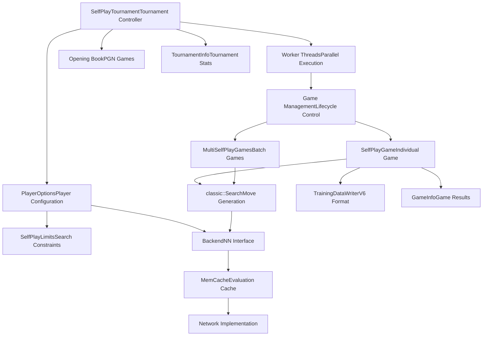
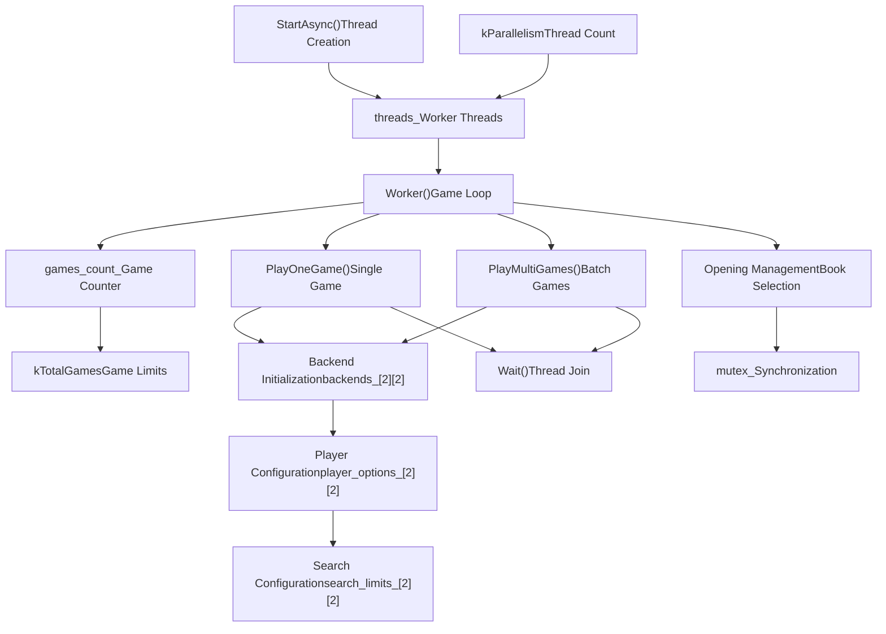
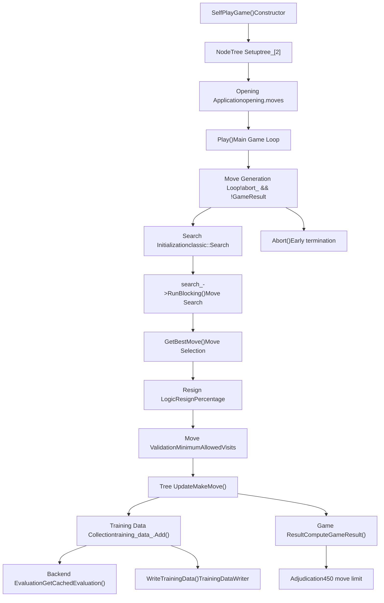
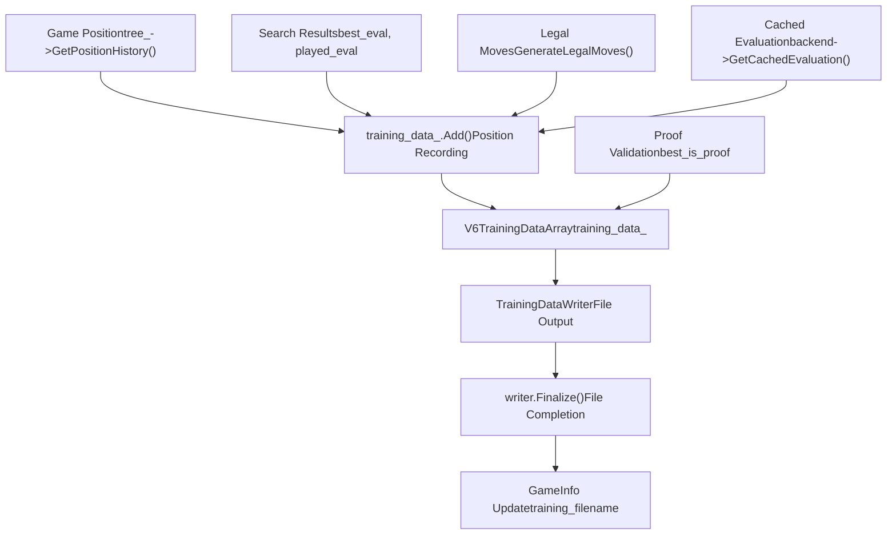
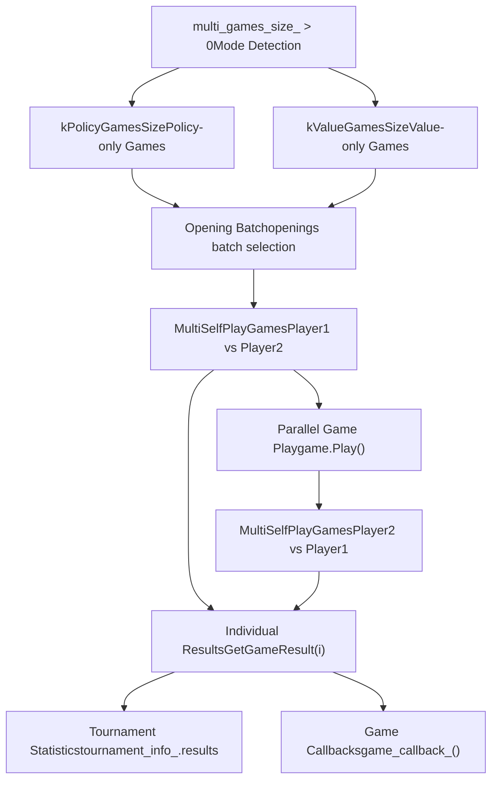

# Self-Play System

Relevant source files

-   [src/selfplay/game.cc](https://github.com/LeelaChessZero/lc0/blob/b4e98c19/src/selfplay/game.cc)
-   [src/selfplay/game.h](https://github.com/LeelaChessZero/lc0/blob/b4e98c19/src/selfplay/game.h)
-   [src/selfplay/tournament.cc](https://github.com/LeelaChessZero/lc0/blob/b4e98c19/src/selfplay/tournament.cc)
-   [src/selfplay/tournament.h](https://github.com/LeelaChessZero/lc0/blob/b4e98c19/src/selfplay/tournament.h)

The self-play system is responsible for automated game generation between neural network players, primarily for training data collection and model evaluation. This system manages tournament organization, parallel game execution, and training data output.

For information about the search algorithms used within self-play games, see [Search Algorithm](/LeelaChessZero/lc0/5-search-algorithm). For neural network backend management, see [Neural Network System](/LeelaChessZero/lc0/6-neural-network-system).

## System Overview

The self-play system consists of two main components: the `SelfPlayTournament` class that orchestrates multiple games and the `SelfPlayGame` class that manages individual game execution.

**Sources:** [src/selfplay/tournament.h43-117](https://github.com/LeelaChessZero/lc0/blob/b4e98c19/src/selfplay/tournament.h#L43-L117) [src/selfplay/game.h65-128](https://github.com/LeelaChessZero/lc0/blob/b4e98c19/src/selfplay/game.h#L65-L128)

## Tournament Architecture

The `SelfPlayTournament` class manages the overall tournament execution, coordinating multiple parallel games and collecting results.

**Sources:** [src/selfplay/tournament.cc537-592](https://github.com/LeelaChessZero/lc0/blob/b4e98c19/src/selfplay/tournament.cc#L537-L592) [src/selfplay/tournament.cc160-273](https://github.com/LeelaChessZero/lc0/blob/b4e98c19/src/selfplay/tournament.cc#L160-L273)

## Game Execution Flow

Individual games are managed by the `SelfPlayGame` class, which handles the complete game lifecycle from opening to completion.

**Sources:** [src/selfplay/game.cc131-307](https://github.com/LeelaChessZero/lc0/blob/b4e98c19/src/selfplay/game.cc#L131-L307) [src/selfplay/game.cc82-129](https://github.com/LeelaChessZero/lc0/blob/b4e98c19/src/selfplay/game.cc#L82-L129)

## Configuration and Options

The self-play system supports extensive configuration through the options system, allowing control over game parameters, search limits, and training settings.

| Configuration Category | Key Options | Purpose |
| --- | --- | --- |
| **Tournament Control** | `games`, `parallelism`, `share-trees` | Game count and parallel execution |
| **Search Limits** | `visits`, `playouts`, `movetime` | Move search constraints |
| **Training** | `training`, `policy-mode-size`, `value-mode-size` | Training data generation |
| **Opening Management** | `openings-pgn`, `mirror-openings`, `openings-mode` | Opening book configuration |
| **Game Rules** | `resign-percentage`, `resign-earliest-move` | Game adjudication rules |
| **Backend Selection** | Player-specific backend configuration | Neural network assignment |

**Sources:** [src/selfplay/tournament.cc103-158](https://github.com/LeelaChessZero/lc0/blob/b4e98c19/src/selfplay/tournament.cc#L103-L158) [src/selfplay/game.cc70-80](https://github.com/LeelaChessZero/lc0/blob/b4e98c19/src/selfplay/game.cc#L70-L80)

## Training Data Generation

The self-play system generates training data in V6 format when training mode is enabled, capturing position evaluations and search statistics.

**Sources:** [src/selfplay/game.cc270-297](https://github.com/LeelaChessZero/lc0/blob/b4e98c19/src/selfplay/game.cc#L270-L297) [src/selfplay/game.cc351-353](https://github.com/LeelaChessZero/lc0/blob/b4e98c19/src/selfplay/game.cc#L351-L353) [src/selfplay/tournament.cc410-416](https://github.com/LeelaChessZero/lc0/blob/b4e98c19/src/selfplay/tournament.cc#L410-L416)

## Multi-Game Modes

The system supports specialized multi-game modes for deterministic evaluation, including policy-only and value-only modes that process multiple games efficiently.

**Sources:** [src/selfplay/tournament.cc439-535](https://github.com/LeelaChessZero/lc0/blob/b4e98c19/src/selfplay/tournament.cc#L439-L535) [src/selfplay/tournament.cc545-567](https://github.com/LeelaChessZero/lc0/blob/b4e98c19/src/selfplay/tournament.cc#L545-L567)

## Backend and Network Management

The tournament system manages multiple neural network backends for different player configurations, supporting asymmetric player setups and shared backend optimization.

Each tournament maintains a 2x2 matrix of backends (`backends_[2][2]`) representing \[player1/player2\]\[white/black\] configurations. The system automatically detects identical configurations and shares backend instances to optimize memory usage.

**Sources:** [src/selfplay/tournament.cc216-236](https://github.com/LeelaChessZero/lc0/blob/b4e98c19/src/selfplay/tournament.cc#L216-L236) [src/selfplay/tournament.cc238-261](https://github.com/LeelaChessZero/lc0/blob/b4e98c19/src/selfplay/tournament.cc#L238-L261)
