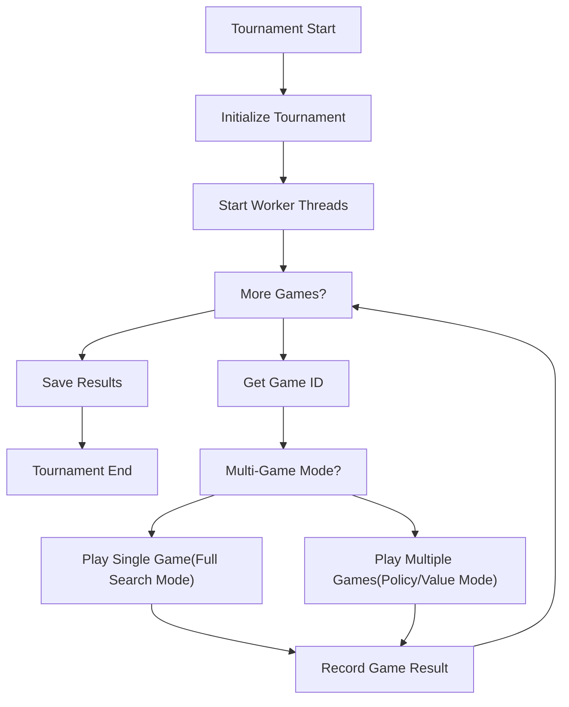
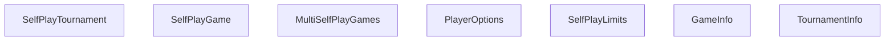
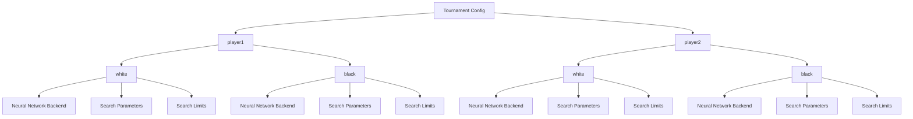

# Tournament Organization

Relevant source files

-   [src/selfplay/game.cc](https://github.com/LeelaChessZero/lc0/blob/b4e98c19/src/selfplay/game.cc)
-   [src/selfplay/game.h](https://github.com/LeelaChessZero/lc0/blob/b4e98c19/src/selfplay/game.h)
-   [src/selfplay/tournament.cc](https://github.com/LeelaChessZero/lc0/blob/b4e98c19/src/selfplay/tournament.cc)
-   [src/selfplay/tournament.h](https://github.com/LeelaChessZero/lc0/blob/b4e98c19/src/selfplay/tournament.h)

This page explains the tournament organization system in Leela Chess Zero (lc0), which is responsible for setting up and running self-play tournaments for training neural networks and evaluating engine strength. For information about the self-play system in general, see [Self-Play System](/LeelaChessZero/lc0/7-self-play-system).

## Overview

The tournament organization system manages multiple self-play games, optionally in parallel, with configurable options for how games are played. It handles game execution, result tracking, opening book management, and can generate training data for neural network improvement.


Sources: [src/selfplay/tournament.cc540-587](https://github.com/LeelaChessZero/lc0/blob/b4e98c19/src/selfplay/tournament.cc#L540-L587) [src/selfplay/tournament.cc596-628](https://github.com/LeelaChessZero/lc0/blob/b4e98c19/src/selfplay/tournament.cc#L596-L628)

## Tournament System Architecture

The tournament system consists of several key components:


Sources: [src/selfplay/tournament.h44-117](https://github.com/LeelaChessZero/lc0/blob/b4e98c19/src/selfplay/tournament.h#L44-L117) [src/selfplay/game.h40-127](https://github.com/LeelaChessZero/lc0/blob/b4e98c19/src/selfplay/game.h#L40-L127) [src/selfplay/multigame.h](https://github.com/LeelaChessZero/lc0/blob/b4e98c19/src/selfplay/multigame.h) [src/chess/uciloop.h](https://github.com/LeelaChessZero/lc0/blob/b4e98c19/src/chess/uciloop.h)

### Key Classes

| Class | Description | Key Members |
| --- | --- | --- |
| `SelfPlayTournament` | Main tournament manager that handles scheduling games, tracking results, and managing worker threads | `games_`, `multigames_`, `tournament_info_`, `threads_`, `backends_[2][2]` |
| `SelfPlayGame` | Represents a single game between two players with full search capability | `options_[2]`, `tree_[2]`, `search_`, `training_data_` |
| `MultiSelfPlayGames` | Manages multiple games simultaneously with simplified evaluation (policy or value based) | `trees_`, `results_`, `eval_` |
| `PlayerOptions` | Contains configuration for a player including backend, callbacks, and search limits | `backend`, `best_move_callback`, `info_callback`, `search_limits` |
| `SelfPlayLimits` | Defines search limits such as visits, playouts, and move time | `visits`, `playouts`, `movetime` |
| `GameInfo` | Structure containing information about a completed game | `game_result`, `moves`, `training_filename`, `game_id` |
| `TournamentInfo` | Structure containing tournament statistics and results | `results[3][2]`, `move_count_`, `nodes_total_`, `finished` |

## Tournament Configuration

### Available Options

The tournament system is configured through the options parser with the following main options:

| Option | Description | Default |
| --- | --- | --- |
| `share-trees` | Share game tree between players | `true` |
| `games` | Number of games to play (-1 for infinite, -2 for book length) | `-1` |
| `parallelism` | Number of games to play in parallel | `8` |
| `threads` | CPU threads per game | `1` |
| `playouts` | Playouts per move | `-1` |
| `visits` | Visits per move | `-1` |
| `movetime` | Time per move in milliseconds | `-1` |
| `training` | Enable writing training data | `false` |
| `verbose-thinking` | Show verbose thinking messages | `false` |
| `policy-mode-size` | Number of games per thread in policy only mode | `0` |
| `value-mode-size` | Number of games per thread in value only mode | `0` |
| `tournament-results-file` | File to append tournament results | `""` |
| `resign-playthrough` | Percentage of games that ignore resign | `0.0` |
| `openings-pgn` | Path to openings PGN file | `""` |
| `mirror-openings` | Play each opening in pairs | `false` |
| `openings-mode` | How to use openings (sequential/shuffled/random) | `"sequential"` |
| `syzygy-paths` | Path to Syzygy tablebases | `""` |

Sources: [src/selfplay/tournament.cc43-101](https://github.com/LeelaChessZero/lc0/blob/b4e98c19/src/selfplay/tournament.cc#L43-L101) [src/selfplay/tournament.cc104-159](https://github.com/LeelaChessZero/lc0/blob/b4e98c19/src/selfplay/tournament.cc#L104-L159)

### Player Configuration

The tournament system uses a nested configuration structure that allows different settings for each player and color:


Sources: [src/selfplay/tournament.cc104-109](https://github.com/LeelaChessZero/lc0/blob/b4e98c19/src/selfplay/tournament.cc#L104-L109)

The configuration setup is done in `SelfPlayTournament::PopulateOptions`:

```
options->AddContext("player1");
options->AddContext("player2");
options->AddContext("white");
options->AddContext("black");
for (const auto context : {"player1", "player2"}) {
  auto* dict = options->GetMutableOptions(context);
  dict->AddSubdict("white")->AddAliasDict(&options->GetOptionsDict("white"));
  dict->AddSubdict("black")->AddAliasDict(&options->GetOptionsDict("black"));
}
```
This allows configuring parameters like search limits differently for each player-color combination.

## Tournament Execution

### Initialization

When a tournament is created, it:

1.  Parses player options for both players (white and black configurations)
2.  Loads the specified opening book
3.  Initializes neural network backends for all player configurations
4.  Sets up search limits for each player/color combination
5.  Loads Syzygy tablebases if specified

Sources: [src/selfplay/tournament.cc161-266](https://github.com/LeelaChessZero/lc0/blob/b4e98c19/src/selfplay/tournament.cc#L161-L266)

### Parallel Execution

The tournament uses worker threads to play multiple games in parallel. The number of parallel games is controlled by the `parallelism` option.

```
void SelfPlayTournament::StartAsync() {
  Mutex::Lock lock(threads_mutex_);
  while (threads_.size() < kParallelism) {
    threads_.emplace_back([&]() { Worker(); });
  }
}
```
Each worker thread runs the `Worker()` method, which continuously requests new game IDs and plays games until the tournament is complete:

```
void SelfPlayTournament::Worker() {
  // Play games while game limit is not reached (or while not aborted).
  while (true) {
    int game_id;
    int count = 0;
    {
      Mutex::Lock lock(mutex_);
      if (abort_) break;
      // Check if we've reached game limit and get a new game ID if not
      // ...
    }
    if (multi_games_size_) {
      PlayMultiGames(game_id, count);
    } else {
      PlayOneGame(game_id);
    }
  }
}
```
Sources: [src/selfplay/tournament.cc589-594](https://github.com/LeelaChessZero/lc0/blob/b4e98c19/src/selfplay/tournament.cc#L589-L594) [src/selfplay/tournament.cc540-587](https://github.com/LeelaChessZero/lc0/blob/b4e98c19/src/selfplay/tournament.cc#L540-L587)

### Game Execution Modes

The tournament supports two main execution modes:

#### Single Game Mode

In this mode, each game runs a full MCTS search for each move:

> **[Mermaid sequence]**
> *(图表结构无法解析)*

Sources: [src/selfplay/tournament.cc275-437](https://github.com/LeelaChessZero/lc0/blob/b4e98c19/src/selfplay/tournament.cc#L275-L437) [src/selfplay/game.cc131-307](https://github.com/LeelaChessZero/lc0/blob/b4e98c19/src/selfplay/game.cc#L131-L307)

#### Multi-Game Mode

This mode is activated when either `policy-mode-size` or `value-mode-size` is set to a non-zero value. It allows running multiple games in parallel with simplified decision making:

-   **Policy Mode**: Moves are chosen based on the highest policy network output
-   **Value Mode**: Moves are chosen based on the highest predicted value for resulting positions

> **[Mermaid sequence]**
> *(图表结构无法解析)*

Sources: [src/selfplay/tournament.cc439-535](https://github.com/LeelaChessZero/lc0/blob/b4e98c19/src/selfplay/tournament.cc#L439-L535) [src/selfplay/multigame.cc](https://github.com/LeelaChessZero/lc0/blob/b4e98c19/src/selfplay/multigame.cc)

### Opening Book Management

The tournament can use an opening book from a PGN file:

```
std::string book = options.Get<std::string>(kOpeningsFileId);
if (!book.empty()) {
  PgnReader book_reader;
  book_reader.AddPgnFile(book);
  openings_ = book_reader.ReleaseGames();
  if (options.Get<std::string>(kOpeningsModeId) == "shuffled") {
    Random::Get().Shuffle(openings_.begin(), openings_.end());
  }
}
```
Openings can be used in three ways:

-   **Sequential**: Used in order from the PGN file
-   **Shuffled**: Randomly shuffled once at tournament start
-   **Random**: A random opening is selected for each game

When `mirror-openings` is enabled, each opening is played twice with players swapping colors:

```
if (player_options_[0][0].Get<bool>(kOpeningsMirroredId)) {
  opening = openings_[(game_number / 2) % openings_.size()];
}
```
Sources: [src/selfplay/tournament.cc183-191](https://github.com/LeelaChessZero/lc0/blob/b4e98c19/src/selfplay/tournament.cc#L183-L191) [src/selfplay/tournament.cc272-276](https://github.com/LeelaChessZero/lc0/blob/b4e98c19/src/selfplay/tournament.cc#L272-L276)

### Handling Discarded Positions

The tournament maintains a `discard_pile_` vector of positions that were discarded due to insufficient visits during move selection. The `discarded-start-chance` option controls the probability of starting games from these positions:

```
if (discard_pile_.size() > 0 &&
    Random::Get().GetFloat(100.0f) < kDiscardedStartChance) {
  const size_t idx = Random::Get().GetInt(0, discard_pile_.size() - 1);
  if (idx != discard_pile_.size() - 1) {
    std::swap(discard_pile_[idx], discard_pile_.back());
  }
  opening = discard_pile_.back();
  discard_pile_.pop_back();
}
```
Positions are added to the discard pile through the `PlayerOptions::discarded_callback`:

```
opt.discarded_callback = <FileRef file-url="https://github.com/LeelaChessZero/lc0/blob/b4e98c19/this" undefined  file-path="this">Hii</FileRef> {
  if (kDiscardedStartChance == 0.0f) return;
  Mutex::Lock lock(mutex_);
  discard_pile_.push_back(moves);
  // 10k limit to avoid running out of RAM
  if (discard_pile_.size() > 10000) {
    const size_t idx = Random::Get().GetInt(0, discard_pile_.size() - 1);
    if (idx != discard_pile_.size() - 1) {
      std::swap(discard_pile_[idx], discard_pile_.back());
    }
    discard_pile_.pop_back();
  }
};
```
Sources: [src/selfplay/tournament.cc291-299](https://github.com/LeelaChessZero/lc0/blob/b4e98c19/src/selfplay/tournament.cc#L291-L299) [src/selfplay/tournament.cc354-369](https://github.com/LeelaChessZero/lc0/blob/b4e98c19/src/selfplay/tournament.cc#L354-L369)

## Game Configuration and Callbacks

### Search Limits

Each player/color combination can have different search limits configured in the `search_limits_[2][2]` array:

```
auto& limits = search_limits_[name_idx][color_idx];
const auto& dict = options.GetSubdict(kPlayerNames[name_idx])
                     .GetSubdict(kPlayerColors[color_idx]);
limits.playouts = dict.Get<int>(kPlayoutsId);
limits.visits = dict.Get<int>(kVisitsId);
limits.movetime = dict.Get<int>(kTimeMsId);
```
The `SelfPlayLimits::MakeSearchStopper()` method converts these limits into search stoppers:

```
auto result = std::make_unique<classic::ChainedSearchStopper>();
result->AddStopper(std::make_unique<classic::VisitsStopper>(visits, false));
if (playouts >= 0) {
  result->AddStopper(std::make_unique<classic::PlayoutsStopper>(playouts, false));
}
if (movetime >= 0) {
  result->AddStopper(std::make_unique<classic::TimeLimitStopper>(movetime));
}
```
Sources: [src/selfplay/tournament.cc239-261](https://github.com/LeelaChessZero/lc0/blob/b4e98c19/src/selfplay/tournament.cc#L239-L261) [src/selfplay/game.cc356-370](https://github.com/LeelaChessZero/lc0/blob/b4e98c19/src/selfplay/game.cc#L356-L370)

### Callback System

The tournament system uses callbacks to report game results and tournament progress:

#### Game Information Callback

Each completed game triggers a `GameInfo::Callback` with detailed game information:

| Field | Description |
| --- | --- |
| `game_result` | Final result (WHITE\_WON, BLACK\_WON, DRAW, UNDECIDED) |
| `is_black` | Whether player1 played as black |
| `game_id` | Unique identifier for the game |
| `initial_fen` | Starting position FEN string |
| `moves` | Vector of moves played in the game |
| `play_start_ply` | Ply number where actual play began (after opening) |
| `training_filename` | Filename of generated training data (if enabled) |
| `min_false_positive_threshold` | Minimum eval threshold for resign analysis |

#### Tournament Information Callback

Tournament progress is reported via `TournamentInfo::Callback`:

| Field | Description |
| --- | --- |
| `results[3][2]` | Win/Draw/Loss counts for each player color combination |
| `move_count_` | Total number of moves played across all games |
| `nodes_total_` | Total number of search nodes evaluated |
| `finished` | Whether the tournament has completed |

Sources: [src/selfplay/tournament.cc397-430](https://github.com/LeelaChessZero/lc0/blob/b4e98c19/src/selfplay/tournament.cc#L397-L430) [src/chess/uciloop.h](https://github.com/LeelaChessZero/lc0/blob/b4e98c19/src/chess/uciloop.h)

### Resign Configuration

The tournament system supports resignation with configurable thresholds:

```
const float resignpct =
    options_[idx].uci_options->Get<float>(kResignPercentageId) / 100;
if (options_[idx].uci_options->Get<bool>(kResignWDLStyleId)) {
  auto threshold = 1.0f - resignpct;
  if (best_w > threshold) {
    game_result_ =
        blacks_move ? GameResult::BLACK_WON : GameResult::WHITE_WON;
    adjudicated_ = true;
    break;
  }
  // ...similar checks for best_l and best_d
} else {
  if (eval < resignpct) {  // always false when resignpct == 0
    game_result_ =
        blacks_move ? GameResult::WHITE_WON : GameResult::BLACK_WON;
    adjudicated_ = true;
    break;
  }
}
```
The `resign-playthrough` option determines the percentage of games that ignore resignation:

```
// If kResignPlaythrough == 0, then this comparison is unconditionally true
const bool enable_resign =
    Random::Get().GetFloat(100.0f) >= kResignPlaythrough;
```
Sources: [src/selfplay/game.cc198-229](https://github.com/LeelaChessZero/lc0/blob/b4e98c19/src/selfplay/game.cc#L198-L229) [src/selfplay/tournament.cc382-383](https://github.com/LeelaChessZero/lc0/blob/b4e98c19/src/selfplay/tournament.cc#L382-L383)

## Result Tracking and Reporting

Tournament results are tracked in the `tournament_info_` structure and can be reported through a callback:

```
// Update tournament stats.
{
  Mutex::Lock lock(mutex_);
  int result = game.GetGameResult() == GameResult::DRAW        ? 1
               : game.GetGameResult() == GameResult::WHITE_WON ? 0
                                                               : 2;
  if (player1_black) result = 2 - result;
  ++tournament_info_.results[result][player1_black ? 1 : 0];
  tournament_info_.move_count_ += game.move_count_;
  tournament_info_.nodes_total_ += game.nodes_total_;
  tournament_callback_(tournament_info_);
}
```
Results can be saved to a file in a PGN-like format:

```
void SelfPlayTournament::SaveResults() {
  if (kTournamentResultsFile.empty()) return;
  std::ofstream output(kTournamentResultsFile, std::ios_base::app);
  auto p1name =
      player_options_[0][0].Get<std::string>(SharedBackendParams::kWeightsId);
  auto p2name =
      player_options_[1][0].Get<std::string>(SharedBackendParams::kWeightsId);

  output << std::endl;
  output << "[White \"" << p1name << "\"]" << std::endl;
  output << "[Black \"" << p2name << "\"]" << std::endl;
  output << "[Results \"" << tournament_info_.results[0][0] << " "
         << tournament_info_.results[2][0] << " "
         << tournament_info_.results[1][0] << "\"]" << std::endl;
  // ... similar output for reversed colors
}
```
Sources: [src/selfplay/tournament.cc415-425](https://github.com/LeelaChessZero/lc0/blob/b4e98c19/src/selfplay/tournament.cc#L415-L425) [src/selfplay/tournament.cc649-669](https://github.com/LeelaChessZero/lc0/blob/b4e98c19/src/selfplay/tournament.cc#L649-L669)

## Training Data Generation

When the `training` option is enabled, the tournament generates training data using the `V6TrainingDataArray` class stored in each `SelfPlayGame`:

```
if (kTraining &&
    game_info.play_start_ply < static_cast<int>(game_info.moves.size())) {
  TrainingDataWriter writer(game_number);
  game.WriteTrainingData(&writer);
  writer.Finalize();
  game_info.training_filename = writer.GetFileName();
}
```
During gameplay, training data is collected for each move via `SelfPlayGame::training_data_.Add()`:

```
training_data_.Add(tree_[idx]->GetCurrentHead(),
                   tree_[idx]->GetPositionHistory(), best_eval,
                   played_eval, best_is_proof, best_move, move,
                   legal_moves, nneval,
                   search_->GetParams().GetPolicySoftmaxTemp());
```
The training data includes:

-   Position history and current board state
-   Neural network evaluation (`best_eval`, `played_eval`)
-   Whether the position has a proven result (`best_is_proof`)
-   Best move from search and actual move played
-   Legal moves available in the position
-   Cached neural network evaluation if available
-   Policy softmax temperature used

The `V6TrainingDataArray` accumulates this data throughout the game and writes it to disk when `WriteTrainingData()` is called, including the final game result and adjudication status.

Sources: [src/selfplay/tournament.cc410-416](https://github.com/LeelaChessZero/lc0/blob/b4e98c19/src/selfplay/tournament.cc#L410-L416) [src/selfplay/game.cc270-297](https://github.com/LeelaChessZero/lc0/blob/b4e98c19/src/selfplay/game.cc#L270-L297) [src/selfplay/game.cc351-353](https://github.com/LeelaChessZero/lc0/blob/b4e98c19/src/selfplay/game.cc#L351-L353) [src/trainingdata/trainingdata.h](https://github.com/LeelaChessZero/lc0/blob/b4e98c19/src/trainingdata/trainingdata.h)

## Conclusion

The Tournament Organization system in lc0 provides a flexible framework for running self-play games with various configurations. It supports both full-search games for high-quality play and simplified policy/value-based games for faster execution. The system can be used for both neural network training and engine strength evaluation.
