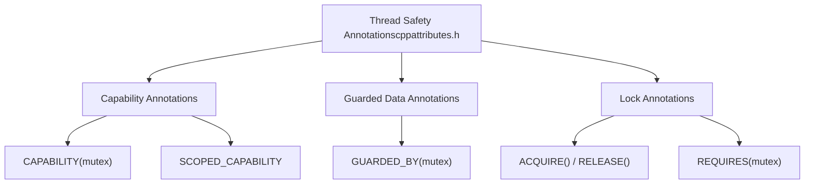
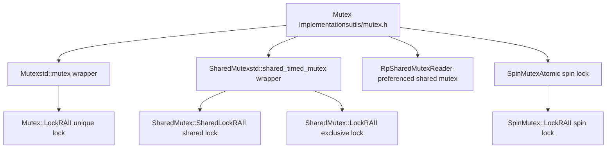
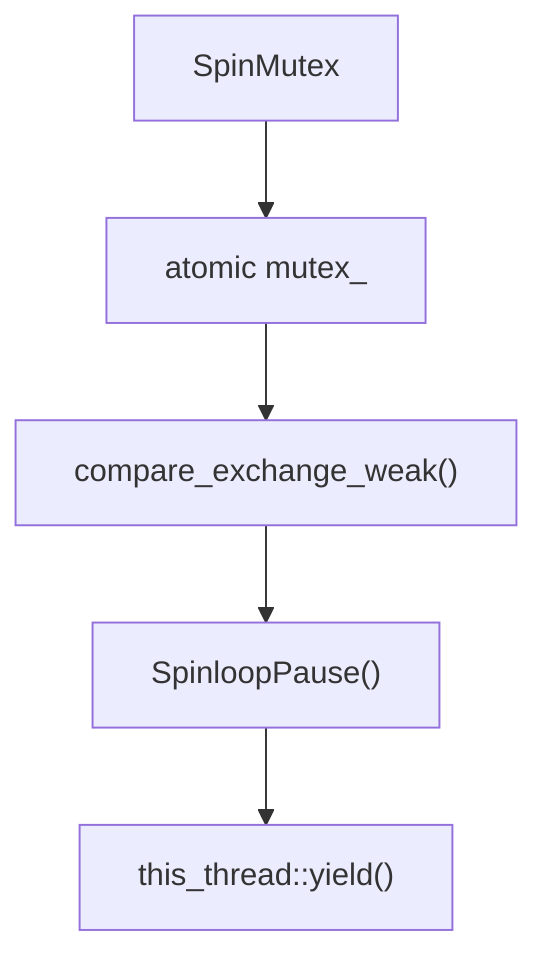
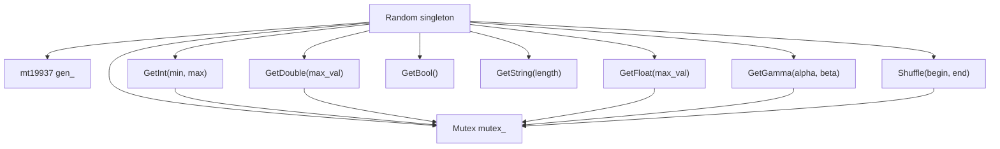
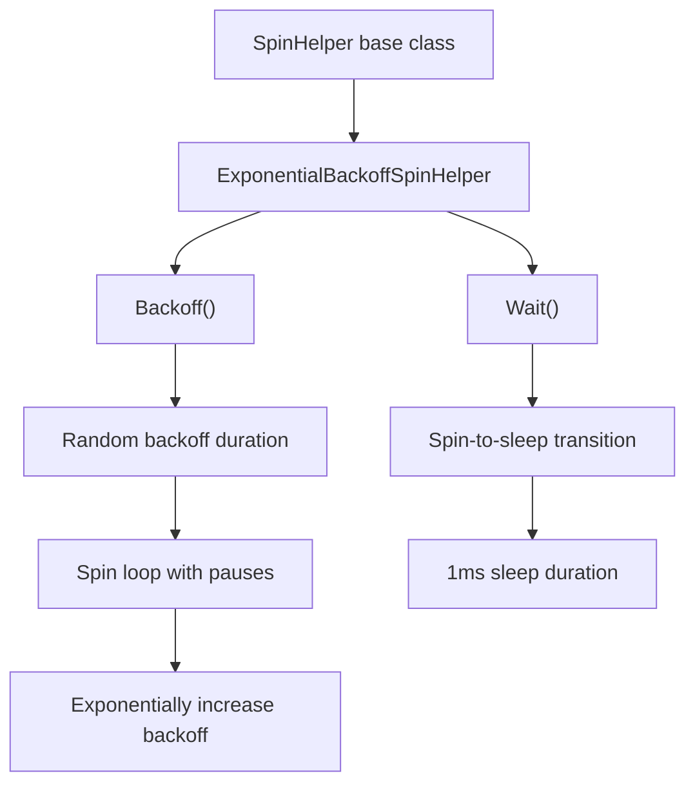
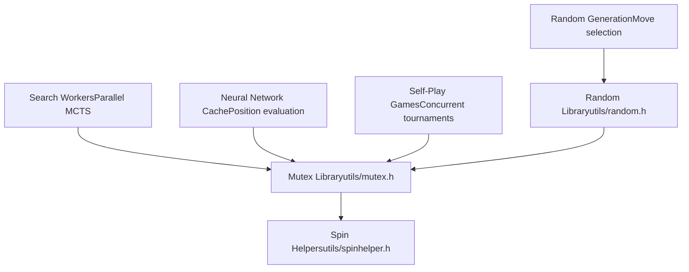

# Threading and Synchronization

Relevant source files

-   [src/chess/pgn.h](https://github.com/LeelaChessZero/lc0/blob/b4e98c19/src/chess/pgn.h)
-   [src/utils/cppattributes.h](https://github.com/LeelaChessZero/lc0/blob/b4e98c19/src/utils/cppattributes.h)
-   [src/utils/mutex.h](https://github.com/LeelaChessZero/lc0/blob/b4e98c19/src/utils/mutex.h)
-   [src/utils/random.cc](https://github.com/LeelaChessZero/lc0/blob/b4e98c19/src/utils/random.cc)
-   [src/utils/random.h](https://github.com/LeelaChessZero/lc0/blob/b4e98c19/src/utils/random.h)
-   [src/utils/spinhelper.h](https://github.com/LeelaChessZero/lc0/blob/b4e98c19/src/utils/spinhelper.h)

This document covers the threading and synchronization infrastructure used throughout the Leela Chess Zero (lc0) codebase. The system implements various concurrency mechanisms to support parallel search workers, thread-safe neural network evaluation caching, and concurrent self-play game execution.

For information about the search algorithm's parallelization strategy, see [MCTS Implementation](/LeelaChessZero/lc0/5.1-mcts-implementation). For details about neural network backend thread safety, see [Memory Caching and Performance](/LeelaChessZero/lc0/6.6-memory-caching-and-performance).

## Thread Safety Annotations

The codebase uses Clang's thread safety analysis system to statically verify correct mutex usage and prevent common concurrency bugs.

**Sources:** [src/utils/cppattributes.h30-61](https://github.com/LeelaChessZero/lc0/blob/b4e98c19/src/utils/cppattributes.h#L30-L61)

The annotation system includes:

| Annotation | Purpose | Usage |
| --- | --- | --- |
| `CAPABILITY("mutex")` | Marks classes as mutex types | Applied to `Mutex`, `SharedMutex`, `SpinMutex` |
| `SCOPED_CAPABILITY` | Marks RAII lock wrapper classes | Applied to lock guard classes |
| `GUARDED_BY(x)` | Indicates data protected by mutex `x` | Applied to member variables |
| `ACQUIRE()` / `RELEASE()` | Marks lock acquisition/release functions | Applied to `lock()` and `unlock()` methods |
| `REQUIRES(...)` | Requires caller to hold specified locks | Applied to functions needing protected access |

## Core Mutex Implementations

The system provides several mutex implementations optimized for different use cases, all with thread safety annotations for static analysis.

**Sources:** [src/utils/mutex.h72-171](https://github.com/LeelaChessZero/lc0/blob/b4e98c19/src/utils/mutex.h#L72-L171)

### Standard Mutex Wrapper

The `Mutex` class wraps `std::mutex` with thread safety annotations:

-   **Purpose**: Basic exclusive locking for protecting shared data
-   **Implementation**: [src/utils/mutex.h72-91](https://github.com/LeelaChessZero/lc0/blob/b4e98c19/src/utils/mutex.h#L72-L91)
-   **Lock Guard**: `Mutex::Lock` provides RAII-style locking
-   **Usage**: General-purpose synchronization throughout the codebase

### Reader-Writer Shared Mutex

The `SharedMutex` class enables multiple concurrent readers or single exclusive writer:

-   **Implementation**: [src/utils/mutex.h94-125](https://github.com/LeelaChessZero/lc0/blob/b4e98c19/src/utils/mutex.h#L94-L125)
-   **Shared Access**: `SharedLock` allows concurrent read access
-   **Exclusive Access**: `Lock` provides exclusive write access
-   **Backend**: Uses `std::shared_timed_mutex` for the underlying implementation

### Reader-Preferenced Shared Mutex

The `RpSharedMutex` implements a custom reader-preferenced policy to prevent writer starvation of readers:

-   **Algorithm**: [src/utils/mutex.h45-69](https://github.com/LeelaChessZero/lc0/blob/b4e98c19/src/utils/mutex.h#L45-L69)
-   **Reader Priority**: Exclusive locks wait for all waiting readers to complete
-   **Implementation**: Tracks `waiting_readers_` count atomically
-   **Use Case**: Scenarios where read operations significantly outnumber writes

### Spin Lock Implementation

The `SpinMutex` provides a lightweight alternative for short critical sections:

**Sources:** [src/utils/mutex.h138-171](https://github.com/LeelaChessZero/lc0/blob/b4e98c19/src/utils/mutex.h#L138-L171)

Key characteristics:

-   **Atomic Operations**: Uses `compare_exchange_weak` with acquire-release semantics
-   **Backoff Strategy**: Includes CPU pause instructions and periodic thread yielding
-   **Performance**: Optimized for scenarios with low contention and short hold times
-   **CPU Efficiency**: Calls `std::this_thread::yield()` every 512 failed attempts

## Platform-Specific Optimizations

The system includes platform-specific CPU pause instructions for efficient busy-waiting:

**Sources:** [src/utils/mutex.h127-135](https://github.com/LeelaChessZero/lc0/blob/b4e98c19/src/utils/mutex.h#L127-L135)

The `SpinloopPause()` function provides architecture-specific hints to the CPU during spin-wait loops:

-   **x86/x64**: Uses `_mm_pause()` intrinsic to reduce power consumption
-   **MSVC**: Inline assembly no-op to prevent optimization
-   **Generic**: Compiler barrier to ensure proper memory ordering

## Thread-Safe Random Number Generation

The `Random` class provides thread-safe access to pseudorandom number generation across the application:

**Sources:** [src/utils/random.h37-61](https://github.com/LeelaChessZero/lc0/blob/b4e98c19/src/utils/random.h#L37-L61) [src/utils/random.cc33-73](https://github.com/LeelaChessZero/lc0/blob/b4e98c19/src/utils/random.cc#L33-L73)

### Singleton Pattern Implementation

The `Random` class uses the Meyer's singleton pattern for thread-safe initialization:

-   **Initialization**: [src/utils/random.cc35-38](https://github.com/LeelaChessZero/lc0/blob/b4e98c19/src/utils/random.cc#L35-L38) - Static local variable ensures thread-safe construction
-   **Seed Source**: Uses `std::random_device` for non-deterministic seeding
-   **Generator**: Mersenne Twister (`std::mt19937`) for high-quality pseudorandom sequences

### Synchronized Access Methods

All random generation methods acquire the internal mutex before accessing the generator:

| Method | Distribution | Thread Safety |
| --- | --- | --- |
| `GetInt(min, max)` | `uniform_int_distribution` | `Mutex::Lock` |
| `GetDouble(max_val)` | `uniform_real_distribution<double>` | `Mutex::Lock` |
| `GetFloat(max_val)` | `uniform_real_distribution<float>` | `Mutex::Lock` |
| `GetGamma(alpha, beta)` | `gamma_distribution` | `Mutex::Lock` |
| `Shuffle(begin, end)` | `std::shuffle` | `Mutex::Lock` |

## Exponential Backoff Strategies

The `SpinHelper` system provides sophisticated backoff mechanisms for reducing CPU contention during busy-wait scenarios:

**Sources:** [src/utils/spinhelper.h44-80](https://github.com/LeelaChessZero/lc0/blob/b4e98c19/src/utils/spinhelper.h#L44-L80)

### Backoff Algorithm

The `ExponentialBackoffSpinHelper` implements an adaptive backoff strategy:

1.  **Random Jitter**: Uses thread-local random generation to vary backoff duration
2.  **Exponential Growth**: Doubles `backoff_iters_` on each call, up to maximum threshold
3.  **CPU Pauses**: Executes `SpinloopPause()` for the calculated iteration count
4.  **Bounds**: Backoff iterations range from `0x20` to `0x400`

### Spin-to-Sleep Transition

The `Wait()` method implements a graduated approach to thread yielding:

-   **Spin Phase**: Up to `0x10000` iterations of `SpinloopPause()`
-   **Sleep Phase**: 1ms sleep duration using `std::this_thread::sleep_for()`
-   **Cycle Reset**: Returns to spinning after each sleep period

## Usage Patterns and Integration

The threading utilities integrate throughout the lc0 architecture to provide safe concurrent access:

**Sources:** Based on high-level architecture analysis and threading utility implementations

### Common Integration Points

-   **Search Tree Access**: Multiple worker threads coordinate access to shared MCTS nodes
-   **Cache Management**: Neural network evaluation results cached with thread-safe access patterns
-   **Tournament Management**: Self-play games execute concurrently with synchronized result collection
-   **Configuration Access**: Thread-safe access to global configuration and options
-   **Logging Systems**: Coordinated output from multiple concurrent threads

The threading and synchronization system provides the foundation for lc0's highly parallel architecture, enabling efficient utilization of multi-core systems while maintaining data consistency and preventing race conditions.
