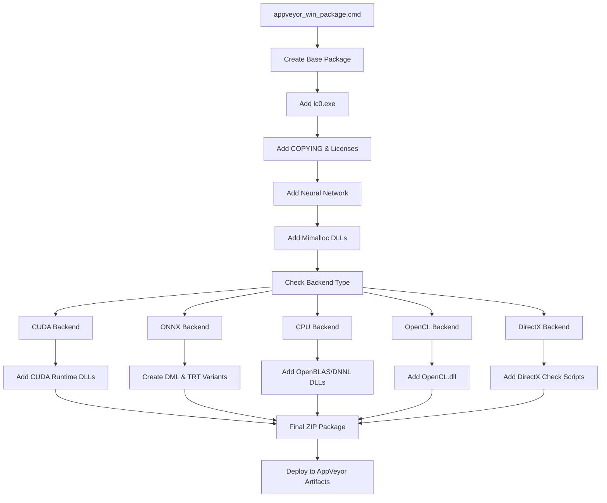
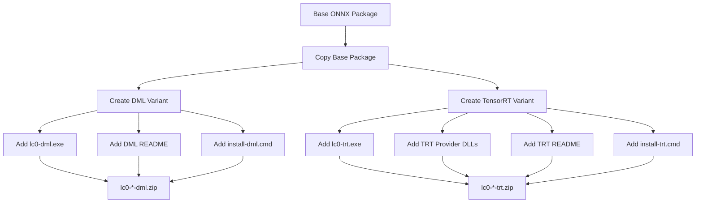
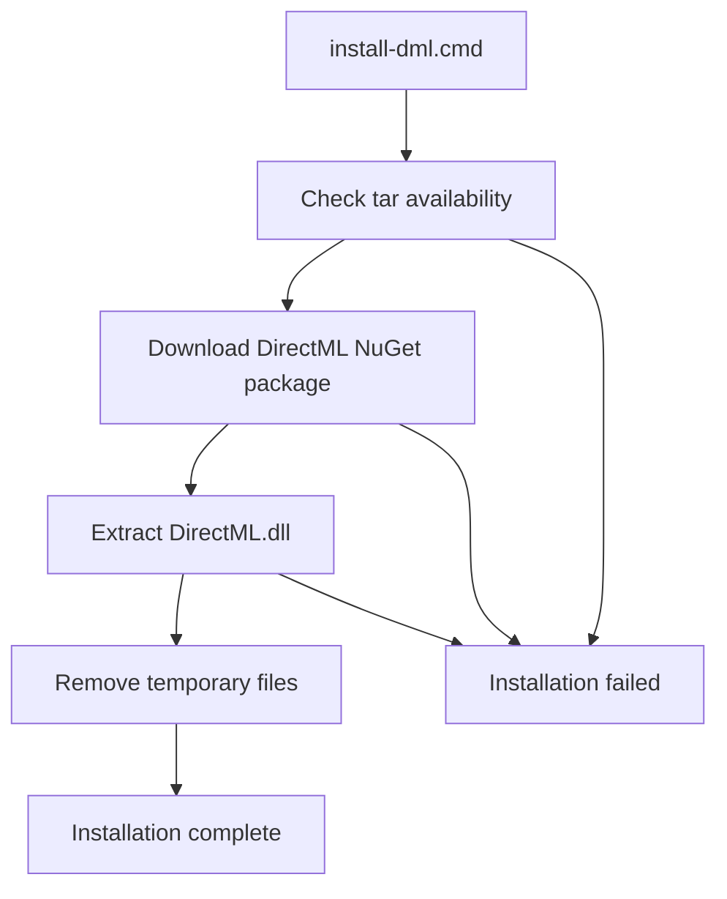

# Windows Build and Packaging

Relevant source files

-   [dist/README-onnx-dml.txt](https://github.com/LeelaChessZero/lc0/blob/b4e98c19/dist/README-onnx-dml.txt)
-   [dist/README-onnx-trt.txt](https://github.com/LeelaChessZero/lc0/blob/b4e98c19/dist/README-onnx-trt.txt)
-   [dist/install-cuda\_12\_9.cmd](https://github.com/LeelaChessZero/lc0/blob/b4e98c19/dist/install-cuda_12_9.cmd)
-   [dist/install-dml.cmd](https://github.com/LeelaChessZero/lc0/blob/b4e98c19/dist/install-dml.cmd)
-   [dist/install-trt.cmd](https://github.com/LeelaChessZero/lc0/blob/b4e98c19/dist/install-trt.cmd)
-   [scripts/appveyor\_win\_package.cmd](https://github.com/LeelaChessZero/lc0/blob/b4e98c19/scripts/appveyor_win_package.cmd)

This document covers the Windows-specific build and packaging infrastructure for Lc0, implemented through AppVeyor continuous integration. It details the automated packaging scripts, distribution artifact creation, and dependency management for various neural network backends on Windows platforms.

For general build system architecture and cross-platform build configuration, see [Build System Architecture](/LeelaChessZero/lc0/2.1-build-system-architecture). For Linux and macOS build processes, see [Linux and macOS Build Process](/LeelaChessZero/lc0/2.2-linux-and-macos-build-process).

## Overview

The Windows build and packaging system creates distribution-ready ZIP archives containing the Lc0 executable, required dependencies, license files, and installation scripts. The system supports multiple neural network backends including CUDA, ONNX, DirectML, OpenCL, and CPU-only variants, each with specific dependency requirements and packaging logic.

## AppVeyor Packaging Workflow

The main packaging process is controlled by the `appveyor_win_package.cmd` script, which creates backend-specific distribution packages based on environment variables set during the AppVeyor build process.

**Packaging Workflow**

Sources: [scripts/appveyor\_win\_package.cmd1-72](https://github.com/LeelaChessZero/lc0/blob/b4e98c19/scripts/appveyor_win_package.cmd#L1-L72)

## Backend-Specific Packaging Logic

The packaging script implements conditional logic for different neural network backends, each requiring specific runtime dependencies and configuration files.

### CUDA Backend Packaging

CUDA builds include multiple CUDA runtime versions and create both regular and "nodll" variants:

| CUDA Version | Runtime DLLs | Build Variants |
| --- | --- | --- |
| CUDA 10 | `cudart64_101.dll`, `cublas64_10.dll`, `cublasLt64_10.dll` | Standard |
| CUDA 11 | `cudart64_110.dll`, `cublas64_11.dll`, `cublasLt64_11.dll` | Standard |
| CUDA 12 | `cudart64_12.dll`, `cublas64_12.dll`, `cublasLt64_12.dll` | Standard + No-DLL |

Sources: [scripts/appveyor\_win\_package.cmd18-25](https://github.com/LeelaChessZero/lc0/blob/b4e98c19/scripts/appveyor_win_package.cmd#L18-L25)

### ONNX Backend Variants

ONNX builds create three distinct packages with different execution providers:

**ONNX Package Creation**

Sources: [scripts/appveyor\_win\_package.cmd38-61](https://github.com/LeelaChessZero/lc0/blob/b4e98c19/scripts/appveyor_win_package.cmd#L38-L61)

### CPU Backend Dependencies

CPU-only builds include optimized math libraries:

-   **OpenBLAS**: Includes `libopenblas.dll` from cached OpenBLAS installation
-   **DNNL/OneDNN**: Includes `dnnl.dll` plus license files (`DNNL-LICENSE`, `DNNL-THIRD-PARTY-PROGRAMS`)

Sources: [scripts/appveyor\_win\_package.cmd14-37](https://github.com/LeelaChessZero/lc0/blob/b4e98c19/scripts/appveyor_win_package.cmd#L14-L37)

## Distribution Artifacts

Each build configuration produces specific artifacts with standardized naming conventions and contents.

### Package Naming Convention

All packages follow the pattern: `lc0-{VERSION}-windows-{BACKEND_NAME}.zip`

Where `{BACKEND_NAME}` includes:

-   `gpu-nvidia-cuda12`
-   `cpu-openblas`
-   `cpu-dnnl`
-   `onednn`
-   `gpu-dx12` (renamed to `windows10-gpu-dx12`)

### Standard Package Contents

Every package includes these core components:

| Component | Source | Purpose |
| --- | --- | --- |
| `lc0.exe` | Build output | Main executable |
| `COPYING` | Repository root | GPL license |
| `*.pb.gz` | Downloaded network | Neural network weights |
| `mimalloc-*.dll` | Mimalloc build | Memory allocator |
| `mimalloc-readme.md` | Mimalloc docs | Memory allocator documentation |

Sources: [scripts/appveyor\_win\_package.cmd1-12](https://github.com/LeelaChessZero/lc0/blob/b4e98c19/scripts/appveyor_win_package.cmd#L1-L12)

## Installation Scripts

The distribution includes automated installation scripts for downloading runtime dependencies that cannot be redistributed directly.

### DirectML Installation

The DirectML installation script downloads and extracts the required DirectML runtime:

**DirectML Installation Flow**

The script downloads from `https://globalcdn.nuget.org/packages/microsoft.ai.directml.1.15.4.nupkg` and extracts `bin/x64-win/DirectML.dll`.

Sources: [dist/install-dml.cmd1-25](https://github.com/LeelaChessZero/lc0/blob/b4e98c19/dist/install-dml.cmd#L1-L25)

### CUDA Installation Scripts

CUDA installation scripts handle multiple CUDA component downloads:

-   **CUDA 12.9**: Downloads `cudart`, `cublas`, and `cublasLt` from NVIDIA redistributables
-   **TensorRT**: Downloads CUDA/cuDNN dependencies and directs users to TensorRT download page

The TensorRT installer downloads these components automatically:

-   CUDA runtime libraries (`cudart64_12.dll`, `cublas64_12.dll`, `cublasLt64_12.dll`, `cufft64_11.dll`)
-   cuDNN libraries (`cudnn64_9.dll`, `cudnn_graph64_9.dll`)

Sources: [dist/install-cuda\_12\_9.cmd1-44](https://github.com/LeelaChessZero/lc0/blob/b4e98c19/dist/install-cuda_12_9.cmd#L1-L44) [dist/install-trt.cmd1-89](https://github.com/LeelaChessZero/lc0/blob/b4e98c19/dist/install-trt.cmd#L1-L89)

## Backend Configuration Files

Distribution packages include backend-specific documentation and configuration:

### TensorRT Documentation

TensorRT packages include comprehensive setup instructions in `README-onnx-trt.txt`, covering:

-   Required DLL dependencies (CUDA, cuDNN, TensorRT)
-   Manual download URLs for all components
-   TensorRT cache management (`trt_cache` folder)
-   Performance optimization notes

Sources: [dist/README-onnx-trt.txt1-89](https://github.com/LeelaChessZero/lc0/blob/b4e98c19/dist/README-onnx-trt.txt#L1-L89)

### DirectML Documentation

DirectML packages include simplified setup instructions in `README-onnx-dml.txt` focusing on the DirectML runtime requirement and automated installation process.

Sources: [dist/README-onnx-dml.txt1-39](https://github.com/LeelaChessZero/lc0/blob/b4e98c19/dist/README-onnx-dml.txt#L1-L39)
