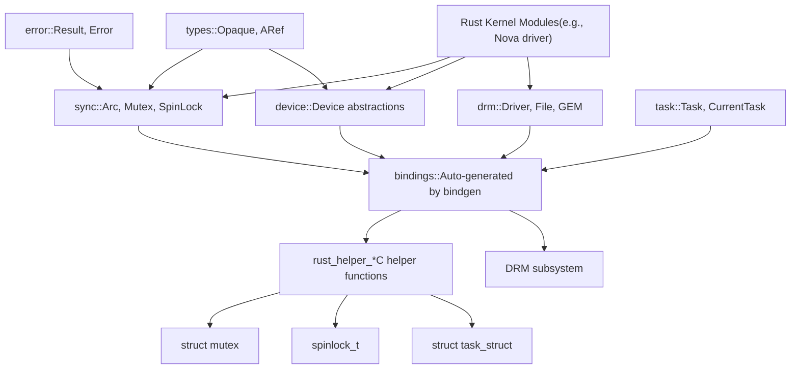
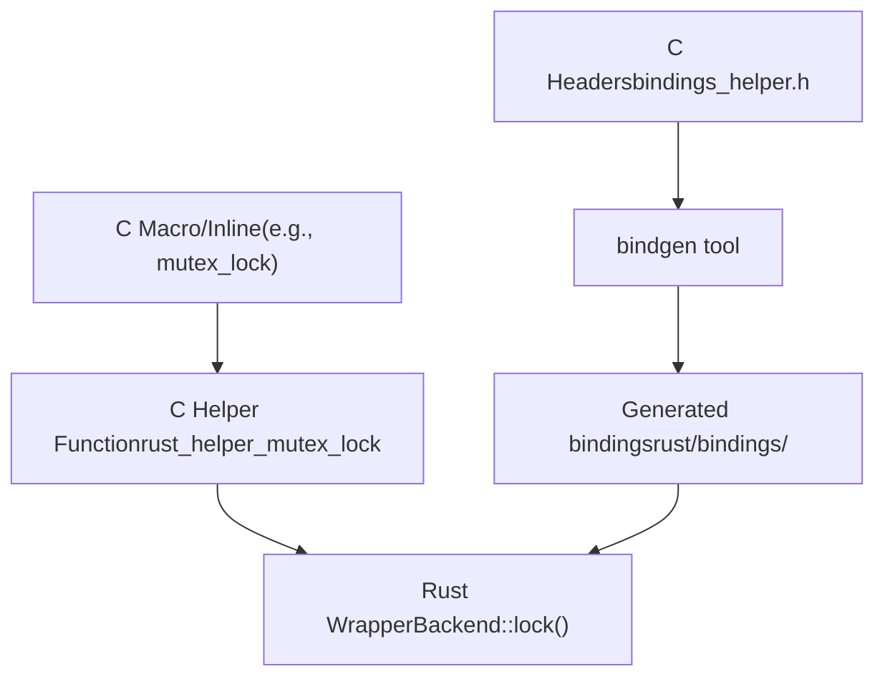
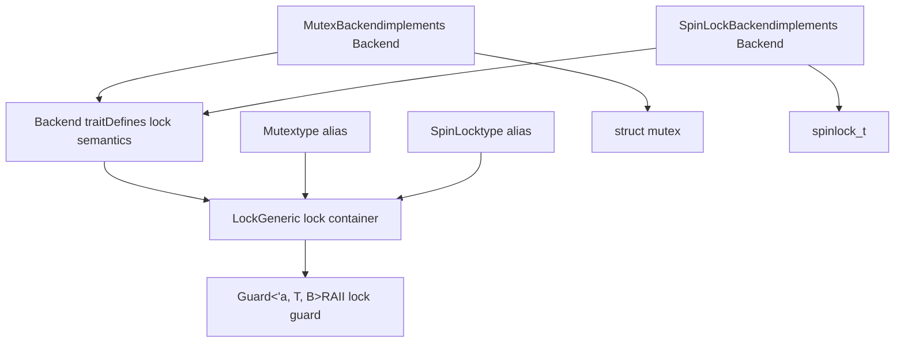
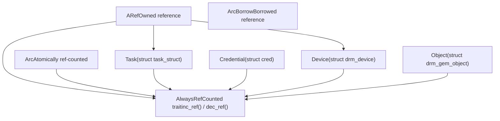
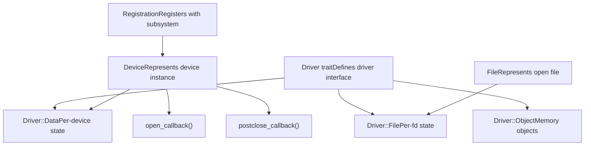
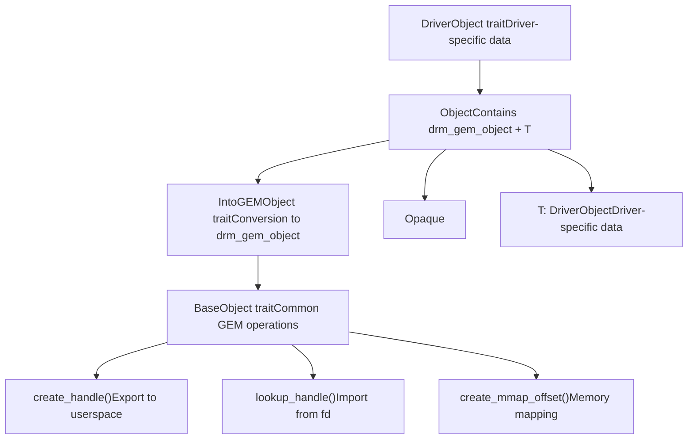

# Rust Kernel APIs and Abstractions

Relevant source files

-   [MAINTAINERS](https://github.com/torvalds/linux/blob/fcb70a56/MAINTAINERS)
-   [drivers/gpu/drm/drm\_panic\_qr.rs](https://github.com/torvalds/linux/blob/fcb70a56/drivers/gpu/drm/drm_panic_qr.rs)
-   [drivers/gpu/drm/nova/Kconfig](https://github.com/torvalds/linux/blob/fcb70a56/drivers/gpu/drm/nova/Kconfig)
-   [drivers/gpu/drm/nova/Makefile](https://github.com/torvalds/linux/blob/fcb70a56/drivers/gpu/drm/nova/Makefile)
-   [drivers/gpu/drm/nova/driver.rs](https://github.com/torvalds/linux/blob/fcb70a56/drivers/gpu/drm/nova/driver.rs)
-   [drivers/gpu/drm/nova/file.rs](https://github.com/torvalds/linux/blob/fcb70a56/drivers/gpu/drm/nova/file.rs)
-   [drivers/gpu/drm/nova/gem.rs](https://github.com/torvalds/linux/blob/fcb70a56/drivers/gpu/drm/nova/gem.rs)
-   [drivers/gpu/drm/nova/nova.rs](https://github.com/torvalds/linux/blob/fcb70a56/drivers/gpu/drm/nova/nova.rs)
-   [include/linux/rwlock\_rt.h](https://github.com/torvalds/linux/blob/fcb70a56/include/linux/rwlock_rt.h)
-   [include/linux/spinlock\_rt.h](https://github.com/torvalds/linux/blob/fcb70a56/include/linux/spinlock_rt.h)
-   [include/uapi/drm/nova\_drm.h](https://github.com/torvalds/linux/blob/fcb70a56/include/uapi/drm/nova_drm.h)
-   [rust/bindings/bindings\_helper.h](https://github.com/torvalds/linux/blob/fcb70a56/rust/bindings/bindings_helper.h)
-   [rust/helpers/barrier.c](https://github.com/torvalds/linux/blob/fcb70a56/rust/helpers/barrier.c)
-   [rust/helpers/bitmap.c](https://github.com/torvalds/linux/blob/fcb70a56/rust/helpers/bitmap.c)
-   [rust/helpers/bitops.c](https://github.com/torvalds/linux/blob/fcb70a56/rust/helpers/bitops.c)
-   [rust/helpers/drm.c](https://github.com/torvalds/linux/blob/fcb70a56/rust/helpers/drm.c)
-   [rust/helpers/helpers.c](https://github.com/torvalds/linux/blob/fcb70a56/rust/helpers/helpers.c)
-   [rust/helpers/mutex.c](https://github.com/torvalds/linux/blob/fcb70a56/rust/helpers/mutex.c)
-   [rust/helpers/pid\_namespace.c](https://github.com/torvalds/linux/blob/fcb70a56/rust/helpers/pid_namespace.c)
-   [rust/helpers/poll.c](https://github.com/torvalds/linux/blob/fcb70a56/rust/helpers/poll.c)
-   [rust/helpers/security.c](https://github.com/torvalds/linux/blob/fcb70a56/rust/helpers/security.c)
-   [rust/helpers/spinlock.c](https://github.com/torvalds/linux/blob/fcb70a56/rust/helpers/spinlock.c)
-   [rust/helpers/sync.c](https://github.com/torvalds/linux/blob/fcb70a56/rust/helpers/sync.c)
-   [rust/helpers/task.c](https://github.com/torvalds/linux/blob/fcb70a56/rust/helpers/task.c)
-   [rust/kernel/block/mq/tag\_set.rs](https://github.com/torvalds/linux/blob/fcb70a56/rust/kernel/block/mq/tag_set.rs)
-   [rust/kernel/cred.rs](https://github.com/torvalds/linux/blob/fcb70a56/rust/kernel/cred.rs)
-   [rust/kernel/drm/device.rs](https://github.com/torvalds/linux/blob/fcb70a56/rust/kernel/drm/device.rs)
-   [rust/kernel/drm/driver.rs](https://github.com/torvalds/linux/blob/fcb70a56/rust/kernel/drm/driver.rs)
-   [rust/kernel/drm/file.rs](https://github.com/torvalds/linux/blob/fcb70a56/rust/kernel/drm/file.rs)
-   [rust/kernel/drm/gem/mod.rs](https://github.com/torvalds/linux/blob/fcb70a56/rust/kernel/drm/gem/mod.rs)
-   [rust/kernel/drm/mod.rs](https://github.com/torvalds/linux/blob/fcb70a56/rust/kernel/drm/mod.rs)
-   [rust/kernel/lib.rs](https://github.com/torvalds/linux/blob/fcb70a56/rust/kernel/lib.rs)
-   [rust/kernel/pid\_namespace.rs](https://github.com/torvalds/linux/blob/fcb70a56/rust/kernel/pid_namespace.rs)
-   [rust/kernel/security.rs](https://github.com/torvalds/linux/blob/fcb70a56/rust/kernel/security.rs)
-   [rust/kernel/sync.rs](https://github.com/torvalds/linux/blob/fcb70a56/rust/kernel/sync.rs)
-   [rust/kernel/sync/barrier.rs](https://github.com/torvalds/linux/blob/fcb70a56/rust/kernel/sync/barrier.rs)
-   [rust/kernel/sync/condvar.rs](https://github.com/torvalds/linux/blob/fcb70a56/rust/kernel/sync/condvar.rs)
-   [rust/kernel/sync/lock.rs](https://github.com/torvalds/linux/blob/fcb70a56/rust/kernel/sync/lock.rs)
-   [rust/kernel/sync/lock/global.rs](https://github.com/torvalds/linux/blob/fcb70a56/rust/kernel/sync/lock/global.rs)
-   [rust/kernel/sync/lock/mutex.rs](https://github.com/torvalds/linux/blob/fcb70a56/rust/kernel/sync/lock/mutex.rs)
-   [rust/kernel/sync/lock/spinlock.rs](https://github.com/torvalds/linux/blob/fcb70a56/rust/kernel/sync/lock/spinlock.rs)
-   [rust/kernel/sync/poll.rs](https://github.com/torvalds/linux/blob/fcb70a56/rust/kernel/sync/poll.rs)
-   [rust/kernel/sync/set\_once.rs](https://github.com/torvalds/linux/blob/fcb70a56/rust/kernel/sync/set_once.rs)
-   [rust/kernel/task.rs](https://github.com/torvalds/linux/blob/fcb70a56/rust/kernel/task.rs)

## Purpose and Scope

This page provides a deep dive into the Rust kernel abstraction layer that wraps C kernel APIs with safe, idiomatic Rust interfaces. It covers synchronization primitives, memory management patterns, device driver interfaces, and the Foreign Function Interface (FFI) architecture used throughout the Rust for Linux project.

For high-level motivation and goals of Rust integration, see [Rust for Linux](/torvalds/linux/2-rust-for-linux). For a complete driver implementation example using these abstractions, see [Nova DRM Graphics Driver](/torvalds/linux/2.2-nova-drm-graphics-driver).

## Abstraction Layer Architecture

The Rust kernel abstractions form a layered architecture that provides safe interfaces to C kernel functionality while maintaining zero runtime overhead.


**Sources:** [rust/kernel/lib.rs1-369](https://github.com/torvalds/linux/blob/fcb70a56/rust/kernel/lib.rs#L1-L369) [rust/bindings/bindings\_helper.h1-152](https://github.com/torvalds/linux/blob/fcb70a56/rust/bindings/bindings_helper.h#L1-L152) [rust/helpers/helpers.c1-65](https://github.com/torvalds/linux/blob/fcb70a56/rust/helpers/helpers.c#L1-L65)

### Key Components

The abstraction layer consists of several key modules:

| Module | Purpose | Key Types |
| --- | --- | --- |
| `sync` | Synchronization primitives | `Arc`, `Mutex`, `SpinLock`, `CondVar` |
| `task` | Process/thread management | `Task`, `CurrentTask`, `Kuid` |
| `device` | Device model abstractions | `Device`, driver registration |
| `drm` | Graphics subsystem | `Driver`, `Device`, `File`, GEM objects |
| `types` | Core type utilities | `Opaque`, `ARef`, `ForeignOwnable` |
| `error` | Error handling | `Result`, `Error`, error codes |

**Sources:** [rust/kernel/lib.rs67-156](https://github.com/torvalds/linux/blob/fcb70a56/rust/kernel/lib.rs#L67-L156)

## FFI Architecture and Binding Generation

Rust kernel code interacts with C code through a carefully designed FFI layer that uses `bindgen` for automatic binding generation and manual helper functions for non-trivial C constructs.


**Sources:** [rust/bindings/bindings\_helper.h1-152](https://github.com/torvalds/linux/blob/fcb70a56/rust/bindings/bindings_helper.h#L1-L152) [rust/helpers/helpers.c1-65](https://github.com/torvalds/linux/blob/fcb70a56/rust/helpers/helpers.c#L1-L65)

### Opaque Type Pattern

C structures are wrapped using the `Opaque<T>` type, which provides a safe interface to opaque C data:

-   `Opaque<T>` represents a C struct without exposing its internal layout
-   Provides `get()` method returning `*mut T` for FFI calls
-   Ensures proper alignment and size
-   Used throughout the kernel for structures like `bindings::mutex`, `bindings::spinlock_t`, `bindings::drm_device`

**Example Usage:** [rust/kernel/sync/lock.rs108-109](https://github.com/torvalds/linux/blob/fcb70a56/rust/kernel/sync/lock.rs#L108-L109) shows `Opaque<B::State>` for lock state

**Sources:** [rust/kernel/types.rs](https://github.com/torvalds/linux/blob/fcb70a56/rust/kernel/types.rs) (referenced), [rust/kernel/sync/lock.rs106-120](https://github.com/torvalds/linux/blob/fcb70a56/rust/kernel/sync/lock.rs#L106-L120)

### Helper Function Convention

Complex C macros and inline functions are wrapped as helper functions with the `rust_helper_*` prefix:

| C Construct | Helper Function | Location |
| --- | --- | --- |
| `mutex_lock()` | `rust_helper_mutex_lock()` | [rust/helpers/mutex.c5-8](https://github.com/torvalds/linux/blob/fcb70a56/rust/helpers/mutex.c#L5-L8) |
| `spin_lock()` | `rust_helper_spin_lock()` | [rust/helpers/spinlock.c19-22](https://github.com/torvalds/linux/blob/fcb70a56/rust/helpers/spinlock.c#L19-L22) |
| `__set_bit()` | `rust_helper___set_bit()` | [rust/helpers/bitops.c6-9](https://github.com/torvalds/linux/blob/fcb70a56/rust/helpers/bitops.c#L6-L9) |
| `get_task_struct()` | `rust_helper_get_task_struct()` | [rust/helpers/task.c16-19](https://github.com/torvalds/linux/blob/fcb70a56/rust/helpers/task.c#L16-L19) |

**Sources:** [rust/helpers/mutex.c1-30](https://github.com/torvalds/linux/blob/fcb70a56/rust/helpers/mutex.c#L1-L30) [rust/helpers/spinlock.c1-38](https://github.com/torvalds/linux/blob/fcb70a56/rust/helpers/spinlock.c#L1-L38) [rust/helpers/task.c1-63](https://github.com/torvalds/linux/blob/fcb70a56/rust/helpers/task.c#L1-L63)

## Synchronization Primitives

The `sync` module provides safe wrappers around kernel synchronization primitives with compile-time guarantees and runtime lock validation through lockdep integration.

### Lock Architecture


**Sources:** [rust/kernel/sync.rs1-126](https://github.com/torvalds/linux/blob/fcb70a56/rust/kernel/sync.rs#L1-L126) [rust/kernel/sync/lock.rs1-318](https://github.com/torvalds/linux/blob/fcb70a56/rust/kernel/sync/lock.rs#L1-L318)

### Backend Trait

The `Backend` trait abstracts lock behavior, enabling generic lock code:

```
pub unsafe trait Backend {
    type State;           // C lock structure (e.g., bindings::mutex)
    type GuardState;      // State maintained while locked

    unsafe fn init(...);   // Initialize the lock
    unsafe fn lock(...) -> Self::GuardState;
    unsafe fn unlock(...);
}
```
**Key Methods:**

-   **`init()`**: Initializes C lock structure with name and lockdep key
-   **`lock()`**: Acquires the lock, returns guard state
-   **`unlock()`**: Releases the lock
-   **`try_lock()`**: Attempts non-blocking acquisition
-   **`relock()`**: Reacquires after temporary release (for condition variables)

**Sources:** [rust/kernel/sync/lock.rs22-98](https://github.com/torvalds/linux/blob/fcb70a56/rust/kernel/sync/lock.rs#L22-L98)

### Mutex Implementation

Mutexes use `struct mutex` from the C kernel:

| Property | Value |
| --- | --- |
| Backend type | `MutexBackend` |
| State | `bindings::mutex` |
| GuardState | `()` |
| Can sleep | Yes |
| Context | Non-atomic only |

**Initialization:** [rust/kernel/sync/lock/mutex.rs101-126](https://github.com/torvalds/linux/blob/fcb70a56/rust/kernel/sync/lock/mutex.rs#L101-L126) - Uses `__mutex_init()` with lockdep key

**Locking:** [rust/helpers/mutex.c5-13](https://github.com/torvalds/linux/blob/fcb70a56/rust/helpers/mutex.c#L5-L13) - Wraps `mutex_lock()` and `mutex_trylock()`

**Sources:** [rust/kernel/sync/lock/mutex.rs1-174](https://github.com/torvalds/linux/blob/fcb70a56/rust/kernel/sync/lock/mutex.rs#L1-L174) [rust/helpers/mutex.c1-30](https://github.com/torvalds/linux/blob/fcb70a56/rust/helpers/mutex.c#L1-L30)

### SpinLock Implementation

Spinlocks use `spinlock_t` for atomic context:

| Property | Value |
| --- | --- |
| Backend type | `SpinLockBackend` |
| State | `bindings::spinlock_t` |
| GuardState | `()` |
| Can sleep | No |
| Context | Any (atomic-safe) |

**Initialization:** [rust/kernel/sync/lock/spinlock.rs104-113](https://github.com/torvalds/linux/blob/fcb70a56/rust/kernel/sync/lock/spinlock.rs#L104-L113) - Uses `__spin_lock_init()` with lockdep

**Locking:** [rust/helpers/spinlock.c19-32](https://github.com/torvalds/linux/blob/fcb70a56/rust/helpers/spinlock.c#L19-L32) - Wraps `spin_lock()`, `spin_unlock()`, `spin_trylock()`

**Sources:** [rust/kernel/sync/lock/spinlock.rs1-135](https://github.com/torvalds/linux/blob/fcb70a56/rust/kernel/sync/lock/spinlock.rs#L1-L135) [rust/helpers/spinlock.c1-38](https://github.com/torvalds/linux/blob/fcb70a56/rust/helpers/spinlock.c#L1-L38)

### Lock Guard Pattern

The `Guard` type provides RAII semantics with automatic unlock on drop:

**Key Features:**

-   **Immutable access**: `Deref` trait provides `&T`
-   **Mutable access**: `DerefMut` trait provides `&mut T` when `T: Unpin`
-   **Pinned access**: `as_mut()` returns `Pin<&mut T>` for `!Unpin` types
-   **Temporary unlock**: `do_unlocked()` temporarily releases and reacquires

**Example:** [rust/kernel/sync/lock.rs238-247](https://github.com/torvalds/linux/blob/fcb70a56/rust/kernel/sync/lock.rs#L238-L247) shows `do_unlocked()` implementation

**Sources:** [rust/kernel/sync/lock.rs192-318](https://github.com/torvalds/linux/blob/fcb70a56/rust/kernel/sync/lock.rs#L192-L318)

### Lockdep Integration

All locks integrate with the kernel's lockdep system for deadlock detection:

**LockClassKey:** [rust/kernel/sync.rs35-96](https://github.com/torvalds/linux/blob/fcb70a56/rust/kernel/sync.rs#L35-L96) - Represents a lockdep class

**Static Allocation:** [rust/kernel/sync.rs98-112](https://github.com/torvalds/linux/blob/fcb70a56/rust/kernel/sync.rs#L98-L112) - `static_lock_class!()` macro for static keys

**Dynamic Allocation:** [rust/kernel/sync.rs48-82](https://github.com/torvalds/linux/blob/fcb70a56/rust/kernel/sync.rs#L48-L82) - `LockClassKey::new_dynamic()` for runtime

**Sources:** [rust/kernel/sync.rs35-126](https://github.com/torvalds/linux/blob/fcb70a56/rust/kernel/sync.rs#L35-L126)

### Condition Variables

`CondVar` wraps `struct wait_queue_head` for wait/notify patterns:

**Key Methods:**

-   `wait()`: Atomically releases lock and sleeps (uninterruptible)
-   `wait_interruptible()`: Interruptible sleep, returns if signal pending
-   `wait_interruptible_timeout()`: With timeout support
-   `notify_one()`: Wakes one waiter
-   `notify_all()`: Wakes all waiters
-   `notify_sync()`: Hint to scheduler for same-CPU wakeup

**Implementation Details:**

-   Uses `prepare_to_wait_exclusive()` / `finish_wait()` internally
-   Integrates with lock's `do_unlocked()` for atomic release/wait
-   Returns `CondVarTimeoutResult` enum with timeout/signal differentiation

**Sources:** [rust/kernel/sync/condvar.rs1-259](https://github.com/torvalds/linux/blob/fcb70a56/rust/kernel/sync/condvar.rs#L1-L259)

## Memory Management Abstractions

The kernel provides Rust abstractions for reference-counted objects with compile-time safety guarantees.

### Reference Counting Architecture


**Sources:** [rust/kernel/sync/arc.rs](https://github.com/torvalds/linux/blob/fcb70a56/rust/kernel/sync/arc.rs) (referenced), [rust/kernel/sync/aref.rs](https://github.com/torvalds/linux/blob/fcb70a56/rust/kernel/sync/aref.rs) (referenced)

### AlwaysRefCounted Trait

The `AlwaysRefCounted` trait bridges Rust ownership with C reference counting:

```
pub unsafe trait AlwaysRefCounted {
    fn inc_ref(&self);
    unsafe fn dec_ref(obj: NonNull<Self>);
}
```
**Safety Requirements:**

-   Type must always be reference-counted when accessible from Rust
-   `inc_ref()` called on valid reference increments count
-   `dec_ref()` decrements and potentially frees when count reaches zero

**Example Implementation for Task:** [rust/kernel/task.rs350-363](https://github.com/torvalds/linux/blob/fcb70a56/rust/kernel/task.rs#L350-L363)

-   `inc_ref()` calls `get_task_struct()`
-   `dec_ref()` calls `put_task_struct()`

**Sources:** [rust/kernel/types.rs](https://github.com/torvalds/linux/blob/fcb70a56/rust/kernel/types.rs) (trait definition referenced), [rust/kernel/task.rs350-363](https://github.com/torvalds/linux/blob/fcb70a56/rust/kernel/task.rs#L350-L363) [rust/kernel/cred.rs78-92](https://github.com/torvalds/linux/blob/fcb70a56/rust/kernel/cred.rs#L78-L92)

### ARef Smart Pointer

`ARef<T>` represents owned reference to a refcounted object:

**Ownership Semantics:**

-   Holds one reference count
-   Dropping decrements reference count
-   Can be cloned to increment reference count
-   Converts from/to raw pointers for FFI boundaries

**Example Usage:** [rust/kernel/drm/gem/mod.rs148-151](https://github.com/torvalds/linux/blob/fcb70a56/rust/kernel/drm/gem/mod.rs#L148-L151) creates `ARef` from `drm_gem_object_lookup()`

**Sources:** [rust/kernel/sync/aref.rs](https://github.com/torvalds/linux/blob/fcb70a56/rust/kernel/sync/aref.rs) (referenced in code)

### Arc for Allocation

`Arc<T>` provides atomic reference counting for kernel-allocated objects:

**Features:**

-   Allocates with kernel allocator (GFP flags)
-   Interior mutability through locks
-   Thread-safe reference counting
-   `UniqueArc` for exclusive ownership before sharing

**Sources:** [rust/kernel/sync/arc.rs](https://github.com/torvalds/linux/blob/fcb70a56/rust/kernel/sync/arc.rs) (referenced)

## Device Driver Framework

The kernel provides generic abstractions for device drivers, with specialized support for subsystems like DRM.

### Driver Trait Pattern


**Sources:** [rust/kernel/drm/driver.rs1-171](https://github.com/torvalds/linux/blob/fcb70a56/rust/kernel/drm/driver.rs#L1-L171) [rust/kernel/drm/device.rs1-230](https://github.com/torvalds/linux/blob/fcb70a56/rust/kernel/drm/device.rs#L1-L230)

### DRM Driver Trait

The `drm::Driver` trait defines the interface for DRM drivers:

**Associated Types:**

-   `Data`: Driver-specific device data (e.g., hardware state)
-   `Object`: Memory manager implementation (GEM objects)
-   `File`: Per-file-descriptor state

**Constants:**

-   `INFO`: Driver metadata (name, description, version)
-   `IOCTLS`: IOCTL definitions for userspace API

**Example:** [drivers/gpu/drm/nova/driver.rs11-68](https://github.com/torvalds/linux/blob/fcb70a56/drivers/gpu/drm/nova/driver.rs#L11-L68) shows Nova driver implementation

**Sources:** [rust/kernel/drm/driver.rs96-116](https://github.com/torvalds/linux/blob/fcb70a56/rust/kernel/drm/driver.rs#L96-L116)

### Device Representation

`drm::Device<T: Driver>` represents a DRM device instance:

**Structure:**

-   Wraps `Opaque<bindings::drm_device>`
-   Contains `T::Data` for driver state
-   Always reference-counted via `AlwaysRefCounted`

**Creation:** [rust/kernel/drm/device.rs98-136](https://github.com/torvalds/linux/blob/fcb70a56/rust/kernel/drm/device.rs#L98-L136)

-   Allocates via `__drm_dev_alloc()`
-   Pin-initializes driver data
-   Returns `ARef<Device<T>>`

**VTABLE:** [rust/kernel/drm/device.rs64-93](https://github.com/torvalds/linux/blob/fcb70a56/rust/kernel/drm/device.rs#L64-L93) - Populates `drm_driver` with callbacks

**Sources:** [rust/kernel/drm/device.rs50-230](https://github.com/torvalds/linux/blob/fcb70a56/rust/kernel/drm/device.rs#L50-L230)

### File Operations

DRM file operations are exposed through the `drm::file::DriverFile` trait:

**Lifecycle:**

-   `open()`: Called when device file opened
-   `postclose()`: Called on file close

**Callbacks:** [rust/kernel/drm/file.rs47-97](https://github.com/torvalds/linux/blob/fcb70a56/rust/kernel/drm/file.rs#L47-L97) implement FFI callbacks routing to trait methods

**Example Implementation:** [drivers/gpu/drm/nova/file.rs13-21](https://github.com/torvalds/linux/blob/fcb70a56/drivers/gpu/drm/nova/file.rs#L13-L21) shows simple file state

**Sources:** [rust/kernel/drm/file.rs1-121](https://github.com/torvalds/linux/blob/fcb70a56/rust/kernel/drm/file.rs#L1-L121) [drivers/gpu/drm/nova/file.rs1-70](https://github.com/torvalds/linux/blob/fcb70a56/drivers/gpu/drm/nova/file.rs#L1-L70)

### GEM Object Abstraction

DRM Graphics Execution Manager (GEM) objects represent GPU memory:


**Sources:** [rust/kernel/drm/gem/mod.rs1-316](https://github.com/torvalds/linux/blob/fcb70a56/rust/kernel/drm/gem/mod.rs#L1-L316)

### DriverObject Trait

Driver-specific GEM object data is defined via `DriverObject`:

**Required Methods:**

-   `new()`: Create driver data for given size
-   `open()`: Called when handle created (optional)
-   `close()`: Called when handle destroyed (optional)

**Type Parameter:**

-   `Driver`: Associated driver type

**Example:** [drivers/gpu/drm/nova/gem.rs16-25](https://github.com/torvalds/linux/blob/fcb70a56/drivers/gpu/drm/nova/gem.rs#L16-L25) shows minimal implementation

**Sources:** [rust/kernel/drm/gem/mod.rs25-40](https://github.com/torvalds/linux/blob/fcb70a56/rust/kernel/drm/gem/mod.rs#L25-L40) [drivers/gpu/drm/nova/gem.rs16-25](https://github.com/torvalds/linux/blob/fcb70a56/drivers/gpu/drm/nova/gem.rs#L16-L25)

### BaseObject Operations

Common GEM operations available on all objects:

| Method | Purpose | C Equivalent |
| --- | --- | --- |
| `size()` | Get object size in bytes | `drm_gem_object.size` |
| `create_handle()` | Export to userspace handle | `drm_gem_handle_create()` |
| `lookup_handle()` | Import from handle | `drm_gem_object_lookup()` |
| `create_mmap_offset()` | Create mmap offset | `drm_gem_create_mmap_offset()` |

**Handle Management:** [rust/kernel/drm/gem/mod.rs109-151](https://github.com/torvalds/linux/blob/fcb70a56/rust/kernel/drm/gem/mod.rs#L109-L151) implements handle creation/lookup

**Sources:** [rust/kernel/drm/gem/mod.rs102-163](https://github.com/torvalds/linux/blob/fcb70a56/rust/kernel/drm/gem/mod.rs#L102-L163)

## Type Safety Patterns

Rust kernel abstractions employ several patterns to ensure type safety and prevent common C bugs.

### Pin and PinInit

Many kernel structures contain self-referential pointers and must not move after initialization:

**Usage:**

-   `#[pin_data]` macro marks structures requiring pinning
-   `pin_init!()` macro creates pinned initializers
-   Locks, condition variables, and device structures use pinning

**Example:** [rust/kernel/sync/lock.rs104-115](https://github.com/torvalds/linux/blob/fcb70a56/rust/kernel/sync/lock.rs#L104-L115) - `Lock` contains `PhantomPinned`

**Sources:** [rust/kernel/sync/lock.rs104-146](https://github.com/torvalds/linux/blob/fcb70a56/rust/kernel/sync/lock.rs#L104-L146) [rust/kernel/sync/condvar.rs81-92](https://github.com/torvalds/linux/blob/fcb70a56/rust/kernel/sync/condvar.rs#L81-L92)

### Opaque Types

`Opaque<T>` provides type-safe access to C structures:

**Properties:**

-   Zero-sized if `T` is zero-sized
-   Proper alignment for `T`
-   Provides `get()` returning `*mut T`
-   Can be uninitialized for static allocation

**Usage:** [rust/kernel/sync/lock.rs108-109](https://github.com/torvalds/linux/blob/fcb70a56/rust/kernel/sync/lock.rs#L108-L109) wraps lock backend state

**Sources:** [rust/kernel/types.rs](https://github.com/torvalds/linux/blob/fcb70a56/rust/kernel/types.rs) (definition referenced), [rust/kernel/sync/lock.rs108-109](https://github.com/torvalds/linux/blob/fcb70a56/rust/kernel/sync/lock.rs#L108-L109)

### Type State Pattern

Drivers use type parameters to encode state at compile time:

**Example - Device Bound State:**

-   `Device<Bound>` vs `Device<Unbound>`
-   Certain operations only available on `Device<Bound>`
-   Prevents use-before-initialization bugs

**Sources:** [rust/kernel/device.rs](https://github.com/torvalds/linux/blob/fcb70a56/rust/kernel/device.rs) (referenced in abstraction)

### NotThreadSafe Marker

`CurrentTask` uses `NotThreadSafe` to prevent cross-thread usage:

**Purpose:** Ensures task context doesn't escape between thread contexts

**Implementation:** [rust/kernel/task.rs137](https://github.com/torvalds/linux/blob/fcb70a56/rust/kernel/task.rs#L137-L137) - Contains `NotThreadSafe` field

**Invariants:** [rust/kernel/task.rs116-136](https://github.com/torvalds/linux/blob/fcb70a56/rust/kernel/task.rs#L116-L136) documents context restrictions

**Sources:** [rust/kernel/task.rs110-146](https://github.com/torvalds/linux/blob/fcb70a56/rust/kernel/task.rs#L110-L146)

## Summary

The Rust kernel abstractions provide safe, ergonomic interfaces to C kernel APIs while maintaining zero runtime overhead. Key design principles include:

1.  **FFI Boundary:** Clear separation between Rust abstractions and C code via `bindgen` and helper functions
2.  **Generic Abstractions:** Lock `Backend` trait enables code reuse across mutex/spinlock
3.  **Reference Counting:** `AlwaysRefCounted` trait bridges Rust ownership with C refcounting
4.  **Type Safety:** Pin, Opaque, and type state patterns prevent common C bugs
5.  **Zero Cost:** All abstractions compile to same machine code as C equivalents

These abstractions are used extensively in the Nova DRM driver (see [Nova DRM Graphics Driver](/torvalds/linux/2.2-nova-drm-graphics-driver)) and other Rust kernel components.

**Sources:** [rust/kernel/lib.rs1-369](https://github.com/torvalds/linux/blob/fcb70a56/rust/kernel/lib.rs#L1-L369) [rust/kernel/sync.rs1-126](https://github.com/torvalds/linux/blob/fcb70a56/rust/kernel/sync.rs#L1-L126) [rust/kernel/drm/mod.rs1-20](https://github.com/torvalds/linux/blob/fcb70a56/rust/kernel/drm/mod.rs#L1-L20)
