# Virtualization

Relevant source files

-   [Documentation/virt/kvm/api.rst](https://github.com/torvalds/linux/blob/fcb70a56/Documentation/virt/kvm/api.rst)
-   [Documentation/virt/kvm/locking.rst](https://github.com/torvalds/linux/blob/fcb70a56/Documentation/virt/kvm/locking.rst)
-   [Documentation/virt/kvm/x86/index.rst](https://github.com/torvalds/linux/blob/fcb70a56/Documentation/virt/kvm/x86/index.rst)
-   [Documentation/virt/kvm/x86/intel-tdx.rst](https://github.com/torvalds/linux/blob/fcb70a56/Documentation/virt/kvm/x86/intel-tdx.rst)
-   [arch/arm64/include/asm/esr.h](https://github.com/torvalds/linux/blob/fcb70a56/arch/arm64/include/asm/esr.h)
-   [arch/arm64/include/asm/kvm\_arm.h](https://github.com/torvalds/linux/blob/fcb70a56/arch/arm64/include/asm/kvm_arm.h)
-   [arch/arm64/include/asm/kvm\_asm.h](https://github.com/torvalds/linux/blob/fcb70a56/arch/arm64/include/asm/kvm_asm.h)
-   [arch/arm64/include/asm/kvm\_emulate.h](https://github.com/torvalds/linux/blob/fcb70a56/arch/arm64/include/asm/kvm_emulate.h)
-   [arch/arm64/include/asm/kvm\_host.h](https://github.com/torvalds/linux/blob/fcb70a56/arch/arm64/include/asm/kvm_host.h)
-   [arch/arm64/include/asm/kvm\_mmu.h](https://github.com/torvalds/linux/blob/fcb70a56/arch/arm64/include/asm/kvm_mmu.h)
-   [arch/arm64/include/asm/kvm\_nested.h](https://github.com/torvalds/linux/blob/fcb70a56/arch/arm64/include/asm/kvm_nested.h)
-   [arch/arm64/include/asm/kvm\_pgtable.h](https://github.com/torvalds/linux/blob/fcb70a56/arch/arm64/include/asm/kvm_pgtable.h)
-   [arch/arm64/include/asm/kvm\_pkvm.h](https://github.com/torvalds/linux/blob/fcb70a56/arch/arm64/include/asm/kvm_pkvm.h)
-   [arch/arm64/include/asm/memory.h](https://github.com/torvalds/linux/blob/fcb70a56/arch/arm64/include/asm/memory.h)
-   [arch/arm64/include/asm/por.h](https://github.com/torvalds/linux/blob/fcb70a56/arch/arm64/include/asm/por.h)
-   [arch/arm64/include/asm/stacktrace/nvhe.h](https://github.com/torvalds/linux/blob/fcb70a56/arch/arm64/include/asm/stacktrace/nvhe.h)
-   [arch/arm64/include/asm/sysreg.h](https://github.com/torvalds/linux/blob/fcb70a56/arch/arm64/include/asm/sysreg.h)
-   [arch/arm64/kvm/Makefile](https://github.com/torvalds/linux/blob/fcb70a56/arch/arm64/kvm/Makefile)
-   [arch/arm64/kvm/arch\_timer.c](https://github.com/torvalds/linux/blob/fcb70a56/arch/arm64/kvm/arch_timer.c)
-   [arch/arm64/kvm/arm.c](https://github.com/torvalds/linux/blob/fcb70a56/arch/arm64/kvm/arm.c)
-   [arch/arm64/kvm/at.c](https://github.com/torvalds/linux/blob/fcb70a56/arch/arm64/kvm/at.c)
-   [arch/arm64/kvm/config.c](https://github.com/torvalds/linux/blob/fcb70a56/arch/arm64/kvm/config.c)
-   [arch/arm64/kvm/debug.c](https://github.com/torvalds/linux/blob/fcb70a56/arch/arm64/kvm/debug.c)
-   [arch/arm64/kvm/emulate-nested.c](https://github.com/torvalds/linux/blob/fcb70a56/arch/arm64/kvm/emulate-nested.c)
-   [arch/arm64/kvm/fpsimd.c](https://github.com/torvalds/linux/blob/fcb70a56/arch/arm64/kvm/fpsimd.c)
-   [arch/arm64/kvm/guest.c](https://github.com/torvalds/linux/blob/fcb70a56/arch/arm64/kvm/guest.c)
-   [arch/arm64/kvm/handle\_exit.c](https://github.com/torvalds/linux/blob/fcb70a56/arch/arm64/kvm/handle_exit.c)
-   [arch/arm64/kvm/hyp/entry.S](https://github.com/torvalds/linux/blob/fcb70a56/arch/arm64/kvm/hyp/entry.S)
-   [arch/arm64/kvm/hyp/exception.c](https://github.com/torvalds/linux/blob/fcb70a56/arch/arm64/kvm/hyp/exception.c)
-   [arch/arm64/kvm/hyp/include/hyp/debug-sr.h](https://github.com/torvalds/linux/blob/fcb70a56/arch/arm64/kvm/hyp/include/hyp/debug-sr.h)
-   [arch/arm64/kvm/hyp/include/hyp/fault.h](https://github.com/torvalds/linux/blob/fcb70a56/arch/arm64/kvm/hyp/include/hyp/fault.h)
-   [arch/arm64/kvm/hyp/include/hyp/switch.h](https://github.com/torvalds/linux/blob/fcb70a56/arch/arm64/kvm/hyp/include/hyp/switch.h)
-   [arch/arm64/kvm/hyp/include/hyp/sysreg-sr.h](https://github.com/torvalds/linux/blob/fcb70a56/arch/arm64/kvm/hyp/include/hyp/sysreg-sr.h)
-   [arch/arm64/kvm/hyp/include/nvhe/gfp.h](https://github.com/torvalds/linux/blob/fcb70a56/arch/arm64/kvm/hyp/include/nvhe/gfp.h)
-   [arch/arm64/kvm/hyp/include/nvhe/mem\_protect.h](https://github.com/torvalds/linux/blob/fcb70a56/arch/arm64/kvm/hyp/include/nvhe/mem_protect.h)
-   [arch/arm64/kvm/hyp/include/nvhe/memory.h](https://github.com/torvalds/linux/blob/fcb70a56/arch/arm64/kvm/hyp/include/nvhe/memory.h)
-   [arch/arm64/kvm/hyp/include/nvhe/mm.h](https://github.com/torvalds/linux/blob/fcb70a56/arch/arm64/kvm/hyp/include/nvhe/mm.h)
-   [arch/arm64/kvm/hyp/include/nvhe/pkvm.h](https://github.com/torvalds/linux/blob/fcb70a56/arch/arm64/kvm/hyp/include/nvhe/pkvm.h)
-   [arch/arm64/kvm/hyp/nvhe/debug-sr.c](https://github.com/torvalds/linux/blob/fcb70a56/arch/arm64/kvm/hyp/nvhe/debug-sr.c)
-   [arch/arm64/kvm/hyp/nvhe/hyp-main.c](https://github.com/torvalds/linux/blob/fcb70a56/arch/arm64/kvm/hyp/nvhe/hyp-main.c)
-   [arch/arm64/kvm/hyp/nvhe/mem\_protect.c](https://github.com/torvalds/linux/blob/fcb70a56/arch/arm64/kvm/hyp/nvhe/mem_protect.c)
-   [arch/arm64/kvm/hyp/nvhe/mm.c](https://github.com/torvalds/linux/blob/fcb70a56/arch/arm64/kvm/hyp/nvhe/mm.c)
-   [arch/arm64/kvm/hyp/nvhe/page\_alloc.c](https://github.com/torvalds/linux/blob/fcb70a56/arch/arm64/kvm/hyp/nvhe/page_alloc.c)
-   [arch/arm64/kvm/hyp/nvhe/pkvm.c](https://github.com/torvalds/linux/blob/fcb70a56/arch/arm64/kvm/hyp/nvhe/pkvm.c)
-   [arch/arm64/kvm/hyp/nvhe/setup.c](https://github.com/torvalds/linux/blob/fcb70a56/arch/arm64/kvm/hyp/nvhe/setup.c)
-   [arch/arm64/kvm/hyp/nvhe/stacktrace.c](https://github.com/torvalds/linux/blob/fcb70a56/arch/arm64/kvm/hyp/nvhe/stacktrace.c)
-   [arch/arm64/kvm/hyp/nvhe/switch.c](https://github.com/torvalds/linux/blob/fcb70a56/arch/arm64/kvm/hyp/nvhe/switch.c)
-   [arch/arm64/kvm/hyp/nvhe/sys\_regs.c](https://github.com/torvalds/linux/blob/fcb70a56/arch/arm64/kvm/hyp/nvhe/sys_regs.c)
-   [arch/arm64/kvm/hyp/nvhe/sysreg-sr.c](https://github.com/torvalds/linux/blob/fcb70a56/arch/arm64/kvm/hyp/nvhe/sysreg-sr.c)
-   [arch/arm64/kvm/hyp/nvhe/timer-sr.c](https://github.com/torvalds/linux/blob/fcb70a56/arch/arm64/kvm/hyp/nvhe/timer-sr.c)
-   [arch/arm64/kvm/hyp/pgtable.c](https://github.com/torvalds/linux/blob/fcb70a56/arch/arm64/kvm/hyp/pgtable.c)
-   [arch/arm64/kvm/hyp/vhe/debug-sr.c](https://github.com/torvalds/linux/blob/fcb70a56/arch/arm64/kvm/hyp/vhe/debug-sr.c)
-   [arch/arm64/kvm/hyp/vhe/switch.c](https://github.com/torvalds/linux/blob/fcb70a56/arch/arm64/kvm/hyp/vhe/switch.c)
-   [arch/arm64/kvm/hyp/vhe/sysreg-sr.c](https://github.com/torvalds/linux/blob/fcb70a56/arch/arm64/kvm/hyp/vhe/sysreg-sr.c)
-   [arch/arm64/kvm/inject\_fault.c](https://github.com/torvalds/linux/blob/fcb70a56/arch/arm64/kvm/inject_fault.c)
-   [arch/arm64/kvm/mmu.c](https://github.com/torvalds/linux/blob/fcb70a56/arch/arm64/kvm/mmu.c)
-   [arch/arm64/kvm/nested.c](https://github.com/torvalds/linux/blob/fcb70a56/arch/arm64/kvm/nested.c)
-   [arch/arm64/kvm/pkvm.c](https://github.com/torvalds/linux/blob/fcb70a56/arch/arm64/kvm/pkvm.c)
-   [arch/arm64/kvm/pmu-emul.c](https://github.com/torvalds/linux/blob/fcb70a56/arch/arm64/kvm/pmu-emul.c)
-   [arch/arm64/kvm/reset.c](https://github.com/torvalds/linux/blob/fcb70a56/arch/arm64/kvm/reset.c)
-   [arch/arm64/kvm/stacktrace.c](https://github.com/torvalds/linux/blob/fcb70a56/arch/arm64/kvm/stacktrace.c)
-   [arch/arm64/kvm/sys\_regs.c](https://github.com/torvalds/linux/blob/fcb70a56/arch/arm64/kvm/sys_regs.c)
-   [arch/arm64/kvm/sys\_regs.h](https://github.com/torvalds/linux/blob/fcb70a56/arch/arm64/kvm/sys_regs.h)
-   [arch/arm64/kvm/va\_layout.c](https://github.com/torvalds/linux/blob/fcb70a56/arch/arm64/kvm/va_layout.c)
-   [arch/arm64/kvm/vgic/vgic-v5.c](https://github.com/torvalds/linux/blob/fcb70a56/arch/arm64/kvm/vgic/vgic-v5.c)
-   [arch/arm64/tools/sysreg](https://github.com/torvalds/linux/blob/fcb70a56/arch/arm64/tools/sysreg)
-   [arch/loongarch/kvm/Kconfig](https://github.com/torvalds/linux/blob/fcb70a56/arch/loongarch/kvm/Kconfig)
-   [arch/mips/kvm/Kconfig](https://github.com/torvalds/linux/blob/fcb70a56/arch/mips/kvm/Kconfig)
-   [arch/powerpc/kvm/Kconfig](https://github.com/torvalds/linux/blob/fcb70a56/arch/powerpc/kvm/Kconfig)
-   [arch/riscv/kvm/Kconfig](https://github.com/torvalds/linux/blob/fcb70a56/arch/riscv/kvm/Kconfig)
-   [arch/s390/kvm/Kconfig](https://github.com/torvalds/linux/blob/fcb70a56/arch/s390/kvm/Kconfig)
-   [arch/x86/coco/tdx/Makefile](https://github.com/torvalds/linux/blob/fcb70a56/arch/x86/coco/tdx/Makefile)
-   [arch/x86/coco/tdx/debug.c](https://github.com/torvalds/linux/blob/fcb70a56/arch/x86/coco/tdx/debug.c)
-   [arch/x86/coco/tdx/tdx.c](https://github.com/torvalds/linux/blob/fcb70a56/arch/x86/coco/tdx/tdx.c)
-   [arch/x86/include/asm/apic.h](https://github.com/torvalds/linux/blob/fcb70a56/arch/x86/include/asm/apic.h)
-   [arch/x86/include/asm/hw\_irq.h](https://github.com/torvalds/linux/blob/fcb70a56/arch/x86/include/asm/hw_irq.h)
-   [arch/x86/include/asm/irq\_remapping.h](https://github.com/torvalds/linux/blob/fcb70a56/arch/x86/include/asm/irq_remapping.h)
-   [arch/x86/include/asm/kvm-x86-ops.h](https://github.com/torvalds/linux/blob/fcb70a56/arch/x86/include/asm/kvm-x86-ops.h)
-   [arch/x86/include/asm/kvm\_host.h](https://github.com/torvalds/linux/blob/fcb70a56/arch/x86/include/asm/kvm_host.h)
-   [arch/x86/include/asm/posted\_intr.h](https://github.com/torvalds/linux/blob/fcb70a56/arch/x86/include/asm/posted_intr.h)
-   [arch/x86/include/asm/shared/tdx.h](https://github.com/torvalds/linux/blob/fcb70a56/arch/x86/include/asm/shared/tdx.h)
-   [arch/x86/include/asm/svm.h](https://github.com/torvalds/linux/blob/fcb70a56/arch/x86/include/asm/svm.h)
-   [arch/x86/include/asm/tdx.h](https://github.com/torvalds/linux/blob/fcb70a56/arch/x86/include/asm/tdx.h)
-   [arch/x86/include/asm/tdx\_global\_metadata.h](https://github.com/torvalds/linux/blob/fcb70a56/arch/x86/include/asm/tdx_global_metadata.h)
-   [arch/x86/include/asm/vmx.h](https://github.com/torvalds/linux/blob/fcb70a56/arch/x86/include/asm/vmx.h)
-   [arch/x86/include/uapi/asm/kvm.h](https://github.com/torvalds/linux/blob/fcb70a56/arch/x86/include/uapi/asm/kvm.h)
-   [arch/x86/include/uapi/asm/svm.h](https://github.com/torvalds/linux/blob/fcb70a56/arch/x86/include/uapi/asm/svm.h)
-   [arch/x86/include/uapi/asm/vmx.h](https://github.com/torvalds/linux/blob/fcb70a56/arch/x86/include/uapi/asm/vmx.h)
-   [arch/x86/kernel/apic/io\_apic.c](https://github.com/torvalds/linux/blob/fcb70a56/arch/x86/kernel/apic/io_apic.c)
-   [arch/x86/kernel/apic/msi.c](https://github.com/torvalds/linux/blob/fcb70a56/arch/x86/kernel/apic/msi.c)
-   [arch/x86/kernel/irq.c](https://github.com/torvalds/linux/blob/fcb70a56/arch/x86/kernel/irq.c)
-   [arch/x86/kvm/Kconfig](https://github.com/torvalds/linux/blob/fcb70a56/arch/x86/kvm/Kconfig)
-   [arch/x86/kvm/Makefile](https://github.com/torvalds/linux/blob/fcb70a56/arch/x86/kvm/Makefile)
-   [arch/x86/kvm/hyperv.c](https://github.com/torvalds/linux/blob/fcb70a56/arch/x86/kvm/hyperv.c)
-   [arch/x86/kvm/irq.c](https://github.com/torvalds/linux/blob/fcb70a56/arch/x86/kvm/irq.c)
-   [arch/x86/kvm/irq.h](https://github.com/torvalds/linux/blob/fcb70a56/arch/x86/kvm/irq.h)
-   [arch/x86/kvm/kvm\_onhyperv.c](https://github.com/torvalds/linux/blob/fcb70a56/arch/x86/kvm/kvm_onhyperv.c)
-   [arch/x86/kvm/lapic.c](https://github.com/torvalds/linux/blob/fcb70a56/arch/x86/kvm/lapic.c)
-   [arch/x86/kvm/lapic.h](https://github.com/torvalds/linux/blob/fcb70a56/arch/x86/kvm/lapic.h)
-   [arch/x86/kvm/mmu.h](https://github.com/torvalds/linux/blob/fcb70a56/arch/x86/kvm/mmu.h)
-   [arch/x86/kvm/mmu/mmu.c](https://github.com/torvalds/linux/blob/fcb70a56/arch/x86/kvm/mmu/mmu.c)
-   [arch/x86/kvm/mmu/mmu\_internal.h](https://github.com/torvalds/linux/blob/fcb70a56/arch/x86/kvm/mmu/mmu_internal.h)
-   [arch/x86/kvm/mmu/paging\_tmpl.h](https://github.com/torvalds/linux/blob/fcb70a56/arch/x86/kvm/mmu/paging_tmpl.h)
-   [arch/x86/kvm/mmu/spte.c](https://github.com/torvalds/linux/blob/fcb70a56/arch/x86/kvm/mmu/spte.c)
-   [arch/x86/kvm/mmu/spte.h](https://github.com/torvalds/linux/blob/fcb70a56/arch/x86/kvm/mmu/spte.h)
-   [arch/x86/kvm/mmu/tdp\_iter.c](https://github.com/torvalds/linux/blob/fcb70a56/arch/x86/kvm/mmu/tdp_iter.c)
-   [arch/x86/kvm/mmu/tdp\_iter.h](https://github.com/torvalds/linux/blob/fcb70a56/arch/x86/kvm/mmu/tdp_iter.h)
-   [arch/x86/kvm/mmu/tdp\_mmu.c](https://github.com/torvalds/linux/blob/fcb70a56/arch/x86/kvm/mmu/tdp_mmu.c)
-   [arch/x86/kvm/mmu/tdp\_mmu.h](https://github.com/torvalds/linux/blob/fcb70a56/arch/x86/kvm/mmu/tdp_mmu.h)
-   [arch/x86/kvm/pmu.c](https://github.com/torvalds/linux/blob/fcb70a56/arch/x86/kvm/pmu.c)
-   [arch/x86/kvm/pmu.h](https://github.com/torvalds/linux/blob/fcb70a56/arch/x86/kvm/pmu.h)
-   [arch/x86/kvm/smm.c](https://github.com/torvalds/linux/blob/fcb70a56/arch/x86/kvm/smm.c)
-   [arch/x86/kvm/smm.h](https://github.com/torvalds/linux/blob/fcb70a56/arch/x86/kvm/smm.h)
-   [arch/x86/kvm/svm/avic.c](https://github.com/torvalds/linux/blob/fcb70a56/arch/x86/kvm/svm/avic.c)
-   [arch/x86/kvm/svm/nested.c](https://github.com/torvalds/linux/blob/fcb70a56/arch/x86/kvm/svm/nested.c)
-   [arch/x86/kvm/svm/pmu.c](https://github.com/torvalds/linux/blob/fcb70a56/arch/x86/kvm/svm/pmu.c)
-   [arch/x86/kvm/svm/sev.c](https://github.com/torvalds/linux/blob/fcb70a56/arch/x86/kvm/svm/sev.c)
-   [arch/x86/kvm/svm/svm.c](https://github.com/torvalds/linux/blob/fcb70a56/arch/x86/kvm/svm/svm.c)
-   [arch/x86/kvm/svm/svm.h](https://github.com/torvalds/linux/blob/fcb70a56/arch/x86/kvm/svm/svm.h)
-   [arch/x86/kvm/svm/svm\_onhyperv.c](https://github.com/torvalds/linux/blob/fcb70a56/arch/x86/kvm/svm/svm_onhyperv.c)
-   [arch/x86/kvm/svm/svm\_onhyperv.h](https://github.com/torvalds/linux/blob/fcb70a56/arch/x86/kvm/svm/svm_onhyperv.h)
-   [arch/x86/kvm/vmx/capabilities.h](https://github.com/torvalds/linux/blob/fcb70a56/arch/x86/kvm/vmx/capabilities.h)
-   [arch/x86/kvm/vmx/common.h](https://github.com/torvalds/linux/blob/fcb70a56/arch/x86/kvm/vmx/common.h)
-   [arch/x86/kvm/vmx/main.c](https://github.com/torvalds/linux/blob/fcb70a56/arch/x86/kvm/vmx/main.c)
-   [arch/x86/kvm/vmx/nested.c](https://github.com/torvalds/linux/blob/fcb70a56/arch/x86/kvm/vmx/nested.c)
-   [arch/x86/kvm/vmx/nested.h](https://github.com/torvalds/linux/blob/fcb70a56/arch/x86/kvm/vmx/nested.h)
-   [arch/x86/kvm/vmx/pmu\_intel.c](https://github.com/torvalds/linux/blob/fcb70a56/arch/x86/kvm/vmx/pmu_intel.c)
-   [arch/x86/kvm/vmx/pmu\_intel.h](https://github.com/torvalds/linux/blob/fcb70a56/arch/x86/kvm/vmx/pmu_intel.h)
-   [arch/x86/kvm/vmx/posted\_intr.c](https://github.com/torvalds/linux/blob/fcb70a56/arch/x86/kvm/vmx/posted_intr.c)
-   [arch/x86/kvm/vmx/posted\_intr.h](https://github.com/torvalds/linux/blob/fcb70a56/arch/x86/kvm/vmx/posted_intr.h)
-   [arch/x86/kvm/vmx/tdx.c](https://github.com/torvalds/linux/blob/fcb70a56/arch/x86/kvm/vmx/tdx.c)
-   [arch/x86/kvm/vmx/tdx.h](https://github.com/torvalds/linux/blob/fcb70a56/arch/x86/kvm/vmx/tdx.h)
-   [arch/x86/kvm/vmx/tdx\_arch.h](https://github.com/torvalds/linux/blob/fcb70a56/arch/x86/kvm/vmx/tdx_arch.h)
-   [arch/x86/kvm/vmx/tdx\_errno.h](https://github.com/torvalds/linux/blob/fcb70a56/arch/x86/kvm/vmx/tdx_errno.h)
-   [arch/x86/kvm/vmx/vmx.c](https://github.com/torvalds/linux/blob/fcb70a56/arch/x86/kvm/vmx/vmx.c)
-   [arch/x86/kvm/vmx/vmx.h](https://github.com/torvalds/linux/blob/fcb70a56/arch/x86/kvm/vmx/vmx.h)
-   [arch/x86/kvm/vmx/x86\_ops.h](https://github.com/torvalds/linux/blob/fcb70a56/arch/x86/kvm/vmx/x86_ops.h)
-   [arch/x86/kvm/x86.c](https://github.com/torvalds/linux/blob/fcb70a56/arch/x86/kvm/x86.c)
-   [arch/x86/kvm/x86.h](https://github.com/torvalds/linux/blob/fcb70a56/arch/x86/kvm/x86.h)
-   [arch/x86/mm/mem\_encrypt.c](https://github.com/torvalds/linux/blob/fcb70a56/arch/x86/mm/mem_encrypt.c)
-   [arch/x86/platform/uv/uv\_irq.c](https://github.com/torvalds/linux/blob/fcb70a56/arch/x86/platform/uv/uv_irq.c)
-   [arch/x86/virt/vmx/tdx/seamcall.S](https://github.com/torvalds/linux/blob/fcb70a56/arch/x86/virt/vmx/tdx/seamcall.S)
-   [arch/x86/virt/vmx/tdx/tdx.c](https://github.com/torvalds/linux/blob/fcb70a56/arch/x86/virt/vmx/tdx/tdx.c)
-   [arch/x86/virt/vmx/tdx/tdx.h](https://github.com/torvalds/linux/blob/fcb70a56/arch/x86/virt/vmx/tdx/tdx.h)
-   [drivers/iommu/intel/irq\_remapping.c](https://github.com/torvalds/linux/blob/fcb70a56/drivers/iommu/intel/irq_remapping.c)
-   [drivers/xen/events/events\_base.c](https://github.com/torvalds/linux/blob/fcb70a56/drivers/xen/events/events_base.c)
-   [include/kvm/arm\_arch\_timer.h](https://github.com/torvalds/linux/blob/fcb70a56/include/kvm/arm_arch_timer.h)
-   [include/kvm/arm\_pmu.h](https://github.com/torvalds/linux/blob/fcb70a56/include/kvm/arm_pmu.h)
-   [include/linux/kvm\_dirty\_ring.h](https://github.com/torvalds/linux/blob/fcb70a56/include/linux/kvm_dirty_ring.h)
-   [include/linux/kvm\_host.h](https://github.com/torvalds/linux/blob/fcb70a56/include/linux/kvm_host.h)
-   [include/linux/misc\_cgroup.h](https://github.com/torvalds/linux/blob/fcb70a56/include/linux/misc_cgroup.h)
-   [include/uapi/linux/kvm.h](https://github.com/torvalds/linux/blob/fcb70a56/include/uapi/linux/kvm.h)
-   [include/uapi/linux/magic.h](https://github.com/torvalds/linux/blob/fcb70a56/include/uapi/linux/magic.h)
-   [kernel/cgroup/misc.c](https://github.com/torvalds/linux/blob/fcb70a56/kernel/cgroup/misc.c)
-   [tools/arch/arm64/include/asm/sysreg.h](https://github.com/torvalds/linux/blob/fcb70a56/tools/arch/arm64/include/asm/sysreg.h)
-   [tools/include/linux/kasan-tags.h](https://github.com/torvalds/linux/blob/fcb70a56/tools/include/linux/kasan-tags.h)
-   [tools/testing/selftests/kvm/guest\_memfd\_test.c](https://github.com/torvalds/linux/blob/fcb70a56/tools/testing/selftests/kvm/guest_memfd_test.c)
-   [tools/testing/selftests/kvm/include/test\_util.h](https://github.com/torvalds/linux/blob/fcb70a56/tools/testing/selftests/kvm/include/test_util.h)
-   [tools/testing/selftests/kvm/lib/test\_util.c](https://github.com/torvalds/linux/blob/fcb70a56/tools/testing/selftests/kvm/lib/test_util.c)
-   [virt/kvm/Kconfig](https://github.com/torvalds/linux/blob/fcb70a56/virt/kvm/Kconfig)
-   [virt/kvm/Makefile.kvm](https://github.com/torvalds/linux/blob/fcb70a56/virt/kvm/Makefile.kvm)
-   [virt/kvm/dirty\_ring.c](https://github.com/torvalds/linux/blob/fcb70a56/virt/kvm/dirty_ring.c)
-   [virt/kvm/guest\_memfd.c](https://github.com/torvalds/linux/blob/fcb70a56/virt/kvm/guest_memfd.c)
-   [virt/kvm/kvm\_main.c](https://github.com/torvalds/linux/blob/fcb70a56/virt/kvm/kvm_main.c)
-   [virt/kvm/kvm\_mm.h](https://github.com/torvalds/linux/blob/fcb70a56/virt/kvm/kvm_mm.h)

This document covers the Linux kernel's virtualization infrastructure, primarily focusing on KVM (Kernel-based Virtual Machine) and its hardware acceleration technologies. It provides an overview of the core hypervisor components, hardware virtualization support, memory management, and I/O virtualization capabilities.

For specific implementation details on x86 platforms, see [KVM on x86](/torvalds/linux/3.1-kvm-x86-virtualization). For ARM64-specific virtualization features, see [KVM on ARM64](/torvalds/linux/3.2-kvm-arm64-virtualization). For I/O device virtualization and passthrough capabilities, see [IOMMU Infrastructure](#3.3).

## Architecture Overview

KVM provides type-1 hypervisor functionality by leveraging hardware virtualization extensions available on modern processors. The architecture consists of a core KVM layer in [virt/kvm/kvm\_main.c](https://github.com/torvalds/linux/blob/fcb70a56/virt/kvm/kvm_main.c) architecture-specific implementations in [arch/x86/kvm/](https://github.com/torvalds/linux/blob/fcb70a56/arch/x86/kvm/) and [arch/arm64/kvm/](https://github.com/torvalds/linux/blob/fcb70a56/arch/arm64/kvm/) and hardware-specific virtualization modules.

### KVM Core Architecture

```mermaid
flowchart TD
    QEMU["QEMU/VMM"]
    MGMT["Management Tools"]
    KVM_MAIN["kvm_main.ckvm_create_vm()kvm_vcpu_ioctl()"]
    KVM_DEV["/dev/kvmCharacter Device"]
    X86_KVM["arch/x86/kvm/x86.ckvm_x86_opskvm_arch_vcpu_run()"]
    ARM64_KVM["arch/arm64/kvm/arm.ckvm_arch_init_vm()kvm_handle_exit()"]
    VMX["arch/x86/kvm/vmx/vmx_vcpu_run()vmx_handle_exit()"]
    SVM["arch/x86/kvm/svm/svm_vcpu_run()svm_handle_exit()"]
    ARM64_HYP["ARM64 Hypervisor__kvm_vcpu_run_vhe()handle_exit()"]
    INTEL_VT["Intel VT-xVMX Operations"]
    AMD_V["AMD-VSVM Operations"]
    ARM_VIRT["ARM VirtualizationEL2 Extensions"]

    QEMU --> KVM_DEV
    MGMT --> KVM_DEV
    KVM --> DEV_KVM_MAIN
    KVM --> MAIN_X86_KVM
    KVM --> MAIN_ARM64_KVM
    X86 --> KVM_VMX
    X86 --> KVM_SVM
    ARM64 --> KVM_ARM64_HYP
    VMX --> INTEL_VT
    SVM --> AMD_V
    ARM64 --> HYP_ARM_VIRT
```

**Sources:** [virt/kvm/kvm\_main.c1-6000](https://github.com/torvalds/linux/blob/fcb70a56/virt/kvm/kvm_main.c#L1-L6000) [arch/x86/kvm/x86.c1-500](https://github.com/torvalds/linux/blob/fcb70a56/arch/x86/kvm/x86.c#L1-L500) [arch/arm64/kvm/arm.c1-200](https://github.com/torvalds/linux/blob/fcb70a56/arch/arm64/kvm/arm.c#L1-L200)

## Core KVM Components

### Virtual Machine Management

The `struct kvm` represents a virtual machine instance and contains all VM-wide state including memory slots, virtual CPUs, and architecture-specific data. Key operations include:

-   `kvm_create_vm()` - Creates a new VM instance in [virt/kvm/kvm\_main.c4500-4600](https://github.com/torvalds/linux/blob/fcb70a56/virt/kvm/kvm_main.c#L4500-L4600)
-   `kvm_arch_init_vm()` - Architecture-specific VM initialization
-   `kvm_destroy_vm()` - Cleans up VM resources

### Virtual CPU Management

Each guest CPU is represented by `struct kvm_vcpu` containing the guest's register state, execution context, and runtime information. Core VCPU operations:

-   `kvm_vcpu_create()` - Allocates and initializes a VCPU
-   `kvm_arch_vcpu_run()` - Main VCPU execution loop
-   `kvm_handle_exit()` - Processes VM exits and implements virtualization

### Memory Virtualization

KVM implements several memory virtualization approaches:

| Technology | Platform | Implementation | Description |
| --- | --- | --- | --- |
| EPT | Intel x86 | [arch/x86/kvm/mmu/mmu.c](https://github.com/torvalds/linux/blob/fcb70a56/arch/x86/kvm/mmu/mmu.c) | Extended Page Tables for hardware-assisted memory virtualization |
| NPT | AMD x86 | [arch/x86/kvm/svm/svm.c](https://github.com/torvalds/linux/blob/fcb70a56/arch/x86/kvm/svm/svm.c) | Nested Page Tables for AMD processors |
| Stage-2 | ARM64 | [arch/arm64/kvm/mmu.c](https://github.com/torvalds/linux/blob/fcb70a56/arch/arm64/kvm/mmu.c) | Two-stage address translation |
| TDP MMU | x86 | [arch/x86/kvm/mmu/tdp\_mmu.c](https://github.com/torvalds/linux/blob/fcb70a56/arch/x86/kvm/mmu/tdp_mmu.c) | Two Dimensional Paging MMU for improved performance |

**Sources:** [arch/x86/kvm/mmu/mmu.c1-100](https://github.com/torvalds/linux/blob/fcb70a56/arch/x86/kvm/mmu/mmu.c#L1-L100) [arch/arm64/kvm/mmu.c1-50](https://github.com/torvalds/linux/blob/fcb70a56/arch/arm64/kvm/mmu.c#L1-L50)

## Hardware Virtualization Support

### x86 Virtualization Extensions

```mermaid
flowchart TD
    X86_OPS["struct kvm_x86_opsarch/x86/kvm/x86.c:139"]
    VCPU_RUN["kvm_arch_vcpu_run()Entry Point"]
    VMX_OPS["vmx_x86_opsarch/x86/kvm/vmx/vmx.c"]
    VMX_RUN["vmx_vcpu_run()Guest Entry/Exit"]
    VMX_EXIT["vmx_handle_exit()VM Exit Handling"]
    VMCS["VMCS Managementvmcs_write/read()"]
    SVM_OPS["svm_x86_opsarch/x86/kvm/svm/svm.c"]
    SVM_RUN["svm_vcpu_run()Guest Entry/Exit"]
    SVM_EXIT["svm_handle_exit()VMEXIT Handling"]
    VMCB["VMCB Managementvmcb control"]
    EPT_NPT["EPT/NPTHardware MMU"]
    APICV["APICv/AVICVirtual Interrupt"]
    SECURITY["TDX/SEVConfidential Computing"]

    X86 --> OPS_VCPU_RUN
    VCPU --> RUN_VMX_OPS
    VCPU --> RUN_SVM_OPS
    VMX --> OPS_VMX_RUN
    VMX --> RUN_VMX_EXIT
    VMX --> OPS_VMCS
    SVM --> OPS_SVM_RUN
    SVM --> RUN_SVM_EXIT
    SVM --> OPS_VMCB
    VMX --> OPS_EPT_NPT
    SVM --> OPS_EPT_NPT
    VMX --> OPS_APICV
    SVM --> OPS_APICV
    VMX --> OPS_SECURITY
    SVM --> OPS_SECURITY
```

The `kvm_x86_ops` structure in [arch/x86/kvm/x86.c139-147](https://github.com/torvalds/linux/blob/fcb70a56/arch/x86/kvm/x86.c#L139-L147) provides a unified interface for hardware-specific operations, with concrete implementations in VMX and SVM modules.

**Sources:** [arch/x86/kvm/x86.c139-147](https://github.com/torvalds/linux/blob/fcb70a56/arch/x86/kvm/x86.c#L139-L147) [arch/x86/kvm/vmx/vmx.c7950-8000](https://github.com/torvalds/linux/blob/fcb70a56/arch/x86/kvm/vmx/vmx.c#L7950-L8000) [arch/x86/kvm/svm/svm.c4900-5000](https://github.com/torvalds/linux/blob/fcb70a56/arch/x86/kvm/svm/svm.c#L4900-L5000)

### ARM64 Virtualization

ARM64 KVM leverages the ARMv8 virtualization extensions, providing EL2 hypervisor capabilities:

-   **System Register Virtualization** - Implemented in [arch/arm64/kvm/sys\_regs.c295-393](https://github.com/torvalds/linux/blob/fcb70a56/arch/arm64/kvm/sys_regs.c#L295-L393)
-   **Stage-2 MMU** - Two-stage address translation managed in [arch/arm64/kvm/mmu.c](https://github.com/torvalds/linux/blob/fcb70a56/arch/arm64/kvm/mmu.c)
-   **Nested Virtualization** - Support for VHE (Virtualization Host Extensions) in [arch/arm64/kvm/nested.c](https://github.com/torvalds/linux/blob/fcb70a56/arch/arm64/kvm/nested.c)
-   **GIC Virtualization** - Virtual interrupt controller integration

**Sources:** [arch/arm64/kvm/arm.c153-200](https://github.com/torvalds/linux/blob/fcb70a56/arch/arm64/kvm/arm.c#L153-L200) [arch/arm64/kvm/sys\_regs.c295-393](https://github.com/torvalds/linux/blob/fcb70a56/arch/arm64/kvm/sys_regs.c#L295-L393)

## Security and Confidential Computing

### Intel TDX (Trust Domain Extensions)

TDX provides hardware-isolated execution environments for virtual machines. Implementation in [arch/x86/kvm/vmx/tdx.c](https://github.com/torvalds/linux/blob/fcb70a56/arch/x86/kvm/vmx/tdx.c) includes:

-   `tdx_vcpu_create()` - Creates TDX-protected VCPUs
-   `tdx_vcpu_run()` - Secure VCPU execution
-   `tdh_*()` functions - TDX hypercall interfaces

### AMD SEV (Secure Encrypted Virtualization)

SEV encrypts guest memory to protect against hypervisor attacks. Key components in [arch/x86/kvm/svm/sev.c](https://github.com/torvalds/linux/blob/fcb70a56/arch/x86/kvm/svm/sev.c):

-   `sev_guest_init()` - Initializes encrypted guests
-   `sev_launch_*()` - Secure guest launch process
-   `sev_handle_vmgexit()` - Handles encrypted guest exits

**Sources:** [arch/x86/kvm/vmx/tdx.c42-100](https://github.com/torvalds/linux/blob/fcb70a56/arch/x86/kvm/vmx/tdx.c#L42-L100) [arch/x86/kvm/svm/sev.c180-300](https://github.com/torvalds/linux/blob/fcb70a56/arch/x86/kvm/svm/sev.c#L180-L300)

## I/O Virtualization

KVM provides multiple approaches for virtualizing I/O devices:

### Device Passthrough

-   **VFIO Integration** - Direct device assignment using IOMMU protection
-   **SR-IOV Support** - Single Root I/O Virtualization for network and storage devices

### Paravirtualized I/O

-   **Virtio Integration** - High-performance paravirtualized devices
-   **Hypercall Interface** - Guest-to-host communication channel

### Interrupt Virtualization

-   **Posted Interrupts** - Hardware-assisted interrupt delivery on x86
-   **GICv3/v4 Integration** - ARM64 interrupt controller virtualization

**Sources:** [arch/x86/kvm/vmx/posted\_intr.c](https://github.com/torvalds/linux/blob/fcb70a56/arch/x86/kvm/vmx/posted_intr.c) [include/linux/kvm\_host.h1700-1800](https://github.com/torvalds/linux/blob/fcb70a56/include/linux/kvm_host.h#L1700-L1800)

## Performance Optimizations

KVM implements several performance enhancements:

-   **Halt Polling** - Reduces latency for short guest idle periods
-   **Eager Page Splitting** - Optimizes memory management for large pages
-   **TDP MMU** - Scalable memory management for large VMs
-   **APICv/AVIC** - Hardware-accelerated virtual interrupt processing

The halt polling mechanism is configurable via module parameters in [virt/kvm/kvm\_main.c78-95](https://github.com/torvalds/linux/blob/fcb70a56/virt/kvm/kvm_main.c#L78-L95) while memory optimizations are implemented in the TDP MMU at [arch/x86/kvm/mmu/tdp\_mmu.c](https://github.com/torvalds/linux/blob/fcb70a56/arch/x86/kvm/mmu/tdp_mmu.c)

**Sources:** [virt/kvm/kvm\_main.c78-95](https://github.com/torvalds/linux/blob/fcb70a56/virt/kvm/kvm_main.c#L78-L95) [arch/x86/kvm/mmu/tdp\_mmu.c15-50](https://github.com/torvalds/linux/blob/fcb70a56/arch/x86/kvm/mmu/tdp_mmu.c#L15-L50)
