# KVM x86 Virtualization

Relevant source files

-   [Documentation/virt/kvm/api.rst](https://github.com/torvalds/linux/blob/fcb70a56/Documentation/virt/kvm/api.rst)
-   [Documentation/virt/kvm/locking.rst](https://github.com/torvalds/linux/blob/fcb70a56/Documentation/virt/kvm/locking.rst)
-   [Documentation/virt/kvm/x86/index.rst](https://github.com/torvalds/linux/blob/fcb70a56/Documentation/virt/kvm/x86/index.rst)
-   [Documentation/virt/kvm/x86/intel-tdx.rst](https://github.com/torvalds/linux/blob/fcb70a56/Documentation/virt/kvm/x86/intel-tdx.rst)
-   [arch/loongarch/kvm/Kconfig](https://github.com/torvalds/linux/blob/fcb70a56/arch/loongarch/kvm/Kconfig)
-   [arch/mips/kvm/Kconfig](https://github.com/torvalds/linux/blob/fcb70a56/arch/mips/kvm/Kconfig)
-   [arch/powerpc/kvm/Kconfig](https://github.com/torvalds/linux/blob/fcb70a56/arch/powerpc/kvm/Kconfig)
-   [arch/riscv/kvm/Kconfig](https://github.com/torvalds/linux/blob/fcb70a56/arch/riscv/kvm/Kconfig)
-   [arch/s390/kvm/Kconfig](https://github.com/torvalds/linux/blob/fcb70a56/arch/s390/kvm/Kconfig)
-   [arch/x86/coco/tdx/Makefile](https://github.com/torvalds/linux/blob/fcb70a56/arch/x86/coco/tdx/Makefile)
-   [arch/x86/coco/tdx/debug.c](https://github.com/torvalds/linux/blob/fcb70a56/arch/x86/coco/tdx/debug.c)
-   [arch/x86/coco/tdx/tdx.c](https://github.com/torvalds/linux/blob/fcb70a56/arch/x86/coco/tdx/tdx.c)
-   [arch/x86/include/asm/apic.h](https://github.com/torvalds/linux/blob/fcb70a56/arch/x86/include/asm/apic.h)
-   [arch/x86/include/asm/hw\_irq.h](https://github.com/torvalds/linux/blob/fcb70a56/arch/x86/include/asm/hw_irq.h)
-   [arch/x86/include/asm/irq\_remapping.h](https://github.com/torvalds/linux/blob/fcb70a56/arch/x86/include/asm/irq_remapping.h)
-   [arch/x86/include/asm/kvm-x86-ops.h](https://github.com/torvalds/linux/blob/fcb70a56/arch/x86/include/asm/kvm-x86-ops.h)
-   [arch/x86/include/asm/kvm\_host.h](https://github.com/torvalds/linux/blob/fcb70a56/arch/x86/include/asm/kvm_host.h)
-   [arch/x86/include/asm/posted\_intr.h](https://github.com/torvalds/linux/blob/fcb70a56/arch/x86/include/asm/posted_intr.h)
-   [arch/x86/include/asm/shared/tdx.h](https://github.com/torvalds/linux/blob/fcb70a56/arch/x86/include/asm/shared/tdx.h)
-   [arch/x86/include/asm/svm.h](https://github.com/torvalds/linux/blob/fcb70a56/arch/x86/include/asm/svm.h)
-   [arch/x86/include/asm/tdx.h](https://github.com/torvalds/linux/blob/fcb70a56/arch/x86/include/asm/tdx.h)
-   [arch/x86/include/asm/tdx\_global\_metadata.h](https://github.com/torvalds/linux/blob/fcb70a56/arch/x86/include/asm/tdx_global_metadata.h)
-   [arch/x86/include/asm/vmx.h](https://github.com/torvalds/linux/blob/fcb70a56/arch/x86/include/asm/vmx.h)
-   [arch/x86/include/uapi/asm/kvm.h](https://github.com/torvalds/linux/blob/fcb70a56/arch/x86/include/uapi/asm/kvm.h)
-   [arch/x86/include/uapi/asm/svm.h](https://github.com/torvalds/linux/blob/fcb70a56/arch/x86/include/uapi/asm/svm.h)
-   [arch/x86/include/uapi/asm/vmx.h](https://github.com/torvalds/linux/blob/fcb70a56/arch/x86/include/uapi/asm/vmx.h)
-   [arch/x86/kernel/apic/io\_apic.c](https://github.com/torvalds/linux/blob/fcb70a56/arch/x86/kernel/apic/io_apic.c)
-   [arch/x86/kernel/apic/msi.c](https://github.com/torvalds/linux/blob/fcb70a56/arch/x86/kernel/apic/msi.c)
-   [arch/x86/kernel/irq.c](https://github.com/torvalds/linux/blob/fcb70a56/arch/x86/kernel/irq.c)
-   [arch/x86/kvm/Kconfig](https://github.com/torvalds/linux/blob/fcb70a56/arch/x86/kvm/Kconfig)
-   [arch/x86/kvm/Makefile](https://github.com/torvalds/linux/blob/fcb70a56/arch/x86/kvm/Makefile)
-   [arch/x86/kvm/hyperv.c](https://github.com/torvalds/linux/blob/fcb70a56/arch/x86/kvm/hyperv.c)
-   [arch/x86/kvm/irq.c](https://github.com/torvalds/linux/blob/fcb70a56/arch/x86/kvm/irq.c)
-   [arch/x86/kvm/irq.h](https://github.com/torvalds/linux/blob/fcb70a56/arch/x86/kvm/irq.h)
-   [arch/x86/kvm/kvm\_onhyperv.c](https://github.com/torvalds/linux/blob/fcb70a56/arch/x86/kvm/kvm_onhyperv.c)
-   [arch/x86/kvm/lapic.c](https://github.com/torvalds/linux/blob/fcb70a56/arch/x86/kvm/lapic.c)
-   [arch/x86/kvm/lapic.h](https://github.com/torvalds/linux/blob/fcb70a56/arch/x86/kvm/lapic.h)
-   [arch/x86/kvm/mmu.h](https://github.com/torvalds/linux/blob/fcb70a56/arch/x86/kvm/mmu.h)
-   [arch/x86/kvm/mmu/mmu.c](https://github.com/torvalds/linux/blob/fcb70a56/arch/x86/kvm/mmu/mmu.c)
-   [arch/x86/kvm/mmu/mmu\_internal.h](https://github.com/torvalds/linux/blob/fcb70a56/arch/x86/kvm/mmu/mmu_internal.h)
-   [arch/x86/kvm/mmu/paging\_tmpl.h](https://github.com/torvalds/linux/blob/fcb70a56/arch/x86/kvm/mmu/paging_tmpl.h)
-   [arch/x86/kvm/mmu/spte.c](https://github.com/torvalds/linux/blob/fcb70a56/arch/x86/kvm/mmu/spte.c)
-   [arch/x86/kvm/mmu/spte.h](https://github.com/torvalds/linux/blob/fcb70a56/arch/x86/kvm/mmu/spte.h)
-   [arch/x86/kvm/mmu/tdp\_iter.c](https://github.com/torvalds/linux/blob/fcb70a56/arch/x86/kvm/mmu/tdp_iter.c)
-   [arch/x86/kvm/mmu/tdp\_iter.h](https://github.com/torvalds/linux/blob/fcb70a56/arch/x86/kvm/mmu/tdp_iter.h)
-   [arch/x86/kvm/mmu/tdp\_mmu.c](https://github.com/torvalds/linux/blob/fcb70a56/arch/x86/kvm/mmu/tdp_mmu.c)
-   [arch/x86/kvm/mmu/tdp\_mmu.h](https://github.com/torvalds/linux/blob/fcb70a56/arch/x86/kvm/mmu/tdp_mmu.h)
-   [arch/x86/kvm/pmu.c](https://github.com/torvalds/linux/blob/fcb70a56/arch/x86/kvm/pmu.c)
-   [arch/x86/kvm/pmu.h](https://github.com/torvalds/linux/blob/fcb70a56/arch/x86/kvm/pmu.h)
-   [arch/x86/kvm/smm.c](https://github.com/torvalds/linux/blob/fcb70a56/arch/x86/kvm/smm.c)
-   [arch/x86/kvm/smm.h](https://github.com/torvalds/linux/blob/fcb70a56/arch/x86/kvm/smm.h)
-   [arch/x86/kvm/svm/avic.c](https://github.com/torvalds/linux/blob/fcb70a56/arch/x86/kvm/svm/avic.c)
-   [arch/x86/kvm/svm/nested.c](https://github.com/torvalds/linux/blob/fcb70a56/arch/x86/kvm/svm/nested.c)
-   [arch/x86/kvm/svm/pmu.c](https://github.com/torvalds/linux/blob/fcb70a56/arch/x86/kvm/svm/pmu.c)
-   [arch/x86/kvm/svm/sev.c](https://github.com/torvalds/linux/blob/fcb70a56/arch/x86/kvm/svm/sev.c)
-   [arch/x86/kvm/svm/svm.c](https://github.com/torvalds/linux/blob/fcb70a56/arch/x86/kvm/svm/svm.c)
-   [arch/x86/kvm/svm/svm.h](https://github.com/torvalds/linux/blob/fcb70a56/arch/x86/kvm/svm/svm.h)
-   [arch/x86/kvm/svm/svm\_onhyperv.c](https://github.com/torvalds/linux/blob/fcb70a56/arch/x86/kvm/svm/svm_onhyperv.c)
-   [arch/x86/kvm/svm/svm\_onhyperv.h](https://github.com/torvalds/linux/blob/fcb70a56/arch/x86/kvm/svm/svm_onhyperv.h)
-   [arch/x86/kvm/vmx/capabilities.h](https://github.com/torvalds/linux/blob/fcb70a56/arch/x86/kvm/vmx/capabilities.h)
-   [arch/x86/kvm/vmx/common.h](https://github.com/torvalds/linux/blob/fcb70a56/arch/x86/kvm/vmx/common.h)
-   [arch/x86/kvm/vmx/main.c](https://github.com/torvalds/linux/blob/fcb70a56/arch/x86/kvm/vmx/main.c)
-   [arch/x86/kvm/vmx/nested.c](https://github.com/torvalds/linux/blob/fcb70a56/arch/x86/kvm/vmx/nested.c)
-   [arch/x86/kvm/vmx/nested.h](https://github.com/torvalds/linux/blob/fcb70a56/arch/x86/kvm/vmx/nested.h)
-   [arch/x86/kvm/vmx/pmu\_intel.c](https://github.com/torvalds/linux/blob/fcb70a56/arch/x86/kvm/vmx/pmu_intel.c)
-   [arch/x86/kvm/vmx/pmu\_intel.h](https://github.com/torvalds/linux/blob/fcb70a56/arch/x86/kvm/vmx/pmu_intel.h)
-   [arch/x86/kvm/vmx/posted\_intr.c](https://github.com/torvalds/linux/blob/fcb70a56/arch/x86/kvm/vmx/posted_intr.c)
-   [arch/x86/kvm/vmx/posted\_intr.h](https://github.com/torvalds/linux/blob/fcb70a56/arch/x86/kvm/vmx/posted_intr.h)
-   [arch/x86/kvm/vmx/tdx.c](https://github.com/torvalds/linux/blob/fcb70a56/arch/x86/kvm/vmx/tdx.c)
-   [arch/x86/kvm/vmx/tdx.h](https://github.com/torvalds/linux/blob/fcb70a56/arch/x86/kvm/vmx/tdx.h)
-   [arch/x86/kvm/vmx/tdx\_arch.h](https://github.com/torvalds/linux/blob/fcb70a56/arch/x86/kvm/vmx/tdx_arch.h)
-   [arch/x86/kvm/vmx/tdx\_errno.h](https://github.com/torvalds/linux/blob/fcb70a56/arch/x86/kvm/vmx/tdx_errno.h)
-   [arch/x86/kvm/vmx/vmx.c](https://github.com/torvalds/linux/blob/fcb70a56/arch/x86/kvm/vmx/vmx.c)
-   [arch/x86/kvm/vmx/vmx.h](https://github.com/torvalds/linux/blob/fcb70a56/arch/x86/kvm/vmx/vmx.h)
-   [arch/x86/kvm/vmx/x86\_ops.h](https://github.com/torvalds/linux/blob/fcb70a56/arch/x86/kvm/vmx/x86_ops.h)
-   [arch/x86/kvm/x86.c](https://github.com/torvalds/linux/blob/fcb70a56/arch/x86/kvm/x86.c)
-   [arch/x86/kvm/x86.h](https://github.com/torvalds/linux/blob/fcb70a56/arch/x86/kvm/x86.h)
-   [arch/x86/mm/mem\_encrypt.c](https://github.com/torvalds/linux/blob/fcb70a56/arch/x86/mm/mem_encrypt.c)
-   [arch/x86/platform/uv/uv\_irq.c](https://github.com/torvalds/linux/blob/fcb70a56/arch/x86/platform/uv/uv_irq.c)
-   [arch/x86/virt/vmx/tdx/seamcall.S](https://github.com/torvalds/linux/blob/fcb70a56/arch/x86/virt/vmx/tdx/seamcall.S)
-   [arch/x86/virt/vmx/tdx/tdx.c](https://github.com/torvalds/linux/blob/fcb70a56/arch/x86/virt/vmx/tdx/tdx.c)
-   [arch/x86/virt/vmx/tdx/tdx.h](https://github.com/torvalds/linux/blob/fcb70a56/arch/x86/virt/vmx/tdx/tdx.h)
-   [drivers/iommu/intel/irq\_remapping.c](https://github.com/torvalds/linux/blob/fcb70a56/drivers/iommu/intel/irq_remapping.c)
-   [drivers/xen/events/events\_base.c](https://github.com/torvalds/linux/blob/fcb70a56/drivers/xen/events/events_base.c)
-   [include/linux/kvm\_dirty\_ring.h](https://github.com/torvalds/linux/blob/fcb70a56/include/linux/kvm_dirty_ring.h)
-   [include/linux/kvm\_host.h](https://github.com/torvalds/linux/blob/fcb70a56/include/linux/kvm_host.h)
-   [include/linux/misc\_cgroup.h](https://github.com/torvalds/linux/blob/fcb70a56/include/linux/misc_cgroup.h)
-   [include/uapi/linux/kvm.h](https://github.com/torvalds/linux/blob/fcb70a56/include/uapi/linux/kvm.h)
-   [include/uapi/linux/magic.h](https://github.com/torvalds/linux/blob/fcb70a56/include/uapi/linux/magic.h)
-   [kernel/cgroup/misc.c](https://github.com/torvalds/linux/blob/fcb70a56/kernel/cgroup/misc.c)
-   [tools/testing/selftests/kvm/guest\_memfd\_test.c](https://github.com/torvalds/linux/blob/fcb70a56/tools/testing/selftests/kvm/guest_memfd_test.c)
-   [tools/testing/selftests/kvm/include/test\_util.h](https://github.com/torvalds/linux/blob/fcb70a56/tools/testing/selftests/kvm/include/test_util.h)
-   [tools/testing/selftests/kvm/lib/test\_util.c](https://github.com/torvalds/linux/blob/fcb70a56/tools/testing/selftests/kvm/lib/test_util.c)
-   [virt/kvm/Kconfig](https://github.com/torvalds/linux/blob/fcb70a56/virt/kvm/Kconfig)
-   [virt/kvm/Makefile.kvm](https://github.com/torvalds/linux/blob/fcb70a56/virt/kvm/Makefile.kvm)
-   [virt/kvm/dirty\_ring.c](https://github.com/torvalds/linux/blob/fcb70a56/virt/kvm/dirty_ring.c)
-   [virt/kvm/guest\_memfd.c](https://github.com/torvalds/linux/blob/fcb70a56/virt/kvm/guest_memfd.c)
-   [virt/kvm/kvm\_main.c](https://github.com/torvalds/linux/blob/fcb70a56/virt/kvm/kvm_main.c)
-   [virt/kvm/kvm\_mm.h](https://github.com/torvalds/linux/blob/fcb70a56/virt/kvm/kvm_mm.h)

## Purpose and Scope

This document covers the x86 architecture implementation of the Kernel-based Virtual Machine (KVM) hypervisor. It details the core virtualization infrastructure for Intel and AMD processors, including hardware-assisted virtualization (VMX/SVM), memory management unit (MMU) virtualization, interrupt handling, and confidential computing extensions.

For the ARM64 virtualization implementation, see [KVM ARM64 Virtualization](/torvalds/linux/3.2-kvm-arm64-virtualization). For the architecture-independent KVM core, see [virt/kvm/kvm\_main.c1-6000](https://github.com/torvalds/linux/blob/fcb70a56/virt/kvm/kvm_main.c#L1-L6000)

## Architecture Overview

KVM x86 provides a hypervisor that leverages hardware virtualization extensions to run guest virtual machines. The implementation is split between vendor-specific code (Intel VMX and AMD SVM) and common x86 virtualization logic.

```mermaid
flowchart TD
    QEMU["QEMU/VMMUser-space device emulation"]
    MGMT["Management Toolslibvirt"]
    KVM_DEV["/dev/kvmCharacter Device"]
    VM_FD["VM File DescriptorPer-VM state"]
    VCPU_FD["VCPU File DescriptorPer-vCPU state"]
    X86_CORE["x86.ckvm_x86_ops dispatchMSR/CPUID handling"]
    CPUID["cpuid.ckvm_find_cpuid_entry2CPUID emulation"]
    EMULATE["emulate.cx86_emulate_ctxtInstruction emulation"]
    VMX_MAIN["vmx.cstruct vcpu_vmxvmx_vcpu_run"]
    VMX_NESTED["nested.cNested virtualizationvmcs12 handling"]
    VMX_TDX["tdx.cIntel TDXtdh_* SEAMCALLs"]
    SVM_MAIN["svm.cstruct vcpu_svmsvm_vcpu_run"]
    SVM_NESTED["nested.cNested SVMvmcb handling"]
    SVM_SEV["sev.cAMD SEV/SNPsev_guest_*"]
    MMU_CORE["mmu.ckvm_mmu_pageShadow page tables"]
    TDP_MMU["tdp_mmu.cTDP MMUEPT/NPT direct mapping"]
    LAPIC["lapic.ckvm_lapicLocal APIC emulation"]
    IOAPIC["ioapic.cI/O APIC emulation"]

    QEMU --> KVM_DEV
    MGMT --> KVM_DEV
    KVM --> DEV_VM_FD
    VM --> FD_VCPU_FD
    VCPU --> FD_X86_CORE
    X86 --> CORE_CPUID
    X86 --> CORE_EMULATE
    X86 --> CORE_VMX_MAIN
    X86 --> CORE_SVM_MAIN
    VMX --> MAIN_VMX_NESTED
    VMX --> MAIN_VMX_TDX
    SVM --> MAIN_SVM_NESTED
    SVM --> MAIN_SVM_SEV
    VMX --> MAIN_MMU_CORE
    SVM --> MAIN_MMU_CORE
    MMU --> CORE_TDP_MMU
    X86 --> CORE_LAPIC
    X86 --> CORE_IOAPIC
```
Sources: [arch/x86/kvm/x86.c1-100](https://github.com/torvalds/linux/blob/fcb70a56/arch/x86/kvm/x86.c#L1-L100) [arch/x86/kvm/vmx/vmx.c1-100](https://github.com/torvalds/linux/blob/fcb70a56/arch/x86/kvm/vmx/vmx.c#L1-L100) [arch/x86/kvm/svm/svm.c1-100](https://github.com/torvalds/linux/blob/fcb70a56/arch/x86/kvm/svm/svm.c#L1-L100) [arch/x86/kvm/mmu/mmu.c1-100](https://github.com/torvalds/linux/blob/fcb70a56/arch/x86/kvm/mmu/mmu.c#L1-L100)

## Core Data Structures

### VM and VCPU State

The primary data structures for managing virtual machines and virtual CPUs:

| Structure | File | Purpose |
| --- | --- | --- |
| `struct kvm` | [include/linux/kvm\_host.h700-900](https://github.com/torvalds/linux/blob/fcb70a56/include/linux/kvm_host.h#L700-L900) | Per-VM state, memory slots, IRQ routing |
| `struct kvm_vcpu` | [include/linux/kvm\_host.h350-550](https://github.com/torvalds/linux/blob/fcb70a56/include/linux/kvm_host.h#L350-L550) | Per-VCPU state, registers, requests |
| `struct kvm_x86_ops` | [arch/x86/kvm/x86.c141](https://github.com/torvalds/linux/blob/fcb70a56/arch/x86/kvm/x86.c#L141-L141) | Vendor-specific function pointers |
| `struct vcpu_vmx` | [arch/x86/kvm/vmx/vmx.h200-400](https://github.com/torvalds/linux/blob/fcb70a56/arch/x86/kvm/vmx/vmx.h#L200-L400) | VMX-specific VCPU state |
| `struct vcpu_svm` | [arch/x86/kvm/svm/svm.h100-300](https://github.com/torvalds/linux/blob/fcb70a56/arch/x86/kvm/svm/svm.h#L100-L300) | SVM-specific VCPU state |

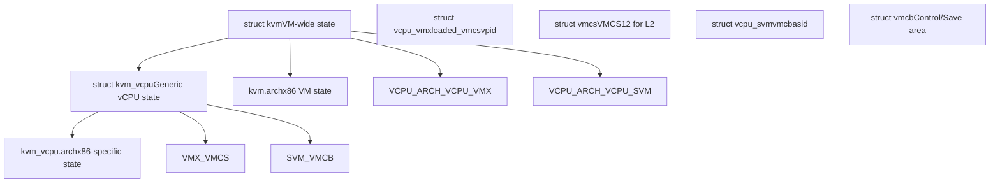
Sources: [arch/x86/include/asm/kvm\_host.h700-1000](https://github.com/torvalds/linux/blob/fcb70a56/arch/x86/include/asm/kvm_host.h#L700-L1000) [arch/x86/kvm/vmx/vmx.h200-400](https://github.com/torvalds/linux/blob/fcb70a56/arch/x86/kvm/vmx/vmx.h#L200-L400) [arch/x86/kvm/svm/svm.h100-300](https://github.com/torvalds/linux/blob/fcb70a56/arch/x86/kvm/svm/svm.h#L100-L300)

## Vendor-Specific Implementations

### Intel VMX (Virtual Machine Extensions)

VMX is Intel's hardware virtualization technology. The implementation centers around the VMCS (Virtual Machine Control Structure) and VM entry/exit mechanisms.

**Key Components:**

-   **VMCS Management**: [arch/x86/kvm/vmx/vmcs.c1-500](https://github.com/torvalds/linux/blob/fcb70a56/arch/x86/kvm/vmx/vmcs.c#L1-L500) handles VMCS allocation and switching
-   **VM Entry/Exit**: [arch/x86/kvm/vmx/vmx.c7000-7500](https://github.com/torvalds/linux/blob/fcb70a56/arch/x86/kvm/vmx/vmx.c#L7000-L7500) implements `vmx_vcpu_run` for transitions
-   **VPID**: Virtual Processor ID for TLB tagging [arch/x86/kvm/vmx/vmx.c478-479](https://github.com/torvalds/linux/blob/fcb70a56/arch/x86/kvm/vmx/vmx.c#L478-L479)
-   **EPT**: Extended Page Tables for MMU virtualization [arch/x86/kvm/mmu/mmu.c100-200](https://github.com/torvalds/linux/blob/fcb70a56/arch/x86/kvm/mmu/mmu.c#L100-L200)

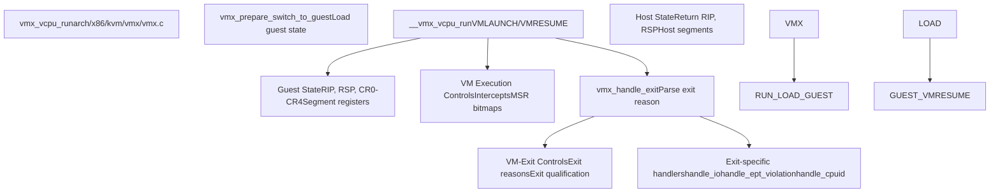
**Module Parameters:**

-   `enable_vpid`: Enable Virtual Processor ID (default: 1) [arch/x86/kvm/vmx/vmx.c91-92](https://github.com/torvalds/linux/blob/fcb70a56/arch/x86/kvm/vmx/vmx.c#L91-L92)
-   `enable_ept`: Enable Extended Page Tables (default: 1) [arch/x86/kvm/vmx/vmx.c100-101](https://github.com/torvalds/linux/blob/fcb70a56/arch/x86/kvm/vmx/vmx.c#L100-L101)
-   `nested`: Enable nested virtualization (default: 1) [arch/x86/kvm/vmx/vmx.c126-127](https://github.com/torvalds/linux/blob/fcb70a56/arch/x86/kvm/vmx/vmx.c#L126-L127)

Sources: [arch/x86/kvm/vmx/vmx.c1-1000](https://github.com/torvalds/linux/blob/fcb70a56/arch/x86/kvm/vmx/vmx.c#L1-L1000) [arch/x86/kvm/vmx/vmcs.c1-300](https://github.com/torvalds/linux/blob/fcb70a56/arch/x86/kvm/vmx/vmcs.c#L1-L300)

### AMD SVM (Secure Virtual Machine)

SVM is AMD's hardware virtualization technology based on the VMCB (Virtual Machine Control Block).

**Key Components:**

-   **VMCB Management**: [arch/x86/kvm/svm/svm.c933-948](https://github.com/torvalds/linux/blob/fcb70a56/arch/x86/kvm/svm/svm.c#L933-L948) initializes segment and system structures
-   **VM Entry/Exit**: [arch/x86/kvm/svm/svm.c4000-5000](https://github.com/torvalds/linux/blob/fcb70a56/arch/x86/kvm/svm/svm.c#L4000-L5000) implements `svm_vcpu_run`
-   **ASID**: Address Space Identifier for TLB tagging [arch/x86/kvm/svm/svm.c521-525](https://github.com/torvalds/linux/blob/fcb70a56/arch/x86/kvm/svm/svm.c#L521-L525)
-   **NPT**: Nested Page Tables for MMU virtualization [arch/x86/kvm/svm/svm.c135-136](https://github.com/torvalds/linux/blob/fcb70a56/arch/x86/kvm/svm/svm.c#L135-L136)

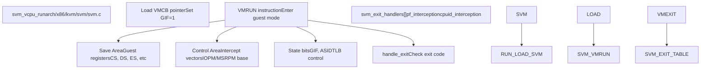
**Module Parameters:**

-   `npt`: Enable Nested Page Tables (default: 1) [arch/x86/kvm/svm/svm.c135-136](https://github.com/torvalds/linux/blob/fcb70a56/arch/x86/kvm/svm/svm.c#L135-L136)
-   `nested`: Enable nested virtualization (default: 1) [arch/x86/kvm/svm/svm.c139-140](https://github.com/torvalds/linux/blob/fcb70a56/arch/x86/kvm/svm/svm.c#L139-L140)
-   `vls`: Enable Virtual VMLOAD/VMSAVE (default: 1) [arch/x86/kvm/svm/svm.c147-148](https://github.com/torvalds/linux/blob/fcb70a56/arch/x86/kvm/svm/svm.c#L147-L148)

Sources: [arch/x86/kvm/svm/svm.c1-2000](https://github.com/torvalds/linux/blob/fcb70a56/arch/x86/kvm/svm/svm.c#L1-L2000) [arch/x86/kvm/svm/svm.h1-200](https://github.com/torvalds/linux/blob/fcb70a56/arch/x86/kvm/svm/svm.h#L1-L200)

## MMU Virtualization

KVM provides two approaches to MMU virtualization: shadow page tables and hardware-assisted two-dimensional paging (EPT/NPT).

### Shadow Page Tables vs TDP

| Approach | Description | File | When Used |
| --- | --- | --- | --- |
| Shadow PT | Software-maintained page tables mirroring guest PT | [arch/x86/kvm/mmu/mmu.c1-8000](https://github.com/torvalds/linux/blob/fcb70a56/arch/x86/kvm/mmu/mmu.c#L1-L8000) | Legacy, no EPT/NPT |
| TDP (EPT/NPT) | Hardware two-dimensional paging | [arch/x86/kvm/mmu/tdp\_mmu.c1-2000](https://github.com/torvalds/linux/blob/fcb70a56/arch/x86/kvm/mmu/tdp_mmu.c#L1-L2000) | Modern processors |

```mermaid
flowchart TD
    GUEST_VA["Guest Virtual AddressGVA"]
    GUEST_PT["Guest Page TablesgCR3, gPTE"]
    GUEST_PA["Guest Physical AddressGPA"]
    SHADOW_PT["Shadow Page Tablesstruct kvm_mmu_page"]
    SHADOW_SYNC["kvm_mmu_get_pageSynchronize with guest PT"]
    HOST_PA_SHADOW["Host Physical AddressHPA"]
    EPT_NPT["EPT/NPT Tablestdp_mmu_root"]
    GPA_TO_HPA["Direct GPA->HPA mappingNo guest PT walk"]
    HOST_PA_TDP["Host Physical AddressHPA"]
    PF_HANDLER["kvm_mmu_page_faultHandle EPT violation/NPT fault"]
    SPTE_SET["mmu_spte_setInstall SPTE"]

    GUEST --> VA_GUEST_PT
    GUEST --> PT_GUEST_PA
    GUEST --> PT_SHADOW_SYNC
    SHADOW --> SYNC_SHADOW_PT
    SHADOW --> PT_HOST_PA_SHADOW
    GUEST --> PA_GPA_TO_HPA
    GPA --> TO_HPA_EPT_NPT
    EPT --> NPT_HOST_PA_TDP
    HOST --> PA_SHADOW_PF_HANDLER
    HOST --> PA_TDP_PF_HANDLER
    PF --> HANDLER_SPTE_SET
```
### Key MMU Structures

**struct kvm\_mmu\_page**: Represents a single page of page table entries

-   Fields: `role`, `gfn`, `spt`, `shadowed_translation`
-   File: [arch/x86/include/asm/kvm\_host.h400-500](https://github.com/torvalds/linux/blob/fcb70a56/arch/x86/include/asm/kvm_host.h#L400-L500)

**Shadow Page Table Entry (SPTE)**: 64-bit entries in shadow/EPT/NPT tables

-   Encoding: Present bit, write bit, executable bit, PFN
-   File: [arch/x86/kvm/mmu/spte.h1-300](https://github.com/torvalds/linux/blob/fcb70a56/arch/x86/kvm/mmu/spte.h#L1-L300)

**MMU Operations:**

-   `kvm_mmu_page_fault`: Entry point for handling page faults [arch/x86/kvm/mmu/mmu.c5000-5100](https://github.com/torvalds/linux/blob/fcb70a56/arch/x86/kvm/mmu/mmu.c#L5000-L5100)
-   `kvm_mmu_get_page`: Allocate or find existing shadow page [arch/x86/kvm/mmu/mmu.c2000-2200](https://github.com/torvalds/linux/blob/fcb70a56/arch/x86/kvm/mmu/mmu.c#L2000-L2200)
-   `mmu_spte_set`: Install SPTE atomically [arch/x86/kvm/mmu/mmu.c482-486](https://github.com/torvalds/linux/blob/fcb70a56/arch/x86/kvm/mmu/mmu.c#L482-L486)

Sources: [arch/x86/kvm/mmu/mmu.c1-1000](https://github.com/torvalds/linux/blob/fcb70a56/arch/x86/kvm/mmu/mmu.c#L1-L1000) [arch/x86/kvm/mmu/tdp\_mmu.c1-500](https://github.com/torvalds/linux/blob/fcb70a56/arch/x86/kvm/mmu/tdp_mmu.c#L1-L500) [arch/x86/kvm/mmu/spte.h1-200](https://github.com/torvalds/linux/blob/fcb70a56/arch/x86/kvm/mmu/spte.h#L1-L200)

## Interrupt Handling

KVM virtualizes both local APICs (per-CPU) and the I/O APIC (system-wide interrupt controller).

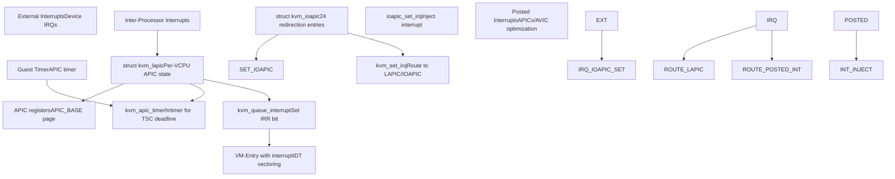
### Local APIC Virtualization

**Key Functions:**

-   `kvm_create_lapic`: Allocate and initialize LAPIC [arch/x86/kvm/lapic.c2700-2800](https://github.com/torvalds/linux/blob/fcb70a56/arch/x86/kvm/lapic.c#L2700-L2800)
-   `kvm_apic_set_irq`: Queue interrupt for delivery [arch/x86/kvm/lapic.c1000-1100](https://github.com/torvalds/linux/blob/fcb70a56/arch/x86/kvm/lapic.c#L1000-L1100)
-   `kvm_lapic_msr_write`: Handle APIC MSR writes (x2APIC) [arch/x86/kvm/lapic.c82](https://github.com/torvalds/linux/blob/fcb70a56/arch/x86/kvm/lapic.c#L82-L82)

**APIC Registers:**

-   Mapped at `APIC_BASE` (default 0xFEE00000)
-   4KB MMIO region with interrupt control registers
-   Accessed via MMIO or MSRs (x2APIC mode)

**APIC Timer Modes:**

-   One-shot: Single interrupt after count expires
-   Periodic: Repeating interrupts
-   TSC-deadline: Interrupt when TSC reaches deadline [arch/x86/kvm/lapic.c2000-2100](https://github.com/torvalds/linux/blob/fcb70a56/arch/x86/kvm/lapic.c#L2000-L2100)

Sources: [arch/x86/kvm/lapic.c1-500](https://github.com/torvalds/linux/blob/fcb70a56/arch/x86/kvm/lapic.c#L1-L500) [arch/x86/kvm/lapic.h1-200](https://github.com/torvalds/linux/blob/fcb70a56/arch/x86/kvm/lapic.h#L1-L200)

## Confidential Computing Extensions

### Intel TDX (Trust Domain Extensions)

TDX provides hardware-isolated confidential VMs using SEAM (Secure Arbitration Mode) and encrypted memory.

```mermaid
flowchart TD
    TD_INIT["tdx_vm_initAllocate HKID"]
    TD_KEY["tdh_mng_key_configConfigure encryption key"]
    TD_FINALIZE["tdh_mr_finalizeLock configuration"]
    VCPU_INIT["tdx_vcpu_createAllocate TDVPR"]
    VCPU_SETUP["tdh_vp_initInitialize TD VCPU"]
    VCPU_RUN["tdx_vcpu_runtdh_vp_enter SEAMCALL"]
    TDVMCALL["TDVMCALL exitGuest->Host call"]
    HANDLERS["handle_io_readhandle_mmio_writehandle_cpuid"]
    SEPT["Secure EPTTDX private memory"]
    TDX_SEPT_SET["tdh_mem_page_addAdd guest pages"]
    TDX_SEPT_ZAP["tdh_mem_page_removeRemove pages"]

    TD --> INIT_TD_KEY
    TD --> KEY_TD_FINALIZE
    TD --> FINALIZE_VCPU_INIT
    VCPU --> INIT_VCPU_SETUP
    VCPU --> SETUP_VCPU_RUN
    VCPU --> RUN_TDVMCALL
    TDVMCALL --> HANDLERS
    VCPU --> SETUP_TDX_SEPT_SET
    TDX --> SEPT_SET_SEPT
    SEPT --> TDX_SEPT_ZAP
```
**Key TDX Functions:**

-   `tdh_mng_create`: Create Trust Domain [arch/x86/kvm/vmx/tdx.c1000-1100](https://github.com/torvalds/linux/blob/fcb70a56/arch/x86/kvm/vmx/tdx.c#L1000-L1100)
-   `tdh_vp_enter`: Enter TD VCPU [arch/x86/kvm/vmx/tdx.c1500-1600](https://github.com/torvalds/linux/blob/fcb70a56/arch/x86/kvm/vmx/tdx.c#L1500-L1600)
-   `tdh_mem_page_add`: Add private memory page [arch/x86/kvm/vmx/tdx.c2000-2100](https://github.com/torvalds/linux/blob/fcb70a56/arch/x86/kvm/vmx/tdx.c#L2000-L2100)

**HKID (Host Key ID):**

-   Hardware encryption key identifier
-   Allocated from limited pool [arch/x86/kvm/vmx/tdx.c253-266](https://github.com/torvalds/linux/blob/fcb70a56/arch/x86/kvm/vmx/tdx.c#L253-L266)
-   Must be reclaimed with cache flush [arch/x86/kvm/vmx/tdx.c440-470](https://github.com/torvalds/linux/blob/fcb70a56/arch/x86/kvm/vmx/tdx.c#L440-L470)

Sources: [arch/x86/kvm/vmx/tdx.c1-1000](https://github.com/torvalds/linux/blob/fcb70a56/arch/x86/kvm/vmx/tdx.c#L1-L1000) [arch/x86/kvm/vmx/tdx.h1-200](https://github.com/torvalds/linux/blob/fcb70a56/arch/x86/kvm/vmx/tdx.h#L1-L200)

### AMD SEV/SEV-ES/SEV-SNP

SEV provides VM memory encryption, SEV-ES adds register encryption, and SEV-SNP adds integrity protection.

```mermaid
flowchart TD
    ASID_ALLOC["sev_asid_newAllocate ASID"]
    SEV_INIT["sev_guest_initPSP firmware call"]
    SEV_LAUNCH["LAUNCH_STARTLAUNCH_UPDATE_DATALAUNCH_FINISH"]
    SEV["SEVMemory encryption"]
    SEV_ES["SEV-ES+ Register encryption+ VMSA protection"]
    SEV_SNP["SEV-SNP+ RMP integrity+ VMPL"]
    RMP_TABLE["RMP TablePage metadataPer-page ASID/VMPL"]
    RMP_CHECK["rmp_make_privateAssign to guest"]
    RMP_RECLAIM["rmp_make_sharedReturn to host"]
    VMGEXIT["VMGEXITGuest exit for I/O"]
    GHCB_PAGE["GHCB PageShared communication"]
    NAE_HANDLER["sev_handle_vmgexitProcess request"]

    SEV --> SEV_ES
    SEV --> ES_SEV_SNP
    SEV --> SNP_RMP_TABLE
    RMP --> TABLE_RMP_CHECK
    RMP --> CHECK_RMP_RECLAIM
    SEV --> ES_VMGEXIT
    VMGEXIT --> GHCB_PAGE
    GHCB --> PAGE_NAE_HANDLER
    ASID --> ALLOC_SEV_INIT
    SEV --> INIT_SEV_LAUNCH
```
**SEV Module Parameters:**

-   `sev`: Enable SEV support (default: 1) [arch/x86/kvm/svm/sev.c45-46](https://github.com/torvalds/linux/blob/fcb70a56/arch/x86/kvm/svm/sev.c#L45-L46)
-   `sev_es`: Enable SEV-ES support (default: 1) [arch/x86/kvm/svm/sev.c48-50](https://github.com/torvalds/linux/blob/fcb70a56/arch/x86/kvm/svm/sev.c#L48-L50)
-   `sev_snp`: Enable SEV-SNP support (default: 1) [arch/x86/kvm/svm/sev.c52-54](https://github.com/torvalds/linux/blob/fcb70a56/arch/x86/kvm/svm/sev.c#L52-L54)

**PSP (Platform Security Processor) Commands:**

-   `SEV_CMD_LAUNCH_START`: Begin VM encryption
-   `SEV_CMD_LAUNCH_UPDATE_DATA`: Encrypt guest memory
-   `SEV_CMD_LAUNCH_FINISH`: Complete launch and generate measurement

**RMP (Reverse Map Table):**

-   Hardware-maintained table for SNP page validation
-   Tracks ASID and VMPL per page
-   Prevents unauthorized access to guest memory

Sources: [arch/x86/kvm/svm/sev.c1-1000](https://github.com/torvalds/linux/blob/fcb70a56/arch/x86/kvm/svm/sev.c#L1-L1000) [arch/x86/kvm/svm/svm.h200-400](https://github.com/torvalds/linux/blob/fcb70a56/arch/x86/kvm/svm/svm.h#L200-L400)

## VCPU Run Loop

The main execution loop for running a virtual CPU involves entering guest mode, handling exits, and re-entering.

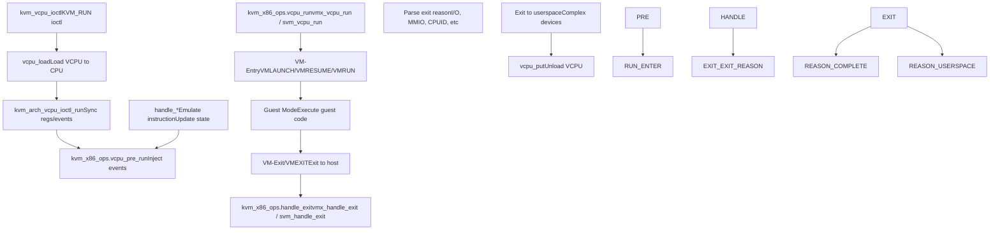
**Key Run Loop Functions:**

| Function | Purpose | File |
| --- | --- | --- |
| `kvm_arch_vcpu_ioctl_run` | Main run loop entry | [arch/x86/kvm/x86.c10000-11000](https://github.com/torvalds/linux/blob/fcb70a56/arch/x86/kvm/x86.c#L10000-L11000) |
| `vmx_vcpu_run` | VMX guest entry/exit | [arch/x86/kvm/vmx/vmx.c7000-7500](https://github.com/torvalds/linux/blob/fcb70a56/arch/x86/kvm/vmx/vmx.c#L7000-L7500) |
| `svm_vcpu_run` | SVM guest entry/exit | [arch/x86/kvm/svm/svm.c4000-5000](https://github.com/torvalds/linux/blob/fcb70a56/arch/x86/kvm/svm/svm.c#L4000-L5000) |
| `vcpu_enter_guest` | Generic entry logic | [arch/x86/kvm/x86.c11000-12000](https://github.com/torvalds/linux/blob/fcb70a56/arch/x86/kvm/x86.c#L11000-L12000) |

**Exit Reasons:**

Common VM-Exit/VMEXIT reasons include:

-   I/O port access (IN/OUT instructions)
-   CPUID instruction
-   MSR read/write (RDMSR/WRMSR)
-   EPT/NPT page faults
-   Interrupt windows
-   HALT instruction

Sources: [arch/x86/kvm/x86.c10000-12000](https://github.com/torvalds/linux/blob/fcb70a56/arch/x86/kvm/x86.c#L10000-L12000) [arch/x86/kvm/vmx/vmx.c5000-7500](https://github.com/torvalds/linux/blob/fcb70a56/arch/x86/kvm/vmx/vmx.c#L5000-L7500) [arch/x86/kvm/svm/svm.c3000-5000](https://github.com/torvalds/linux/blob/fcb70a56/arch/x86/kvm/svm/svm.c#L3000-L5000)

## MSR and CPUID Virtualization

### MSR Handling

KVM intercepts Model-Specific Register accesses and either emulates them or passes through to hardware.

```mermaid
flowchart TD
    RDMSR["RDMSR instruction"]
    WRMSR["WRMSR instruction"]
    MSR_BITMAP["MSR Permission Bitmap4KB read + 4KB write1 bit per MSR"]
    INTERCEPT_CHECK["Bit = 1: InterceptBit = 0: Pass through"]
    VMX_MSR["vmx_get_msr / vmx_set_msr"]
    SVM_MSR["svm_get_msr / svm_set_msr"]
    COMMON_MSR["kvm_get_msr_commonkvm_set_msr_common"]
    EMULATED["Emulated MSRsMSR_IA32_TSC_ADJUSTMSR_KVM_*"]
    SAVED["Saved/Restored MSRsMSR_IA32_SYSENTER_*MSR_STAR"]
    PASSTHROUGH["Pass-through MSRsMSR_IA32_MISC_ENABLEArchitecture MSRs"]

    RDMSR --> MSR_BITMAP
    WRMSR --> MSR_BITMAP
    MSR --> BITMAP_INTERCEPT_CHECK
    INTERCEPT --> CHECK_VMX_MSR
    INTERCEPT --> CHECK_SVM_MSR
    VMX --> MSR_COMMON_MSR
    SVM --> MSR_COMMON_MSR
    COMMON --> MSR_EMULATED
    COMMON --> MSR_SAVED
    COMMON --> MSR_PASSTHROUGH
```
**MSR Lists:**

-   `msrs_to_save[]`: MSRs requiring host support [arch/x86/kvm/x86.c329-383](https://github.com/torvalds/linux/blob/fcb70a56/arch/x86/kvm/x86.c#L329-L383)
-   `emulated_msrs[]`: MSRs emulated by KVM [arch/x86/kvm/x86.c389-455](https://github.com/torvalds/linux/blob/fcb70a56/arch/x86/kvm/x86.c#L389-L455)
-   `msr_based_features[]`: MSRs exposing CPU features [arch/x86/kvm/x86.c465-474](https://github.com/torvalds/linux/blob/fcb70a56/arch/x86/kvm/x86.c#L465-L474)

### CPUID Virtualization

CPUID instructions are intercepted to control guest visibility of CPU features.

**CPUID Processing:**

1.  Guest executes CPUID
2.  VM-Exit to KVM
3.  `kvm_emulate_cpuid` looks up cached entry [arch/x86/kvm/cpuid.c1100-1200](https://github.com/torvalds/linux/blob/fcb70a56/arch/x86/kvm/cpuid.c#L1100-L1200)
4.  Return values from `kvm_cpuid_entry2` array
5.  VM-Entry with results in EAX/EBX/ECX/EDX

**Key Functions:**

-   `kvm_vcpu_ioctl_set_cpuid2`: Set CPUID values from userspace [arch/x86/kvm/cpuid.c400-500](https://github.com/torvalds/linux/blob/fcb70a56/arch/x86/kvm/cpuid.c#L400-L500)
-   `kvm_find_cpuid_entry2`: Look up CPUID entry [arch/x86/kvm/cpuid.c84-120](https://github.com/torvalds/linux/blob/fcb70a56/arch/x86/kvm/cpuid.c#L84-L120)
-   `kvm_update_cpuid_runtime`: Update runtime-variable features [arch/x86/kvm/cpuid.c300-400](https://github.com/torvalds/linux/blob/fcb70a56/arch/x86/kvm/cpuid.c#L300-L400)

Sources: [arch/x86/kvm/x86.c1000-2000](https://github.com/torvalds/linux/blob/fcb70a56/arch/x86/kvm/x86.c#L1000-L2000) [arch/x86/kvm/cpuid.c1-500](https://github.com/torvalds/linux/blob/fcb70a56/arch/x86/kvm/cpuid.c#L1-L500)

## Instruction Emulation

When KVM cannot execute an instruction directly in guest mode, it uses the x86 instruction emulator.

```mermaid
flowchart TD
    MMIO_FAULT["EPT/NPT violationMMIO region access"]
    INVALID_STATE["Invalid guest stateReal mode on VMX"]
    INST_DECODE["Complex instructionString I/O"]
    EMULATE_INIT["x86_emulate_insnInitialize context"]
    DECODE["x86_decode_insnParse instruction bytes"]
    EXEC["Execute emulated opem_rdtsc, em_cpuid, etc"]
    READ_MEM["emulator_read_stdRead guest memory"]
    WRITE_MEM["emulator_write_stdWrite guest memory"]
    MMIO_OPS["MMIO read/writeExit to userspace"]
    UPDATE_RIP["Update guest RIPAdvance past instruction"]
    WRITEBACK["Write back resultsUpdate registers"]

    MMIO --> FAULT_EMULATE_INIT
    INVALID --> STATE_EMULATE_INIT
    INST --> DECODE_EMULATE_INIT
    EMULATE --> INIT_DECODE
    DECODE --> EXEC
    EXEC --> READ_MEM
    EXEC --> WRITE_MEM
    EXEC --> MMIO_OPS
    READ --> MEM_UPDATE_RIP
    WRITE --> MEM_UPDATE_RIP
    MMIO --> OPS_UPDATE_RIP
    UPDATE --> RIP_WRITEBACK
```
**Emulation Context:**

-   `struct x86_emulate_ctxt`: Emulation state [arch/x86/kvm/emulate.c100-300](https://github.com/torvalds/linux/blob/fcb70a56/arch/x86/kvm/emulate.c#L100-L300)
-   `struct x86_emulate_ops`: Callbacks for memory access [arch/x86/kvm/x86.c8000-9000](https://github.com/torvalds/linux/blob/fcb70a56/arch/x86/kvm/x86.c#L8000-L9000)

**Emulated Operations:**

-   `em_cpuid`: CPUID emulation [arch/x86/kvm/emulate.c4000-4100](https://github.com/torvalds/linux/blob/fcb70a56/arch/x86/kvm/emulate.c#L4000-L4100)
-   `em_rdtsc`: RDTSC emulation [arch/x86/kvm/emulate.c4100-4200](https://github.com/torvalds/linux/blob/fcb70a56/arch/x86/kvm/emulate.c#L4100-L4200)
-   `em_io_read`/`em_io_write`: I/O port emulation [arch/x86/kvm/emulate.c6000-7000](https://github.com/torvalds/linux/blob/fcb70a56/arch/x86/kvm/emulate.c#L6000-L7000)

Sources: [arch/x86/kvm/emulate.c1-5000](https://github.com/torvalds/linux/blob/fcb70a56/arch/x86/kvm/emulate.c#L1-L5000) [arch/x86/kvm/x86.c8000-9000](https://github.com/torvalds/linux/blob/fcb70a56/arch/x86/kvm/x86.c#L8000-L9000)

## Module Parameters and Capabilities

### Global Module Parameters

| Parameter | Default | Description | File |
| --- | --- | --- | --- |
| `kvm_caps` | N/A | Hardware capabilities | [arch/x86/kvm/x86.c98](https://github.com/torvalds/linux/blob/fcb70a56/arch/x86/kvm/x86.c#L98-L98) |
| `ignore_msrs` | 0 | Ignore unknown MSR accesses | [arch/x86/kvm/x86.c152](https://github.com/torvalds/linux/blob/fcb70a56/arch/x86/kvm/x86.c#L152-L152) |
| `enable_pmu` | 1 | Enable PMU virtualization | [arch/x86/kvm/x86.c185-187](https://github.com/torvalds/linux/blob/fcb70a56/arch/x86/kvm/x86.c#L185-L187) |
| `enable_apicv` | 1 | Enable APICv/AVIC | [arch/x86/kvm/x86.c234-235](https://github.com/torvalds/linux/blob/fcb70a56/arch/x86/kvm/x86.c#L234-L235) |
| `tdp_enabled` | (auto) | Two-dimensional paging | [arch/x86/kvm/mmu/mmu.c106](https://github.com/torvalds/linux/blob/fcb70a56/arch/x86/kvm/mmu/mmu.c#L106-L106) |

### KVM Capabilities Structure

The `kvm_caps` structure tracks hardware virtualization capabilities:

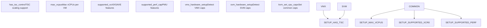
Sources: [arch/x86/kvm/x86.c1-200](https://github.com/torvalds/linux/blob/fcb70a56/arch/x86/kvm/x86.c#L1-L200) [arch/x86/kvm/vmx/vmx.c8000-9000](https://github.com/torvalds/linux/blob/fcb70a56/arch/x86/kvm/vmx/vmx.c#L8000-L9000) [arch/x86/kvm/svm/svm.c4500-5500](https://github.com/torvalds/linux/blob/fcb70a56/arch/x86/kvm/svm/svm.c#L4500-L5500)

## Nested Virtualization

KVM supports running hypervisors inside VMs (L1 hypervisor running L2 guests).

```mermaid
flowchart TD
    L0_KVM["KVM Host Hypervisor"]
    L1_VM["L1 VMNested VMX/SVM enabled"]
    L1_VMCS["vmcs12L1's VMCS for L2"]
    L1_VMCB["L1's VMCB for L2"]
    L2_VM["L2 VMRunning under L1"]
    VMCS02["vmcs02Shadow VMCSL0's view of L2"]
    VMCS_MERGE["prepare_vmcs02Merge vmcs12 + vmcs01"]
    NESTED_RUN["nested_vmx_runEnter L2"]
    NESTED_VMCB["Nested VMCBL0's view of L2"]
    VMCB_MERGE["nested_svm_vmrunMerge VMCBs"]
    NESTED_SVM_RUN["Enter L2 in SVM"]

    L0 --> KVM_L1_VM
    L1 --> VM_L1_VMCS
    L1 --> VM_L1_VMCB
    L1 --> VMCS_VMCS_MERGE
    VMCS --> MERGE_VMCS02
    VMCS02 --> NESTED_RUN
    NESTED --> RUN_L2_VM
    L1 --> VMCB_VMCB_MERGE
    VMCB --> MERGE_NESTED_VMCB
    NESTED --> VMCB_NESTED_SVM_RUN
    NESTED --> SVM_RUN_L2_VM
```
**Nested VMX:**

-   L1 VMCS stored in `vmcs12` [arch/x86/kvm/vmx/vmcs12.h1-200](https://github.com/torvalds/linux/blob/fcb70a56/arch/x86/kvm/vmx/vmcs12.h#L1-L200)
-   Shadow VMCS `vmcs02` maintained by L0
-   `prepare_vmcs02`: Merge L1 and L0 controls [arch/x86/kvm/vmx/nested.c2000-3000](https://github.com/torvalds/linux/blob/fcb70a56/arch/x86/kvm/vmx/nested.c#L2000-L3000)
-   `nested_vmx_run`: Handle VMLAUNCH/VMRESUME from L1 [arch/x86/kvm/vmx/nested.c3000-4000](https://github.com/torvalds/linux/blob/fcb70a56/arch/x86/kvm/vmx/nested.c#L3000-L4000)

**Nested SVM:**

-   L1 VMCB accessible directly in guest memory
-   `nested_svm_vmrun`: Handle VMRUN from L1 [arch/x86/kvm/svm/nested.c500-700](https://github.com/torvalds/linux/blob/fcb70a56/arch/x86/kvm/svm/nested.c#L500-L700)
-   `nested_svm_vmexit`: Synthesize VMEXIT to L1 [arch/x86/kvm/svm/nested.c700-900](https://github.com/torvalds/linux/blob/fcb70a56/arch/x86/kvm/svm/nested.c#L700-L900)

Sources: [arch/x86/kvm/vmx/nested.c1-5000](https://github.com/torvalds/linux/blob/fcb70a56/arch/x86/kvm/vmx/nested.c#L1-L5000) [arch/x86/kvm/svm/nested.c1-2000](https://github.com/torvalds/linux/blob/fcb70a56/arch/x86/kvm/svm/nested.c#L1-L2000)

## Performance Optimizations

### APICv/AVIC (Advanced Interrupt Virtualization)

Hardware-accelerated interrupt delivery without VM exits:

-   **Posted Interrupts (Intel)**: Interrupts delivered directly to guest [arch/x86/kvm/vmx/posted\_intr.c1-500](https://github.com/torvalds/linux/blob/fcb70a56/arch/x86/kvm/vmx/posted_intr.c#L1-L500)
-   **AVIC (AMD)**: Advanced Virtual Interrupt Controller [arch/x86/kvm/svm/avic.c1-1000](https://github.com/torvalds/linux/blob/fcb70a56/arch/x86/kvm/svm/avic.c#L1-L1000)

### Pause Loop Exiting (PLE)

Detect and handle spinlock contention:

-   **ple\_gap**: Time between PAUSE executions [arch/x86/kvm/vmx/vmx.c180](https://github.com/torvalds/linux/blob/fcb70a56/arch/x86/kvm/vmx/vmx.c#L180-L180)
-   **ple\_window**: Maximum time in PAUSE loop [arch/x86/kvm/vmx/vmx.c183](https://github.com/torvalds/linux/blob/fcb70a56/arch/x86/kvm/vmx/vmx.c#L183-L183)

### Dirty Page Tracking

Efficiently track modified pages:

-   **PML (Page Modification Logging)**: Hardware dirty tracking [arch/x86/kvm/vmx/vmx.c129-130](https://github.com/torvalds/linux/blob/fcb70a56/arch/x86/kvm/vmx/vmx.c#L129-L130)
-   **Write-protect SPTEs**: Software dirty tracking via MMU

Sources: [arch/x86/kvm/vmx/posted\_intr.c1-300](https://github.com/torvalds/linux/blob/fcb70a56/arch/x86/kvm/vmx/posted_intr.c#L1-L300) [arch/x86/kvm/svm/avic.c1-500](https://github.com/torvalds/linux/blob/fcb70a56/arch/x86/kvm/svm/avic.c#L1-L500)
