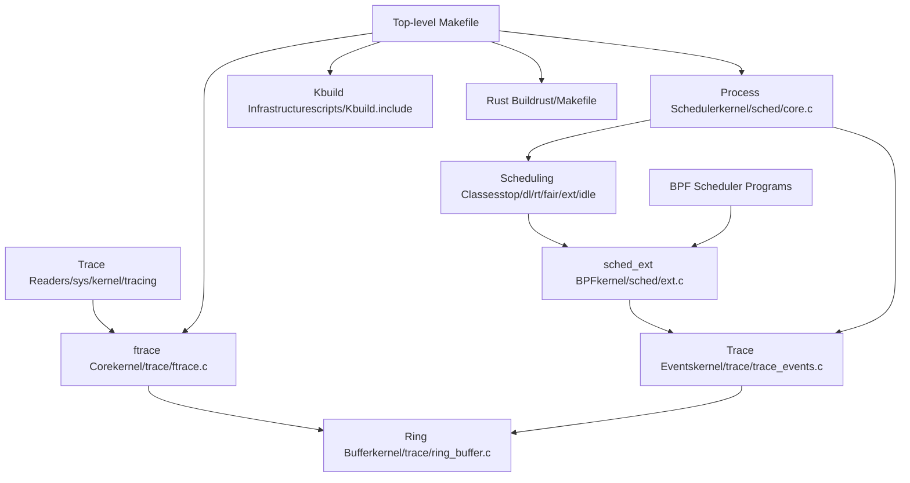
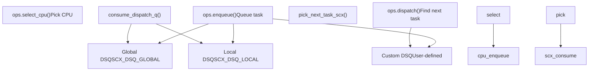
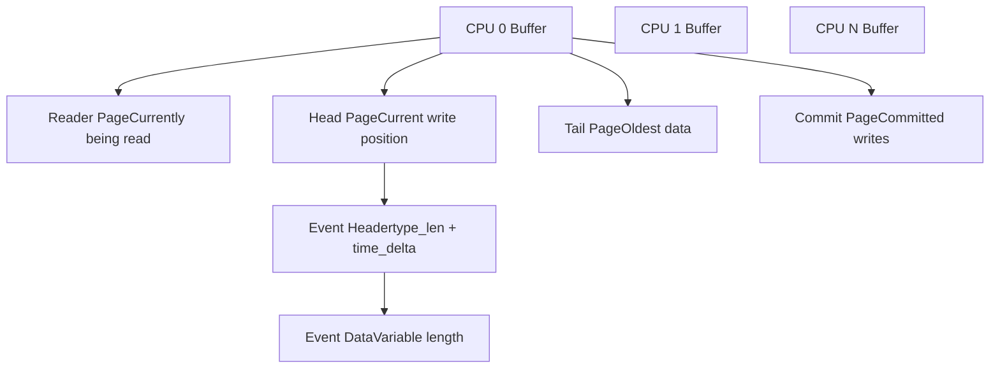
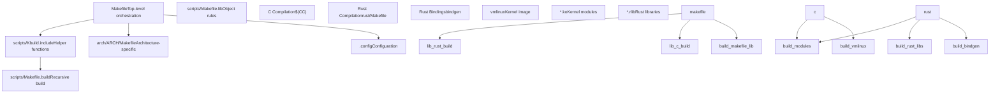
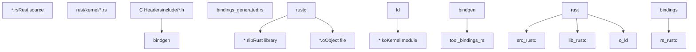

# Core Kernel Infrastructure

Relevant source files

-   [.gitignore](https://github.com/torvalds/linux/blob/fcb70a56/.gitignore)
-   [Documentation/kbuild/reproducible-builds.rst](https://github.com/torvalds/linux/blob/fcb70a56/Documentation/kbuild/reproducible-builds.rst)
-   [Documentation/scheduler/sched-debug.rst](https://github.com/torvalds/linux/blob/fcb70a56/Documentation/scheduler/sched-debug.rst)
-   [Documentation/scheduler/sched-design-CFS.rst](https://github.com/torvalds/linux/blob/fcb70a56/Documentation/scheduler/sched-design-CFS.rst)
-   [Documentation/scheduler/sched-domains.rst](https://github.com/torvalds/linux/blob/fcb70a56/Documentation/scheduler/sched-domains.rst)
-   [Documentation/scheduler/sched-ext.rst](https://github.com/torvalds/linux/blob/fcb70a56/Documentation/scheduler/sched-ext.rst)
-   [Documentation/scheduler/sched-stats.rst](https://github.com/torvalds/linux/blob/fcb70a56/Documentation/scheduler/sched-stats.rst)
-   [Documentation/trace/events.rst](https://github.com/torvalds/linux/blob/fcb70a56/Documentation/trace/events.rst)
-   [Documentation/trace/ftrace.rst](https://github.com/torvalds/linux/blob/fcb70a56/Documentation/trace/ftrace.rst)
-   [Documentation/translations/sp\_SP/scheduler/sched-design-CFS.rst](https://github.com/torvalds/linux/blob/fcb70a56/Documentation/translations/sp_SP/scheduler/sched-design-CFS.rst)
-   [Makefile](https://github.com/torvalds/linux/blob/fcb70a56/Makefile)
-   [arch/arm64/include/asm/ftrace.h](https://github.com/torvalds/linux/blob/fcb70a56/arch/arm64/include/asm/ftrace.h)
-   [arch/arm64/kernel/ftrace.c](https://github.com/torvalds/linux/blob/fcb70a56/arch/arm64/kernel/ftrace.c)
-   [arch/loongarch/include/asm/ftrace.h](https://github.com/torvalds/linux/blob/fcb70a56/arch/loongarch/include/asm/ftrace.h)
-   [arch/loongarch/kernel/ftrace\_dyn.c](https://github.com/torvalds/linux/blob/fcb70a56/arch/loongarch/kernel/ftrace_dyn.c)
-   [arch/mips/Makefile.postlink](https://github.com/torvalds/linux/blob/fcb70a56/arch/mips/Makefile.postlink)
-   [arch/powerpc/include/asm/ftrace.h](https://github.com/torvalds/linux/blob/fcb70a56/arch/powerpc/include/asm/ftrace.h)
-   [arch/powerpc/kernel/trace/ftrace.c](https://github.com/torvalds/linux/blob/fcb70a56/arch/powerpc/kernel/trace/ftrace.c)
-   [arch/powerpc/kernel/trace/ftrace\_64\_pg.c](https://github.com/torvalds/linux/blob/fcb70a56/arch/powerpc/kernel/trace/ftrace_64_pg.c)
-   [arch/powerpc/kernel/trace/ftrace\_entry.S](https://github.com/torvalds/linux/blob/fcb70a56/arch/powerpc/kernel/trace/ftrace_entry.S)
-   [arch/riscv/Makefile.postlink](https://github.com/torvalds/linux/blob/fcb70a56/arch/riscv/Makefile.postlink)
-   [arch/riscv/boot/Makefile](https://github.com/torvalds/linux/blob/fcb70a56/arch/riscv/boot/Makefile)
-   [arch/s390/Makefile.postlink](https://github.com/torvalds/linux/blob/fcb70a56/arch/s390/Makefile.postlink)
-   [arch/s390/include/asm/ftrace.h](https://github.com/torvalds/linux/blob/fcb70a56/arch/s390/include/asm/ftrace.h)
-   [arch/x86/boot/startup/Makefile](https://github.com/torvalds/linux/blob/fcb70a56/arch/x86/boot/startup/Makefile)
-   [arch/x86/include/asm/ftrace.h](https://github.com/torvalds/linux/blob/fcb70a56/arch/x86/include/asm/ftrace.h)
-   [arch/x86/include/asm/setup.h](https://github.com/torvalds/linux/blob/fcb70a56/arch/x86/include/asm/setup.h)
-   [arch/x86/kernel/ftrace.c](https://github.com/torvalds/linux/blob/fcb70a56/arch/x86/kernel/ftrace.c)
-   [arch/x86/kernel/ftrace\_64.S](https://github.com/torvalds/linux/blob/fcb70a56/arch/x86/kernel/ftrace_64.S)
-   [arch/x86/mm/mem\_encrypt\_boot.S](https://github.com/torvalds/linux/blob/fcb70a56/arch/x86/mm/mem_encrypt_boot.S)
-   [include/linux/fprobe.h](https://github.com/torvalds/linux/blob/fcb70a56/include/linux/fprobe.h)
-   [include/linux/ftrace.h](https://github.com/torvalds/linux/blob/fcb70a56/include/linux/ftrace.h)
-   [include/linux/ftrace\_regs.h](https://github.com/torvalds/linux/blob/fcb70a56/include/linux/ftrace_regs.h)
-   [include/linux/ring\_buffer.h](https://github.com/torvalds/linux/blob/fcb70a56/include/linux/ring_buffer.h)
-   [include/linux/sched.h](https://github.com/torvalds/linux/blob/fcb70a56/include/linux/sched.h)
-   [include/linux/sched/sd\_flags.h](https://github.com/torvalds/linux/blob/fcb70a56/include/linux/sched/sd_flags.h)
-   [include/linux/sched/topology.h](https://github.com/torvalds/linux/blob/fcb70a56/include/linux/sched/topology.h)
-   [include/linux/string.h](https://github.com/torvalds/linux/blob/fcb70a56/include/linux/string.h)
-   [include/linux/trace\_events.h](https://github.com/torvalds/linux/blob/fcb70a56/include/linux/trace_events.h)
-   [include/trace/events/block.h](https://github.com/torvalds/linux/blob/fcb70a56/include/trace/events/block.h)
-   [include/trace/stages/stage3\_trace\_output.h](https://github.com/torvalds/linux/blob/fcb70a56/include/trace/stages/stage3_trace_output.h)
-   [include/trace/stages/stage7\_class\_define.h](https://github.com/torvalds/linux/blob/fcb70a56/include/trace/stages/stage7_class_define.h)
-   [kernel/sched/autogroup.c](https://github.com/torvalds/linux/blob/fcb70a56/kernel/sched/autogroup.c)
-   [kernel/sched/build\_utility.c](https://github.com/torvalds/linux/blob/fcb70a56/kernel/sched/build_utility.c)
-   [kernel/sched/core.c](https://github.com/torvalds/linux/blob/fcb70a56/kernel/sched/core.c)
-   [kernel/sched/core\_sched.c](https://github.com/torvalds/linux/blob/fcb70a56/kernel/sched/core_sched.c)
-   [kernel/sched/deadline.c](https://github.com/torvalds/linux/blob/fcb70a56/kernel/sched/deadline.c)
-   [kernel/sched/debug.c](https://github.com/torvalds/linux/blob/fcb70a56/kernel/sched/debug.c)
-   [kernel/sched/ext.c](https://github.com/torvalds/linux/blob/fcb70a56/kernel/sched/ext.c)
-   [kernel/sched/ext.h](https://github.com/torvalds/linux/blob/fcb70a56/kernel/sched/ext.h)
-   [kernel/sched/ext\_idle.c](https://github.com/torvalds/linux/blob/fcb70a56/kernel/sched/ext_idle.c)
-   [kernel/sched/ext\_idle.h](https://github.com/torvalds/linux/blob/fcb70a56/kernel/sched/ext_idle.h)
-   [kernel/sched/fair.c](https://github.com/torvalds/linux/blob/fcb70a56/kernel/sched/fair.c)
-   [kernel/sched/idle.c](https://github.com/torvalds/linux/blob/fcb70a56/kernel/sched/idle.c)
-   [kernel/sched/pelt.c](https://github.com/torvalds/linux/blob/fcb70a56/kernel/sched/pelt.c)
-   [kernel/sched/pelt.h](https://github.com/torvalds/linux/blob/fcb70a56/kernel/sched/pelt.h)
-   [kernel/sched/rt.c](https://github.com/torvalds/linux/blob/fcb70a56/kernel/sched/rt.c)
-   [kernel/sched/sched.h](https://github.com/torvalds/linux/blob/fcb70a56/kernel/sched/sched.h)
-   [kernel/sched/stats.c](https://github.com/torvalds/linux/blob/fcb70a56/kernel/sched/stats.c)
-   [kernel/sched/stats.h](https://github.com/torvalds/linux/blob/fcb70a56/kernel/sched/stats.h)
-   [kernel/sched/stop\_task.c](https://github.com/torvalds/linux/blob/fcb70a56/kernel/sched/stop_task.c)
-   [kernel/sched/syscalls.c](https://github.com/torvalds/linux/blob/fcb70a56/kernel/sched/syscalls.c)
-   [kernel/sched/topology.c](https://github.com/torvalds/linux/blob/fcb70a56/kernel/sched/topology.c)
-   [kernel/trace/Kconfig](https://github.com/torvalds/linux/blob/fcb70a56/kernel/trace/Kconfig)
-   [kernel/trace/Makefile](https://github.com/torvalds/linux/blob/fcb70a56/kernel/trace/Makefile)
-   [kernel/trace/blktrace.c](https://github.com/torvalds/linux/blob/fcb70a56/kernel/trace/blktrace.c)
-   [kernel/trace/fgraph.c](https://github.com/torvalds/linux/blob/fcb70a56/kernel/trace/fgraph.c)
-   [kernel/trace/fprobe.c](https://github.com/torvalds/linux/blob/fcb70a56/kernel/trace/fprobe.c)
-   [kernel/trace/ftrace.c](https://github.com/torvalds/linux/blob/fcb70a56/kernel/trace/ftrace.c)
-   [kernel/trace/pid\_list.c](https://github.com/torvalds/linux/blob/fcb70a56/kernel/trace/pid_list.c)
-   [kernel/trace/pid\_list.h](https://github.com/torvalds/linux/blob/fcb70a56/kernel/trace/pid_list.h)
-   [kernel/trace/ring\_buffer.c](https://github.com/torvalds/linux/blob/fcb70a56/kernel/trace/ring_buffer.c)
-   [kernel/trace/trace.c](https://github.com/torvalds/linux/blob/fcb70a56/kernel/trace/trace.c)
-   [kernel/trace/trace.h](https://github.com/torvalds/linux/blob/fcb70a56/kernel/trace/trace.h)
-   [kernel/trace/trace\_dynevent.c](https://github.com/torvalds/linux/blob/fcb70a56/kernel/trace/trace_dynevent.c)
-   [kernel/trace/trace\_dynevent.h](https://github.com/torvalds/linux/blob/fcb70a56/kernel/trace/trace_dynevent.h)
-   [kernel/trace/trace\_entries.h](https://github.com/torvalds/linux/blob/fcb70a56/kernel/trace/trace_entries.h)
-   [kernel/trace/trace\_eprobe.c](https://github.com/torvalds/linux/blob/fcb70a56/kernel/trace/trace_eprobe.c)
-   [kernel/trace/trace\_events.c](https://github.com/torvalds/linux/blob/fcb70a56/kernel/trace/trace_events.c)
-   [kernel/trace/trace\_events\_hist.c](https://github.com/torvalds/linux/blob/fcb70a56/kernel/trace/trace_events_hist.c)
-   [kernel/trace/trace\_events\_synth.c](https://github.com/torvalds/linux/blob/fcb70a56/kernel/trace/trace_events_synth.c)
-   [kernel/trace/trace\_events\_trigger.c](https://github.com/torvalds/linux/blob/fcb70a56/kernel/trace/trace_events_trigger.c)
-   [kernel/trace/trace\_fprobe.c](https://github.com/torvalds/linux/blob/fcb70a56/kernel/trace/trace_fprobe.c)
-   [kernel/trace/trace\_functions.c](https://github.com/torvalds/linux/blob/fcb70a56/kernel/trace/trace_functions.c)
-   [kernel/trace/trace\_functions\_graph.c](https://github.com/torvalds/linux/blob/fcb70a56/kernel/trace/trace_functions_graph.c)
-   [kernel/trace/trace\_irqsoff.c](https://github.com/torvalds/linux/blob/fcb70a56/kernel/trace/trace_irqsoff.c)
-   [kernel/trace/trace\_kdb.c](https://github.com/torvalds/linux/blob/fcb70a56/kernel/trace/trace_kdb.c)
-   [kernel/trace/trace\_kprobe.c](https://github.com/torvalds/linux/blob/fcb70a56/kernel/trace/trace_kprobe.c)
-   [kernel/trace/trace\_output.c](https://github.com/torvalds/linux/blob/fcb70a56/kernel/trace/trace_output.c)
-   [kernel/trace/trace\_output.h](https://github.com/torvalds/linux/blob/fcb70a56/kernel/trace/trace_output.h)
-   [kernel/trace/trace\_probe.c](https://github.com/torvalds/linux/blob/fcb70a56/kernel/trace/trace_probe.c)
-   [kernel/trace/trace\_probe.h](https://github.com/torvalds/linux/blob/fcb70a56/kernel/trace/trace_probe.h)
-   [kernel/trace/trace\_probe\_tmpl.h](https://github.com/torvalds/linux/blob/fcb70a56/kernel/trace/trace_probe_tmpl.h)
-   [kernel/trace/trace\_sched\_switch.c](https://github.com/torvalds/linux/blob/fcb70a56/kernel/trace/trace_sched_switch.c)
-   [kernel/trace/trace\_sched\_wakeup.c](https://github.com/torvalds/linux/blob/fcb70a56/kernel/trace/trace_sched_wakeup.c)
-   [kernel/trace/trace\_selftest.c](https://github.com/torvalds/linux/blob/fcb70a56/kernel/trace/trace_selftest.c)
-   [kernel/trace/trace\_uprobe.c](https://github.com/torvalds/linux/blob/fcb70a56/kernel/trace/trace_uprobe.c)
-   [lib/tests/string\_kunit.c](https://github.com/torvalds/linux/blob/fcb70a56/lib/tests/string_kunit.c)
-   [mm/kasan/Makefile](https://github.com/torvalds/linux/blob/fcb70a56/mm/kasan/Makefile)
-   [rust/Makefile](https://github.com/torvalds/linux/blob/fcb70a56/rust/Makefile)
-   [rust/helpers/bug.c](https://github.com/torvalds/linux/blob/fcb70a56/rust/helpers/bug.c)
-   [rust/helpers/jump\_label.c](https://github.com/torvalds/linux/blob/fcb70a56/rust/helpers/jump_label.c)
-   [rust/kernel/.gitignore](https://github.com/torvalds/linux/blob/fcb70a56/rust/kernel/.gitignore)
-   [rust/kernel/bug.rs](https://github.com/torvalds/linux/blob/fcb70a56/rust/kernel/bug.rs)
-   [rust/kernel/generated\_arch\_reachable\_asm.rs.S](https://github.com/torvalds/linux/blob/fcb70a56/rust/kernel/generated_arch_reachable_asm.rs.S)
-   [rust/kernel/generated\_arch\_static\_branch\_asm.rs.S](https://github.com/torvalds/linux/blob/fcb70a56/rust/kernel/generated_arch_static_branch_asm.rs.S)
-   [rust/kernel/generated\_arch\_warn\_asm.rs.S](https://github.com/torvalds/linux/blob/fcb70a56/rust/kernel/generated_arch_warn_asm.rs.S)
-   [rust/kernel/jump\_label.rs](https://github.com/torvalds/linux/blob/fcb70a56/rust/kernel/jump_label.rs)
-   [samples/fprobe/fprobe\_example.c](https://github.com/torvalds/linux/blob/fcb70a56/samples/fprobe/fprobe_example.c)
-   [samples/trace\_events/trace-events-sample.h](https://github.com/torvalds/linux/blob/fcb70a56/samples/trace_events/trace-events-sample.h)
-   [scripts/Makefile.build](https://github.com/torvalds/linux/blob/fcb70a56/scripts/Makefile.build)
-   [scripts/Makefile.lib](https://github.com/torvalds/linux/blob/fcb70a56/scripts/Makefile.lib)
-   [scripts/generate\_rust\_analyzer.py](https://github.com/torvalds/linux/blob/fcb70a56/scripts/generate_rust_analyzer.py)
-   [scripts/livepatch/fix-patch-lines](https://github.com/torvalds/linux/blob/fcb70a56/scripts/livepatch/fix-patch-lines)
-   [scripts/livepatch/klp-build](https://github.com/torvalds/linux/blob/fcb70a56/scripts/livepatch/klp-build)
-   [scripts/misc-check](https://github.com/torvalds/linux/blob/fcb70a56/scripts/misc-check)
-   [tools/objtool/klp-diff.c](https://github.com/torvalds/linux/blob/fcb70a56/tools/objtool/klp-diff.c)
-   [tools/power/cpupower/.gitignore](https://github.com/torvalds/linux/blob/fcb70a56/tools/power/cpupower/.gitignore)
-   [tools/sched\_ext/include/scx/common.bpf.h](https://github.com/torvalds/linux/blob/fcb70a56/tools/sched_ext/include/scx/common.bpf.h)
-   [tools/sched\_ext/include/scx/common.h](https://github.com/torvalds/linux/blob/fcb70a56/tools/sched_ext/include/scx/common.h)
-   [tools/sched\_ext/include/scx/compat.bpf.h](https://github.com/torvalds/linux/blob/fcb70a56/tools/sched_ext/include/scx/compat.bpf.h)
-   [tools/sched\_ext/include/scx/compat.h](https://github.com/torvalds/linux/blob/fcb70a56/tools/sched_ext/include/scx/compat.h)
-   [tools/sched\_ext/include/scx/enum\_defs.autogen.h](https://github.com/torvalds/linux/blob/fcb70a56/tools/sched_ext/include/scx/enum_defs.autogen.h)
-   [tools/sched\_ext/include/scx/enums.autogen.bpf.h](https://github.com/torvalds/linux/blob/fcb70a56/tools/sched_ext/include/scx/enums.autogen.bpf.h)
-   [tools/sched\_ext/include/scx/enums.autogen.h](https://github.com/torvalds/linux/blob/fcb70a56/tools/sched_ext/include/scx/enums.autogen.h)
-   [tools/sched\_ext/include/scx/enums.bpf.h](https://github.com/torvalds/linux/blob/fcb70a56/tools/sched_ext/include/scx/enums.bpf.h)
-   [tools/sched\_ext/include/scx/enums.h](https://github.com/torvalds/linux/blob/fcb70a56/tools/sched_ext/include/scx/enums.h)
-   [tools/sched\_ext/include/scx/user\_exit\_info.h](https://github.com/torvalds/linux/blob/fcb70a56/tools/sched_ext/include/scx/user_exit_info.h)
-   [tools/sched\_ext/scx\_central.bpf.c](https://github.com/torvalds/linux/blob/fcb70a56/tools/sched_ext/scx_central.bpf.c)
-   [tools/sched\_ext/scx\_central.c](https://github.com/torvalds/linux/blob/fcb70a56/tools/sched_ext/scx_central.c)
-   [tools/sched\_ext/scx\_flatcg.bpf.c](https://github.com/torvalds/linux/blob/fcb70a56/tools/sched_ext/scx_flatcg.bpf.c)
-   [tools/sched\_ext/scx\_qmap.bpf.c](https://github.com/torvalds/linux/blob/fcb70a56/tools/sched_ext/scx_qmap.bpf.c)
-   [tools/sched\_ext/scx\_qmap.c](https://github.com/torvalds/linux/blob/fcb70a56/tools/sched_ext/scx_qmap.c)
-   [tools/sched\_ext/scx\_simple.bpf.c](https://github.com/torvalds/linux/blob/fcb70a56/tools/sched_ext/scx_simple.bpf.c)

## Purpose and Scope

This page documents the foundational kernel infrastructure systems that enable all other kernel functionality. It covers three critical subsystems:

1.  **Process Scheduling** - The core scheduler and extensible scheduling framework (sched\_ext)
2.  **Tracing and Observability** - Function tracing (ftrace), event tracking, and debugging infrastructure
3.  **Build System** - Kbuild infrastructure supporting C and Rust compilation

For detailed information about:

-   BPF-based extensible scheduling policies and custom schedulers, see [Process Scheduling and sched\_ext](/torvalds/linux/4.1-process-scheduling-and-sched_ext)
-   Comprehensive tracing mechanisms, dynamic probes, and histogram analysis, see [Tracing and Observability](/torvalds/linux/4.2-tracing-and-observability)
-   Build configuration, cross-compilation, and livepatching, see [Build System and Kbuild](/torvalds/linux/4.3-build-system-and-kbuild)

## Architectural Overview

The core kernel infrastructure provides the lowest-level mechanisms upon which all other kernel subsystems depend. The scheduler determines which tasks execute when and where. The tracing infrastructure provides visibility into kernel operations for debugging and performance analysis. The build system orchestrates compilation of the entire kernel codebase across multiple architectures and languages.


Sources: [kernel/sched/core.c1-100](https://github.com/torvalds/linux/blob/fcb70a56/kernel/sched/core.c#L1-L100) [kernel/sched/ext.c1-50](https://github.com/torvalds/linux/blob/fcb70a56/kernel/sched/ext.c#L1-L50) [kernel/trace/trace.c1-100](https://github.com/torvalds/linux/blob/fcb70a56/kernel/trace/trace.c#L1-L100) [Makefile1-100](https://github.com/torvalds/linux/blob/fcb70a56/Makefile#L1-L100)

## Core Scheduling Infrastructure

The Linux scheduler is organized as a hierarchy of scheduling classes, each implementing a specific scheduling policy. Tasks are assigned to scheduling classes based on their policy (`SCHED_NORMAL`, `SCHED_FIFO`, `SCHED_DEADLINE`, `SCHED_EXT`, etc.).

### Scheduling Class Hierarchy

| Priority | Class | Policy | Description | Implementation |
| --- | --- | --- | --- | --- |
| Highest | `stop_sched_class` | N/A | Per-CPU stop tasks for critical operations | Built-in |
| 2 | `dl_sched_class` | `SCHED_DEADLINE` | Earliest Deadline First real-time | [kernel/sched/deadline.c](https://github.com/torvalds/linux/blob/fcb70a56/kernel/sched/deadline.c) |
| 3 | `rt_sched_class` | `SCHED_FIFO`, `SCHED_RR` | Fixed-priority real-time | [kernel/sched/rt.c](https://github.com/torvalds/linux/blob/fcb70a56/kernel/sched/rt.c) |
| 4 | `ext_sched_class` | `SCHED_EXT` | BPF-extensible custom scheduling | [kernel/sched/ext.c](https://github.com/torvalds/linux/blob/fcb70a56/kernel/sched/ext.c) |
| 5 | `fair_sched_class` | `SCHED_NORMAL`, `SCHED_BATCH` | Completely Fair Scheduler (CFS) | [kernel/sched/fair.c](https://github.com/torvalds/linux/blob/fcb70a56/kernel/sched/fair.c) |
| Lowest | `idle_sched_class` | N/A | Idle task when no work available | [kernel/sched/idle.c](https://github.com/torvalds/linux/blob/fcb70a56/kernel/sched/idle.c) |

Sources: [kernel/sched/sched.h1-100](https://github.com/torvalds/linux/blob/fcb70a56/kernel/sched/sched.h#L1-L100) [kernel/sched/core.c190-210](https://github.com/torvalds/linux/blob/fcb70a56/kernel/sched/core.c#L190-L210)

### Core Scheduler Operation

```mermaid
flowchart TD
    schedule["schedule()kernel/sched/core.c"]
    preempt["preempt_schedule()"]
    yield["sched_yield()"]
    __schedule["__schedule()Main scheduler function"]
    pick_next["pick_next_task()Select next task"]
    context_switch["context_switch()Switch address spaces"]
    pick_dl["pick_next_task_dl()"]
    pick_rt["pick_next_task_rt()"]
    pick_ext["pick_next_task_scx()"]
    pick_fair["pick_next_task_fair()"]
    rq["struct rqPer-CPU run queue"]
    cfs_rq["struct cfs_rqCFS run queue"]
    rt_rq["struct rt_rqRT run queue"]
    dl_rq["struct dl_rqDL run queue"]
    scx_rq["struct scx_rqSCX queues"]

    schedule --> __schedule
    preempt --> __schedule
    yield --> __schedule
    _ --> schedule_pick_next
    pick --> next_pick_dl
    pick --> next_pick_rt
    pick --> next_pick_ext
    pick --> next_pick_fair
    _ --> schedule_context_switch
    pick --> dl_dl_rq
    pick --> rt_rt_rq
    pick --> ext_scx_rq
    pick --> fair_cfs_rq
    rq --> cfs_rq
    rq --> rt_rq
    rq --> dl_rq
    rq --> scx_rq
```


Sources: [kernel/sched/core.c6300-6500](https://github.com/torvalds/linux/blob/fcb70a56/kernel/sched/core.c#L6300-L6500) [kernel/sched/sched.h1000-1200](https://github.com/torvalds/linux/blob/fcb70a56/kernel/sched/sched.h#L1000-L1200)

The core scheduler maintains a per-CPU `struct rq` ([kernel/sched/sched.h1000-1100](https://github.com/torvalds/linux/blob/fcb70a56/kernel/sched/sched.h#L1000-L1100)) that contains multiple run queues, one for each scheduling class. The `pick_next_task()` function ([kernel/sched/core.c5500-5700](https://github.com/torvalds/linux/blob/fcb70a56/kernel/sched/core.c#L5500-L5700)) iterates through scheduling classes in priority order until a runnable task is found.

### Key Scheduler Data Structures

**`struct rq` - Per-CPU Run Queue**

```
struct rq {
    raw_spinlock_t __lock;              // Protects run queue state
    unsigned int nr_running;             // Number of runnable tasks
    struct cfs_rq cfs;                  // CFS run queue
    struct rt_rq rt;                    // Real-time run queue
    struct dl_rq dl;                    // Deadline run queue
    struct scx_rq scx;                  // sched_ext run queue
    struct task_struct *curr;           // Currently running task
    u64 clock;                          // Run queue clock
    // ... additional fields
};
```
Sources: [kernel/sched/sched.h1000-1200](https://github.com/torvalds/linux/blob/fcb70a56/kernel/sched/sched.h#L1000-L1200)

**`struct task_struct` - Process Control Block**

The scheduler manipulates the `sched_class`, `policy`, and scheduling-specific data embedded in `struct task_struct` ([include/linux/sched.h700-1500](https://github.com/torvalds/linux/blob/fcb70a56/include/linux/sched.h#L700-L1500)):

-   `task_struct->sched_class` - Pointer to scheduling class operations
-   `task_struct->policy` - Scheduling policy (SCHED\_NORMAL, SCHED\_FIFO, etc.)
-   `task_struct->se` - Fair scheduling entity (CFS)
-   `task_struct->rt` - Real-time scheduling entity
-   `task_struct->dl` - Deadline scheduling entity
-   `task_struct->scx` - sched\_ext scheduling entity

### sched\_ext: Extensible Scheduling

The `sched_ext` framework ([kernel/sched/ext.c](https://github.com/torvalds/linux/blob/fcb70a56/kernel/sched/ext.c)) allows custom scheduling policies to be implemented in BPF programs and loaded dynamically without kernel modification. This is a revolutionary change compared to traditional scheduling class development.

**Core sched\_ext Components:**

| Component | Purpose | Code Location |
| --- | --- | --- |
| `struct scx_sched` | Scheduler instance with ops table | [kernel/sched/ext.c20-50](https://github.com/torvalds/linux/blob/fcb70a56/kernel/sched/ext.c#L20-L50) |
| `struct sched_ext_ops` | BPF operations callbacks | [include/linux/sched/ext.h](https://github.com/torvalds/linux/blob/fcb70a56/include/linux/sched/ext.h) |
| `struct scx_dispatch_q` | Dispatch queues (global/local) | [kernel/sched/ext.c100-150](https://github.com/torvalds/linux/blob/fcb70a56/kernel/sched/ext.c#L100-L150) |
| `scx_bpf_*` kfuncs | BPF helper functions | [kernel/sched/ext.c2000-5000](https://github.com/torvalds/linux/blob/fcb70a56/kernel/sched/ext.c#L2000-L5000) |

The sched\_ext implementation uses dispatch queues as an intermediary between task selection and execution. BPF schedulers dispatch tasks to queues, and the core scheduler consumes from these queues.


Sources: [kernel/sched/ext.c1000-1300](https://github.com/torvalds/linux/blob/fcb70a56/kernel/sched/ext.c#L1000-L1300) [kernel/sched/ext.c3000-3500](https://github.com/torvalds/linux/blob/fcb70a56/kernel/sched/ext.c#L3000-L3500)

For comprehensive details on sched\_ext architecture, BPF integration, and scheduler development, see [Process Scheduling and sched\_ext](/torvalds/linux/4.1-process-scheduling-and-sched_ext).

## Tracing and Observability Infrastructure

The kernel tracing infrastructure provides comprehensive visibility into kernel operations through multiple mechanisms: function tracing (ftrace), trace events, dynamic probes, and ring buffers for efficient event storage.

### Tracing Architecture Overview

```mermaid
flowchart TD
    ftrace["ftrace Function Tracingkernel/trace/ftrace.c"]
    events["Trace Eventskernel/trace/trace_events.c"]
    fprobe["fprobekernel/trace/fprobe.c"]
    kprobe["kprobesDynamic Probes"]
    trace_core["Tracing Corekernel/trace/trace.c"]
    ringbuf["Ring Bufferkernel/trace/ring_buffer.c"]
    trace_array["struct trace_arrayPer-instance state"]
    tracefs["tracefs/sys/kernel/tracing"]
    hist["Histogram Triggerstrace_events_hist.c"]
    graph_trace["Function Graphtrace_functions_graph.c"]

    ftrace --> trace_core
    events --> trace_core
    fprobe --> trace_core
    kprobe --> trace_core
    trace --> core_ringbuf
    trace --> core_trace_array
    ringbuf --> tracefs
    hist --> events
    graph --> trace_ftrace
```
Sources: [kernel/trace/trace.c1-200](https://github.com/torvalds/linux/blob/fcb70a56/kernel/trace/trace.c#L1-L200) [kernel/trace/ftrace.c1-100](https://github.com/torvalds/linux/blob/fcb70a56/kernel/trace/ftrace.c#L1-L100) [kernel/trace/ring\_buffer.c1-200](https://github.com/torvalds/linux/blob/fcb70a56/kernel/trace/ring_buffer.c#L1-L200)

### Function Tracing (ftrace)

The ftrace subsystem ([kernel/trace/ftrace.c](https://github.com/torvalds/linux/blob/fcb70a56/kernel/trace/ftrace.c)) instruments kernel functions by replacing their entry points with calls to tracing code. This allows dynamic tracing of function calls with minimal runtime overhead when disabled.

**Key ftrace Components:**

| Component | Purpose | File |
| --- | --- | --- |
| `ftrace_ops` | Function tracing operations and filters | [kernel/trace/ftrace.c88-92](https://github.com/torvalds/linux/blob/fcb70a56/kernel/trace/ftrace.c#L88-L92) |
| `ftrace_enabled` | Global enable/disable control | [kernel/trace/ftrace.c95](https://github.com/torvalds/linux/blob/fcb70a56/kernel/trace/ftrace.c#L95-L95) |
| `ftrace_trace_function` | Current tracing function pointer | [kernel/trace/ftrace.c126](https://github.com/torvalds/linux/blob/fcb70a56/kernel/trace/ftrace.c#L126-L126) |
| `function_trace_op` | Active tracing operation | [kernel/trace/ftrace.c99](https://github.com/torvalds/linux/blob/fcb70a56/kernel/trace/ftrace.c#L99-L99) |

**ftrace Operation Modes:**

1.  **Function Tracer** - Trace every function call
2.  **Function Graph Tracer** - Show call graph with entry/exit ([kernel/trace/trace\_functions\_graph.c](https://github.com/torvalds/linux/blob/fcb70a56/kernel/trace/trace_functions_graph.c))
3.  **Dynamic Ftrace** - Enable/disable tracing per-function
4.  **Function Profiling** - Collect per-function statistics

### Ring Buffer Architecture

The ring buffer ([kernel/trace/ring\_buffer.c](https://github.com/torvalds/linux/blob/fcb70a56/kernel/trace/ring_buffer.c)) is a lock-free, per-CPU circular buffer used to store trace events efficiently. It supports:

-   Per-CPU buffers to avoid contention
-   Reader/writer pages to enable lock-free reads
-   Overwrite or drop-newest modes
-   Time stamping with delta compression

**Ring Buffer Structure:**


Sources: [kernel/trace/ring\_buffer.c89-154](https://github.com/torvalds/linux/blob/fcb70a56/kernel/trace/ring_buffer.c#L89-L154) [kernel/trace/ring\_buffer.c160-200](https://github.com/torvalds/linux/blob/fcb70a56/kernel/trace/ring_buffer.c#L160-L200)

The ring buffer implements a clever page-swapping mechanism: the reader page is separate from the ring, and when a reader finishes reading, it swaps the reader page with the next page in the ring. This allows concurrent reading and writing without locks.

### Trace Events

Trace events ([kernel/trace/trace\_events.c](https://github.com/torvalds/linux/blob/fcb70a56/kernel/trace/trace_events.c)) provide structured tracepoints throughout the kernel. They are statically defined but can be dynamically enabled/disabled.

**Event Infrastructure:**

-   `TRACE_EVENT()` macro defines events at compile time
-   Events compiled to tracepoints in binary
-   Runtime enable/disable via tracefs
-   Format files describe event structure for userspace parsing

**Example Event Definition:**

```
TRACE_EVENT(sched_switch,
    TP_PROTO(bool preempt, struct task_struct *prev, struct task_struct *next),
    TP_ARGS(preempt, prev, next),
    TP_STRUCT__entry(
        __array(char, prev_comm, TASK_COMM_LEN)
        __field(pid_t, prev_pid)
        __field(int, prev_prio)
        // ...
    ),
    // ...
);
```
Sources: [include/trace/events/sched.h](https://github.com/torvalds/linux/blob/fcb70a56/include/trace/events/sched.h)

### Dynamic Probes

Dynamic probes allow tracing arbitrary kernel functions and memory locations at runtime:

-   **kprobes** - Instrument any kernel instruction
-   **fprobes** - Function entry/exit probes using ftrace ([kernel/trace/fprobe.c](https://github.com/torvalds/linux/blob/fcb70a56/kernel/trace/fprobe.c))
-   **uprobes** - Userspace probes
-   **trace\_fprobe** - fprobe-based trace events ([kernel/trace/trace\_fprobe.c](https://github.com/torvalds/linux/blob/fcb70a56/kernel/trace/trace_fprobe.c))

For complete details on tracing mechanisms, probe types, and histogram analysis, see [Tracing and Observability](/torvalds/linux/4.2-tracing-and-observability).

## Build System Architecture

The kernel build system (Kbuild) orchestrates compilation of the entire kernel across multiple architectures, with support for both C and Rust code, modules, and various output formats.

### Build System Structure


Sources: [Makefile1-100](https://github.com/torvalds/linux/blob/fcb70a56/Makefile#L1-L100) [Makefile376-750](https://github.com/torvalds/linux/blob/fcb70a56/Makefile#L376-L750) [rust/Makefile1-50](https://github.com/torvalds/linux/blob/fcb70a56/rust/Makefile#L1-L50)

### Build System Components

| Component | Purpose | Location |
| --- | --- | --- |
| Top-level Makefile | Entry point, configuration, architecture selection | [Makefile](https://github.com/torvalds/linux/blob/fcb70a56/Makefile) |
| `scripts/Kbuild.include` | Common make functions and utilities | scripts/Kbuild.include |
| `scripts/Makefile.build` | Recursive build rules for directories | scripts/Makefile.build |
| `scripts/Makefile.lib` | Object file generation rules | scripts/Makefile.lib |
| `arch/*/Makefile` | Architecture-specific build configuration | arch/x86/Makefile, arch/arm64/Makefile |
| `rust/Makefile` | Rust-specific build rules | [rust/Makefile1-150](https://github.com/torvalds/linux/blob/fcb70a56/rust/Makefile#L1-L150) |

### Key Build Variables

The build system uses numerous variables to control compilation:

**Compiler Configuration:**

```
CC          = $(CROSS_COMPILE)gcc      # C compiler
RUSTC       = rustc                     # Rust compiler
LD          = $(CROSS_COMPILE)ld       # Linker
AR          = $(CROSS_COMPILE)ar       # Archiver
```
Sources: [Makefile509-530](https://github.com/torvalds/linux/blob/fcb70a56/Makefile#L509-L530)

**Build Flags:**

```
KBUILD_CFLAGS     # C compiler flags for kernel
KBUILD_RUSTFLAGS  # Rust compiler flags for kernel
KBUILD_AFLAGS     # Assembler flags
KBUILD_LDFLAGS    # Linker flags
```
Sources: [Makefile584-641](https://github.com/torvalds/linux/blob/fcb70a56/Makefile#L584-L641)

### Rust Integration

The kernel supports Rust as a first-class language for driver and subsystem development. The Rust build system ([rust/Makefile](https://github.com/torvalds/linux/blob/fcb70a56/rust/Makefile)) handles:

-   Compiling Rust crates to `.rlib` libraries
-   Generating Rust bindings to C kernel APIs via `bindgen`
-   Building Rust kernel modules (`.ko` files)
-   Generating documentation via `rustdoc`

**Rust Build Targets:**

| Target | Purpose | Output |
| --- | --- | --- |
| `core.o` | Core Rust library | [rust/Makefile6](https://github.com/torvalds/linux/blob/fcb70a56/rust/Makefile#L6-L6) |
| `kernel.o` | Kernel abstractions | [rust/Makefile15](https://github.com/torvalds/linux/blob/fcb70a56/rust/Makefile#L15-L15) |
| `bindings.o` | C API bindings | [rust/Makefile15](https://github.com/torvalds/linux/blob/fcb70a56/rust/Makefile#L15-L15) |
| `libmacros.so` | Procedural macros | [rust/Makefile52](https://github.com/torvalds/linux/blob/fcb70a56/rust/Makefile#L52-L52) |

The Rust build uses `bindgen` ([Makefile534](https://github.com/torvalds/linux/blob/fcb70a56/Makefile#L534-L534)) to automatically generate Rust FFI bindings from C headers, enabling safe Rust code to call C kernel functions.

**Rust Compilation Flow:**


Sources: [rust/Makefile1-150](https://github.com/torvalds/linux/blob/fcb70a56/rust/Makefile#L1-L150) [Makefile445-634](https://github.com/torvalds/linux/blob/fcb70a56/Makefile#L445-L634)

### Module Building

Kernel modules can be built in-tree or out-of-tree:

**In-tree modules:**

-   Configured via `CONFIG_*` options in `.config`
-   Built automatically as part of kernel build
-   `obj-y` for built-in, `obj-m` for modules

**Out-of-tree modules:**

-   External module development
-   Uses `make M=<module_dir>` to build against kernel tree
-   Supports both C and Rust modules

For comprehensive information on build configuration, cross-compilation, and livepatching support, see [Build System and Kbuild](/torvalds/linux/4.3-build-system-and-kbuild).

## Cross-Subsystem Integration

The core infrastructure components interact extensively:

### Scheduler-Tracing Integration

The scheduler emits trace events at critical points:

-   `sched_switch` - Task context switches
-   `sched_wakeup` - Task wakeups
-   `sched_migrate_task` - Task migrations
-   `sched_ext_*` - sched\_ext specific events

Sources: [include/trace/events/sched.h](https://github.com/torvalds/linux/blob/fcb70a56/include/trace/events/sched.h) [kernel/sched/ext.c193-194](https://github.com/torvalds/linux/blob/fcb70a56/kernel/sched/ext.c#L193-L194)

### Build-Scheduler Integration

The build system compiles all scheduler components:

-   Scheduler core ([kernel/sched/core.c](https://github.com/torvalds/linux/blob/fcb70a56/kernel/sched/core.c)) compiled to `kernel/sched/core.o`
-   Each scheduling class compiled separately
-   sched\_ext can optionally support Rust extensions
-   BPF scheduler programs built with special tooling

### Tracing-Build Integration

Trace events are defined using macros that generate code at compile time:

-   Event definitions processed by build system
-   Tracepoint code automatically generated
-   Format files created for userspace parsing

Sources: [kernel/trace/trace\_events.c1-100](https://github.com/torvalds/linux/blob/fcb70a56/kernel/trace/trace_events.c#L1-L100)

## System Initialization

The core infrastructure initializes early in the boot process:

1.  **Build System** - Runs before boot, creates kernel image
2.  **Scheduler** - Initialized via `sched_init()` ([kernel/sched/core.c](https://github.com/torvalds/linux/blob/fcb70a56/kernel/sched/core.c))
3.  **Tracing** - Initialized via `tracer_init_tracefs()` ([kernel/trace/trace.c](https://github.com/torvalds/linux/blob/fcb70a56/kernel/trace/trace.c))

The initialization order ensures that tracing is available to debug scheduler initialization, and the scheduler is ready before most other subsystems need it.

Sources: [kernel/sched/core.c9000-9500](https://github.com/torvalds/linux/blob/fcb70a56/kernel/sched/core.c#L9000-L9500) [kernel/trace/trace.c9000-9500](https://github.com/torvalds/linux/blob/fcb70a56/kernel/trace/trace.c#L9000-L9500)
