# Tracing and Observability

Relevant source files

-   [Documentation/trace/events.rst](https://github.com/torvalds/linux/blob/fcb70a56/Documentation/trace/events.rst)
-   [Documentation/trace/ftrace.rst](https://github.com/torvalds/linux/blob/fcb70a56/Documentation/trace/ftrace.rst)
-   [arch/arm64/include/asm/ftrace.h](https://github.com/torvalds/linux/blob/fcb70a56/arch/arm64/include/asm/ftrace.h)
-   [arch/arm64/kernel/ftrace.c](https://github.com/torvalds/linux/blob/fcb70a56/arch/arm64/kernel/ftrace.c)
-   [arch/loongarch/include/asm/ftrace.h](https://github.com/torvalds/linux/blob/fcb70a56/arch/loongarch/include/asm/ftrace.h)
-   [arch/loongarch/kernel/ftrace\_dyn.c](https://github.com/torvalds/linux/blob/fcb70a56/arch/loongarch/kernel/ftrace_dyn.c)
-   [arch/powerpc/include/asm/ftrace.h](https://github.com/torvalds/linux/blob/fcb70a56/arch/powerpc/include/asm/ftrace.h)
-   [arch/powerpc/kernel/trace/ftrace.c](https://github.com/torvalds/linux/blob/fcb70a56/arch/powerpc/kernel/trace/ftrace.c)
-   [arch/powerpc/kernel/trace/ftrace\_64\_pg.c](https://github.com/torvalds/linux/blob/fcb70a56/arch/powerpc/kernel/trace/ftrace_64_pg.c)
-   [arch/powerpc/kernel/trace/ftrace\_entry.S](https://github.com/torvalds/linux/blob/fcb70a56/arch/powerpc/kernel/trace/ftrace_entry.S)
-   [arch/s390/include/asm/ftrace.h](https://github.com/torvalds/linux/blob/fcb70a56/arch/s390/include/asm/ftrace.h)
-   [arch/x86/include/asm/ftrace.h](https://github.com/torvalds/linux/blob/fcb70a56/arch/x86/include/asm/ftrace.h)
-   [arch/x86/kernel/ftrace.c](https://github.com/torvalds/linux/blob/fcb70a56/arch/x86/kernel/ftrace.c)
-   [arch/x86/kernel/ftrace\_64.S](https://github.com/torvalds/linux/blob/fcb70a56/arch/x86/kernel/ftrace_64.S)
-   [include/linux/fprobe.h](https://github.com/torvalds/linux/blob/fcb70a56/include/linux/fprobe.h)
-   [include/linux/ftrace.h](https://github.com/torvalds/linux/blob/fcb70a56/include/linux/ftrace.h)
-   [include/linux/ftrace\_regs.h](https://github.com/torvalds/linux/blob/fcb70a56/include/linux/ftrace_regs.h)
-   [include/linux/ring\_buffer.h](https://github.com/torvalds/linux/blob/fcb70a56/include/linux/ring_buffer.h)
-   [include/linux/string.h](https://github.com/torvalds/linux/blob/fcb70a56/include/linux/string.h)
-   [include/linux/trace\_events.h](https://github.com/torvalds/linux/blob/fcb70a56/include/linux/trace_events.h)
-   [include/trace/events/block.h](https://github.com/torvalds/linux/blob/fcb70a56/include/trace/events/block.h)
-   [include/trace/stages/stage3\_trace\_output.h](https://github.com/torvalds/linux/blob/fcb70a56/include/trace/stages/stage3_trace_output.h)
-   [include/trace/stages/stage7\_class\_define.h](https://github.com/torvalds/linux/blob/fcb70a56/include/trace/stages/stage7_class_define.h)
-   [kernel/trace/Kconfig](https://github.com/torvalds/linux/blob/fcb70a56/kernel/trace/Kconfig)
-   [kernel/trace/Makefile](https://github.com/torvalds/linux/blob/fcb70a56/kernel/trace/Makefile)
-   [kernel/trace/blktrace.c](https://github.com/torvalds/linux/blob/fcb70a56/kernel/trace/blktrace.c)
-   [kernel/trace/fgraph.c](https://github.com/torvalds/linux/blob/fcb70a56/kernel/trace/fgraph.c)
-   [kernel/trace/fprobe.c](https://github.com/torvalds/linux/blob/fcb70a56/kernel/trace/fprobe.c)
-   [kernel/trace/ftrace.c](https://github.com/torvalds/linux/blob/fcb70a56/kernel/trace/ftrace.c)
-   [kernel/trace/pid\_list.c](https://github.com/torvalds/linux/blob/fcb70a56/kernel/trace/pid_list.c)
-   [kernel/trace/pid\_list.h](https://github.com/torvalds/linux/blob/fcb70a56/kernel/trace/pid_list.h)
-   [kernel/trace/ring\_buffer.c](https://github.com/torvalds/linux/blob/fcb70a56/kernel/trace/ring_buffer.c)
-   [kernel/trace/trace.c](https://github.com/torvalds/linux/blob/fcb70a56/kernel/trace/trace.c)
-   [kernel/trace/trace.h](https://github.com/torvalds/linux/blob/fcb70a56/kernel/trace/trace.h)
-   [kernel/trace/trace\_dynevent.c](https://github.com/torvalds/linux/blob/fcb70a56/kernel/trace/trace_dynevent.c)
-   [kernel/trace/trace\_dynevent.h](https://github.com/torvalds/linux/blob/fcb70a56/kernel/trace/trace_dynevent.h)
-   [kernel/trace/trace\_entries.h](https://github.com/torvalds/linux/blob/fcb70a56/kernel/trace/trace_entries.h)
-   [kernel/trace/trace\_eprobe.c](https://github.com/torvalds/linux/blob/fcb70a56/kernel/trace/trace_eprobe.c)
-   [kernel/trace/trace\_events.c](https://github.com/torvalds/linux/blob/fcb70a56/kernel/trace/trace_events.c)
-   [kernel/trace/trace\_events\_hist.c](https://github.com/torvalds/linux/blob/fcb70a56/kernel/trace/trace_events_hist.c)
-   [kernel/trace/trace\_events\_synth.c](https://github.com/torvalds/linux/blob/fcb70a56/kernel/trace/trace_events_synth.c)
-   [kernel/trace/trace\_events\_trigger.c](https://github.com/torvalds/linux/blob/fcb70a56/kernel/trace/trace_events_trigger.c)
-   [kernel/trace/trace\_fprobe.c](https://github.com/torvalds/linux/blob/fcb70a56/kernel/trace/trace_fprobe.c)
-   [kernel/trace/trace\_functions.c](https://github.com/torvalds/linux/blob/fcb70a56/kernel/trace/trace_functions.c)
-   [kernel/trace/trace\_functions\_graph.c](https://github.com/torvalds/linux/blob/fcb70a56/kernel/trace/trace_functions_graph.c)
-   [kernel/trace/trace\_irqsoff.c](https://github.com/torvalds/linux/blob/fcb70a56/kernel/trace/trace_irqsoff.c)
-   [kernel/trace/trace\_kdb.c](https://github.com/torvalds/linux/blob/fcb70a56/kernel/trace/trace_kdb.c)
-   [kernel/trace/trace\_kprobe.c](https://github.com/torvalds/linux/blob/fcb70a56/kernel/trace/trace_kprobe.c)
-   [kernel/trace/trace\_output.c](https://github.com/torvalds/linux/blob/fcb70a56/kernel/trace/trace_output.c)
-   [kernel/trace/trace\_output.h](https://github.com/torvalds/linux/blob/fcb70a56/kernel/trace/trace_output.h)
-   [kernel/trace/trace\_probe.c](https://github.com/torvalds/linux/blob/fcb70a56/kernel/trace/trace_probe.c)
-   [kernel/trace/trace\_probe.h](https://github.com/torvalds/linux/blob/fcb70a56/kernel/trace/trace_probe.h)
-   [kernel/trace/trace\_probe\_tmpl.h](https://github.com/torvalds/linux/blob/fcb70a56/kernel/trace/trace_probe_tmpl.h)
-   [kernel/trace/trace\_sched\_switch.c](https://github.com/torvalds/linux/blob/fcb70a56/kernel/trace/trace_sched_switch.c)
-   [kernel/trace/trace\_sched\_wakeup.c](https://github.com/torvalds/linux/blob/fcb70a56/kernel/trace/trace_sched_wakeup.c)
-   [kernel/trace/trace\_selftest.c](https://github.com/torvalds/linux/blob/fcb70a56/kernel/trace/trace_selftest.c)
-   [kernel/trace/trace\_uprobe.c](https://github.com/torvalds/linux/blob/fcb70a56/kernel/trace/trace_uprobe.c)
-   [lib/tests/string\_kunit.c](https://github.com/torvalds/linux/blob/fcb70a56/lib/tests/string_kunit.c)
-   [samples/fprobe/fprobe\_example.c](https://github.com/torvalds/linux/blob/fcb70a56/samples/fprobe/fprobe_example.c)
-   [samples/trace\_events/trace-events-sample.h](https://github.com/torvalds/linux/blob/fcb70a56/samples/trace_events/trace-events-sample.h)

The Linux kernel tracing and observability infrastructure provides comprehensive mechanisms for debugging, performance analysis, and runtime introspection. This system enables developers to trace function calls, capture kernel events, measure latencies, and analyze system behavior with minimal overhead.

For information about the build system that compiles the tracing infrastructure, see [Build System and Kbuild](/torvalds/linux/4.3-build-system-and-kbuild). For information about the scheduler's integration with tracing (sched\_ext tracing), see [Process Scheduling and sched\_ext](/torvalds/linux/4.1-process-scheduling-and-sched_ext).

## Architecture Overview

The tracing infrastructure consists of several interconnected subsystems that work together to capture, store, and report kernel activity:

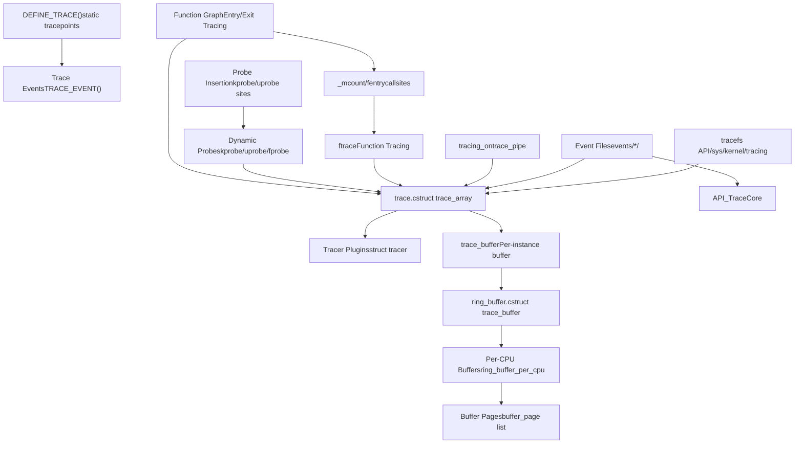
**Architecture: Core Tracing Subsystems and Data Flow**

The tracing system is organized in layers:

-   **User Space Interface**: The tracefs filesystem provides file-based control and output
-   **Frontend APIs**: Different tracing mechanisms (ftrace, events, probes) for different use cases
-   **Core Infrastructure**: Central coordination through `struct trace_array` and tracer plugins
-   **Ring Buffer**: Lock-free per-CPU circular buffers for efficient data storage
-   **Data Collection**: Instrumentation points throughout the kernel

Sources: [kernel/trace/trace.c534-536](https://github.com/torvalds/linux/blob/fcb70a56/kernel/trace/trace.c#L534-L536) [kernel/trace/trace.h328-449](https://github.com/torvalds/linux/blob/fcb70a56/kernel/trace/trace.h#L328-L449) [kernel/trace/ring\_buffer.c570-597](https://github.com/torvalds/linux/blob/fcb70a56/kernel/trace/ring_buffer.c#L570-L597)

## Ring Buffer Implementation

The ring buffer is the foundation of the tracing system, providing lock-free per-CPU storage for trace data with minimal overhead.

### Ring Buffer Architecture

```mermaid
flowchart TD
    TB_cpus["cpus: int"]
    TB_buffers["buffers: ring_buffer_per_cpu**"]
    TB_clock["clock: u64 (*)(void)"]
    TB_mutex["mutex: struct mutex"]
    RBPC_cpu["cpu: int"]
    RBPC_pages["pages: list_head"]
    RBPC_head_page["head_page: buffer_page*"]
    RBPC_tail_page["tail_page: buffer_page*"]
    RBPC_commit_page["commit_page: buffer_page*"]
    RBPC_reader_page["reader_page: buffer_page*"]
    RBPC_lock["lock: arch_spinlock_t"]
    BP_list["list: list_head"]
    BP_write["write: local_t"]
    BP_read["read: unsigned"]
    BP_page["page: buffer_data_page*"]
    BDP_time_stamp["time_stamp: u64"]
    BDP_commit["commit: local_t"]
    BDP_data["data: unsigned char[]"]

    TB --> buffers_RBPC_cpu
    RBPC --> pages_BP_list
    RBPC --> head_page_BP_list
    RBPC --> tail_page_BP_list
    RBPC --> commit_page_BP_list
    RBPC --> reader_page_BP_list
    BP --> page_BDP_time_stamp
```
**Diagram: Ring Buffer Data Structures**

The ring buffer uses a sophisticated page-swapping mechanism for lock-free reads:

-   **Writer Operation**: Writes to the tail page, advancing when full
-   **Reader Operation**: Swaps its dedicated reader page with a buffer page
-   **Page Structure**: Each page contains a timestamp, commit counter, and data array
-   **Per-CPU Design**: Eliminates cross-CPU synchronization overhead

Sources: [kernel/trace/ring\_buffer.c512-568](https://github.com/torvalds/linux/blob/fcb70a56/kernel/trace/ring_buffer.c#L512-L568) [kernel/trace/ring\_buffer.c340-369](https://github.com/torvalds/linux/blob/fcb70a56/kernel/trace/ring_buffer.c#L340-L369)

### Ring Buffer Page Management

The ring buffer implements a lock-free design using per-CPU circular lists of pages with a special reader page:

| Component | Purpose | Key Fields |
| --- | --- | --- |
| `ring_buffer_per_cpu` | Per-CPU buffer instance | `head_page`, `tail_page`, `commit_page`, `reader_page` |
| `buffer_page` | Page metadata | `write` (local\_t), `read`, `entries`, `real_end` |
| `buffer_data_page` | Actual data storage | `time_stamp`, `commit`, `data[]` |
| Page List | Circular linked list | Writer moves through pages as they fill |
| Reader Page | Dedicated read page | Swapped with buffer pages for lock-free reading |

The key insight is that the reader page allows reads without blocking writes. When the reader finishes consuming its page, it swaps with the next page in the ring buffer, illustrated in the ASCII art at [kernel/trace/ring\_buffer.c88-154](https://github.com/torvalds/linux/blob/fcb70a56/kernel/trace/ring_buffer.c#L88-L154)

Sources: [kernel/trace/ring\_buffer.c359-369](https://github.com/torvalds/linux/blob/fcb70a56/kernel/trace/ring_buffer.c#L359-L369) [kernel/trace/ring\_buffer.c512-568](https://github.com/torvalds/linux/blob/fcb70a56/kernel/trace/ring_buffer.c#L512-L568)

### Ring Buffer Event Format

Events stored in the ring buffer use a compressed format to minimize overhead:

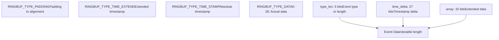
**Diagram: Ring Buffer Event Encoding**

The event format uses bit-packing to minimize space:

-   **type\_len field (5 bits)**: Encodes event type (padding, time extend, time stamp) or data length
-   **time\_delta field (27 bits)**: Stores timestamp delta from previous event
-   **array field**: Used for extended length when type\_len is 0, or for extended timestamp

This compressed format allows the ring buffer to store events with minimal per-event overhead while supporting precise timestamps.

Sources: [kernel/trace/ring\_buffer.c66-86](https://github.com/torvalds/linux/blob/fcb70a56/kernel/trace/ring_buffer.c#L66-L86) [kernel/trace/ring\_buffer.c202-242](https://github.com/torvalds/linux/blob/fcb70a56/kernel/trace/ring_buffer.c#L202-L242)

## Ftrace: Function Tracing Infrastructure

Ftrace provides comprehensive function call tracing with minimal runtime overhead through compiler instrumentation and dynamic patching.

### Ftrace Core Components

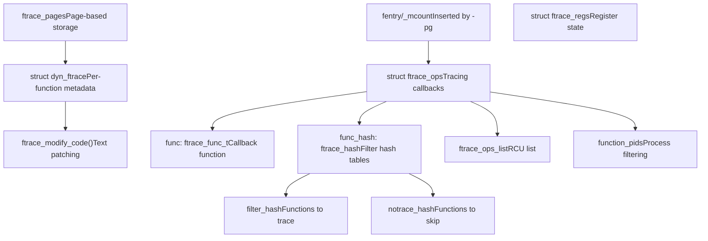
**Diagram: Ftrace Architecture and Control Flow**

Ftrace operates through multiple layers:

-   **Compiler Instrumentation**: GCC/Clang inserts `__fentry__` calls at function entry
-   **Dynamic Patching**: Runtime modification of instrumentation to enable/disable tracing
-   **Callback System**: `ftrace_ops` structures register callbacks with filtering
-   **Hash Tables**: Efficient filtering by function name or address

Sources: [kernel/trace/ftrace.c88-102](https://github.com/torvalds/linux/blob/fcb70a56/kernel/trace/ftrace.c#L88-L102) [kernel/trace/ftrace.c1143-1149](https://github.com/torvalds/linux/blob/fcb70a56/kernel/trace/ftrace.c#L1143-L1149) [include/linux/ftrace.h1-69](https://github.com/torvalds/linux/blob/fcb70a56/include/linux/ftrace.h#L1-L69)

### Ftrace Operations and Filtering

The `struct ftrace_ops` provides the interface for function tracing consumers:

| Field | Type | Purpose |
| --- | --- | --- |
| `func` | `ftrace_func_t` | Callback invoked for each traced function |
| `flags` | `unsigned long` | Operational flags (SAVE\_REGS, PID, etc.) |
| `func_hash` | `struct ftrace_hash*` | Hash tables for filtering |
| `local_hash.filter_hash` | `struct ftrace_hash*` | Functions to include |
| `local_hash.notrace_hash` | `struct ftrace_hash*` | Functions to exclude |
| `trampoline` | `unsigned long` | Custom trampoline address |

The filtering system uses hash tables to efficiently determine which functions to trace. The `ftrace_hash` structure [kernel/trace/ftrace.c1087-1090](https://github.com/torvalds/linux/blob/fcb70a56/kernel/trace/ftrace.c#L1087-L1090) contains buckets of `ftrace_func_entry` elements indexed by function address.

Process-level filtering is achieved through `trace_pid_list` structures that store sets of PIDs to trace or exclude.

Sources: [kernel/trace/ftrace.c1092-1099](https://github.com/torvalds/linux/blob/fcb70a56/kernel/trace/ftrace.c#L1092-L1099) [kernel/trace/trace.c652-724](https://github.com/torvalds/linux/blob/fcb70a56/kernel/trace/trace.c#L652-L724)

### Dynamic Function Patching

When `CONFIG_DYNAMIC_FTRACE` is enabled, ftrace uses runtime code modification to minimize overhead:

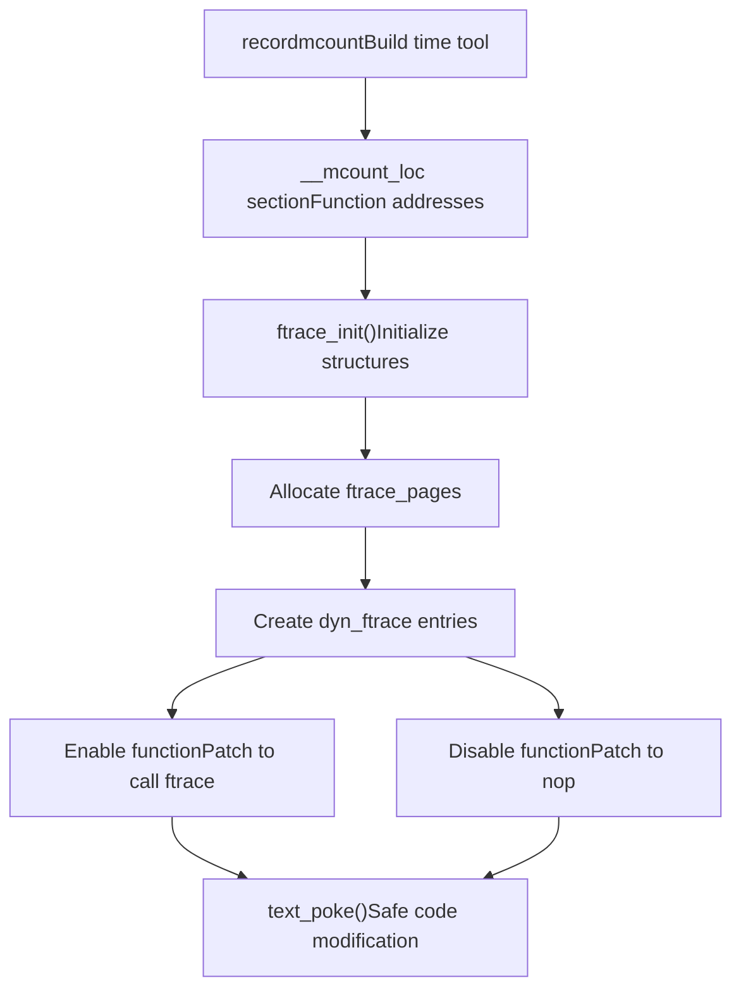
**Diagram: Dynamic Ftrace Initialization and Runtime Patching**

The process works as follows:

1.  **Build Time**: `recordmcount` tool identifies all function entry points
2.  **Boot Time**: `ftrace_init()` creates `dyn_ftrace` entries for each function
3.  **Runtime**: Code is patched to either call ftrace handlers or execute as NOPs

This allows tracing to be enabled/disabled with zero overhead when disabled.

Sources: [kernel/trace/ftrace.c1143-1153](https://github.com/torvalds/linux/blob/fcb70a56/kernel/trace/ftrace.c#L1143-L1153) [kernel/trace/ftrace.c331-392](https://github.com/torvalds/linux/blob/fcb70a56/kernel/trace/ftrace.c#L331-L392)

## Trace Events and Tracepoints

Trace events provide static instrumentation points throughout the kernel using the `TRACE_EVENT()` macro system.

### Trace Event Architecture

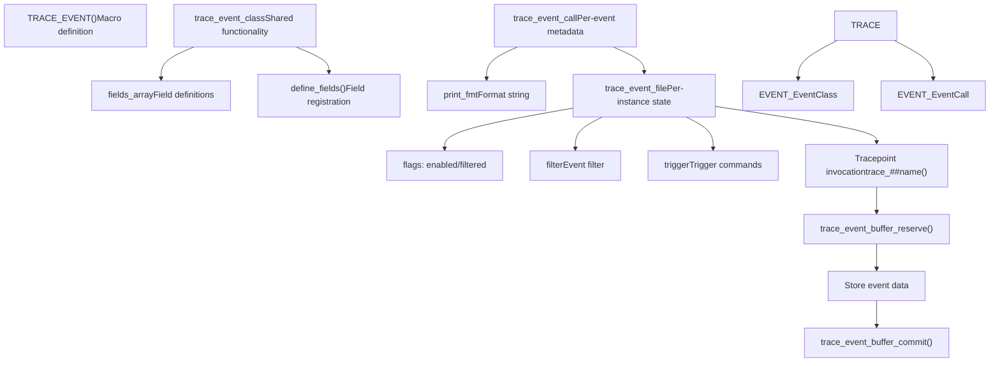
**Diagram: Trace Event Infrastructure**

The trace event system uses code generation to create efficient tracing code:

-   **TRACE\_EVENT() macro**: Defines event name, arguments, fields, and print format
-   **trace\_event\_class**: Shared code for events with the same signature
-   **trace\_event\_call**: Per-event metadata including name, system, and format
-   **trace\_event\_file**: Per-instance state tracking enabled/filtered status

Sources: [kernel/trace/trace\_events.c1-49](https://github.com/torvalds/linux/blob/fcb70a56/kernel/trace/trace_events.c#L1-L49) [kernel/trace/trace.h181-227](https://github.com/torvalds/linux/blob/fcb70a56/kernel/trace/trace.h#L181-L227) [include/linux/trace\_events.h1-700](https://github.com/torvalds/linux/blob/fcb70a56/include/linux/trace_events.h#L1-L700)

### Event Registration and Enablement

Trace events are registered at boot or module load time and can be dynamically enabled:

| State | Description | Implementation |
| --- | --- | --- |
| Registered | Event exists in system | `trace_event_call` in `ftrace_events` list |
| Enabled | Event records to buffer | `TRACE_EVENT_FL_ENABLED` flag set |
| Filtered | Event has filter | `event_filter` attached to `trace_event_file` |
| Triggered | Event has triggers | `event_trigger_data` list attached |

The enablement path flows through:

1.  User writes "1" to `events/<system>/<event>/enable`
2.  `event_enable_write()` processes the write [kernel/trace/trace\_events.c](https://github.com/torvalds/linux/blob/fcb70a56/kernel/trace/trace_events.c)
3.  Calls `ftrace_event_enable_disable()` to update state
4.  Updates flags and potentially registers/unregisters tracepoints

Sources: [kernel/trace/trace\_events.c618-700](https://github.com/torvalds/linux/blob/fcb70a56/kernel/trace/trace_events.c#L618-L700) [kernel/trace/trace.h324-449](https://github.com/torvalds/linux/blob/fcb70a56/kernel/trace/trace.h#L324-L449)

### Event Filtering

Events support runtime filtering using a simple expression language:

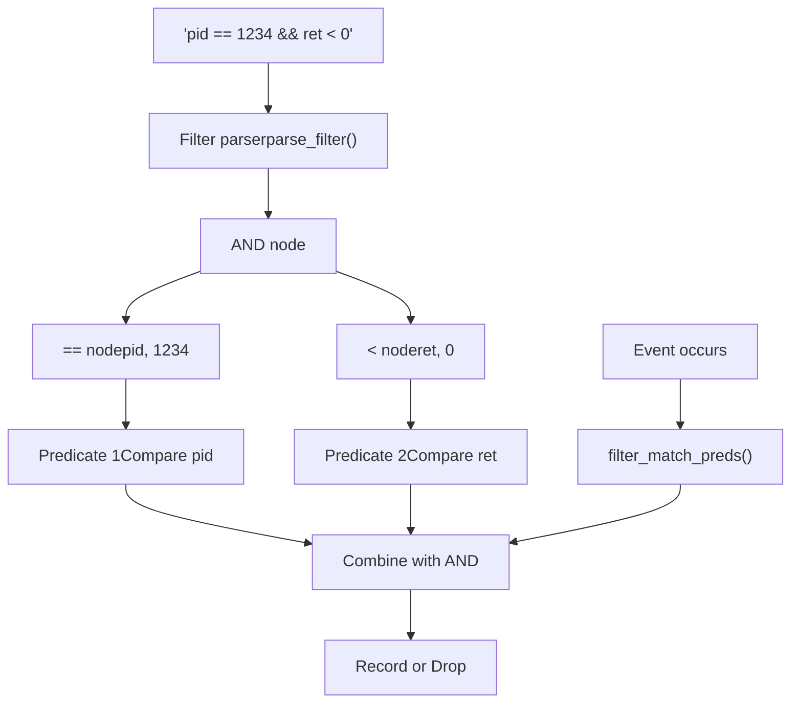
**Diagram: Event Filter Processing Pipeline**

Filters are compiled into a predicate tree that is evaluated when events occur. This allows efficient filtering without impacting unrelated events.

Sources: [kernel/trace/trace\_events.c1-700](https://github.com/torvalds/linux/blob/fcb70a56/kernel/trace/trace_events.c#L1-L700) [kernel/trace/trace\_events\_filter.c](https://github.com/torvalds/linux/blob/fcb70a56/kernel/trace/trace_events_filter.c)

## Dynamic Probes: kprobes, uprobes, fprobes

Dynamic probes allow instrumentation of arbitrary kernel and user-space functions without recompilation.

### Dynamic Probe Types

```mermaid
flowchart TD
    Kprobe_Define["trace_kprobestruct trace_probe"]
    Kprobe_Attach["Attach to kernel functionsymbol or address"]
    Kprobe_Handler["Pre/post handlerskprobe.h"]
    Uprobe_Define["trace_uprobestruct trace_probe"]
    Uprobe_Attach["Attach to user binarypath:offset"]
    Uprobe_Handler["Uprobe handlersuprobes.h"]
    Fprobe_Define["trace_fprobestruct trace_probe"]
    Fprobe_Attach["Attach to functionuses ftrace"]
    Fprobe_Handler["Entry/exit handlersfprobe.h"]
    TraceProbe["struct trace_probeCommon base"]
    ProbeArgs["tp.args[]Argument capture"]
    TraceEvent["trace_event_callGenerated event"]

    Kprobe --> Define_TraceProbe
    Uprobe --> Define_TraceProbe
    Fprobe --> Define_TraceProbe
    TraceProbe --> ProbeArgs
    TraceProbe --> TraceEvent
    Kprobe --> Attach_Kprobe_Handler
    Uprobe --> Attach_Uprobe_Handler
    Fprobe --> Attach_Fprobe_Handler
```
**Diagram: Dynamic Probe Types and Architecture**

All probe types share common infrastructure through `struct trace_probe` but differ in attachment mechanism:

-   **kprobes**: Use breakpoint or jump-based probing at kernel addresses
-   **uprobes**: Use breakpoint injection in user-space program text
-   **fprobes**: Leverage ftrace infrastructure for function entry/exit tracing

Sources: [kernel/trace/trace\_kprobe.c1-100](https://github.com/torvalds/linux/blob/fcb70a56/kernel/trace/trace_kprobe.c#L1-L100) [kernel/trace/trace\_uprobe.c1-100](https://github.com/torvalds/linux/blob/fcb70a56/kernel/trace/trace_uprobe.c#L1-L100) [kernel/trace/trace\_fprobe.c1-100](https://github.com/torvalds/linux/blob/fcb70a56/kernel/trace/trace_fprobe.c#L1-L100)

### Probe Event Creation and Arguments

Dynamic probes support flexible argument capture using fetch methods:

| Fetch Type | Syntax | Description | Implementation |
| --- | --- | --- | --- |
| Register | `%ax`, `%di` | CPU register value | `FETCH_OP_ARG` |
| Memory | `+0(%di)` | Dereference address | `FETCH_OP_DEREF` |
| Stack | `$stack0` | Stack argument | `FETCH_OP_STACK` |
| Return value | `$retval` | Function return | `FETCH_OP_RETVAL` |
| Symbol | `$comm` | Task comm string | Special handler |
| IMM | `\1234` | Immediate value | `FETCH_OP_IMM` |

Probe events are created through tracefs:

```
# Create kprobe event
echo 'p:myprobe do_sys_open filename=+0(%di):string flags=%si' > kprobe_events

# Create uprobe event
echo 'p:myuprobe /bin/bash:0x1234 arg1=%di' > uprobe_events

# Create fprobe event
echo 'f:myfprobe vfs_read count=%dx' > dynamic_events
```
The fetch instruction system is defined in [kernel/trace/trace\_probe.h100-200](https://github.com/torvalds/linux/blob/fcb70a56/kernel/trace/trace_probe.h#L100-L200) with execution in [kernel/trace/trace\_kprobe.c800-1000](https://github.com/torvalds/linux/blob/fcb70a56/kernel/trace/trace_kprobe.c#L800-L1000)

Sources: [kernel/trace/trace\_probe.c1-100](https://github.com/torvalds/linux/blob/fcb70a56/kernel/trace/trace_probe.c#L1-L100) [kernel/trace/trace\_probe.h100-300](https://github.com/torvalds/linux/blob/fcb70a56/kernel/trace/trace_probe.h#L100-L300)

### Fprobe and Function Graph Integration

Fprobes use ftrace's function entry mechanism but add sophisticated shadow stack management for return probes:

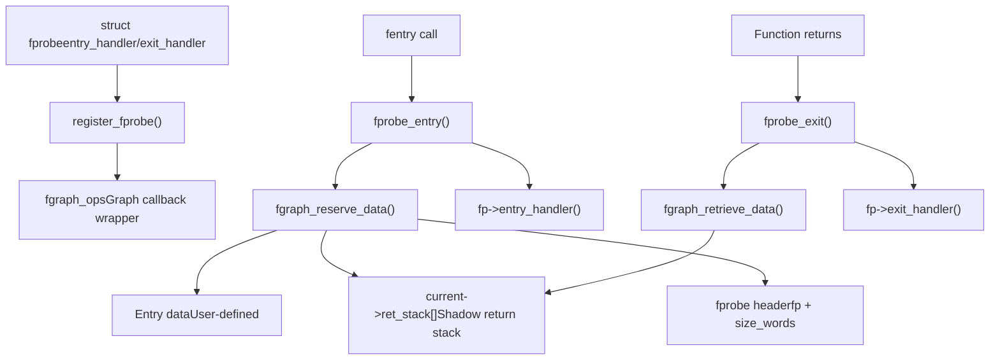
**Diagram: Fprobe Shadow Stack Management**

Fprobes integrate with the function graph tracer's shadow stack to track return addresses and store per-invocation data. This enables correlation of function entry and exit events with associated data.

Sources: [kernel/trace/fprobe.c160-238](https://github.com/torvalds/linux/blob/fcb70a56/kernel/trace/fprobe.c#L160-L238) [kernel/trace/fgraph.c1-200](https://github.com/torvalds/linux/blob/fcb70a56/kernel/trace/fgraph.c#L1-L200)

## Function Graph Tracer

The function graph tracer provides call/return tracing with timing information, creating a visual representation of kernel execution flow.

### Function Graph Infrastructure

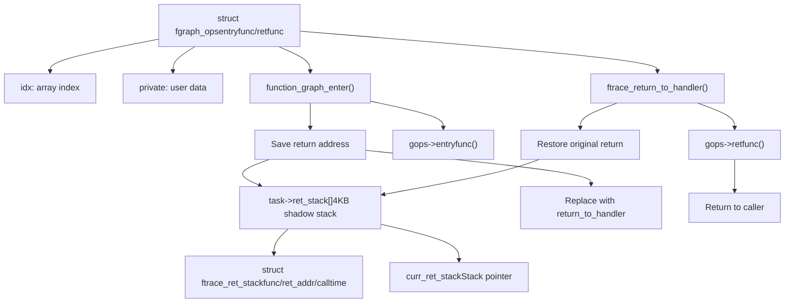
**Diagram: Function Graph Tracer Architecture**

The function graph tracer operates by hijacking function return addresses:

1.  **Entry**: Saves real return address, replaces with `return_to_handler`
2.  **Shadow Stack**: Maintains per-task stack of `ftrace_ret_stack` entries
3.  **Exit**: `return_to_handler` restores real return address and invokes callback
4.  **Multiple Ops**: Supports multiple concurrent graph operations via array indexing

Sources: [kernel/trace/fgraph.c1-300](https://github.com/torvalds/linux/blob/fcb70a56/kernel/trace/fgraph.c#L1-L300) [kernel/trace/trace\_functions\_graph.c1-100](https://github.com/torvalds/linux/blob/fcb70a56/kernel/trace/trace_functions_graph.c#L1-L100)

### Function Graph Data Structures

The shadow stack implementation uses careful memory layout for efficiency:

| Structure | Size | Purpose | Key Fields |
| --- | --- | --- | --- |
| `ftrace_ret_stack` | 32 bytes | Return stack entry | `ret` (return addr), `func` (function), `calltime` |
| Shadow stack | 4096 bytes | Per-task storage | `task->ret_stack[]` array |
| Bitmap header | 1 word | Entry metadata | Type, offset, index bitmap |
| Reserved data | Variable | Per-call data | Stored after entry, indexed by `gops->idx` |

The shadow stack format is documented extensively in [kernel/trace/fgraph.c22-99](https://github.com/torvalds/linux/blob/fcb70a56/kernel/trace/fgraph.c#L22-L99) Each entry uses a bitmap to track which `fgraph_ops` want their return function called, and additional words can store per-call data.

Sources: [kernel/trace/fgraph.c22-170](https://github.com/torvalds/linux/blob/fcb70a56/kernel/trace/fgraph.c#L22-L170) [kernel/trace/fgraph.c100-200](https://github.com/torvalds/linux/blob/fcb70a56/kernel/trace/fgraph.c#L100-L200)

### Graph Tracer Output Format

The function graph tracer produces hierarchical output showing call flow:

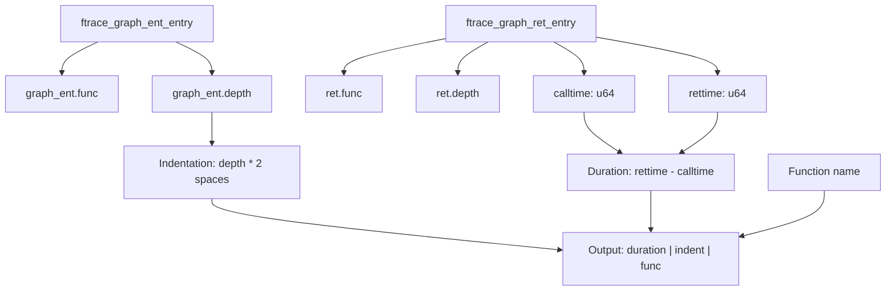
**Diagram: Function Graph Tracer Output Generation**

The tracer records both entry and return events, then formats them into a hierarchical display with timing information. Example output:

```
 0)               |  do_sys_open() {
 0)   0.123 us    |    getname();
 0)   0.456 us    |    path_lookup();
 0)   1.234 us    |  }
```
Sources: [kernel/trace/trace\_functions\_graph.c100-500](https://github.com/torvalds/linux/blob/fcb70a56/kernel/trace/trace_functions_graph.c#L100-L500)

## Histogram Triggers

Histogram triggers provide powerful in-kernel aggregation and analysis of trace event data.

### Histogram Architecture

```mermaid
flowchart TD
    HistTrigger["event_trigger_dataHistogram trigger"]
    HistData["hist_trigger_dataHistogram state"]
    HistAttrs["hist_trigger_attrsParsed attributes"]
    Keys["keys[]Grouping fields"]
    HistField["struct hist_fieldField descriptor"]
    FieldFn["fn: hist_field_fn_tValue extraction"]
    Vals["vals[]Aggregated values"]
    ValType["Type: counter/sum/avg"]
    ValOps["Operations: +/-/*/÷"]
    TracingMap["tracing_mapHash table"]
    MapElt["tracing_map_eltHistogram entry"]
    KeyVal["key + values[]"]
    OnMax["onmax/onchangeConditional actions"]
    SaveAction["save() actionVariable save"]
    SnapshotAction["snapshot() actionBuffer snapshot"]

    HistTrigger --> HistData
    HistData --> HistAttrs
    HistAttrs --> Keys
    HistAttrs --> Vals
    Keys --> HistField
    HistField --> FieldFn
    Vals --> ValType
    Vals --> ValOps
    HistData --> TracingMap
    TracingMap --> MapElt
    MapElt --> KeyVal
    HistData --> OnMax
    OnMax --> SaveAction
    OnMax --> SnapshotAction
```
**Diagram: Histogram Trigger Components**

Histogram triggers transform event streams into aggregated statistics:

-   **Keys**: Define grouping (e.g., by pid, cpu, function name)
-   **Values**: Accumulate data (counts, sums, averages)
-   **Tracing Map**: Efficient hash table for histogram storage
-   **Actions**: Conditional operations (snapshot on max, save variables)

Sources: [kernel/trace/trace\_events\_hist.c1-300](https://github.com/torvalds/linux/blob/fcb70a56/kernel/trace/trace_events_hist.c#L1-L300) [kernel/trace/tracing\_map.h](https://github.com/torvalds/linux/blob/fcb70a56/kernel/trace/tracing_map.h)

### Histogram Trigger Syntax

Histograms are created via tracefs with rich syntax:

| Component | Syntax | Example | Description |
| --- | --- | --- | --- |
| Keys | `keys=field1,field2` | `keys=pid,cpu` | Group by these fields |
| Values | `vals=field:op` | `vals=bytes:sum` | Aggregate with operation |
| Sort | `sort=key:order` | `sort=hitcount:desc` | Sort histogram output |
| Size | `size=N` | `size=2048` | Hash table size |
| Actions | `onmax($var).action` | `onmax($lat).snapshot()` | Trigger on condition |

Example histogram command:

```
echo 'hist:keys=pid:vals=bytes:sort=bytes:size=2048' > events/syscalls/sys_enter_read/trigger
```
Advanced features include:

-   **Variable References**: `$var`, `$var.field` for inter-event correlation
-   **Arithmetic**: `bytes/time` for calculated values
-   **Actions**: `snapshot()`, `save()`, synthetic event generation
-   **Filters**: Combine with event filters for selective aggregation

Sources: [kernel/trace/trace\_events\_hist.c4000-5000](https://github.com/torvalds/linux/blob/fcb70a56/kernel/trace/trace_events_hist.c#L4000-L5000)

### Histogram Tracing Map Implementation

The `tracing_map` provides efficient hash-based storage for histogram data:

```mermaid
flowchart TD
    TM_map["tracing_mapMap descriptor"]
    TM_ops["map_opsOperations"]
    TM_array["arraytracing_map_array[]"]
    TMA_entries["entries[]Per-CPU hash array"]
    TMA_n_entries["n_entriesArray size"]
    ELT_key["key[]Key values"]
    ELT_val["val[]Aggregated values"]
    ELT_var["var[]Variable storage"]
    Lookup["tracing_map_lookup()"]
    Insert["tracing_map_insert()"]
    Update["Update values"]

    TM --> map_TM_ops
    TM --> map_TM_array
    TM --> array_TMA_entries
    TMA --> entries_ELT_key
    ELT --> key_ELT_val
    ELT --> val_ELT_var
    Lookup --> TMA_entries
    Insert --> TMA_entries
    Update --> ELT_val
```
**Diagram: Tracing Map Data Structure**

The tracing map uses per-CPU hash tables to minimize lock contention:

-   **Hash Function**: Maps key tuple to array index
-   **Per-CPU Design**: Each CPU maintains its own map array
-   **Lockless Updates**: Values updated atomically per CPU
-   **Aggregation**: Results merged when reading histogram

This design allows high-frequency event aggregation with minimal overhead.

Sources: [kernel/trace/tracing\_map.c](https://github.com/torvalds/linux/blob/fcb70a56/kernel/trace/tracing_map.c) [kernel/trace/tracing\_map.h](https://github.com/torvalds/linux/blob/fcb70a56/kernel/trace/tracing_map.h)

## Tracefs Interface

The tracefs filesystem provides the primary user-space interface to the tracing infrastructure.

### Tracefs File Hierarchy

```mermaid
flowchart TD
    Root["tracing/ root"]
    TracingOn["tracing_onEnable/disable"]
    CurrentTracer["current_tracerSelect tracer"]
    TraceOptions["trace_optionsTracer flags"]
    BufferSize["buffer_size_kbRing buffer size"]
    Trace["traceFormatted output"]
    TracePipe["trace_pipeConsuming read"]
    RawTrace["trace_rawBinary output"]
    PerCPUTrace["per_cpu/cpu*/trace"]
    EventsDir["events/Event directory"]
    SystemDir["/Subsystem events"]
    EventEnable["/enable"]
    EventFormat["/format"]
    EventFilter["/filter"]
    EventTrigger["/trigger"]
    KprobeEvents["kprobe_eventskprobe definitions"]
    UprobeEvents["uprobe_eventsuprobe definitions"]
    DynamicEvents["dynamic_eventsfprobe/eprobe"]
    AvailFilterFuncs["available_filter_functions"]
    SetFtraceFilter["set_ftrace_filter"]
    SetFtraceNotrace["set_ftrace_notrace"]
    SetFtracePid["set_ftrace_pid"]

    Root --> TracingOn
    Root --> CurrentTracer
    Root --> TraceOptions
    Root --> BufferSize
    Root --> Trace
    Root --> TracePipe
    Root --> RawTrace
    Root --> PerCPUTrace
    Root --> EventsDir
    Root --> KprobeEvents
    Root --> UprobeEvents
    Root --> DynamicEvents
    Root --> AvailFilterFuncs
    Root --> SetFtraceFilter
    Root --> SetFtraceNotrace
    Root --> SetFtracePid
    EventsDir --> SystemDir
    SystemDir --> EventEnable
    SystemDir --> EventFormat
    SystemDir --> EventFilter
    SystemDir --> EventTrigger
```
**Diagram: Tracefs Filesystem Structure**

The tracefs hierarchy organizes tracing control and output:

-   **Control Files**: Enable/disable tracing, select tracer, configure options
-   **Output Files**: Read trace data in various formats
-   **Event Control**: Per-event enable, format, filter, trigger
-   **Dynamic Events**: Create/delete dynamic probes
-   **Function Tracing**: Filter which functions to trace

Sources: [kernel/trace/trace.c1-500](https://github.com/torvalds/linux/blob/fcb70a56/kernel/trace/trace.c#L1-L500) [kernel/trace/trace\_events.c1-500](https://github.com/torvalds/linux/blob/fcb70a56/kernel/trace/trace_events.c#L1-L500)

### Common Tracefs Operations

| Operation | File Path | Example | Effect |
| --- | --- | --- | --- |
| Enable tracing | `tracing_on` | `echo 1 > tracing_on` | Start recording events |
| Select tracer | `current_tracer` | `echo function_graph > current_tracer` | Switch to graph tracer |
| Enable event | `events/sched/sched_switch/enable` | `echo 1 > enable` | Enable sched\_switch event |
| Set filter | `events/sched/sched_switch/filter` | `echo 'pid == 1234' > filter` | Filter by condition |
| Create kprobe | `kprobe_events` | `echo 'p:probe1 vfs_read' >> kprobe_events` | Add kprobe |
| Read trace | `trace` | `cat trace` | Read formatted trace |
| Stream trace | `trace_pipe` | `cat trace_pipe` | Blocking trace read |
| Set func filter | `set_ftrace_filter` | `echo 'vfs_*' > set_ftrace_filter` | Trace vfs\_\* functions |

The interface is designed for both interactive use and programmatic control through simple file operations.

Sources: [kernel/trace/trace.c5000-7000](https://github.com/torvalds/linux/blob/fcb70a56/kernel/trace/trace.c#L5000-L7000)

## Tracer Plugins

The tracing infrastructure supports pluggable tracers through the `struct tracer` interface.

### Tracer Plugin Interface

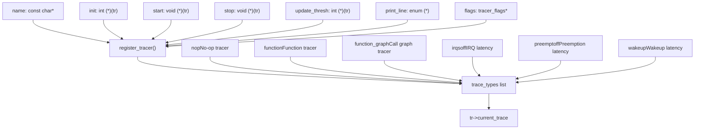
**Diagram: Tracer Plugin Architecture**

Tracers implement a standard interface:

-   **Lifecycle**: `init()`, `start()`, `stop()` control tracer state
-   **Output**: `print_line()` formats trace output
-   **Configuration**: `tracer_flags` for per-tracer options
-   **Registration**: Added to global list, selectable via `current_tracer`

Sources: [kernel/trace/trace.h610-650](https://github.com/torvalds/linux/blob/fcb70a56/kernel/trace/trace.h#L610-L650) [kernel/trace/trace.c946-952](https://github.com/torvalds/linux/blob/fcb70a56/kernel/trace/trace.c#L946-L952)

### Latency Tracers

Latency tracers measure maximum latencies for specific events:

| Tracer | Purpose | Measures | Implementation |
| --- | --- | --- | --- |
| `irqsoff` | IRQ disable latency | Time with IRQs disabled | [kernel/trace/trace\_irqsoff.c](https://github.com/torvalds/linux/blob/fcb70a56/kernel/trace/trace_irqsoff.c) |
| `preemptoff` | Preemption latency | Time with preemption disabled | [kernel/trace/trace\_irqsoff.c](https://github.com/torvalds/linux/blob/fcb70a56/kernel/trace/trace_irqsoff.c) |
| `preemptirqsoff` | Combined latency | IRQ or preempt disabled | [kernel/trace/trace\_irqsoff.c](https://github.com/torvalds/linux/blob/fcb70a56/kernel/trace/trace_irqsoff.c) |
| `wakeup` | Wakeup latency | Time from wakeup to schedule | [kernel/trace/trace\_sched\_wakeup.c](https://github.com/torvalds/linux/blob/fcb70a56/kernel/trace/trace_sched_wakeup.c) |
| `wakeup_rt` | RT wakeup latency | RT task wakeup latency | [kernel/trace/trace\_sched\_wakeup.c](https://github.com/torvalds/linux/blob/fcb70a56/kernel/trace/trace_sched_wakeup.c) |

These tracers use the snapshot buffer to capture the longest latency period:

1.  Trace function calls continuously
2.  Detect start of latency period (e.g., IRQs disabled)
3.  When period ends, compare duration to maximum
4.  If new maximum, snapshot trace buffer
5.  Report maximum latency and backtrace

Sources: [kernel/trace/trace\_irqsoff.c1-100](https://github.com/torvalds/linux/blob/fcb70a56/kernel/trace/trace_irqsoff.c#L1-L100) [kernel/trace/trace\_sched\_wakeup.c1-100](https://github.com/torvalds/linux/blob/fcb70a56/kernel/trace/trace_sched_wakeup.c#L1-L100)

## Performance Considerations

The tracing infrastructure is designed for minimal overhead when enabled and zero overhead when disabled.

### Overhead Mitigation Techniques

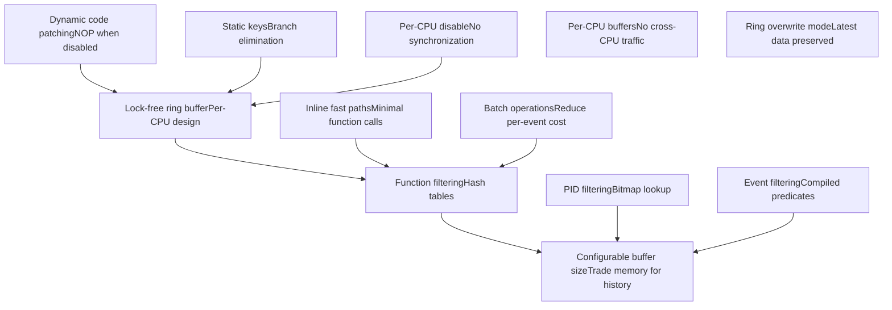
**Diagram: Performance Optimization Strategies**

Key performance techniques:

-   **Dynamic Patching**: Function calls replaced with NOPs when tracing disabled
-   **Static Keys**: Branch prediction eliminated for disabled features
-   **Lock-Free Ring Buffer**: Per-CPU design eliminates locking overhead
-   **Filtering**: Early filtering prevents unnecessary data capture
-   **Per-CPU Architecture**: Eliminates cache-line bouncing and synchronization

Sources: [kernel/trace/ring\_buffer.c1-500](https://github.com/torvalds/linux/blob/fcb70a56/kernel/trace/ring_buffer.c#L1-L500) [kernel/trace/ftrace.c1-500](https://github.com/torvalds/linux/blob/fcb70a56/kernel/trace/ftrace.c#L1-L500)

### Buffer Management

The ring buffer uses sophisticated page management for efficiency:

| Feature | Implementation | Benefit |
| --- | --- | --- |
| Per-CPU buffers | Separate buffer per CPU | No cross-CPU synchronization |
| Lock-free writes | Atomic operations | Minimal writer overhead |
| Reader page swap | Dedicated reader page | Writers never blocked by readers |
| Overwrite mode | Ring wraps, drops old | Always has recent data |
| Non-overwrite mode | Stops when full | Preserves all data |
| Variable page size | Configurable pages | Memory/history tradeoff |

The buffer automatically expands from a small default size [kernel/trace/trace.c942](https://github.com/torvalds/linux/blob/fcb70a56/kernel/trace/trace.c#L942-L942) when tracing starts, reducing memory usage when tracing is disabled.

Sources: [kernel/trace/ring\_buffer.c88-154](https://github.com/torvalds/linux/blob/fcb70a56/kernel/trace/ring_buffer.c#L88-L154) [kernel/trace/trace.c932-944](https://github.com/torvalds/linux/blob/fcb70a56/kernel/trace/trace.c#L932-L944)

## Integration with Other Subsystems

The tracing infrastructure integrates deeply with other kernel subsystems.

### Scheduler Integration

The scheduler uses trace events extensively for performance analysis:

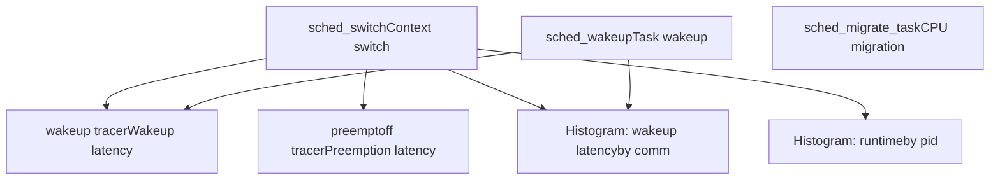
**Diagram: Scheduler Tracing Integration**

Scheduler events enable:

-   Latency measurement (wakeup, preemption, IRQ)
-   Performance profiling (runtime distribution, migration patterns)
-   Behavioral analysis (task interactions, scheduling decisions)

For information on scheduler internals, see [Process Scheduling and sched\_ext](/torvalds/linux/4.1-process-scheduling-and-sched_ext).

Sources: [include/trace/events/sched.h](https://github.com/torvalds/linux/blob/fcb70a56/include/trace/events/sched.h) [kernel/trace/trace\_sched\_wakeup.c](https://github.com/torvalds/linux/blob/fcb70a56/kernel/trace/trace_sched_wakeup.c)

### BPF Integration

BPF programs can access tracing infrastructure:

| Integration Point | Description | Use Case |
| --- | --- | --- |
| `bpf_trace_printk()` | Print to trace buffer | Debug output from BPF |
| Kprobe BPF | Attach BPF to kprobes | Dynamic instrumentation |
| Tracepoint BPF | Attach BPF to events | Event-driven programs |
| Fentry/Fexit | Direct function tracing | Low-overhead tracing |

BPF programs can both produce trace data and consume it for decision-making.

Sources: [kernel/trace/trace\_kprobe.c](https://github.com/torvalds/linux/blob/fcb70a56/kernel/trace/trace_kprobe.c) [kernel/trace/bpf\_trace.c](https://github.com/torvalds/linux/blob/fcb70a56/kernel/trace/bpf_trace.c)

### Synthetic Events

Synthetic events allow creation of custom events from existing trace data:

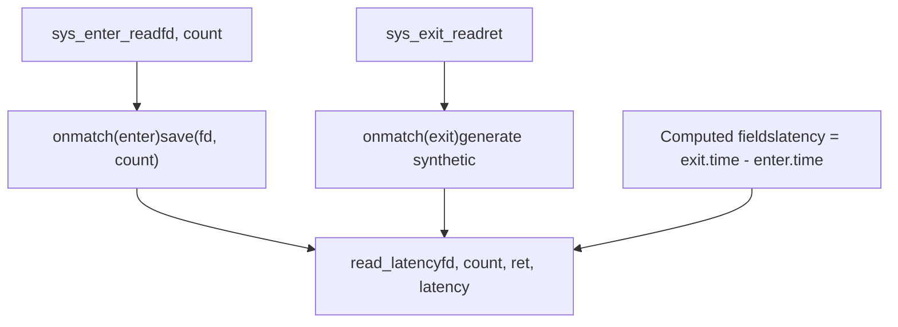
**Diagram: Synthetic Event Creation**

Synthetic events correlate data across multiple events, enabling complex analysis:

-   Match events by common fields
-   Save variables from earlier events
-   Generate new events with computed fields
-   Enable histogram analysis of derived metrics

Sources: [kernel/trace/trace\_events\_synth.c1-500](https://github.com/torvalds/linux/blob/fcb70a56/kernel/trace/trace_events_synth.c#L1-L500) [kernel/trace/trace\_events\_hist.c4000-5000](https://github.com/torvalds/linux/blob/fcb70a56/kernel/trace/trace_events_hist.c#L4000-L5000)

## Summary

The Linux kernel tracing infrastructure provides a comprehensive, low-overhead system for observing kernel behavior. Key components include:

-   **Ring Buffer**: Lock-free per-CPU circular buffers for efficient data storage
-   **Ftrace**: Function-level tracing with dynamic patching and filtering
-   **Trace Events**: Static tracepoints with rich formatting and filtering
-   **Dynamic Probes**: Runtime instrumentation via kprobes, uprobes, and fprobes
-   **Function Graph**: Call/return tracing with timing and hierarchy
-   **Histogram Triggers**: In-kernel aggregation and analysis
-   **Tracefs Interface**: User-space control via filesystem operations

This infrastructure enables performance analysis, debugging, and behavioral understanding of the kernel with minimal runtime overhead.

Sources: [kernel/trace/trace.c](https://github.com/torvalds/linux/blob/fcb70a56/kernel/trace/trace.c) [kernel/trace/ftrace.c](https://github.com/torvalds/linux/blob/fcb70a56/kernel/trace/ftrace.c) [kernel/trace/ring\_buffer.c](https://github.com/torvalds/linux/blob/fcb70a56/kernel/trace/ring_buffer.c) [kernel/trace/trace\_events.c](https://github.com/torvalds/linux/blob/fcb70a56/kernel/trace/trace_events.c) [kernel/trace/trace\_events\_hist.c](https://github.com/torvalds/linux/blob/fcb70a56/kernel/trace/trace_events_hist.c)
