# Build System and Kbuild

Relevant source files

-   [.gitignore](https://github.com/torvalds/linux/blob/fcb70a56/.gitignore)
-   [Documentation/kbuild/reproducible-builds.rst](https://github.com/torvalds/linux/blob/fcb70a56/Documentation/kbuild/reproducible-builds.rst)
-   [Makefile](https://github.com/torvalds/linux/blob/fcb70a56/Makefile)
-   [arch/mips/Makefile.postlink](https://github.com/torvalds/linux/blob/fcb70a56/arch/mips/Makefile.postlink)
-   [arch/riscv/Makefile.postlink](https://github.com/torvalds/linux/blob/fcb70a56/arch/riscv/Makefile.postlink)
-   [arch/riscv/boot/Makefile](https://github.com/torvalds/linux/blob/fcb70a56/arch/riscv/boot/Makefile)
-   [arch/s390/Makefile.postlink](https://github.com/torvalds/linux/blob/fcb70a56/arch/s390/Makefile.postlink)
-   [arch/x86/boot/startup/Makefile](https://github.com/torvalds/linux/blob/fcb70a56/arch/x86/boot/startup/Makefile)
-   [arch/x86/include/asm/setup.h](https://github.com/torvalds/linux/blob/fcb70a56/arch/x86/include/asm/setup.h)
-   [arch/x86/mm/mem\_encrypt\_boot.S](https://github.com/torvalds/linux/blob/fcb70a56/arch/x86/mm/mem_encrypt_boot.S)
-   [mm/kasan/Makefile](https://github.com/torvalds/linux/blob/fcb70a56/mm/kasan/Makefile)
-   [rust/Makefile](https://github.com/torvalds/linux/blob/fcb70a56/rust/Makefile)
-   [rust/helpers/bug.c](https://github.com/torvalds/linux/blob/fcb70a56/rust/helpers/bug.c)
-   [rust/helpers/jump\_label.c](https://github.com/torvalds/linux/blob/fcb70a56/rust/helpers/jump_label.c)
-   [rust/kernel/.gitignore](https://github.com/torvalds/linux/blob/fcb70a56/rust/kernel/.gitignore)
-   [rust/kernel/bug.rs](https://github.com/torvalds/linux/blob/fcb70a56/rust/kernel/bug.rs)
-   [rust/kernel/generated\_arch\_reachable\_asm.rs.S](https://github.com/torvalds/linux/blob/fcb70a56/rust/kernel/generated_arch_reachable_asm.rs.S)
-   [rust/kernel/generated\_arch\_static\_branch\_asm.rs.S](https://github.com/torvalds/linux/blob/fcb70a56/rust/kernel/generated_arch_static_branch_asm.rs.S)
-   [rust/kernel/generated\_arch\_warn\_asm.rs.S](https://github.com/torvalds/linux/blob/fcb70a56/rust/kernel/generated_arch_warn_asm.rs.S)
-   [rust/kernel/jump\_label.rs](https://github.com/torvalds/linux/blob/fcb70a56/rust/kernel/jump_label.rs)
-   [scripts/Makefile.build](https://github.com/torvalds/linux/blob/fcb70a56/scripts/Makefile.build)
-   [scripts/Makefile.lib](https://github.com/torvalds/linux/blob/fcb70a56/scripts/Makefile.lib)
-   [scripts/generate\_rust\_analyzer.py](https://github.com/torvalds/linux/blob/fcb70a56/scripts/generate_rust_analyzer.py)
-   [scripts/livepatch/fix-patch-lines](https://github.com/torvalds/linux/blob/fcb70a56/scripts/livepatch/fix-patch-lines)
-   [scripts/livepatch/klp-build](https://github.com/torvalds/linux/blob/fcb70a56/scripts/livepatch/klp-build)
-   [scripts/misc-check](https://github.com/torvalds/linux/blob/fcb70a56/scripts/misc-check)
-   [tools/objtool/klp-diff.c](https://github.com/torvalds/linux/blob/fcb70a56/tools/objtool/klp-diff.c)
-   [tools/power/cpupower/.gitignore](https://github.com/torvalds/linux/blob/fcb70a56/tools/power/cpupower/.gitignore)

## Purpose and Scope

This document describes the Linux kernel build system, known as Kbuild, which orchestrates the compilation of the kernel and its modules from C, assembly, and Rust source files. The build system handles configuration management, dependency tracking, cross-compilation, out-of-tree builds, external modules, and Rust integration.

For information about specific kernel subsystems being built, see their respective documentation (e.g., [Rust for Linux](/torvalds/linux/2-rust-for-linux), [Process Scheduling](/torvalds/linux/4.1-process-scheduling-and-sched_ext)). For kernel configuration options, this document covers how Kconfig integrates with the build, but not the configuration options themselves.

## Kbuild System Architecture

### Recursive Make Structure

Kbuild uses a recursive make approach where the top-level Makefile invokes `make` on subdirectories. Each subdirectory contains a Makefile or Kbuild file that specifies what to build.

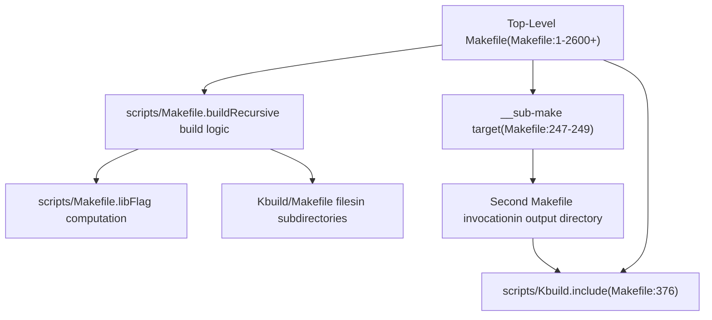
**Sources:** [Makefile239-249](https://github.com/torvalds/linux/blob/fcb70a56/Makefile#L239-L249) [Makefile376](https://github.com/torvalds/linux/blob/fcb70a56/Makefile#L376-L376) [scripts/Makefile.build1-40](https://github.com/torvalds/linux/blob/fcb70a56/scripts/Makefile.build#L1-L40)

### Key Build Files

| File | Purpose | Line References |
| --- | --- | --- |
| `Makefile` | Top-level build orchestration, tool selection, flag definitions | [Makefile1-2600](https://github.com/torvalds/linux/blob/fcb70a56/Makefile#L1-L2600) |
| `scripts/Kbuild.include` | Common make utilities and helper functions | [Makefile376](https://github.com/torvalds/linux/blob/fcb70a56/Makefile#L376-L376) |
| `scripts/Makefile.build` | Recursive directory building, compilation rules | [scripts/Makefile.build1-530](https://github.com/torvalds/linux/blob/fcb70a56/scripts/Makefile.build#L1-L530) |
| `scripts/Makefile.lib` | Flag computation, sanitizer integration, objtool | [scripts/Makefile.lib1-492](https://github.com/torvalds/linux/blob/fcb70a56/scripts/Makefile.lib#L1-L492) |
| `scripts/Makefile.compiler` | Compiler capability detection | [Makefile724](https://github.com/torvalds/linux/blob/fcb70a56/Makefile#L724-L724) |
| `rust/Makefile` | Rust-specific build rules and bindgen | [rust/Makefile1-695](https://github.com/torvalds/linux/blob/fcb70a56/rust/Makefile#L1-L695) |

**Sources:** [Makefile376](https://github.com/torvalds/linux/blob/fcb70a56/Makefile#L376-L376) [Makefile724](https://github.com/torvalds/linux/blob/fcb70a56/Makefile#L724-L724) [scripts/Makefile.build35-38](https://github.com/torvalds/linux/blob/fcb70a56/scripts/Makefile.build#L35-L38)

## Configuration System Integration

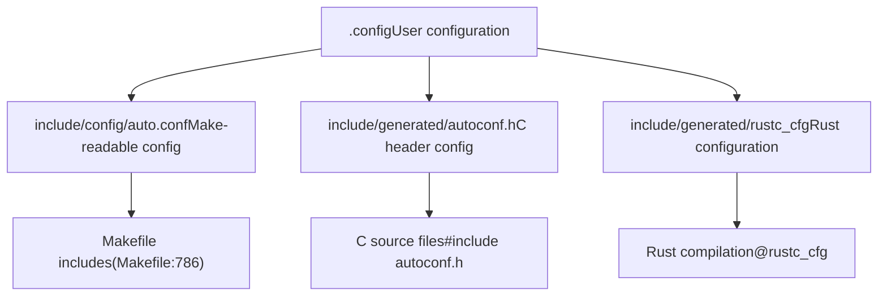
The configuration system uses Kconfig to generate multiple output formats:

-   `.config` - Human-editable configuration file
-   `include/config/auto.conf` - Make-readable variable definitions included by Makefiles
-   `include/generated/autoconf.h` - C preprocessor definitions
-   `include/generated/rustc_cfg` - Rust `--cfg` flags

The `syncconfig` target (invoked automatically) regenerates these files when `.config` changes.

**Sources:** [Makefile785-862](https://github.com/torvalds/linux/blob/fcb70a56/Makefile#L785-L862) [Makefile860-862](https://github.com/torvalds/linux/blob/fcb70a56/Makefile#L860-L862) [rust/Makefile162](https://github.com/torvalds/linux/blob/fcb70a56/rust/Makefile#L162-L162)

## Build Phases and Targets

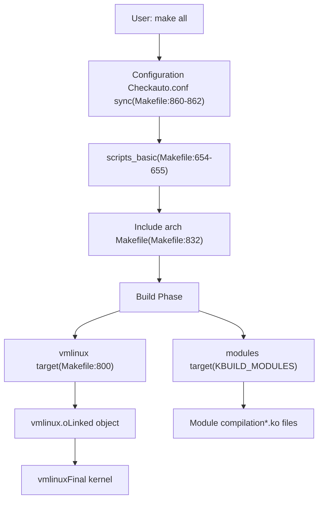
### Core Build Targets

| Target | Purpose | Key Variables |
| --- | --- | --- |
| `all` | Default target, builds vmlinux and modules | `__all` [Makefile752-755](https://github.com/torvalds/linux/blob/fcb70a56/Makefile#L752-L755) |
| `vmlinux` | Build the kernel binary | [Makefile800](https://github.com/torvalds/linux/blob/fcb70a56/Makefile#L800-L800) |
| `modules` | Build loadable kernel modules | `KBUILD_MODULES` [Makefile763-781](https://github.com/torvalds/linux/blob/fcb70a56/Makefile#L763-L781) |
| `clean` | Remove build artifacts | `clean-targets` [Makefile293](https://github.com/torvalds/linux/blob/fcb70a56/Makefile#L293-L293) |
| `mrproper` | Remove all generated files | [Makefile293](https://github.com/torvalds/linux/blob/fcb70a56/Makefile#L293-L293) |
| `*config` | Configuration targets (menuconfig, etc.) | [Makefile738-742](https://github.com/torvalds/linux/blob/fcb70a56/Makefile#L738-L742) |

**Sources:** [Makefile752-800](https://github.com/torvalds/linux/blob/fcb70a56/Makefile#L752-L800) [Makefile763-781](https://github.com/torvalds/linux/blob/fcb70a56/Makefile#L763-L781) [Makefile738-742](https://github.com/torvalds/linux/blob/fcb70a56/Makefile#L738-L742)

## Compiler and Tool Selection

### Tool Variables

The build system selects compilers and tools based on configuration and command-line overrides:

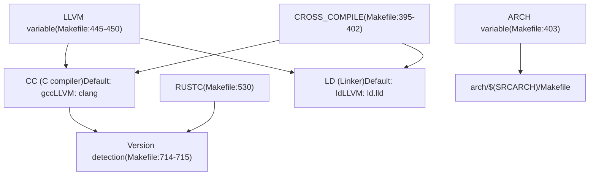
| Variable | Default | With LLVM | Purpose |
| --- | --- | --- | --- |
| `CC` | `$(CROSS_COMPILE)gcc` | `$(LLVM_PREFIX)clang$(LLVM_SUFFIX)` | C compiler [Makefile511-521](https://github.com/torvalds/linux/blob/fcb70a56/Makefile#L511-L521) |
| `RUSTC` | `rustc` | `rustc` | Rust compiler [Makefile530](https://github.com/torvalds/linux/blob/fcb70a56/Makefile#L530-L530) |
| `LD` | `$(CROSS_COMPILE)ld` | `$(LLVM_PREFIX)ld.lld$(LLVM_SUFFIX)` | Linker [Makefile513-522](https://github.com/torvalds/linux/blob/fcb70a56/Makefile#L513-L522) |
| `AR` | `$(CROSS_COMPILE)ar` | `$(LLVM_PREFIX)llvm-ar$(LLVM_SUFFIX)` | Archiver [Makefile514-523](https://github.com/torvalds/linux/blob/fcb70a56/Makefile#L514-L523) |
| `BINDGEN` | `bindgen` | `bindgen` | Rust binding generator [Makefile534](https://github.com/torvalds/linux/blob/fcb70a56/Makefile#L534-L534) |

**Sources:** [Makefile445-534](https://github.com/torvalds/linux/blob/fcb70a56/Makefile#L445-L534) [Makefile627-632](https://github.com/torvalds/linux/blob/fcb70a56/Makefile#L627-L632)

## Flag Management

### Flag Composition

Compilation flags are composed from multiple sources with specific precedence:

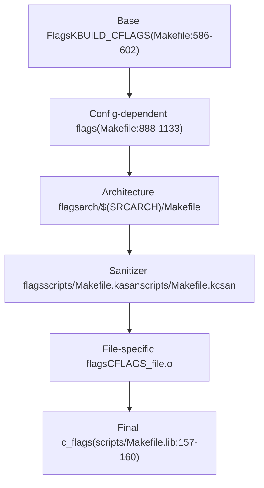
### C Compilation Flags

The final `c_flags` used for C compilation is computed in [scripts/Makefile.lib157-160](https://github.com/torvalds/linux/blob/fcb70a56/scripts/Makefile.lib#L157-L160):

```
c_flags = -Wp,-MMD,$(depfile) $(NOSTDINC_FLAGS) $(LINUXINCLUDE) \
          -include $(srctree)/include/linux/compiler_types.h \
          $(_c_flags) $(modkern_cflags) \
          $(basename_flags) $(modname_flags)
```
Where:

-   `_c_flags` includes base KBUILD\_CFLAGS plus sanitizer flags [scripts/Makefile.lib26-29](https://github.com/torvalds/linux/blob/fcb70a56/scripts/Makefile.lib#L26-L29)
-   `modkern_cflags` differs for built-in vs. module code [scripts/Makefile.lib143-146](https://github.com/torvalds/linux/blob/fcb70a56/scripts/Makefile.lib#L143-L146)
-   `basename_flags` defines `KBUILD_BASENAME` [scripts/Makefile.lib21](https://github.com/torvalds/linux/blob/fcb70a56/scripts/Makefile.lib#L21-L21)
-   `modname_flags` defines `KBUILD_MODNAME` [scripts/Makefile.lib22-23](https://github.com/torvalds/linux/blob/fcb70a56/scripts/Makefile.lib#L22-L23)

**Sources:** [scripts/Makefile.lib26-160](https://github.com/torvalds/linux/blob/fcb70a56/scripts/Makefile.lib#L26-L160) [Makefile586-602](https://github.com/torvalds/linux/blob/fcb70a56/Makefile#L586-L602)

### Rust Compilation Flags

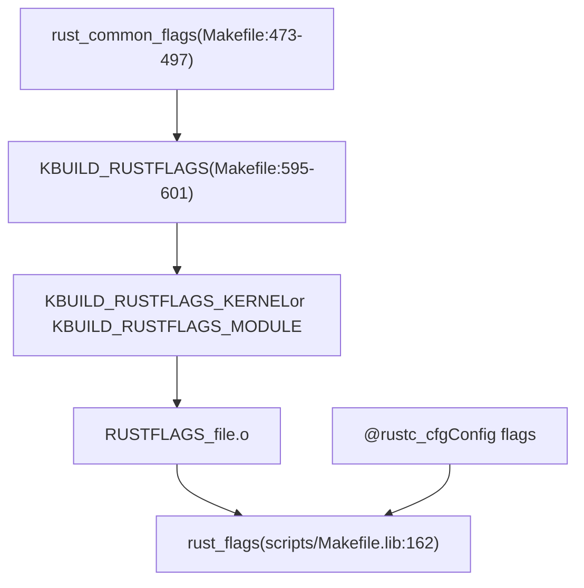
The `rust_common_flags` [Makefile473-497](https://github.com/torvalds/linux/blob/fcb70a56/Makefile#L473-L497) includes:

-   Edition 2021
-   Clippy lints
-   Feature flags
-   Warning configurations

Kernel-specific flags [Makefile595-601](https://github.com/torvalds/linux/blob/fcb70a56/Makefile#L595-L601) add:

-   `-Cpanic=abort`
-   `-Clto=n`
-   `-Ccodegen-units=1`
-   `-Csymbol-mangling-version=v0`

**Sources:** [Makefile473-601](https://github.com/torvalds/linux/blob/fcb70a56/Makefile#L473-L601) [scripts/Makefile.lib30-162](https://github.com/torvalds/linux/blob/fcb70a56/scripts/Makefile.lib#L30-L162)

## Rust Integration

### Rust Build Components

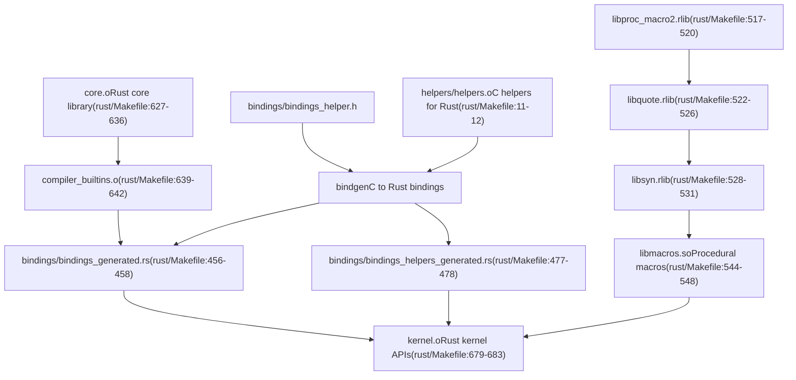
### Binding Generation

The `bindgen` tool generates Rust FFI bindings from C headers:

**Main Bindings** [rust/Makefile456-458](https://github.com/torvalds/linux/blob/fcb70a56/rust/Makefile#L456-L458):

-   Input: `bindings/bindings_helper.h`
-   Output: `bindings/bindings_generated.rs`
-   Flags: `--use-core --with-derive-default --ctypes-prefix ffi`

**Helper Bindings** [rust/Makefile477-478](https://github.com/torvalds/linux/blob/fcb70a56/rust/Makefile#L477-L478):

-   Input: `helpers/helpers.c` (compiled)
-   Output: `bindings/bindings_helpers_generated.rs`
-   Extracts `rust_helper_*` function prototypes

### Rust Compilation Command

For kernel Rust code [scripts/Makefile.build325-335](https://github.com/torvalds/linux/blob/fcb70a56/scripts/Makefile.build#L325-L335):

```
rust_common_cmd = \
    OBJTREE=$(abspath $(objtree)) \
    RUST_MODFILE=$(modfile) $(RUSTC_OR_CLIPPY) $(rust_flags) \
    -Zallow-features=$(rust_allowed_features) \
    -Zcrate-attr=no_std \
    --extern pin_init --extern kernel \
    --crate-type rlib -L $(objtree)/rust/ \
    --sysroot=/dev/null \
    --out-dir $(dir $@) --emit=dep-info=$(depfile)
```
**Sources:** [rust/Makefile6-695](https://github.com/torvalds/linux/blob/fcb70a56/rust/Makefile#L6-L695) [scripts/Makefile.build320-354](https://github.com/torvalds/linux/blob/fcb70a56/scripts/Makefile.build#L320-L354) [scripts/generate\_rust\_analyzer.py1-227](https://github.com/torvalds/linux/blob/fcb70a56/scripts/generate_rust_analyzer.py#L1-L227)

## Module Building

### Object Categories

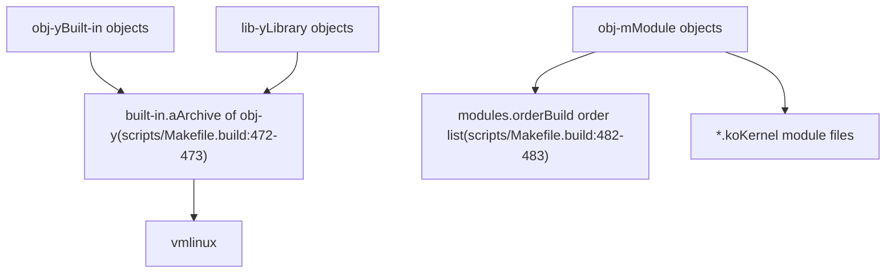
### Module Compilation

Each directory's Makefile or Kbuild file specifies objects:

```
obj-y += built_in_file.o
obj-m += module_file.o
lib-y += library_file.o

module_file-y := src1.o src2.o  # Composite module
```
The build system processes these:

1.  **Built-in objects** (`obj-y`) are compiled and archived into `built-in.a` [scripts/Makefile.build472-473](https://github.com/torvalds/linux/blob/fcb70a56/scripts/Makefile.build#L472-L473)
2.  **Module objects** (`obj-m`) are compiled and linked into `.ko` files [scripts/Makefile.build492-503](https://github.com/torvalds/linux/blob/fcb70a56/scripts/Makefile.build#L492-L503)
3.  **Library objects** (`lib-y`) are archived into `lib.a` [scripts/Makefile.build489-490](https://github.com/torvalds/linux/blob/fcb70a56/scripts/Makefile.build#L489-L490)

### Module Linking

For multi-file modules [scripts/Makefile.build500-503](https://github.com/torvalds/linux/blob/fcb70a56/scripts/Makefile.build#L500-L503):

```
cmd_ld_multi_m = $(LD) $(ld_flags) -r -o $@ @$< $(cmd_objtool)
```
This links multiple `.o` files into a single module `.o`, which is then packaged as `.ko`.

**Sources:** [scripts/Makefile.build14-503](https://github.com/torvalds/linux/blob/fcb70a56/scripts/Makefile.build#L14-L503)

## Dependency Tracking

### Dependency Generation

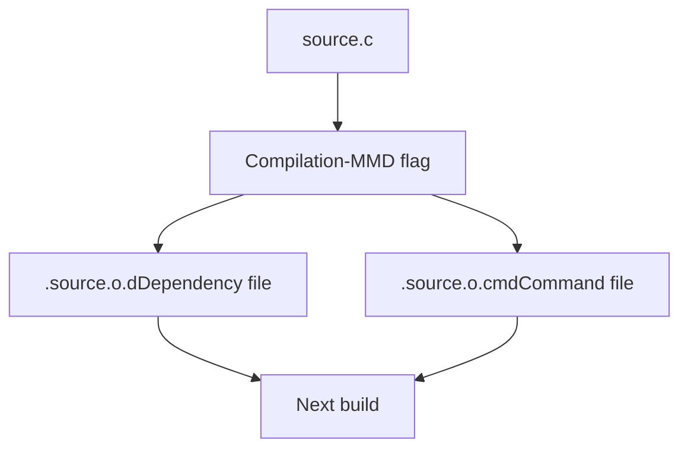
Dependencies are tracked via:

1.  **`.d` files**: Generated by `-MMD` flag, list header dependencies [scripts/Makefile.lib157](https://github.com/torvalds/linux/blob/fcb70a56/scripts/Makefile.lib#L157-L157)
2.  **`.cmd` files**: Record exact compilation command to detect flag changes

The `fixdep` tool processes `.d` files to add `CONFIG_*` dependencies automatically.

**Sources:** [scripts/Makefile.lib157](https://github.com/torvalds/linux/blob/fcb70a56/scripts/Makefile.lib#L157-L157) [Makefile63-69](https://github.com/torvalds/linux/blob/fcb70a56/Makefile#L63-L69)

## Objtool Integration

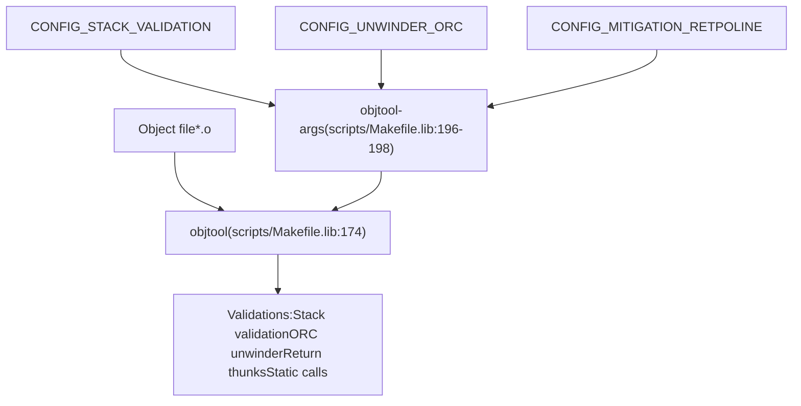
Objtool performs post-compilation validation and transformations on object files:

| Feature | Config | Flag |
| --- | --- | --- |
| Stack validation | `CONFIG_STACK_VALIDATION` | `--stackval` [scripts/Makefile.lib189](https://github.com/torvalds/linux/blob/fcb70a56/scripts/Makefile.lib#L189-L189) |
| ORC unwinder | `CONFIG_UNWINDER_ORC` | `--orc` [scripts/Makefile.lib185](https://github.com/torvalds/linux/blob/fcb70a56/scripts/Makefile.lib#L185-L185) |
| Retpoline | `CONFIG_MITIGATION_RETPOLINE` | `--retpoline` [scripts/Makefile.lib186](https://github.com/torvalds/linux/blob/fcb70a56/scripts/Makefile.lib#L186-L186) |
| Static calls | `CONFIG_HAVE_STATIC_CALL_INLINE` | `--static-call` [scripts/Makefile.lib190](https://github.com/torvalds/linux/blob/fcb70a56/scripts/Makefile.lib#L190-L190) |

The command is invoked via `cmd_objtool` [scripts/Makefile.lib202](https://github.com/torvalds/linux/blob/fcb70a56/scripts/Makefile.lib#L202-L202) after compilation.

**Sources:** [scripts/Makefile.lib172-207](https://github.com/torvalds/linux/blob/fcb70a56/scripts/Makefile.lib#L172-L207)

## Out-of-Tree Builds

### Build Directory Setup

Out-of-tree builds separate source and build directories:

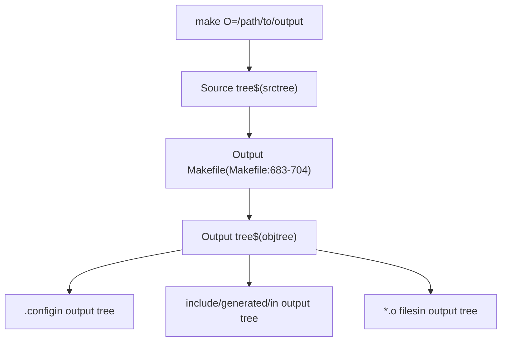
The process:

1.  First make invocation detects `O=` or `KBUILD_OUTPUT` [Makefile180-214](https://github.com/torvalds/linux/blob/fcb70a56/Makefile#L180-L214)
2.  Creates output directory and generates a Makefile there [Makefile676-681](https://github.com/torvalds/linux/blob/fcb70a56/Makefile#L676-L681)
3.  Second make invocation runs in output directory with `srctree` pointing to source

Key variables:

-   `srctree`: Source directory path [Makefile275](https://github.com/torvalds/linux/blob/fcb70a56/Makefile#L275-L275)
-   `objtree`: Output directory path [Makefile186-202](https://github.com/torvalds/linux/blob/fcb70a56/Makefile#L186-L202)
-   `VPATH`: Make search path for sources [Makefile278](https://github.com/torvalds/linux/blob/fcb70a56/Makefile#L278-L278)

**Sources:** [Makefile160-282](https://github.com/torvalds/linux/blob/fcb70a56/Makefile#L160-L282) [Makefile658-707](https://github.com/torvalds/linux/blob/fcb70a56/Makefile#L658-L707)

## External Module Building

### External Module System

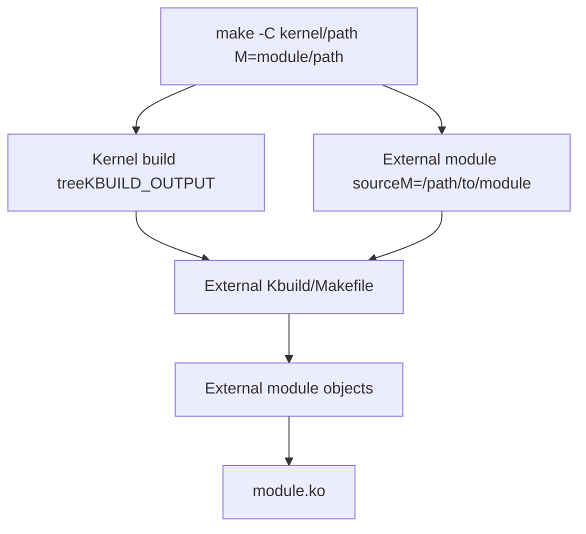
External modules are built against an existing kernel build:

```
make -C /lib/modules/$(uname -r)/build M=$PWD
```
Key variables:

-   `KBUILD_EXTMOD`: External module directory [Makefile132-152](https://github.com/torvalds/linux/blob/fcb70a56/Makefile#L132-L152)
-   `M=`: Command-line override for `KBUILD_EXTMOD` [Makefile133-135](https://github.com/torvalds/linux/blob/fcb70a56/Makefile#L133-L135)

The external module inherits:

-   Compiler and flags from kernel build
-   Configuration from kernel `.config`
-   Generated headers from kernel build

**Sources:** [Makefile131-205](https://github.com/torvalds/linux/blob/fcb70a56/Makefile#L131-L205) [Makefile752-755](https://github.com/torvalds/linux/blob/fcb70a56/Makefile#L752-L755)

## Cross-Compilation

### Architecture Setup

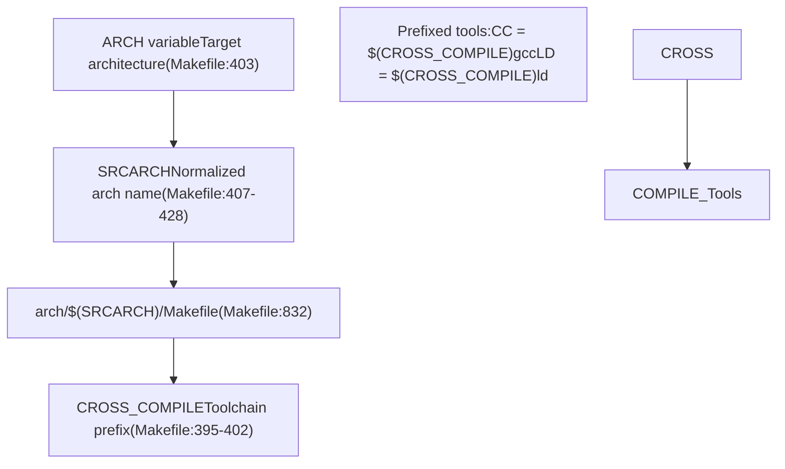
Cross-compilation is configured via:

```
make ARCH=arm64 CROSS_COMPILE=aarch64-linux-gnu-
```
| Variable | Purpose | Example |
| --- | --- | --- |
| `ARCH` | Target architecture | `arm64`, `x86`, `riscv` [Makefile403](https://github.com/torvalds/linux/blob/fcb70a56/Makefile#L403-L403) |
| `SRCARCH` | Source architecture path | `arm64`, `x86`, `riscv` [Makefile407](https://github.com/torvalds/linux/blob/fcb70a56/Makefile#L407-L407) |
| `CROSS_COMPILE` | Toolchain prefix | `aarch64-linux-gnu-` [Makefile395-402](https://github.com/torvalds/linux/blob/fcb70a56/Makefile#L395-L402) |
| `SUBARCH` | Host architecture | Detected from `uname -m` [Makefile383](https://github.com/torvalds/linux/blob/fcb70a56/Makefile#L383-L383) |

The `cross_compiling` variable [Makefile430-433](https://github.com/torvalds/linux/blob/fcb70a56/Makefile#L430-L433) is set when `SRCARCH != SUBARCH`.

**Sources:** [Makefile383-433](https://github.com/torvalds/linux/blob/fcb70a56/Makefile#L383-L433) [Makefile832](https://github.com/torvalds/linux/blob/fcb70a56/Makefile#L832-L832)

## Livepatching Support

### Livepatch Build System

The livepatch mechanism allows runtime kernel patching. The build system supports creating livepatch modules via `scripts/livepatch/klp-build`:

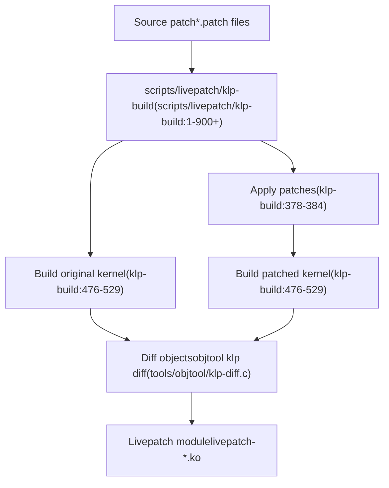
Build steps [scripts/livepatch/klp-build189-217](https://github.com/torvalds/linux/blob/fcb70a56/scripts/livepatch/klp-build#L189-L217):

1.  **Build original kernel**: Compile kernel with `--checksum` objtool flag
2.  **Apply patches**: Apply source patches with line number adjustment [scripts/livepatch/fix-patch-lines1-80](https://github.com/torvalds/linux/blob/fcb70a56/scripts/livepatch/fix-patch-lines#L1-L80)
3.  **Build patched kernel**: Recompile with patches applied
4.  **Diff objects**: Use `objtool klp diff` to find changed functions [tools/objtool/klp-diff.c1-1500](https://github.com/torvalds/linux/blob/fcb70a56/tools/objtool/klp-diff.c#L1-L1500)
5.  **Build module**: Generate livepatch module with relocations

The livepatch infrastructure requires `CONFIG_LIVEPATCH` and `CONFIG_KLP_BUILD`.

**Sources:** [scripts/livepatch/klp-build1-900](https://github.com/torvalds/linux/blob/fcb70a56/scripts/livepatch/klp-build#L1-L900) [scripts/livepatch/fix-patch-lines1-80](https://github.com/torvalds/linux/blob/fcb70a56/scripts/livepatch/fix-patch-lines#L1-L80) [tools/objtool/klp-diff.c1-200](https://github.com/torvalds/linux/blob/fcb70a56/tools/objtool/klp-diff.c#L1-L200)

## Build Reproducibility

### Reproducible Build Mechanisms

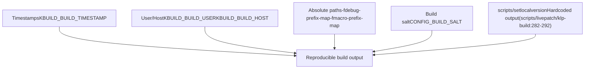
The kernel supports reproducible builds when:

1.  **Timestamps** are fixed via `KBUILD_BUILD_TIMESTAMP` [Makefile32](https://github.com/torvalds/linux/blob/fcb70a56/Makefile#L32-L32)
2.  **User/host** are overridden via `KBUILD_BUILD_USER` and `KBUILD_BUILD_HOST`
3.  **Absolute paths** are mapped via `-fmacro-prefix-map` [Makefile1105-1106](https://github.com/torvalds/linux/blob/fcb70a56/Makefile#L1105-L1106)
4.  **Build salt** provides version differentiation via `CONFIG_BUILD_SALT`

For livepatching, `setlocalversion` is hardcoded [scripts/livepatch/klp-build282-292](https://github.com/torvalds/linux/blob/fcb70a56/scripts/livepatch/klp-build#L282-L292) to prevent git state from affecting output.

**Sources:** [Makefile1104-1106](https://github.com/torvalds/linux/blob/fcb70a56/Makefile#L1104-L1106) [Documentation/kbuild/reproducible-builds.rst1-141](https://github.com/torvalds/linux/blob/fcb70a56/Documentation/kbuild/reproducible-builds.rst#L1-L141) [scripts/livepatch/klp-build282-292](https://github.com/torvalds/linux/blob/fcb70a56/scripts/livepatch/klp-build#L282-L292)

## Special Build Sections

### Generated Architecture Files

Some Rust kernel code requires architecture-specific assembly snippets generated at build time:

| Generated File | Source | Purpose |
| --- | --- | --- |
| `generated_arch_static_branch_asm.rs` | [rust/kernel/generated\_arch\_static\_branch\_asm.rs.S1-8](https://github.com/torvalds/linux/blob/fcb70a56/rust/kernel/generated_arch_static_branch_asm.rs.S#L1-L8) | Static branch jump label assembly for Rust |
| `generated_arch_warn_asm.rs` | [rust/kernel/generated\_arch\_warn\_asm.rs.S1-8](https://github.com/torvalds/linux/blob/fcb70a56/rust/kernel/generated_arch_warn_asm.rs.S#L1-L8) | WARN macro assembly for Rust |
| `generated_arch_reachable_asm.rs` | [rust/kernel/generated\_arch\_reachable\_asm.rs.S1-8](https://github.com/torvalds/linux/blob/fcb70a56/rust/kernel/generated_arch_reachable_asm.rs.S#L1-L8) | Unreachable code annotation |

These are preprocessed from `.rs.S` files [rust/Makefile38-41](https://github.com/torvalds/linux/blob/fcb70a56/rust/Makefile#L38-L41) and included via `include!()` in Rust code [rust/kernel/jump\_label.rs40-43](https://github.com/torvalds/linux/blob/fcb70a56/rust/kernel/jump_label.rs#L40-L43) [rust/kernel/bug.rs37-39](https://github.com/torvalds/linux/blob/fcb70a56/rust/kernel/bug.rs#L37-L39)

### Position-Independent Startup Code

Architecture-specific startup code uses special build rules. For x86 [arch/x86/boot/startup/Makefile38-52](https://github.com/torvalds/linux/blob/fcb70a56/arch/x86/boot/startup/Makefile#L38-L52):

```
$(obj)/%.pi.o: OBJCOPYFLAGS := --prefix-symbols=__pi_
$(obj)/%.pi.o: $(obj)/%.o FORCE
    $(call if_changed,objcopy)
```
This creates position-independent code by prefixing all symbols with `__pi_` for early boot code.

**Sources:** [rust/Makefile38-41](https://github.com/torvalds/linux/blob/fcb70a56/rust/Makefile#L38-L41) [rust/kernel/jump\_label.rs40-43](https://github.com/torvalds/linux/blob/fcb70a56/rust/kernel/jump_label.rs#L40-L43) [arch/x86/boot/startup/Makefile38-52](https://github.com/torvalds/linux/blob/fcb70a56/arch/x86/boot/startup/Makefile#L38-L52)

## Build Artifacts and Cleanup

### Generated Files

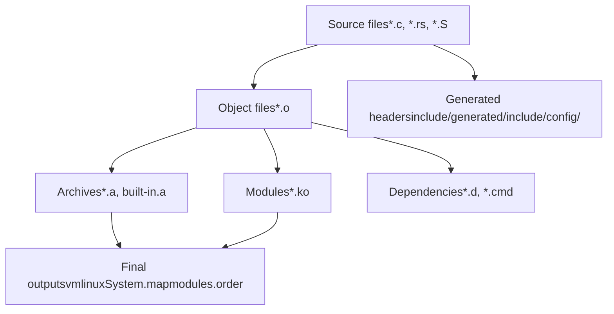
### Cleanup Targets

| Target | Scope | Files Removed |
| --- | --- | --- |
| `clean` | Build artifacts | `*.o`, `*.ko`, `*.a`, `*.d`, `*.cmd` [Makefile293](https://github.com/torvalds/linux/blob/fcb70a56/Makefile#L293-L293) |
| `mrproper` | All generated | Everything from `clean` plus config files, generated headers [Makefile293](https://github.com/torvalds/linux/blob/fcb70a56/Makefile#L293-L293) |
| `distclean` | Distribution clean | `mrproper` plus editor backup files |

The `.gitignore` file [.gitignore1-187](https://github.com/torvalds/linux/blob/fcb70a56/.gitignore#L1-L187) lists standard build artifacts that are ignored by version control.

**Sources:** [Makefile293-357](https://github.com/torvalds/linux/blob/fcb70a56/Makefile#L293-L357) [.gitignore1-187](https://github.com/torvalds/linux/blob/fcb70a56/.gitignore#L1-L187)

## Build Verbosity and Debugging

### Verbosity Control

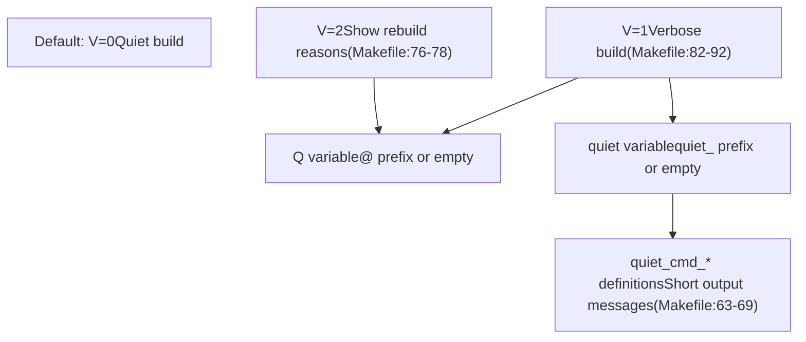
Build verbosity is controlled by the `V` variable:

-   `V=0` (default): Show short messages like `CC file.o` [Makefile86-87](https://github.com/torvalds/linux/blob/fcb70a56/Makefile#L86-L87)
-   `V=1`: Show full compilation commands [Makefile89-92](https://github.com/torvalds/linux/blob/fcb70a56/Makefile#L89-L92)
-   `V=2`: Show why files are being rebuilt [Makefile76-78](https://github.com/torvalds/linux/blob/fcb70a56/Makefile#L76-L78)

For Rust builds, `VERBOSE=V=1` is passed to cargo-style commands [rust/Makefile59-62](https://github.com/torvalds/linux/blob/fcb70a56/rust/Makefile#L59-L62)

**Sources:** [Makefile63-101](https://github.com/torvalds/linux/blob/fcb70a56/Makefile#L63-L101) [rust/Makefile59-62](https://github.com/torvalds/linux/blob/fcb70a56/rust/Makefile#L59-L62) [scripts/Makefile.lib242-245](https://github.com/torvalds/linux/blob/fcb70a56/scripts/Makefile.lib#L242-L245)
