# io\_uring Asynchronous I/O

Relevant source files

-   [Documentation/networking/iou-zcrx.rst](https://github.com/torvalds/linux/blob/fcb70a56/Documentation/networking/iou-zcrx.rst)
-   [drivers/nvme/host/ioctl.c](https://github.com/torvalds/linux/blob/fcb70a56/drivers/nvme/host/ioctl.c)
-   [include/linux/io\_uring/cmd.h](https://github.com/torvalds/linux/blob/fcb70a56/include/linux/io_uring/cmd.h)
-   [include/linux/io\_uring\_types.h](https://github.com/torvalds/linux/blob/fcb70a56/include/linux/io_uring_types.h)
-   [include/uapi/linux/io\_uring.h](https://github.com/torvalds/linux/blob/fcb70a56/include/uapi/linux/io_uring.h)
-   [include/uapi/linux/io\_uring/query.h](https://github.com/torvalds/linux/blob/fcb70a56/include/uapi/linux/io_uring/query.h)
-   [io\_uring/Makefile](https://github.com/torvalds/linux/blob/fcb70a56/io_uring/Makefile)
-   [io\_uring/advise.c](https://github.com/torvalds/linux/blob/fcb70a56/io_uring/advise.c)
-   [io\_uring/alloc\_cache.c](https://github.com/torvalds/linux/blob/fcb70a56/io_uring/alloc_cache.c)
-   [io\_uring/alloc\_cache.h](https://github.com/torvalds/linux/blob/fcb70a56/io_uring/alloc_cache.h)
-   [io\_uring/cancel.c](https://github.com/torvalds/linux/blob/fcb70a56/io_uring/cancel.c)
-   [io\_uring/cancel.h](https://github.com/torvalds/linux/blob/fcb70a56/io_uring/cancel.h)
-   [io\_uring/cmd\_net.c](https://github.com/torvalds/linux/blob/fcb70a56/io_uring/cmd_net.c)
-   [io\_uring/epoll.c](https://github.com/torvalds/linux/blob/fcb70a56/io_uring/epoll.c)
-   [io\_uring/epoll.h](https://github.com/torvalds/linux/blob/fcb70a56/io_uring/epoll.h)
-   [io\_uring/fdinfo.c](https://github.com/torvalds/linux/blob/fcb70a56/io_uring/fdinfo.c)
-   [io\_uring/filetable.c](https://github.com/torvalds/linux/blob/fcb70a56/io_uring/filetable.c)
-   [io\_uring/filetable.h](https://github.com/torvalds/linux/blob/fcb70a56/io_uring/filetable.h)
-   [io\_uring/fs.c](https://github.com/torvalds/linux/blob/fcb70a56/io_uring/fs.c)
-   [io\_uring/futex.c](https://github.com/torvalds/linux/blob/fcb70a56/io_uring/futex.c)
-   [io\_uring/io-wq.c](https://github.com/torvalds/linux/blob/fcb70a56/io_uring/io-wq.c)
-   [io\_uring/io\_uring.c](https://github.com/torvalds/linux/blob/fcb70a56/io_uring/io_uring.c)
-   [io\_uring/io\_uring.h](https://github.com/torvalds/linux/blob/fcb70a56/io_uring/io_uring.h)
-   [io\_uring/kbuf.c](https://github.com/torvalds/linux/blob/fcb70a56/io_uring/kbuf.c)
-   [io\_uring/kbuf.h](https://github.com/torvalds/linux/blob/fcb70a56/io_uring/kbuf.h)
-   [io\_uring/memmap.c](https://github.com/torvalds/linux/blob/fcb70a56/io_uring/memmap.c)
-   [io\_uring/memmap.h](https://github.com/torvalds/linux/blob/fcb70a56/io_uring/memmap.h)
-   [io\_uring/msg\_ring.c](https://github.com/torvalds/linux/blob/fcb70a56/io_uring/msg_ring.c)
-   [io\_uring/net.c](https://github.com/torvalds/linux/blob/fcb70a56/io_uring/net.c)
-   [io\_uring/net.h](https://github.com/torvalds/linux/blob/fcb70a56/io_uring/net.h)
-   [io\_uring/nop.c](https://github.com/torvalds/linux/blob/fcb70a56/io_uring/nop.c)
-   [io\_uring/notif.c](https://github.com/torvalds/linux/blob/fcb70a56/io_uring/notif.c)
-   [io\_uring/opdef.c](https://github.com/torvalds/linux/blob/fcb70a56/io_uring/opdef.c)
-   [io\_uring/openclose.c](https://github.com/torvalds/linux/blob/fcb70a56/io_uring/openclose.c)
-   [io\_uring/poll.c](https://github.com/torvalds/linux/blob/fcb70a56/io_uring/poll.c)
-   [io\_uring/poll.h](https://github.com/torvalds/linux/blob/fcb70a56/io_uring/poll.h)
-   [io\_uring/query.c](https://github.com/torvalds/linux/blob/fcb70a56/io_uring/query.c)
-   [io\_uring/query.h](https://github.com/torvalds/linux/blob/fcb70a56/io_uring/query.h)
-   [io\_uring/register.c](https://github.com/torvalds/linux/blob/fcb70a56/io_uring/register.c)
-   [io\_uring/rsrc.c](https://github.com/torvalds/linux/blob/fcb70a56/io_uring/rsrc.c)
-   [io\_uring/rsrc.h](https://github.com/torvalds/linux/blob/fcb70a56/io_uring/rsrc.h)
-   [io\_uring/rw.c](https://github.com/torvalds/linux/blob/fcb70a56/io_uring/rw.c)
-   [io\_uring/rw.h](https://github.com/torvalds/linux/blob/fcb70a56/io_uring/rw.h)
-   [io\_uring/splice.c](https://github.com/torvalds/linux/blob/fcb70a56/io_uring/splice.c)
-   [io\_uring/sqpoll.c](https://github.com/torvalds/linux/blob/fcb70a56/io_uring/sqpoll.c)
-   [io\_uring/sqpoll.h](https://github.com/torvalds/linux/blob/fcb70a56/io_uring/sqpoll.h)
-   [io\_uring/tctx.c](https://github.com/torvalds/linux/blob/fcb70a56/io_uring/tctx.c)
-   [io\_uring/timeout.c](https://github.com/torvalds/linux/blob/fcb70a56/io_uring/timeout.c)
-   [io\_uring/uring\_cmd.c](https://github.com/torvalds/linux/blob/fcb70a56/io_uring/uring_cmd.c)
-   [io\_uring/uring\_cmd.h](https://github.com/torvalds/linux/blob/fcb70a56/io_uring/uring_cmd.h)
-   [io\_uring/waitid.c](https://github.com/torvalds/linux/blob/fcb70a56/io_uring/waitid.c)
-   [io\_uring/zcrx.c](https://github.com/torvalds/linux/blob/fcb70a56/io_uring/zcrx.c)
-   [io\_uring/zcrx.h](https://github.com/torvalds/linux/blob/fcb70a56/io_uring/zcrx.h)

This document covers the io\_uring asynchronous I/O framework, a high-performance interface for submitting and completing I/O operations in the Linux kernel. The io\_uring system provides efficient asynchronous I/O through shared memory rings between userspace and kernel, supporting file I/O, network operations, and various other system calls.

For information about the broader I/O subsystem infrastructure, see [I/O Subsystems](#2.4). For details on storage drivers and block layer components, see [Block Layer and Storage Drivers](#2.4.2).

## System Architecture

The io\_uring framework implements a ring-based asynchronous I/O interface that minimizes system call overhead through shared memory rings between userspace and kernel. The system eliminates most syscalls by allowing batch submission and completion of I/O operations through lock-free ring buffers.

### High-Level Architecture

**Diagram: io\_uring System Architecture with Code Symbols**

```mermaid
flowchart TD
    APP["Applications"]
    LIBURING["liburingio_uring_setup()io_uring_enter()"]
    RINGS["struct io_rings*ctx->rings(mmap IORING_OFF_CQ_RING)"]
    SQ_RING["sq: struct io_uringhead, tail, ring_mask"]
    CQ_RING["cq: struct io_uringhead, tail, ring_mask"]
    SQ_ARRAY["sq_array[sq_entries](if !NO_SQARRAY)"]
    SQES["struct io_uring_sqe*ctx->sq_sqes(mmap IORING_OFF_SQES)"]
    CQES["struct io_uring_cqe[]rings->cqes"]
    CTX["struct io_ring_ctxio_ring_ctx_alloc()"]
    SUBMIT_STATE["submit_state:free_list (wq_stack)compl_reqs (wq_list)"]
    KIOCB_CACHE["req_cachep(kmem_cache)"]
    ALLOC_CACHES["Allocation caches:apoll_cachenetmsg_cacherw_cachecmd_cache"]
    FILE_TABLE["file_table:io_file_tablenodes[], bitmap[]"]
    BUF_TABLE["buf_table:io_rsrc_data"]
    IO_BL_XA["io_bl_xa:xarraybgid -> io_buffer_list"]
    KIOCB["struct io_kiocbio_alloc_req()"]
    ASYNC_DATA["async_data:io_async_rwio_async_msghdrio_async_cmd"]
    OPDEF["io_issue_defs[opcode]->prep(), ->issue()"]
    COLD_DEF["io_cold_defs[opcode]->cleanup(), ->fail()"]
    INLINE["io_issue_sqe()Direct issue path"]
    IO_WQ["struct io_wqio_queue_iowq()io_wq_submit_work()"]
    TASK_WORK["tctx->task_list (llist)io_req_task_work_add()tctx_task_work()"]
    DEFER_TW["DEFER_TASKRUN:ctx->work_llistio_req_local_work_add()"]
    SQPOLL["SQPOLL thread:io_sq_thread()io_sqd_handle_event()"]

    APP --> LIBURING
    LIBURING --> RINGS
    RINGS --> SQ_RING
    RINGS --> CQ_RING
    RINGS --> SQ_ARRAY
    RINGS --> SQES
    RINGS --> CQES
    CTX --> RINGS
    CTX --> SUBMIT_STATE
    CTX --> FILE_TABLE
    CTX --> BUF_TABLE
    CTX --> IO_BL_XA
    SUBMIT --> STATE_KIOCB_CACHE
    KIOCB --> ASYNC_DATA
    KIOCB --> OPDEF
    OPDEF --> COLD_DEF
    KIOCB --> INLINE
    KIOCB --> IO_WQ
    KIOCB --> TASK_WORK
    KIOCB --> DEFER_TW
    KIOCB --> SQPOLL
    INLINE --> CQES
    IO --> WQ_TASK_WORK
    TASK --> WORK_CQES
    DEFER --> TW_CQES
    SQPOLL --> CQES
    CQES --> LIBURING
```
**Sources:** [io\_uring/io\_uring.c1-100](https://github.com/torvalds/linux/blob/fcb70a56/io_uring/io_uring.c#L1-L100) [include/linux/io\_uring\_types.h111-202](https://github.com/torvalds/linux/blob/fcb70a56/include/linux/io_uring_types.h#L111-L202) [include/linux/io\_uring\_types.h239-400](https://github.com/torvalds/linux/blob/fcb70a56/include/linux/io_uring_types.h#L239-L400) [io\_uring/io\_uring.c284-366](https://github.com/torvalds/linux/blob/fcb70a56/io_uring/io_uring.c#L284-L366) [io\_uring/io\_uring.c1205-1273](https://github.com/torvalds/linux/blob/fcb70a56/io_uring/io_uring.c#L1205-L1273)

### Memory Layout and Shared Regions

The io\_uring interface uses multiple shared memory regions mapped into userspace via `mmap()`. The mapping offsets are defined in `include/uapi/linux/io_uring.h`.

| Region | Offset Constant | Type | Contents | Setup Function |
| --- | --- | --- | --- | --- |
| Rings + CQEs | `IORING_OFF_CQ_RING` | `struct io_rings` | SQ/CQ heads, tails, flags, CQE array | `io_create_region()` in `io_uring/memmap.c` |
| SQEs | `IORING_OFF_SQES` | `struct io_uring_sqe[]` | Submission queue entries | `io_create_region()` |
| Ring Buffers | `IORING_OFF_PBUF_RING` + offset | `struct io_uring_buf_ring` | Provided buffer rings | `io_pbuf_mmap()` in `io_uring/kbuf.c` |
| ZCRX Regions | `IORING_OFF_ZCRX_REGION` + offset | `struct io_uring` + `io_uring_zcrx_rqe[]` | Zero-copy RX refill queue | `io_allocate_rbuf_ring()` in `io_uring/zcrx.c` |

The kernel can optionally use user-provided memory for rings via `IORING_SETUP_NO_MMAP` flag and `IORING_MEM_REGION_TYPE_USER` during `io_uring_register_region()`.

**Sources:** [io\_uring/io\_uring.c1-41](https://github.com/torvalds/linux/blob/fcb70a56/io_uring/io_uring.c#L1-L41) [include/linux/io\_uring\_types.h133-202](https://github.com/torvalds/linux/blob/fcb70a56/include/linux/io_uring_types.h#L133-L202) [include/uapi/linux/io\_uring.h391-404](https://github.com/torvalds/linux/blob/fcb70a56/include/uapi/linux/io_uring.h#L391-L404) [io\_uring/memmap.c61-151](https://github.com/torvalds/linux/blob/fcb70a56/io_uring/memmap.c#L61-L151)

## Core Data Structures

The io\_uring system is built around several key data structures that manage the ring interface, requests, and context.

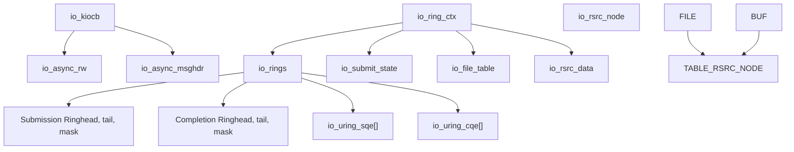
**Sources:** [include/linux/io\_uring\_types.h239-400](https://github.com/torvalds/linux/blob/fcb70a56/include/linux/io_uring_types.h#L239-L400) [io\_uring/io\_uring.c297-378](https://github.com/torvalds/linux/blob/fcb70a56/io_uring/io_uring.c#L297-L378)

### Ring Context Structure

The `io_ring_ctx` serves as the central context for an io\_uring instance, containing all ring state, resource tables, and operation queues. The structure is organized into cache-line aligned sections for optimal performance.

| Component | Type | Purpose | Key Operations |
| --- | --- | --- | --- |
| `rings` | `struct io_rings*` | Shared memory ring structures | `io_cqe_cache_refill()`, `io_get_cqe()` |
| `file_table` | `struct io_file_table` | Fixed file descriptor table with bitmap | `io_file_get_fixed()`, `io_fixed_file_set()` |
| `buf_table` | `struct io_rsrc_data` | Registered buffer table | `io_import_reg_buf()` |
| `submit_state` | `struct io_submit_state` | Submission batching and free lists | `io_alloc_req()`, `io_req_add_to_cache()` |
| `uring_lock` | `struct mutex` | Primary context lock | Protects most ctx operations |
| `completion_lock` | `spinlock_t` | CQ posting lock (if !lockless\_cq) | `io_cq_lock()`, `io_cq_unlock_post()` |
| `cached_cq_tail` | `unsigned int` | Cached completion queue tail | Updated by `io_commit_cqring()` |
| `io_bl_xa` | `struct xarray` | Buffer list lookup (bgid → io\_buffer\_list) | `io_buffer_get_list()` |
| `work_llist` | `struct llist_head` | DEFER\_TASKRUN work list | `io_req_local_work_add()` |
| `cancel_table` | `struct io_hash_table` | Request cancellation hash table | `io_cancel_req_match()` |
| `apoll_cache` | `struct io_alloc_cache` | Async poll structure cache | `io_alloc_cache_get()` |
| `netmsg_cache` | `struct io_alloc_cache` | Network message cache | `io_msg_alloc_async()` |
| `rw_cache` | `struct io_alloc_cache` | Read/write async data cache | `io_rw_alloc_async()` |
| `cmd_cache` | `struct io_alloc_cache` | uring\_cmd async data cache | `io_uring_alloc_async_data()` |
| `zcrx_ctxs` | `struct xarray` | Zero-copy RX interface queues | `io_register_zcrx_ifq()` |

**Sources:** [include/linux/io\_uring\_types.h239-400](https://github.com/torvalds/linux/blob/fcb70a56/include/linux/io_uring_types.h#L239-L400) [io\_uring/io\_uring.c284-366](https://github.com/torvalds/linux/blob/fcb70a56/io_uring/io_uring.c#L284-L366) [io\_uring/io\_uring.c549-580](https://github.com/torvalds/linux/blob/fcb70a56/io_uring/io_uring.c#L549-L580)

### Request Lifecycle

Each I/O request is represented by an `io_kiocb` structure and follows a structured lifecycle from submission to completion. Requests can take multiple execution paths depending on operation type, file characteristics, and system state.

#### Request Lifecycle Diagram

**Diagram: io\_kiocb Lifecycle with Code Symbols**

```mermaid
flowchart TD
    SQE["struct io_uring_sqefrom rings->sqes[]"]
    GET_SQE["io_get_sqe()reads sq_array[head]"]
    ALLOC_REQ["io_alloc_req()from submit_state.free_list"]
    PREP["io_issue_defs[opcode].prep()e.g. io_prep_rw()"]
    ISSUE["io_issue_sqe()"]
    OPDEF["io_issue_defs[opcode].issue()e.g. io_read()"]
    CHECK_INLINE["Check return value"]
    INLINE_EXEC["IOU_COMPLETEinline success"]
    NEED_POLL["IOU_RETRYio_arm_poll_handler()"]
    QUEUE_WQ["IOU_RETRYio_queue_iowq()"]
    ASYNC_ARM["IOU_ISSUE_SKIP_COMPLETE-EIOCBQUEUED"]
    TASK_WORK["io_req_task_work_add()tctx->task_list"]
    TW_HANDLER["req->io_task_work.funce.g. io_req_rw_complete()"]
    FILL_CQE["io_fill_cqe_req()ctx->cqe_cached"]
    POST_CQE["Write to rings->cqes[]"]
    FREE_REQ["io_req_add_to_cache()or io_free_req()"]

    SQE --> GET_SQE
    GET --> SQE_ALLOC_REQ
    ALLOC --> REQ_PREP
    PREP --> ISSUE
    ISSUE --> OPDEF
    OPDEF --> CHECK_INLINE
    CHECK --> INLINE_INLINE_EXEC
    CHECK --> INLINE_NEED_POLL
    CHECK --> INLINE_QUEUE_WQ
    CHECK --> INLINE_ASYNC_ARM
    INLINE --> EXEC_FILL_CQE
    NEED --> POLL_TASK_WORK
    QUEUE --> WQ_TW_HANDLER
    ASYNC --> ARM_TW_HANDLER
    TASK --> WORK_TW_HANDLER
    TW --> HANDLER_FILL_CQE
    FILL --> CQE_POST_CQE
    POST --> CQE_FREE_REQ
```
**Sources:** [io\_uring/io\_uring.c1836-1927](https://github.com/torvalds/linux/blob/fcb70a56/io_uring/io_uring.c#L1836-L1927) [io\_uring/io\_uring.c996-1025](https://github.com/torvalds/linux/blob/fcb70a56/io_uring/io_uring.c#L996-L1025) [io\_uring/rw.c680-730](https://github.com/torvalds/linux/blob/fcb70a56/io_uring/rw.c#L680-L730) [io\_uring/io\_uring.h92-111](https://github.com/torvalds/linux/blob/fcb70a56/io_uring/io_uring.h#L92-L111)

#### Request States and Flags

Key flags tracked in `io_kiocb->flags`:

| Flag | Value | Meaning |
| --- | --- | --- |
| `REQ_F_FIXED_FILE` | Bit 0 | Uses fixed file table |
| `REQ_F_LINK` | Bit 1 | Part of a link chain |
| `REQ_F_HARDLINK` | Bit 2 | Hard link (fail entire chain) |
| `REQ_F_FORCE_ASYNC` | Bit 3 | Must execute in async context |
| `REQ_F_BUFFER_SELECT` | Bit 4 | Buffer selected from group |
| `REQ_F_CQE_SKIP` | Bit 5 | Don't post CQE on success |
| `REQ_F_FAIL` | Bit 6 | Request failed |
| `REQ_F_INFLIGHT` | Bit 7 | Tracked as in-flight |
| `REQ_F_CREDS` | Bit 8 | Carries task credentials |
| `REQ_F_REFCOUNT` | Bit 9 | Has explicit refcount |
| `REQ_F_ASYNC_DATA` | Bit 10 | Has async\_data allocated |
| `REQ_F_BUFFER_RING` | Bit 11 | Buffer from ring provider |

**Sources:** [io\_uring/io\_uring.h21-40](https://github.com/torvalds/linux/blob/fcb70a56/io_uring/io_uring.h#L21-L40) [io\_uring/io\_uring.c108-122](https://github.com/torvalds/linux/blob/fcb70a56/io_uring/io_uring.c#L108-L122)

## Submission and Completion Queues

The io\_uring interface uses a pair of lock-free ring buffers shared between userspace and kernel to minimize system call overhead. The rings implement a producer-consumer pattern with memory barriers for correctness.

### Submission Queue (SQ)

The submission queue allows userspace to submit I/O requests by writing `io_uring_sqe` entries and updating the tail pointer. The kernel reads from head and advances it.

#### SQE Structure Layout

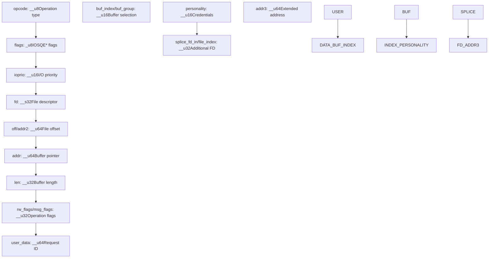
**SQE Field Details:**

| Field | Type | Description |
| --- | --- | --- |
| `opcode` | `__u8` | Operation type from `enum io_uring_op` |
| `flags` | `__u8` | SQE flags (IOSQE\_FIXED\_FILE, IOSQE\_IO\_LINK, etc.) |
| `ioprio` | `__u16` | I/O priority or special flags for some ops |
| `fd` | `__s32` | File descriptor (or fixed file index if IOSQE\_FIXED\_FILE) |
| `off` / `addr2` | `__u64` | File offset or secondary address |
| `addr` | `__u64` | Buffer address or iovec pointer |
| `len` | `__u32` | Buffer length or iovec count |
| `rw_flags` / `msg_flags` | `__u32` | Operation-specific flags (e.g., RWF\_*, MSG\_*) |
| `user_data` | `__u64` | Opaque user identifier echoed in CQE |
| `buf_index` / `buf_group` | `__u16` | Buffer selection (fixed index or group ID) |
| `personality` | `__u16` | Registered personality ID for credentials |
| `splice_fd_in` / `file_index` | `__u32` | Additional file descriptor field |

**Sources:** [include/uapi/linux/io\_uring.h30-118](https://github.com/torvalds/linux/blob/fcb70a56/include/uapi/linux/io_uring.h#L30-L118)

#### Memory Ordering for SQ

The submission protocol requires careful memory ordering:

1.  Userspace writes SQE entry at `sqes[sq_array[tail & mask]]`
2.  Userspace issues `smp_wmb()` (or `smp_store_release()`)
3.  Userspace advances `rings->sq.tail`
4.  Kernel uses `smp_load_acquire()` to read tail
5.  Kernel processes SQE and advances `rings->sq.head`

**Sources:** [io\_uring/io\_uring.c1-28](https://github.com/torvalds/linux/blob/fcb70a56/io_uring/io_uring.c#L1-L28)

### Completion Queue (CQ)

The completion queue delivers I/O completion events from kernel to userspace through `io_uring_cqe` entries. The kernel writes to tail, userspace reads from head.

#### CQE Structure Layout

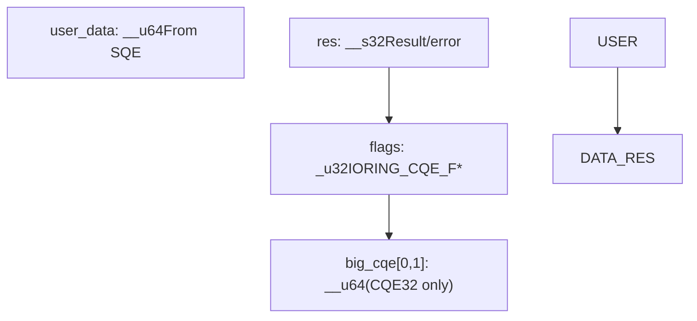
**CQE Field Details:**

| Field | Type | Description |
| --- | --- | --- |
| `user_data` | `__u64` | Request identifier from matching SQE |
| `res` | `__s32` | Operation result (bytes transferred or -errno) |
| `flags` | `__u32` | Completion flags (IORING\_CQE\_F\_BUFFER, IORING\_CQE\_F\_MORE, etc.) |
| `big_cqe[0,1]` | `__u64[2]` | Extra data for CQE32 mode (e.g., uring\_cmd results) |

**Common CQE Flags:**

| Flag | Value | Meaning |
| --- | --- | --- |
| `IORING_CQE_F_BUFFER` | 0x0001 | Buffer ID in upper 16 bits of flags |
| `IORING_CQE_F_MORE` | 0x0002 | More completions coming (multishot) |
| `IORING_CQE_F_SOCK_NONEMPTY` | 0x0004 | Socket has more data available |
| `IORING_CQE_F_NOTIF` | 0x0008 | Notification CQE (zero-copy send) |

**Sources:** [include/uapi/linux/io\_uring.h245-273](https://github.com/torvalds/linux/blob/fcb70a56/include/uapi/linux/io_uring.h#L245-L273) [io\_uring/io\_uring.c750-785](https://github.com/torvalds/linux/blob/fcb70a56/io_uring/io_uring.c#L750-L785)

#### Memory Ordering for CQ

Completion protocol memory ordering:

1.  Kernel writes CQE entry at `rings->cqes[tail & mask]`
2.  Kernel issues `smp_wmb()` (or `smp_store_release()`)
3.  Kernel advances `rings->cq.tail`
4.  Userspace uses `smp_load_acquire()` to read tail
5.  Userspace processes CQE
6.  Userspace issues `smp_mb()` (or `smp_store_release()`)
7.  Userspace advances `rings->cq.head`

**Sources:** [io\_uring/io\_uring.c1-28](https://github.com/torvalds/linux/blob/fcb70a56/io_uring/io_uring.c#L1-L28) [io\_uring/io\_uring.c755-785](https://github.com/torvalds/linux/blob/fcb70a56/io_uring/io_uring.c#L755-L785)

### CQE Caching and Batching

To reduce overhead, the kernel maintains a cached range of CQE slots:

-   `ctx->cqe_cached`: Pointer to next available CQE
-   `ctx->cqe_sentinel`: End of cached range
-   `io_cqe_cache_refill()`: Refills cache when exhausted

**Sources:** [io\_uring/io\_uring.c755-785](https://github.com/torvalds/linux/blob/fcb70a56/io_uring/io_uring.c#L755-L785) [include/linux/io\_uring\_types.h335-349](https://github.com/torvalds/linux/blob/fcb70a56/include/linux/io_uring_types.h#L335-L349)

## I/O Operation Types

The io\_uring framework supports a comprehensive set of I/O operations, each with specialized preparation and execution paths. Operation behavior is defined in `io_issue_defs[]` and `io_cold_defs[]` arrays in `io_uring/opdef.c`. Each operation has:

-   `prep()`: Validates SQE and prepares request-specific data
-   `issue()`: Executes the operation
-   `cleanup()`: Cleans up operation-specific resources
-   `fail()`: Handles failure cases for linked operations

**Supported Operation Categories:**

| Category | Opcodes | Key Files |
| --- | --- | --- |
| File I/O | `IORING_OP_READ`, `IORING_OP_WRITE`, `IORING_OP_READV`, `IORING_OP_WRITEV`, `IORING_OP_READ_FIXED`, `IORING_OP_WRITE_FIXED` | `io_uring/rw.c` |
| Network I/O | `IORING_OP_SEND`, `IORING_OP_RECV`, `IORING_OP_SENDMSG`, `IORING_OP_RECVMSG`, `IORING_OP_SEND_ZC`, `IORING_OP_RECV_ZC` | `io_uring/net.c`, `io_uring/zcrx.c` |
| Socket Operations | `IORING_OP_ACCEPT`, `IORING_OP_CONNECT`, `IORING_OP_SOCKET`, `IORING_OP_SHUTDOWN` | `io_uring/net.c` |
| File Operations | `IORING_OP_OPENAT`, `IORING_OP_OPENAT2`, `IORING_OP_CLOSE`, `IORING_OP_STATX` | `io_uring/openclose.c` |
| Sync Operations | `IORING_OP_FSYNC`, `IORING_OP_SYNC_FILE_RANGE`, `IORING_OP_FDATASYNC` | `io_uring/sync.c` |
| Polling | `IORING_OP_POLL_ADD`, `IORING_OP_POLL_REMOVE` | `io_uring/poll.c` |
| Passthrough | `IORING_OP_URING_CMD`, `IORING_OP_URING_CMD128` | `io_uring/uring_cmd.c` |
| Timeouts | `IORING_OP_TIMEOUT`, `IORING_OP_TIMEOUT_REMOVE`, `IORING_OP_LINK_TIMEOUT` | `io_uring/timeout.c` |
| Buffer Management | `IORING_OP_PROVIDE_BUFFERS`, `IORING_OP_REMOVE_BUFFERS` | `io_uring/kbuf.c` |
| Futex | `IORING_OP_FUTEX_WAIT`, `IORING_OP_FUTEX_WAKE`, `IORING_OP_FUTEX_WAITV` | `io_uring/futex.c` |

**Sources:** [io\_uring/opdef.c1-500](https://github.com/torvalds/linux/blob/fcb70a56/io_uring/opdef.c#L1-L500)

### Read/Write Operations

File read and write operations form the core of io\_uring functionality, supporting buffered I/O, direct I/O, and fixed buffers.

#### Read/Write Execution Flow


**Sources:** [io\_uring/rw.c252-325](https://github.com/torvalds/linux/blob/fcb70a56/io_uring/rw.c#L252-L325) [io\_uring/rw.c680-891](https://github.com/torvalds/linux/blob/fcb70a56/io_uring/rw.c#L680-L891) [io\_uring/rw.c585-614](https://github.com/torvalds/linux/blob/fcb70a56/io_uring/rw.c#L585-L614)

#### Read/Write Variants

| Opcode | Prep Function | Issue Function | Description |
| --- | --- | --- | --- |
| `IORING_OP_READ` | `io_prep_read()` | `io_read()` | Single buffer read |
| `IORING_OP_WRITE` | `io_prep_write()` | `io_write()` | Single buffer write |
| `IORING_OP_READV` | `io_prep_readv()` | `io_read()` | Vectored read (iovec array) |
| `IORING_OP_WRITEV` | `io_prep_writev()` | `io_write()` | Vectored write (iovec array) |
| `IORING_OP_READ_FIXED` | `io_prep_read_fixed()` | `io_read()` | Read into pre-registered buffer |
| `IORING_OP_WRITE_FIXED` | `io_prep_write_fixed()` | `io_write()` | Write from pre-registered buffer |

**Sources:** [io\_uring/rw.c327-436](https://github.com/torvalds/linux/blob/fcb70a56/io_uring/rw.c#L327-L436) [io\_uring/opdef.c1-500](https://github.com/torvalds/linux/blob/fcb70a56/io_uring/opdef.c#L1-L500)

#### Async Data Structure

The `io_async_rw` structure holds state for async read/write operations:

```
struct io_async_rw {
    struct iov_iter iter;           // Current iterator state
    struct iov_iter_state iter_state;  // Saved iterator state
    struct iovec fast_iov;          // Inline iovec (optimization)
    struct iou_vec vec;             // Dynamic iovec array
    size_t bytes_done;              // Bytes transferred so far
    struct wait_page_queue wpq;     // For async buffered reads
};
```
**Sources:** [io\_uring/rw.c1-50](https://github.com/torvalds/linux/blob/fcb70a56/io_uring/rw.c#L1-L50) [io\_uring/io\_uring.c287-295](https://github.com/torvalds/linux/blob/fcb70a56/io_uring/io_uring.c#L287-L295)

### Network Operations

Network I/O operations provide high-performance socket communication with support for vectored I/O, multishot mode, and zero-copy techniques.

#### Network Operation Matrix

| Opcode | Prep Function | Issue Function | Multishot | Bundle Support |
| --- | --- | --- | --- | --- |
| `IORING_OP_SENDMSG` | `io_sendmsg_prep()` | `io_sendmsg()` | No | Yes |
| `IORING_OP_RECVMSG` | `io_recvmsg_prep()` | `io_recvmsg()` | Yes | No |
| `IORING_OP_SEND` | `io_sendmsg_prep()` | `io_send()` | No | Yes |
| `IORING_OP_RECV` | `io_recvmsg_prep()` | `io_recv()` | Yes | Yes |
| `IORING_OP_ACCEPT` | `io_accept_prep()` | `io_accept()` | Yes | No |
| `IORING_OP_CONNECT` | `io_connect_prep()` | `io_connect()` | No | No |
| `IORING_OP_SEND_ZC` | `io_send_zc_prep()` | `io_send_zc()` | No | No |
| `IORING_OP_RECV_ZC` | `io_recvzc_prep()` | `io_recvzc()` | Yes | No |

**Sources:** [io\_uring/net.c418-449](https://github.com/torvalds/linux/blob/fcb70a56/io_uring/net.c#L418-L449) [io\_uring/net.c778-837](https://github.com/torvalds/linux/blob/fcb70a56/io_uring/net.c#L778-L837) [io\_uring/net.c540-701](https://github.com/torvalds/linux/blob/fcb70a56/io_uring/net.c#L540-L701)

#### Network Message Structure

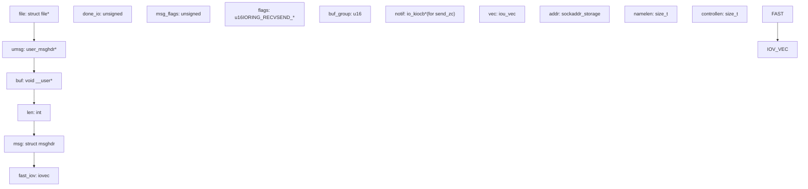
**Sources:** [io\_uring/net.c64-86](https://github.com/torvalds/linux/blob/fcb70a56/io_uring/net.c#L64-L86) [io\_uring/net.c160-200](https://github.com/torvalds/linux/blob/fcb70a56/io_uring/net.c#L160-L200)

## Resource Management

The io\_uring system provides efficient resource management through pre-registered files and buffers, reducing per-operation overhead by avoiding repeated file lookups and memory pinning.

### Fixed Files

Fixed file registration allows applications to register file descriptors once and reference them by index in subsequent operations, eliminating `fget()` overhead.

#### Fixed File Architecture

```mermaid
flowchart TD
    CHECK_BIT["test_bit(idx, bitmap)"]
    GET_NODE["file_table.data.nodes[idx]"]
    EXTRACT_FILE["io_slot_file(node)"]
    FILE["struct file*"]
    USER_FDS["Array of fd valuesfrom userspace"]
    FGET["fget(fd) for each"]
    ALLOC_NODE["io_rsrc_node_alloc()"]
    FILE_TABLE["io_file_table.data"]
    BITMAP["allocation bitmap"]
    RSRC_DATA["data: io_rsrc_datanodes[] array"]
    ALLOC_BITMAP["bitmap: unsigned long*"]
    ALLOC_HINT["alloc_hint: unsigned"]
    TYPE["type: IORING_RSRC_FILE"]
    REFS["refs: int"]
    TAG["tag: u64 (optional)"]
    FILE_PTR["file_ptr: unsigned long(file + bit flags)"]

    USER --> FDS_FGET
    FGET --> ALLOC_NODE
    ALLOC --> NODE_FILE_TABLE
    FILE --> TABLE_RSRC_DATA
    FILE --> TABLE_ALLOC_BITMAP
    RSRC --> DATA_TYPE
    TYPE --> REFS
    REFS --> TAG
    TAG --> FILE_PTR
    CHECK --> BIT_GET_NODE
    GET --> NODE_EXTRACT_FILE
    EXTRACT --> FILE_FILE
```
**Sources:** [io\_uring/rsrc.c541-609](https://github.com/torvalds/linux/blob/fcb70a56/io_uring/rsrc.c#L541-L609) [io\_uring/filetable.h1-100](https://github.com/torvalds/linux/blob/fcb70a56/io_uring/filetable.h#L1-L100) [include/linux/io\_uring\_types.h61-70](https://github.com/torvalds/linux/blob/fcb70a56/include/linux/io_uring_types.h#L61-L70)

#### File Table Operations

| Function | Purpose |
| --- | --- |
| `io_sqe_files_register()` | Register initial file table |
| `io_sqe_files_unregister()` | Unregister all files |
| `io_files_update()` | Update subset of fixed files |
| `io_file_get_fixed()` | Get file pointer from index |
| `io_fixed_file_set()` | Set file in slot |
| `io_file_bitmap_set()` | Mark slot as occupied |
| `io_file_bitmap_clear()` | Mark slot as free |

**Sources:** [io\_uring/rsrc.c223-286](https://github.com/torvalds/linux/blob/fcb70a56/io_uring/rsrc.c#L223-L286) [io\_uring/rsrc.c426-509](https://github.com/torvalds/linux/blob/fcb70a56/io_uring/rsrc.c#L426-L509)

### Buffer Registration

Pre-registered buffers enable zero-copy I/O by pinning user memory pages once at registration time, avoiding repeated `get_user_pages()` calls.

#### Buffer Registration Flow

```mermaid
flowchart TD
    FIND_NODE["io_rsrc_node_lookup()"]
    GET_IMU["node->buf (io_mapped_ubuf*)"]
    VALIDATE_OFFSET["Check offset + len"]
    INIT_ITER["iov_iter_bvec()from bvec array"]
    USER_IOV["struct iovec[]from userspace"]
    VALIDATE["io_buffer_validate()"]
    PIN_PAGES["io_pin_pages()pin_user_pages()"]
    ALLOC_IMU["io_alloc_imu()"]
    ACCOUNT["io_buffer_account_pin()"]
    BUILD_BVEC["Build bio_vec array"]
    UBUF["ubuf: unsigned longoriginal user address"]
    LENGTH["len: unsigned int"]
    NR_BVECS["nr_bvecs: unsigned int"]
    FOLIO_SHIFT["folio_shift: unsigned int"]
    REFS_IMU["refs: refcount_t"]
    ACCT_PAGES["acct_pages: unsigned long"]
    RELEASE["release(): void ()(void)"]
    BVEC_ARRAY["bvec[]: struct bio_vec[]"]

    USER --> IOV_VALIDATE
    VALIDATE --> PIN_PAGES
    PIN --> PAGES_ALLOC_IMU
    ALLOC --> IMU_ACCOUNT
    ACCOUNT --> BUILD_BVEC
    BUILD --> BVEC_UBUF
    UBUF --> LENGTH
    LENGTH --> BVEC_ARRAY
    FIND --> NODE_GET_IMU
    GET --> IMU_VALIDATE_OFFSET
    VALIDATE --> OFFSET_INIT_ITER
```
**Sources:** [io\_uring/rsrc.c777-862](https://github.com/torvalds/linux/blob/fcb70a56/io_uring/rsrc.c#L777-L862) [io\_uring/rsrc.c864-931](https://github.com/torvalds/linux/blob/fcb70a56/io_uring/rsrc.c#L864-L931) [io\_uring/rsrc.h31-43](https://github.com/torvalds/linux/blob/fcb70a56/io_uring/rsrc.h#L31-L43)

#### Buffer Coalescing Optimization

For large page allocations (huge pages), io\_uring can coalesce contiguous pages into fewer bio\_vec entries:

-   `io_check_coalesce_buffer()`: Detects if buffer is on uniform large folios
-   `io_coalesce_buffer()`: Reduces nr\_bvecs by merging contiguous folio pages
-   Tracks `nr_pages_head`, `nr_pages_mid`, and `folio_shift` in `io_imu_folio_data`

**Sources:** [io\_uring/rsrc.c692-775](https://github.com/torvalds/linux/blob/fcb70a56/io_uring/rsrc.c#L692-L775)

### Resource Node Management

The `io_rsrc_node` structure is used for both files and buffers:

```
struct io_rsrc_node {
    unsigned char type;      // IORING_RSRC_FILE or IORING_RSRC_BUFFER
    int refs;                // Reference count
    u64 tag;                 // Optional user tag for tracking
    union {
        unsigned long file_ptr;      // For IORING_RSRC_FILE
        struct io_mapped_ubuf *buf;  // For IORING_RSRC_BUFFER
    };
};
```
**Sources:** [io\_uring/rsrc.h15-24](https://github.com/torvalds/linux/blob/fcb70a56/io_uring/rsrc.h#L15-L24) [io\_uring/rsrc.c152-164](https://github.com/torvalds/linux/blob/fcb70a56/io_uring/rsrc.c#L152-L164)

#### Resource Cleanup

When resources are unregistered or context is destroyed:

1.  `io_free_rsrc_node()`: Calls type-specific cleanup
2.  For files: `fput(io_slot_file(node))`
3.  For buffers: `io_buffer_unmap()` unpins pages and decrements accounting
4.  Post CQE with tag if tag was set during registration
5.  Return node to cache: `io_cache_free(&ctx->node_cache, node)`

**Sources:** [io\_uring/rsrc.c511-529](https://github.com/torvalds/linux/blob/fcb70a56/io_uring/rsrc.c#L511-L529) [io\_uring/rsrc.c139-150](https://github.com/torvalds/linux/blob/fcb70a56/io_uring/rsrc.c#L139-L150)

## Buffer Selection and Management

The io\_uring framework provides sophisticated buffer management for high-performance I/O operations through provided buffer groups. Applications can provide buffers using either legacy lists or high-performance ring buffers.

### Buffer Provider Architecture

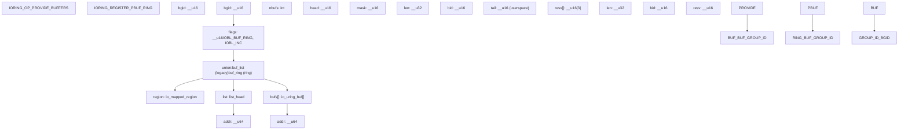
**Sources:** [io\_uring/kbuf.h15-38](https://github.com/torvalds/linux/blob/fcb70a56/io_uring/kbuf.h#L15-L38) [io\_uring/kbuf.c82-93](https://github.com/torvalds/linux/blob/fcb70a56/io_uring/kbuf.c#L82-L93) [include/uapi/linux/io\_uring.h649-676](https://github.com/torvalds/linux/blob/fcb70a56/include/uapi/linux/io_uring.h#L649-L676)

### Buffer Selection Process

When a request has `IOSQE_BUFFER_SELECT` flag set, io\_uring automatically selects a buffer from the specified group.

```mermaid
flowchart TD
    CHECK_FLAG["req->flags & REQ_F_BUFFER_SELECT"]
    GET_GROUP["buf_group from sqe->buf_group"]
    LOOKUP_BL["io_buffer_get_list(ctx, bgid)"]
    CHECK_TYPE["bl->flags & IOBL_BUF_RING?"]
    RING_SELECT["io_ring_buffer_select()"]
    PROVIDED_SELECT["io_provided_buffer_select()"]
    LOAD_TAIL["tail = smp_load_acquire(&br->tail)"]
    CHECK_AVAIL["head != tail?"]
    GET_BUF["buf = &br->bufs[head & mask]"]
    READ_LEN["len = READ_ONCE(buf->len)"]
    SET_FLAGS["req->flags |= REQ_F_BUFFER_RING"]
    COMMIT_LATER["Mark for commit"]
    GET_FIRST["list_first_entry(&bl->buf_list)"]
    LIST_DEL["list_del(&kbuf->list)"]
    DEC_COUNT["bl->nbufs--"]
    SET_KBUF["req->kbuf = kbuf"]

    CHECK --> FLAG_GET_GROUP
    GET --> GROUP_LOOKUP_BL
    LOOKUP --> BL_CHECK_TYPE
    CHECK --> TYPE_RING_SELECT
    CHECK --> TYPE_PROVIDED_SELECT
    RING --> SELECT_LOAD_TAIL
    LOAD --> TAIL_CHECK_AVAIL
    CHECK --> AVAIL_GET_BUF
    GET --> BUF_READ_LEN
    READ --> LEN_SET_FLAGS
    SET --> FLAGS_COMMIT_LATER
    PROVIDED --> SELECT_GET_FIRST
    GET --> FIRST_LIST_DEL
    LIST --> DEL_DEC_COUNT
    DEC --> COUNT_SET_KBUF
```
**Sources:** [io\_uring/kbuf.c201-219](https://github.com/torvalds/linux/blob/fcb70a56/io_uring/kbuf.c#L201-L219) [io\_uring/kbuf.c158-199](https://github.com/torvalds/linux/blob/fcb70a56/io_uring/kbuf.c#L158-L199) [io\_uring/kbuf.c122-156](https://github.com/torvalds/linux/blob/fcb70a56/io_uring/kbuf.c#L122-L156)

### Buffer Commit Protocol

For ring buffers, selection is a two-phase process to handle failures:

1.  **Selection**: Buffer is chosen, `req->flags |= REQ_F_BUFFER_RING | REQ_F_BUFFERS_COMMIT`
2.  **Commit**: On successful completion, `io_kbuf_commit()` advances `bl->head`

For bundled operations (multishot receive), multiple buffers may be consumed:

-   `io_put_kbufs()`: Returns buffer ID and count
-   `io_kbuf_commit()`: Commits specified number of buffers

**Sources:** [io\_uring/kbuf.c58-72](https://github.com/torvalds/linux/blob/fcb70a56/io_uring/kbuf.c#L58-L72) [io\_uring/kbuf.h83-110](https://github.com/torvalds/linux/blob/fcb70a56/io_uring/kbuf.h#L83-L110)

### Buffer Peek for Vectored Operations

Some operations (like vectored send/receive) need to peek at multiple buffers:

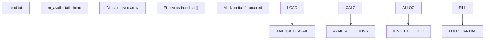
**Sources:** [io\_uring/kbuf.c224-305](https://github.com/torvalds/linux/blob/fcb70a56/io_uring/kbuf.c#L224-L305) [io\_uring/kbuf.c340-361](https://github.com/torvalds/linux/blob/fcb70a56/io_uring/kbuf.c#L340-L361)

### Incremental Buffer Consumption

The `IOBL_INC` flag enables partial buffer consumption for streaming protocols:

-   Instead of consuming entire buffer on partial read, adjust `buf->addr` and `buf->len`
-   Only advance `bl->head` when buffer is fully consumed
-   Enabled via `IORING_PBUF_RING_INC` flag during registration

**Sources:** [io\_uring/kbuf.c35-56](https://github.com/torvalds/linux/blob/fcb70a56/io_uring/kbuf.c#L35-L56) [io\_uring/kbuf.h8-13](https://github.com/torvalds/linux/blob/fcb70a56/io_uring/kbuf.h#L8-L13)

## Performance Features

### Task Work and Completion Batching

The io\_uring system uses task work to batch completions and reduce context switching overhead. Multiple task work mechanisms are available depending on setup flags.

**Diagram: Task Work Execution Paths**


**Task Work Modes:**

| Mode | Setup Flag | Add Function | Run Function | Characteristics |
| --- | --- | --- | --- | --- |
| DEFER\_TASKRUN | `IORING_SETUP_DEFER_TASKRUN` | `io_req_local_work_add()` | `io_run_local_work()` | No task\_work, submitter polls ctx->work\_llist |
| Normal | Default | `io_req_normal_work_add()` | `tctx_task_work()` | Standard Linux task\_work mechanism |
| SQPOLL | `IORING_SETUP_SQPOLL` | N/A | `io_sq_thread()` | Dedicated kernel thread |
| COOP\_TASKRUN | `IORING_SETUP_COOP_TASKRUN` | Similar to normal | `tctx_task_work()` | Run task\_work cooperatively |

**Completion Batching Functions:**

-   `io_submit_flush_completions()`: Flushes `ctx->submit_state.compl_reqs` list
-   `io_req_complete_defer()`: Adds request to deferred completion list
-   `__io_submit_flush_completions()`: Internal flush implementation
-   `io_cqring_wake()`: Wakes waiters on CQ after posting CQEs

**Sources:** [io\_uring/io\_uring.c1205-1273](https://github.com/torvalds/linux/blob/fcb70a56/io_uring/io_uring.c#L1205-L1273) [io\_uring/io\_uring.c1173-1203](https://github.com/torvalds/linux/blob/fcb70a56/io_uring/io_uring.c#L1173-L1203) [io\_uring/io\_uring.c1280-1293](https://github.com/torvalds/linux/blob/fcb70a56/io_uring/io_uring.c#L1280-L1293) [io\_uring/io\_uring.h176-177](https://github.com/torvalds/linux/blob/fcb70a56/io_uring/io_uring.h#L176-L177)

### io-wq Worker Pools

For operations that cannot complete inline (e.g., blocking file I/O), io\_uring uses per-task worker pools managed by `io-wq`.

**Diagram: io-wq Architecture**

```mermaid
flowchart TD
    ISSUE["io_issue_sqe()"]
    CHECK_ASYNC["Returns IOU_RETRY"]
    QUEUE_WQ["io_queue_iowq()"]
    PREP_ASYNC["io_prep_async_link()"]
    IO_WQ["struct io_wq(tctx->io_wq)"]
    ACCT["acct[2]:IO_WQ_ACCT_BOUNDIO_WQ_ACCT_UNBOUND"]
    WORKER_LIST["workers: list_head"]
    FREE_LIST["free_list: list_head"]
    HASH["hash: io_wq_hash"]
    WORKER["struct io_worker"]
    WORK_LIST["work_list: io_wq_work_list"]
    WQ_WORKER["io_wq_worker()"]
    SUBMIT_WORK["io_wq_submit_work()"]
    ISSUE_OP["io_issue_defs[opcode].issue()"]
    COMPLETE["io_req_complete_post()"]
    ENQUEUE["io_wq_enqueue()"]
    SELECT_ACCT["Bound vs UnboundIO_WQ_WORK_UNBOUND"]
    HASH_WORK["io_wq_hash_work()file inode hash"]
    CREATE_WORKER["io_wq_create_worker()"]

    ISSUE --> CHECK_ASYNC
    CHECK --> ASYNC_QUEUE_WQ
    QUEUE --> WQ_PREP_ASYNC
    PREP --> ASYNC_ENQUEUE
    ENQUEUE --> IO_WQ
    IO --> WQ_ACCT
    ACCT --> SELECT_ACCT
    SELECT --> ACCT_HASH_WORK
    HASH --> WORK_HASH
    HASH --> WORKER_LIST
    WORKER --> LIST_WORKER
    WORKER --> WORK_LIST
    WORK --> LIST_WQ_WORKER
    WQ --> WORKER_SUBMIT_WORK
    SUBMIT --> WORK_ISSUE_OP
    ISSUE --> OP_COMPLETE
    SELECT --> ACCT_CREATE_WORKER
    CREATE --> WORKER_WORKER
```
**io-wq Key Structures:**

-   `struct io_wq`: Per-task worker queue in `tctx->io_wq`
-   `struct io_worker`: Individual worker thread
-   `struct io_wq_work`: Work item embedded in `io_kiocb->work`
-   `struct io_wq_hash`: Hash table for serializing hashed work

**Work Types:**

| Flag | Value | Meaning |
| --- | --- | --- |
| `IO_WQ_WORK_CONCURRENT` | Bit 0 | Can run concurrently (e.g., O\_DIRECT) |
| `IO_WQ_WORK_UNBOUND` | Bit 1 | Not bound to CPU (e.g., network, block I/O) |
| `IO_WQ_WORK_CANCEL` | Bit 2 | Work is being canceled |

**Sources:** [io\_uring/io-wq.c1-1000](https://github.com/torvalds/linux/blob/fcb70a56/io_uring/io-wq.c#L1-L1000) [io\_uring/io\_uring.c417-493](https://github.com/torvalds/linux/blob/fcb70a56/io_uring/io_uring.c#L417-L493) [io\_uring/io-wq.h1-200](https://github.com/torvalds/linux/blob/fcb70a56/io_uring/io-wq.h#L1-L200)

### SQPOLL Mode

SQPOLL mode runs a dedicated kernel thread that polls the submission queue, eliminating submission syscalls entirely.

**SQPOLL Thread Lifecycle:**

```mermaid
flowchart TD
    REG_SQPOLL["io_uring_setup()IORING_SETUP_SQPOLL"]
    ALLOC_SQD["io_init_sq_data()"]
    SQ_DATA["struct io_sq_data"]
    THREAD["io_sq_thread_park()"]
    SQ_THREAD["io_sq_thread()"]
    CHECK_STOP["Check IO_SQ_THREAD_SHOULD_STOP"]
    HANDLE_EVENT["io_sqd_handle_event()"]
    CHECK_SQ["io_sqring_entries()"]
    SUBMIT["io_submit_sqes()"]
    IOPOLL["io_do_iopoll()(if IOPOLL)"]
    IDLE_CHECK["Idle timeout check"]
    PARK["io_sq_thread_park()"]
    USER_ENTER["io_uring_enter()IORING_ENTER_SQ_WAKEUP"]
    NEED_WAKEUP["Check IORING_SQ_NEED_WAKEUP"]
    WAKE["wake_up(&sqd->wait)"]
    SQ_FLAGS["rings->sq_flags"]

    REG --> SQPOLL_ALLOC_SQD
    ALLOC --> SQD_SQ_DATA
    SQ --> DATA_THREAD
    THREAD --> SQ_THREAD
    SQ --> THREAD_CHECK_STOP
    CHECK --> STOP_HANDLE_EVENT
    HANDLE --> EVENT_CHECK_SQ
    CHECK --> SQ_SUBMIT
    SUBMIT --> IOPOLL
    IOPOLL --> IDLE_CHECK
    IDLE --> CHECK_PARK
    PARK --> SQ_THREAD
    USER --> ENTER_NEED_WAKEUP
    NEED --> WAKEUP_WAKE
    WAKE --> SQ_FLAGS
    SQ --> FLAGS_SQ_THREAD
```
**SQPOLL Configuration:**

-   `sq_thread_idle`: Idle timeout in milliseconds (from params)
-   `sq_thread_cpu`: CPU affinity for SQPOLL thread (with `IORING_SETUP_SQ_AFF`)
-   `IORING_SQ_NEED_WAKEUP`: Flag set when thread is idle and needs explicit wakeup

**Sources:** [io\_uring/sqpoll.c1-400](https://github.com/torvalds/linux/blob/fcb70a56/io_uring/sqpoll.c#L1-L400) [io\_uring/sqpoll.c194-386](https://github.com/torvalds/linux/blob/fcb70a56/io_uring/sqpoll.c#L194-L386)

### IOPOLL Mode

IOPOLL mode uses busy-polling for low-latency block I/O devices, bypassing interrupt-based completion.

**IOPOLL Execution:**

1.  Requests are issued with `kiocb->ki_complete = io_complete_rw_iopoll`
2.  Instead of waiting for interrupts, `io_do_iopoll()` polls device
3.  Polling occurs in `io_uring_enter()` or SQPOLL thread
4.  For NVMe, uses `nvme_ns->poll()` → `blk_mq_poll()`

**IOPOLL Configuration Flags:**

-   `IORING_SETUP_IOPOLL`: Enable IOPOLL mode
-   `IORING_SETUP_HYBRID_IOPOLL`: Hybrid busy-poll with fallback to blocking

**Sources:** [io\_uring/io\_uring.c1559-1640](https://github.com/torvalds/linux/blob/fcb70a56/io_uring/io_uring.c#L1559-L1640) [io\_uring/rw.c680-730](https://github.com/torvalds/linux/blob/fcb70a56/io_uring/rw.c#L680-L730)

### Zero-Copy Networking

Advanced zero-copy receive functionality is provided through the zcrx subsystem for high-performance network applications.

```mermaid
flowchart TD
    ZCRX_IFQ["io_zcrx_ifq"]
    ZCRX_AREA["io_zcrx_area"]
    PAGE_POOL["page_pool integration"]
    DMABUF["DMA-BUF support"]
    USER_MEM["User memory mapping"]
    NET_IOV["net_iov structures"]
    SOCK_OPS["Socket operations"]
    RX_QUEUE["Network RX queue"]
    COMPLETION["Direct completion"]

    ZCRX --> IFQ_ZCRX_AREA
    ZCRX --> AREA_PAGE_POOL
    ZCRX --> AREA_DMABUF
    ZCRX --> AREA_USER_MEM
    PAGE --> POOL_NET_IOV
    NET --> IOV_SOCK_OPS
    SOCK --> OPS_RX_QUEUE
    RX --> QUEUE_COMPLETION
```
**Sources:** [io\_uring/zcrx.c31-50](https://github.com/torvalds/linux/blob/fcb70a56/io_uring/zcrx.c#L31-L50) [io\_uring/zcrx.c155-293](https://github.com/torvalds/linux/blob/fcb70a56/io_uring/zcrx.c#L155-L293)
