# Btrfs Copy-on-Write Filesystem

Relevant source files

-   [fs/afs/callback.c](https://github.com/torvalds/linux/blob/fcb70a56/fs/afs/callback.c)
-   [fs/btrfs/accessors.h](https://github.com/torvalds/linux/blob/fcb70a56/fs/btrfs/accessors.h)
-   [fs/btrfs/backref.c](https://github.com/torvalds/linux/blob/fcb70a56/fs/btrfs/backref.c)
-   [fs/btrfs/bio.c](https://github.com/torvalds/linux/blob/fcb70a56/fs/btrfs/bio.c)
-   [fs/btrfs/bio.h](https://github.com/torvalds/linux/blob/fcb70a56/fs/btrfs/bio.h)
-   [fs/btrfs/block-group.c](https://github.com/torvalds/linux/blob/fcb70a56/fs/btrfs/block-group.c)
-   [fs/btrfs/block-group.h](https://github.com/torvalds/linux/blob/fcb70a56/fs/btrfs/block-group.h)
-   [fs/btrfs/btrfs\_inode.h](https://github.com/torvalds/linux/blob/fcb70a56/fs/btrfs/btrfs_inode.h)
-   [fs/btrfs/compression.c](https://github.com/torvalds/linux/blob/fcb70a56/fs/btrfs/compression.c)
-   [fs/btrfs/compression.h](https://github.com/torvalds/linux/blob/fcb70a56/fs/btrfs/compression.h)
-   [fs/btrfs/ctree.c](https://github.com/torvalds/linux/blob/fcb70a56/fs/btrfs/ctree.c)
-   [fs/btrfs/defrag.c](https://github.com/torvalds/linux/blob/fcb70a56/fs/btrfs/defrag.c)
-   [fs/btrfs/delayed-inode.c](https://github.com/torvalds/linux/blob/fcb70a56/fs/btrfs/delayed-inode.c)
-   [fs/btrfs/delayed-inode.h](https://github.com/torvalds/linux/blob/fcb70a56/fs/btrfs/delayed-inode.h)
-   [fs/btrfs/delayed-ref.c](https://github.com/torvalds/linux/blob/fcb70a56/fs/btrfs/delayed-ref.c)
-   [fs/btrfs/delayed-ref.h](https://github.com/torvalds/linux/blob/fcb70a56/fs/btrfs/delayed-ref.h)
-   [fs/btrfs/dev-replace.c](https://github.com/torvalds/linux/blob/fcb70a56/fs/btrfs/dev-replace.c)
-   [fs/btrfs/dir-item.c](https://github.com/torvalds/linux/blob/fcb70a56/fs/btrfs/dir-item.c)
-   [fs/btrfs/direct-io.c](https://github.com/torvalds/linux/blob/fcb70a56/fs/btrfs/direct-io.c)
-   [fs/btrfs/disk-io.c](https://github.com/torvalds/linux/blob/fcb70a56/fs/btrfs/disk-io.c)
-   [fs/btrfs/disk-io.h](https://github.com/torvalds/linux/blob/fcb70a56/fs/btrfs/disk-io.h)
-   [fs/btrfs/extent-tree.c](https://github.com/torvalds/linux/blob/fcb70a56/fs/btrfs/extent-tree.c)
-   [fs/btrfs/extent-tree.h](https://github.com/torvalds/linux/blob/fcb70a56/fs/btrfs/extent-tree.h)
-   [fs/btrfs/extent\_io.c](https://github.com/torvalds/linux/blob/fcb70a56/fs/btrfs/extent_io.c)
-   [fs/btrfs/extent\_io.h](https://github.com/torvalds/linux/blob/fcb70a56/fs/btrfs/extent_io.h)
-   [fs/btrfs/file-item.c](https://github.com/torvalds/linux/blob/fcb70a56/fs/btrfs/file-item.c)
-   [fs/btrfs/file-item.h](https://github.com/torvalds/linux/blob/fcb70a56/fs/btrfs/file-item.h)
-   [fs/btrfs/file.c](https://github.com/torvalds/linux/blob/fcb70a56/fs/btrfs/file.c)
-   [fs/btrfs/free-space-cache.c](https://github.com/torvalds/linux/blob/fcb70a56/fs/btrfs/free-space-cache.c)
-   [fs/btrfs/free-space-cache.h](https://github.com/torvalds/linux/blob/fcb70a56/fs/btrfs/free-space-cache.h)
-   [fs/btrfs/free-space-tree.c](https://github.com/torvalds/linux/blob/fcb70a56/fs/btrfs/free-space-tree.c)
-   [fs/btrfs/fs.h](https://github.com/torvalds/linux/blob/fcb70a56/fs/btrfs/fs.h)
-   [fs/btrfs/inode-item.c](https://github.com/torvalds/linux/blob/fcb70a56/fs/btrfs/inode-item.c)
-   [fs/btrfs/inode.c](https://github.com/torvalds/linux/blob/fcb70a56/fs/btrfs/inode.c)
-   [fs/btrfs/ioctl.c](https://github.com/torvalds/linux/blob/fcb70a56/fs/btrfs/ioctl.c)
-   [fs/btrfs/messages.c](https://github.com/torvalds/linux/blob/fcb70a56/fs/btrfs/messages.c)
-   [fs/btrfs/messages.h](https://github.com/torvalds/linux/blob/fcb70a56/fs/btrfs/messages.h)
-   [fs/btrfs/misc.h](https://github.com/torvalds/linux/blob/fcb70a56/fs/btrfs/misc.h)
-   [fs/btrfs/ordered-data.c](https://github.com/torvalds/linux/blob/fcb70a56/fs/btrfs/ordered-data.c)
-   [fs/btrfs/qgroup.c](https://github.com/torvalds/linux/blob/fcb70a56/fs/btrfs/qgroup.c)
-   [fs/btrfs/raid-stripe-tree.c](https://github.com/torvalds/linux/blob/fcb70a56/fs/btrfs/raid-stripe-tree.c)
-   [fs/btrfs/raid56.c](https://github.com/torvalds/linux/blob/fcb70a56/fs/btrfs/raid56.c)
-   [fs/btrfs/raid56.h](https://github.com/torvalds/linux/blob/fcb70a56/fs/btrfs/raid56.h)
-   [fs/btrfs/ref-verify.c](https://github.com/torvalds/linux/blob/fcb70a56/fs/btrfs/ref-verify.c)
-   [fs/btrfs/reflink.c](https://github.com/torvalds/linux/blob/fcb70a56/fs/btrfs/reflink.c)
-   [fs/btrfs/relocation.c](https://github.com/torvalds/linux/blob/fcb70a56/fs/btrfs/relocation.c)
-   [fs/btrfs/relocation.h](https://github.com/torvalds/linux/blob/fcb70a56/fs/btrfs/relocation.h)
-   [fs/btrfs/root-tree.c](https://github.com/torvalds/linux/blob/fcb70a56/fs/btrfs/root-tree.c)
-   [fs/btrfs/scrub.c](https://github.com/torvalds/linux/blob/fcb70a56/fs/btrfs/scrub.c)
-   [fs/btrfs/send.c](https://github.com/torvalds/linux/blob/fcb70a56/fs/btrfs/send.c)
-   [fs/btrfs/space-info.c](https://github.com/torvalds/linux/blob/fcb70a56/fs/btrfs/space-info.c)
-   [fs/btrfs/space-info.h](https://github.com/torvalds/linux/blob/fcb70a56/fs/btrfs/space-info.h)
-   [fs/btrfs/subpage.c](https://github.com/torvalds/linux/blob/fcb70a56/fs/btrfs/subpage.c)
-   [fs/btrfs/subpage.h](https://github.com/torvalds/linux/blob/fcb70a56/fs/btrfs/subpage.h)
-   [fs/btrfs/super.c](https://github.com/torvalds/linux/blob/fcb70a56/fs/btrfs/super.c)
-   [fs/btrfs/transaction.c](https://github.com/torvalds/linux/blob/fcb70a56/fs/btrfs/transaction.c)
-   [fs/btrfs/tree-checker.c](https://github.com/torvalds/linux/blob/fcb70a56/fs/btrfs/tree-checker.c)
-   [fs/btrfs/tree-log.c](https://github.com/torvalds/linux/blob/fcb70a56/fs/btrfs/tree-log.c)
-   [fs/btrfs/tree-log.h](https://github.com/torvalds/linux/blob/fcb70a56/fs/btrfs/tree-log.h)
-   [fs/btrfs/volumes.c](https://github.com/torvalds/linux/blob/fcb70a56/fs/btrfs/volumes.c)
-   [fs/btrfs/volumes.h](https://github.com/torvalds/linux/blob/fcb70a56/fs/btrfs/volumes.h)
-   [fs/btrfs/xattr.c](https://github.com/torvalds/linux/blob/fcb70a56/fs/btrfs/xattr.c)
-   [fs/btrfs/zoned.c](https://github.com/torvalds/linux/blob/fcb70a56/fs/btrfs/zoned.c)
-   [include/uapi/linux/btrfs.h](https://github.com/torvalds/linux/blob/fcb70a56/include/uapi/linux/btrfs.h)

## Purpose and Scope

This document describes the Btrfs (B-tree filesystem) implementation in the Linux kernel, focusing on its copy-on-write (COW) architecture, B-tree-based storage structures, extent management, and advanced features including snapshots, RAID, compression, and data integrity mechanisms. Btrfs is designed as a modern filesystem with built-in volume management, checksumming, and support for advanced storage scenarios including zoned devices.

For information about the VFS layer that Btrfs integrates with, see [Virtual File System Layer](/torvalds/linux/5.2-btrfs-copy-on-write-filesystem). For flash-optimized filesystems, see [F2FS Flash Filesystem](#5.3.1). For layered filesystems that can use Btrfs as backing storage, see [OverlayFS and Layered Filesystems](#5.3.3).

## Architecture Overview

Btrfs implements a copy-on-write B-tree filesystem with integrated volume management. The architecture consists of multiple interconnected B-trees managing different aspects of the filesystem, with all modifications using COW semantics.

### High-Level Component Structure

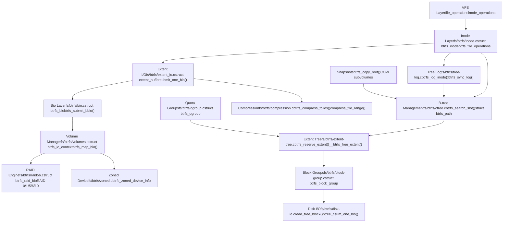
Sources: [fs/btrfs/inode.c1-100](https://github.com/torvalds/linux/blob/fcb70a56/fs/btrfs/inode.c#L1-L100) [fs/btrfs/ctree.c1-50](https://github.com/torvalds/linux/blob/fcb70a56/fs/btrfs/ctree.c#L1-L50) [fs/btrfs/extent-tree.c1-50](https://github.com/torvalds/linux/blob/fcb70a56/fs/btrfs/extent-tree.c#L1-L50) [fs/btrfs/extent\_io.c1-50](https://github.com/torvalds/linux/blob/fcb70a56/fs/btrfs/extent_io.c#L1-L50) [fs/btrfs/bio.c1-50](https://github.com/torvalds/linux/blob/fcb70a56/fs/btrfs/bio.c#L1-L50) [fs/btrfs/tree-log.c1-100](https://github.com/torvalds/linux/blob/fcb70a56/fs/btrfs/tree-log.c#L1-L100)

## Core Data Structures

### B-tree Management (ctree)

Btrfs uses multiple B-trees to organize filesystem metadata. The central tree structure is managed by `ctree.c`, which provides search, insertion, and deletion operations.

**Key B-tree Types:**

| Tree Type | Purpose | Root Location |
| --- | --- | --- |
| FS Tree | File and directory metadata | Per-subvolume |
| Extent Tree | Extent allocation tracking | Global |
| Chunk Tree | Device extent mapping | Global |
| Device Tree | Device information | Global |
| Root Tree | Subvolume root pointers | Global |
| Log Tree | Fast fsync operations | Per-subvolume |
| Checksum Tree | Data checksums | Global |

**Primary B-tree Operations:**

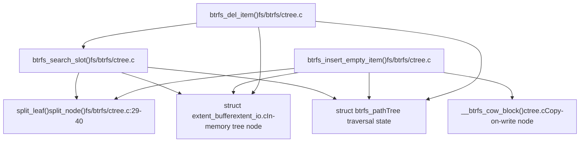
The `struct btrfs_path` is used for tree traversal, maintaining locks and references to tree nodes at each level:

```
struct btrfs_path
├── nodes[BTRFS_MAX_LEVEL] - extent_buffer pointers for each tree level
├── slots[BTRFS_MAX_LEVEL] - current slot in each node
├── locks[BTRFS_MAX_LEVEL] - lock state (read/write) for each level
└── Functions: btrfs_alloc_path(), btrfs_free_path(), btrfs_release_path()
```
Sources: [fs/btrfs/ctree.c27-175](https://github.com/torvalds/linux/blob/fcb70a56/fs/btrfs/ctree.c#L27-L175) [fs/btrfs/ctree.c138-153](https://github.com/torvalds/linux/blob/fcb70a56/fs/btrfs/ctree.c#L138-L153) [fs/btrfs/ctree.c160-175](https://github.com/torvalds/linux/blob/fcb70a56/fs/btrfs/ctree.c#L160-L175)

### Extent Buffers

Extent buffers (`struct extent_buffer` in `extent_io.c`) represent in-memory tree nodes and are the fundamental unit for B-tree operations. They are managed by the extent I/O subsystem.

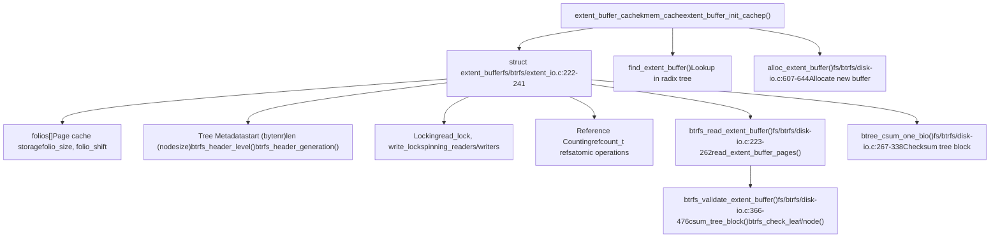
Sources: [fs/btrfs/extent\_io.c222-241](https://github.com/torvalds/linux/blob/fcb70a56/fs/btrfs/extent_io.c#L222-L241) [fs/btrfs/disk-io.c223-262](https://github.com/torvalds/linux/blob/fcb70a56/fs/btrfs/disk-io.c#L223-L262) [fs/btrfs/disk-io.c267-338](https://github.com/torvalds/linux/blob/fcb70a56/fs/btrfs/disk-io.c#L267-L338) [fs/btrfs/disk-io.c366-476](https://github.com/torvalds/linux/blob/fcb70a56/fs/btrfs/disk-io.c#L366-L476) [fs/btrfs/disk-io.c607-644](https://github.com/torvalds/linux/blob/fcb70a56/fs/btrfs/disk-io.c#L607-L644)

### Inode Structure

The `struct btrfs_inode` (defined in `fs/btrfs/btrfs_inode.h`) extends the VFS inode with Btrfs-specific metadata:

```
struct btrfs_inode (btrfs_inode.h:45-350)
├── vfs_inode - Standard VFS inode (struct inode)
├── root - struct btrfs_root pointer to containing subvolume
├── io_tree - struct extent_io_tree for extent state tracking
│   ├── EXTENT_DELALLOC - Delayed allocation ranges
│   ├── EXTENT_LOCKED - Locked ranges during I/O
│   ├── EXTENT_UPTODATE - Cached data
│   └── EXTENT_DIRTY - Dirty ranges
├── file_extent_tree - struct extent_io_tree for file extent mapping
├── ordered_tree - struct rb_root for ordered extent tracking
├── disk_i_size - u64 size on disk (may lag i_size during writes)
├── flags - u32 inode flags:
│   ├── BTRFS_INODE_NODATACOW - Don't COW data
│   ├── BTRFS_INODE_COMPRESS - Enable compression
│   ├── BTRFS_INODE_NOCOMPRESS - Disable compression
│   ├── BTRFS_INODE_PREALLOC - Preallocated extents
│   └── BTRFS_INODE_SYNC - Synchronous I/O
├── delalloc_bytes - u64 bytes in delalloc state
├── csum_bytes - u64 bytes needing checksum
├── defrag_compress - Compression for defrag
└── ordered_extents - List of struct btrfs_ordered_extent
```
Sources: [fs/btrfs/btrfs\_inode.h1-350](https://github.com/torvalds/linux/blob/fcb70a56/fs/btrfs/btrfs_inode.h#L1-L350)

## Copy-on-Write Mechanism

Btrfs implements copy-on-write at multiple levels: data extents, metadata blocks, and entire B-tree nodes. This enables snapshots, crash recovery, and efficient cloning.

### COW Data Write Path

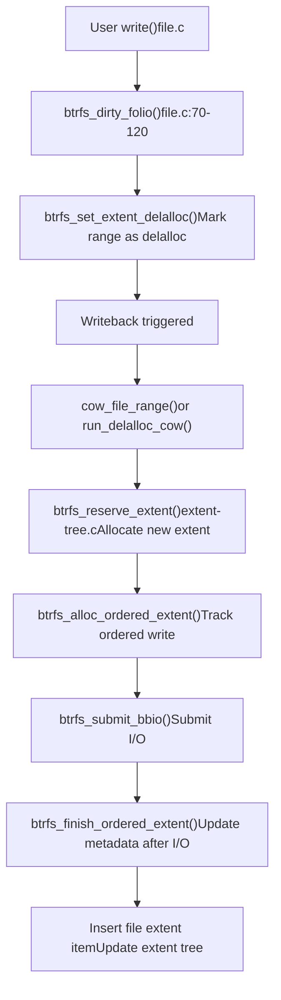
**COW Flow for File Data:**

1.  **Delalloc Phase** [fs/btrfs/inode.c77-120](https://github.com/torvalds/linux/blob/fcb70a56/fs/btrfs/inode.c#L77-L120) - User writes mark pages dirty and set the `EXTENT_DELALLOC` bit in the `io_tree`
2.  **Extent Reservation** [fs/btrfs/extent-tree.c](https://github.com/torvalds/linux/blob/fcb70a56/fs/btrfs/extent-tree.c) - During writeback, allocate new extents without modifying old data
3.  **Ordered Extent Creation** - Track the write with `btrfs_ordered_extent` to maintain consistency
4.  **Bio Submission** [fs/btrfs/bio.c](https://github.com/torvalds/linux/blob/fcb70a56/fs/btrfs/bio.c) - Write data to new location
5.  **Metadata Update** - After successful write, insert new file extent item in transaction

### COW Metadata Write Path

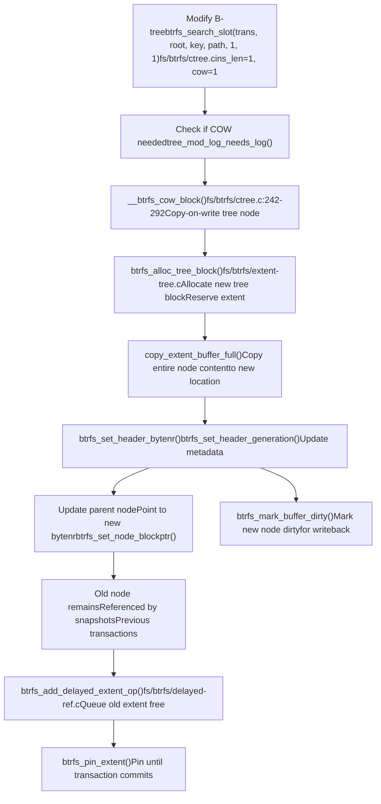
The COW mechanism for metadata ensures that:

-   Snapshots see a consistent point-in-time view via unchanged old tree blocks
-   Crash recovery can roll back to last committed transaction stored in superblock
-   Concurrent readers can access old versions while writers modify new copies
-   Old extents are freed only after new transaction commits via delayed references

Sources: [fs/btrfs/ctree.c242-292](https://github.com/torvalds/linux/blob/fcb70a56/fs/btrfs/ctree.c#L242-L292) [fs/btrfs/extent-tree.c1-100](https://github.com/torvalds/linux/blob/fcb70a56/fs/btrfs/extent-tree.c#L1-L100) [fs/btrfs/delayed-ref.c1-50](https://github.com/torvalds/linux/blob/fcb70a56/fs/btrfs/delayed-ref.c#L1-L50)

## Extent Management

Btrfs manages disk space through extents tracked in the extent allocation tree. Each extent represents a contiguous range of disk blocks.

### Extent Allocation Tree Structure

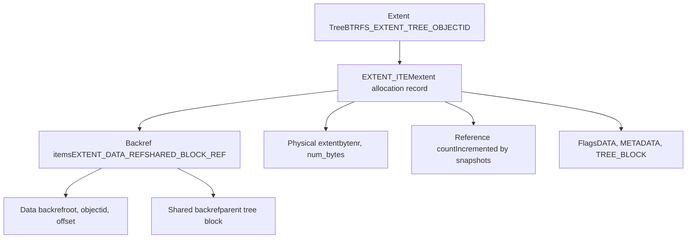
**Extent Allocation Flow:**

The function `btrfs_reserve_extent()` [fs/btrfs/extent-tree.c](https://github.com/torvalds/linux/blob/fcb70a56/fs/btrfs/extent-tree.c) allocates space:

1.  Select appropriate block group based on data/metadata type and RAID profile
2.  Search free space in block group using either free space cache or free space tree
3.  Reserve the extent in memory structures
4.  Insert extent item into extent tree during transaction commit

**File Extent Items:**

File data extents are tracked with `EXTENT_DATA` items in the FS tree:

```
File Extent Item
├── disk_bytenr - Physical location (or 0 for holes/inline)
├── disk_num_bytes - Size of extent on disk
├── offset - Offset within disk extent (for shared extents)
├── num_bytes - Logical size in file
├── compression - Compression type (NONE, ZLIB, LZO, ZSTD)
└── encryption - Encryption type (currently unused)
```
Sources: [fs/btrfs/extent-tree.c1-100](https://github.com/torvalds/linux/blob/fcb70a56/fs/btrfs/extent-tree.c#L1-L100) [fs/btrfs/file.c137-248](https://github.com/torvalds/linux/blob/fcb70a56/fs/btrfs/file.c#L137-L248)

### Delayed References

Btrfs uses delayed references to batch extent tree updates for efficiency:

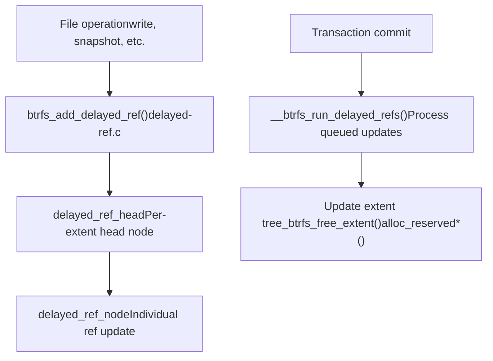
Delayed references accumulate reference count changes (+1 for new refs, -1 for deletions) and are applied in batches during transaction commit, reducing B-tree modifications.

Sources: [fs/btrfs/delayed-ref.c1-50](https://github.com/torvalds/linux/blob/fcb70a56/fs/btrfs/delayed-ref.c#L1-L50) [fs/btrfs/extent-tree.c48-61](https://github.com/torvalds/linux/blob/fcb70a56/fs/btrfs/extent-tree.c#L48-L61)

## Snapshots and Subvolumes

Snapshots and subvolumes are core features enabled by COW. Each subvolume is an independent B-tree namespace with its own root.

### Subvolume Structure

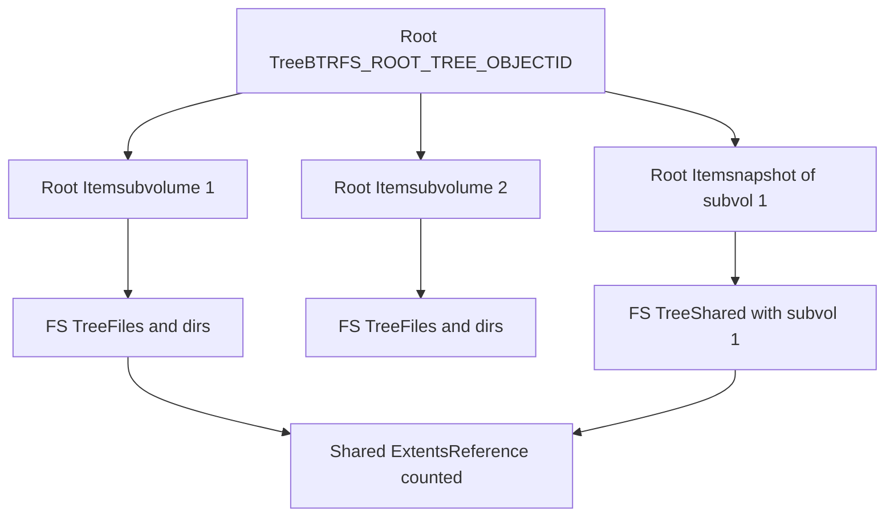
**Snapshot Creation:**

Creating a snapshot involves:

1.  COW the root tree block of source subvolume
2.  Create new root item pointing to the COW'd tree
3.  Increment reference counts on all shared extents (via delayed refs)
4.  Both subvolumes now share the same tree blocks and extents

All subsequent modifications use COW, so the snapshot remains unchanged while the original subvolume evolves.

Sources: [fs/btrfs/ioctl.c1-100](https://github.com/torvalds/linux/blob/fcb70a56/fs/btrfs/ioctl.c#L1-L100) [fs/btrfs/ctree.c177-186](https://github.com/torvalds/linux/blob/fcb70a56/fs/btrfs/ctree.c#L177-L186)

### Reference Counting

Btrfs maintains reference counts for extents in the extent tree. When an extent is referenced by multiple snapshots, its reference count reflects this:

-   **Simple reference**: Single owner, ref\_count = 1
-   **Shared reference**: Multiple owners (snapshots), ref\_count > 1
-   **Backref walking**: [fs/btrfs/backref.c](https://github.com/torvalds/linux/blob/fcb70a56/fs/btrfs/backref.c) provides functions to find all references to an extent

## RAID Support

Btrfs implements software RAID with support for RAID 0, 1, 10, 5, and 6. The RAID layer is integrated into the volume manager.

### RAID Architecture

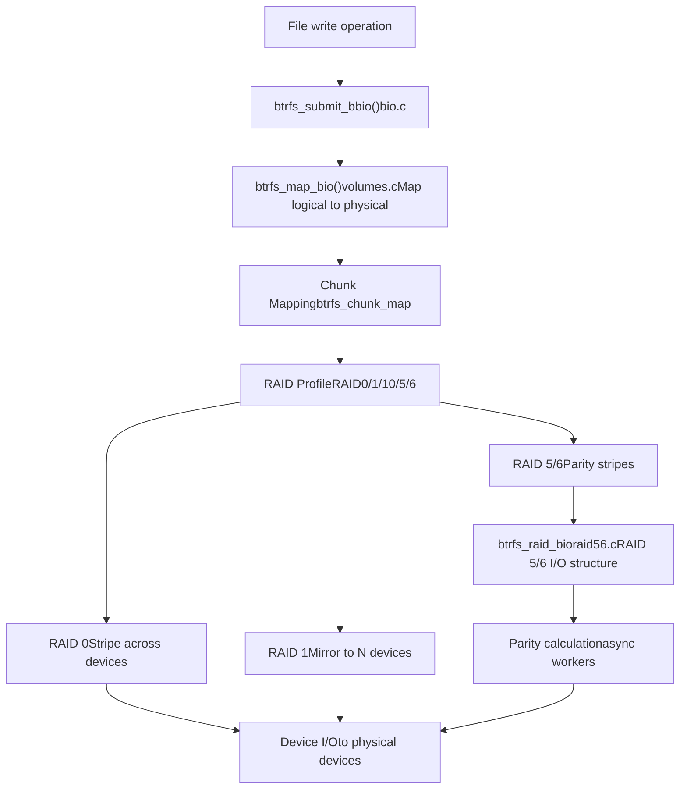
**RAID Profiles:**

| Profile | Redundancy | Min Devices | Description |
| --- | --- | --- | --- |
| RAID0 | None | 2 | Striping for performance |
| RAID1 | 1 copy | 2 | Mirroring (2-way or N-way) |
| RAID10 | 1 copy | 4 | Striped mirrors |
| RAID5 | 1 parity | 3 | Single parity stripe |
| RAID6 | 2 parity | 4 | Double parity stripe |

RAID 5/6 implementation is in [fs/btrfs/raid56.c1-150](https://github.com/torvalds/linux/blob/fcb70a56/fs/btrfs/raid56.c#L1-L150) with support for:

-   Parity calculation using CPU or async workers
-   Read-modify-write for partial stripe updates
-   Reconstruction on device failure
-   Scrubbing to verify parity correctness

Sources: [fs/btrfs/volumes.c1-100](https://github.com/torvalds/linux/blob/fcb70a56/fs/btrfs/volumes.c#L1-L100) [fs/btrfs/raid56.c1-150](https://github.com/torvalds/linux/blob/fcb70a56/fs/btrfs/raid56.c#L1-L150)

## Compression

Btrfs supports transparent compression of file data with multiple algorithms. Compression is applied per extent during writeback.

### Compression Flow

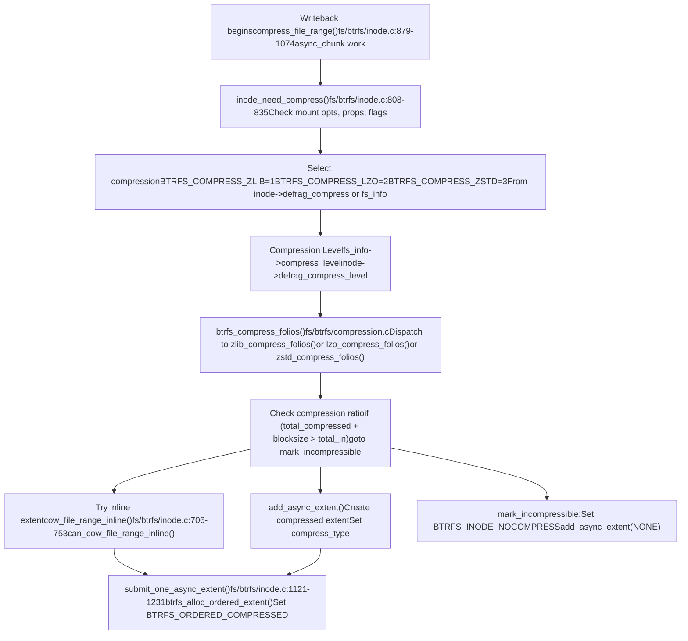
**Compression Algorithms:**

Btrfs supports multiple compression algorithms [fs/btrfs/compression.c1-100](https://github.com/torvalds/linux/blob/fcb70a56/fs/btrfs/compression.c#L1-L100):

-   **ZLIB** (`BTRFS_COMPRESS_ZLIB`): Default, balanced compression ratio using deflate
-   **LZO** (`BTRFS_COMPRESS_LZO`): Fast compression with lower ratio, suitable for CPU-constrained systems
-   **ZSTD** (`BTRFS_COMPRESS_ZSTD`): Modern algorithm with configurable levels (1-15), best balance of speed and ratio

Compression is controlled by:

1.  Mount options: `compress=zlib`, `compress=lzo`, `compress=zstd:level`
2.  Per-file properties: `btrfs.compression` extended attribute
3.  Inode flags: `BTRFS_INODE_COMPRESS`, `BTRFS_INODE_NOCOMPRESS` [fs/btrfs/btrfs\_inode.h](https://github.com/torvalds/linux/blob/fcb70a56/fs/btrfs/btrfs_inode.h)
4.  Defrag settings: `inode->defrag_compress` and `inode->defrag_compress_level`

**Decompression on Read:**

Compressed extents are decompressed during read via `btrfs_submit_compressed_read()` [fs/btrfs/compression.c](https://github.com/torvalds/linux/blob/fcb70a56/fs/btrfs/compression.c) which:

1.  Allocates decompression pages
2.  Submits read bio for compressed data
3.  Queues async decompression work on completion
4.  Copies decompressed data to page cache

Sources: [fs/btrfs/inode.c808-835](https://github.com/torvalds/linux/blob/fcb70a56/fs/btrfs/inode.c#L808-L835) [fs/btrfs/inode.c879-1074](https://github.com/torvalds/linux/blob/fcb70a56/fs/btrfs/inode.c#L879-L1074) [fs/btrfs/inode.c706-753](https://github.com/torvalds/linux/blob/fcb70a56/fs/btrfs/inode.c#L706-L753) [fs/btrfs/inode.c1121-1231](https://github.com/torvalds/linux/blob/fcb70a56/fs/btrfs/inode.c#L1121-L1231) [fs/btrfs/compression.c1-100](https://github.com/torvalds/linux/blob/fcb70a56/fs/btrfs/compression.c#L1-L100)

## Data Integrity and Checksumming

Btrfs checksums all data and metadata to detect corruption. Checksums are stored separately from data in the checksum tree.

### Checksumming Architecture

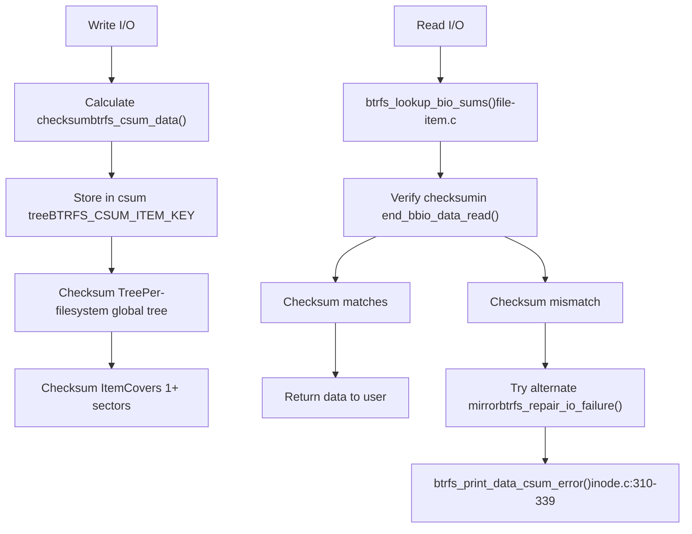
**Checksum Types:**

Btrfs supports multiple checksum algorithms configured at filesystem creation:

-   CRC32C (default)
-   XXHASH
-   SHA256
-   BLAKE2

**Metadata Checksumming:**

Tree blocks are checksummed in `btree_csum_one_bio()` [fs/btrfs/disk-io.c267-338](https://github.com/torvalds/linux/blob/fcb70a56/fs/btrfs/disk-io.c#L267-L338) before write. On read, `btrfs_validate_extent_buffer()` [fs/btrfs/disk-io.c366-476](https://github.com/torvalds/linux/blob/fcb70a56/fs/btrfs/disk-io.c#L366-L476) verifies the checksum.

**Error Detection and Repair:**

When a checksum mismatch is detected:

1.  Try reading from alternate mirror (RAID1/10)
2.  If successful, repair the corrupted copy via `btrfs_repair_io_failure()` [fs/btrfs/disk-io.c182-214](https://github.com/torvalds/linux/blob/fcb70a56/fs/btrfs/disk-io.c#L182-L214)
3.  If all copies are corrupt, return error to user

Sources: [fs/btrfs/disk-io.c74-112](https://github.com/torvalds/linux/blob/fcb70a56/fs/btrfs/disk-io.c#L74-L112) [fs/btrfs/disk-io.c267-338](https://github.com/torvalds/linux/blob/fcb70a56/fs/btrfs/disk-io.c#L267-L338) [fs/btrfs/inode.c310-339](https://github.com/torvalds/linux/blob/fcb70a56/fs/btrfs/inode.c#L310-L339) [fs/btrfs/extent\_io.c574-622](https://github.com/torvalds/linux/blob/fcb70a56/fs/btrfs/extent_io.c#L574-L622)

## Tree Logging for Fast Fsync

Btrfs uses a per-subvolume log tree to optimize `fsync()` operations, avoiding full transaction commits for most cases.

### Tree Log Architecture

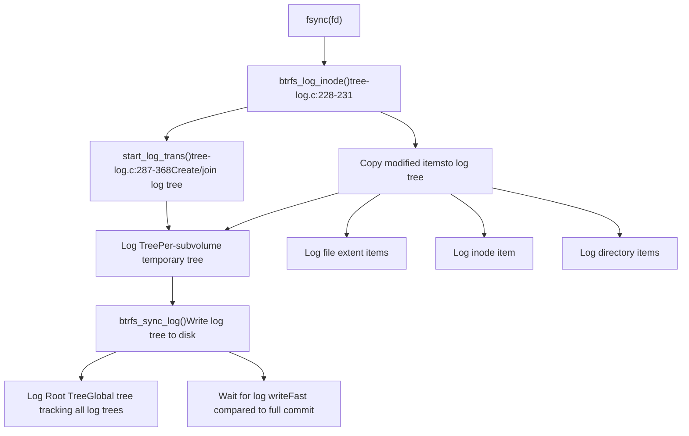
**Log Replay on Mount:**

After a crash, `btrfs_recover_log_trees()` [fs/btrfs/tree-log.c](https://github.com/torvalds/linux/blob/fcb70a56/fs/btrfs/tree-log.c) replays logged operations:

1.  **PIN stage** [fs/btrfs/tree-log.c99-104](https://github.com/torvalds/linux/blob/fcb70a56/fs/btrfs/tree-log.c#L99-L104) - Pin logged extents to prevent reuse
2.  **REPLAY\_INODES stage** [fs/btrfs/tree-log.c101](https://github.com/torvalds/linux/blob/fcb70a56/fs/btrfs/tree-log.c#L101-L101) - Recreate inodes
3.  **REPLAY\_DIR\_INDEX stage** [fs/btrfs/tree-log.c102](https://github.com/torvalds/linux/blob/fcb70a56/fs/btrfs/tree-log.c#L102-L102) - Recreate directory entries
4.  **REPLAY\_ALL stage** [fs/btrfs/tree-log.c103](https://github.com/torvalds/linux/blob/fcb70a56/fs/btrfs/tree-log.c#L103-L103) - Apply all remaining changes

The log tree is designed to be minimal - only logging what's necessary for crash consistency, making fsync significantly faster than committing the entire filesystem transaction.

Sources: [fs/btrfs/tree-log.c1-258](https://github.com/torvalds/linux/blob/fcb70a56/fs/btrfs/tree-log.c#L1-L258) [fs/btrfs/tree-log.c287-368](https://github.com/torvalds/linux/blob/fcb70a56/fs/btrfs/tree-log.c#L287-L368)

## Multi-Device and Volume Management

Btrfs includes integrated volume management, allowing multiple devices to be combined into a single filesystem with various RAID profiles.

### Volume Management Structure

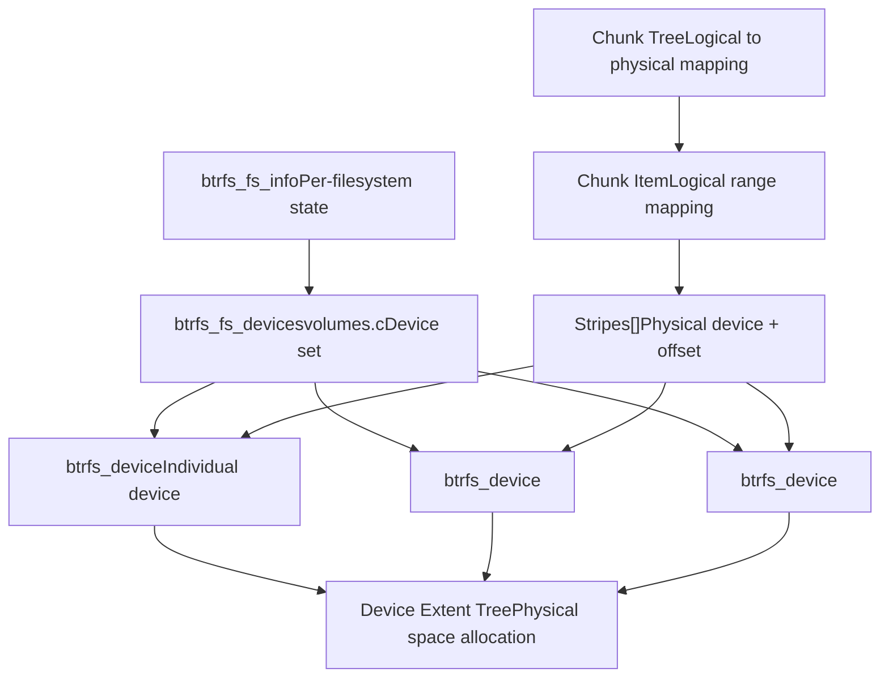
**Chunk Allocation:**

Chunks are large contiguous allocations (typically 1GB for data, 256MB for metadata) that map logical addresses to physical device locations:

```
btrfs_chunk_map
├── start - Logical address
├── length - Chunk size
├── type - DATA, METADATA, or SYSTEM + RAID profile
├── num_stripes - Number of stripes in chunk
└── stripes[] - Array of (device, offset) pairs
```
The function `btrfs_map_block()` [fs/btrfs/volumes.c](https://github.com/torvalds/linux/blob/fcb70a56/fs/btrfs/volumes.c) converts logical addresses to physical device locations using chunk mappings.

**Device Operations:**

-   **Add device**: Extends filesystem capacity
-   **Remove device**: Relocates data and rebalances
-   **Replace device**: For failing drive replacement
-   **Resize**: Grow or shrink filesystem on device

Sources: [fs/btrfs/volumes.c1-100](https://github.com/torvalds/linux/blob/fcb70a56/fs/btrfs/volumes.c#L1-L100) [fs/btrfs/volumes.c37-96](https://github.com/torvalds/linux/blob/fcb70a56/fs/btrfs/volumes.c#L37-L96)

## Zoned Device Support

Btrfs supports zoned block devices (ZBC/ZNS) which have sequential write constraints. The zoned mode ensures all writes are sequential within zones.

### Zoned Device Architecture

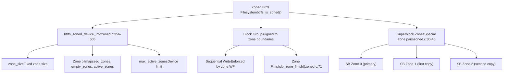
**Key Zoned Constraints:**

1.  **Sequential Writes**: All writes within a zone must be sequential, enforced by zone write pointers
2.  **Zone Alignment**: Block groups align to zone boundaries
3.  **Active Zone Limits**: Devices limit number of concurrently active zones
4.  **No In-Place Updates**: COW is mandatory (NODATACOW not supported)

**Zoned Operations:**

-   **Zone allocation**: Track zone write pointers and allocate from empty/active zones
-   **Zone finishing**: Close zones when block group is full [fs/btrfs/zoned.c71](https://github.com/torvalds/linux/blob/fcb70a56/fs/btrfs/zoned.c#L71-L71)
-   **Reset zones**: Reset write pointer when freeing block group
-   **Superblock zones**: Use zone pairs for superblock with log-structured updates [fs/btrfs/zoned.c88-161](https://github.com/torvalds/linux/blob/fcb70a56/fs/btrfs/zoned.c#L88-L161)

Sources: [fs/btrfs/zoned.c1-70](https://github.com/torvalds/linux/blob/fcb70a56/fs/btrfs/zoned.c#L1-L70) [fs/btrfs/zoned.c355-605](https://github.com/torvalds/linux/blob/fcb70a56/fs/btrfs/zoned.c#L355-L605) [fs/btrfs/zoned.c88-161](https://github.com/torvalds/linux/blob/fcb70a56/fs/btrfs/zoned.c#L88-L161)

## I/O Path

### Read Path

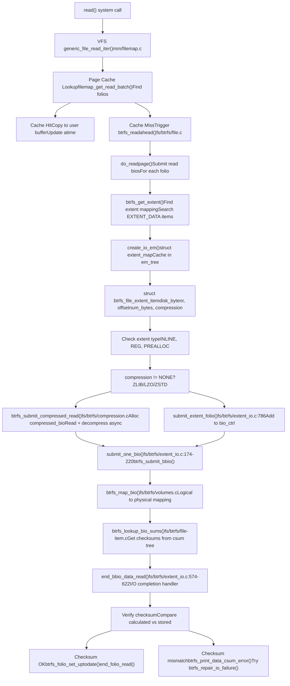
Sources: [fs/btrfs/extent\_io.c574-622](https://github.com/torvalds/linux/blob/fcb70a56/fs/btrfs/extent_io.c#L574-L622) [fs/btrfs/extent\_io.c786](https://github.com/torvalds/linux/blob/fcb70a56/fs/btrfs/extent_io.c#L786-L786) [fs/btrfs/extent\_io.c174-220](https://github.com/torvalds/linux/blob/fcb70a56/fs/btrfs/extent_io.c#L174-L220) [fs/btrfs/compression.c1-100](https://github.com/torvalds/linux/blob/fcb70a56/fs/btrfs/compression.c#L1-L100) [fs/btrfs/file-item.c](https://github.com/torvalds/linux/blob/fcb70a56/fs/btrfs/file-item.c) [fs/btrfs/volumes.c](https://github.com/torvalds/linux/blob/fcb70a56/fs/btrfs/volumes.c)

### Write Path

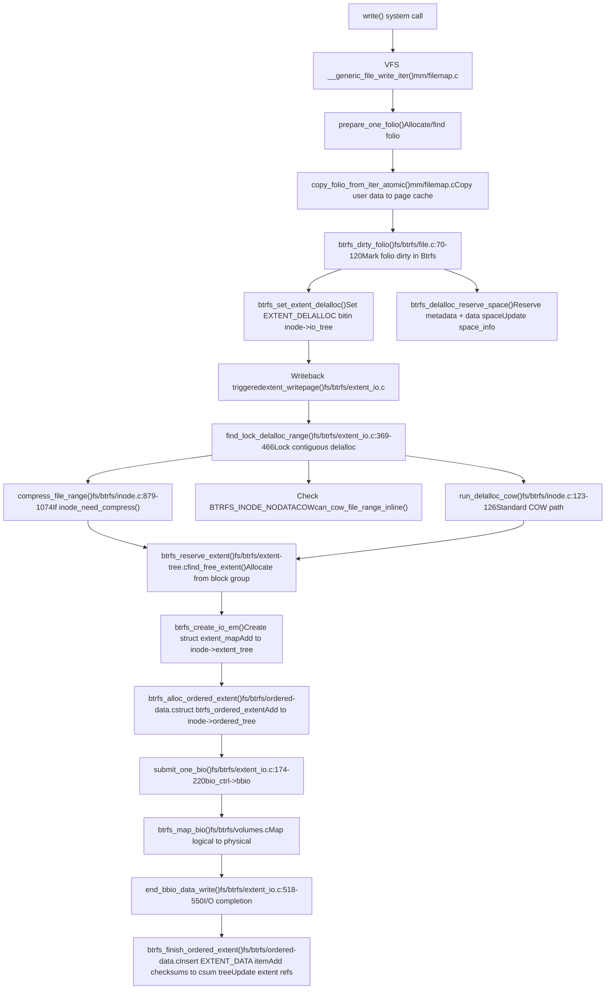
The write path uses **delayed allocation (delalloc)** to batch extent allocation and allow for better space packing. This is tracked via the `EXTENT_DELALLOC` bit in `inode->io_tree` [fs/btrfs/extent\_io.c](https://github.com/torvalds/linux/blob/fcb70a56/fs/btrfs/extent_io.c)

**Ordered extents** (`struct btrfs_ordered_extent`) ensure that data reaches disk before metadata updates, maintaining crash consistency. The ordered extent tracks:

-   File offset range
-   Disk bytenr and num\_bytes
-   Flags: `BTRFS_ORDERED_COMPRESSED`, `BTRFS_ORDERED_PREALLOC`, etc.
-   Completion state for synchronization

Sources: [fs/btrfs/file.c70-120](https://github.com/torvalds/linux/blob/fcb70a56/fs/btrfs/file.c#L70-L120) [fs/btrfs/inode.c123-126](https://github.com/torvalds/linux/blob/fcb70a56/fs/btrfs/inode.c#L123-L126) [fs/btrfs/inode.c879-1074](https://github.com/torvalds/linux/blob/fcb70a56/fs/btrfs/inode.c#L879-L1074) [fs/btrfs/extent\_io.c369-466](https://github.com/torvalds/linux/blob/fcb70a56/fs/btrfs/extent_io.c#L369-L466) [fs/btrfs/extent\_io.c174-220](https://github.com/torvalds/linux/blob/fcb70a56/fs/btrfs/extent_io.c#L174-L220) [fs/btrfs/extent\_io.c518-550](https://github.com/torvalds/linux/blob/fcb70a56/fs/btrfs/extent_io.c#L518-L550) [fs/btrfs/ordered-data.c](https://github.com/torvalds/linux/blob/fcb70a56/fs/btrfs/ordered-data.c)

## Transaction Management

All modifications in Btrfs occur within transactions. Transactions group related changes and provide atomicity.

### Transaction Lifecycle

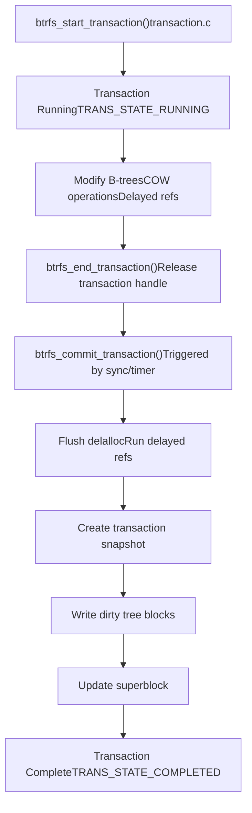
**Transaction Handle:**

```
struct btrfs_trans_handle
├── transid - Transaction ID
├── blocks_reserved - Reserved metadata space
├── block_rsv - Block reservation tracking
├── fs_info - Filesystem info
└── type - Transaction type flags
```
Transactions are committed:

-   Explicitly via `sync()` or `fsync()`
-   Periodically (default 30 seconds)
-   When metadata space is low
-   When too many delayed refs accumulate

Sources: [fs/btrfs/transaction.c1-100](https://github.com/torvalds/linux/blob/fcb70a56/fs/btrfs/transaction.c#L1-L100)

## Block Groups and Space Management

Btrfs divides device space into block groups, each with a specific type (DATA, METADATA, SYSTEM) and RAID profile.

### Block Group Structure

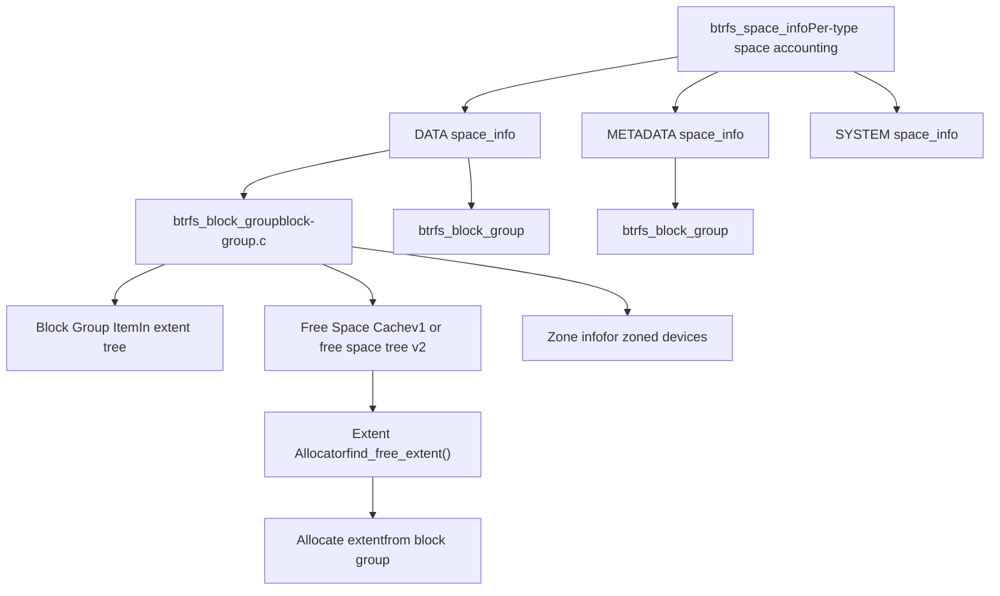
**Block Group Types:**

-   **DATA**: File data extents
-   **METADATA**: B-tree nodes, inode items, etc.
-   **SYSTEM**: Chunk tree and device tree (critical metadata)

Each block group can have a different RAID profile, e.g., RAID1 for metadata and RAID0 for data.

**Space Allocation:**

The allocator [fs/btrfs/extent-tree.c](https://github.com/torvalds/linux/blob/fcb70a56/fs/btrfs/extent-tree.c) selects block groups based on:

1.  Type (data vs metadata)
2.  Available free space
3.  RAID profile
4.  Locality (prefer block groups with recent allocations)

Sources: [fs/btrfs/block-group.c1-100](https://github.com/torvalds/linux/blob/fcb70a56/fs/btrfs/block-group.c#L1-L100) [fs/btrfs/extent-tree.c](https://github.com/torvalds/linux/blob/fcb70a56/fs/btrfs/extent-tree.c)

## Quota Groups (Qgroups)

Qgroups provide hierarchical quota management for subvolumes and snapshots.

### Qgroup Hierarchy

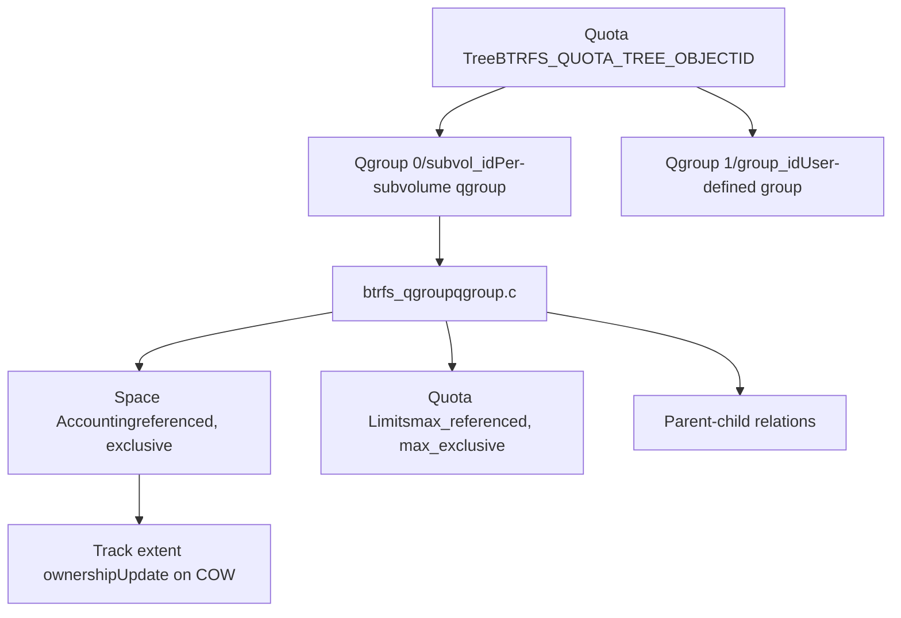
**Qgroup Accounting:**

-   **Referenced**: Total space referenced by this qgroup (may be shared)
-   **Exclusive**: Space exclusively owned by this qgroup
-   **Rfer\_cmpr**: Referenced compressed space
-   **Excl\_cmpr**: Exclusive compressed space

Qgroups are updated when:

-   Extents are allocated or freed
-   Snapshots are created (affects exclusivity)
-   Extent ownership changes via COW

Sources: [fs/btrfs/qgroup.c1-100](https://github.com/torvalds/linux/blob/fcb70a56/fs/btrfs/qgroup.c#L1-L100)

## Summary

Btrfs is a comprehensive copy-on-write filesystem with integrated volume management. Its key architectural components include:

1.  **B-tree storage engine** (`ctree.c`) managing multiple tree namespaces
2.  **Copy-on-write at all levels** enabling snapshots and crash recovery
3.  **Extent-based allocation** with delayed reference updates for efficiency
4.  **Integrated RAID** supporting multiple redundancy profiles
5.  **Compression and checksumming** for space efficiency and data integrity
6.  **Tree logging** for fast fsync operations
7.  **Multi-device support** with flexible chunk allocation
8.  **Zoned device support** for sequential-write storage
9.  **Hierarchical quota groups** for space accounting

The filesystem balances performance, features, and data integrity through careful design of its COW semantics, delayed operations, and transaction management.
