# Graphics and Display

Relevant source files

-   [MAINTAINERS](https://github.com/torvalds/linux/blob/fcb70a56/MAINTAINERS)
-   [drivers/gpu/drm/amd/amdgpu/amdgpu.h](https://github.com/torvalds/linux/blob/fcb70a56/drivers/gpu/drm/amd/amdgpu/amdgpu.h)
-   [drivers/gpu/drm/amd/amdgpu/amdgpu\_acpi.c](https://github.com/torvalds/linux/blob/fcb70a56/drivers/gpu/drm/amd/amdgpu/amdgpu_acpi.c)
-   [drivers/gpu/drm/amd/amdgpu/amdgpu\_amdkfd\_gpuvm.c](https://github.com/torvalds/linux/blob/fcb70a56/drivers/gpu/drm/amd/amdgpu/amdgpu_amdkfd_gpuvm.c)
-   [drivers/gpu/drm/amd/amdgpu/amdgpu\_bo\_list.h](https://github.com/torvalds/linux/blob/fcb70a56/drivers/gpu/drm/amd/amdgpu/amdgpu_bo_list.h)
-   [drivers/gpu/drm/amd/amdgpu/amdgpu\_connectors.c](https://github.com/torvalds/linux/blob/fcb70a56/drivers/gpu/drm/amd/amdgpu/amdgpu_connectors.c)
-   [drivers/gpu/drm/amd/amdgpu/amdgpu\_cs.c](https://github.com/torvalds/linux/blob/fcb70a56/drivers/gpu/drm/amd/amdgpu/amdgpu_cs.c)
-   [drivers/gpu/drm/amd/amdgpu/amdgpu\_dev\_coredump.c](https://github.com/torvalds/linux/blob/fcb70a56/drivers/gpu/drm/amd/amdgpu/amdgpu_dev_coredump.c)
-   [drivers/gpu/drm/amd/amdgpu/amdgpu\_device.c](https://github.com/torvalds/linux/blob/fcb70a56/drivers/gpu/drm/amd/amdgpu/amdgpu_device.c)
-   [drivers/gpu/drm/amd/amdgpu/amdgpu\_dma\_buf.c](https://github.com/torvalds/linux/blob/fcb70a56/drivers/gpu/drm/amd/amdgpu/amdgpu_dma_buf.c)
-   [drivers/gpu/drm/amd/amdgpu/amdgpu\_drv.c](https://github.com/torvalds/linux/blob/fcb70a56/drivers/gpu/drm/amd/amdgpu/amdgpu_drv.c)
-   [drivers/gpu/drm/amd/amdgpu/amdgpu\_fence.c](https://github.com/torvalds/linux/blob/fcb70a56/drivers/gpu/drm/amd/amdgpu/amdgpu_fence.c)
-   [drivers/gpu/drm/amd/amdgpu/amdgpu\_gem.c](https://github.com/torvalds/linux/blob/fcb70a56/drivers/gpu/drm/amd/amdgpu/amdgpu_gem.c)
-   [drivers/gpu/drm/amd/amdgpu/amdgpu\_gfx.c](https://github.com/torvalds/linux/blob/fcb70a56/drivers/gpu/drm/amd/amdgpu/amdgpu_gfx.c)
-   [drivers/gpu/drm/amd/amdgpu/amdgpu\_gfx.h](https://github.com/torvalds/linux/blob/fcb70a56/drivers/gpu/drm/amd/amdgpu/amdgpu_gfx.h)
-   [drivers/gpu/drm/amd/amdgpu/amdgpu\_hmm.c](https://github.com/torvalds/linux/blob/fcb70a56/drivers/gpu/drm/amd/amdgpu/amdgpu_hmm.c)
-   [drivers/gpu/drm/amd/amdgpu/amdgpu\_hmm.h](https://github.com/torvalds/linux/blob/fcb70a56/drivers/gpu/drm/amd/amdgpu/amdgpu_hmm.h)
-   [drivers/gpu/drm/amd/amdgpu/amdgpu\_ib.c](https://github.com/torvalds/linux/blob/fcb70a56/drivers/gpu/drm/amd/amdgpu/amdgpu_ib.c)
-   [drivers/gpu/drm/amd/amdgpu/amdgpu\_ids.c](https://github.com/torvalds/linux/blob/fcb70a56/drivers/gpu/drm/amd/amdgpu/amdgpu_ids.c)
-   [drivers/gpu/drm/amd/amdgpu/amdgpu\_ids.h](https://github.com/torvalds/linux/blob/fcb70a56/drivers/gpu/drm/amd/amdgpu/amdgpu_ids.h)
-   [drivers/gpu/drm/amd/amdgpu/amdgpu\_isp.c](https://github.com/torvalds/linux/blob/fcb70a56/drivers/gpu/drm/amd/amdgpu/amdgpu_isp.c)
-   [drivers/gpu/drm/amd/amdgpu/amdgpu\_isp.h](https://github.com/torvalds/linux/blob/fcb70a56/drivers/gpu/drm/amd/amdgpu/amdgpu_isp.h)
-   [drivers/gpu/drm/amd/amdgpu/amdgpu\_job.c](https://github.com/torvalds/linux/blob/fcb70a56/drivers/gpu/drm/amd/amdgpu/amdgpu_job.c)
-   [drivers/gpu/drm/amd/amdgpu/amdgpu\_kms.c](https://github.com/torvalds/linux/blob/fcb70a56/drivers/gpu/drm/amd/amdgpu/amdgpu_kms.c)
-   [drivers/gpu/drm/amd/amdgpu/amdgpu\_mes.c](https://github.com/torvalds/linux/blob/fcb70a56/drivers/gpu/drm/amd/amdgpu/amdgpu_mes.c)
-   [drivers/gpu/drm/amd/amdgpu/amdgpu\_mes.h](https://github.com/torvalds/linux/blob/fcb70a56/drivers/gpu/drm/amd/amdgpu/amdgpu_mes.h)
-   [drivers/gpu/drm/amd/amdgpu/amdgpu\_object.c](https://github.com/torvalds/linux/blob/fcb70a56/drivers/gpu/drm/amd/amdgpu/amdgpu_object.c)
-   [drivers/gpu/drm/amd/amdgpu/amdgpu\_rap.c](https://github.com/torvalds/linux/blob/fcb70a56/drivers/gpu/drm/amd/amdgpu/amdgpu_rap.c)
-   [drivers/gpu/drm/amd/amdgpu/amdgpu\_ring.c](https://github.com/torvalds/linux/blob/fcb70a56/drivers/gpu/drm/amd/amdgpu/amdgpu_ring.c)
-   [drivers/gpu/drm/amd/amdgpu/amdgpu\_ring.h](https://github.com/torvalds/linux/blob/fcb70a56/drivers/gpu/drm/amd/amdgpu/amdgpu_ring.h)
-   [drivers/gpu/drm/amd/amdgpu/amdgpu\_securedisplay.c](https://github.com/torvalds/linux/blob/fcb70a56/drivers/gpu/drm/amd/amdgpu/amdgpu_securedisplay.c)
-   [drivers/gpu/drm/amd/amdgpu/amdgpu\_sync.c](https://github.com/torvalds/linux/blob/fcb70a56/drivers/gpu/drm/amd/amdgpu/amdgpu_sync.c)
-   [drivers/gpu/drm/amd/amdgpu/amdgpu\_sync.h](https://github.com/torvalds/linux/blob/fcb70a56/drivers/gpu/drm/amd/amdgpu/amdgpu_sync.h)
-   [drivers/gpu/drm/amd/amdgpu/amdgpu\_ttm.h](https://github.com/torvalds/linux/blob/fcb70a56/drivers/gpu/drm/amd/amdgpu/amdgpu_ttm.h)
-   [drivers/gpu/drm/amd/amdgpu/amdgpu\_userq.c](https://github.com/torvalds/linux/blob/fcb70a56/drivers/gpu/drm/amd/amdgpu/amdgpu_userq.c)
-   [drivers/gpu/drm/amd/amdgpu/amdgpu\_userq.h](https://github.com/torvalds/linux/blob/fcb70a56/drivers/gpu/drm/amd/amdgpu/amdgpu_userq.h)
-   [drivers/gpu/drm/amd/amdgpu/amdgpu\_userq\_fence.c](https://github.com/torvalds/linux/blob/fcb70a56/drivers/gpu/drm/amd/amdgpu/amdgpu_userq_fence.c)
-   [drivers/gpu/drm/amd/amdgpu/amdgpu\_userq\_fence.h](https://github.com/torvalds/linux/blob/fcb70a56/drivers/gpu/drm/amd/amdgpu/amdgpu_userq_fence.h)
-   [drivers/gpu/drm/amd/amdgpu/amdgpu\_uvd.c](https://github.com/torvalds/linux/blob/fcb70a56/drivers/gpu/drm/amd/amdgpu/amdgpu_uvd.c)
-   [drivers/gpu/drm/amd/amdgpu/amdgpu\_vm.c](https://github.com/torvalds/linux/blob/fcb70a56/drivers/gpu/drm/amd/amdgpu/amdgpu_vm.c)
-   [drivers/gpu/drm/amd/amdgpu/amdgpu\_vm.h](https://github.com/torvalds/linux/blob/fcb70a56/drivers/gpu/drm/amd/amdgpu/amdgpu_vm.h)
-   [drivers/gpu/drm/amd/amdgpu/amdgpu\_vm\_pt.c](https://github.com/torvalds/linux/blob/fcb70a56/drivers/gpu/drm/amd/amdgpu/amdgpu_vm_pt.c)
-   [drivers/gpu/drm/amd/amdgpu/gmc\_v10\_0.c](https://github.com/torvalds/linux/blob/fcb70a56/drivers/gpu/drm/amd/amdgpu/gmc_v10_0.c)
-   [drivers/gpu/drm/amd/amdgpu/gmc\_v11\_0.c](https://github.com/torvalds/linux/blob/fcb70a56/drivers/gpu/drm/amd/amdgpu/gmc_v11_0.c)
-   [drivers/gpu/drm/amd/amdgpu/gmc\_v12\_0.c](https://github.com/torvalds/linux/blob/fcb70a56/drivers/gpu/drm/amd/amdgpu/gmc_v12_0.c)
-   [drivers/gpu/drm/amd/amdgpu/gmc\_v7\_0.c](https://github.com/torvalds/linux/blob/fcb70a56/drivers/gpu/drm/amd/amdgpu/gmc_v7_0.c)
-   [drivers/gpu/drm/amd/amdgpu/gmc\_v8\_0.c](https://github.com/torvalds/linux/blob/fcb70a56/drivers/gpu/drm/amd/amdgpu/gmc_v8_0.c)
-   [drivers/gpu/drm/amd/amdgpu/gmc\_v9\_0.c](https://github.com/torvalds/linux/blob/fcb70a56/drivers/gpu/drm/amd/amdgpu/gmc_v9_0.c)
-   [drivers/gpu/drm/amd/amdgpu/isp\_v4\_1\_1.c](https://github.com/torvalds/linux/blob/fcb70a56/drivers/gpu/drm/amd/amdgpu/isp_v4_1_1.c)
-   [drivers/gpu/drm/amd/amdgpu/mes\_userqueue.c](https://github.com/torvalds/linux/blob/fcb70a56/drivers/gpu/drm/amd/amdgpu/mes_userqueue.c)
-   [drivers/gpu/drm/amd/amdgpu/mes\_v11\_0.c](https://github.com/torvalds/linux/blob/fcb70a56/drivers/gpu/drm/amd/amdgpu/mes_v11_0.c)
-   [drivers/gpu/drm/amd/amdgpu/mes\_v12\_0.c](https://github.com/torvalds/linux/blob/fcb70a56/drivers/gpu/drm/amd/amdgpu/mes_v12_0.c)
-   [drivers/gpu/drm/amd/amdgpu/sdma\_v4\_0.c](https://github.com/torvalds/linux/blob/fcb70a56/drivers/gpu/drm/amd/amdgpu/sdma_v4_0.c)
-   [drivers/gpu/drm/amd/amdkfd/kfd\_events.c](https://github.com/torvalds/linux/blob/fcb70a56/drivers/gpu/drm/amd/amdkfd/kfd_events.c)
-   [drivers/gpu/drm/amd/amdkfd/kfd\_smi\_events.c](https://github.com/torvalds/linux/blob/fcb70a56/drivers/gpu/drm/amd/amdkfd/kfd_smi_events.c)
-   [drivers/gpu/drm/amd/amdkfd/kfd\_svm.c](https://github.com/torvalds/linux/blob/fcb70a56/drivers/gpu/drm/amd/amdkfd/kfd_svm.c)
-   [drivers/gpu/drm/amd/amdxcp/amdgpu\_xcp\_drv.c](https://github.com/torvalds/linux/blob/fcb70a56/drivers/gpu/drm/amd/amdxcp/amdgpu_xcp_drv.c)
-   [drivers/gpu/drm/amd/display/amdgpu\_dm/amdgpu\_dm.c](https://github.com/torvalds/linux/blob/fcb70a56/drivers/gpu/drm/amd/display/amdgpu_dm/amdgpu_dm.c)
-   [drivers/gpu/drm/amd/display/amdgpu\_dm/amdgpu\_dm.h](https://github.com/torvalds/linux/blob/fcb70a56/drivers/gpu/drm/amd/display/amdgpu_dm/amdgpu_dm.h)
-   [drivers/gpu/drm/amd/display/amdgpu\_dm/amdgpu\_dm\_crc.c](https://github.com/torvalds/linux/blob/fcb70a56/drivers/gpu/drm/amd/display/amdgpu_dm/amdgpu_dm_crc.c)
-   [drivers/gpu/drm/amd/display/amdgpu\_dm/amdgpu\_dm\_crc.h](https://github.com/torvalds/linux/blob/fcb70a56/drivers/gpu/drm/amd/display/amdgpu_dm/amdgpu_dm_crc.h)
-   [drivers/gpu/drm/amd/display/amdgpu\_dm/amdgpu\_dm\_crtc.c](https://github.com/torvalds/linux/blob/fcb70a56/drivers/gpu/drm/amd/display/amdgpu_dm/amdgpu_dm_crtc.c)
-   [drivers/gpu/drm/amd/display/amdgpu\_dm/amdgpu\_dm\_crtc.h](https://github.com/torvalds/linux/blob/fcb70a56/drivers/gpu/drm/amd/display/amdgpu_dm/amdgpu_dm_crtc.h)
-   [drivers/gpu/drm/amd/display/amdgpu\_dm/amdgpu\_dm\_debugfs.c](https://github.com/torvalds/linux/blob/fcb70a56/drivers/gpu/drm/amd/display/amdgpu_dm/amdgpu_dm_debugfs.c)
-   [drivers/gpu/drm/amd/display/amdgpu\_dm/amdgpu\_dm\_mst\_types.c](https://github.com/torvalds/linux/blob/fcb70a56/drivers/gpu/drm/amd/display/amdgpu_dm/amdgpu_dm_mst_types.c)
-   [drivers/gpu/drm/amd/display/amdgpu\_dm/amdgpu\_dm\_mst\_types.h](https://github.com/torvalds/linux/blob/fcb70a56/drivers/gpu/drm/amd/display/amdgpu_dm/amdgpu_dm_mst_types.h)
-   [drivers/gpu/drm/amd/display/amdgpu\_dm/amdgpu\_dm\_psr.c](https://github.com/torvalds/linux/blob/fcb70a56/drivers/gpu/drm/amd/display/amdgpu_dm/amdgpu_dm_psr.c)
-   [drivers/gpu/drm/amd/display/amdgpu\_dm/amdgpu\_dm\_psr.h](https://github.com/torvalds/linux/blob/fcb70a56/drivers/gpu/drm/amd/display/amdgpu_dm/amdgpu_dm_psr.h)
-   [drivers/gpu/drm/amd/include/mes\_v11\_api\_def.h](https://github.com/torvalds/linux/blob/fcb70a56/drivers/gpu/drm/amd/include/mes_v11_api_def.h)
-   [drivers/gpu/drm/amd/include/mes\_v12\_api\_def.h](https://github.com/torvalds/linux/blob/fcb70a56/drivers/gpu/drm/amd/include/mes_v12_api_def.h)
-   [drivers/gpu/drm/drm\_panic\_qr.rs](https://github.com/torvalds/linux/blob/fcb70a56/drivers/gpu/drm/drm_panic_qr.rs)
-   [drivers/gpu/drm/nova/Kconfig](https://github.com/torvalds/linux/blob/fcb70a56/drivers/gpu/drm/nova/Kconfig)
-   [drivers/gpu/drm/nova/Makefile](https://github.com/torvalds/linux/blob/fcb70a56/drivers/gpu/drm/nova/Makefile)
-   [drivers/gpu/drm/nova/driver.rs](https://github.com/torvalds/linux/blob/fcb70a56/drivers/gpu/drm/nova/driver.rs)
-   [drivers/gpu/drm/nova/file.rs](https://github.com/torvalds/linux/blob/fcb70a56/drivers/gpu/drm/nova/file.rs)
-   [drivers/gpu/drm/nova/gem.rs](https://github.com/torvalds/linux/blob/fcb70a56/drivers/gpu/drm/nova/gem.rs)
-   [drivers/gpu/drm/nova/nova.rs](https://github.com/torvalds/linux/blob/fcb70a56/drivers/gpu/drm/nova/nova.rs)
-   [include/drm/amd/isp.h](https://github.com/torvalds/linux/blob/fcb70a56/include/drm/amd/isp.h)
-   [include/linux/rwlock\_rt.h](https://github.com/torvalds/linux/blob/fcb70a56/include/linux/rwlock_rt.h)
-   [include/linux/spinlock\_rt.h](https://github.com/torvalds/linux/blob/fcb70a56/include/linux/spinlock_rt.h)
-   [include/uapi/drm/amdgpu\_drm.h](https://github.com/torvalds/linux/blob/fcb70a56/include/uapi/drm/amdgpu_drm.h)
-   [include/uapi/drm/nova\_drm.h](https://github.com/torvalds/linux/blob/fcb70a56/include/uapi/drm/nova_drm.h)
-   [rust/bindings/bindings\_helper.h](https://github.com/torvalds/linux/blob/fcb70a56/rust/bindings/bindings_helper.h)
-   [rust/helpers/barrier.c](https://github.com/torvalds/linux/blob/fcb70a56/rust/helpers/barrier.c)
-   [rust/helpers/bitmap.c](https://github.com/torvalds/linux/blob/fcb70a56/rust/helpers/bitmap.c)
-   [rust/helpers/bitops.c](https://github.com/torvalds/linux/blob/fcb70a56/rust/helpers/bitops.c)
-   [rust/helpers/drm.c](https://github.com/torvalds/linux/blob/fcb70a56/rust/helpers/drm.c)
-   [rust/helpers/helpers.c](https://github.com/torvalds/linux/blob/fcb70a56/rust/helpers/helpers.c)
-   [rust/helpers/mutex.c](https://github.com/torvalds/linux/blob/fcb70a56/rust/helpers/mutex.c)
-   [rust/helpers/pid\_namespace.c](https://github.com/torvalds/linux/blob/fcb70a56/rust/helpers/pid_namespace.c)
-   [rust/helpers/poll.c](https://github.com/torvalds/linux/blob/fcb70a56/rust/helpers/poll.c)
-   [rust/helpers/security.c](https://github.com/torvalds/linux/blob/fcb70a56/rust/helpers/security.c)
-   [rust/helpers/spinlock.c](https://github.com/torvalds/linux/blob/fcb70a56/rust/helpers/spinlock.c)
-   [rust/helpers/sync.c](https://github.com/torvalds/linux/blob/fcb70a56/rust/helpers/sync.c)
-   [rust/helpers/task.c](https://github.com/torvalds/linux/blob/fcb70a56/rust/helpers/task.c)
-   [rust/kernel/block/mq/tag\_set.rs](https://github.com/torvalds/linux/blob/fcb70a56/rust/kernel/block/mq/tag_set.rs)
-   [rust/kernel/cred.rs](https://github.com/torvalds/linux/blob/fcb70a56/rust/kernel/cred.rs)
-   [rust/kernel/drm/device.rs](https://github.com/torvalds/linux/blob/fcb70a56/rust/kernel/drm/device.rs)
-   [rust/kernel/drm/driver.rs](https://github.com/torvalds/linux/blob/fcb70a56/rust/kernel/drm/driver.rs)
-   [rust/kernel/drm/file.rs](https://github.com/torvalds/linux/blob/fcb70a56/rust/kernel/drm/file.rs)
-   [rust/kernel/drm/gem/mod.rs](https://github.com/torvalds/linux/blob/fcb70a56/rust/kernel/drm/gem/mod.rs)
-   [rust/kernel/drm/mod.rs](https://github.com/torvalds/linux/blob/fcb70a56/rust/kernel/drm/mod.rs)
-   [rust/kernel/lib.rs](https://github.com/torvalds/linux/blob/fcb70a56/rust/kernel/lib.rs)
-   [rust/kernel/pid\_namespace.rs](https://github.com/torvalds/linux/blob/fcb70a56/rust/kernel/pid_namespace.rs)
-   [rust/kernel/security.rs](https://github.com/torvalds/linux/blob/fcb70a56/rust/kernel/security.rs)
-   [rust/kernel/sync.rs](https://github.com/torvalds/linux/blob/fcb70a56/rust/kernel/sync.rs)
-   [rust/kernel/sync/barrier.rs](https://github.com/torvalds/linux/blob/fcb70a56/rust/kernel/sync/barrier.rs)
-   [rust/kernel/sync/condvar.rs](https://github.com/torvalds/linux/blob/fcb70a56/rust/kernel/sync/condvar.rs)
-   [rust/kernel/sync/lock.rs](https://github.com/torvalds/linux/blob/fcb70a56/rust/kernel/sync/lock.rs)
-   [rust/kernel/sync/lock/global.rs](https://github.com/torvalds/linux/blob/fcb70a56/rust/kernel/sync/lock/global.rs)
-   [rust/kernel/sync/lock/mutex.rs](https://github.com/torvalds/linux/blob/fcb70a56/rust/kernel/sync/lock/mutex.rs)
-   [rust/kernel/sync/lock/spinlock.rs](https://github.com/torvalds/linux/blob/fcb70a56/rust/kernel/sync/lock/spinlock.rs)
-   [rust/kernel/sync/poll.rs](https://github.com/torvalds/linux/blob/fcb70a56/rust/kernel/sync/poll.rs)
-   [rust/kernel/sync/set\_once.rs](https://github.com/torvalds/linux/blob/fcb70a56/rust/kernel/sync/set_once.rs)
-   [rust/kernel/task.rs](https://github.com/torvalds/linux/blob/fcb70a56/rust/kernel/task.rs)

## Purpose and Scope

This page documents the Graphics and Display subsystem in the Linux kernel, focusing on the DRM (Direct Rendering Manager) framework and GPU drivers. This covers the infrastructure for managing graphics hardware, display outputs, and rendering operations. The primary focus is on the AMDGPU driver as a comprehensive example of DRM driver implementation.

For information about the Rust-based Nova driver implementation, see [Nova DRM Graphics Driver](/torvalds/linux/2.2-nova-drm-graphics-driver). For general kernel driver infrastructure, see [Core Kernel Infrastructure](/torvalds/linux/4-core-kernel-infrastructure).

## DRM Subsystem Architecture

The DRM subsystem provides a unified framework for GPU and display management in Linux. It consists of the DRM Core, which provides common abstractions, and hardware-specific drivers that implement device operations.

### High-Level Architecture

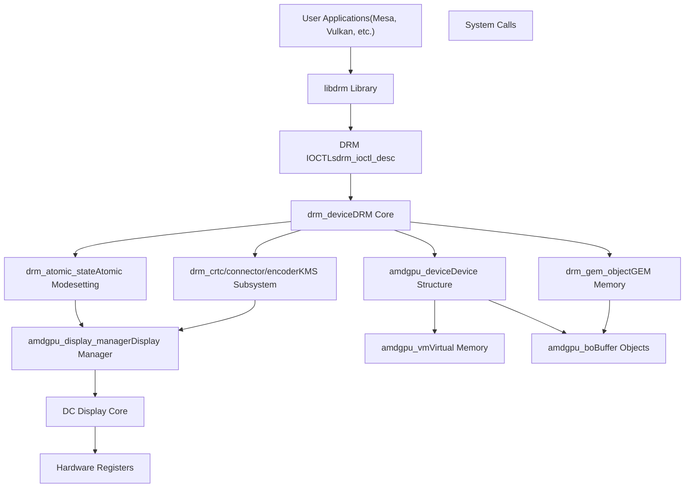
**Sources:** [drivers/gpu/drm/amd/amdgpu/amdgpu\_drv.c1-303](https://github.com/torvalds/linux/blob/fcb70a56/drivers/gpu/drm/amd/amdgpu/amdgpu_drv.c#L1-L303) [drivers/gpu/drm/amd/display/amdgpu\_dm/amdgpu\_dm.c1-170](https://github.com/torvalds/linux/blob/fcb70a56/drivers/gpu/drm/amd/display/amdgpu_dm/amdgpu_dm.c#L1-L170)

### DRM Core Components

The DRM core provides fundamental abstractions used by all DRM drivers:

| Component | Structure | Purpose |
| --- | --- | --- |
| Device | `drm_device` | Root device structure representing GPU hardware |
| GEM | `drm_gem_object` | Graphics Execution Manager for memory objects |
| KMS | `drm_crtc`, `drm_connector`, `drm_encoder` | Kernel Mode Setting display management |
| Atomic | `drm_atomic_state` | Atomic modesetting for flicker-free updates |
| File | `drm_file` | Per-process file handle tracking |

**Sources:** [drivers/gpu/drm/amd/amdgpu/amdgpu\_drv.c1-303](https://github.com/torvalds/linux/blob/fcb70a56/drivers/gpu/drm/amd/amdgpu/amdgpu_drv.c#L1-L303) [rust/bindings/bindings\_helper.h32-36](https://github.com/torvalds/linux/blob/fcb70a56/rust/bindings/bindings_helper.h#L32-L36)

## AMDGPU Driver Structure

The AMDGPU driver is a comprehensive DRM driver supporting modern AMD GPUs. It implements display management, GPU virtual memory, compute functionality, and power management.

### Driver Initialization Flow

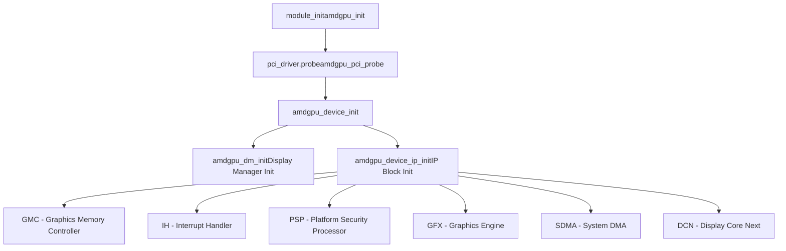
**Sources:** [drivers/gpu/drm/amd/amdgpu/amdgpu\_drv.c1-303](https://github.com/torvalds/linux/blob/fcb70a56/drivers/gpu/drm/amd/amdgpu/amdgpu_drv.c#L1-L303) [drivers/gpu/drm/amd/amdgpu/amdgpu\_device.c183-211](https://github.com/torvalds/linux/blob/fcb70a56/drivers/gpu/drm/amd/amdgpu/amdgpu_device.c#L183-L211)

### AMDGPU Device Structure

The `amdgpu_device` structure [drivers/gpu/drm/amd/amdgpu/amdgpu.h1-100](https://github.com/torvalds/linux/blob/fcb70a56/drivers/gpu/drm/amd/amdgpu/amdgpu.h#L1-L100) is the central data structure managing the GPU:

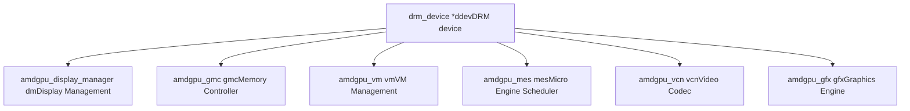
**Sources:** [drivers/gpu/drm/amd/amdgpu/amdgpu.h1-100](https://github.com/torvalds/linux/blob/fcb70a56/drivers/gpu/drm/amd/amdgpu/amdgpu.h#L1-L100)

## Display Manager (amdgpu\_dm)

The AMD Display Manager (`amdgpu_dm`) sits between the DRM layer and AMD's proprietary Display Core (DC) library. It translates DRM requests into DC operations and vice versa.

### Display Manager Architecture

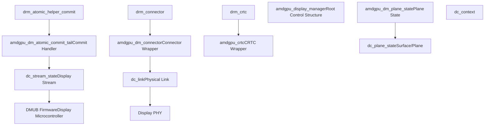
**Sources:** [drivers/gpu/drm/amd/display/amdgpu\_dm/amdgpu\_dm.c162-170](https://github.com/torvalds/linux/blob/fcb70a56/drivers/gpu/drm/amd/display/amdgpu_dm/amdgpu_dm.c#L162-L170) [drivers/gpu/drm/amd/display/amdgpu\_dm/amdgpu\_dm.h1-100](https://github.com/torvalds/linux/blob/fcb70a56/drivers/gpu/drm/amd/display/amdgpu_dm/amdgpu_dm.h#L1-L100)

### Display Manager Initialization

The display manager initialization [drivers/gpu/drm/amd/display/amdgpu\_dm/amdgpu\_dm.c172-224](https://github.com/torvalds/linux/blob/fcb70a56/drivers/gpu/drm/amd/display/amdgpu_dm/amdgpu_dm.c#L172-L224) establishes the connection between DRM and DC:

1.  **DC Context Creation** - Creates `dc_context` and initializes DC library
2.  **DRM Device Setup** - Initializes `drm_device` structures (CRTCs, connectors, encoders)
3.  **Interrupt Setup** - Configures display interrupt handling via `amdgpu_dm_irq_init`
4.  **Atomic Helpers** - Registers atomic modesetting callbacks
5.  **Backlight Registration** - Sets up backlight control interfaces

**Sources:** [drivers/gpu/drm/amd/display/amdgpu\_dm/amdgpu\_dm.c172-224](https://github.com/torvalds/linux/blob/fcb70a56/drivers/gpu/drm/amd/display/amdgpu_dm/amdgpu_dm.c#L172-L224)

### Atomic Modesetting Flow

> **[Mermaid sequence]**
> *(图表结构无法解析)*

**Sources:** [drivers/gpu/drm/amd/display/amdgpu\_dm/amdgpu\_dm.c236-241](https://github.com/torvalds/linux/blob/fcb70a56/drivers/gpu/drm/amd/display/amdgpu_dm/amdgpu_dm.c#L236-L241)

### Key Display Manager Functions

| Function | Location | Purpose |
| --- | --- | --- |
| `amdgpu_dm_init` | [drivers/gpu/drm/amd/display/amdgpu\_dm/amdgpu\_dm.c172](https://github.com/torvalds/linux/blob/fcb70a56/drivers/gpu/drm/amd/display/amdgpu_dm/amdgpu_dm.c#L172-L172) | Initialize display manager |
| `amdgpu_dm_fini` | [drivers/gpu/drm/amd/display/amdgpu\_dm/amdgpu\_dm.c173](https://github.com/torvalds/linux/blob/fcb70a56/drivers/gpu/drm/amd/display/amdgpu_dm/amdgpu_dm.c#L173-L173) | Cleanup display manager |
| `amdgpu_dm_atomic_check` | [drivers/gpu/drm/amd/display/amdgpu\_dm/amdgpu\_dm.c239-240](https://github.com/torvalds/linux/blob/fcb70a56/drivers/gpu/drm/amd/display/amdgpu_dm/amdgpu_dm.c#L239-L240) | Validate atomic state |
| `amdgpu_dm_atomic_commit_tail` | [drivers/gpu/drm/amd/display/amdgpu\_dm/amdgpu\_dm.c237](https://github.com/torvalds/linux/blob/fcb70a56/drivers/gpu/drm/amd/display/amdgpu_dm/amdgpu_dm.c#L237-L237) | Apply atomic state changes |
| `dm_vblank_get_counter` | [drivers/gpu/drm/amd/display/amdgpu\_dm/amdgpu\_dm.c265-281](https://github.com/torvalds/linux/blob/fcb70a56/drivers/gpu/drm/amd/display/amdgpu_dm/amdgpu_dm.c#L265-L281) | Read vblank counter |
| `dm_crtc_high_irq` | [drivers/gpu/drm/amd/display/amdgpu\_dm/amdgpu\_dm.c649-756](https://github.com/torvalds/linux/blob/fcb70a56/drivers/gpu/drm/amd/display/amdgpu_dm/amdgpu_dm.c#L649-L756) | Handle CRTC/vblank interrupt |
| `dm_pflip_high_irq` | [drivers/gpu/drm/amd/display/amdgpu\_dm/amdgpu\_dm.c437-532](https://github.com/torvalds/linux/blob/fcb70a56/drivers/gpu/drm/amd/display/amdgpu_dm/amdgpu_dm.c#L437-L532) | Handle page flip interrupt |

**Sources:** [drivers/gpu/drm/amd/display/amdgpu\_dm/amdgpu\_dm.c172-532](https://github.com/torvalds/linux/blob/fcb70a56/drivers/gpu/drm/amd/display/amdgpu_dm/amdgpu_dm.c#L172-L532)

## Display Connections and Outputs

### Connector Types and Management

The display manager creates and manages different connector types representing physical display outputs:

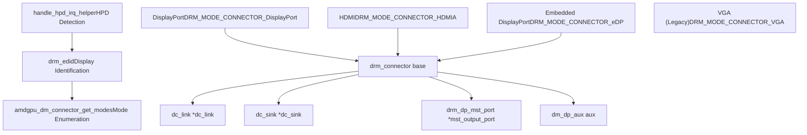
**Sources:** [drivers/gpu/drm/amd/display/amdgpu\_dm/amdgpu\_dm.c179-213](https://github.com/torvalds/linux/blob/fcb70a56/drivers/gpu/drm/amd/display/amdgpu_dm/amdgpu_dm.c#L179-L213) [drivers/gpu/drm/amd/display/amdgpu\_dm/amdgpu\_dm.c226-234](https://github.com/torvalds/linux/blob/fcb70a56/drivers/gpu/drm/amd/display/amdgpu_dm/amdgpu_dm.c#L226-L234)

### Multi-Stream Transport (MST)

DisplayPort MST allows multiple displays to share a single DisplayPort connection:

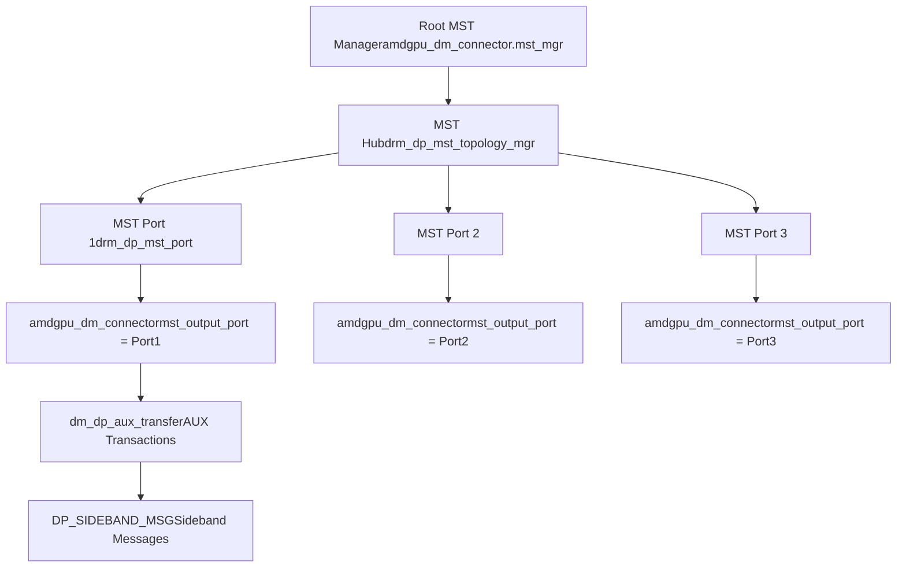
**Sources:** [drivers/gpu/drm/amd/display/amdgpu\_dm/amdgpu\_dm\_mst\_types.c58-145](https://github.com/torvalds/linux/blob/fcb70a56/drivers/gpu/drm/amd/display/amdgpu_dm/amdgpu_dm_mst_types.c#L58-L145) [drivers/gpu/drm/amd/display/amdgpu\_dm/amdgpu\_dm\_mst\_types.c230-232](https://github.com/torvalds/linux/blob/fcb70a56/drivers/gpu/drm/amd/display/amdgpu_dm/amdgpu_dm_mst_types.c#L230-L232)

### MST Key Functions

| Function | Location | Purpose |
| --- | --- | --- |
| `dm_dp_aux_transfer` | [drivers/gpu/drm/amd/display/amdgpu\_dm/amdgpu\_dm\_mst\_types.c58-145](https://github.com/torvalds/linux/blob/fcb70a56/drivers/gpu/drm/amd/display/amdgpu_dm/amdgpu_dm_mst_types.c#L58-L145) | Handle DP AUX transactions |
| `dm_dp_mst_connector_destroy` | [drivers/gpu/drm/amd/display/amdgpu\_dm/amdgpu\_dm\_mst\_types.c148-164](https://github.com/torvalds/linux/blob/fcb70a56/drivers/gpu/drm/amd/display/amdgpu_dm/amdgpu_dm_mst_types.c#L148-L164) | Cleanup MST connector |
| `amdgpu_dm_mst_connector_early_unregister` | [drivers/gpu/drm/amd/display/amdgpu\_dm/amdgpu\_dm\_mst\_types.c197-228](https://github.com/torvalds/linux/blob/fcb70a56/drivers/gpu/drm/amd/display/amdgpu_dm/amdgpu_dm_mst_types.c#L197-L228) | Unregister MST connector |

**Sources:** [drivers/gpu/drm/amd/display/amdgpu\_dm/amdgpu\_dm\_mst\_types.c58-228](https://github.com/torvalds/linux/blob/fcb70a56/drivers/gpu/drm/amd/display/amdgpu_dm/amdgpu_dm_mst_types.c#L58-L228)

## GPU Virtual Memory (GPUVM)

GPUVM provides per-process virtual address spaces for GPU memory access, similar to CPU virtual memory.

### GPUVM Architecture

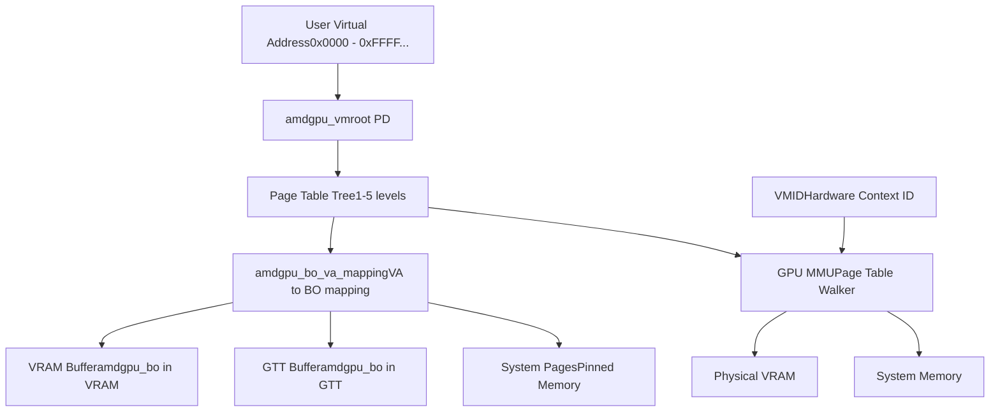
**Sources:** [drivers/gpu/drm/amd/amdgpu/amdgpu\_vm.c48-88](https://github.com/torvalds/linux/blob/fcb70a56/drivers/gpu/drm/amd/amdgpu/amdgpu_vm.c#L48-L88)

### GPUVM Documentation

The GPUVM subsystem [drivers/gpu/drm/amd/amdgpu/amdgpu\_vm.c48-88](https://github.com/torvalds/linux/blob/fcb70a56/drivers/gpu/drm/amd/amdgpu/amdgpu_vm.c#L48-L88) provides detailed documentation:

-   **Per-Process Address Spaces**: Each GPU client gets its own GPUVM address space
-   **Multi-Level Page Tables**: Supports 1-2 or 1-5 level page tables depending on ASIC
-   **RWX Attributes**: Page-level read/write/execute permissions
-   **VMID Management**: Up to 16 active GPUVMs with hardware VMID allocation
-   **Page Fault Handling**: GPU page faults similar to CPU page faults
-   **Special VMID 0**: Kernel driver uses VMID 0 with direct VRAM and AGP apertures

**Sources:** [drivers/gpu/drm/amd/amdgpu/amdgpu\_vm.c48-88](https://github.com/torvalds/linux/blob/fcb70a56/drivers/gpu/drm/amd/amdgpu/amdgpu_vm.c#L48-L88)

### GPUVM Key Functions

| Function | Location | Purpose |
| --- | --- | --- |
| `amdgpu_vm_lock_pd` | [drivers/gpu/drm/amd/amdgpu/amdgpu\_vm.c459-465](https://github.com/torvalds/linux/blob/fcb70a56/drivers/gpu/drm/amd/amdgpu/amdgpu_vm.c#L459-L465) | Lock VM root page directory |
| `amdgpu_vm_bo_base_init` | [drivers/gpu/drm/amd/amdgpu/amdgpu\_vm.c409-448](https://github.com/torvalds/linux/blob/fcb70a56/drivers/gpu/drm/amd/amdgpu/amdgpu_vm.c#L409-L448) | Initialize BO-VM association |
| `amdgpu_vm_update_stats` | [drivers/gpu/drm/amd/amdgpu/amdgpu\_vm.c389-397](https://github.com/torvalds/linux/blob/fcb70a56/drivers/gpu/drm/amd/amdgpu/amdgpu_vm.c#L389-L397) | Update VM memory statistics |
| `amdgpu_vm_bo_update_shared` | [drivers/gpu/drm/amd/amdgpu/amdgpu\_vm.c332-338](https://github.com/torvalds/linux/blob/fcb70a56/drivers/gpu/drm/amd/amdgpu/amdgpu_vm.c#L332-L338) | Update shared memory stats |

**Sources:** [drivers/gpu/drm/amd/amdgpu/amdgpu\_vm.c332-465](https://github.com/torvalds/linux/blob/fcb70a56/drivers/gpu/drm/amd/amdgpu/amdgpu_vm.c#L332-L465)

### VM State Machine

GPUVM buffer objects go through state transitions during their lifetime:

> **[Mermaid stateDiagram]**
> *(图表结构无法解析)*

**Sources:** [drivers/gpu/drm/amd/amdgpu/amdgpu\_vm.c149-291](https://github.com/torvalds/linux/blob/fcb70a56/drivers/gpu/drm/amd/amdgpu/amdgpu_vm.c#L149-L291)

## GEM Buffer Objects

GEM (Graphics Execution Manager) provides the memory management framework for GPU-accessible buffers.

### AMDGPU Buffer Object Structure

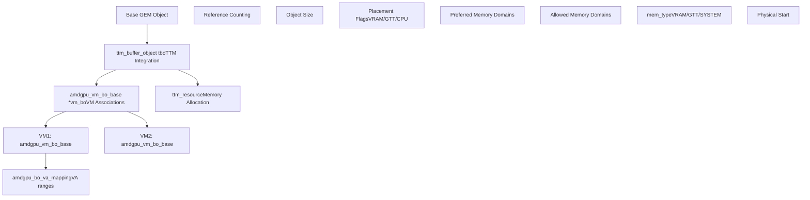
**Sources:** [drivers/gpu/drm/amd/amdgpu/amdgpu\_vm.c409-448](https://github.com/torvalds/linux/blob/fcb70a56/drivers/gpu/drm/amd/amdgpu/amdgpu_vm.c#L409-L448) [drivers/gpu/drm/amd/amdgpu/amdgpu\_dma\_buf.c27-33](https://github.com/torvalds/linux/blob/fcb70a56/drivers/gpu/drm/amd/amdgpu/amdgpu_dma_buf.c#L27-L33)

### DMA-BUF Sharing

AMDGPU implements DMA-BUF for sharing buffers between devices and processes:

> **[Mermaid sequence]**
> *(图表结构无法解析)*

**Sources:** [drivers/gpu/drm/amd/amdgpu/amdgpu\_dma\_buf.c27-33](https://github.com/torvalds/linux/blob/fcb70a56/drivers/gpu/drm/amd/amdgpu/amdgpu_dma_buf.c#L27-L33)

## Display Interrupt Handling

Display interrupts are critical for vsync, page flips, and hotplug detection.

### Interrupt Flow

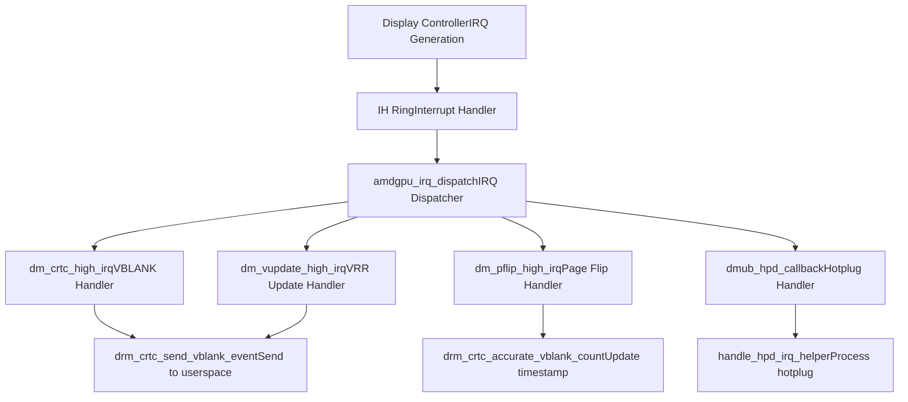
**Sources:** [drivers/gpu/drm/amd/display/amdgpu\_dm/amdgpu\_dm.c437-756](https://github.com/torvalds/linux/blob/fcb70a56/drivers/gpu/drm/amd/display/amdgpu_dm/amdgpu_dm.c#L437-L756) [drivers/gpu/drm/amd/display/amdgpu\_dm/amdgpu\_dm.c830-853](https://github.com/torvalds/linux/blob/fcb70a56/drivers/gpu/drm/amd/display/amdgpu_dm/amdgpu_dm.c#L830-L853)

### VBLANK and Page Flip Handling

The vblank interrupt handler [drivers/gpu/drm/amd/display/amdgpu\_dm/amdgpu\_dm.c649-756](https://github.com/torvalds/linux/blob/fcb70a56/drivers/gpu/drm/amd/display/amdgpu_dm/amdgpu_dm.c#L649-L756) manages vertical blanking periods:

1.  **Handle VRR Mode**: In Variable Refresh Rate mode, defer vblank handling to `dm_vupdate_high_irq`
2.  **Process Writeback**: Check for writeback completion and signal completion events
3.  **Send Events**: Deliver page flip completion events to userspace
4.  **BTR Updates**: Handle Below-The-Range framerate updates for newer ASICs
5.  **Handle No-Plane Case**: Special handling for page flips when no planes are active

**Sources:** [drivers/gpu/drm/amd/display/amdgpu\_dm/amdgpu\_dm.c649-756](https://github.com/torvalds/linux/blob/fcb70a56/drivers/gpu/drm/amd/display/amdgpu_dm/amdgpu_dm.c#L649-L756)

### Hotplug Detection (HPD)

> **[Mermaid sequence]**
> *(图表结构无法解析)*

**Sources:** [drivers/gpu/drm/amd/display/amdgpu\_dm/amdgpu\_dm.c830-853](https://github.com/torvalds/linux/blob/fcb70a56/drivers/gpu/drm/amd/display/amdgpu_dm/amdgpu_dm.c#L830-L853) [drivers/gpu/drm/amd/display/amdgpu\_dm/amdgpu\_dm.c242-243](https://github.com/torvalds/linux/blob/fcb70a56/drivers/gpu/drm/amd/display/amdgpu_dm/amdgpu_dm.c#L242-L243)

## CRTC Management

CRTCs (Cathode Ray Tube Controllers) represent display pipelines that scan out framebuffers to displays.

### CRTC Structure and Operations

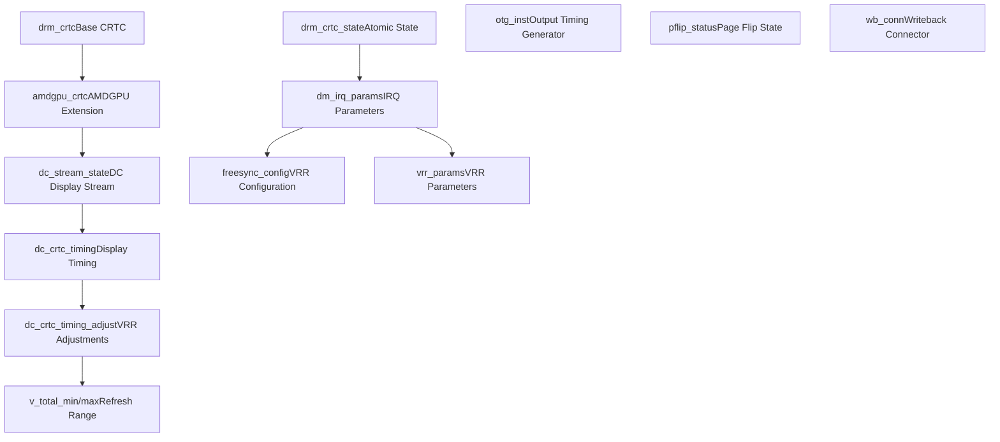
**Sources:** [drivers/gpu/drm/amd/display/amdgpu\_dm/amdgpu\_dm\_crtc.c41-100](https://github.com/torvalds/linux/blob/fcb70a56/drivers/gpu/drm/amd/display/amdgpu_dm/amdgpu_dm_crtc.c#L41-L100) [drivers/gpu/drm/amd/display/amdgpu\_dm/amdgpu\_dm.h131-180](https://github.com/torvalds/linux/blob/fcb70a56/drivers/gpu/drm/amd/display/amdgpu_dm/amdgpu_dm.h#L131-L180)

### CRTC Key Functions

| Function | Location | Purpose |
| --- | --- | --- |
| `amdgpu_dm_crtc_handle_vblank` | [drivers/gpu/drm/amd/display/amdgpu\_dm/amdgpu\_dm\_crtc.c41-59](https://github.com/torvalds/linux/blob/fcb70a56/drivers/gpu/drm/amd/display/amdgpu_dm/amdgpu_dm_crtc.c#L41-L59) | Handle vblank events |
| `amdgpu_dm_crtc_modeset_required` | [drivers/gpu/drm/amd/display/amdgpu\_dm/amdgpu\_dm\_crtc.c61-66](https://github.com/torvalds/linux/blob/fcb70a56/drivers/gpu/drm/amd/display/amdgpu_dm/amdgpu_dm_crtc.c#L61-L66) | Check if modeset needed |
| `amdgpu_dm_crtc_vrr_active` | [drivers/gpu/drm/amd/display/amdgpu\_dm/amdgpu\_dm\_crtc.c96-100](https://github.com/torvalds/linux/blob/fcb70a56/drivers/gpu/drm/amd/display/amdgpu_dm/amdgpu_dm_crtc.c#L96-L100) | Check VRR active state |
| `amdgpu_dm_crtc_set_vupdate_irq` | [drivers/gpu/drm/amd/display/amdgpu\_dm/amdgpu\_dm\_crtc.c77-94](https://github.com/torvalds/linux/blob/fcb70a56/drivers/gpu/drm/amd/display/amdgpu_dm/amdgpu_dm_crtc.c#L77-L94) | Enable/disable VRR update IRQ |

**Sources:** [drivers/gpu/drm/amd/display/amdgpu\_dm/amdgpu\_dm\_crtc.c41-100](https://github.com/torvalds/linux/blob/fcb70a56/drivers/gpu/drm/amd/display/amdgpu_dm/amdgpu_dm_crtc.c#L41-L100)

## Rust DRM Abstractions

The kernel provides Rust abstractions for DRM to enable safe GPU driver development.

### Rust DRM Module Structure

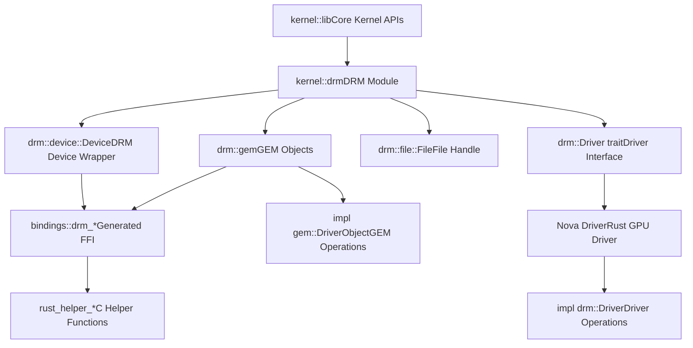
**Sources:** [rust/kernel/lib.rs92-93](https://github.com/torvalds/linux/blob/fcb70a56/rust/kernel/lib.rs#L92-L93) [rust/kernel/drm/device.rs1-10](https://github.com/torvalds/linux/blob/fcb70a56/rust/kernel/drm/device.rs#L1-L10) [rust/kernel/drm/gem/mod.rs1-30](https://github.com/torvalds/linux/blob/fcb70a56/rust/kernel/drm/gem/mod.rs#L1-L30)

### DRM Device Wrapper

The Rust DRM device wrapper [rust/kernel/drm/device.rs1-10](https://github.com/torvalds/linux/blob/fcb70a56/rust/kernel/drm/device.rs#L1-L10) provides safe access to DRM functionality:

-   **Type Safety**: Wraps raw C `drm_device` pointers in safe Rust types
-   **Lifetime Management**: Uses Rust's `ARef` for reference-counted device access
-   **Error Handling**: Converts C error codes to Rust `Result` types
-   **Trait-Based Design**: Drivers implement the `drm::Driver` trait

**Sources:** [rust/kernel/drm/device.rs1-10](https://github.com/torvalds/linux/blob/fcb70a56/rust/kernel/drm/device.rs#L1-L10)

### GEM Object Abstractions

The Rust GEM module [rust/kernel/drm/gem/mod.rs1-30](https://github.com/torvalds/linux/blob/fcb70a56/rust/kernel/drm/gem/mod.rs#L1-L30) provides abstractions for GPU memory:

```
// Conceptual example structure (not actual code)
// pub trait DriverObject {
//     type Driver: drm::Driver;
//     fn new(dev: &Device, size: usize) -> Result<Self>;
// }
```
Key abstractions include:

-   `DriverObject` trait for implementing driver-specific GEM objects
-   Safe wrappers around `drm_gem_object` lifetime management
-   Integration with Rust's `ARef` for reference counting
-   Type-safe memory allocation flags

**Sources:** [rust/kernel/drm/gem/mod.rs1-30](https://github.com/torvalds/linux/blob/fcb70a56/rust/kernel/drm/gem/mod.rs#L1-L30) [rust/bindings/bindings\_helper.h32-36](https://github.com/torvalds/linux/blob/fcb70a56/rust/bindings/bindings_helper.h#L32-L36)

## User Queue Management

User queues provide direct GPU command submission from userspace, bypassing kernel scheduling overhead for low-latency applications.

### User Queue Architecture

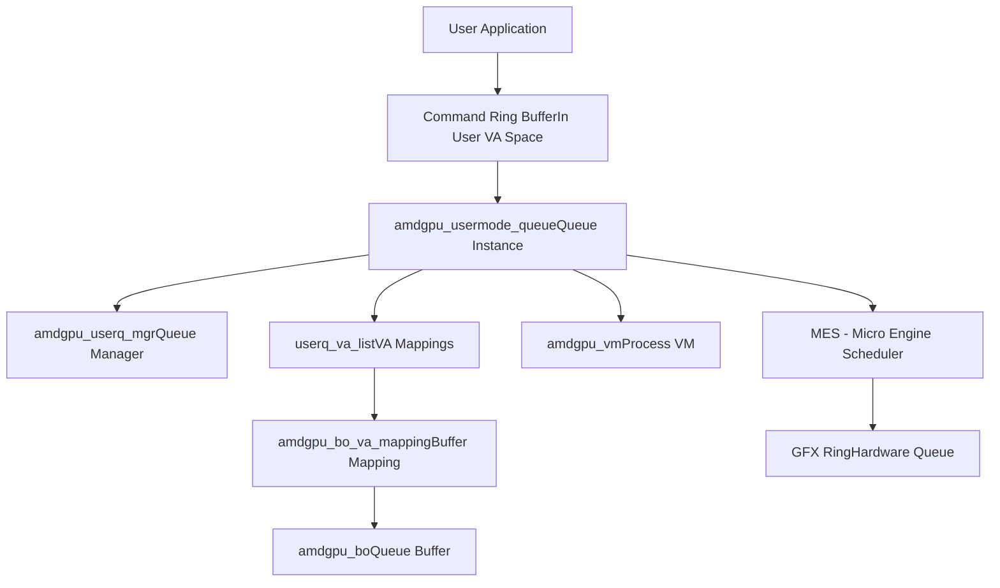
**Sources:** [drivers/gpu/drm/amd/amdgpu/amdgpu\_userq.c37-48](https://github.com/torvalds/linux/blob/fcb70a56/drivers/gpu/drm/amd/amdgpu/amdgpu_userq.c#L37-L48) [drivers/gpu/drm/amd/amdgpu/amdgpu\_userq.c151-202](https://github.com/torvalds/linux/blob/fcb70a56/drivers/gpu/drm/amd/amdgpu/amdgpu_userq.c#L151-L202)

### User Queue Functions

| Function | Location | Purpose |
| --- | --- | --- |
| `amdgpu_userq_get_supported_ip_mask` | [drivers/gpu/drm/amd/amdgpu/amdgpu\_userq.c37-48](https://github.com/torvalds/linux/blob/fcb70a56/drivers/gpu/drm/amd/amdgpu/amdgpu_userq.c#L37-L48) | Query supported queue types |
| `amdgpu_userq_input_va_validate` | [drivers/gpu/drm/amd/amdgpu/amdgpu\_userq.c169-202](https://github.com/torvalds/linux/blob/fcb70a56/drivers/gpu/drm/amd/amdgpu/amdgpu_userq.c#L169-L202) | Validate user VA for queue |
| `amdgpu_userq_detect_and_reset_queues` | [drivers/gpu/drm/amd/amdgpu/amdgpu\_userq.c96-149](https://github.com/torvalds/linux/blob/fcb70a56/drivers/gpu/drm/amd/amdgpu/amdgpu_userq.c#L96-L149) | Detect and reset hung queues |
| `amdgpu_userq_buffer_vas_mapped` | [drivers/gpu/drm/amd/amdgpu/amdgpu\_userq.c222-238](https://github.com/torvalds/linux/blob/fcb70a56/drivers/gpu/drm/amd/amdgpu/amdgpu_userq.c#L222-L238) | Check if queue VAs are mapped |

**Sources:** [drivers/gpu/drm/amd/amdgpu/amdgpu\_userq.c37-238](https://github.com/torvalds/linux/blob/fcb70a56/drivers/gpu/drm/amd/amdgpu/amdgpu_userq.c#L37-L238)

### User Queue Reset Flow

> **[Mermaid sequence]**
> *(图表结构无法解析)*

**Sources:** [drivers/gpu/drm/amd/amdgpu/amdgpu\_userq.c85-149](https://github.com/torvalds/linux/blob/fcb70a56/drivers/gpu/drm/amd/amdgpu/amdgpu_userq.c#L85-L149)

## Display Core (DC) Integration

The Display Core (DC) is AMD's hardware abstraction layer for display controllers.

### DC Architecture

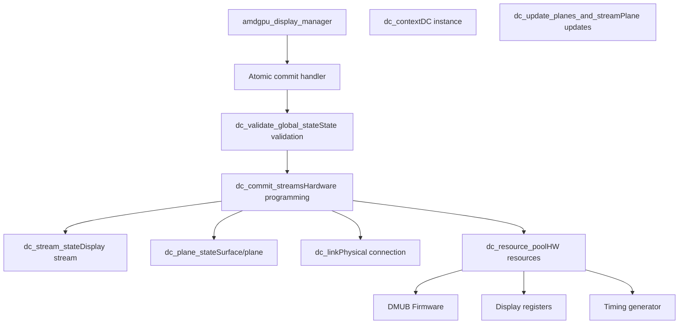
**Sources:** [drivers/gpu/drm/amd/display/amdgpu\_dm/amdgpu\_dm.c391-428](https://github.com/torvalds/linux/blob/fcb70a56/drivers/gpu/drm/amd/display/amdgpu_dm/amdgpu_dm.c#L391-L428)

### DC Update Flow

The DC update process [drivers/gpu/drm/amd/display/amdgpu\_dm/amdgpu\_dm.c391-428](https://github.com/torvalds/linux/blob/fcb70a56/drivers/gpu/drm/amd/display/amdgpu_dm/amdgpu_dm.c#L391-L428) involves:

1.  **Sort Planes**: Sort `dc_surface_update` array by descending layer index (z-order)
2.  **Post Update**: Call `dc_post_update_surfaces_to_stream` for optimizations
3.  **Apply Updates**: Call `dc_update_planes_and_stream` to program hardware
4.  **Coordinate Multiple Planes**: Handle multiple plane updates atomically

**Sources:** [drivers/gpu/drm/amd/display/amdgpu\_dm/amdgpu\_dm.c391-428](https://github.com/torvalds/linux/blob/fcb70a56/drivers/gpu/drm/amd/display/amdgpu_dm/amdgpu_dm.c#L391-L428)

## Memory Statistics and Accounting

The driver tracks memory usage per-VM for debugging and resource management.

### Memory Statistics Structure

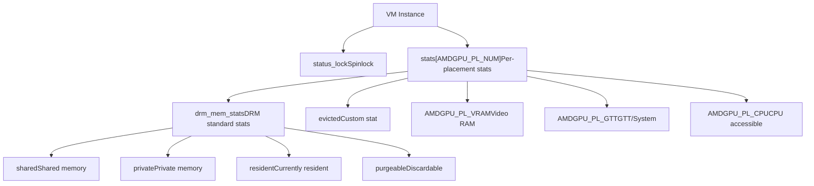
**Sources:** [drivers/gpu/drm/amd/amdgpu/amdgpu\_vm.c294-397](https://github.com/torvalds/linux/blob/fcb70a56/drivers/gpu/drm/amd/amdgpu/amdgpu_vm.c#L294-L397)

### Statistics Update Functions

| Function | Location | Purpose |
| --- | --- | --- |
| `amdgpu_vm_update_stats` | [drivers/gpu/drm/amd/amdgpu/amdgpu\_vm.c389-397](https://github.com/torvalds/linux/blob/fcb70a56/drivers/gpu/drm/amd/amdgpu/amdgpu_vm.c#L389-L397) | Update memory stats (public) |
| `amdgpu_vm_update_stats_locked` | [drivers/gpu/drm/amd/amdgpu/amdgpu\_vm.c350-378](https://github.com/torvalds/linux/blob/fcb70a56/drivers/gpu/drm/amd/amdgpu/amdgpu_vm.c#L350-L378) | Update stats (lock held) |
| `amdgpu_vm_update_shared` | [drivers/gpu/drm/amd/amdgpu/amdgpu\_vm.c301-323](https://github.com/torvalds/linux/blob/fcb70a56/drivers/gpu/drm/amd/amdgpu/amdgpu_vm.c#L301-L323) | Update shared memory flag |
| `amdgpu_vm_bo_update_shared` | [drivers/gpu/drm/amd/amdgpu/amdgpu\_vm.c332-338](https://github.com/torvalds/linux/blob/fcb70a56/drivers/gpu/drm/amd/amdgpu/amdgpu_vm.c#L332-L338) | Update shared for all VMs |

**Sources:** [drivers/gpu/drm/amd/amdgpu/amdgpu\_vm.c301-397](https://github.com/torvalds/linux/blob/fcb70a56/drivers/gpu/drm/amd/amdgpu/amdgpu_vm.c#L301-L397)

## Synchronization Primitives

The graphics subsystem uses various kernel synchronization mechanisms, with Rust providing safe wrappers.

### Rust Synchronization Abstractions

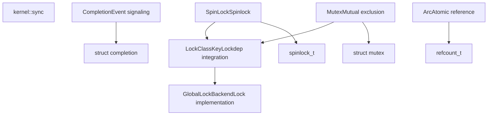
**Sources:** [rust/kernel/sync.rs1-34](https://github.com/torvalds/linux/blob/fcb70a56/rust/kernel/sync.rs#L1-L34) [rust/kernel/sync/lock.rs1-20](https://github.com/torvalds/linux/blob/fcb70a56/rust/kernel/sync/lock.rs#L1-L20)

### Synchronization in Display Manager

The display manager uses multiple synchronization mechanisms:

-   **`dc_lock` Mutex**: Protects DC state during commits [drivers/gpu/drm/amd/display/amdgpu\_dm/amdgpu\_dm.c541-543](https://github.com/torvalds/linux/blob/fcb70a56/drivers/gpu/drm/amd/display/amdgpu_dm/amdgpu_dm.c#L541-L543)
-   **Event Lock Spinlock**: Protects vblank event handling [drivers/gpu/drm/amd/display/amdgpu\_dm/amdgpu\_dm.c457-527](https://github.com/torvalds/linux/blob/fcb70a56/drivers/gpu/drm/amd/display/amdgpu_dm/amdgpu_dm.c#L457-L527)
-   **Status Lock Spinlock**: Protects VM status lists [drivers/gpu/drm/amd/amdgpu/amdgpu\_vm.c156-161](https://github.com/torvalds/linux/blob/fcb70a56/drivers/gpu/drm/amd/amdgpu/amdgpu_vm.c#L156-L161)
-   **DMUB Completion**: Waits for DMUB AUX transfers [drivers/gpu/drm/amd/display/amdgpu\_dm/amdgpu\_dm.c796](https://github.com/torvalds/linux/blob/fcb70a56/drivers/gpu/drm/amd/display/amdgpu_dm/amdgpu_dm.c#L796-L796)

**Sources:** [drivers/gpu/drm/amd/display/amdgpu\_dm/amdgpu\_dm.c457-796](https://github.com/torvalds/linux/blob/fcb70a56/drivers/gpu/drm/amd/display/amdgpu_dm/amdgpu_dm.c#L457-L796)
