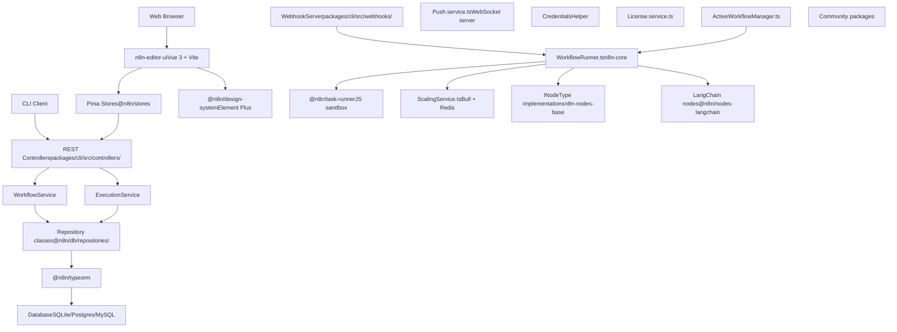
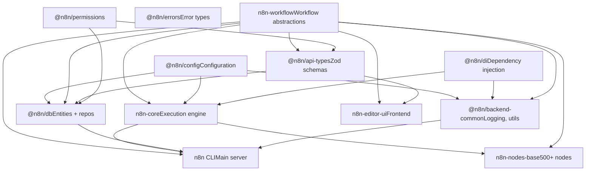
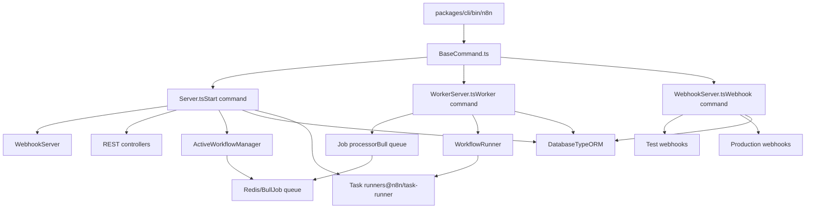
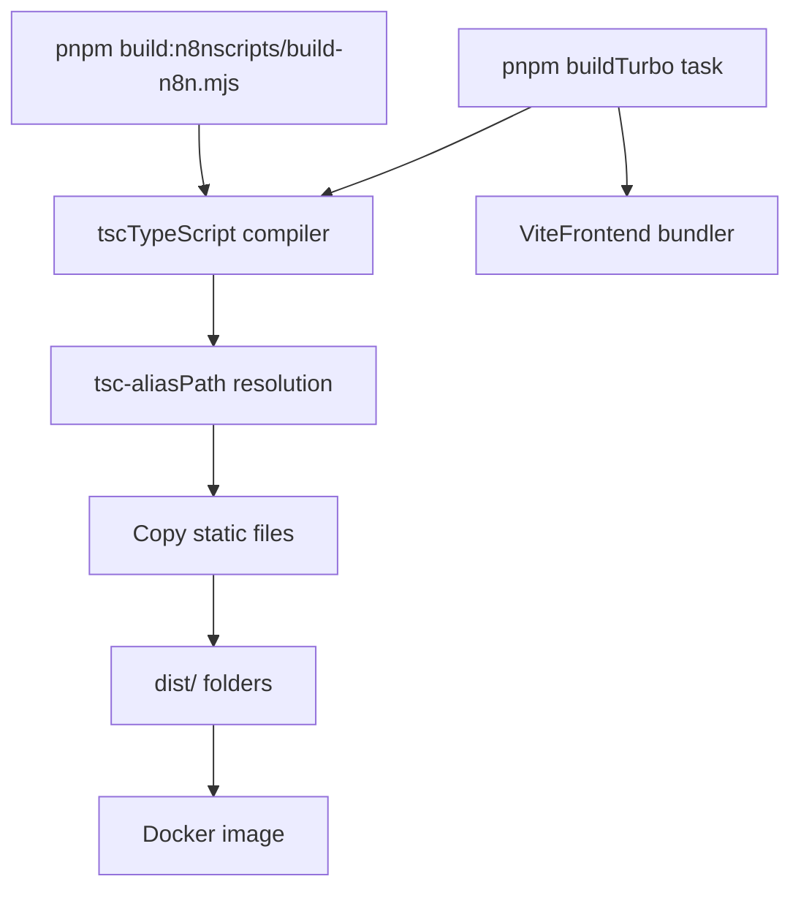

# n8n Overview

Relevant source files

-   [CHANGELOG.md](https://github.com/n8n-io/n8n/blob/88f170b9/CHANGELOG.md?plain=1)
-   [package.json](https://github.com/n8n-io/n8n/blob/88f170b9/package.json)
-   [packages/@n8n/api-types/package.json](https://github.com/n8n-io/n8n/blob/88f170b9/packages/@n8n/api-types/package.json)
-   [packages/@n8n/api-types/src/frontend-settings.ts](https://github.com/n8n-io/n8n/blob/88f170b9/packages/@n8n/api-types/src/frontend-settings.ts)
-   [packages/@n8n/api-types/src/push/collaboration.ts](https://github.com/n8n-io/n8n/blob/88f170b9/packages/@n8n/api-types/src/push/collaboration.ts)
-   [packages/@n8n/backend-common/src/license-state.ts](https://github.com/n8n-io/n8n/blob/88f170b9/packages/@n8n/backend-common/src/license-state.ts)
-   [packages/@n8n/config/package.json](https://github.com/n8n-io/n8n/blob/88f170b9/packages/@n8n/config/package.json)
-   [packages/@n8n/config/src/decorators.ts](https://github.com/n8n-io/n8n/blob/88f170b9/packages/@n8n/config/src/decorators.ts)
-   [packages/@n8n/config/src/index.ts](https://github.com/n8n-io/n8n/blob/88f170b9/packages/@n8n/config/src/index.ts)
-   [packages/@n8n/config/test/config.test.ts](https://github.com/n8n-io/n8n/blob/88f170b9/packages/@n8n/config/test/config.test.ts)
-   [packages/@n8n/config/test/decorators.test.ts](https://github.com/n8n-io/n8n/blob/88f170b9/packages/@n8n/config/test/decorators.test.ts)
-   [packages/@n8n/config/test/string-normalization.test.ts](https://github.com/n8n-io/n8n/blob/88f170b9/packages/@n8n/config/test/string-normalization.test.ts)
-   [packages/@n8n/constants/src/index.ts](https://github.com/n8n-io/n8n/blob/88f170b9/packages/@n8n/constants/src/index.ts)
-   [packages/@n8n/nodes-langchain/package.json](https://github.com/n8n-io/n8n/blob/88f170b9/packages/@n8n/nodes-langchain/package.json)
-   [packages/@n8n/task-runner/package.json](https://github.com/n8n-io/n8n/blob/88f170b9/packages/@n8n/task-runner/package.json)
-   [packages/cli/package.json](https://github.com/n8n-io/n8n/blob/88f170b9/packages/cli/package.json)
-   [packages/cli/src/\_\_tests\_\_/license.test.ts](https://github.com/n8n-io/n8n/blob/88f170b9/packages/cli/src/__tests__/license.test.ts)
-   [packages/cli/src/commands/base-command.ts](https://github.com/n8n-io/n8n/blob/88f170b9/packages/cli/src/commands/base-command.ts)
-   [packages/cli/src/commands/start.ts](https://github.com/n8n-io/n8n/blob/88f170b9/packages/cli/src/commands/start.ts)
-   [packages/cli/src/commands/webhook.ts](https://github.com/n8n-io/n8n/blob/88f170b9/packages/cli/src/commands/webhook.ts)
-   [packages/cli/src/commands/worker.ts](https://github.com/n8n-io/n8n/blob/88f170b9/packages/cli/src/commands/worker.ts)
-   [packages/cli/src/config/index.ts](https://github.com/n8n-io/n8n/blob/88f170b9/packages/cli/src/config/index.ts)
-   [packages/cli/src/config/schema.ts](https://github.com/n8n-io/n8n/blob/88f170b9/packages/cli/src/config/schema.ts)
-   [packages/cli/src/constants.ts](https://github.com/n8n-io/n8n/blob/88f170b9/packages/cli/src/constants.ts)
-   [packages/cli/src/controllers/e2e.controller.ts](https://github.com/n8n-io/n8n/blob/88f170b9/packages/cli/src/controllers/e2e.controller.ts)
-   [packages/cli/src/errors/response-errors/locked.error.ts](https://github.com/n8n-io/n8n/blob/88f170b9/packages/cli/src/errors/response-errors/locked.error.ts)
-   [packages/cli/src/license.ts](https://github.com/n8n-io/n8n/blob/88f170b9/packages/cli/src/license.ts)
-   [packages/cli/src/services/\_\_tests\_\_/frontend.service.test.ts](https://github.com/n8n-io/n8n/blob/88f170b9/packages/cli/src/services/__tests__/frontend.service.test.ts)
-   [packages/cli/src/services/frontend.service.ts](https://github.com/n8n-io/n8n/blob/88f170b9/packages/cli/src/services/frontend.service.ts)
-   [packages/cli/test/integration/commands/worker.cmd.test.ts](https://github.com/n8n-io/n8n/blob/88f170b9/packages/cli/test/integration/commands/worker.cmd.test.ts)
-   [packages/core/package.json](https://github.com/n8n-io/n8n/blob/88f170b9/packages/core/package.json)
-   [packages/frontend/@n8n/design-system/package.json](https://github.com/n8n-io/n8n/blob/88f170b9/packages/frontend/@n8n/design-system/package.json)
-   [packages/frontend/@n8n/design-system/src/components/CanvasCollaborationPill/CanvasCollaborationPill.vue](https://github.com/n8n-io/n8n/blob/88f170b9/packages/frontend/@n8n/design-system/src/components/CanvasCollaborationPill/CanvasCollaborationPill.vue)
-   [packages/frontend/@n8n/design-system/src/components/N8nLogo/Logo.vue](https://github.com/n8n-io/n8n/blob/88f170b9/packages/frontend/@n8n/design-system/src/components/N8nLogo/Logo.vue)
-   [packages/frontend/@n8n/stores/src/useRootStore.ts](https://github.com/n8n-io/n8n/blob/88f170b9/packages/frontend/@n8n/stores/src/useRootStore.ts)
-   [packages/frontend/editor-ui/package.json](https://github.com/n8n-io/n8n/blob/88f170b9/packages/frontend/editor-ui/package.json)
-   [packages/frontend/editor-ui/src/\_\_tests\_\_/defaults.ts](https://github.com/n8n-io/n8n/blob/88f170b9/packages/frontend/editor-ui/src/__tests__/defaults.ts)
-   [packages/frontend/editor-ui/src/app/components/MainHeader/TabBar.vue](https://github.com/n8n-io/n8n/blob/88f170b9/packages/frontend/editor-ui/src/app/components/MainHeader/TabBar.vue)
-   [packages/frontend/editor-ui/src/app/stores/settings.store.test.ts](https://github.com/n8n-io/n8n/blob/88f170b9/packages/frontend/editor-ui/src/app/stores/settings.store.test.ts)
-   [packages/frontend/editor-ui/src/app/stores/settings.store.ts](https://github.com/n8n-io/n8n/blob/88f170b9/packages/frontend/editor-ui/src/app/stores/settings.store.ts)
-   [packages/node-dev/package.json](https://github.com/n8n-io/n8n/blob/88f170b9/packages/node-dev/package.json)
-   [packages/nodes-base/package.json](https://github.com/n8n-io/n8n/blob/88f170b9/packages/nodes-base/package.json)
-   [packages/workflow/package.json](https://github.com/n8n-io/n8n/blob/88f170b9/packages/workflow/package.json)
-   [pnpm-lock.yaml](https://github.com/n8n-io/n8n/blob/88f170b9/pnpm-lock.yaml)
-   [pnpm-workspace.yaml](https://github.com/n8n-io/n8n/blob/88f170b9/pnpm-workspace.yaml)

This document provides a high-level introduction to n8n's architecture, monorepo structure, and core packages. It explains how the codebase is organized into distinct packages with clear dependency boundaries and how the system operates in different runtime modes.

For detailed information about specific subsystems, see:

-   Workflow execution internals: [Workflow Execution Engine](/n8n-io/n8n/2-workflow-execution-engine)
-   REST API architecture: [API and Resource Management](/n8n-io/n8n/3-api-and-resource-management)
-   Node development: [Node System](/n8n-io/n8n/4-node-system)
-   Frontend architecture: [User Interface](/n8n-io/n8n/6-user-interface)
-   Deployment and configuration: [Configuration and Deployment](/n8n-io/n8n/7-configuration-and-deployment)

---

## What is n8n

n8n is a **workflow automation platform** that allows users to create, execute, and monitor workflows composed of interconnected nodes. Each node represents an integration with an external service or a data transformation operation. The platform consists of:

-   **Workflow Canvas**: A Vue 3-based visual editor where users design workflows by connecting nodes.
-   **Execution Engine**: A Node.js backend that runs workflows locally or distributed via queue workers.
-   **Node Ecosystem**: 500+ built-in integrations plus support for custom community nodes.
-   **AI Features**: LangChain integration, Chat Hub for conversational workflows, and AI-assisted workflow building.

The system is built as a **TypeScript monorepo** using pnpm workspaces, with clear separation between frontend, backend, and shared packages.

**Sources:** [package.json1-4](https://github.com/n8n-io/n8n/blob/88f170b9/package.json#L1-L4) [packages/cli/package.json1-4](https://github.com/n8n-io/n8n/blob/88f170b9/packages/cli/package.json#L1-L4) [CHANGELOG.md1-30](https://github.com/n8n-io/n8n/blob/88f170b9/CHANGELOG.md?plain=1#L1-L30)

---

## Monorepo Structure

n8n is organized as a pnpm workspace with packages grouped by function. The monorepo uses **Turbo** for build orchestration and dependency graph management.

### Package Organization

**Sources:** [pnpm-workspace.yaml1-6](https://github.com/n8n-io/n8n/blob/88f170b9/pnpm-workspace.yaml#L1-L6) [package.json1-53](https://github.com/n8n-io/n8n/blob/88f170b9/package.json#L1-L53)

### Key Package Roles

| Package | Path | Purpose | Entry Point |
| --- | --- | --- | --- |
| `n8n-workflow` | `packages/workflow/` | Core workflow abstractions, types, and expression engine | [packages/workflow/package.json5-12](https://github.com/n8n-io/n8n/blob/88f170b9/packages/workflow/package.json#L5-L12) |
| `n8n-core` | `packages/core/` | Workflow execution engine, node loading, credentials | [packages/core/package.json5-6](https://github.com/n8n-io/n8n/blob/88f170b9/packages/core/package.json#L5-L6) |
| `n8n` (CLI) | `packages/cli/` | Main application server, REST API, database, webhooks | [packages/cli/package.json5-6](https://github.com/n8n-io/n8n/blob/88f170b9/packages/cli/package.json#L5-L6) |
| `n8n-nodes-base` | `packages/nodes-base/` | 500+ built-in node integrations | [packages/nodes-base/package.json5](https://github.com/n8n-io/n8n/blob/88f170b9/packages/nodes-base/package.json#L5-L5) |
| `@n8n/n8n-nodes-langchain` | `packages/@n8n/nodes-langchain/` | AI/LLM nodes using LangChain | [packages/@n8n/nodes-langchain/package.json5-18](https://github.com/n8n-io/n8n/blob/88f170b9/packages/@n8n/nodes-langchain/package.json#L5-L18) |
| `n8n-editor-ui` | `packages/frontend/editor-ui/` | Vue 3 workflow canvas and UI | [packages/frontend/editor-ui/package.json2-6](https://github.com/n8n-io/n8n/blob/88f170b9/packages/frontend/editor-ui/package.json#L2-L6) |
| `@n8n/design-system` | `packages/frontend/@n8n/design-system/` | Reusable UI components | [packages/frontend/@n8n/design-system/package.json3-5](https://github.com/n8n-io/n8n/blob/88f170b9/packages/frontend/@n8n/design-system/package.json#L3-L5) |
| `@n8n/config` | `packages/@n8n/config/` | Configuration schema and validation | [packages/@n8n/config/package.json5-6](https://github.com/n8n-io/n8n/blob/88f170b9/packages/@n8n/config/package.json#L5-L6) |
| `@n8n/di` | `packages/@n8n/di/` | Dependency injection framework | [pnpm-lock.yaml1110-1118](https://github.com/n8n-io/n8n/blob/88f170b9/pnpm-lock.yaml#L1110-L1118) |
| `@n8n/db` | `packages/@n8n/db/` | Database entities and repositories | [pnpm-lock.yaml112](https://github.com/n8n-io/n8n/blob/88f170b9/pnpm-lock.yaml#L112-L112) |
| `@n8n/api-types` | `packages/@n8n/api-types/` | Shared types and Zod schemas for API | [packages/@n8n/api-types/package.json2-3](https://github.com/n8n-io/n8n/blob/88f170b9/packages/@n8n/api-types/package.json#L2-L3) |
| `@n8n/task-runner` | `packages/@n8n/task-runner/` | Sandboxed JavaScript/Python execution | [packages/@n8n/task-runner/package.json2-3](https://github.com/n8n-io/n8n/blob/88f170b9/packages/@n8n/task-runner/package.json#L2-L3) |

**Sources:** [pnpm-workspace.yaml1-6](https://github.com/n8n-io/n8n/blob/88f170b9/pnpm-workspace.yaml#L1-L6) [packages/cli/package.json1-130](https://github.com/n8n-io/n8n/blob/88f170b9/packages/cli/package.json#L1-L130) [packages/workflow/package.json1-75](https://github.com/n8n-io/n8n/blob/88f170b9/packages/workflow/package.json#L1-L75)

---

## Architectural Layers

n8n follows a **layered architecture** with clear separation of concerns. The system can be conceptually divided into these layers:

### System Architecture Diagram

**Sources:** [packages/cli/package.json96-160](https://github.com/n8n-io/n8n/blob/88f170b9/packages/cli/package.json#L96-L160) [packages/core/package.json42-83](https://github.com/n8n-io/n8n/blob/88f170b9/packages/core/package.json#L42-L83) [packages/frontend/editor-ui/package.json20-110](https://github.com/n8n-io/n8n/blob/88f170b9/packages/frontend/editor-ui/package.json#L20-L110)

---

## Package Dependency Graph

The following diagram shows the dependency relationships between core packages, illustrating the unidirectional dependency flow:

**Key Principles:**

-   **No circular dependencies**: The graph is acyclic, enabling clean builds and tree-shaking.
-   **Foundation independence**: `n8n-workflow`, `@n8n/config`, `@n8n/di`, `@n8n/errors` have minimal dependencies.
-   **Shared types**: `@n8n/api-types` bridges frontend and backend with Zod-validated schemas.
-   **Application layer**: `n8n` CLI, `n8n-nodes-base`, and `n8n-editor-ui` are the primary executable artifacts.

**Sources:** [packages/cli/package.json96-130](https://github.com/n8n-io/n8n/blob/88f170b9/packages/cli/package.json#L96-L130) [packages/workflow/package.json53-74](https://github.com/n8n-io/n8n/blob/88f170b9/packages/workflow/package.json#L53-L74) [packages/core/package.json42-83](https://github.com/n8n-io/n8n/blob/88f170b9/packages/core/package.json#L42-L83)

---

## Runtime Modes and Process Architecture

n8n can run in multiple modes depending on the deployment configuration. Each mode starts from the same `n8n` CLI entrypoint but executes different server logic.

### Process Modes

**Sources:** [packages/cli/package.json20-52](https://github.com/n8n-io/n8n/blob/88f170b9/packages/cli/package.json#L20-L52) [package.json40-52](https://github.com/n8n-io/n8n/blob/88f170b9/package.json#L40-L52)

### Mode Descriptions

| Mode | Command | Purpose | Key Classes |
| --- | --- | --- | --- |
| **Main** | `n8n start` | Full server with UI, API, webhooks, and local execution | `Server.ts`, `ActiveWorkflowManager.ts` |
| **Worker** | `n8n worker` | Queue-based job processor for distributed execution | `WorkerServer.ts`, `ScalingService.ts` |
| **Webhook** | `n8n webhook` | Dedicated webhook receiver (no UI/API) | `WebhookServer.ts` |

**Execution Modes:**

-   **Regular Mode**: Workflows execute locally in the main process.
-   **Queue Mode**: Workflows enqueued to Bull/Redis, processed by worker processes.
    -   Enabled by `EXECUTIONS_MODE=queue`.
    -   Uses `bull` for task distribution [packages/cli/package.json138](https://github.com/n8n-io/n8n/blob/88f170b9/packages/cli/package.json#L138-L138)

**Sources:** [packages/cli/package.json13-15](https://github.com/n8n-io/n8n/blob/88f170b9/packages/cli/package.json#L13-L15) [packages/cli/src/config/schema.ts34-40](https://github.com/n8n-io/n8n/blob/88f170b9/packages/cli/src/config/schema.ts#L34-L40)

---

## Build System

The monorepo uses **Turbo** for incremental builds and **pnpm** for package management.

### Build Pipeline

**Build Configuration:**

-   **Turbo**: Orchestrates builds with dependency awareness and caching [package.json82](https://github.com/n8n-io/n8n/blob/88f170b9/package.json#L82-L82)
-   **TypeScript**: Packages compile via `tsc` using workspace configurations [packages/cli/package.json10](https://github.com/n8n-io/n8n/blob/88f170b9/packages/cli/package.json#L10-L10)
-   **Vite**: Frontend packages use Vite for bundling [packages/workflow/package.json25](https://github.com/n8n-io/n8n/blob/88f170b9/packages/workflow/package.json#L25-L25)
-   **Path Aliases**: `tsc-alias` resolves TypeScript path mappings after compilation [packages/core/package.json16](https://github.com/n8n-io/n8n/blob/88f170b9/packages/core/package.json#L16-L16)

**Sources:** [package.json10-52](https://github.com/n8n-io/n8n/blob/88f170b9/package.json#L10-L52) [packages/cli/package.json7-12](https://github.com/n8n-io/n8n/blob/88f170b9/packages/cli/package.json#L7-L12) [packages/workflow/package.json21-35](https://github.com/n8n-io/n8n/blob/88f170b9/packages/workflow/package.json#L21-L35)

---

## Next Steps

For deeper dives into specific subsystems, refer to:

-   **[Monorepo Structure and Core Packages](/n8n-io/n8n/1.1-monorepo-structure-and-core-packages)**: Detailed package descriptions and dependency analysis.
-   **[Runtime Architecture and Process Models](/n8n-io/n8n/1.2-runtime-architecture-and-process-models)**: Server initialization, process communication, and mode switching.
-   **[Package Dependencies and Build System](/n8n-io/n8n/1.3-package-dependencies-and-build-system)**: Turbo pipeline and build orchestration details.
