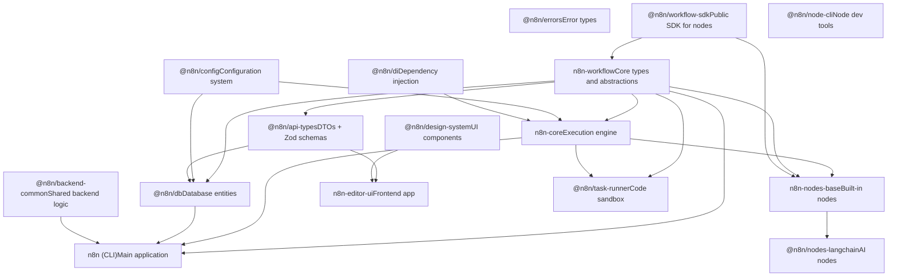
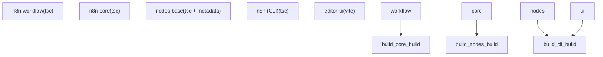

# Monorepo Structure and Core Packages

Relevant source files

-   [CHANGELOG.md](https://github.com/n8n-io/n8n/blob/88f170b9/CHANGELOG.md?plain=1)
-   [codecov.yml](https://github.com/n8n-io/n8n/blob/88f170b9/codecov.yml)
-   [jest.config.js](https://github.com/n8n-io/n8n/blob/88f170b9/jest.config.js)
-   [package.json](https://github.com/n8n-io/n8n/blob/88f170b9/package.json)
-   [packages/@n8n/api-types/package.json](https://github.com/n8n-io/n8n/blob/88f170b9/packages/@n8n/api-types/package.json)
-   [packages/@n8n/backend-common/src/modules/\_\_tests\_\_/module-registry.test.ts](https://github.com/n8n-io/n8n/blob/88f170b9/packages/@n8n/backend-common/src/modules/__tests__/module-registry.test.ts)
-   [packages/@n8n/backend-common/src/modules/module-registry.ts](https://github.com/n8n-io/n8n/blob/88f170b9/packages/@n8n/backend-common/src/modules/module-registry.ts)
-   [packages/@n8n/backend-common/src/modules/modules.config.ts](https://github.com/n8n-io/n8n/blob/88f170b9/packages/@n8n/backend-common/src/modules/modules.config.ts)
-   [packages/@n8n/client-oauth2/tsconfig.build.json](https://github.com/n8n-io/n8n/blob/88f170b9/packages/@n8n/client-oauth2/tsconfig.build.json)
-   [packages/@n8n/config/package.json](https://github.com/n8n-io/n8n/blob/88f170b9/packages/@n8n/config/package.json)
-   [packages/@n8n/decorators/src/\_\_tests\_\_/redactable.test.ts](https://github.com/n8n-io/n8n/blob/88f170b9/packages/@n8n/decorators/src/__tests__/redactable.test.ts)
-   [packages/@n8n/decorators/src/controller/\_\_tests\_\_/args.test.ts](https://github.com/n8n-io/n8n/blob/88f170b9/packages/@n8n/decorators/src/controller/__tests__/args.test.ts)
-   [packages/@n8n/decorators/src/controller/\_\_tests\_\_/license.test.ts](https://github.com/n8n-io/n8n/blob/88f170b9/packages/@n8n/decorators/src/controller/__tests__/license.test.ts)
-   [packages/@n8n/decorators/src/controller/\_\_tests\_\_/scoped.test.ts](https://github.com/n8n-io/n8n/blob/88f170b9/packages/@n8n/decorators/src/controller/__tests__/scoped.test.ts)
-   [packages/@n8n/decorators/src/execution-lifecycle/\_\_tests\_\_/on-lifecycle-event.test.ts](https://github.com/n8n-io/n8n/blob/88f170b9/packages/@n8n/decorators/src/execution-lifecycle/__tests__/on-lifecycle-event.test.ts)
-   [packages/@n8n/decorators/src/execution-lifecycle/index.ts](https://github.com/n8n-io/n8n/blob/88f170b9/packages/@n8n/decorators/src/execution-lifecycle/index.ts)
-   [packages/@n8n/decorators/src/execution-lifecycle/lifecycle-metadata.ts](https://github.com/n8n-io/n8n/blob/88f170b9/packages/@n8n/decorators/src/execution-lifecycle/lifecycle-metadata.ts)
-   [packages/@n8n/decorators/src/module/\_\_tests\_\_/module.test.ts](https://github.com/n8n-io/n8n/blob/88f170b9/packages/@n8n/decorators/src/module/__tests__/module.test.ts)
-   [packages/@n8n/decorators/src/module/index.ts](https://github.com/n8n-io/n8n/blob/88f170b9/packages/@n8n/decorators/src/module/index.ts)
-   [packages/@n8n/decorators/src/module/module-metadata.ts](https://github.com/n8n-io/n8n/blob/88f170b9/packages/@n8n/decorators/src/module/module-metadata.ts)
-   [packages/@n8n/decorators/src/module/module.ts](https://github.com/n8n-io/n8n/blob/88f170b9/packages/@n8n/decorators/src/module/module.ts)
-   [packages/@n8n/expression-runtime/tsconfig.build.cjs.json](https://github.com/n8n-io/n8n/blob/88f170b9/packages/@n8n/expression-runtime/tsconfig.build.cjs.json)
-   [packages/@n8n/expression-runtime/tsconfig.build.esm.json](https://github.com/n8n-io/n8n/blob/88f170b9/packages/@n8n/expression-runtime/tsconfig.build.esm.json)
-   [packages/@n8n/nodes-langchain/package.json](https://github.com/n8n-io/n8n/blob/88f170b9/packages/@n8n/nodes-langchain/package.json)
-   [packages/@n8n/nodes-langchain/tsconfig.build.json](https://github.com/n8n-io/n8n/blob/88f170b9/packages/@n8n/nodes-langchain/tsconfig.build.json)
-   [packages/@n8n/nodes-langchain/tsconfig.json](https://github.com/n8n-io/n8n/blob/88f170b9/packages/@n8n/nodes-langchain/tsconfig.json)
-   [packages/@n8n/task-runner/package.json](https://github.com/n8n-io/n8n/blob/88f170b9/packages/@n8n/task-runner/package.json)
-   [packages/cli/package.json](https://github.com/n8n-io/n8n/blob/88f170b9/packages/cli/package.json)
-   [packages/cli/src/modules/community-packages/community-packages.module.ts](https://github.com/n8n-io/n8n/blob/88f170b9/packages/cli/src/modules/community-packages/community-packages.module.ts)
-   [packages/cli/src/modules/external-secrets.ee/external-secrets.module.ts](https://github.com/n8n-io/n8n/blob/88f170b9/packages/cli/src/modules/external-secrets.ee/external-secrets.module.ts)
-   [packages/cli/src/modules/otel/README.md](https://github.com/n8n-io/n8n/blob/88f170b9/packages/cli/src/modules/otel/README.md?plain=1)
-   [packages/cli/src/modules/otel/\_\_tests\_\_/otel-test-provider.ts](https://github.com/n8n-io/n8n/blob/88f170b9/packages/cli/src/modules/otel/__tests__/otel-test-provider.ts)
-   [packages/cli/src/modules/otel/\_\_tests\_\_/otel-workflow-tracing.integration.test.ts](https://github.com/n8n-io/n8n/blob/88f170b9/packages/cli/src/modules/otel/__tests__/otel-workflow-tracing.integration.test.ts)
-   [packages/cli/src/modules/otel/\_\_tests\_\_/span-registry.test.ts](https://github.com/n8n-io/n8n/blob/88f170b9/packages/cli/src/modules/otel/__tests__/span-registry.test.ts)
-   [packages/cli/src/modules/otel/handlers/interfaces.ts](https://github.com/n8n-io/n8n/blob/88f170b9/packages/cli/src/modules/otel/handlers/interfaces.ts)
-   [packages/cli/src/modules/otel/handlers/workflow-end.handler.ts](https://github.com/n8n-io/n8n/blob/88f170b9/packages/cli/src/modules/otel/handlers/workflow-end.handler.ts)
-   [packages/cli/src/modules/otel/handlers/workflow-start.handler.ts](https://github.com/n8n-io/n8n/blob/88f170b9/packages/cli/src/modules/otel/handlers/workflow-start.handler.ts)
-   [packages/cli/tsconfig.build.json](https://github.com/n8n-io/n8n/blob/88f170b9/packages/cli/tsconfig.build.json)
-   [packages/cli/tsconfig.json](https://github.com/n8n-io/n8n/blob/88f170b9/packages/cli/tsconfig.json)
-   [packages/core/package.json](https://github.com/n8n-io/n8n/blob/88f170b9/packages/core/package.json)
-   [packages/core/tsconfig.build.json](https://github.com/n8n-io/n8n/blob/88f170b9/packages/core/tsconfig.build.json)
-   [packages/core/tsconfig.json](https://github.com/n8n-io/n8n/blob/88f170b9/packages/core/tsconfig.json)
-   [packages/frontend/@n8n/design-system/package.json](https://github.com/n8n-io/n8n/blob/88f170b9/packages/frontend/@n8n/design-system/package.json)
-   [packages/frontend/@n8n/stores/src/\_\_tests\_\_/metaTagConfig.test.ts](https://github.com/n8n-io/n8n/blob/88f170b9/packages/frontend/@n8n/stores/src/__tests__/metaTagConfig.test.ts)
-   [packages/frontend/@n8n/stores/src/metaTagConfig.ts](https://github.com/n8n-io/n8n/blob/88f170b9/packages/frontend/@n8n/stores/src/metaTagConfig.ts)
-   [packages/frontend/editor-ui/index.html](https://github.com/n8n-io/n8n/blob/88f170b9/packages/frontend/editor-ui/index.html)
-   [packages/frontend/editor-ui/package.json](https://github.com/n8n-io/n8n/blob/88f170b9/packages/frontend/editor-ui/package.json)
-   [packages/frontend/editor-ui/public/static/posthog.init.js](https://github.com/n8n-io/n8n/blob/88f170b9/packages/frontend/editor-ui/public/static/posthog.init.js)
-   [packages/frontend/editor-ui/public/static/prefers-color-scheme.css](https://github.com/n8n-io/n8n/blob/88f170b9/packages/frontend/editor-ui/public/static/prefers-color-scheme.css)
-   [packages/frontend/editor-ui/tsconfig.json](https://github.com/n8n-io/n8n/blob/88f170b9/packages/frontend/editor-ui/tsconfig.json)
-   [packages/frontend/editor-ui/vite.config.mts](https://github.com/n8n-io/n8n/blob/88f170b9/packages/frontend/editor-ui/vite.config.mts)
-   [packages/node-dev/package.json](https://github.com/n8n-io/n8n/blob/88f170b9/packages/node-dev/package.json)
-   [packages/node-dev/tsconfig.json](https://github.com/n8n-io/n8n/blob/88f170b9/packages/node-dev/tsconfig.json)
-   [packages/nodes-base/package.json](https://github.com/n8n-io/n8n/blob/88f170b9/packages/nodes-base/package.json)
-   [packages/nodes-base/tsconfig.json](https://github.com/n8n-io/n8n/blob/88f170b9/packages/nodes-base/tsconfig.json)
-   [packages/workflow/package.json](https://github.com/n8n-io/n8n/blob/88f170b9/packages/workflow/package.json)
-   [packages/workflow/test/expression-vm-errors.test.ts](https://github.com/n8n-io/n8n/blob/88f170b9/packages/workflow/test/expression-vm-errors.test.ts)
-   [packages/workflow/test/setup-vm-evaluator.ts](https://github.com/n8n-io/n8n/blob/88f170b9/packages/workflow/test/setup-vm-evaluator.ts)
-   [packages/workflow/tsconfig.json](https://github.com/n8n-io/n8n/blob/88f170b9/packages/workflow/tsconfig.json)
-   [pnpm-lock.yaml](https://github.com/n8n-io/n8n/blob/88f170b9/pnpm-lock.yaml)
-   [pnpm-workspace.yaml](https://github.com/n8n-io/n8n/blob/88f170b9/pnpm-workspace.yaml)
-   [tsconfig.json](https://github.com/n8n-io/n8n/blob/88f170b9/tsconfig.json)
-   [turbo.json](https://github.com/n8n-io/n8n/blob/88f170b9/turbo.json)

This document describes the organization of the n8n monorepo, its workspace structure, core packages, and their dependency relationships. It covers how the codebase is divided into packages, the role of each major package, and how they depend on each other.

For information about the build system and compilation pipeline, see **Package Dependencies and Build System (1.3)**. For details on runtime architecture and how different processes communicate, see **Runtime Architecture and Process Models (1.2)**.

---

## Workspace Organization

n8n is organized as a **pnpm monorepo** with packages grouped by function. The workspace is defined in `pnpm-workspace.yaml` and follows this structure:

```
packages:  - packages/*  - packages/@n8n/*  - packages/frontend/**  - packages/extensions/**  - packages/testing/**
```
The monorepo uses **pnpm v10.22.0** as its package manager [package.json9](https://github.com/n8n-io/n8n/blob/88f170b9/package.json#L9-L9) and **Turbo v2.8.9** for build orchestration [package.json82](https://github.com/n8n-io/n8n/blob/88f170b9/package.json#L82-L82)

### Physical Directory Layout

| Directory | Description | Key Packages |
| --- | --- | --- |
| `packages/` | Core n8n engine and CLI | `cli`, `core`, `workflow`, `nodes-base` |
| `packages/@n8n/` | Scoped utility and domain packages | `db`, `config`, `di`, `workflow-sdk`, `node-cli` |
| `packages/frontend/` | UI-related packages | `editor-ui`, `@n8n/design-system`, `@n8n/stores` |
| `packages/testing/` | Test infrastructure | `n8n-playwright` |

**Sources:** [pnpm-workspace.yaml1-6](https://github.com/n8n-io/n8n/blob/88f170b9/pnpm-workspace.yaml#L1-L6) [package.json1-85](https://github.com/n8n-io/n8n/blob/88f170b9/package.json#L1-L85)

---

## Package Dependency Hierarchy

The packages follow a layered architecture with clear dependency boundaries. The dependency graph is **acyclic**, enabling efficient tree-shaking and incremental builds.

### Package Dependency Graph


**Key Patterns:**

-   **Foundation packages** have minimal dependencies and are often shared with the frontend.
-   **Backend packages** build on the foundation layer but are restricted to Node.js environments.
-   **Application packages** (like `cli`) consume all layers to provide the end-user product.

**Sources:** [pnpm-lock.yaml1-200](https://github.com/n8n-io/n8n/blob/88f170b9/pnpm-lock.yaml#L1-L200) [packages/cli/package.json96-130](https://github.com/n8n-io/n8n/blob/88f170b9/packages/cli/package.json#L96-L130) [packages/core/package.json42-83](https://github.com/n8n-io/n8n/blob/88f170b9/packages/core/package.json#L42-L83)

---

## Core Packages

### n8n-workflow: Foundation Package

**Package:** `n8n-workflow` [packages/workflow/package.json2](https://github.com/n8n-io/n8n/blob/88f170b9/packages/workflow/package.json#L2-L2)

The foundational package containing core type definitions, interfaces, and abstractions. It is designed to be environment-agnostic (runnable in browser and Node.js).

**Key Exports:**

-   `INodeType`, `INodeTypeDescription`: Interfaces for defining node behavior.
-   `Workflow`: The class responsible for managing a workflow's structure and execution state.
-   Expression evaluation logic (via `@n8n/expression-runtime`).

**Build Output:**

-   Dual ESM/CJS builds [packages/workflow/package.json5-13](https://github.com/n8n-io/n8n/blob/88f170b9/packages/workflow/package.json#L5-L13)
-   ESM: `dist/esm/index.js`
-   CJS: `dist/cjs/index.js`

**Sources:** [packages/workflow/package.json1-76](https://github.com/n8n-io/n8n/blob/88f170b9/packages/workflow/package.json#L1-L76)

---

### n8n-core: Execution Engine

**Package:** `n8n-core` [packages/core/package.json2](https://github.com/n8n-io/n8n/blob/88f170b9/packages/core/package.json#L2-L2)

The **workflow execution engine** responsible for running workflows, managing node execution, and handling data flow.

**Key Components:**

-   `WorkflowExecute`: Main execution orchestrator.
-   `CredentialsHelper`: Handles credential resolution and encryption.
-   `BinaryDataService`: Manages binary file storage.

**Binary Commands:**

-   `n8n-copy-static-files`: Utility to copy node assets.
-   `n8n-generate-translations`: Collects i18n strings from nodes.
-   `n8n-generate-node-defs`: Generates metadata for the frontend.

**Sources:** [packages/core/package.json1-85](https://github.com/n8n-io/n8n/blob/88f170b9/packages/core/package.json#L1-L85)

---

### n8n (CLI): Main Application

**Package:** `n8n` [packages/cli/package.json2](https://github.com/n8n-io/n8n/blob/88f170b9/packages/cli/package.json#L2-L2)

The **main application package** containing the REST API, webhook server, worker processes, and all backend services.

**Entry Point:** `bin/n8n` [packages/cli/package.json41-43](https://github.com/n8n-io/n8n/blob/88f170b9/packages/cli/package.json#L41-L43)

**Key Services:**

-   `WorkflowsController`, `ExecutionsController`: REST API endpoints.
-   `ScalingService`: Bull queue integration for distributed execution (Queue Mode).
-   `PushService`: WebSocket server for real-time UI updates.
-   `LicenseService`: Manages enterprise feature activation.

**Execution Modes:**

-   `main`: API + Webhook + Execution.
-   `worker`: Queue worker.
-   `webhook`: Dedicated webhook receiver.

**Sources:** [packages/cli/package.json1-201](https://github.com/n8n-io/n8n/blob/88f170b9/packages/cli/package.json#L1-L201)

---

### n8n-nodes-base: Built-in Nodes

**Package:** `n8n-nodes-base` [packages/nodes-base/package.json2](https://github.com/n8n-io/n8n/blob/88f170b9/packages/nodes-base/package.json#L2-L2)

Contains **500+ built-in integration nodes** and credentials. Nodes are registered via the `n8n` field in `package.json` [packages/nodes-base/package.json24-137](https://github.com/n8n-io/n8n/blob/88f170b9/packages/nodes-base/package.json#L24-L137)

**Registration Example:**

```
{  "n8n": {    "credentials": [ "dist/credentials/AirtableApi.credentials.js" ],    "nodes": [ "dist/nodes/HttpRequest/HttpRequest.node.js" ]  }}
```
**Sources:** [packages/nodes-base/package.json1-150](https://github.com/n8n-io/n8n/blob/88f170b9/packages/nodes-base/package.json#L1-L150)

---

### New Developer SDKs

To improve the developer experience for custom node authors, n8n introduced specialized SDK packages:

#### @n8n/workflow-sdk

A streamlined package containing only the types and utilities needed by node developers. It is a dependency of `n8n-core` [packages/core/package.json69](https://github.com/n8n-io/n8n/blob/88f170b9/packages/core/package.json#L69-L69) and `n8n-workflow`.

#### @n8n/node-cli

A modern replacement for the legacy `n8n-node-dev` tool, providing commands for scaffolding, building, and testing custom nodes.

---

## Shared Scoped Packages (@n8n/\*)

| Package | Purpose |
| --- | --- |
| `@n8n/db` | Database entities (TypeORM) and migrations. |
| `@n8n/config` | Centralized configuration using Zod for validation. |
| `@n8n/backend-common` | Shared logic like the `ModuleRegistry` [packages/@n8n/backend-common/src/modules/module-registry.ts5-10](https://github.com/n8n-io/n8n/blob/88f170b9/packages/@n8n/backend-common/src/modules/module-registry.ts#L5-L10) |
| `@n8n/api-types` | Shared DTOs and Zod schemas for API contracts [packages/@n8n/api-types/package.json1-34](https://github.com/n8n-io/n8n/blob/88f170b9/packages/@n8n/api-types/package.json#L1-L34) |
| `@n8n/permissions` | Logic for project-based access control. |
| `@n8n/task-runner` | Infrastructure for sandboxed code execution (JavaScript/Python) [packages/@n8n/task-runner/package.json38-51](https://github.com/n8n-io/n8n/blob/88f170b9/packages/@n8n/task-runner/package.json#L38-L51) |

**Sources:** [pnpm-lock.yaml1-200](https://github.com/n8n-io/n8n/blob/88f170b9/pnpm-lock.yaml#L1-L200) [packages/cli/package.json104-122](https://github.com/n8n-io/n8n/blob/88f170b9/packages/cli/package.json#L104-L122)

---

## Dependency Management and Catalogs

n8n uses **pnpm catalogs** to centralize dependency versions across the monorepo [pnpm-workspace.yaml8-86](https://github.com/n8n-io/n8n/blob/88f170b9/pnpm-workspace.yaml#L8-L86) This prevents version mismatch errors between packages.

**Example Catalog Usage:**

```
catalog:  axios: 1.13.5  lodash: 4.17.23  zod: 3.25.67
```
Packages reference these versions using the `catalog:` protocol:

```
"dependencies": {  "axios": "catalog:",  "zod": "catalog:"}
```
**Sources:** [pnpm-workspace.yaml8-86](https://github.com/n8n-io/n8n/blob/88f170b9/pnpm-workspace.yaml#L8-L86) [packages/cli/package.json136](https://github.com/n8n-io/n8n/blob/88f170b9/packages/cli/package.json#L136-L136)

---

## Monorepo Build Flow

The build process is orchestrated by **Turbo**.


**Key Build Scripts:**

-   `pnpm build`: Runs `turbo run build` across all packages [package.json13](https://github.com/n8n-io/n8n/blob/88f170b9/package.json#L13-L13)
-   `pnpm build:n8n`: Specialized script for production-ready CLI builds [package.json14](https://github.com/n8n-io/n8n/blob/88f170b9/package.json#L14-L14)

**Sources:** [package.json10-20](https://github.com/n8n-io/n8n/blob/88f170b9/package.json#L10-L20) [packages/cli/package.json10-11](https://github.com/n8n-io/n8n/blob/88f170b9/packages/cli/package.json#L10-L11) [packages/nodes-base/package.json11](https://github.com/n8n-io/n8n/blob/88f170b9/packages/nodes-base/package.json#L11-L11)
