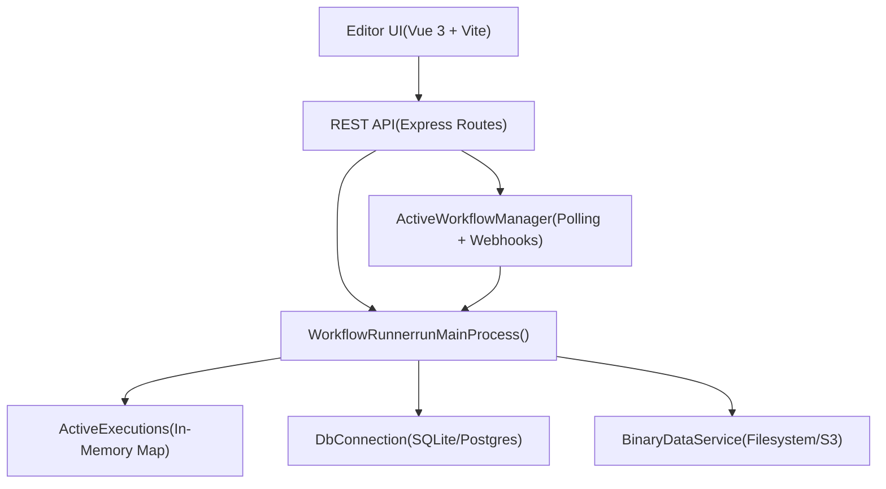
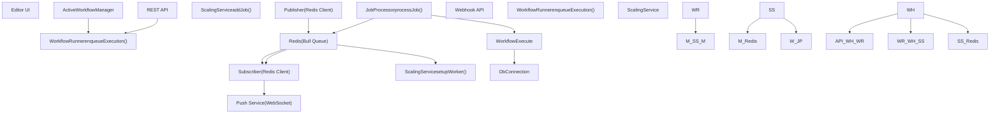
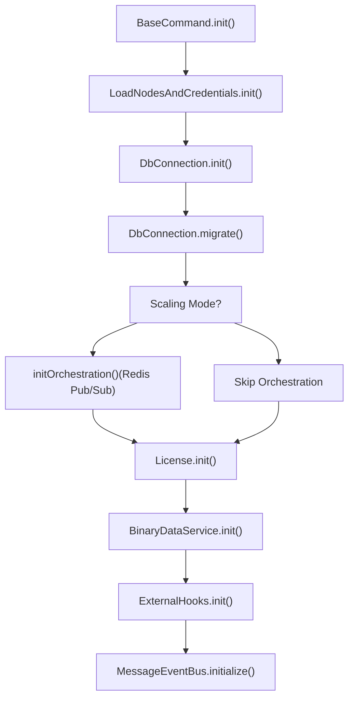
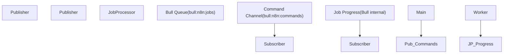

# Runtime Architecture and Process Models

Relevant source files

-   [packages/@n8n/api-types/src/frontend-settings.ts](https://github.com/n8n-io/n8n/blob/88f170b9/packages/@n8n/api-types/src/frontend-settings.ts)
-   [packages/@n8n/api-types/src/push/collaboration.ts](https://github.com/n8n-io/n8n/blob/88f170b9/packages/@n8n/api-types/src/push/collaboration.ts)
-   [packages/@n8n/backend-common/src/license-state.ts](https://github.com/n8n-io/n8n/blob/88f170b9/packages/@n8n/backend-common/src/license-state.ts)
-   [packages/@n8n/benchmark/src/n8n-api-client/n8n-api-client.ts](https://github.com/n8n-io/n8n/blob/88f170b9/packages/@n8n/benchmark/src/n8n-api-client/n8n-api-client.ts)
-   [packages/@n8n/config/src/configs/endpoints.config.ts](https://github.com/n8n-io/n8n/blob/88f170b9/packages/@n8n/config/src/configs/endpoints.config.ts)
-   [packages/@n8n/config/src/configs/scaling-mode.config.ts](https://github.com/n8n-io/n8n/blob/88f170b9/packages/@n8n/config/src/configs/scaling-mode.config.ts)
-   [packages/@n8n/config/src/decorators.ts](https://github.com/n8n-io/n8n/blob/88f170b9/packages/@n8n/config/src/decorators.ts)
-   [packages/@n8n/config/src/index.ts](https://github.com/n8n-io/n8n/blob/88f170b9/packages/@n8n/config/src/index.ts)
-   [packages/@n8n/config/test/config.test.ts](https://github.com/n8n-io/n8n/blob/88f170b9/packages/@n8n/config/test/config.test.ts)
-   [packages/@n8n/config/test/decorators.test.ts](https://github.com/n8n-io/n8n/blob/88f170b9/packages/@n8n/config/test/decorators.test.ts)
-   [packages/@n8n/config/test/string-normalization.test.ts](https://github.com/n8n-io/n8n/blob/88f170b9/packages/@n8n/config/test/string-normalization.test.ts)
-   [packages/@n8n/constants/src/index.ts](https://github.com/n8n-io/n8n/blob/88f170b9/packages/@n8n/constants/src/index.ts)
-   [packages/cli/BREAKING-CHANGES.md](https://github.com/n8n-io/n8n/blob/88f170b9/packages/cli/BREAKING-CHANGES.md?plain=1)
-   [packages/cli/src/\_\_tests\_\_/license.test.ts](https://github.com/n8n-io/n8n/blob/88f170b9/packages/cli/src/__tests__/license.test.ts)
-   [packages/cli/src/abstract-server.ts](https://github.com/n8n-io/n8n/blob/88f170b9/packages/cli/src/abstract-server.ts)
-   [packages/cli/src/commands/base-command.ts](https://github.com/n8n-io/n8n/blob/88f170b9/packages/cli/src/commands/base-command.ts)
-   [packages/cli/src/commands/start.ts](https://github.com/n8n-io/n8n/blob/88f170b9/packages/cli/src/commands/start.ts)
-   [packages/cli/src/commands/webhook.ts](https://github.com/n8n-io/n8n/blob/88f170b9/packages/cli/src/commands/webhook.ts)
-   [packages/cli/src/commands/worker.ts](https://github.com/n8n-io/n8n/blob/88f170b9/packages/cli/src/commands/worker.ts)
-   [packages/cli/src/config/index.ts](https://github.com/n8n-io/n8n/blob/88f170b9/packages/cli/src/config/index.ts)
-   [packages/cli/src/config/schema.ts](https://github.com/n8n-io/n8n/blob/88f170b9/packages/cli/src/config/schema.ts)
-   [packages/cli/src/constants.ts](https://github.com/n8n-io/n8n/blob/88f170b9/packages/cli/src/constants.ts)
-   [packages/cli/src/controllers/e2e.controller.ts](https://github.com/n8n-io/n8n/blob/88f170b9/packages/cli/src/controllers/e2e.controller.ts)
-   [packages/cli/src/errors/response-errors/locked.error.ts](https://github.com/n8n-io/n8n/blob/88f170b9/packages/cli/src/errors/response-errors/locked.error.ts)
-   [packages/cli/src/generic-helpers.ts](https://github.com/n8n-io/n8n/blob/88f170b9/packages/cli/src/generic-helpers.ts)
-   [packages/cli/src/license.ts](https://github.com/n8n-io/n8n/blob/88f170b9/packages/cli/src/license.ts)
-   [packages/cli/src/metrics/\_\_tests\_\_/prometheus-metrics.service.test.ts](https://github.com/n8n-io/n8n/blob/88f170b9/packages/cli/src/metrics/__tests__/prometheus-metrics.service.test.ts)
-   [packages/cli/src/metrics/\_\_tests\_\_/prometheus-metrics.service.unmocked.test.ts](https://github.com/n8n-io/n8n/blob/88f170b9/packages/cli/src/metrics/__tests__/prometheus-metrics.service.unmocked.test.ts)
-   [packages/cli/src/metrics/prometheus-metrics.service.ts](https://github.com/n8n-io/n8n/blob/88f170b9/packages/cli/src/metrics/prometheus-metrics.service.ts)
-   [packages/cli/src/metrics/types.ts](https://github.com/n8n-io/n8n/blob/88f170b9/packages/cli/src/metrics/types.ts)
-   [packages/cli/src/middlewares/list-query/filter.ts](https://github.com/n8n-io/n8n/blob/88f170b9/packages/cli/src/middlewares/list-query/filter.ts)
-   [packages/cli/src/middlewares/list-query/select.ts](https://github.com/n8n-io/n8n/blob/88f170b9/packages/cli/src/middlewares/list-query/select.ts)
-   [packages/cli/src/scaling/\_\_tests\_\_/worker-server.test.ts](https://github.com/n8n-io/n8n/blob/88f170b9/packages/cli/src/scaling/__tests__/worker-server.test.ts)
-   [packages/cli/src/scaling/worker-server.ts](https://github.com/n8n-io/n8n/blob/88f170b9/packages/cli/src/scaling/worker-server.ts)
-   [packages/cli/src/server.ts](https://github.com/n8n-io/n8n/blob/88f170b9/packages/cli/src/server.ts)
-   [packages/cli/src/services/\_\_tests\_\_/frontend.service.test.ts](https://github.com/n8n-io/n8n/blob/88f170b9/packages/cli/src/services/__tests__/frontend.service.test.ts)
-   [packages/cli/src/services/\_\_tests\_\_/redis-client.service.test.ts](https://github.com/n8n-io/n8n/blob/88f170b9/packages/cli/src/services/__tests__/redis-client.service.test.ts)
-   [packages/cli/src/services/frontend.service.ts](https://github.com/n8n-io/n8n/blob/88f170b9/packages/cli/src/services/frontend.service.ts)
-   [packages/cli/src/services/redis-client.service.ts](https://github.com/n8n-io/n8n/blob/88f170b9/packages/cli/src/services/redis-client.service.ts)
-   [packages/cli/test/integration/commands/worker.cmd.test.ts](https://github.com/n8n-io/n8n/blob/88f170b9/packages/cli/test/integration/commands/worker.cmd.test.ts)
-   [packages/cli/test/integration/deduplication/deduplication-helper.test.ts](https://github.com/n8n-io/n8n/blob/88f170b9/packages/cli/test/integration/deduplication/deduplication-helper.test.ts)
-   [packages/cli/test/integration/prometheus-metrics.test.ts](https://github.com/n8n-io/n8n/blob/88f170b9/packages/cli/test/integration/prometheus-metrics.test.ts)
-   [packages/cli/test/integration/shared/types.ts](https://github.com/n8n-io/n8n/blob/88f170b9/packages/cli/test/integration/shared/types.ts)
-   [packages/cli/test/integration/shared/utils/node-types-data.ts](https://github.com/n8n-io/n8n/blob/88f170b9/packages/cli/test/integration/shared/utils/node-types-data.ts)
-   [packages/cli/test/integration/shared/utils/test-server.ts](https://github.com/n8n-io/n8n/blob/88f170b9/packages/cli/test/integration/shared/utils/test-server.ts)
-   [packages/frontend/@n8n/design-system/src/components/CanvasCollaborationPill/CanvasCollaborationPill.vue](https://github.com/n8n-io/n8n/blob/88f170b9/packages/frontend/@n8n/design-system/src/components/CanvasCollaborationPill/CanvasCollaborationPill.vue)
-   [packages/frontend/@n8n/design-system/src/components/N8nLogo/Logo.vue](https://github.com/n8n-io/n8n/blob/88f170b9/packages/frontend/@n8n/design-system/src/components/N8nLogo/Logo.vue)
-   [packages/frontend/@n8n/stores/src/useRootStore.ts](https://github.com/n8n-io/n8n/blob/88f170b9/packages/frontend/@n8n/stores/src/useRootStore.ts)
-   [packages/frontend/editor-ui/src/\_\_tests\_\_/defaults.ts](https://github.com/n8n-io/n8n/blob/88f170b9/packages/frontend/editor-ui/src/__tests__/defaults.ts)
-   [packages/frontend/editor-ui/src/app/components/MainHeader/TabBar.vue](https://github.com/n8n-io/n8n/blob/88f170b9/packages/frontend/editor-ui/src/app/components/MainHeader/TabBar.vue)
-   [packages/frontend/editor-ui/src/app/composables/useBackendStatus.spec.ts](https://github.com/n8n-io/n8n/blob/88f170b9/packages/frontend/editor-ui/src/app/composables/useBackendStatus.spec.ts)
-   [packages/frontend/editor-ui/src/app/composables/useBackendStatus.ts](https://github.com/n8n-io/n8n/blob/88f170b9/packages/frontend/editor-ui/src/app/composables/useBackendStatus.ts)
-   [packages/frontend/editor-ui/src/app/stores/settings.store.test.ts](https://github.com/n8n-io/n8n/blob/88f170b9/packages/frontend/editor-ui/src/app/stores/settings.store.test.ts)
-   [packages/frontend/editor-ui/src/app/stores/settings.store.ts](https://github.com/n8n-io/n8n/blob/88f170b9/packages/frontend/editor-ui/src/app/stores/settings.store.ts)

This document describes n8n's runtime architecture, focusing on the different process models, execution modes, and how they interact. It covers the initialization sequence, inter-process communication, and configuration system that determines runtime behavior.

---

## Overview

n8n can operate in two distinct execution modes, each supporting different process topologies:

-   **Regular Mode**: Single-process architecture where the main process handles all operations.
-   **Queue Mode**: Multi-process architecture using Redis and Bull for distributed execution.

The execution mode is configured via the `N8N_EXECUTIONS_MODE` environment variable and determines which process types can be deployed.

**Process Types**:

-   `main`: Primary process serving the UI, API, and optionally executing workflows.
-   `worker`: Dedicated process for executing workflows (queue mode only).
-   `webhook`: Dedicated process for handling production webhook calls (queue mode only).

Sources: [packages/@n8n/config/src/configs/executions.config.ts1-80](https://github.com/n8n-io/n8n/blob/88f170b9/packages/@n8n/config/src/configs/executions.config.ts#L1-L80) [packages/cli/src/commands/start.ts49-117](https://github.com/n8n-io/n8n/blob/88f170b9/packages/cli/src/commands/start.ts#L49-L117)

---

## Execution Modes

### Regular Mode


**Regular Mode Architecture**

In regular mode, a single process (`main`) handles all operations. The `WorkflowRunner` executes workflows directly in the same process using `runMainProcess()`.

**Key characteristics**:

-   Configured with `N8N_EXECUTIONS_MODE=regular` (default) [packages/@n8n/config/src/configs/executions.config.ts15-16](https://github.com/n8n-io/n8n/blob/88f170b9/packages/@n8n/config/src/configs/executions.config.ts#L15-L16)
-   All execution happens in-process via `WorkflowRunner.runMainProcess()`.
-   `ActiveExecutions` tracks running workflows in memory.
-   No Redis dependency.
-   Suitable for small to medium workloads.

**Initialization Flow**:

> **[Mermaid sequence]**
> *(图表结构无法解析)*

**Key Components**:

-   **`Start` Command** [packages/cli/src/commands/start.ts49-55](https://github.com/n8n-io/n8n/blob/88f170b9/packages/cli/src/commands/start.ts#L49-L55): Entry point that orchestrates initialization.
-   **`Server`** [packages/cli/src/server.ts71-72](https://github.com/n8n-io/n8n/blob/88f170b9/packages/cli/src/server.ts#L71-L72): Configures Express app, routes, and middleware.
-   **`WorkflowRunner`**: Executes workflows in the current process or enqueues them.
-   **`ActiveWorkflowManager`** [packages/cli/src/active-workflow-manager.ts](https://github.com/n8n-io/n8n/blob/88f170b9/packages/cli/src/active-workflow-manager.ts): Manages polling triggers and webhooks.

Sources: [packages/cli/src/commands/start.ts189-282](https://github.com/n8n-io/n8n/blob/88f170b9/packages/cli/src/commands/start.ts#L189-L282) [packages/cli/src/server.ts91-113](https://github.com/n8n-io/n8n/blob/88f170b9/packages/cli/src/server.ts#L91-L113) [packages/cli/src/commands/base-command.ts84-186](https://github.com/n8n-io/n8n/blob/88f170b9/packages/cli/src/commands/base-command.ts#L84-L186)

---

### Queue Mode


**Queue Mode Architecture**

Queue mode distributes execution across multiple processes using Redis and the Bull job queue library. Jobs are enqueued by main/webhook processes and picked up by worker processes.

**Key characteristics**:

-   Configured with `N8N_EXECUTIONS_MODE=queue` [packages/cli/src/commands/worker.ts67-69](https://github.com/n8n-io/n8n/blob/88f170b9/packages/cli/src/commands/worker.ts#L67-L69)
-   Requires Redis for job queue and pub/sub [packages/@n8n/config/src/configs/scaling-mode.config.ts265-283](https://github.com/n8n-io/n8n/blob/88f170b9/packages/@n8n/config/src/configs/scaling-mode.config.ts#L265-L283)
-   Workflows enqueued as jobs via `ScalingService.addJob()`.
-   Workers process jobs using `JobProcessor.processJob()`.
-   Supports horizontal scaling of workers.
-   Main and webhook processes can be scaled with multi-main setup [packages/cli/src/scaling/multi-main-setup.ee.ts](https://github.com/n8n-io/n8n/blob/88f170b9/packages/cli/src/scaling/multi-main-setup.ee.ts)

**Key Components**:

-   **`ScalingService`**: Manages Bull queue, job lifecycle.
-   **`JobProcessor`**: Executes jobs on workers.
-   **`Publisher` / `Subscriber`** [packages/cli/src/scaling/pubsub/publisher.service.ts](https://github.com/n8n-io/n8n/blob/88f170b9/packages/cli/src/scaling/pubsub/publisher.service.ts) [packages/cli/src/scaling/pubsub/subscriber.service.ts](https://github.com/n8n-io/n8n/blob/88f170b9/packages/cli/src/scaling/pubsub/subscriber.service.ts): Redis pub/sub for commands and events.

Sources: [packages/cli/src/commands/worker.ts165-172](https://github.com/n8n-io/n8n/blob/88f170b9/packages/cli/src/commands/worker.ts#L165-L172) [packages/cli/src/commands/worker.ts141-149](https://github.com/n8n-io/n8n/blob/88f170b9/packages/cli/src/commands/worker.ts#L141-L149) [packages/cli/src/commands/start.ts101-104](https://github.com/n8n-io/n8n/blob/88f170b9/packages/cli/src/commands/start.ts#L101-L104)

---

## Process Types

### Main Process

The main process serves the web UI, REST API, and optionally handles webhook execution.

**Command**: `n8n start` [packages/cli/src/commands/start.ts49-55](https://github.com/n8n-io/n8n/blob/88f170b9/packages/cli/src/commands/start.ts#L49-L55)

**Responsibilities**:

| Responsibility | Component | Description |
| --- | --- | --- |
| Serve Web UI | `Server` | Static assets + API routes [packages/cli/src/server.ts92-97](https://github.com/n8n-io/n8n/blob/88f170b9/packages/cli/src/server.ts#L92-L97) |
| REST API | `ControllerRegistry` | Workflows, executions, credentials, users [packages/cli/src/server.ts18-65](https://github.com/n8n-io/n8n/blob/88f170b9/packages/cli/src/server.ts#L18-L65) |
| WebSocket Push | `Push` | Real-time updates to connected clients [packages/cli/src/server.ts191-192](https://github.com/n8n-io/n8n/blob/88f170b9/packages/cli/src/server.ts#L191-L192) |
| Workflow Activation | `ActiveWorkflowManager` | Start/stop polling triggers and webhooks [packages/cli/src/commands/start.ts95](https://github.com/n8n-io/n8n/blob/88f170b9/packages/cli/src/commands/start.ts#L95-L95) |
| Execution (Regular) | `WorkflowRunner` | Direct workflow execution in-process |
| Execution (Queue) | `WorkflowRunner` | Enqueue jobs to Redis |

**Initialization Sequence**:

```
// packages/cli/src/commands/start.tsasync init() {    await this.initCrashJournal();    await super.init(); // BaseCommand.init()    if (this.globalConfig.executions.mode === 'queue') {        await this.initOrchestration(); // Publisher/Subscriber    }    await this.generateStaticAssets(); // Prepare UI files}
```
Sources: [packages/cli/src/commands/start.ts189-282](https://github.com/n8n-io/n8n/blob/88f170b9/packages/cli/src/commands/start.ts#L189-L282) [packages/cli/src/server.ts91-113](https://github.com/n8n-io/n8n/blob/88f170b9/packages/cli/src/server.ts#L91-L113)

---

### Worker Process

Worker processes execute workflows dequeued from Redis. They run no web server by default (except for health/metrics) and connect only to the database and Redis.

**Command**: `n8n worker` [packages/cli/src/commands/worker.ts26-32](https://github.com/n8n-io/n8n/blob/88f170b9/packages/cli/src/commands/worker.ts#L26-L32)

**Responsibilities**:

| Responsibility | Component | Description |
| --- | --- | --- |
| Process Jobs | `ScalingService` | Register job processor with Bull [packages/cli/src/commands/worker.ts171](https://github.com/n8n-io/n8n/blob/88f170b9/packages/cli/src/commands/worker.ts#L171-L171) |
| Execute Workflow | `JobProcessor` | Run workflow and track execution |
| Report Progress | `Bull` | Send progress messages to Redis |
| Handle Commands | `Subscriber` | Handle `stopJob` or license reloads [packages/cli/src/commands/worker.ts146-147](https://github.com/n8n-io/n8n/blob/88f170b9/packages/cli/src/commands/worker.ts#L146-L147) |

**Initialization Sequence**:

```
// packages/cli/src/commands/worker.tsasync init() {    await this.setConcurrency(); // N8N_CONCURRENCY_PRODUCTION_LIMIT    await super.init(); // DB, Nodes, License    await this.initScalingService(); // Setup Bull worker    await this.initOrchestration(); // Redis Pub/Sub}
```
**Concurrency**: Workers support concurrent job processing via the `--concurrency` flag or `N8N_CONCURRENCY_PRODUCTION_LIMIT` [packages/cli/src/commands/worker.ts151-163](https://github.com/n8n-io/n8n/blob/88f170b9/packages/cli/src/commands/worker.ts#L151-L163)

Sources: [packages/cli/src/commands/worker.ts74-126](https://github.com/n8n-io/n8n/blob/88f170b9/packages/cli/src/commands/worker.ts#L74-L126) [packages/cli/src/commands/worker.ts165-172](https://github.com/n8n-io/n8n/blob/88f170b9/packages/cli/src/commands/worker.ts#L165-L172)

---

### Webhook Process

Webhook processes handle production webhook calls and immediately enqueue them for processing. They serve a minimal HTTP API.

**Command**: `n8n webhook` [packages/cli/src/commands/webhook.ts](https://github.com/n8n-io/n8n/blob/88f170b9/packages/cli/src/commands/webhook.ts)

**Requirements**:

-   Queue mode must be enabled (`N8N_EXECUTIONS_MODE=queue`).

**Key Differences from Main**:

-   Does not serve the Editor UI.
-   Does not run polling triggers.
-   Only production webhooks are enabled; test webhooks are disabled [packages/cli/src/server.ts87-88](https://github.com/n8n-io/n8n/blob/88f170b9/packages/cli/src/server.ts#L87-L88)

Sources: [packages/cli/src/server.ts87-89](https://github.com/n8n-io/n8n/blob/88f170b9/packages/cli/src/server.ts#L87-L89) [packages/cli/src/commands/webhook.ts](https://github.com/n8n-io/n8n/blob/88f170b9/packages/cli/src/commands/webhook.ts)

---

## Server Initialization

### Initialization Phases

All process types follow a common initialization sequence defined in `BaseCommand`:


**Phase 1: Database & Core**

-   Connect to database (SQLite/PostgreSQL) [packages/cli/src/commands/base-command.ts125-130](https://github.com/n8n-io/n8n/blob/88f170b9/packages/cli/src/commands/base-command.ts#L125-L130)
-   Run migrations [packages/cli/src/commands/base-command.ts140-145](https://github.com/n8n-io/n8n/blob/88f170b9/packages/cli/src/commands/base-command.ts#L140-L145)

**Phase 2: Nodes & Credentials**

-   Load built-in and community nodes [packages/cli/src/commands/base-command.ts123](https://github.com/n8n-io/n8n/blob/88f170b9/packages/cli/src/commands/base-command.ts#L123-L123)
-   Initialize credential types.

**Phase 3: Orchestration (Queue Mode Only)**

-   Initialize `Publisher` and `Subscriber` [packages/cli/src/commands/worker.ts141-149](https://github.com/n8n-io/n8n/blob/88f170b9/packages/cli/src/commands/worker.ts#L141-L149)
-   Connect to Redis for inter-process communication.

**Phase 4: Task Runners**

-   Start sandboxed execution environments for JavaScript/Python if needed [packages/cli/src/commands/base-command.ts169-178](https://github.com/n8n-io/n8n/blob/88f170b9/packages/cli/src/commands/base-command.ts#L169-L178)

Sources: [packages/cli/src/commands/base-command.ts84-186](https://github.com/n8n-io/n8n/blob/88f170b9/packages/cli/src/commands/base-command.ts#L84-L186) [packages/cli/src/commands/worker.ts141-149](https://github.com/n8n-io/n8n/blob/88f170b9/packages/cli/src/commands/worker.ts#L141-L149)

---

## Process Communication

### Queue Mode Communication

Queue mode uses Redis for both job queue management and inter-process messaging.


**Redis Pub/Sub Channels**:

-   `commands`: Used by Main to send instructions like `stopJob` or `reloadLicense` to Workers [packages/cli/src/scaling/pubsub/subscriber.service.ts](https://github.com/n8n-io/n8n/blob/88f170b9/packages/cli/src/scaling/pubsub/subscriber.service.ts)
-   `worker-response`: Used by Workers to signal completion of tasks back to Main [packages/cli/src/scaling/pubsub/pubsub.registry.ts](https://github.com/n8n-io/n8n/blob/88f170b9/packages/cli/src/scaling/pubsub/pubsub.registry.ts)

Sources: [packages/cli/src/commands/worker.ts141-149](https://github.com/n8n-io/n8n/blob/88f170b9/packages/cli/src/commands/worker.ts#L141-L149) [packages/cli/src/scaling/pubsub/publisher.service.ts](https://github.com/n8n-io/n8n/blob/88f170b9/packages/cli/src/scaling/pubsub/publisher.service.ts) [packages/cli/src/scaling/pubsub/subscriber.service.ts](https://github.com/n8n-io/n8n/blob/88f170b9/packages/cli/src/scaling/pubsub/subscriber.service.ts)

---

### Multi-Main Setup

When `N8N_MULTI_MAIN_SETUP_ENABLED=true`, multiple main instances can run with automatic leader election via Redis [packages/cli/src/scaling/multi-main-setup.ee.ts](https://github.com/n8n-io/n8n/blob/88f170b9/packages/cli/src/scaling/multi-main-setup.ee.ts)

**Leader Responsibilities**:

-   Queue recovery (detect and requeue stalled jobs).
-   Workflow activation tracking.
-   Pruning services [packages/cli/src/commands/start.ts97-99](https://github.com/n8n-io/n8n/blob/88f170b9/packages/cli/src/commands/start.ts#L97-L99)

**Follower Responsibilities**:

-   Serve UI and API.
-   Enqueue new executions.

Sources: [packages/cli/src/scaling/multi-main-setup.ee.ts](https://github.com/n8n-io/n8n/blob/88f170b9/packages/cli/src/scaling/multi-main-setup.ee.ts) [packages/@n8n/config/src/configs/multi-main-setup.config.ts1-20](https://github.com/n8n-io/n8n/blob/88f170b9/packages/@n8n/config/src/configs/multi-main-setup.config.ts#L1-L20)

---

## Configuration System

### GlobalConfig Architecture

The configuration system uses decorators to map environment variables to strongly-typed classes [packages/@n8n/config/src/index.ts74-75](https://github.com/n8n-io/n8n/blob/88f170b9/packages/@n8n/config/src/index.ts#L74-L75)

```
// packages/@n8n/config/src/index.ts@Configexport class GlobalConfig {    @Env('N8N_PORT')    port: number = 5678;     @Nested    executions: ExecutionsConfig;     @Nested    database: DatabaseConfig;}
```
**Key Configuration Groups**:

-   `executions`: Mode (regular/queue), timeouts, and concurrency [packages/@n8n/config/src/configs/executions.config.ts](https://github.com/n8n-io/n8n/blob/88f170b9/packages/@n8n/config/src/configs/executions.config.ts)
-   `database`: Connection settings for SQLite or Postgres [packages/@n8n/config/src/configs/database.config.ts](https://github.com/n8n-io/n8n/blob/88f170b9/packages/@n8n/config/src/configs/database.config.ts)
-   `queue`: Redis and Bull settings [packages/@n8n/config/src/configs/scaling-mode.config.ts](https://github.com/n8n-io/n8n/blob/88f170b9/packages/@n8n/config/src/configs/scaling-mode.config.ts)

Sources: [packages/@n8n/config/src/index.ts74-241](https://github.com/n8n-io/n8n/blob/88f170b9/packages/@n8n/config/src/index.ts#L74-L241) [packages/@n8n/config/test/config.test.ts42-113](https://github.com/n8n-io/n8n/blob/88f170b9/packages/@n8n/config/test/config.test.ts#L42-L113)

---

## Process Lifecycle

### Shutdown Sequence

Graceful shutdown is managed by priority groups to ensure dependencies are closed in the correct order [packages/cli/src/constants.ts127-130](https://github.com/n8n-io/n8n/blob/88f170b9/packages/cli/src/constants.ts#L127-L130)

1.  **Signal Received**: `SIGTERM` or `SIGINT` captured [packages/cli/src/commands/base-command.ts118-119](https://github.com/n8n-io/n8n/blob/88f170b9/packages/cli/src/commands/base-command.ts#L118-L119)
2.  **Stop Tracking**: Stop `WaitTracker` and `ActiveWorkflowManager` [packages/cli/src/commands/start.ts89-95](https://github.com/n8n-io/n8n/blob/88f170b9/packages/cli/src/commands/start.ts#L89-L95)
3.  **Multi-Main**: Shutdown leader election if applicable [packages/cli/src/commands/start.ts97-99](https://github.com/n8n-io/n8n/blob/88f170b9/packages/cli/src/commands/start.ts#L97-L99)
4.  **Queue**: Shutdown `Publisher` and `Subscriber` [packages/cli/src/commands/start.ts101-104](https://github.com/n8n-io/n8n/blob/88f170b9/packages/cli/src/commands/start.ts#L101-L104)
5.  **Final Cleanup**: Close `MessageEventBus` and Database connection [packages/cli/src/commands/start.ts111](https://github.com/n8n-io/n8n/blob/88f170b9/packages/cli/src/commands/start.ts#L111-L111) [packages/cli/src/commands/base-command.ts198](https://github.com/n8n-io/n8n/blob/88f170b9/packages/cli/src/commands/base-command.ts#L198-L198)

Sources: [packages/cli/src/commands/start.ts84-117](https://github.com/n8n-io/n8n/blob/88f170b9/packages/cli/src/commands/start.ts#L84-L117) [packages/cli/src/commands/base-command.ts188-202](https://github.com/n8n-io/n8n/blob/88f170b9/packages/cli/src/commands/base-command.ts#L188-L202) [packages/cli/src/constants.ts127-130](https://github.com/n8n-io/n8n/blob/88f170b9/packages/cli/src/constants.ts#L127-L130)
