# Package Dependencies and Build System

Relevant source files

-   [CHANGELOG.md](https://github.com/n8n-io/n8n/blob/88f170b9/CHANGELOG.md?plain=1)
-   [codecov.yml](https://github.com/n8n-io/n8n/blob/88f170b9/codecov.yml)
-   [jest.config.js](https://github.com/n8n-io/n8n/blob/88f170b9/jest.config.js)
-   [package.json](https://github.com/n8n-io/n8n/blob/88f170b9/package.json)
-   [packages/@n8n/api-types/package.json](https://github.com/n8n-io/n8n/blob/88f170b9/packages/@n8n/api-types/package.json)
-   [packages/@n8n/backend-common/src/modules/\_\_tests\_\_/module-registry.test.ts](https://github.com/n8n-io/n8n/blob/88f170b9/packages/@n8n/backend-common/src/modules/__tests__/module-registry.test.ts)
-   [packages/@n8n/backend-common/src/modules/module-registry.ts](https://github.com/n8n-io/n8n/blob/88f170b9/packages/@n8n/backend-common/src/modules/module-registry.ts)
-   [packages/@n8n/backend-common/src/modules/modules.config.ts](https://github.com/n8n-io/n8n/blob/88f170b9/packages/@n8n/backend-common/src/modules/modules.config.ts)
-   [packages/@n8n/client-oauth2/tsconfig.build.json](https://github.com/n8n-io/n8n/blob/88f170b9/packages/@n8n/client-oauth2/tsconfig.build.json)
-   [packages/@n8n/config/package.json](https://github.com/n8n-io/n8n/blob/88f170b9/packages/@n8n/config/package.json)
-   [packages/@n8n/decorators/src/\_\_tests\_\_/redactable.test.ts](https://github.com/n8n-io/n8n/blob/88f170b9/packages/@n8n/decorators/src/__tests__/redactable.test.ts)
-   [packages/@n8n/decorators/src/controller/\_\_tests\_\_/args.test.ts](https://github.com/n8n-io/n8n/blob/88f170b9/packages/@n8n/decorators/src/controller/__tests__/args.test.ts)
-   [packages/@n8n/decorators/src/controller/\_\_tests\_\_/license.test.ts](https://github.com/n8n-io/n8n/blob/88f170b9/packages/@n8n/decorators/src/controller/__tests__/license.test.ts)
-   [packages/@n8n/decorators/src/controller/\_\_tests\_\_/scoped.test.ts](https://github.com/n8n-io/n8n/blob/88f170b9/packages/@n8n/decorators/src/controller/__tests__/scoped.test.ts)
-   [packages/@n8n/decorators/src/execution-lifecycle/\_\_tests\_\_/on-lifecycle-event.test.ts](https://github.com/n8n-io/n8n/blob/88f170b9/packages/@n8n/decorators/src/execution-lifecycle/__tests__/on-lifecycle-event.test.ts)
-   [packages/@n8n/decorators/src/execution-lifecycle/index.ts](https://github.com/n8n-io/n8n/blob/88f170b9/packages/@n8n/decorators/src/execution-lifecycle/index.ts)
-   [packages/@n8n/decorators/src/execution-lifecycle/lifecycle-metadata.ts](https://github.com/n8n-io/n8n/blob/88f170b9/packages/@n8n/decorators/src/execution-lifecycle/lifecycle-metadata.ts)
-   [packages/@n8n/decorators/src/module/\_\_tests\_\_/module.test.ts](https://github.com/n8n-io/n8n/blob/88f170b9/packages/@n8n/decorators/src/module/__tests__/module.test.ts)
-   [packages/@n8n/decorators/src/module/index.ts](https://github.com/n8n-io/n8n/blob/88f170b9/packages/@n8n/decorators/src/module/index.ts)
-   [packages/@n8n/decorators/src/module/module-metadata.ts](https://github.com/n8n-io/n8n/blob/88f170b9/packages/@n8n/decorators/src/module/module-metadata.ts)
-   [packages/@n8n/decorators/src/module/module.ts](https://github.com/n8n-io/n8n/blob/88f170b9/packages/@n8n/decorators/src/module/module.ts)
-   [packages/@n8n/expression-runtime/tsconfig.build.cjs.json](https://github.com/n8n-io/n8n/blob/88f170b9/packages/@n8n/expression-runtime/tsconfig.build.cjs.json)
-   [packages/@n8n/expression-runtime/tsconfig.build.esm.json](https://github.com/n8n-io/n8n/blob/88f170b9/packages/@n8n/expression-runtime/tsconfig.build.esm.json)
-   [packages/@n8n/nodes-langchain/package.json](https://github.com/n8n-io/n8n/blob/88f170b9/packages/@n8n/nodes-langchain/package.json)
-   [packages/@n8n/nodes-langchain/tsconfig.build.json](https://github.com/n8n-io/n8n/blob/88f170b9/packages/@n8n/nodes-langchain/tsconfig.build.json)
-   [packages/@n8n/nodes-langchain/tsconfig.json](https://github.com/n8n-io/n8n/blob/88f170b9/packages/@n8n/nodes-langchain/tsconfig.json)
-   [packages/@n8n/task-runner/package.json](https://github.com/n8n-io/n8n/blob/88f170b9/packages/@n8n/task-runner/package.json)
-   [packages/cli/package.json](https://github.com/n8n-io/n8n/blob/88f170b9/packages/cli/package.json)
-   [packages/cli/src/modules/community-packages/community-packages.module.ts](https://github.com/n8n-io/n8n/blob/88f170b9/packages/cli/src/modules/community-packages/community-packages.module.ts)
-   [packages/cli/src/modules/external-secrets.ee/external-secrets.module.ts](https://github.com/n8n-io/n8n/blob/88f170b9/packages/cli/src/modules/external-secrets.ee/external-secrets.module.ts)
-   [packages/cli/src/modules/otel/README.md](https://github.com/n8n-io/n8n/blob/88f170b9/packages/cli/src/modules/otel/README.md?plain=1)
-   [packages/cli/src/modules/otel/\_\_tests\_\_/otel-test-provider.ts](https://github.com/n8n-io/n8n/blob/88f170b9/packages/cli/src/modules/otel/__tests__/otel-test-provider.ts)
-   [packages/cli/src/modules/otel/\_\_tests\_\_/otel-workflow-tracing.integration.test.ts](https://github.com/n8n-io/n8n/blob/88f170b9/packages/cli/src/modules/otel/__tests__/otel-workflow-tracing.integration.test.ts)
-   [packages/cli/src/modules/otel/\_\_tests\_\_/span-registry.test.ts](https://github.com/n8n-io/n8n/blob/88f170b9/packages/cli/src/modules/otel/__tests__/span-registry.test.ts)
-   [packages/cli/src/modules/otel/handlers/interfaces.ts](https://github.com/n8n-io/n8n/blob/88f170b9/packages/cli/src/modules/otel/handlers/interfaces.ts)
-   [packages/cli/src/modules/otel/handlers/workflow-end.handler.ts](https://github.com/n8n-io/n8n/blob/88f170b9/packages/cli/src/modules/otel/handlers/workflow-end.handler.ts)
-   [packages/cli/src/modules/otel/handlers/workflow-start.handler.ts](https://github.com/n8n-io/n8n/blob/88f170b9/packages/cli/src/modules/otel/handlers/workflow-start.handler.ts)
-   [packages/cli/tsconfig.build.json](https://github.com/n8n-io/n8n/blob/88f170b9/packages/cli/tsconfig.build.json)
-   [packages/cli/tsconfig.json](https://github.com/n8n-io/n8n/blob/88f170b9/packages/cli/tsconfig.json)
-   [packages/core/package.json](https://github.com/n8n-io/n8n/blob/88f170b9/packages/core/package.json)
-   [packages/core/tsconfig.build.json](https://github.com/n8n-io/n8n/blob/88f170b9/packages/core/tsconfig.build.json)
-   [packages/core/tsconfig.json](https://github.com/n8n-io/n8n/blob/88f170b9/packages/core/tsconfig.json)
-   [packages/frontend/@n8n/design-system/package.json](https://github.com/n8n-io/n8n/blob/88f170b9/packages/frontend/@n8n/design-system/package.json)
-   [packages/frontend/@n8n/stores/src/\_\_tests\_\_/metaTagConfig.test.ts](https://github.com/n8n-io/n8n/blob/88f170b9/packages/frontend/@n8n/stores/src/__tests__/metaTagConfig.test.ts)
-   [packages/frontend/@n8n/stores/src/metaTagConfig.ts](https://github.com/n8n-io/n8n/blob/88f170b9/packages/frontend/@n8n/stores/src/metaTagConfig.ts)
-   [packages/frontend/editor-ui/index.html](https://github.com/n8n-io/n8n/blob/88f170b9/packages/frontend/editor-ui/index.html)
-   [packages/frontend/editor-ui/package.json](https://github.com/n8n-io/n8n/blob/88f170b9/packages/frontend/editor-ui/package.json)
-   [packages/frontend/editor-ui/public/static/posthog.init.js](https://github.com/n8n-io/n8n/blob/88f170b9/packages/frontend/editor-ui/public/static/posthog.init.js)
-   [packages/frontend/editor-ui/public/static/prefers-color-scheme.css](https://github.com/n8n-io/n8n/blob/88f170b9/packages/frontend/editor-ui/public/static/prefers-color-scheme.css)
-   [packages/frontend/editor-ui/tsconfig.json](https://github.com/n8n-io/n8n/blob/88f170b9/packages/frontend/editor-ui/tsconfig.json)
-   [packages/frontend/editor-ui/vite.config.mts](https://github.com/n8n-io/n8n/blob/88f170b9/packages/frontend/editor-ui/vite.config.mts)
-   [packages/node-dev/package.json](https://github.com/n8n-io/n8n/blob/88f170b9/packages/node-dev/package.json)
-   [packages/node-dev/tsconfig.json](https://github.com/n8n-io/n8n/blob/88f170b9/packages/node-dev/tsconfig.json)
-   [packages/nodes-base/package.json](https://github.com/n8n-io/n8n/blob/88f170b9/packages/nodes-base/package.json)
-   [packages/nodes-base/tsconfig.json](https://github.com/n8n-io/n8n/blob/88f170b9/packages/nodes-base/tsconfig.json)
-   [packages/workflow/package.json](https://github.com/n8n-io/n8n/blob/88f170b9/packages/workflow/package.json)
-   [packages/workflow/test/expression-vm-errors.test.ts](https://github.com/n8n-io/n8n/blob/88f170b9/packages/workflow/test/expression-vm-errors.test.ts)
-   [packages/workflow/test/setup-vm-evaluator.ts](https://github.com/n8n-io/n8n/blob/88f170b9/packages/workflow/test/setup-vm-evaluator.ts)
-   [packages/workflow/tsconfig.json](https://github.com/n8n-io/n8n/blob/88f170b9/packages/workflow/tsconfig.json)
-   [pnpm-lock.yaml](https://github.com/n8n-io/n8n/blob/88f170b9/pnpm-lock.yaml)
-   [pnpm-workspace.yaml](https://github.com/n8n-io/n8n/blob/88f170b9/pnpm-workspace.yaml)
-   [tsconfig.json](https://github.com/n8n-io/n8n/blob/88f170b9/tsconfig.json)
-   [turbo.json](https://github.com/n8n-io/n8n/blob/88f170b9/turbo.json)

This page covers how n8n's monorepo manages dependency versions, applies patches to third-party packages, and compiles each workspace package into distributable artifacts. The focus is on tooling configuration: pnpm workspace layout, the catalog system, Turborepo task orchestration, and per-package TypeScript and Vite compilation strategies.

For CI/CD pipelines that consume these artifacts, see [9.1](https://github.com/n8n-io/n8n/blob/88f170b9/9.1) and [9.2](https://github.com/n8n-io/n8n/blob/88f170b9/9.2) For Docker image assembly, see [7.3](https://github.com/n8n-io/n8n/blob/88f170b9/7.3) and [9.4](https://github.com/n8n-io/n8n/blob/88f170b9/9.4) For the development environment setup, see [10.1](https://github.com/n8n-io/n8n/blob/88f170b9/10.1)

---

## Package Manager and Workspace Layout

n8n uses **pnpm 10.22.0** (enforced by the `packageManager` field in the root `package.json`) with pnpm workspaces. The `preinstall` script at the root runs `scripts/block-npm-install.js` and exits with an error if npm or yarn is detected.

Workspace package roots are declared in `pnpm-workspace.yaml`:

| Glob | Contains |
| --- | --- |
| `packages/*` | `n8n-workflow`, `n8n-core`, `n8n-nodes-base`, `packages/cli` (`n8n`), `packages/node-dev` |
| `packages/@n8n/*` | `@n8n/config`, `@n8n/db`, `@n8n/di`, `@n8n/task-runner`, `@n8n/api-types`, `@n8n/decorators`, etc. |
| `packages/frontend/**` | `n8n-editor-ui`, `@n8n/design-system`, `@n8n/chat`, `@n8n/i18n`, and other frontend packages |
| `packages/extensions/**` | Extension packages |
| `packages/testing/**` | `n8n-playwright`, `n8n-containers` |

Sources: `pnpm-workspace.yaml:1-7`(), `package.json:9`(), `package.json:12`()

---

## Catalog-Based Version Pinning

pnpm catalogs in `pnpm-workspace.yaml` define shared version pins referenced using the `catalog:` specifier in individual `package.json` files. This prevents version drift across packages without having to repeat exact versions in every manifest.

**Catalog groups:**

| Catalog | Referenced as | Example entries |
| --- | --- | --- |
| default (unnamed) | `catalog:` | `typescript`, `lodash`, `zod`, `vitest`, `vite`, `axios` |
| `frontend` | `catalog:frontend` | `vue`, `pinia`, `vue-router`, `element-plus`, `vitest` |
| `storybook` | `catalog:storybook` | `storybook`, `@storybook/vue3-vite` |
| `e2e` | `catalog:e2e` | `@playwright/test`, `@currents/playwright`, `playwright` |
| `sentry` | `catalog:sentry` | `@sentry/node`, `@sentry/profiling-node`, `@sentry/node-native` |

**Example usage in `packages/cli/package.json`:**

```
"lodash":        "catalog:","@sentry/node":  "catalog:sentry","@n8n/typeorm":  "catalog:"
```
**Notable catalog entry — Vite aliased to rolldown-vite:**

The `vite` entry in the default catalog is:

```
vite: npm:rolldown-vite@latest
```
All workspace packages that declare `"vite": "catalog:"` transparently receive `rolldown-vite` (a Vite fork using the Rolldown bundler) without any changes to their own config.

Sources: `pnpm-workspace.yaml:8-128`(), `pnpm-lock.yaml:183-186`(), `packages/cli/package.json:120-136`()

---

## Dependency Overrides and Patches

### Global Overrides

The root `package.json` `pnpm.overrides` section (mirrored in `pnpm-lock.yaml` `overrides`) forces specific versions of transitive dependencies across the entire install graph.

| Override | Effect |
| --- | --- |
| `typescript: 5.9.2` | Single TypeScript version for all tools |
| `zod: 3.25.67` | Prevents conflicting Zod instances |
| `axios: 1.13.5` | Pinned for security |
| `esbuild: ^0.25.0` | Consistent bundler version |
| `multer: ^2.1.1` | Security fix |
| `expr-eval@2.0.2: npm:expr-eval-fork@3.0.0` | Replaces `expr-eval` with a fork |
| `libphonenumber-js: npm:empty-npm-package@1.0.0` | Strips a large unused dep |
| `chokidar: 4.0.3` | Pins file-watcher version |

### Patched Dependencies

Patches are `.patch` files in `patches/` applied by pnpm at install time. The `pnpm.patchedDependencies` map in `package.json` associates each package+version to its patch file.

| Patched Package | Patch File |
| --- | --- |
| `bull@4.16.4` | `patches/bull@4.16.4.patch` |
| `element-plus@2.4.3` | `patches/element-plus@2.4.3.patch` |
| `pdfjs-dist@5.3.31` | `patches/pdfjs-dist@5.3.31.patch` |
| `vue-tsc@2.2.8` | `patches/vue-tsc@2.2.8.patch` |
| `js-base64` | `patches/js-base64.patch` |
| `ics` | `patches/ics.patch` |
| `pkce-challenge@5.0.0` | `patches/pkce-challenge@5.0.0.patch` |
| `@types/express-serve-static-core@5.0.6` | `patches/@types__express-serve-static-core@5.0.6.patch` |
| `@types/ws@8.18.1` | `patches/@types__ws@8.18.1.patch` |

The `pnpm.onlyBuiltDependencies` field restricts native post-install build scripts to only `isolated-vm` and `sqlite3`, preventing unexpected native compilation from other packages.

Sources: `package.json:86-166`(), `pnpm-lock.yaml:157-170`()

---

## Turborepo Build Orchestration

**Turborepo 2.8.9** (a root `devDependency`) orchestrates task execution across workspace packages in topological dependency order. All major root scripts delegate to Turbo:

| Root script | Turbo command |
| --- | --- |
| `build` | `turbo run build` |
| `typecheck` | `turbo typecheck` |
| `dev` | `turbo run dev --parallel --env-mode=loose` |
| `lint` | `turbo run lint` |
| `test` | `turbo run test` |
| `clean` | `turbo run clean` |
| `watch` | `turbo run watch --concurrency=32` |

Turbo determines task order from the `dependencies` and `devDependencies` fields in each package's `package.json`. A package's `build` task waits for all its workspace dependencies' `build` tasks to complete first.

**Diagram: Key build task execution order (workspace package names → build scripts)**

```mermaid
flowchart TD
    DI["@n8n/di(tsc)"]
    ERRORS["@n8n/errors(tsc)"]
    CONSTANTS["@n8n/constants(tsc)"]
    PERMISSIONS["@n8n/permissions(tsc)"]
    CONFIG["@n8n/config(tsc)"]
    DECORATORS["@n8n/decorators(tsc)"]
    BACKEND_COMMON["@n8n/backend-common(tsc)"]
    API_TYPES["@n8n/api-types(tsc)"]
    WORKFLOW["n8n-workflow(tsc ESM+CJS)"]
    DB["@n8n/db(tsc)"]
    CORE["n8n-core(tsc + tsc-alias)"]
    NODES_BASE["n8n-nodes-base(tsc CJS + metadata)"]
    LANGCHAIN["@n8n/n8n-nodes-langchain(tsc + metadata)"]
    TASK_RUNNER["@n8n/task-runner(tsc + tsc-alias)"]
    CLI["n8n (packages/cli)(tsc + tsc-alias + build.mjs)"]
    EDITOR_UI["n8n-editor-ui(vite build)"]

    DI --> CONFIG
    DI --> DECORATORS
    DI --> BACKEND_COMMON
    DI --> DB
    ERRORS --> WORKFLOW
    ERRORS --> CORE
    CONSTANTS --> BACKEND_COMMON
    CONSTANTS --> DECORATORS
    PERMISSIONS --> DECORATORS
    PERMISSIONS --> API_TYPES
    PERMISSIONS --> DB
    CONFIG --> BACKEND_COMMON
    CONFIG --> CORE
    DECORATORS --> DB
    DECORATORS --> CORE
    BACKEND --> COMMON_DB
    BACKEND --> COMMON_CORE
    API --> TYPES_DB
    WORKFLOW --> CORE
    WORKFLOW --> NODES_BASE
    WORKFLOW --> LANGCHAIN
    WORKFLOW --> EDITOR_UI
    WORKFLOW --> CLI
    CORE --> CLI
    CORE --> TASK_RUNNER
    DB --> CLI
    NODES --> BASE_CLI
    LANGCHAIN --> CLI
    EDITOR --> UI_CLI
    WORKFLOW --> TASK_RUNNER
    CONFIG --> TASK_RUNNER
    DI --> TASK_RUNNER
```


Sources: `package.json:10-53`(), `package.json:82`(), `packages/cli/package.json:104-122`()

---

## Per-Package Build Strategies

Different packages use different compilation toolchains depending on their target runtime and module format requirements.

**Diagram: Build toolchain mapping — package name → compiler → output format**

```mermaid
flowchart TD
    UI2["n8n-editor-uibuild: vite builddist/ (browser bundles)"]
    NB2["n8n-nodes-basebuild: tsc --build tsconfig.build.cjs.json     + copy-nodes-json     + n8n-generate-metadata     + n8n-generate-node-defsdist/ (CJS)"]
    LC2["@n8n/n8n-nodes-langchainbuild: tsc --build tsconfig.build.json     + copy-nodes-json     + n8n-generate-metadata     + n8n-generate-node-defsdist/ (CJS+ESM exports)"]
    WF2["n8n-workflowbuild: tsc --build  tsconfig.build.esm.json  tsconfig.build.cjs.jsondist/esm/ + dist/cjs/"]
    CORE2["n8n-corebuild: tsc -p tsconfig.build.json     + tsc-aliasdist/index.js (CJS)"]
    CLI2["n8n (packages/cli)build: tsc -p tsconfig.build.json     + tsc-alias     + node scripts/build.mjsdist/index.js (CJS)"]
    TR2["@n8n/task-runnerbuild: tsc -p tsconfig.build.json     + tsc-aliasdist/start.js (CJS)"]
    DECORATORS2["@n8n/decoratorsbuild: tsc -p tsconfig.build.json     + tsc-alias"]
    DB2["@n8n/dbbuild: tsc -p tsconfig.build.json     + tsc-alias"]
    DI2["@n8n/dibuild: tscdist/index.js (CJS)"]
    CONSTANTS2["@n8n/constantsbuild: tscdist/index.js (CJS)"]
```


Sources: `packages/cli/package.json:10`(), `packages/core/package.json:16`(), `packages/workflow/package.json:26`(), `packages/nodes-base/package.json:11`(), `packages/@n8n/nodes-langchain/package.json:31`(), `packages/frontend/editor-ui/package.json:9`(), `packages/@n8n/task-runner/package.json:10`()

### TypeScript Backend Packages — `tsc-alias`

Most backend packages compile with:

```
tsc -p tsconfig.build.json
tsc-alias -p tsconfig.build.json
```
`tsc-alias` is required because TypeScript does not rewrite `paths` aliases when compiling to CommonJS. `tsc-alias` post-processes the emitted `.js` files and replaces alias imports (e.g., `@/services/...`) with relative paths.

For **watch mode**, packages use `tsc-watch`:

```
tsc-watch -p tsconfig.build.json --onCompilationComplete "tsc-alias -p tsconfig.build.json"
```
Sources: `packages/cli/package.json:39`(), `packages/core/package.json:22`(), `packages/@n8n/task-runner/package.json:18`()

### `n8n-workflow` — Dual ESM/CJS Output

`packages/workflow` is the only core package that emits both ESM and CJS. The `package.json` exports field:

```
"exports": {  ".": {    "types":   "./dist/esm/index.d.ts",    "import":  "./dist/esm/index.js",    "require": "./dist/cjs/index.js"  }}
```
Two separate TypeScript project files drive the dual build: `tsconfig.build.esm.json` and `tsconfig.build.cjs.json`. Both are passed as arguments to a single `tsc --build` invocation.

Sources: `packages/workflow/package.json:5-20`(), `packages/workflow/package.json:26`()

### Node Packages — Metadata Generation Binaries

After TypeScript compilation, `n8n-nodes-base` and `@n8n/n8n-nodes-langchain` run additional steps using binaries exposed by `n8n-core` in its `bin` field:

| Binary | Provided by | Purpose |
| --- | --- | --- |
| `n8n-copy-static-files` | `n8n-core` | Copies non-TypeScript assets to `dist/` |
| `n8n-generate-translations` | `n8n-core` | Generates locale translation metadata |
| `n8n-generate-metadata` | `n8n-core` | Writes node type metadata consumed at startup |
| `n8n-generate-node-defs` | `n8n-core` | Writes the node definition index |

The `copy-nodes-json` step copies the package's own `package.json` into `dist/`. This is required because the n8n node loader reads the `n8n.nodes` and `n8n.credentials` arrays from the installed package's `package.json` at runtime to discover which files to load. Placing this file in `dist/` makes it available regardless of where `dist/` is served from.

Sources: `packages/core/package.json:7-12`(), `packages/nodes-base/package.json:11`(), `packages/@n8n/nodes-langchain/package.json:31`()

### `packages/cli` — Extra Data Build Step

The CLI build runs an additional step after TypeScript compilation:

```
pnpm run build:data   →   node scripts/build.mjs
```
This script copies data files (templates and other static assets) into `dist/`. The published npm package includes only `bin/`, `templates/`, and `dist/`, as specified by the `files` field.

Sources: `packages/cli/package.json:7-11`(), `packages/cli/package.json:55-59`()

### Frontend — Vite

`n8n-editor-ui` build command:

```
cross-env VUE_APP_PUBLIC_PATH="/{{BASE_PATH}}/" NODE_OPTIONS="--max-old-space-size=8192" vite build
```
The `{{BASE_PATH}}` placeholder is substituted at serve time by the `packages/cli` static file handler, allowing the editor to be served at configurable path prefixes.

Sources: `packages/frontend/editor-ui/package.json:9`()

---

## Workspace Dependency Specifiers

Internal packages reference each other using `"workspace:*"`. pnpm resolves these to symlinks in `node_modules/` during `pnpm install`. During `pnpm publish`, pnpm replaces `workspace:*` with the actual resolved version number.

Example from `packages/cli/package.json`:

```
"n8n-workflow":          "workspace:*","n8n-core":              "workspace:*","@n8n/config":           "workspace:*","@n8n/db":               "workspace:*","n8n-editor-ui":         "workspace:*"
```
Sources: `packages/cli/package.json:104-122`()

---

## Shared TypeScript Configuration

A `@n8n/typescript-config` workspace package provides base `tsconfig.json` files. Every package in the monorepo lists it in `devDependencies` as `"workspace:*"` and extends from it.

Sources: `packages/cli/package.json:62`(), `packages/core/package.json:33`(), `packages/workflow/package.json:42`()

---

## Root-Level Development Scripts

| Script | Command | Use |
| --- | --- | --- |
| `dev` | `turbo run dev --parallel --env-mode=loose --filter=!@n8n/design-system --filter=!@n8n/chat --filter=!@n8n/task-runner` | All packages in watch mode (frontend + backend) |
| `dev:be` | Same as `dev` plus `--filter=!n8n-editor-ui` | Backend-only watch mode |
| `dev:ai` | Filters `@n8n/nodes-langchain`, `n8n`, `n8n-core` | AI nodes development |
| `build:n8n` | `node scripts/build-n8n.mjs` | Production CLI artifact assembly |
| `build:docker` | `node scripts/build-n8n.mjs && node scripts/dockerize-n8n.mjs` | Build + Docker packaging |
| `setup-backend-module` | `node scripts/ensure-zx.mjs && zx scripts/backend-module/setup.mjs` | Scaffolding for new modules |

Sources: `package.json:10-53`()

---

## Backend Module Scaffolding System

The `setup-backend-module` script provides an automated way to generate new backend modules. It uses `zx` to run `scripts/backend-module/setup.mjs`.

This system ensures that new modules follow the standard architecture:

1.  Creation of module directory in `packages/cli/src/modules/`.
2.  Generation of the module class (e.g., `ExternalSecretsModule`) decorated with `@Module`.
3.  Registration of the module in the `ModuleRegistry`.

Sources: `package.json:39`(), `packages/@n8n/backend-common/src/modules/module-registry.ts:1-20`(), `packages/@n8n/decorators/src/module/module.ts:1-15`()
