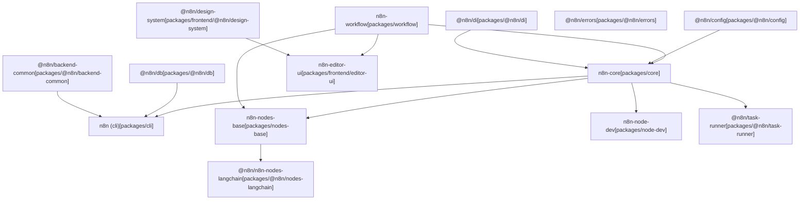
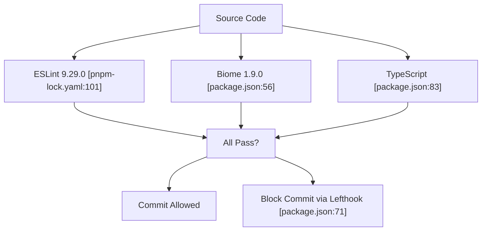

# Contributing to n8n

Relevant source files

-   [CHANGELOG.md](https://github.com/n8n-io/n8n/blob/88f170b9/CHANGELOG.md?plain=1)
-   [package.json](https://github.com/n8n-io/n8n/blob/88f170b9/package.json)
-   [packages/@n8n/api-types/package.json](https://github.com/n8n-io/n8n/blob/88f170b9/packages/@n8n/api-types/package.json)
-   [packages/@n8n/backend-common/src/modules/\_\_tests\_\_/module-registry.test.ts](https://github.com/n8n-io/n8n/blob/88f170b9/packages/@n8n/backend-common/src/modules/__tests__/module-registry.test.ts)
-   [packages/@n8n/backend-common/src/modules/module-registry.ts](https://github.com/n8n-io/n8n/blob/88f170b9/packages/@n8n/backend-common/src/modules/module-registry.ts)
-   [packages/@n8n/backend-common/src/modules/modules.config.ts](https://github.com/n8n-io/n8n/blob/88f170b9/packages/@n8n/backend-common/src/modules/modules.config.ts)
-   [packages/@n8n/config/package.json](https://github.com/n8n-io/n8n/blob/88f170b9/packages/@n8n/config/package.json)
-   [packages/@n8n/decorators/src/\_\_tests\_\_/redactable.test.ts](https://github.com/n8n-io/n8n/blob/88f170b9/packages/@n8n/decorators/src/__tests__/redactable.test.ts)
-   [packages/@n8n/decorators/src/controller/\_\_tests\_\_/args.test.ts](https://github.com/n8n-io/n8n/blob/88f170b9/packages/@n8n/decorators/src/controller/__tests__/args.test.ts)
-   [packages/@n8n/decorators/src/controller/\_\_tests\_\_/license.test.ts](https://github.com/n8n-io/n8n/blob/88f170b9/packages/@n8n/decorators/src/controller/__tests__/license.test.ts)
-   [packages/@n8n/decorators/src/controller/\_\_tests\_\_/scoped.test.ts](https://github.com/n8n-io/n8n/blob/88f170b9/packages/@n8n/decorators/src/controller/__tests__/scoped.test.ts)
-   [packages/@n8n/decorators/src/execution-lifecycle/\_\_tests\_\_/on-lifecycle-event.test.ts](https://github.com/n8n-io/n8n/blob/88f170b9/packages/@n8n/decorators/src/execution-lifecycle/__tests__/on-lifecycle-event.test.ts)
-   [packages/@n8n/decorators/src/execution-lifecycle/index.ts](https://github.com/n8n-io/n8n/blob/88f170b9/packages/@n8n/decorators/src/execution-lifecycle/index.ts)
-   [packages/@n8n/decorators/src/execution-lifecycle/lifecycle-metadata.ts](https://github.com/n8n-io/n8n/blob/88f170b9/packages/@n8n/decorators/src/execution-lifecycle/lifecycle-metadata.ts)
-   [packages/@n8n/decorators/src/module/\_\_tests\_\_/module.test.ts](https://github.com/n8n-io/n8n/blob/88f170b9/packages/@n8n/decorators/src/module/__tests__/module.test.ts)
-   [packages/@n8n/decorators/src/module/index.ts](https://github.com/n8n-io/n8n/blob/88f170b9/packages/@n8n/decorators/src/module/index.ts)
-   [packages/@n8n/decorators/src/module/module-metadata.ts](https://github.com/n8n-io/n8n/blob/88f170b9/packages/@n8n/decorators/src/module/module-metadata.ts)
-   [packages/@n8n/decorators/src/module/module.ts](https://github.com/n8n-io/n8n/blob/88f170b9/packages/@n8n/decorators/src/module/module.ts)
-   [packages/@n8n/nodes-langchain/package.json](https://github.com/n8n-io/n8n/blob/88f170b9/packages/@n8n/nodes-langchain/package.json)
-   [packages/@n8n/task-runner/package.json](https://github.com/n8n-io/n8n/blob/88f170b9/packages/@n8n/task-runner/package.json)
-   [packages/cli/package.json](https://github.com/n8n-io/n8n/blob/88f170b9/packages/cli/package.json)
-   [packages/cli/src/modules/community-packages/community-packages.module.ts](https://github.com/n8n-io/n8n/blob/88f170b9/packages/cli/src/modules/community-packages/community-packages.module.ts)
-   [packages/cli/src/modules/external-secrets.ee/external-secrets.module.ts](https://github.com/n8n-io/n8n/blob/88f170b9/packages/cli/src/modules/external-secrets.ee/external-secrets.module.ts)
-   [packages/cli/src/modules/otel/README.md](https://github.com/n8n-io/n8n/blob/88f170b9/packages/cli/src/modules/otel/README.md?plain=1)
-   [packages/cli/src/modules/otel/\_\_tests\_\_/otel-test-provider.ts](https://github.com/n8n-io/n8n/blob/88f170b9/packages/cli/src/modules/otel/__tests__/otel-test-provider.ts)
-   [packages/cli/src/modules/otel/\_\_tests\_\_/otel-workflow-tracing.integration.test.ts](https://github.com/n8n-io/n8n/blob/88f170b9/packages/cli/src/modules/otel/__tests__/otel-workflow-tracing.integration.test.ts)
-   [packages/cli/src/modules/otel/\_\_tests\_\_/span-registry.test.ts](https://github.com/n8n-io/n8n/blob/88f170b9/packages/cli/src/modules/otel/__tests__/span-registry.test.ts)
-   [packages/cli/src/modules/otel/handlers/interfaces.ts](https://github.com/n8n-io/n8n/blob/88f170b9/packages/cli/src/modules/otel/handlers/interfaces.ts)
-   [packages/cli/src/modules/otel/handlers/workflow-end.handler.ts](https://github.com/n8n-io/n8n/blob/88f170b9/packages/cli/src/modules/otel/handlers/workflow-end.handler.ts)
-   [packages/cli/src/modules/otel/handlers/workflow-start.handler.ts](https://github.com/n8n-io/n8n/blob/88f170b9/packages/cli/src/modules/otel/handlers/workflow-start.handler.ts)
-   [packages/core/package.json](https://github.com/n8n-io/n8n/blob/88f170b9/packages/core/package.json)
-   [packages/frontend/@n8n/design-system/package.json](https://github.com/n8n-io/n8n/blob/88f170b9/packages/frontend/@n8n/design-system/package.json)
-   [packages/frontend/editor-ui/package.json](https://github.com/n8n-io/n8n/blob/88f170b9/packages/frontend/editor-ui/package.json)
-   [packages/node-dev/package.json](https://github.com/n8n-io/n8n/blob/88f170b9/packages/node-dev/package.json)
-   [packages/nodes-base/package.json](https://github.com/n8n-io/n8n/blob/88f170b9/packages/nodes-base/package.json)
-   [packages/workflow/package.json](https://github.com/n8n-io/n8n/blob/88f170b9/packages/workflow/package.json)
-   [pnpm-lock.yaml](https://github.com/n8n-io/n8n/blob/88f170b9/pnpm-lock.yaml)
-   [pnpm-workspace.yaml](https://github.com/n8n-io/n8n/blob/88f170b9/pnpm-workspace.yaml)

This guide covers the essential information for contributing to n8n, including setting up your development environment, understanding the codebase architecture, following coding standards, and submitting contributions. For detailed setup instructions, see [Development Environment Setup](/n8n-io/n8n/10.1-development-environment-setup). For architectural patterns and best practices, see [Architecture Patterns and Best Practices](/n8n-io/n8n/10.2-architecture-patterns-and-best-practices).

## Prerequisites and System Requirements

n8n requires specific versions of Node.js and pnpm to ensure consistent builds across development environments.

| Requirement | Version | Specified In |
| --- | --- | --- |
| Node.js | \>= 22.16 | [package.json6](https://github.com/n8n-io/n8n/blob/88f170b9/package.json#L6-L6) |
| pnpm | \>= 10.22.0 | [package.json9](https://github.com/n8n-io/n8n/blob/88f170b9/package.json#L9-L9) |

The project enforces pnpm usage through a preinstall hook that blocks npm and yarn installations [package.json12](https://github.com/n8n-io/n8n/blob/88f170b9/package.json#L12-L12) This ensures all contributors use the same package manager with identical lockfile semantics.

**Sources:** [package.json1-12](https://github.com/n8n-io/n8n/blob/88f170b9/package.json#L1-L12) [packages/cli/package.json52-54](https://github.com/n8n-io/n8n/blob/88f170b9/packages/cli/package.json#L52-L54)

## Monorepo Structure

n8n is organized as a pnpm workspace monorepo with clear package boundaries and dependency flows.

### Package Organization

Title: n8n Package Dependency Graph


**Workspace Configuration**

The monorepo is defined in [pnpm-workspace.yaml1-7](https://github.com/n8n-io/n8n/blob/88f170b9/pnpm-workspace.yaml#L1-L7) with the following workspace patterns:

-   `packages/*` - Core packages like `cli`, `core`, `workflow`, `node-dev`
-   `packages/@n8n/*` - Scoped packages like `@n8n/config`, `@n8n/di`, `@n8n/db`
-   `packages/frontend/**` - Frontend packages including `editor-ui`, `design-system`
-   `packages/extensions/**` - Extension packages
-   `packages/testing/**` - Testing utilities

**Sources:** [pnpm-workspace.yaml1-7](https://github.com/n8n-io/n8n/blob/88f170b9/pnpm-workspace.yaml#L1-L7) [package.json1-84](https://github.com/n8n-io/n8n/blob/88f170b9/package.json#L1-L84) [packages/cli/package.json96-124](https://github.com/n8n-io/n8n/blob/88f170b9/packages/cli/package.json#L96-L124)

## Development Workflow

### Initial Setup

Title: n8n Development Lifecycle

> **[Mermaid sequence]**
> *(图表结构无法解析)*

**Available Scripts**

The root [package.json10-53](https://github.com/n8n-io/n8n/blob/88f170b9/package.json#L10-L53) defines these key commands:

| Command | Purpose | Details |
| --- | --- | --- |
| `pnpm install` | Install dependencies | Runs `prepare.mjs`, applies patches |
| `pnpm build` | Build all packages | Uses `turbo run build` [package.json13](https://github.com/n8n-io/n8n/blob/88f170b9/package.json#L13-L13) |
| `pnpm dev` | Start development servers | Parallel mode, excludes specific packages [package.json22](https://github.com/n8n-io/n8n/blob/88f170b9/package.json#L22-L22) |
| `pnpm dev:be` | Backend-only development | Excludes `n8n-editor-ui` [package.json23](https://github.com/n8n-io/n8n/blob/88f170b9/package.json#L23-L23) |
| `pnpm dev:fe` | Frontend-only development | Includes `design-system` [package.json25](https://github.com/n8n-io/n8n/blob/88f170b9/package.json#L25-L25) |
| `pnpm typecheck` | Type checking | Runs `turbo typecheck` [package.json21](https://github.com/n8n-io/n8n/blob/88f170b9/package.json#L21-L21) |
| `pnpm lint` | Linting | Runs `turbo run lint` [package.json32](https://github.com/n8n-io/n8n/blob/88f170b9/package.json#L32-L32) |
| `pnpm test` | Run all tests | Runs `turbo run test` [package.json41](https://github.com/n8n-io/n8n/blob/88f170b9/package.json#L41-L41) |

**Build System**

n8n uses Turbo (v2.8.9) for build orchestration [package.json82](https://github.com/n8n-io/n8n/blob/88f170b9/package.json#L82-L82) The build pipeline involves TypeScript compilation, path aliasing via `tsc-alias`, and metadata generation for nodes [packages/nodes-base/package.json11](https://github.com/n8n-io/n8n/blob/88f170b9/packages/nodes-base/package.json#L11-L11)

**Sources:** [package.json10-84](https://github.com/n8n-io/n8n/blob/88f170b9/package.json#L10-L84) [packages/cli/package.json7-40](https://github.com/n8n-io/n8n/blob/88f170b9/packages/cli/package.json#L7-L40) [packages/nodes-base/package.json6-20](https://github.com/n8n-io/n8n/blob/88f170b9/packages/nodes-base/package.json#L6-L20)

## Code Standards and Quality

### Linting and Formatting

n8n enforces code quality through multiple tools:

Title: Code Quality Enforcement


**Running Quality Checks**

```
# Lint all packagespnpm lint # Fix linting issuespnpm lint:fix # Format codepnpm format # Type checkpnpm typecheck
```
**Sources:** [package.json30-36](https://github.com/n8n-io/n8n/blob/88f170b9/package.json#L30-L36) [packages/cli/package.json16-19](https://github.com/n8n-io/n8n/blob/88f170b9/packages/cli/package.json#L16-L19) [pnpm-lock.yaml99-101](https://github.com/n8n-io/n8n/blob/88f170b9/pnpm-lock.yaml#L99-L101)

### Testing Strategy

n8n uses a multi-layered testing approach.

**Testing Tools by Package Type**

| Package Type | Test Runner | Configuration |
| --- | --- | --- |
| Backend (cli, core) | Jest 29.6.2 | `jest.config.js` [packages/cli/package.json21](https://github.com/n8n-io/n8n/blob/88f170b9/packages/cli/package.json#L21-L21) |
| Frontend (editor-ui) | Vitest 3.1.3 | `vitest.config.ts` [packages/frontend/editor-ui/package.json21](https://github.com/n8n-io/n8n/blob/88f170b9/packages/frontend/editor-ui/package.json#L21-L21) |
| Workflow Core | Vitest 3.1.3 | [packages/workflow/package.json32](https://github.com/n8n-io/n8n/blob/88f170b9/packages/workflow/package.json#L32-L32) |
| E2E Tests | Playwright 1.58.0 | [pnpm-workspace.yaml92](https://github.com/n8n-io/n8n/blob/88f170b9/pnpm-workspace.yaml#L92-L92) |

**Sources:** [packages/cli/package.json21-38](https://github.com/n8n-io/n8n/blob/88f170b9/packages/cli/package.json#L21-L38) [packages/frontend/editor-ui/package.json21-22](https://github.com/n8n-io/n8n/blob/88f170b9/packages/frontend/editor-ui/package.json#L21-L22) [packages/workflow/package.json32-34](https://github.com/n8n-io/n8n/blob/88f170b9/packages/workflow/package.json#L32-L34)

## Dependency Management

### Version Catalogs

n8n uses pnpm catalogs in [pnpm-workspace.yaml8-128](https://github.com/n8n-io/n8n/blob/88f170b9/pnpm-workspace.yaml#L8-L128) to ensure consistent dependency versions.

**Catalog Examples**:

-   `default`: Core libraries like `lodash` (4.17.23) and `zod` (3.25.67).
-   `frontend`: Vue ecosystem including `vue` (^3.5.13) and `pinia` (^2.2.4).
-   `sentry`: Unified sentry SDK versions (^10.36.0).

### Patched Dependencies

n8n maintains patches for third-party dependencies in the `patches/` directory, declared in [package.json157-170](https://github.com/n8n-io/n8n/blob/88f170b9/package.json#L157-L170) These include critical fixes for `bull`, `element-plus`, and `vue-tsc`.

**Sources:** [pnpm-workspace.yaml8-128](https://github.com/n8n-io/n8n/blob/88f170b9/pnpm-workspace.yaml#L8-L128) [package.json157-170](https://github.com/n8n-io/n8n/blob/88f170b9/package.json#L157-L170)

## Contribution Process

### Pull Request Workflow

1.  **Fork and Branch**: Create a feature branch from `master`.
2.  **Local Validation**: Run `pnpm lint` and `pnpm test` locally.
3.  **CI Pipeline**: GitHub Actions run a comprehensive suite including:
    -   Matrix testing for databases: `test:sqlite`, `test:postgres` [packages/cli/package.json25-31](https://github.com/n8n-io/n8n/blob/88f170b9/packages/cli/package.json#L25-L31)
    -   Frontend validation: `test:ci:frontend` [package.json43](https://github.com/n8n-io/n8n/blob/88f170b9/package.json#L43-L43)
    -   E2E tests via Playwright [package.json48](https://github.com/n8n-io/n8n/blob/88f170b9/package.json#L48-L48)

**Sources:** [package.json41-49](https://github.com/n8n-io/n8n/blob/88f170b9/package.json#L41-L49) [packages/cli/package.json21-38](https://github.com/n8n-io/n8n/blob/88f170b9/packages/cli/package.json#L21-L38)

## Package-Specific Development

### Developing Nodes

For creating custom nodes, the project provides specialized tooling.

-   **n8n-node-dev**: CLI to simplify node development [packages/node-dev/package.json4](https://github.com/n8n-io/n8n/blob/88f170b9/packages/node-dev/package.json#L4-L4)
-   **nodes-base**: The main package containing 500+ standard nodes [packages/nodes-base/package.json4](https://github.com/n8n-io/n8n/blob/88f170b9/packages/nodes-base/package.json#L4-L4)
-   **n8n-nodes-langchain**: Package for AI and LangChain integrations [packages/@n8n/nodes-langchain/package.json2](https://github.com/n8n-io/n8n/blob/88f170b9/packages/@n8n/nodes-langchain/package.json#L2-L2)

**Sources:** [packages/node-dev/package.json1-54](https://github.com/n8n-io/n8n/blob/88f170b9/packages/node-dev/package.json#L1-L54) [packages/nodes-base/package.json1-136](https://github.com/n8n-io/n8n/blob/88f170b9/packages/nodes-base/package.json#L1-L136) [packages/@n8n/nodes-langchain/package.json1-140](https://github.com/n8n-io/n8n/blob/88f170b9/packages/@n8n/nodes-langchain/package.json#L1-L140)

### Frontend Development

The frontend (`editor-ui`) uses Vue 3 and Vite.

```
# Start frontend dev serverpnpm dev:fe # Run frontend testspnpm --filter n8n-editor-ui test
```
**Sources:** [package.json25](https://github.com/n8n-io/n8n/blob/88f170b9/package.json#L25-L25) [packages/frontend/editor-ui/package.json1-23](https://github.com/n8n-io/n8n/blob/88f170b9/packages/frontend/editor-ui/package.json#L1-L23)

## Architecture Patterns to Follow

When contributing, adhere to these core patterns:

1.  **Dependency Injection**: Use `@n8n/di` for service management [packages/cli/package.json114](https://github.com/n8n-io/n8n/blob/88f170b9/packages/cli/package.json#L114-L114)
2.  **Configuration**: Use `@n8n/config` for environment-aware settings [packages/cli/package.json110](https://github.com/n8n-io/n8n/blob/88f170b9/packages/cli/package.json#L110-L110)
3.  **Module System**: Backend features should be organized as modules using the `@n8n/decorators` package [packages/cli/package.json113](https://github.com/n8n-io/n8n/blob/88f170b9/packages/cli/package.json#L113-L113)

For deep dives into these patterns, see [Architecture Patterns and Best Practices](/n8n-io/n8n/10.2-architecture-patterns-and-best-practices).

---

This guide provides the foundation for contributing to n8n. For detailed environment setup, see [Development Environment Setup](/n8n-io/n8n/10.1-development-environment-setup). For architectural patterns and service layer design, see [Architecture Patterns and Best Practices](/n8n-io/n8n/10.2-architecture-patterns-and-best-practices).
