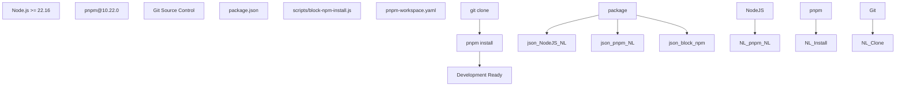
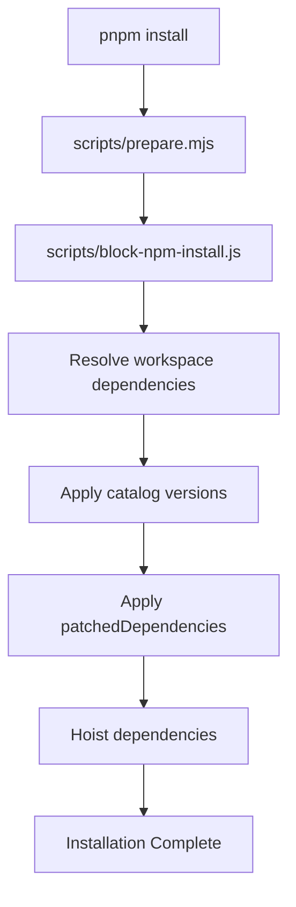
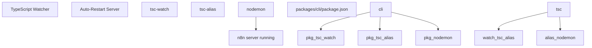
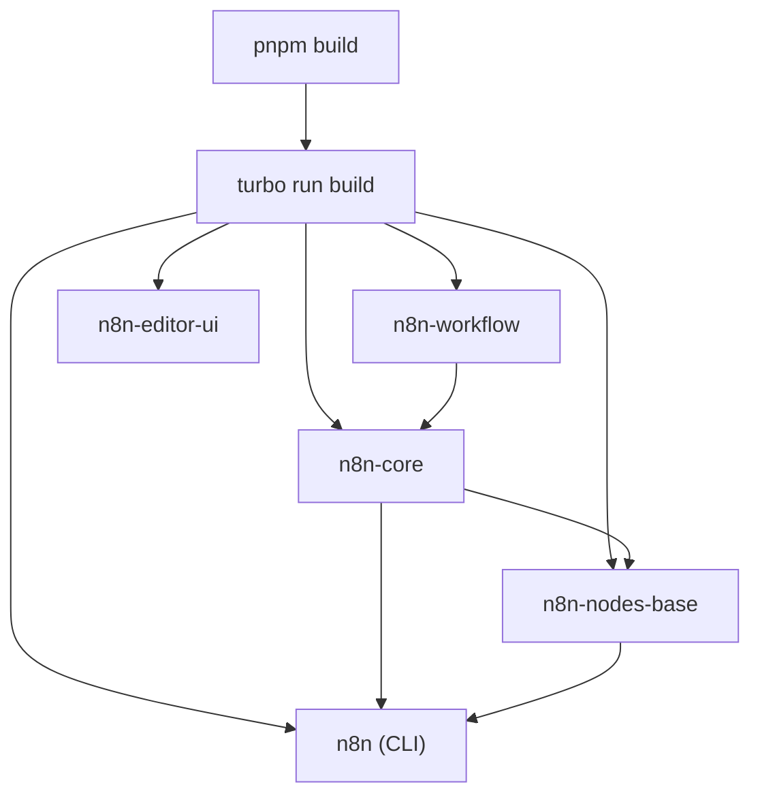

# Development Environment Setup

Relevant source files

-   [CHANGELOG.md](https://github.com/n8n-io/n8n/blob/88f170b9/CHANGELOG.md?plain=1)
-   [codecov.yml](https://github.com/n8n-io/n8n/blob/88f170b9/codecov.yml)
-   [jest.config.js](https://github.com/n8n-io/n8n/blob/88f170b9/jest.config.js)
-   [package.json](https://github.com/n8n-io/n8n/blob/88f170b9/package.json)
-   [packages/@n8n/api-types/package.json](https://github.com/n8n-io/n8n/blob/88f170b9/packages/@n8n/api-types/package.json)
-   [packages/@n8n/client-oauth2/tsconfig.build.json](https://github.com/n8n-io/n8n/blob/88f170b9/packages/@n8n/client-oauth2/tsconfig.build.json)
-   [packages/@n8n/config/package.json](https://github.com/n8n-io/n8n/blob/88f170b9/packages/@n8n/config/package.json)
-   [packages/@n8n/expression-runtime/tsconfig.build.cjs.json](https://github.com/n8n-io/n8n/blob/88f170b9/packages/@n8n/expression-runtime/tsconfig.build.cjs.json)
-   [packages/@n8n/expression-runtime/tsconfig.build.esm.json](https://github.com/n8n-io/n8n/blob/88f170b9/packages/@n8n/expression-runtime/tsconfig.build.esm.json)
-   [packages/@n8n/nodes-langchain/package.json](https://github.com/n8n-io/n8n/blob/88f170b9/packages/@n8n/nodes-langchain/package.json)
-   [packages/@n8n/nodes-langchain/tsconfig.build.json](https://github.com/n8n-io/n8n/blob/88f170b9/packages/@n8n/nodes-langchain/tsconfig.build.json)
-   [packages/@n8n/nodes-langchain/tsconfig.json](https://github.com/n8n-io/n8n/blob/88f170b9/packages/@n8n/nodes-langchain/tsconfig.json)
-   [packages/@n8n/task-runner/package.json](https://github.com/n8n-io/n8n/blob/88f170b9/packages/@n8n/task-runner/package.json)
-   [packages/cli/package.json](https://github.com/n8n-io/n8n/blob/88f170b9/packages/cli/package.json)
-   [packages/cli/tsconfig.build.json](https://github.com/n8n-io/n8n/blob/88f170b9/packages/cli/tsconfig.build.json)
-   [packages/cli/tsconfig.json](https://github.com/n8n-io/n8n/blob/88f170b9/packages/cli/tsconfig.json)
-   [packages/core/package.json](https://github.com/n8n-io/n8n/blob/88f170b9/packages/core/package.json)
-   [packages/core/tsconfig.build.json](https://github.com/n8n-io/n8n/blob/88f170b9/packages/core/tsconfig.build.json)
-   [packages/core/tsconfig.json](https://github.com/n8n-io/n8n/blob/88f170b9/packages/core/tsconfig.json)
-   [packages/frontend/@n8n/design-system/package.json](https://github.com/n8n-io/n8n/blob/88f170b9/packages/frontend/@n8n/design-system/package.json)
-   [packages/frontend/@n8n/stores/src/\_\_tests\_\_/metaTagConfig.test.ts](https://github.com/n8n-io/n8n/blob/88f170b9/packages/frontend/@n8n/stores/src/__tests__/metaTagConfig.test.ts)
-   [packages/frontend/@n8n/stores/src/metaTagConfig.ts](https://github.com/n8n-io/n8n/blob/88f170b9/packages/frontend/@n8n/stores/src/metaTagConfig.ts)
-   [packages/frontend/editor-ui/index.html](https://github.com/n8n-io/n8n/blob/88f170b9/packages/frontend/editor-ui/index.html)
-   [packages/frontend/editor-ui/package.json](https://github.com/n8n-io/n8n/blob/88f170b9/packages/frontend/editor-ui/package.json)
-   [packages/frontend/editor-ui/public/static/posthog.init.js](https://github.com/n8n-io/n8n/blob/88f170b9/packages/frontend/editor-ui/public/static/posthog.init.js)
-   [packages/frontend/editor-ui/public/static/prefers-color-scheme.css](https://github.com/n8n-io/n8n/blob/88f170b9/packages/frontend/editor-ui/public/static/prefers-color-scheme.css)
-   [packages/frontend/editor-ui/tsconfig.json](https://github.com/n8n-io/n8n/blob/88f170b9/packages/frontend/editor-ui/tsconfig.json)
-   [packages/frontend/editor-ui/vite.config.mts](https://github.com/n8n-io/n8n/blob/88f170b9/packages/frontend/editor-ui/vite.config.mts)
-   [packages/node-dev/package.json](https://github.com/n8n-io/n8n/blob/88f170b9/packages/node-dev/package.json)
-   [packages/node-dev/tsconfig.json](https://github.com/n8n-io/n8n/blob/88f170b9/packages/node-dev/tsconfig.json)
-   [packages/nodes-base/package.json](https://github.com/n8n-io/n8n/blob/88f170b9/packages/nodes-base/package.json)
-   [packages/nodes-base/tsconfig.json](https://github.com/n8n-io/n8n/blob/88f170b9/packages/nodes-base/tsconfig.json)
-   [packages/workflow/package.json](https://github.com/n8n-io/n8n/blob/88f170b9/packages/workflow/package.json)
-   [packages/workflow/test/expression-vm-errors.test.ts](https://github.com/n8n-io/n8n/blob/88f170b9/packages/workflow/test/expression-vm-errors.test.ts)
-   [packages/workflow/test/setup-vm-evaluator.ts](https://github.com/n8n-io/n8n/blob/88f170b9/packages/workflow/test/setup-vm-evaluator.ts)
-   [packages/workflow/tsconfig.json](https://github.com/n8n-io/n8n/blob/88f170b9/packages/workflow/tsconfig.json)
-   [pnpm-lock.yaml](https://github.com/n8n-io/n8n/blob/88f170b9/pnpm-lock.yaml)
-   [pnpm-workspace.yaml](https://github.com/n8n-io/n8n/blob/88f170b9/pnpm-workspace.yaml)
-   [tsconfig.json](https://github.com/n8n-io/n8n/blob/88f170b9/tsconfig.json)
-   [turbo.json](https://github.com/n8n-io/n8n/blob/88f170b9/turbo.json)

This document covers the prerequisites, installation, and local development workflow for the n8n codebase. It explains how to set up your development environment, understand the monorepo structure, and use the primary development commands for building, running, and testing the application.

For information about deployment and Docker configuration, see [Docker Deployment](/n8n-io/n8n/7.3-docker-deployment). For CI/CD pipelines and release processes, see [CI Workflows and Pull Request Validation](/n8n-io/n8n/9.2-ci-workflows-and-pull-request-validation).

---

## Prerequisites

n8n requires specific versions of Node.js and pnpm as defined in the root `package.json`: [package.json5-9](https://github.com/n8n-io/n8n/blob/88f170b9/package.json#L5-L9)

| Tool | Minimum Version | Purpose |
| --- | --- | --- |
| **Node.js** | `>=22.16` | JavaScript runtime [package.json6](https://github.com/n8n-io/n8n/blob/88f170b9/package.json#L6-L6) |
| **pnpm** | `>=10.22.0` | Package manager (enforced) [package.json7](https://github.com/n8n-io/n8n/blob/88f170b9/package.json#L7-L7) |

The package manager is pinned to `pnpm@10.22.0` via the `packageManager` field [package.json9](https://github.com/n8n-io/n8n/blob/88f170b9/package.json#L9-L9) npm and yarn are explicitly blocked by `scripts/block-npm-install.js` [package.json12](https://github.com/n8n-io/n8n/blob/88f170b9/package.json#L12-L12) which runs as a `preinstall` hook.

**Development Prerequisites Diagram**


**Sources:** [package.json5-9](https://github.com/n8n-io/n8n/blob/88f170b9/package.json#L5-L9) [package.json12](https://github.com/n8n-io/n8n/blob/88f170b9/package.json#L12-L12) [pnpm-workspace.yaml1-8](https://github.com/n8n-io/n8n/blob/88f170b9/pnpm-workspace.yaml#L1-L8)

---

## Installation

### Clone and Install

```
# Clone the repositorygit clone https://github.com/n8n-io/n8n.gitcd n8n # Install dependenciespnpm install
```
The installation process:

1.  Executes `scripts/prepare.mjs` hook [package.json11](https://github.com/n8n-io/n8n/blob/88f170b9/package.json#L11-L11)
2.  Blocks non-pnpm package managers via `scripts/block-npm-install.js` [package.json12](https://github.com/n8n-io/n8n/blob/88f170b9/package.json#L12-L12)
3.  Installs dependencies for all workspace packages defined in `pnpm-workspace.yaml` [pnpm-workspace.yaml1-6](https://github.com/n8n-io/n8n/blob/88f170b9/pnpm-workspace.yaml#L1-L6)
4.  Applies patches from the `patchedDependencies` section in the root `package.json` [package.json157-170](https://github.com/n8n-io/n8n/blob/88f170b9/package.json#L157-L170)

**Dependency Installation Flow**


**Sources:** [package.json11-12](https://github.com/n8n-io/n8n/blob/88f170b9/package.json#L11-L12) [pnpm-workspace.yaml1-6](https://github.com/n8n-io/n8n/blob/88f170b9/pnpm-workspace.yaml#L1-L6) [package.json157-170](https://github.com/n8n-io/n8n/blob/88f170b9/package.json#L157-L170)

---

## Monorepo Structure

n8n uses a pnpm workspace monorepo with packages organized across multiple directories as defined in `pnpm-workspace.yaml` [pnpm-workspace.yaml1-6](https://github.com/n8n-io/n8n/blob/88f170b9/pnpm-workspace.yaml#L1-L6):

```
packages:  - packages/*  - packages/@n8n/*  - packages/frontend/**  - packages/extensions/**  - packages/testing/**
```
### Package Catalog System

The workspace uses a **catalog** system for centralized dependency management [pnpm-workspace.yaml8-86](https://github.com/n8n-io/n8n/blob/88f170b9/pnpm-workspace.yaml#L8-L86) Packages reference catalog versions using the `catalog:` prefix. For example, `packages/cli/package.json` references `@types/express` via `catalog:` [packages/cli/package.json69](https://github.com/n8n-io/n8n/blob/88f170b9/packages/cli/package.json#L69-L69)

| Catalog | Purpose | Example Package |
| --- | --- | --- |
| `default` | Core dependencies | `lodash`, `axios`, `zod` [pnpm-workspace.yaml43-85](https://github.com/n8n-io/n8n/blob/88f170b9/pnpm-workspace.yaml#L43-L85) |
| `frontend` | Vue/UI dependencies | `vue`, `pinia`, `element-plus` [pnpm-workspace.yaml96-114](https://github.com/n8n-io/n8n/blob/88f170b9/pnpm-workspace.yaml#L96-L114) |
| `e2e` | Playwright testing | `@playwright/test` [pnpm-workspace.yaml89-95](https://github.com/n8n-io/n8n/blob/88f170b9/pnpm-workspace.yaml#L89-L95) |
| `sentry` | Error monitoring | `@sentry/node` [pnpm-workspace.yaml115-118](https://github.com/n8n-io/n8n/blob/88f170b9/pnpm-workspace.yaml#L115-L118) |
| `storybook` | Component development | `storybook` [pnpm-workspace.yaml119-127](https://github.com/n8n-io/n8n/blob/88f170b9/pnpm-workspace.yaml#L119-L127) |

**Sources:** [pnpm-workspace.yaml8-127](https://github.com/n8n-io/n8n/blob/88f170b9/pnpm-workspace.yaml#L8-L127) [packages/cli/package.json69](https://github.com/n8n-io/n8n/blob/88f170b9/packages/cli/package.json#L69-L69) [packages/cli/package.json120](https://github.com/n8n-io/n8n/blob/88f170b9/packages/cli/package.json#L120-L120)

### Key Package Locations

| Package | Path | Purpose |
| --- | --- | --- |
| `n8n` (CLI) | `packages/cli/` | Main application server [packages/cli/package.json2](https://github.com/n8n-io/n8n/blob/88f170b9/packages/cli/package.json#L2-L2) |
| `n8n-core` | `packages/core/` | Workflow execution engine [packages/core/package.json2](https://github.com/n8n-io/n8n/blob/88f170b9/packages/core/package.json#L2-L2) |
| `n8n-workflow` | `packages/workflow/` | Core workflow abstractions [packages/workflow/package.json2](https://github.com/n8n-io/n8n/blob/88f170b9/packages/workflow/package.json#L2-L2) |
| `n8n-nodes-base` | `packages/nodes-base/` | 500+ built-in nodes [packages/nodes-base/package.json2](https://github.com/n8n-io/n8n/blob/88f170b9/packages/nodes-base/package.json#L2-L2) |
| `@n8n/n8n-nodes-langchain` | `packages/@n8n/nodes-langchain/` | AI/LLM nodes [packages/@n8n/nodes-langchain/package.json2](https://github.com/n8n-io/n8n/blob/88f170b9/packages/@n8n/nodes-langchain/package.json#L2-L2) |
| `n8n-editor-ui` | `packages/frontend/editor-ui/` | Vue 3 frontend [packages/frontend/editor-ui/package.json2](https://github.com/n8n-io/n8n/blob/88f170b9/packages/frontend/editor-ui/package.json#L2-L2) |
| `@n8n/design-system` | `packages/frontend/@n8n/design-system/` | UI components |
| `@n8n/config` | `packages/@n8n/config/` | Configuration system |
| `@n8n/task-runner` | `packages/@n8n/task-runner/` | Sandboxed execution [packages/@n8n/task-runner/package.json2](https://github.com/n8n-io/n8n/blob/88f170b9/packages/@n8n/task-runner/package.json#L2-L2) |

**Sources:** [pnpm-workspace.yaml1-6](https://github.com/n8n-io/n8n/blob/88f170b9/pnpm-workspace.yaml#L1-L6) [packages/cli/package.json2](https://github.com/n8n-io/n8n/blob/88f170b9/packages/cli/package.json#L2-L2) [packages/core/package.json2](https://github.com/n8n-io/n8n/blob/88f170b9/packages/core/package.json#L2-L2) [packages/workflow/package.json2](https://github.com/n8n-io/n8n/blob/88f170b9/packages/workflow/package.json#L2-L2)

---

## Development Commands

### Starting Development Server

The primary development command starts all packages in watch mode using Turbo:

```
# Start all packages in development modepnpm dev
```
This command is defined in the root `package.json` [package.json22](https://github.com/n8n-io/n8n/blob/88f170b9/package.json#L22-L22) and uses Turbo filters to exclude specific heavy packages:

```
turbo run dev --parallel --env-mode=loose --filter=!@n8n/design-system --filter=!@n8n/chat --filter=!@n8n/task-runner
```
**Development Mode Variants**

| Command | Filter | Use Case |
| --- | --- | --- |
| `pnpm dev` | Most packages | Full stack development [package.json22](https://github.com/n8n-io/n8n/blob/88f170b9/package.json#L22-L22) |
| `pnpm dev:be` | Backend only | API/backend work (excludes `n8n-editor-ui`) [package.json23](https://github.com/n8n-io/n8n/blob/88f170b9/package.json#L23-L23) |
| `pnpm dev:fe` | Frontend only | UI development [package.json25-26](https://github.com/n8n-io/n8n/blob/88f170b9/package.json#L25-L26) |
| `pnpm dev:ai` | AI focus | LangChain nodes + core [package.json24](https://github.com/n8n-io/n8n/blob/88f170b9/package.json#L24-L24) |

**Sources:** [package.json22-26](https://github.com/n8n-io/n8n/blob/88f170b9/package.json#L22-L26)

### CLI Development Workflow

For developing the main n8n application (`packages/cli`), the package provides specific scripts [packages/cli/package.json13-15](https://github.com/n8n-io/n8n/blob/88f170b9/packages/cli/package.json#L13-L15):

```
# Watch TypeScript and auto-restart servercd packages/clipnpm dev
```
The `dev` command in `packages/cli` uses `concurrently` to run both TypeScript compilation and `nodemon` [packages/cli/package.json13](https://github.com/n8n-io/n8n/blob/88f170b9/packages/cli/package.json#L13-L13):

```
"dev": "concurrently -k -n \"TypeScript,Node\" -c \"yellow.bold,cyan.bold\" \"npm run watch\" \"nodemon --delay 1\""
```
The `watch` command uses `tsc-watch` to trigger `tsc-alias` upon compilation completion [packages/cli/package.json39](https://github.com/n8n-io/n8n/blob/88f170b9/packages/cli/package.json#L39-L39)

**CLI Dev Process**


**Sources:** [packages/cli/package.json13](https://github.com/n8n-io/n8n/blob/88f170b9/packages/cli/package.json#L13-L13) [packages/cli/package.json39](https://github.com/n8n-io/n8n/blob/88f170b9/packages/cli/package.json#L39-L39)

### Frontend Development

The editor UI runs on a separate Vite dev server [packages/frontend/editor-ui/package.json20](https://github.com/n8n-io/n8n/blob/88f170b9/packages/frontend/editor-ui/package.json#L20-L20):

```
cd packages/frontend/editor-uipnpm serve# Runs on http://localhost:8080# API proxy to http://localhost:5678
```
The `serve` script configures the frontend to proxy API requests to the backend using `VUE_APP_URL_BASE_API` [packages/frontend/editor-ui/package.json20](https://github.com/n8n-io/n8n/blob/88f170b9/packages/frontend/editor-ui/package.json#L20-L20)

---

## Build System

### Turbo Orchestration

n8n uses **Turbo** for monorepo task orchestration [package.json82](https://github.com/n8n-io/n8n/blob/88f170b9/package.json#L82-L82) Build tasks are coordinated via:

```
# Build all packages in dependency orderpnpm build
```
The root `build` command executes `turbo run build` [package.json13](https://github.com/n8n-io/n8n/blob/88f170b9/package.json#L13-L13) For specialized builds, `scripts/build-n8n.mjs` is used [package.json14](https://github.com/n8n-io/n8n/blob/88f170b9/package.json#L14-L14)

**Build Orchestration Flow**


**Sources:** [package.json13-14](https://github.com/n8n-io/n8n/blob/88f170b9/package.json#L13-L14) [package.json82](https://github.com/n8n-io/n8n/blob/88f170b9/package.json#L82-L82)

### TypeScript Compilation

Most packages use standard TypeScript compilation with path alias resolution:

| Package | Build Command | Output |
| --- | --- | --- |
| `n8n-workflow` | `tsc --build tsconfig.build.esm.json tsconfig.build.cjs.json` [packages/workflow/package.json26](https://github.com/n8n-io/n8n/blob/88f170b9/packages/workflow/package.json#L26-L26) | Dual ESM/CJS |
| `n8n-core` | `tsc -p tsconfig.build.json && tsc-alias` [packages/core/package.json16](https://github.com/n8n-io/n8n/blob/88f170b9/packages/core/package.json#L16-L16) | CJS with aliases |
| `n8n` (CLI) | `tsc -p tsconfig.build.json && tsc-alias && pnpm build:data` [packages/cli/package.json10](https://github.com/n8n-io/n8n/blob/88f170b9/packages/cli/package.json#L10-L10) | Server bundle |
| `n8n-nodes-base` | `tsc --build ... && pnpm copy-nodes-json ...` [packages/nodes-base/package.json11](https://github.com/n8n-io/n8n/blob/88f170b9/packages/nodes-base/package.json#L11-L11) | Nodes & Metadata |

**Sources:** [packages/workflow/package.json26](https://github.com/n8n-io/n8n/blob/88f170b9/packages/workflow/package.json#L26-L26) [packages/core/package.json16](https://github.com/n8n-io/n8n/blob/88f170b9/packages/core/package.json#L16-L16) [packages/cli/package.json10](https://github.com/n8n-io/n8n/blob/88f170b9/packages/cli/package.json#L10-L10) [packages/nodes-base/package.json11](https://github.com/n8n-io/n8n/blob/88f170b9/packages/nodes-base/package.json#L11-L11)

---

## Testing

### Test Commands

The root `package.json` provides unified test commands [package.json41-47](https://github.com/n8n-io/n8n/blob/88f170b9/package.json#L41-L47):

| Command | Scope | Configuration |
| --- | --- | --- |
| `pnpm test` | All packages | `turbo run test` [package.json41](https://github.com/n8n-io/n8n/blob/88f170b9/package.json#L41-L41) |
| `pnpm test:ci` | CI mode | Concurrency=1 [package.json42](https://github.com/n8n-io/n8n/blob/88f170b9/package.json#L42-L42) |
| `pnpm test:ci:frontend` | Frontend only | Filter: `./packages/frontend/**` [package.json43](https://github.com/n8n-io/n8n/blob/88f170b9/package.json#L43-L43) |
| `pnpm test:ci:backend` | Backend only | Excludes frontend [package.json44](https://github.com/n8n-io/n8n/blob/88f170b9/package.json#L44-L44) |

### CLI Test Database Matrix

The CLI package supports testing against multiple databases [packages/cli/package.json21-37](https://github.com/n8n-io/n8n/blob/88f170b9/packages/cli/package.json#L21-L37):

```
# SQLite (default)pnpm test:sqlite # PostgreSQLpnpm test:postgres # PostgreSQL with testcontainerspnpm test:postgres:tc
```
All test commands set environment variables such as `DB_TYPE=sqlite` or `DB_TYPE=postgresdb` [packages/cli/package.json21-30](https://github.com/n8n-io/n8n/blob/88f170b9/packages/cli/package.json#L21-L30)

**Sources:** [package.json41-47](https://github.com/n8n-io/n8n/blob/88f170b9/package.json#L41-L47) [packages/cli/package.json21-37](https://github.com/n8n-io/n8n/blob/88f170b9/packages/cli/package.json#L21-L37)

---

## Troubleshooting

### Common Issues

**Issue: pnpm install blocked**

-   **Error:** `Use "pnpm install" instead`
-   **Reason:** Root `package.json` contains a `preinstall` hook that runs `scripts/block-npm-install.js` [package.json12](https://github.com/n8n-io/n8n/blob/88f170b9/package.json#L12-L12)
-   **Solution:** Only use `pnpm` for all dependency management.

**Issue: Engine compatibility errors**

-   **Error:** `The engine "node" is incompatible with this module`
-   **Reason:** Minimum Node.js version is `>=22.16` [package.json6](https://github.com/n8n-io/n8n/blob/88f170b9/package.json#L6-L6)
-   **Solution:** Upgrade Node.js using `nvm` or your preferred manager.

**Issue: Native module build failures**

-   **Reason:** Some dependencies like `isolated-vm` and `sqlite3` require native compilation [package.json87-90](https://github.com/n8n-io/n8n/blob/88f170b9/package.json#L87-L90)
-   **Solution:** Ensure you have build tools (Python, C++ compiler) installed on your host machine.

**Sources:** [package.json6](https://github.com/n8n-io/n8n/blob/88f170b9/package.json#L6-L6) [package.json12](https://github.com/n8n-io/n8n/blob/88f170b9/package.json#L12-L12) [package.json87-90](https://github.com/n8n-io/n8n/blob/88f170b9/package.json#L87-L90)
