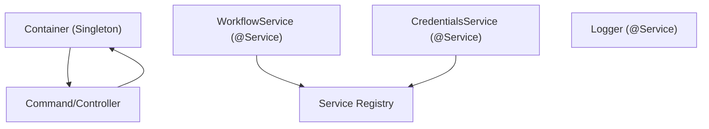
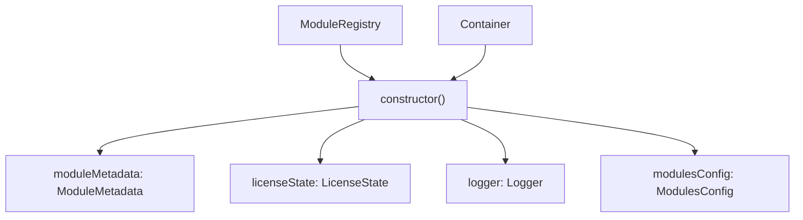
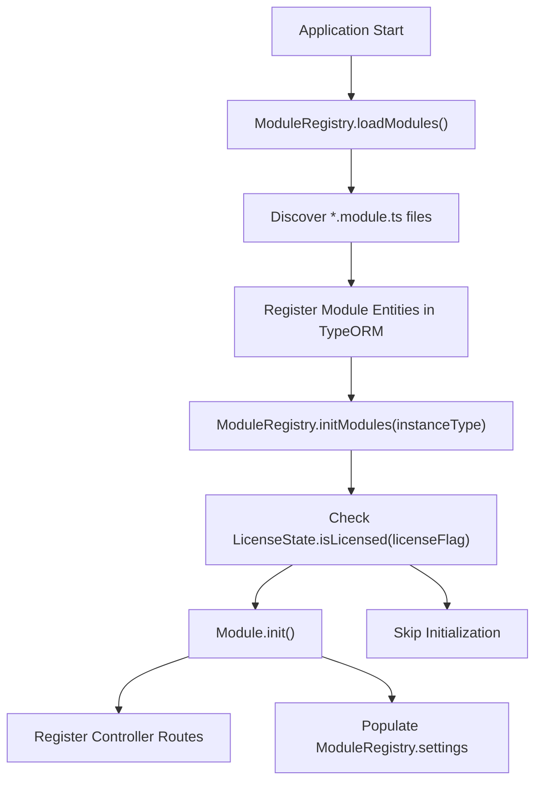
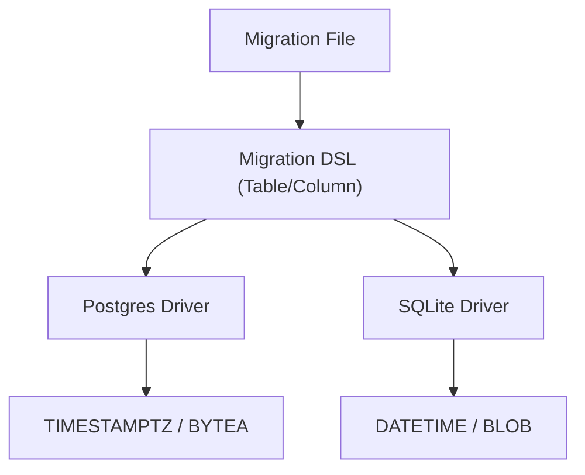

# Architecture Patterns and Best Practices

Relevant source files

-   [packages/@n8n/api-types/src/dto/secrets-provider/create-secrets-provider-connection.dto.ts](https://github.com/n8n-io/n8n/blob/88f170b9/packages/@n8n/api-types/src/dto/secrets-provider/create-secrets-provider-connection.dto.ts)
-   [packages/@n8n/backend-common/src/modules/\_\_tests\_\_/module-registry.test.ts](https://github.com/n8n-io/n8n/blob/88f170b9/packages/@n8n/backend-common/src/modules/__tests__/module-registry.test.ts)
-   [packages/@n8n/backend-common/src/modules/module-registry.ts](https://github.com/n8n-io/n8n/blob/88f170b9/packages/@n8n/backend-common/src/modules/module-registry.ts)
-   [packages/@n8n/backend-common/src/modules/modules.config.ts](https://github.com/n8n-io/n8n/blob/88f170b9/packages/@n8n/backend-common/src/modules/modules.config.ts)
-   [packages/@n8n/db/src/entities/index.ts](https://github.com/n8n-io/n8n/blob/88f170b9/packages/@n8n/db/src/entities/index.ts)
-   [packages/@n8n/db/src/entities/project-secrets-provider-access.ts](https://github.com/n8n-io/n8n/blob/88f170b9/packages/@n8n/db/src/entities/project-secrets-provider-access.ts)
-   [packages/@n8n/db/src/entities/project.ts](https://github.com/n8n-io/n8n/blob/88f170b9/packages/@n8n/db/src/entities/project.ts)
-   [packages/@n8n/db/src/entities/role-mapping-rule.ts](https://github.com/n8n-io/n8n/blob/88f170b9/packages/@n8n/db/src/entities/role-mapping-rule.ts)
-   [packages/@n8n/db/src/entities/role.ts](https://github.com/n8n-io/n8n/blob/88f170b9/packages/@n8n/db/src/entities/role.ts)
-   [packages/@n8n/db/src/entities/secrets-provider-connection.ts](https://github.com/n8n-io/n8n/blob/88f170b9/packages/@n8n/db/src/entities/secrets-provider-connection.ts)
-   [packages/@n8n/db/src/entities/workflow-publish-history.ts](https://github.com/n8n-io/n8n/blob/88f170b9/packages/@n8n/db/src/entities/workflow-publish-history.ts)
-   [packages/@n8n/db/src/migrations/common/1763716655000-CreateBinaryDataTable.ts](https://github.com/n8n-io/n8n/blob/88f170b9/packages/@n8n/db/src/migrations/common/1763716655000-CreateBinaryDataTable.ts)
-   [packages/@n8n/db/src/migrations/common/1764167920585-CreateWorkflowPublishHistoryTable.ts](https://github.com/n8n-io/n8n/blob/88f170b9/packages/@n8n/db/src/migrations/common/1764167920585-CreateWorkflowPublishHistoryTable.ts)
-   [packages/@n8n/db/src/migrations/common/1765448186933-BackfillMissingWorkflowHistoryRecords.ts](https://github.com/n8n-io/n8n/blob/88f170b9/packages/@n8n/db/src/migrations/common/1765448186933-BackfillMissingWorkflowHistoryRecords.ts)
-   [packages/@n8n/db/src/migrations/common/1769000000000-AddPublishedVersionIdToWorkflowDependency.ts](https://github.com/n8n-io/n8n/blob/88f170b9/packages/@n8n/db/src/migrations/common/1769000000000-AddPublishedVersionIdToWorkflowDependency.ts)
-   [packages/@n8n/db/src/migrations/common/1772619247761-AddRoleColumnToProjectSecretsProviderAccess.ts](https://github.com/n8n-io/n8n/blob/88f170b9/packages/@n8n/db/src/migrations/common/1772619247761-AddRoleColumnToProjectSecretsProviderAccess.ts)
-   [packages/@n8n/db/src/migrations/common/1772800000000-CreateRoleMappingRuleTable.ts](https://github.com/n8n-io/n8n/blob/88f170b9/packages/@n8n/db/src/migrations/common/1772800000000-CreateRoleMappingRuleTable.ts)
-   [packages/@n8n/db/src/migrations/dsl/\_\_tests\_\_/enum-check.test.ts](https://github.com/n8n-io/n8n/blob/88f170b9/packages/@n8n/db/src/migrations/dsl/__tests__/enum-check.test.ts)
-   [packages/@n8n/db/src/migrations/dsl/column.ts](https://github.com/n8n-io/n8n/blob/88f170b9/packages/@n8n/db/src/migrations/dsl/column.ts)
-   [packages/@n8n/db/src/migrations/dsl/table.ts](https://github.com/n8n-io/n8n/blob/88f170b9/packages/@n8n/db/src/migrations/dsl/table.ts)
-   [packages/@n8n/db/src/migrations/postgresdb/index.ts](https://github.com/n8n-io/n8n/blob/88f170b9/packages/@n8n/db/src/migrations/postgresdb/index.ts)
-   [packages/@n8n/db/src/migrations/sqlite/index.ts](https://github.com/n8n-io/n8n/blob/88f170b9/packages/@n8n/db/src/migrations/sqlite/index.ts)
-   [packages/@n8n/decorators/src/\_\_tests\_\_/redactable.test.ts](https://github.com/n8n-io/n8n/blob/88f170b9/packages/@n8n/decorators/src/__tests__/redactable.test.ts)
-   [packages/@n8n/decorators/src/controller/\_\_tests\_\_/args.test.ts](https://github.com/n8n-io/n8n/blob/88f170b9/packages/@n8n/decorators/src/controller/__tests__/args.test.ts)
-   [packages/@n8n/decorators/src/controller/\_\_tests\_\_/license.test.ts](https://github.com/n8n-io/n8n/blob/88f170b9/packages/@n8n/decorators/src/controller/__tests__/license.test.ts)
-   [packages/@n8n/decorators/src/controller/\_\_tests\_\_/scoped.test.ts](https://github.com/n8n-io/n8n/blob/88f170b9/packages/@n8n/decorators/src/controller/__tests__/scoped.test.ts)
-   [packages/@n8n/decorators/src/execution-lifecycle/\_\_tests\_\_/on-lifecycle-event.test.ts](https://github.com/n8n-io/n8n/blob/88f170b9/packages/@n8n/decorators/src/execution-lifecycle/__tests__/on-lifecycle-event.test.ts)
-   [packages/@n8n/decorators/src/execution-lifecycle/index.ts](https://github.com/n8n-io/n8n/blob/88f170b9/packages/@n8n/decorators/src/execution-lifecycle/index.ts)
-   [packages/@n8n/decorators/src/execution-lifecycle/lifecycle-metadata.ts](https://github.com/n8n-io/n8n/blob/88f170b9/packages/@n8n/decorators/src/execution-lifecycle/lifecycle-metadata.ts)
-   [packages/@n8n/decorators/src/module/\_\_tests\_\_/module.test.ts](https://github.com/n8n-io/n8n/blob/88f170b9/packages/@n8n/decorators/src/module/__tests__/module.test.ts)
-   [packages/@n8n/decorators/src/module/index.ts](https://github.com/n8n-io/n8n/blob/88f170b9/packages/@n8n/decorators/src/module/index.ts)
-   [packages/@n8n/decorators/src/module/module-metadata.ts](https://github.com/n8n-io/n8n/blob/88f170b9/packages/@n8n/decorators/src/module/module-metadata.ts)
-   [packages/@n8n/decorators/src/module/module.ts](https://github.com/n8n-io/n8n/blob/88f170b9/packages/@n8n/decorators/src/module/module.ts)
-   [packages/cli/src/commands/db/\_\_tests\_\_/revert.test.ts](https://github.com/n8n-io/n8n/blob/88f170b9/packages/cli/src/commands/db/__tests__/revert.test.ts)
-   [packages/cli/src/commands/db/revert.ts](https://github.com/n8n-io/n8n/blob/88f170b9/packages/cli/src/commands/db/revert.ts)
-   [packages/cli/src/modules/community-packages/community-packages.module.ts](https://github.com/n8n-io/n8n/blob/88f170b9/packages/cli/src/modules/community-packages/community-packages.module.ts)
-   [packages/cli/src/modules/external-secrets.ee/external-secrets.module.ts](https://github.com/n8n-io/n8n/blob/88f170b9/packages/cli/src/modules/external-secrets.ee/external-secrets.module.ts)
-   [packages/cli/src/modules/otel/README.md](https://github.com/n8n-io/n8n/blob/88f170b9/packages/cli/src/modules/otel/README.md?plain=1)
-   [packages/cli/src/modules/otel/\_\_tests\_\_/otel-test-provider.ts](https://github.com/n8n-io/n8n/blob/88f170b9/packages/cli/src/modules/otel/__tests__/otel-test-provider.ts)
-   [packages/cli/src/modules/otel/\_\_tests\_\_/otel-workflow-tracing.integration.test.ts](https://github.com/n8n-io/n8n/blob/88f170b9/packages/cli/src/modules/otel/__tests__/otel-workflow-tracing.integration.test.ts)
-   [packages/cli/src/modules/otel/\_\_tests\_\_/span-registry.test.ts](https://github.com/n8n-io/n8n/blob/88f170b9/packages/cli/src/modules/otel/__tests__/span-registry.test.ts)
-   [packages/cli/src/modules/otel/handlers/interfaces.ts](https://github.com/n8n-io/n8n/blob/88f170b9/packages/cli/src/modules/otel/handlers/interfaces.ts)
-   [packages/cli/src/modules/otel/handlers/workflow-end.handler.ts](https://github.com/n8n-io/n8n/blob/88f170b9/packages/cli/src/modules/otel/handlers/workflow-end.handler.ts)
-   [packages/cli/src/modules/otel/handlers/workflow-start.handler.ts](https://github.com/n8n-io/n8n/blob/88f170b9/packages/cli/src/modules/otel/handlers/workflow-start.handler.ts)
-   [packages/cli/src/services/\_\_tests\_\_/role-cache.service.test.ts](https://github.com/n8n-io/n8n/blob/88f170b9/packages/cli/src/services/__tests__/role-cache.service.test.ts)
-   [packages/cli/test/integration/shared/db/workflow-publish-history.ts](https://github.com/n8n-io/n8n/blob/88f170b9/packages/cli/test/integration/shared/db/workflow-publish-history.ts)
-   [packages/cli/test/migration/1772619247761-add-role-column-to-project-secrets-provider-access.test.ts](https://github.com/n8n-io/n8n/blob/88f170b9/packages/cli/test/migration/1772619247761-add-role-column-to-project-secrets-provider-access.test.ts)
-   [packages/testing/playwright/workflows/Switch\_node\_with\_null\_connection.json](https://github.com/n8n-io/n8n/blob/88f170b9/packages/testing/playwright/workflows/Switch_node_with_null_connection.json)

This document explains the architectural patterns used throughout the n8n codebase: dependency injection with `@n8n/di`, decorators for controllers and configuration, the service and repository patterns for data access, and the backend module system.

## Dependency Injection with @n8n/di

n8n uses the `@n8n/di` package for dependency injection, enabling loose coupling between components and simplifying testing. The system is built around the `Container` singleton and the `@Service()` decorator.

### Service Registration and Resolution

Services are registered using the `@Service()` decorator, which automatically makes them available through the dependency injection container.

**Service Registration Flow** Sources: [packages/@n8n/backend-common/src/modules/module-registry.ts4-15](https://github.com/n8n-io/n8n/blob/88f170b9/packages/@n8n/backend-common/src/modules/module-registry.ts#L4-L15) [packages/cli/src/commands/db/revert.ts5-13](https://github.com/n8n-io/n8n/blob/88f170b9/packages/cli/src/commands/db/revert.ts#L5-L13)

### Constructor Injection Pattern

Services declare dependencies in their constructor, and the container automatically resolves and injects them. This is the primary way components access each other.

**Constructor Injection in ModuleRegistry** Sources: [packages/@n8n/backend-common/src/modules/module-registry.ts25-30](https://github.com/n8n-io/n8n/blob/88f170b9/packages/@n8n/backend-common/src/modules/module-registry.ts#L25-L30)

## Backend Module System

n8n implements a modular architecture for backend features (like `insights`, `external-secrets`, or `chat-hub`). This system allows for conditional loading based on licenses and instance types.

### Module Definition and Registration

Modules are defined using the `@BackendModule` decorator from `@n8n/decorators`. They implement the `ModuleInterface` to hook into the application lifecycle.

| Feature | Description | Implementation |
| --- | --- | --- |
| **Lifecycle Hooks** | `init()`, `shutdown()`, `commands()` | `ModuleInterface` |
| **Data Entities** | Register TypeORM entities specific to the module | `entities()` method |
| **Settings** | Provide configuration to the frontend | `settings()` method |
| **Context** | Inject data into workflow execution | `context()` method |

**Module Interface Definition** Sources: [packages/@n8n/decorators/src/module/module.ts35-87](https://github.com/n8n-io/n8n/blob/88f170b9/packages/@n8n/decorators/src/module/module.ts#L35-L87) [packages/@n8n/decorators/src/module/module.ts107-118](https://github.com/n8n-io/n8n/blob/88f170b9/packages/@n8n/decorators/src/module/module.ts#L107-L118)

### Module Loading Process

The `ModuleRegistry` manages the lifecycle of all backend modules. It handles discovery, licensing checks, and initialization.

**Module Initialization Flow** Sources: [packages/@n8n/backend-common/src/modules/module-registry.ts76-115](https://github.com/n8n-io/n8n/blob/88f170b9/packages/@n8n/backend-common/src/modules/module-registry.ts#L76-L115) [packages/@n8n/backend-common/src/modules/module-registry.ts125-155](https://github.com/n8n-io/n8n/blob/88f170b9/packages/@n8n/backend-common/src/modules/module-registry.ts#L125-L155)

### Example: External Secrets Module

The External Secrets module demonstrates how a module encapsulates its own controllers, managers, and settings.

Sources: [packages/cli/src/modules/external-secrets.ee/external-secrets.module.ts5-51](https://github.com/n8n-io/n8n/blob/88f170b9/packages/cli/src/modules/external-secrets.ee/external-secrets.module.ts#L5-L51)

## Repository Pattern and Data Access

n8n uses TypeORM for database interactions. To maintain portability between PostgreSQL and SQLite, it uses a Domain Specific Language (DSL) for migrations and a repository pattern for data access.

### Database Entities

Entities represent the database schema. Core entities are defined in `@n8n/db`, while module-specific entities are registered dynamically.

Sources: [packages/@n8n/db/src/entities/index.ts93-133](https://github.com/n8n-io/n8n/blob/88f170b9/packages/@n8n/db/src/entities/index.ts#L93-L133) [packages/@n8n/db/src/entities/project.ts20-58](https://github.com/n8n-io/n8n/blob/88f170b9/packages/@n8n/db/src/entities/project.ts#L20-L58)

### Migration DSL

Instead of raw SQL, n8n uses a `Table` and `Column` abstraction to ensure migrations work across different database drivers.

**Migration DSL Mapping** Sources: [packages/@n8n/db/src/migrations/dsl/column.ts168-216](https://github.com/n8n-io/n8n/blob/88f170b9/packages/@n8n/db/src/migrations/dsl/column.ts#L168-L216) [packages/@n8n/db/src/migrations/dsl/table.ts110-137](https://github.com/n8n-io/n8n/blob/88f170b9/packages/@n8n/db/src/migrations/dsl/table.ts#L110-L137)

## Decorators Package (@n8n/decorators)

The `@n8n/decorators` package provides a set of custom decorators that drive the metadata-heavy architecture of n8n.

### Key Decorators

| Decorator | Target | Purpose |
| --- | --- | --- |
| `@BackendModule` | Class | Registers a backend module with name, license flags, and instance types. |
| `@Command` | Class | Registers a CLI command (e.g., `db:revert`). |
| `@OnShutdown` | Method | Marks a method to be called during module shutdown. |
| `@RestController` | Class | Registers an Express controller with a base path. |
| `@Get`, `@Post`, etc. | Method | Maps HTTP verbs to controller methods. |

**Decorator Implementations** Sources: [packages/@n8n/decorators/src/module/module.ts107-118](https://github.com/n8n-io/n8n/blob/88f170b9/packages/@n8n/decorators/src/module/module.ts#L107-L118) [packages/cli/src/commands/db/revert.ts62-66](https://github.com/n8n-io/n8n/blob/88f170b9/packages/cli/src/commands/db/revert.ts#L62-L66) [packages/cli/src/modules/external-secrets.ee/external-secrets.module.ts45-46](https://github.com/n8n-io/n8n/blob/88f170b9/packages/cli/src/modules/external-secrets.ee/external-secrets.module.ts#L45-L46)

## Code Organization Principles

1.  **Package Separation**: Core logic resides in `packages/core` and `packages/workflow`, while infrastructure (DB, DI, Config) is split into specialized `@n8n/*` packages.
2.  **Service-Controller Split**: Controllers handle HTTP/CLI request parsing and response formatting, delegating all business logic to `@Service()` classes.
3.  **Dependency Inversion**: High-level modules do not depend on low-level modules; both depend on abstractions (interfaces) resolved via the DI `Container`.
4.  **Graceful Degradation**: Modules check `LicenseState` before initialization, ensuring the system remains functional even if enterprise features are unavailable.

Sources: [packages/@n8n/backend-common/src/modules/module-registry.ts129-132](https://github.com/n8n-io/n8n/blob/88f170b9/packages/@n8n/backend-common/src/modules/module-registry.ts#L129-L132) [packages/cli/src/commands/db/revert.ts69-89](https://github.com/n8n-io/n8n/blob/88f170b9/packages/cli/src/commands/db/revert.ts#L69-L89)
