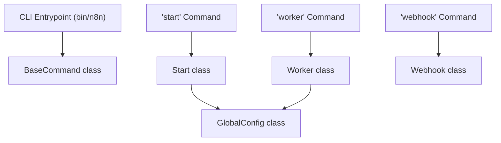

# Glossary

Relevant source files

-   [CHANGELOG.md](https://github.com/n8n-io/n8n/blob/88f170b9/CHANGELOG.md?plain=1)
-   [package.json](https://github.com/n8n-io/n8n/blob/88f170b9/package.json)
-   [packages/@n8n/api-types/package.json](https://github.com/n8n-io/n8n/blob/88f170b9/packages/@n8n/api-types/package.json)
-   [packages/@n8n/api-types/src/chat-hub.ts](https://github.com/n8n-io/n8n/blob/88f170b9/packages/@n8n/api-types/src/chat-hub.ts)
-   [packages/@n8n/api-types/src/frontend-settings.ts](https://github.com/n8n-io/n8n/blob/88f170b9/packages/@n8n/api-types/src/frontend-settings.ts)
-   [packages/@n8n/api-types/src/index.ts](https://github.com/n8n-io/n8n/blob/88f170b9/packages/@n8n/api-types/src/index.ts)
-   [packages/@n8n/api-types/src/push/collaboration.ts](https://github.com/n8n-io/n8n/blob/88f170b9/packages/@n8n/api-types/src/push/collaboration.ts)
-   [packages/@n8n/backend-common/src/license-state.ts](https://github.com/n8n-io/n8n/blob/88f170b9/packages/@n8n/backend-common/src/license-state.ts)
-   [packages/@n8n/backend-common/src/modules/\_\_tests\_\_/module-registry.test.ts](https://github.com/n8n-io/n8n/blob/88f170b9/packages/@n8n/backend-common/src/modules/__tests__/module-registry.test.ts)
-   [packages/@n8n/backend-common/src/modules/module-registry.ts](https://github.com/n8n-io/n8n/blob/88f170b9/packages/@n8n/backend-common/src/modules/module-registry.ts)
-   [packages/@n8n/backend-common/src/modules/modules.config.ts](https://github.com/n8n-io/n8n/blob/88f170b9/packages/@n8n/backend-common/src/modules/modules.config.ts)
-   [packages/@n8n/config/package.json](https://github.com/n8n-io/n8n/blob/88f170b9/packages/@n8n/config/package.json)
-   [packages/@n8n/config/src/decorators.ts](https://github.com/n8n-io/n8n/blob/88f170b9/packages/@n8n/config/src/decorators.ts)
-   [packages/@n8n/config/src/index.ts](https://github.com/n8n-io/n8n/blob/88f170b9/packages/@n8n/config/src/index.ts)
-   [packages/@n8n/config/test/config.test.ts](https://github.com/n8n-io/n8n/blob/88f170b9/packages/@n8n/config/test/config.test.ts)
-   [packages/@n8n/config/test/decorators.test.ts](https://github.com/n8n-io/n8n/blob/88f170b9/packages/@n8n/config/test/decorators.test.ts)
-   [packages/@n8n/config/test/string-normalization.test.ts](https://github.com/n8n-io/n8n/blob/88f170b9/packages/@n8n/config/test/string-normalization.test.ts)
-   [packages/@n8n/constants/src/index.ts](https://github.com/n8n-io/n8n/blob/88f170b9/packages/@n8n/constants/src/index.ts)
-   [packages/@n8n/decorators/src/\_\_tests\_\_/redactable.test.ts](https://github.com/n8n-io/n8n/blob/88f170b9/packages/@n8n/decorators/src/__tests__/redactable.test.ts)
-   [packages/@n8n/decorators/src/controller/\_\_tests\_\_/args.test.ts](https://github.com/n8n-io/n8n/blob/88f170b9/packages/@n8n/decorators/src/controller/__tests__/args.test.ts)
-   [packages/@n8n/decorators/src/controller/\_\_tests\_\_/license.test.ts](https://github.com/n8n-io/n8n/blob/88f170b9/packages/@n8n/decorators/src/controller/__tests__/license.test.ts)
-   [packages/@n8n/decorators/src/controller/\_\_tests\_\_/scoped.test.ts](https://github.com/n8n-io/n8n/blob/88f170b9/packages/@n8n/decorators/src/controller/__tests__/scoped.test.ts)
-   [packages/@n8n/decorators/src/execution-lifecycle/\_\_tests\_\_/on-lifecycle-event.test.ts](https://github.com/n8n-io/n8n/blob/88f170b9/packages/@n8n/decorators/src/execution-lifecycle/__tests__/on-lifecycle-event.test.ts)
-   [packages/@n8n/decorators/src/execution-lifecycle/index.ts](https://github.com/n8n-io/n8n/blob/88f170b9/packages/@n8n/decorators/src/execution-lifecycle/index.ts)
-   [packages/@n8n/decorators/src/execution-lifecycle/lifecycle-metadata.ts](https://github.com/n8n-io/n8n/blob/88f170b9/packages/@n8n/decorators/src/execution-lifecycle/lifecycle-metadata.ts)
-   [packages/@n8n/decorators/src/module/\_\_tests\_\_/module.test.ts](https://github.com/n8n-io/n8n/blob/88f170b9/packages/@n8n/decorators/src/module/__tests__/module.test.ts)
-   [packages/@n8n/decorators/src/module/index.ts](https://github.com/n8n-io/n8n/blob/88f170b9/packages/@n8n/decorators/src/module/index.ts)
-   [packages/@n8n/decorators/src/module/module-metadata.ts](https://github.com/n8n-io/n8n/blob/88f170b9/packages/@n8n/decorators/src/module/module-metadata.ts)
-   [packages/@n8n/decorators/src/module/module.ts](https://github.com/n8n-io/n8n/blob/88f170b9/packages/@n8n/decorators/src/module/module.ts)
-   [packages/@n8n/nodes-langchain/package.json](https://github.com/n8n-io/n8n/blob/88f170b9/packages/@n8n/nodes-langchain/package.json)
-   [packages/@n8n/task-runner/package.json](https://github.com/n8n-io/n8n/blob/88f170b9/packages/@n8n/task-runner/package.json)
-   [packages/cli/package.json](https://github.com/n8n-io/n8n/blob/88f170b9/packages/cli/package.json)
-   [packages/cli/src/\_\_tests\_\_/license.test.ts](https://github.com/n8n-io/n8n/blob/88f170b9/packages/cli/src/__tests__/license.test.ts)
-   [packages/cli/src/commands/base-command.ts](https://github.com/n8n-io/n8n/blob/88f170b9/packages/cli/src/commands/base-command.ts)
-   [packages/cli/src/commands/start.ts](https://github.com/n8n-io/n8n/blob/88f170b9/packages/cli/src/commands/start.ts)
-   [packages/cli/src/commands/webhook.ts](https://github.com/n8n-io/n8n/blob/88f170b9/packages/cli/src/commands/webhook.ts)
-   [packages/cli/src/commands/worker.ts](https://github.com/n8n-io/n8n/blob/88f170b9/packages/cli/src/commands/worker.ts)
-   [packages/cli/src/config/index.ts](https://github.com/n8n-io/n8n/blob/88f170b9/packages/cli/src/config/index.ts)
-   [packages/cli/src/config/schema.ts](https://github.com/n8n-io/n8n/blob/88f170b9/packages/cli/src/config/schema.ts)
-   [packages/cli/src/constants.ts](https://github.com/n8n-io/n8n/blob/88f170b9/packages/cli/src/constants.ts)
-   [packages/cli/src/controllers/e2e.controller.ts](https://github.com/n8n-io/n8n/blob/88f170b9/packages/cli/src/controllers/e2e.controller.ts)
-   [packages/cli/src/errors/response-errors/locked.error.ts](https://github.com/n8n-io/n8n/blob/88f170b9/packages/cli/src/errors/response-errors/locked.error.ts)
-   [packages/cli/src/errors/response-errors/scope-forbidden.error.ts](https://github.com/n8n-io/n8n/blob/88f170b9/packages/cli/src/errors/response-errors/scope-forbidden.error.ts)
-   [packages/cli/src/executions/execution-redaction.ts](https://github.com/n8n-io/n8n/blob/88f170b9/packages/cli/src/executions/execution-redaction.ts)
-   [packages/cli/src/license.ts](https://github.com/n8n-io/n8n/blob/88f170b9/packages/cli/src/license.ts)
-   [packages/cli/src/modules/chat-hub/\_\_tests\_\_/chat-hub.service.integration.test.ts](https://github.com/n8n-io/n8n/blob/88f170b9/packages/cli/src/modules/chat-hub/__tests__/chat-hub.service.integration.test.ts)
-   [packages/cli/src/modules/chat-hub/chat-hub-agent.repository.ts](https://github.com/n8n-io/n8n/blob/88f170b9/packages/cli/src/modules/chat-hub/chat-hub-agent.repository.ts)
-   [packages/cli/src/modules/chat-hub/chat-hub-message.entity.ts](https://github.com/n8n-io/n8n/blob/88f170b9/packages/cli/src/modules/chat-hub/chat-hub-message.entity.ts)
-   [packages/cli/src/modules/chat-hub/chat-hub-session.entity.ts](https://github.com/n8n-io/n8n/blob/88f170b9/packages/cli/src/modules/chat-hub/chat-hub-session.entity.ts)
-   [packages/cli/src/modules/chat-hub/chat-hub-workflow.service.ts](https://github.com/n8n-io/n8n/blob/88f170b9/packages/cli/src/modules/chat-hub/chat-hub-workflow.service.ts)
-   [packages/cli/src/modules/chat-hub/chat-hub.constants.ts](https://github.com/n8n-io/n8n/blob/88f170b9/packages/cli/src/modules/chat-hub/chat-hub.constants.ts)
-   [packages/cli/src/modules/chat-hub/chat-hub.controller.ts](https://github.com/n8n-io/n8n/blob/88f170b9/packages/cli/src/modules/chat-hub/chat-hub.controller.ts)
-   [packages/cli/src/modules/chat-hub/chat-hub.service.ts](https://github.com/n8n-io/n8n/blob/88f170b9/packages/cli/src/modules/chat-hub/chat-hub.service.ts)
-   [packages/cli/src/modules/chat-hub/chat-hub.types.ts](https://github.com/n8n-io/n8n/blob/88f170b9/packages/cli/src/modules/chat-hub/chat-hub.types.ts)
-   [packages/cli/src/modules/chat-hub/chat-message.repository.ts](https://github.com/n8n-io/n8n/blob/88f170b9/packages/cli/src/modules/chat-hub/chat-message.repository.ts)
-   [packages/cli/src/modules/chat-hub/chat-session.repository.ts](https://github.com/n8n-io/n8n/blob/88f170b9/packages/cli/src/modules/chat-hub/chat-session.repository.ts)
-   [packages/cli/src/modules/chat-hub/context-limits.ts](https://github.com/n8n-io/n8n/blob/88f170b9/packages/cli/src/modules/chat-hub/context-limits.ts)
-   [packages/cli/src/modules/community-packages/community-packages.module.ts](https://github.com/n8n-io/n8n/blob/88f170b9/packages/cli/src/modules/community-packages/community-packages.module.ts)
-   [packages/cli/src/modules/external-secrets.ee/external-secrets.module.ts](https://github.com/n8n-io/n8n/blob/88f170b9/packages/cli/src/modules/external-secrets.ee/external-secrets.module.ts)
-   [packages/cli/src/modules/otel/README.md](https://github.com/n8n-io/n8n/blob/88f170b9/packages/cli/src/modules/otel/README.md?plain=1)
-   [packages/cli/src/modules/otel/\_\_tests\_\_/otel-test-provider.ts](https://github.com/n8n-io/n8n/blob/88f170b9/packages/cli/src/modules/otel/__tests__/otel-test-provider.ts)
-   [packages/cli/src/modules/otel/\_\_tests\_\_/otel-workflow-tracing.integration.test.ts](https://github.com/n8n-io/n8n/blob/88f170b9/packages/cli/src/modules/otel/__tests__/otel-workflow-tracing.integration.test.ts)
-   [packages/cli/src/modules/otel/\_\_tests\_\_/span-registry.test.ts](https://github.com/n8n-io/n8n/blob/88f170b9/packages/cli/src/modules/otel/__tests__/span-registry.test.ts)
-   [packages/cli/src/modules/otel/handlers/interfaces.ts](https://github.com/n8n-io/n8n/blob/88f170b9/packages/cli/src/modules/otel/handlers/interfaces.ts)
-   [packages/cli/src/modules/otel/handlers/workflow-end.handler.ts](https://github.com/n8n-io/n8n/blob/88f170b9/packages/cli/src/modules/otel/handlers/workflow-end.handler.ts)
-   [packages/cli/src/modules/otel/handlers/workflow-start.handler.ts](https://github.com/n8n-io/n8n/blob/88f170b9/packages/cli/src/modules/otel/handlers/workflow-start.handler.ts)
-   [packages/cli/src/modules/redaction/executions/\_\_tests\_\_/execution-redaction.service.test.ts](https://github.com/n8n-io/n8n/blob/88f170b9/packages/cli/src/modules/redaction/executions/__tests__/execution-redaction.service.test.ts)
-   [packages/cli/src/modules/redaction/executions/execution-redaction.interfaces.ts](https://github.com/n8n-io/n8n/blob/88f170b9/packages/cli/src/modules/redaction/executions/execution-redaction.interfaces.ts)
-   [packages/cli/src/modules/redaction/executions/execution-redaction.service.ts](https://github.com/n8n-io/n8n/blob/88f170b9/packages/cli/src/modules/redaction/executions/execution-redaction.service.ts)
-   [packages/cli/src/modules/redaction/executions/strategies/\_\_tests\_\_/full-item-redaction.strategy.test.ts](https://github.com/n8n-io/n8n/blob/88f170b9/packages/cli/src/modules/redaction/executions/strategies/__tests__/full-item-redaction.strategy.test.ts)
-   [packages/cli/src/modules/redaction/executions/strategies/\_\_tests\_\_/node-defined-field-redaction.strategy.test.ts](https://github.com/n8n-io/n8n/blob/88f170b9/packages/cli/src/modules/redaction/executions/strategies/__tests__/node-defined-field-redaction.strategy.test.ts)
-   [packages/cli/src/modules/redaction/executions/strategies/full-item-redaction.strategy.ts](https://github.com/n8n-io/n8n/blob/88f170b9/packages/cli/src/modules/redaction/executions/strategies/full-item-redaction.strategy.ts)
-   [packages/cli/src/modules/redaction/executions/strategies/node-defined-field-redaction.strategy.ts](https://github.com/n8n-io/n8n/blob/88f170b9/packages/cli/src/modules/redaction/executions/strategies/node-defined-field-redaction.strategy.ts)
-   [packages/cli/src/services/\_\_tests\_\_/frontend.service.test.ts](https://github.com/n8n-io/n8n/blob/88f170b9/packages/cli/src/services/__tests__/frontend.service.test.ts)
-   [packages/cli/src/services/frontend.service.ts](https://github.com/n8n-io/n8n/blob/88f170b9/packages/cli/src/services/frontend.service.ts)
-   [packages/cli/test/integration/commands/worker.cmd.test.ts](https://github.com/n8n-io/n8n/blob/88f170b9/packages/cli/test/integration/commands/worker.cmd.test.ts)
-   [packages/cli/test/integration/execution-redaction.test.ts](https://github.com/n8n-io/n8n/blob/88f170b9/packages/cli/test/integration/execution-redaction.test.ts)
-   [packages/core/package.json](https://github.com/n8n-io/n8n/blob/88f170b9/packages/core/package.json)
-   [packages/frontend/@n8n/design-system/package.json](https://github.com/n8n-io/n8n/blob/88f170b9/packages/frontend/@n8n/design-system/package.json)
-   [packages/frontend/@n8n/design-system/src/components/CanvasCollaborationPill/CanvasCollaborationPill.vue](https://github.com/n8n-io/n8n/blob/88f170b9/packages/frontend/@n8n/design-system/src/components/CanvasCollaborationPill/CanvasCollaborationPill.vue)
-   [packages/frontend/@n8n/design-system/src/components/N8nLogo/Logo.vue](https://github.com/n8n-io/n8n/blob/88f170b9/packages/frontend/@n8n/design-system/src/components/N8nLogo/Logo.vue)
-   [packages/frontend/@n8n/stores/src/useRootStore.ts](https://github.com/n8n-io/n8n/blob/88f170b9/packages/frontend/@n8n/stores/src/useRootStore.ts)
-   [packages/frontend/editor-ui/package.json](https://github.com/n8n-io/n8n/blob/88f170b9/packages/frontend/editor-ui/package.json)
-   [packages/frontend/editor-ui/src/\_\_tests\_\_/defaults.ts](https://github.com/n8n-io/n8n/blob/88f170b9/packages/frontend/editor-ui/src/__tests__/defaults.ts)
-   [packages/frontend/editor-ui/src/app/components/MainHeader/TabBar.vue](https://github.com/n8n-io/n8n/blob/88f170b9/packages/frontend/editor-ui/src/app/components/MainHeader/TabBar.vue)
-   [packages/frontend/editor-ui/src/app/stores/settings.store.test.ts](https://github.com/n8n-io/n8n/blob/88f170b9/packages/frontend/editor-ui/src/app/stores/settings.store.test.ts)
-   [packages/frontend/editor-ui/src/app/stores/settings.store.ts](https://github.com/n8n-io/n8n/blob/88f170b9/packages/frontend/editor-ui/src/app/stores/settings.store.ts)
-   [packages/frontend/editor-ui/src/features/ai/chatHub/ChatView.vue](https://github.com/n8n-io/n8n/blob/88f170b9/packages/frontend/editor-ui/src/features/ai/chatHub/ChatView.vue)
-   [packages/frontend/editor-ui/src/features/ai/chatHub/chat.api.ts](https://github.com/n8n-io/n8n/blob/88f170b9/packages/frontend/editor-ui/src/features/ai/chatHub/chat.api.ts)
-   [packages/frontend/editor-ui/src/features/ai/chatHub/chat.store.ts](https://github.com/n8n-io/n8n/blob/88f170b9/packages/frontend/editor-ui/src/features/ai/chatHub/chat.store.ts)
-   [packages/frontend/editor-ui/src/features/ai/chatHub/chat.types.ts](https://github.com/n8n-io/n8n/blob/88f170b9/packages/frontend/editor-ui/src/features/ai/chatHub/chat.types.ts)
-   [packages/frontend/editor-ui/src/features/ai/chatHub/chat.utils.ts](https://github.com/n8n-io/n8n/blob/88f170b9/packages/frontend/editor-ui/src/features/ai/chatHub/chat.utils.ts)
-   [packages/frontend/editor-ui/src/features/ai/chatHub/components/AgentEditorModal.vue](https://github.com/n8n-io/n8n/blob/88f170b9/packages/frontend/editor-ui/src/features/ai/chatHub/components/AgentEditorModal.vue)
-   [packages/frontend/editor-ui/src/features/ai/chatHub/components/ChatAgentCard.vue](https://github.com/n8n-io/n8n/blob/88f170b9/packages/frontend/editor-ui/src/features/ai/chatHub/components/ChatAgentCard.vue)
-   [packages/frontend/editor-ui/src/features/ai/chatHub/components/ChatConversationHeader.vue](https://github.com/n8n-io/n8n/blob/88f170b9/packages/frontend/editor-ui/src/features/ai/chatHub/components/ChatConversationHeader.vue)
-   [packages/frontend/editor-ui/src/features/ai/chatHub/components/ChatMessage.vue](https://github.com/n8n-io/n8n/blob/88f170b9/packages/frontend/editor-ui/src/features/ai/chatHub/components/ChatMessage.vue)
-   [packages/frontend/editor-ui/src/features/ai/chatHub/components/ChatPrompt.vue](https://github.com/n8n-io/n8n/blob/88f170b9/packages/frontend/editor-ui/src/features/ai/chatHub/components/ChatPrompt.vue)
-   [packages/frontend/editor-ui/src/features/ai/chatHub/components/ChatSessionMenuItem.vue](https://github.com/n8n-io/n8n/blob/88f170b9/packages/frontend/editor-ui/src/features/ai/chatHub/components/ChatSessionMenuItem.vue)
-   [packages/frontend/editor-ui/src/features/ai/chatHub/components/ChatSidebarContent.vue](https://github.com/n8n-io/n8n/blob/88f170b9/packages/frontend/editor-ui/src/features/ai/chatHub/components/ChatSidebarContent.vue)
-   [packages/frontend/editor-ui/src/features/ai/chatHub/components/CredentialSelectorModal.vue](https://github.com/n8n-io/n8n/blob/88f170b9/packages/frontend/editor-ui/src/features/ai/chatHub/components/CredentialSelectorModal.vue)
-   [packages/frontend/editor-ui/src/features/ai/chatHub/components/ModelSelector.vue](https://github.com/n8n-io/n8n/blob/88f170b9/packages/frontend/editor-ui/src/features/ai/chatHub/components/ModelSelector.vue)
-   [packages/frontend/editor-ui/src/features/ai/chatHub/constants.ts](https://github.com/n8n-io/n8n/blob/88f170b9/packages/frontend/editor-ui/src/features/ai/chatHub/constants.ts)
-   [packages/frontend/editor-ui/src/features/ai/chatHub/module.descriptor.ts](https://github.com/n8n-io/n8n/blob/88f170b9/packages/frontend/editor-ui/src/features/ai/chatHub/module.descriptor.ts)
-   [packages/node-dev/package.json](https://github.com/n8n-io/n8n/blob/88f170b9/packages/node-dev/package.json)
-   [packages/nodes-base/package.json](https://github.com/n8n-io/n8n/blob/88f170b9/packages/nodes-base/package.json)
-   [packages/workflow/package.json](https://github.com/n8n-io/n8n/blob/88f170b9/packages/workflow/package.json)
-   [packages/workflow/src/constants.ts](https://github.com/n8n-io/n8n/blob/88f170b9/packages/workflow/src/constants.ts)
-   [packages/workflow/src/interfaces.ts](https://github.com/n8n-io/n8n/blob/88f170b9/packages/workflow/src/interfaces.ts)
-   [packages/workflow/src/telemetry-helpers.ts](https://github.com/n8n-io/n8n/blob/88f170b9/packages/workflow/src/telemetry-helpers.ts)
-   [packages/workflow/test/telemetry-helpers.test.ts](https://github.com/n8n-io/n8n/blob/88f170b9/packages/workflow/test/telemetry-helpers.test.ts)
-   [pnpm-lock.yaml](https://github.com/n8n-io/n8n/blob/88f170b9/pnpm-lock.yaml)
-   [pnpm-workspace.yaml](https://github.com/n8n-io/n8n/blob/88f170b9/pnpm-workspace.yaml)

This page provides definitions for codebase-specific terminology, architectural patterns, and domain concepts used throughout the n8n monorepo. It serves as a reference for onboarding engineers to navigate the relationship between natural language concepts and their implementation in code.

## Core Architecture Terminology

### Execution Mode

The specific runtime configuration in which an n8n process is operating. n8n supports three primary process modes defined by CLI commands:

-   **Main:** The standard server that handles the UI, API, and workflow executions by default. [packages/cli/src/commands/start.ts1](https://github.com/n8n-io/n8n/blob/88f170b9/packages/cli/src/commands/start.ts#L1-L1)
-   **Worker:** A process dedicated to executing jobs from a Redis queue. Used in "Queue Mode" for scaling. [packages/cli/src/commands/worker.ts1](https://github.com/n8n-io/n8n/blob/88f170b9/packages/cli/src/commands/worker.ts#L1-L1)
-   **Webhook:** A specialized process that only listens for incoming HTTP requests to trigger workflows, offloading this from the Main process. [packages/cli/src/commands/webhook.ts1](https://github.com/n8n-io/n8n/blob/88f170b9/packages/cli/src/commands/webhook.ts#L1-L1)

### Queue Mode

A distributed architecture where the Main process delegates workflow executions to Worker processes via a message broker (Redis/Bull).

-   **Implementation:** Managed by the `ScalingService` and the `bull` library. [packages/cli/package.json138](https://github.com/n8n-io/n8n/blob/88f170b9/packages/cli/package.json#L138-L138)
-   **Configuration:** Defined in `GlobalConfig` under the `queue` key. [packages/@n8n/config/src/index.ts259-292](https://github.com/n8n-io/n8n/blob/88f170b9/packages/@n8n/config/src/index.ts#L259-L292)

### Monorepo Structure

n8n uses `pnpm` workspaces to manage multiple internal packages.

-   **n8n (CLI):** The entry point and backend server. [packages/cli/package.json1](https://github.com/n8n-io/n8n/blob/88f170b9/packages/cli/package.json#L1-L1)
-   **n8n-workflow:** The base interfaces and logic for workflow structures. [packages/workflow/package.json1](https://github.com/n8n-io/n8n/blob/88f170b9/packages/workflow/package.json#L1-L1)
-   **n8n-core:** The engine that orchestrates node execution. [packages/core/package.json1](https://github.com/n8n-io/n8n/blob/88f170b9/packages/core/package.json#L1-L1)
-   **nodes-base:** The collection of standard built-in nodes. [packages/nodes-base/package.json1](https://github.com/n8n-io/n8n/blob/88f170b9/packages/nodes-base/package.json#L1-L1)

**Conceptual Mapping: System Roles to Code Entities**

Sources: [packages/cli/package.json41-43](https://github.com/n8n-io/n8n/blob/88f170b9/packages/cli/package.json#L41-L43) [packages/cli/src/commands/base-command.ts1](https://github.com/n8n-io/n8n/blob/88f170b9/packages/cli/src/commands/base-command.ts#L1-L1) [packages/cli/src/commands/start.ts1](https://github.com/n8n-io/n8n/blob/88f170b9/packages/cli/src/commands/start.ts#L1-L1) [packages/cli/src/commands/worker.ts1](https://github.com/n8n-io/n8n/blob/88f170b9/packages/cli/src/commands/worker.ts#L1-L1) [packages/cli/src/commands/webhook.ts1](https://github.com/n8n-io/n8n/blob/88f170b9/packages/cli/src/commands/webhook.ts#L1-L1) [packages/@n8n/config/src/index.ts8](https://github.com/n8n-io/n8n/blob/88f170b9/packages/@n8n/config/src/index.ts#L8-L8)

---

## Workflow & Execution Terms

### Workflow

A directed graph of **Nodes** and **Connections**. In code, this is represented by the `Workflow` class which contains the logic for traversing the graph.

-   **Pointer:** [packages/workflow/src/interfaces.ts1](https://github.com/n8n-io/n8n/blob/88f170b9/packages/workflow/src/interfaces.ts#L1-L1) (Interface definitions).

### Node

The fundamental building block of a workflow. Each node has a `type` (e.g., `n8n-nodes-base.httpRequest`).

-   **INodeType:** The interface every node must implement to define its properties and execution logic. [packages/workflow/src/interfaces.ts1](https://github.com/n8n-io/n8n/blob/88f170b9/packages/workflow/src/interfaces.ts#L1-L1)
-   **Base Nodes:** Found in `packages/nodes-base`. [packages/nodes-base/package.json1](https://github.com/n8n-io/n8n/blob/88f170b9/packages/nodes-base/package.json#L1-L1)

### Execution Data

The JSON-like data that flows between nodes. n8n uses a specific structure where data is an array of objects, often containing a `json` key and an optional `binary` key.

-   **Pointer:** `INodeExecutionData` in [packages/workflow/src/interfaces.ts1](https://github.com/n8n-io/n8n/blob/88f170b9/packages/workflow/src/interfaces.ts#L1-L1)

### Expression

Dynamic values in node parameters that start with `={{ }}`. These are evaluated at runtime using the expression engine.

-   **Implementation:** Handled by the `@n8n/expression-runtime` package. [packages/workflow/package.json55](https://github.com/n8n-io/n8n/blob/88f170b9/packages/workflow/package.json#L55-L55)

---

## AI & Chat Hub Vocabulary

### Chat Hub

A backend module and frontend interface for interacting with AI agents and managing chat-based workflow interactions.

-   **ChatHubService:** Manages chat sessions and message history. [packages/cli/src/modules/chat-hub/chat-hub.service.ts1](https://github.com/n8n-io/n8n/blob/88f170b9/packages/cli/src/modules/chat-hub/chat-hub.service.ts#L1-L1)
-   **ChatView:** The Vue component for the user-facing chat interface. [packages/frontend/editor-ui/src/features/ai/chatHub/ChatView.vue1](https://github.com/n8n-io/n8n/blob/88f170b9/packages/frontend/editor-ui/src/features/ai/chatHub/ChatView.vue#L1-L1)

### MCP (Model Context Protocol)

A protocol used to integrate external tools and triggers into n8n's AI ecosystem.

-   **McpTrigger:** A node that allows external MCP clients to trigger n8n workflows. [packages/@n8n/nodes-langchain/package.json132](https://github.com/n8n-io/n8n/blob/88f170b9/packages/@n8n/nodes-langchain/package.json#L132-L132)
-   **McpClient:** Integration for n8n to act as a client to other MCP servers. [packages/@n8n/nodes-langchain/package.json130](https://github.com/n8n-io/n8n/blob/88f170b9/packages/@n8n/nodes-langchain/package.json#L130-L130)

**Conceptual Mapping: AI Feature Set**

Sources: [packages/cli/src/modules/chat-hub/chat-hub.service.ts1](https://github.com/n8n-io/n8n/blob/88f170b9/packages/cli/src/modules/chat-hub/chat-hub.service.ts#L1-L1) [packages/@n8n/nodes-langchain/package.json86-132](https://github.com/n8n-io/n8n/blob/88f170b9/packages/@n8n/nodes-langchain/package.json#L86-L132)

---

## Technical Jargon & Abbreviations

| Term | Definition | Code Pointer |
| --- | --- | --- |
| **EE** | Enterprise Edition. Refers to features or packages restricted by license. | `packages/cli/src/license.ts` |
| **NDV** | Node Details View. The right-hand panel in the UI where node parameters are edited. | `packages/frontend/editor-ui/` |
| **Binary Data** | Non-JSON data (images, PDFs) handled via a specific buffer-based system. | `packages/core/src/index.ts` |
| **SSRF** | Server-Side Request Forgery. Security protections are built into the config. | [packages/@n8n/config/src/index.ts8](https://github.com/n8n-io/n8n/blob/88f170b9/packages/@n8n/config/src/index.ts#L8-L8) |
| **Task Runner** | A sandboxed environment (often Docker-based) for executing Code nodes (JS/Python). | [packages/@n8n/task-runner/package.json1](https://github.com/n8n-io/n8n/blob/88f170b9/packages/@n8n/task-runner/package.json#L1-L1) |

### External Secrets

A system for retrieving sensitive credentials from external providers like HashiCorp Vault, AWS Secrets Manager, or 1Password.

-   **Providers:** Defined in `packages/cli/src/config/schema.ts` and managed via specialized services. [packages/cli/package.json97-102](https://github.com/n8n-io/n8n/blob/88f170b9/packages/cli/package.json#L97-L102)

### Telemetry

The system for collecting anonymous usage data to improve the product.

-   **Implementation:** `TelemetryHelpers` and integration with RudderStack. [packages/workflow/src/telemetry-helpers.ts1](https://github.com/n8n-io/n8n/blob/88f170b9/packages/workflow/src/telemetry-helpers.ts#L1-L1) [packages/cli/package.json133](https://github.com/n8n-io/n8n/blob/88f170b9/packages/cli/package.json#L133-L133)

---

## Configuration System

### GlobalConfig

The centralized TypeScript class used to access all n8n configuration values, replacing the legacy `convict` schema.

-   **Pointer:** [packages/@n8n/config/src/index.ts8](https://github.com/n8n-io/n8n/blob/88f170b9/packages/@n8n/config/src/index.ts#L8-L8)
-   **Testing:** Usage examples can be found in [packages/@n8n/config/test/config.test.ts31](https://github.com/n8n-io/n8n/blob/88f170b9/packages/@n8n/config/test/config.test.ts#L31-L31)

### Environment Variables

n8n uses environment variables (prefixed with `N8N_`) to override default configurations. These are mapped to the `GlobalConfig` class properties.

-   **Pointer:** [packages/cli/src/config/index.ts1](https://github.com/n8n-io/n8n/blob/88f170b9/packages/cli/src/config/index.ts#L1-L1)

Sources: [packages/@n8n/config/src/index.ts1](https://github.com/n8n-io/n8n/blob/88f170b9/packages/@n8n/config/src/index.ts#L1-L1) [packages/cli/src/config/schema.ts1](https://github.com/n8n-io/n8n/blob/88f170b9/packages/cli/src/config/schema.ts#L1-L1) [packages/cli/package.json110](https://github.com/n8n-io/n8n/blob/88f170b9/packages/cli/package.json#L110-L110)
