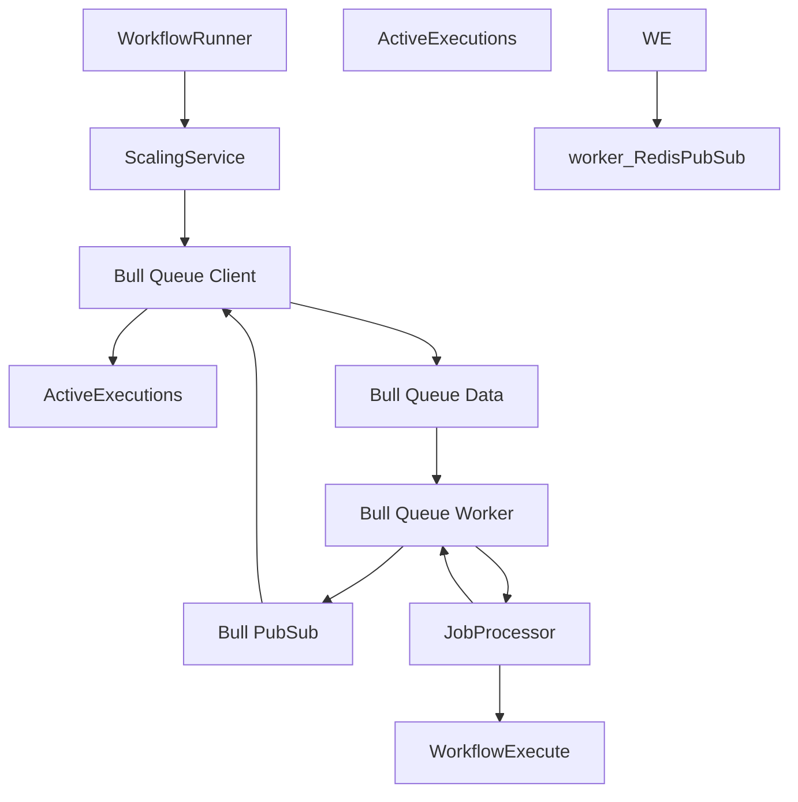

# Workflow Execution Engine

Relevant source files

-   [packages/@n8n/backend-common/src/logging/\_\_tests\_\_/logger.test.ts](https://github.com/n8n-io/n8n/blob/88f170b9/packages/@n8n/backend-common/src/logging/__tests__/logger.test.ts)
-   [packages/@n8n/backend-common/src/logging/logger.ts](https://github.com/n8n-io/n8n/blob/88f170b9/packages/@n8n/backend-common/src/logging/logger.ts)
-   [packages/@n8n/db/src/repositories/\_\_tests\_\_/execution.repository.test.ts](https://github.com/n8n-io/n8n/blob/88f170b9/packages/@n8n/db/src/repositories/__tests__/execution.repository.test.ts)
-   [packages/@n8n/db/src/repositories/execution.repository.ts](https://github.com/n8n-io/n8n/blob/88f170b9/packages/@n8n/db/src/repositories/execution.repository.ts)
-   [packages/@n8n/decorators/src/\_\_tests\_\_/memoized.test.ts](https://github.com/n8n-io/n8n/blob/88f170b9/packages/@n8n/decorators/src/__tests__/memoized.test.ts)
-   [packages/@n8n/decorators/src/context-establishment/context-establishment-hook.ts](https://github.com/n8n-io/n8n/blob/88f170b9/packages/@n8n/decorators/src/context-establishment/context-establishment-hook.ts)
-   [packages/@n8n/decorators/src/memoized.ts](https://github.com/n8n-io/n8n/blob/88f170b9/packages/@n8n/decorators/src/memoized.ts)
-   [packages/cli/src/\_\_tests\_\_/active-executions.test.ts](https://github.com/n8n-io/n8n/blob/88f170b9/packages/cli/src/__tests__/active-executions.test.ts)
-   [packages/cli/src/\_\_tests\_\_/wait-tracker.test.ts](https://github.com/n8n-io/n8n/blob/88f170b9/packages/cli/src/__tests__/wait-tracker.test.ts)
-   [packages/cli/src/\_\_tests\_\_/workflow-execute-additional-data.test.ts](https://github.com/n8n-io/n8n/blob/88f170b9/packages/cli/src/__tests__/workflow-execute-additional-data.test.ts)
-   [packages/cli/src/\_\_tests\_\_/workflow-runner.test.ts](https://github.com/n8n-io/n8n/blob/88f170b9/packages/cli/src/__tests__/workflow-runner.test.ts)
-   [packages/cli/src/active-executions.ts](https://github.com/n8n-io/n8n/blob/88f170b9/packages/cli/src/active-executions.ts)
-   [packages/cli/src/execution-lifecycle/\_\_tests\_\_/execution-lifecycle-hooks.test.ts](https://github.com/n8n-io/n8n/blob/88f170b9/packages/cli/src/execution-lifecycle/__tests__/execution-lifecycle-hooks.test.ts)
-   [packages/cli/src/execution-lifecycle/execution-lifecycle-hooks.ts](https://github.com/n8n-io/n8n/blob/88f170b9/packages/cli/src/execution-lifecycle/execution-lifecycle-hooks.ts)
-   [packages/cli/src/execution-lifecycle/shared/shared-hook-functions.ts](https://github.com/n8n-io/n8n/blob/88f170b9/packages/cli/src/execution-lifecycle/shared/shared-hook-functions.ts)
-   [packages/cli/src/interfaces.ts](https://github.com/n8n-io/n8n/blob/88f170b9/packages/cli/src/interfaces.ts)
-   [packages/cli/src/scaling/\_\_tests\_\_/job-processor.service.test.ts](https://github.com/n8n-io/n8n/blob/88f170b9/packages/cli/src/scaling/__tests__/job-processor.service.test.ts)
-   [packages/cli/src/scaling/\_\_tests\_\_/scaling.service.test.ts](https://github.com/n8n-io/n8n/blob/88f170b9/packages/cli/src/scaling/__tests__/scaling.service.test.ts)
-   [packages/cli/src/scaling/job-processor.ts](https://github.com/n8n-io/n8n/blob/88f170b9/packages/cli/src/scaling/job-processor.ts)
-   [packages/cli/src/scaling/scaling.service.ts](https://github.com/n8n-io/n8n/blob/88f170b9/packages/cli/src/scaling/scaling.service.ts)
-   [packages/cli/src/scaling/scaling.types.ts](https://github.com/n8n-io/n8n/blob/88f170b9/packages/cli/src/scaling/scaling.types.ts)
-   [packages/cli/src/wait-tracker.ts](https://github.com/n8n-io/n8n/blob/88f170b9/packages/cli/src/wait-tracker.ts)
-   [packages/cli/src/webhooks/\_\_tests\_\_/webhook-helpers.test.ts](https://github.com/n8n-io/n8n/blob/88f170b9/packages/cli/src/webhooks/__tests__/webhook-helpers.test.ts)
-   [packages/cli/src/webhooks/webhook-helpers.ts](https://github.com/n8n-io/n8n/blob/88f170b9/packages/cli/src/webhooks/webhook-helpers.ts)
-   [packages/cli/src/workflow-execute-additional-data.ts](https://github.com/n8n-io/n8n/blob/88f170b9/packages/cli/src/workflow-execute-additional-data.ts)
-   [packages/cli/src/workflow-runner.ts](https://github.com/n8n-io/n8n/blob/88f170b9/packages/cli/src/workflow-runner.ts)
-   [packages/cli/src/workflows/\_\_tests\_\_/workflow-execution.service.test.ts](https://github.com/n8n-io/n8n/blob/88f170b9/packages/cli/src/workflows/__tests__/workflow-execution.service.test.ts)
-   [packages/cli/src/workflows/workflow-execution.service.ts](https://github.com/n8n-io/n8n/blob/88f170b9/packages/cli/src/workflows/workflow-execution.service.ts)
-   [packages/cli/src/workflows/workflow.request.ts](https://github.com/n8n-io/n8n/blob/88f170b9/packages/cli/src/workflows/workflow.request.ts)
-   [packages/cli/test/integration/execution.repository.test.ts](https://github.com/n8n-io/n8n/blob/88f170b9/packages/cli/test/integration/execution.repository.test.ts)
-   [packages/cli/test/integration/shared/db/executions.ts](https://github.com/n8n-io/n8n/blob/88f170b9/packages/cli/test/integration/shared/db/executions.ts)
-   [packages/core/eslint.config.mjs](https://github.com/n8n-io/n8n/blob/88f170b9/packages/core/eslint.config.mjs)
-   [packages/core/src/execution-engine/\_\_tests\_\_/mock-node-types.ts](https://github.com/n8n-io/n8n/blob/88f170b9/packages/core/src/execution-engine/__tests__/mock-node-types.ts)
-   [packages/core/src/execution-engine/\_\_tests\_\_/requests-response.test.ts](https://github.com/n8n-io/n8n/blob/88f170b9/packages/core/src/execution-engine/__tests__/requests-response.test.ts)
-   [packages/core/src/execution-engine/\_\_tests\_\_/workflow-execute-process-process-run-execution-data.test.ts](https://github.com/n8n-io/n8n/blob/88f170b9/packages/core/src/execution-engine/__tests__/workflow-execute-process-process-run-execution-data.test.ts)
-   [packages/core/src/execution-engine/\_\_tests\_\_/workflow-execute-run-node.test.ts](https://github.com/n8n-io/n8n/blob/88f170b9/packages/core/src/execution-engine/__tests__/workflow-execute-run-node.test.ts)
-   [packages/core/src/execution-engine/\_\_tests\_\_/workflow-execute.test.ts](https://github.com/n8n-io/n8n/blob/88f170b9/packages/core/src/execution-engine/__tests__/workflow-execute.test.ts)
-   [packages/core/src/execution-engine/node-execution-context/credentials-test-context.ts](https://github.com/n8n-io/n8n/blob/88f170b9/packages/core/src/execution-engine/node-execution-context/credentials-test-context.ts)
-   [packages/core/src/execution-engine/node-execution-context/execute-single-context.ts](https://github.com/n8n-io/n8n/blob/88f170b9/packages/core/src/execution-engine/node-execution-context/execute-single-context.ts)
-   [packages/core/src/execution-engine/node-execution-context/index.ts](https://github.com/n8n-io/n8n/blob/88f170b9/packages/core/src/execution-engine/node-execution-context/index.ts)
-   [packages/core/src/execution-engine/node-execution-context/utils/\_\_tests\_\_/resolve-source-overwrite.test.ts](https://github.com/n8n-io/n8n/blob/88f170b9/packages/core/src/execution-engine/node-execution-context/utils/__tests__/resolve-source-overwrite.test.ts)
-   [packages/core/src/execution-engine/node-execution-context/utils/resolve-source-overwrite.ts](https://github.com/n8n-io/n8n/blob/88f170b9/packages/core/src/execution-engine/node-execution-context/utils/resolve-source-overwrite.ts)
-   [packages/core/src/execution-engine/node-execution-context/webhook-context.ts](https://github.com/n8n-io/n8n/blob/88f170b9/packages/core/src/execution-engine/node-execution-context/webhook-context.ts)
-   [packages/core/src/execution-engine/requests-response.ts](https://github.com/n8n-io/n8n/blob/88f170b9/packages/core/src/execution-engine/requests-response.ts)
-   [packages/core/src/execution-engine/workflow-execute.ts](https://github.com/n8n-io/n8n/blob/88f170b9/packages/core/src/execution-engine/workflow-execute.ts)
-   [packages/core/src/node-execute-functions.ts](https://github.com/n8n-io/n8n/blob/88f170b9/packages/core/src/node-execute-functions.ts)
-   [packages/core/src/utils/\_\_tests\_\_/deep-merge.test.ts](https://github.com/n8n-io/n8n/blob/88f170b9/packages/core/src/utils/__tests__/deep-merge.test.ts)
-   [packages/core/src/utils/deep-merge.ts](https://github.com/n8n-io/n8n/blob/88f170b9/packages/core/src/utils/deep-merge.ts)
-   [packages/testing/playwright/pages/ExecutionsPage.ts](https://github.com/n8n-io/n8n/blob/88f170b9/packages/testing/playwright/pages/ExecutionsPage.ts)
-   [packages/testing/playwright/tests/e2e/settings/users/users.spec.ts](https://github.com/n8n-io/n8n/blob/88f170b9/packages/testing/playwright/tests/e2e/settings/users/users.spec.ts)
-   [packages/testing/playwright/tests/e2e/workflows/executions/list.spec.ts](https://github.com/n8n-io/n8n/blob/88f170b9/packages/testing/playwright/tests/e2e/workflows/executions/list.spec.ts)
-   [packages/testing/playwright/workflows/cat-1854-wait-execution-history.json](https://github.com/n8n-io/n8n/blob/88f170b9/packages/testing/playwright/workflows/cat-1854-wait-execution-history.json)
-   [packages/testing/playwright/workflows/webhook-misconfiguration-test.json](https://github.com/n8n-io/n8n/blob/88f170b9/packages/testing/playwright/workflows/webhook-misconfiguration-test.json)

The Workflow Execution Engine is the core subsystem responsible for executing workflows from trigger to completion. It orchestrates node execution, manages execution state, handles distributed processing via Bull/Redis queues, and provides lifecycle hooks for monitoring and persistence.

This page covers the execution mechanics and infrastructure. For workflow data structures and expression evaluation, see [Workflow Data Access and Expression System](/n8n-io/n8n/2.3-workflow-data-access-and-expression-system). For execution persistence and recovery mechanisms, see [Execution Recovery and Error Handling](/n8n-io/n8n/2.4-execution-recovery-and-error-handling). For distributed worker setup and job processing, see [Distributed Execution and Scaling](/n8n-io/n8n/2.2-distributed-execution-and-scaling).

## Execution Modes

n8n supports two execution modes configured via `GlobalConfig.executions.mode`:

| Mode | Description | Use Case |
| --- | --- | --- |
| `regular` | Executions run in the main process | Single-server deployments, development |
| `queue` | Executions are enqueued to Bull/Redis and processed by workers | Multi-server scaling, high throughput |

In `regular` mode, `WorkflowRunner.runMainProcess()` executes workflows directly in the main process. In `queue` mode, `WorkflowRunner.enqueueExecution()` creates a Bull job that is picked up by a worker process running `JobProcessor.processJob()`.

**Sources:** [packages/cli/src/workflow-runner.ts172-188](https://github.com/n8n-io/n8n/blob/88f170b9/packages/cli/src/workflow-runner.ts#L172-L188)

## WorkflowRunner: Main Entry Point

```mermaid
flowchart TD
    ExecuteManually["WorkflowExecutionService.executeManually()"]
    RunWorkflow["WorkflowExecutionService.runWorkflow()"]
    ActiveWorkflow["ActiveWorkflowManager trigger"]
    WR_run["WorkflowRunner.run()"]
    WR_check["Check credentials permissions"]
    WR_mode["Queue mode?"]
    WR_enqueue["WorkflowRunner.enqueueExecution()"]
    WR_runMain["WorkflowRunner.runMainProcess()"]
    FailedRun["Generate failed execution"]
    AddJob["ScalingService.addJob()"]
    BullQueue["Bull Queue"]
    CreateWorkflow["new Workflow()"]
    GetBase["WorkflowExecuteAdditionalData.getBase()"]
    ExecuteWorkflow["new WorkflowExecute()"]
    ProcessRun["workflowExecute.processRunExecutionData()"]

    ExecuteManually --> WR_run
    RunWorkflow --> WR_run
    ActiveWorkflow --> WR_run
    WR --> run_WR_check
    WR --> check_WR_mode
    WR --> check_FailedRun
    WR --> mode_WR_enqueue
    WR --> mode_WR_runMain
    WR --> enqueue_AddJob
    AddJob --> BullQueue
    WR --> runMain_CreateWorkflow
    CreateWorkflow --> GetBase
    GetBase --> ExecuteWorkflow
    ExecuteWorkflow --> ProcessRun
```


`WorkflowRunner.run()` is the unified entry point for all workflow executions. It:

1.  Registers execution in `ActiveExecutions` to track in-memory state [packages/cli/src/workflow-runner.ts147](https://github.com/n8n-io/n8n/blob/88f170b9/packages/cli/src/workflow-runner.ts#L147-L147)
2.  Validates credential permissions via `CredentialsPermissionChecker` [packages/cli/src/workflow-runner.ts152](https://github.com/n8n-io/n8n/blob/88f170b9/packages/cli/src/workflow-runner.ts#L152-L152)
3.  Routes to either queue or regular execution based on configuration [packages/cli/src/workflow-runner.ts178-189](https://github.com/n8n-io/n8n/blob/88f170b9/packages/cli/src/workflow-runner.ts#L178-L189)
4.  Attaches response promise for webhook-triggered workflows [packages/cli/src/workflow-runner.ts168-170](https://github.com/n8n-io/n8n/blob/88f170b9/packages/cli/src/workflow-runner.ts#L168-L170)
5.  Sets up execution timeout if configured [packages/cli/src/workflow-runner.ts229-232](https://github.com/n8n-io/n8n/blob/88f170b9/packages/cli/src/workflow-runner.ts#L229-L232)

**Sources:** [packages/cli/src/workflow-runner.ts139-213](https://github.com/n8n-io/n8n/blob/88f170b9/packages/cli/src/workflow-runner.ts#L139-L213) [packages/cli/src/workflows/workflow-execution.service.ts57-90](https://github.com/n8n-io/n8n/blob/88f170b9/packages/cli/src/workflows/workflow-execution.service.ts#L57-L90)

## Regular Mode Execution Flow

> **[Mermaid sequence]**
> *(图表结构无法解析)*

In regular mode, `WorkflowRunner.runMainProcess()` executes the workflow synchronously:

1.  Loads static data if needed via `WorkflowStaticDataService` [packages/cli/src/workflow-runner.ts220-224](https://github.com/n8n-io/n8n/blob/88f170b9/packages/cli/src/workflow-runner.ts#L220-L224)
2.  Creates `Workflow` instance from workflow definition [packages/cli/src/workflow-runner.ts246-255](https://github.com/n8n-io/n8n/blob/88f170b9/packages/cli/src/workflow-runner.ts#L246-L255)
3.  Builds `IWorkflowExecuteAdditionalData` context with helpers, hooks, and configuration [packages/cli/src/workflow-runner.ts257-262](https://github.com/n8n-io/n8n/blob/88f170b9/packages/cli/src/workflow-runner.ts#L257-L262)
4.  Sets up execution timeout using `setTimeout` if `executionTimeout` is configured [packages/cli/src/workflow-runner.ts229-244](https://github.com/n8n-io/n8n/blob/88f170b9/packages/cli/src/workflow-runner.ts#L229-L244)
5.  Creates `WorkflowExecute` instance and calls `processRunExecutionData()` [packages/cli/src/workflow-runner.ts275-276](https://github.com/n8n-io/n8n/blob/88f170b9/packages/cli/src/workflow-runner.ts#L275-L276)
6.  Attaches execution promise to `ActiveExecutions` for cancellation support [packages/cli/src/workflow-runner.ts278](https://github.com/n8n-io/n8n/blob/88f170b9/packages/cli/src/workflow-runner.ts#L278-L278)
7.  On completion, clears timeout and finalizes execution [packages/cli/src/workflow-runner.ts316-320](https://github.com/n8n-io/n8n/blob/88f170b9/packages/cli/src/workflow-runner.ts#L316-L320)

**Sources:** [packages/cli/src/workflow-runner.ts217-376](https://github.com/n8n-io/n8n/blob/88f170b9/packages/cli/src/workflow-runner.ts#L217-L376) [packages/core/src/execution-engine/workflow-execute.ts99-130](https://github.com/n8n-io/n8n/blob/88f170b9/packages/core/src/execution-engine/workflow-execute.ts#L99-L130)

## Queue Mode Architecture


### ScalingService Components

`ScalingService` manages the Bull queue infrastructure:

**Setup (Main/Webhook):**

-   `setupQueue()`: Creates Bull queue instance with Redis client [packages/cli/src/scaling/scaling.service.ts60-75](https://github.com/n8n-io/n8n/blob/88f170b9/packages/cli/src/scaling/scaling.service.ts#L60-L75)
-   `registerListeners()`: Listens for job events like `completed`, `failed`, and `progress` [packages/cli/src/scaling/scaling.service.ts77](https://github.com/n8n-io/n8n/blob/88f170b9/packages/cli/src/scaling/scaling.service.ts#L77-L77)
-   `scheduleQueueRecovery()`: Periodically marks dangling executions as crashed (leader only) [packages/cli/src/scaling/scaling.service.ts79](https://github.com/n8n-io/n8n/blob/88f170b9/packages/cli/src/scaling/scaling.service.ts#L79-L79)

**Setup (Worker):**

-   `setupWorker(concurrency)`: Registers job processor with concurrency limit [packages/cli/src/scaling/scaling.service.ts111-137](https://github.com/n8n-io/n8n/blob/88f170b9/packages/cli/src/scaling/scaling.service.ts#L111-L137)

**Job Operations:**

-   `addJob(jobData, priority)`: Enqueues execution with priority [packages/cli/src/scaling/scaling.service.ts226-240](https://github.com/n8n-io/n8n/blob/88f170b9/packages/cli/src/scaling/scaling.service.ts#L226-L240)
-   `stopJob(executionId)`: Sends abort message to workers via progress events [packages/cli/src/scaling/scaling.service.ts254-279](https://github.com/n8n-io/n8n/blob/88f170b9/packages/cli/src/scaling/scaling.service.ts#L254-L279)
-   `popJobResult(executionId)`: Retrieves and removes the result for a completed job [packages/cli/src/scaling/scaling.service.ts208-212](https://github.com/n8n-io/n8n/blob/88f170b9/packages/cli/src/scaling/scaling.service.ts#L208-L212)

**Sources:** [packages/cli/src/scaling/scaling.service.ts40-245](https://github.com/n8n-io/n8n/blob/88f170b9/packages/cli/src/scaling/scaling.service.ts#L40-L245)

### JobData Structure

```
type JobData = {  workflowId: string;  executionId: string;  loadStaticData: boolean;  pushRef?: string;              // For real-time updates to UI  streamingEnabled?: boolean;  restartExecutionId?: string;   // For execution restarts    // MCP-specific fields  isMcpExecution?: boolean;  mcpType?: 'service' | 'trigger';  mcpSessionId?: string;  mcpMessageId?: string;}
```
**Sources:** [packages/cli/src/scaling/scaling.types.ts18-42](https://github.com/n8n-io/n8n/blob/88f170b9/packages/cli/src/scaling/scaling.types.ts#L18-L42)

### JobProcessor Execution

`JobProcessor.processJob()` runs on worker processes:

1.  Fetches execution data from `ExecutionRepository` with `includeData: true` [packages/cli/src/scaling/job-processor.ts75-78](https://github.com/n8n-io/n8n/blob/88f170b9/packages/cli/src/scaling/job-processor.ts#L75-L78)
2.  Returns early if execution status is `crashed` [packages/cli/src/scaling/job-processor.ts91](https://github.com/n8n-io/n8n/blob/88f170b9/packages/cli/src/scaling/job-processor.ts#L91-L91)
3.  Loads static data from `WorkflowRepository` if `loadStaticData` is true [packages/cli/src/scaling/job-processor.ts108-121](https://github.com/n8n-io/n8n/blob/88f170b9/packages/cli/src/scaling/job-processor.ts#L108-L121)
4.  Creates `Workflow` instance and `IWorkflowExecuteAdditionalData` [packages/cli/src/scaling/job-processor.ts134-149](https://github.com/n8n-io/n8n/blob/88f170b9/packages/cli/src/scaling/job-processor.ts#L134-L149)
5.  Sets up lifecycle hooks with `getLifecycleHooksForScalingWorker()` [packages/cli/src/scaling/job-processor.ts155-164](https://github.com/n8n-io/n8n/blob/88f170b9/packages/cli/src/scaling/job-processor.ts#L155-L164)
6.  Calls `WorkflowExecute.processRunExecutionData()` to start execution [packages/cli/src/scaling/job-processor.ts233](https://github.com/n8n-io/n8n/blob/88f170b9/packages/cli/src/scaling/job-processor.ts#L233-L233)
7.  Sends progress messages via `job.progress()`:
    -   `respond-to-webhook`: Webhook response [packages/cli/src/scaling/job-processor.ts190-197](https://github.com/n8n-io/n8n/blob/88f170b9/packages/cli/src/scaling/job-processor.ts#L190-L197)
    -   `send-chunk`: Streaming chunk for SSE [packages/cli/src/scaling/job-processor.ts201-208](https://github.com/n8n-io/n8n/blob/88f170b9/packages/cli/src/scaling/job-processor.ts#L201-L208)
    -   `mcp-response`: MCP tool execution result [packages/cli/src/scaling/job-processor.ts173-186](https://github.com/n8n-io/n8n/blob/88f170b9/packages/cli/src/scaling/job-processor.ts#L173-L186)

**Sources:** [packages/cli/src/scaling/job-processor.ts72-235](https://github.com/n8n-io/n8n/blob/88f170b9/packages/cli/src/scaling/job-processor.ts#L72-L235)

## WorkflowExecuteAdditionalData Context

`WorkflowExecuteAdditionalData.getBase()` creates the context object passed to all node executions:

**Core Helpers:**

-   `credentialsHelper`: `CredentialsHelper` instance for credential resolution [packages/cli/src/workflow-execute-additional-data.ts474](https://github.com/n8n-io/n8n/blob/88f170b9/packages/cli/src/workflow-execute-additional-data.ts#L474-L474)
-   `executeWorkflow`: Function to execute sub-workflows (see [Workflow Data Access and Expression System](/n8n-io/n8n/2.3-workflow-data-access-and-expression-system)) [packages/cli/src/workflow-execute-additional-data.ts198-202](https://github.com/n8n-io/n8n/blob/88f170b9/packages/cli/src/workflow-execute-additional-data.ts#L198-L202)
-   `setExecutionStatus`: Updates execution status in `ActiveExecutions` [packages/cli/src/workflow-execute-additional-data.ts503](https://github.com/n8n-io/n8n/blob/88f170b9/packages/cli/src/workflow-execute-additional-data.ts#L503-L503)
-   `sendDataToUI`: Sends push events to connected clients via `pushRef` [packages/cli/src/workflow-execute-additional-data.ts511](https://github.com/n8n-io/n8n/blob/88f170b9/packages/cli/src/workflow-execute-additional-data.ts#L511-L511)

**Configuration:**

-   `restApiUrl`, `instanceBaseUrl`, `webhookBaseUrl`: URL endpoints [packages/cli/src/workflow-execute-additional-data.ts483-485](https://github.com/n8n-io/n8n/blob/88f170b9/packages/cli/src/workflow-execute-additional-data.ts#L483-L485)
-   `variables`: Environment variables from `VariablesService` [packages/cli/src/workflow-execute-additional-data.ts515](https://github.com/n8n-io/n8n/blob/88f170b9/packages/cli/src/workflow-execute-additional-data.ts#L515-L515)
-   `workflowSettings`: Workflow-specific settings [packages/cli/src/workflow-execute-additional-data.ts522](https://github.com/n8n-io/n8n/blob/88f170b9/packages/cli/src/workflow-execute-additional-data.ts#L522-L522)

**Advanced Features:**

-   `startRunnerTask`: Offloads code execution to task runners (JS/Python) [packages/cli/src/workflow-execute-additional-data.ts544](https://github.com/n8n-io/n8n/blob/88f170b9/packages/cli/src/workflow-execute-additional-data.ts#L544-L544)
-   `externalSecretsProxy`: Resolves secrets from external providers [packages/cli/src/workflow-execute-additional-data.ts476](https://github.com/n8n-io/n8n/blob/88f170b9/packages/cli/src/workflow-execute-additional-data.ts#L476-L476)

**Sources:** [packages/cli/src/workflow-execute-additional-data.ts453-556](https://github.com/n8n-io/n8n/blob/88f170b9/packages/cli/src/workflow-execute-additional-data.ts#L453-L556)

## Execution Lifecycle Hooks

`ExecutionLifecycleHooks` provides an event system for workflow execution milestones.

**Hook Factory Functions:**

| Function | Context |
| --- | --- |
| `getLifecycleHooksForRegularMain()` | Main process regular execution [packages/cli/src/execution-lifecycle/execution-lifecycle-hooks.ts133](https://github.com/n8n-io/n8n/blob/88f170b9/packages/cli/src/execution-lifecycle/execution-lifecycle-hooks.ts#L133-L133) |
| `getLifecycleHooksForScalingMain()` | Main process queue mode [packages/cli/src/execution-lifecycle/execution-lifecycle-hooks.ts167](https://github.com/n8n-io/n8n/blob/88f170b9/packages/cli/src/execution-lifecycle/execution-lifecycle-hooks.ts#L167-L167) |
| `getLifecycleHooksForScalingWorker()` | Worker process [packages/cli/src/execution-lifecycle/execution-lifecycle-hooks.ts183](https://github.com/n8n-io/n8n/blob/88f170b9/packages/cli/src/execution-lifecycle/execution-lifecycle-hooks.ts#L183-L183) |
| `getLifecycleHooksForSubExecutions()` | Sub-workflow execution [packages/cli/src/workflow-execute-additional-data.ts39](https://github.com/n8n-io/n8n/blob/88f170b9/packages/cli/src/workflow-execute-additional-data.ts#L39-L39) |

**Key Hook Handlers:**

-   **`workflowExecuteBefore`**: Emits `execution-started` events and triggers external hooks [packages/cli/src/execution-lifecycle/execution-lifecycle-hooks.ts251-264](https://github.com/n8n-io/n8n/blob/88f170b9/packages/cli/src/execution-lifecycle/execution-lifecycle-hooks.ts#L251-L264)
-   **`nodeExecuteAfter`**: Sends node results to UI and updates statistics [packages/cli/src/execution-lifecycle/execution-lifecycle-hooks.ts337-375](https://github.com/n8n-io/n8n/blob/88f170b9/packages/cli/src/execution-lifecycle/execution-lifecycle-hooks.ts#L337-L375)
-   **`workflowExecuteAfter`**: Persists final execution results to database and triggers error workflows [packages/cli/src/execution-lifecycle/execution-lifecycle-hooks.ts411-470](https://github.com/n8n-io/n8n/blob/88f170b9/packages/cli/src/execution-lifecycle/execution-lifecycle-hooks.ts#L411-L470)

**Sources:** [packages/cli/src/execution-lifecycle/execution-lifecycle-hooks.ts133-500](https://github.com/n8n-io/n8n/blob/88f170b9/packages/cli/src/execution-lifecycle/execution-lifecycle-hooks.ts#L133-L500)

## Sub-Workflow Execution

Sub-workflows are executed via `WorkflowExecuteAdditionalData.executeWorkflow()`:

**Draft vs. Published:**

-   Manual/chat executions use `getDraftWorkflowData()` to fetch latest nodes from the database [packages/cli/src/workflow-execute-additional-data.ts147-158](https://github.com/n8n-io/n8n/blob/88f170b9/packages/cli/src/workflow-execute-additional-data.ts#L147-L158)
-   Production executions use `getPublishedWorkflowData()` requiring an `activeVersion` [packages/cli/src/workflow-execute-additional-data.ts165-193](https://github.com/n8n-io/n8n/blob/88f170b9/packages/cli/src/workflow-execute-additional-data.ts#L165-L193)

**Execution Flow:**

1.  Loads workflow data (draft or published) [packages/cli/src/workflow-execute-additional-data.ts209-221](https://github.com/n8n-io/n8n/blob/88f170b9/packages/cli/src/workflow-execute-additional-data.ts#L209-L221)
2.  Initializes `runData` with input data at the sub-workflow start node [packages/cli/src/workflow-execute-additional-data.ts56-95](https://github.com/n8n-io/n8n/blob/88f170b9/packages/cli/src/workflow-execute-additional-data.ts#L56-L95)
3.  Registers execution in `ActiveExecutions` [packages/cli/src/workflow-execute-additional-data.ts226](https://github.com/n8n-io/n8n/blob/88f170b9/packages/cli/src/workflow-execute-additional-data.ts#L226-L226)
4.  Executes via `WorkflowRunner.run()` [packages/cli/src/workflow-execute-additional-data.ts241](https://github.com/n8n-io/n8n/blob/88f170b9/packages/cli/src/workflow-execute-additional-data.ts#L241-L241)

**Sources:** [packages/cli/src/workflow-execute-additional-data.ts198-416](https://github.com/n8n-io/n8n/blob/88f170b9/packages/cli/src/workflow-execute-additional-data.ts#L198-L416)

## Manual Execution and Partial Execution

`WorkflowExecutionService.executeManually()` handles manual executions from the UI:

**Execution Modes:**

1.  **Partial Execution to Destination:**

    -   Payload includes `destinationNode` and `runData` [packages/cli/src/workflows/workflow-execution.service.ts125-137](https://github.com/n8n-io/n8n/blob/88f170b9/packages/cli/src/workflows/workflow-execution.service.ts#L125-L137)
    -   Allows resuming from a specific node using previous execution data.
2.  **Full Execution from Known Trigger:**

    -   Payload includes `triggerToStartFrom` [packages/cli/src/workflows/workflow-execution.service.ts144-175](https://github.com/n8n-io/n8n/blob/88f170b9/packages/cli/src/workflows/workflow-execution.service.ts#L144-L175)
    -   Checks if a test webhook is needed via `testWebhooks.needsWebhook()` [packages/cli/src/workflows/workflow-execution.service.ts148-160](https://github.com/n8n-io/n8n/blob/88f170b9/packages/cli/src/workflows/workflow-execution.service.ts#L148-L160)
3.  **Full Execution from Unknown Trigger:**

    -   Selects a pinned trigger via `selectPinnedTrigger()` [packages/cli/src/workflows/workflow-execution.service.ts178-212](https://github.com/n8n-io/n8n/blob/88f170b9/packages/cli/src/workflows/workflow-execution.service.ts#L178-L212)

**Sources:** [packages/cli/src/workflows/workflow-execution.service.ts104-213](https://github.com/n8n-io/n8n/blob/88f170b9/packages/cli/src/workflows/workflow-execution.service.ts#L104-L213)
