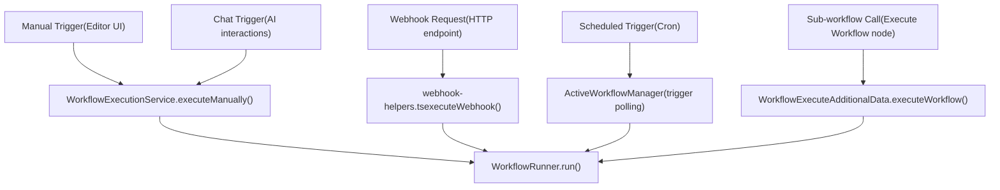
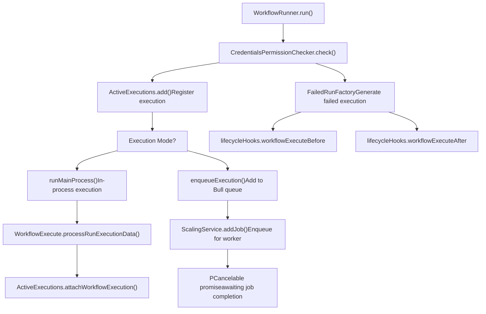
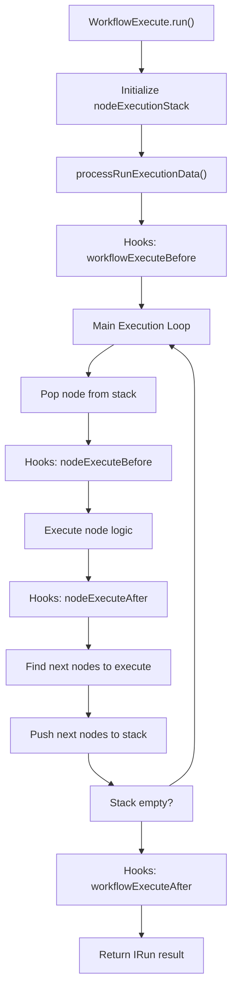

# Workflow Execution Lifecycle

Relevant source files

-   [packages/@n8n/backend-common/src/logging/\_\_tests\_\_/logger.test.ts](https://github.com/n8n-io/n8n/blob/88f170b9/packages/@n8n/backend-common/src/logging/__tests__/logger.test.ts)
-   [packages/@n8n/backend-common/src/logging/logger.ts](https://github.com/n8n-io/n8n/blob/88f170b9/packages/@n8n/backend-common/src/logging/logger.ts)
-   [packages/@n8n/db/src/repositories/\_\_tests\_\_/execution.repository.test.ts](https://github.com/n8n-io/n8n/blob/88f170b9/packages/@n8n/db/src/repositories/__tests__/execution.repository.test.ts)
-   [packages/@n8n/db/src/repositories/execution.repository.ts](https://github.com/n8n-io/n8n/blob/88f170b9/packages/@n8n/db/src/repositories/execution.repository.ts)
-   [packages/@n8n/decorators/src/\_\_tests\_\_/memoized.test.ts](https://github.com/n8n-io/n8n/blob/88f170b9/packages/@n8n/decorators/src/__tests__/memoized.test.ts)
-   [packages/@n8n/decorators/src/context-establishment/context-establishment-hook.ts](https://github.com/n8n-io/n8n/blob/88f170b9/packages/@n8n/decorators/src/context-establishment/context-establishment-hook.ts)
-   [packages/@n8n/decorators/src/memoized.ts](https://github.com/n8n-io/n8n/blob/88f170b9/packages/@n8n/decorators/src/memoized.ts)
-   [packages/cli/src/\_\_tests\_\_/active-executions.test.ts](https://github.com/n8n-io/n8n/blob/88f170b9/packages/cli/src/__tests__/active-executions.test.ts)
-   [packages/cli/src/\_\_tests\_\_/wait-tracker.test.ts](https://github.com/n8n-io/n8n/blob/88f170b9/packages/cli/src/__tests__/wait-tracker.test.ts)
-   [packages/cli/src/\_\_tests\_\_/workflow-execute-additional-data.test.ts](https://github.com/n8n-io/n8n/blob/88f170b9/packages/cli/src/__tests__/workflow-execute-additional-data.test.ts)
-   [packages/cli/src/\_\_tests\_\_/workflow-runner.test.ts](https://github.com/n8n-io/n8n/blob/88f170b9/packages/cli/src/__tests__/workflow-runner.test.ts)
-   [packages/cli/src/active-executions.ts](https://github.com/n8n-io/n8n/blob/88f170b9/packages/cli/src/active-executions.ts)
-   [packages/cli/src/execution-lifecycle/\_\_tests\_\_/execution-lifecycle-hooks.test.ts](https://github.com/n8n-io/n8n/blob/88f170b9/packages/cli/src/execution-lifecycle/__tests__/execution-lifecycle-hooks.test.ts)
-   [packages/cli/src/execution-lifecycle/execution-lifecycle-hooks.ts](https://github.com/n8n-io/n8n/blob/88f170b9/packages/cli/src/execution-lifecycle/execution-lifecycle-hooks.ts)
-   [packages/cli/src/execution-lifecycle/shared/shared-hook-functions.ts](https://github.com/n8n-io/n8n/blob/88f170b9/packages/cli/src/execution-lifecycle/shared/shared-hook-functions.ts)
-   [packages/cli/src/interfaces.ts](https://github.com/n8n-io/n8n/blob/88f170b9/packages/cli/src/interfaces.ts)
-   [packages/cli/src/scaling/\_\_tests\_\_/job-processor.service.test.ts](https://github.com/n8n-io/n8n/blob/88f170b9/packages/cli/src/scaling/__tests__/job-processor.service.test.ts)
-   [packages/cli/src/scaling/\_\_tests\_\_/scaling.service.test.ts](https://github.com/n8n-io/n8n/blob/88f170b9/packages/cli/src/scaling/__tests__/scaling.service.test.ts)
-   [packages/cli/src/scaling/job-processor.ts](https://github.com/n8n-io/n8n/blob/88f170b9/packages/cli/src/scaling/job-processor.ts)
-   [packages/cli/src/scaling/scaling.service.ts](https://github.com/n8n-io/n8n/blob/88f170b9/packages/cli/src/scaling/scaling.service.ts)
-   [packages/cli/src/scaling/scaling.types.ts](https://github.com/n8n-io/n8n/blob/88f170b9/packages/cli/src/scaling/scaling.types.ts)
-   [packages/cli/src/wait-tracker.ts](https://github.com/n8n-io/n8n/blob/88f170b9/packages/cli/src/wait-tracker.ts)
-   [packages/cli/src/webhooks/\_\_tests\_\_/webhook-helpers.test.ts](https://github.com/n8n-io/n8n/blob/88f170b9/packages/cli/src/webhooks/__tests__/webhook-helpers.test.ts)
-   [packages/cli/src/webhooks/webhook-helpers.ts](https://github.com/n8n-io/n8n/blob/88f170b9/packages/cli/src/webhooks/webhook-helpers.ts)
-   [packages/cli/src/workflow-execute-additional-data.ts](https://github.com/n8n-io/n8n/blob/88f170b9/packages/cli/src/workflow-execute-additional-data.ts)
-   [packages/cli/src/workflow-runner.ts](https://github.com/n8n-io/n8n/blob/88f170b9/packages/cli/src/workflow-runner.ts)
-   [packages/cli/src/workflows/\_\_tests\_\_/workflow-execution.service.test.ts](https://github.com/n8n-io/n8n/blob/88f170b9/packages/cli/src/workflows/__tests__/workflow-execution.service.test.ts)
-   [packages/cli/src/workflows/workflow-execution.service.ts](https://github.com/n8n-io/n8n/blob/88f170b9/packages/cli/src/workflows/workflow-execution.service.ts)
-   [packages/cli/src/workflows/workflow.request.ts](https://github.com/n8n-io/n8n/blob/88f170b9/packages/cli/src/workflows/workflow.request.ts)
-   [packages/cli/test/integration/execution.repository.test.ts](https://github.com/n8n-io/n8n/blob/88f170b9/packages/cli/test/integration/execution.repository.test.ts)
-   [packages/cli/test/integration/shared/db/executions.ts](https://github.com/n8n-io/n8n/blob/88f170b9/packages/cli/test/integration/shared/db/executions.ts)
-   [packages/core/eslint.config.mjs](https://github.com/n8n-io/n8n/blob/88f170b9/packages/core/eslint.config.mjs)
-   [packages/core/src/execution-engine/\_\_tests\_\_/mock-node-types.ts](https://github.com/n8n-io/n8n/blob/88f170b9/packages/core/src/execution-engine/__tests__/mock-node-types.ts)
-   [packages/core/src/execution-engine/\_\_tests\_\_/requests-response.test.ts](https://github.com/n8n-io/n8n/blob/88f170b9/packages/core/src/execution-engine/__tests__/requests-response.test.ts)
-   [packages/core/src/execution-engine/\_\_tests\_\_/workflow-execute-process-process-run-execution-data.test.ts](https://github.com/n8n-io/n8n/blob/88f170b9/packages/core/src/execution-engine/__tests__/workflow-execute-process-process-run-execution-data.test.ts)
-   [packages/core/src/execution-engine/\_\_tests\_\_/workflow-execute-run-node.test.ts](https://github.com/n8n-io/n8n/blob/88f170b9/packages/core/src/execution-engine/__tests__/workflow-execute-run-node.test.ts)
-   [packages/core/src/execution-engine/\_\_tests\_\_/workflow-execute.test.ts](https://github.com/n8n-io/n8n/blob/88f170b9/packages/core/src/execution-engine/__tests__/workflow-execute.test.ts)
-   [packages/core/src/execution-engine/node-execution-context/credentials-test-context.ts](https://github.com/n8n-io/n8n/blob/88f170b9/packages/core/src/execution-engine/node-execution-context/credentials-test-context.ts)
-   [packages/core/src/execution-engine/node-execution-context/execute-single-context.ts](https://github.com/n8n-io/n8n/blob/88f170b9/packages/core/src/execution-engine/node-execution-context/execute-single-context.ts)
-   [packages/core/src/execution-engine/node-execution-context/index.ts](https://github.com/n8n-io/n8n/blob/88f170b9/packages/core/src/execution-engine/node-execution-context/index.ts)
-   [packages/core/src/execution-engine/node-execution-context/utils/\_\_tests\_\_/resolve-source-overwrite.test.ts](https://github.com/n8n-io/n8n/blob/88f170b9/packages/core/src/execution-engine/node-execution-context/utils/__tests__/resolve-source-overwrite.test.ts)
-   [packages/core/src/execution-engine/node-execution-context/utils/resolve-source-overwrite.ts](https://github.com/n8n-io/n8n/blob/88f170b9/packages/core/src/execution-engine/node-execution-context/utils/resolve-source-overwrite.ts)
-   [packages/core/src/execution-engine/node-execution-context/webhook-context.ts](https://github.com/n8n-io/n8n/blob/88f170b9/packages/core/src/execution-engine/node-execution-context/webhook-context.ts)
-   [packages/core/src/execution-engine/requests-response.ts](https://github.com/n8n-io/n8n/blob/88f170b9/packages/core/src/execution-engine/requests-response.ts)
-   [packages/core/src/execution-engine/workflow-execute.ts](https://github.com/n8n-io/n8n/blob/88f170b9/packages/core/src/execution-engine/workflow-execute.ts)
-   [packages/core/src/node-execute-functions.ts](https://github.com/n8n-io/n8n/blob/88f170b9/packages/core/src/node-execute-functions.ts)
-   [packages/core/src/utils/\_\_tests\_\_/deep-merge.test.ts](https://github.com/n8n-io/n8n/blob/88f170b9/packages/core/src/utils/__tests__/deep-merge.test.ts)
-   [packages/core/src/utils/deep-merge.ts](https://github.com/n8n-io/n8n/blob/88f170b9/packages/core/src/utils/deep-merge.ts)
-   [packages/core/test/helpers/constants.ts](https://github.com/n8n-io/n8n/blob/88f170b9/packages/core/test/helpers/constants.ts)
-   [packages/core/test/helpers/index.ts](https://github.com/n8n-io/n8n/blob/88f170b9/packages/core/test/helpers/index.ts)
-   [packages/testing/playwright/pages/ExecutionsPage.ts](https://github.com/n8n-io/n8n/blob/88f170b9/packages/testing/playwright/pages/ExecutionsPage.ts)
-   [packages/testing/playwright/tests/e2e/settings/users/users.spec.ts](https://github.com/n8n-io/n8n/blob/88f170b9/packages/testing/playwright/tests/e2e/settings/users/users.spec.ts)
-   [packages/testing/playwright/tests/e2e/workflows/executions/list.spec.ts](https://github.com/n8n-io/n8n/blob/88f170b9/packages/testing/playwright/tests/e2e/workflows/executions/list.spec.ts)
-   [packages/testing/playwright/workflows/cat-1854-wait-execution-history.json](https://github.com/n8n-io/n8n/blob/88f170b9/packages/testing/playwright/workflows/cat-1854-wait-execution-history.json)
-   [packages/testing/playwright/workflows/webhook-misconfiguration-test.json](https://github.com/n8n-io/n8n/blob/88f170b9/packages/testing/playwright/workflows/webhook-misconfiguration-test.json)

## Purpose and Scope

This document describes the complete lifecycle of a workflow execution in n8n, from trigger to completion. It covers how executions are registered, tracked, and finalized, the hooks system that enables observability and persistence, and the state management mechanisms that coordinate execution across components.

The core of the execution engine resides in `WorkflowExecute`, which manages the node execution loop, while `WorkflowRunner` orchestrates the higher-level process of starting, enqueuing, and finishing executions.

Sources: [packages/core/src/execution-engine/workflow-execute.ts99-110](https://github.com/n8n-io/n8n/blob/88f170b9/packages/core/src/execution-engine/workflow-execute.ts#L99-L110) [packages/cli/src/workflow-runner.ts51-69](https://github.com/n8n-io/n8n/blob/88f170b9/packages/cli/src/workflow-runner.ts#L51-L69)

## Execution Flow Overview

A workflow execution progresses through several distinct phases, coordinated by `WorkflowRunner` and tracked by `ActiveExecutions`. The execution path differs based on whether n8n is running in regular mode (in-process execution) or queue mode (distributed execution via workers).

### Execution Entry Points

**Entry Points:**

-   **Manual Execution**: Initiated from Editor UI via `WorkflowExecutionService.executeManually()`. [packages/cli/src/workflows/workflow-execution.service.ts104-212](https://github.com/n8n-io/n8n/blob/88f170b9/packages/cli/src/workflows/workflow-execution.service.ts#L104-L212)
-   **Webhook Execution**: HTTP requests handled by `executeWebhook()` in `webhook-helpers.ts`. [packages/cli/src/webhooks/webhook-helpers.ts412-428](https://github.com/n8n-io/n8n/blob/88f170b9/packages/cli/src/webhooks/webhook-helpers.ts#L412-L428)
-   **Sub-workflow Execution**: Nested workflows via `WorkflowExecuteAdditionalData.executeWorkflow()`. [packages/cli/src/workflow-execute-additional-data.ts198-248](https://github.com/n8n-io/n8n/blob/88f170b9/packages/cli/src/workflow-execute-additional-data.ts#L198-L248)

Sources: [packages/cli/src/workflow-runner.ts139-213](https://github.com/n8n-io/n8n/blob/88f170b9/packages/cli/src/workflow-runner.ts#L139-L213) [packages/cli/src/workflows/workflow-execution.service.ts57-90](https://github.com/n8n-io/n8n/blob/88f170b9/packages/cli/src/workflows/workflow-execution.service.ts#L57-L90) [packages/cli/src/workflow-execute-additional-data.ts198-248](https://github.com/n8n-io/n8n/blob/88f170b9/packages/cli/src/workflow-execute-additional-data.ts#L198-L248)

### Mode Selection: Regular vs Queue

The `WorkflowRunner` determines whether to execute a workflow locally or offload it to a worker based on the system configuration.

**Mode Selection Logic:** The execution mode is determined by the `executionsConfig.mode` setting. Manual executions can be configured to run in-process even in queue mode unless `OFFLOAD_MANUAL_EXECUTIONS_TO_WORKERS` is set to `true`. [packages/cli/src/workflow-runner.ts173-189](https://github.com/n8n-io/n8n/blob/88f170b9/packages/cli/src/workflow-runner.ts#L173-L189)

Sources: [packages/cli/src/workflow-runner.ts173-189](https://github.com/n8n-io/n8n/blob/88f170b9/packages/cli/src/workflow-runner.ts#L173-L189) [packages/cli/src/workflow-runner.ts217-376](https://github.com/n8n-io/n8n/blob/88f170b9/packages/cli/src/workflow-runner.ts#L217-L376) [packages/cli/src/workflow-runner.ts378-545](https://github.com/n8n-io/n8n/blob/88f170b9/packages/cli/src/workflow-runner.ts#L378-L545)

## Lifecycle Phases in Regular Mode

### Phase 1: Execution Registration

The `ActiveExecutions` service manages the registration of new and resumed executions.

1.  **Registering the Execution**: `ActiveExecutions.add()` is called to register the execution. If an `executionId` is provided (e.g., for a retry), it updates the existing record; otherwise, it creates a new one in the `ExecutionRepository`. [packages/cli/src/active-executions.ts62-161](https://github.com/n8n-io/n8n/blob/88f170b9/packages/cli/src/active-executions.ts#L62-L161)
2.  **Database Update**: The execution status is updated to `running` via `ExecutionRepository.setRunning()`. [packages/@n8n/db/src/repositories/execution.repository.ts303-318](https://github.com/n8n-io/n8n/blob/88f170b9/packages/@n8n/db/src/repositories/execution.repository.ts#L303-L318)
3.  **Tracking**: A new `IExecutingWorkflowData` object is stored in the `activeExecutions` map, including a `postExecutePromise` which handles finalization. [packages/cli/src/active-executions.ts132-156](https://github.com/n8n-io/n8n/blob/88f170b9/packages/cli/src/active-executions.ts#L132-L156)

Sources: [packages/cli/src/active-executions.ts62-161](https://github.com/n8n-io/n8n/blob/88f170b9/packages/cli/src/active-executions.ts#L62-L161) [packages/@n8n/db/src/repositories/execution.repository.ts303-318](https://github.com/n8n-io/n8n/blob/88f170b9/packages/@n8n/db/src/repositories/execution.repository.ts#L303-L318)

### Phase 2: Execution Start

`WorkflowRunner.runMainProcess()` prepares the environment for the engine.

1.  **Context Preparation**: Loads workflow static data and calculates execution timeouts. [packages/cli/src/workflow-runner.ts232-248](https://github.com/n8n-io/n8n/blob/88f170b9/packages/cli/src/workflow-runner.ts#L232-L248)
2.  **Hook Initialization**: Creates lifecycle hooks using `getLifecycleHooksForRegularMain()`. [packages/cli/src/workflow-runner.ts268-271](https://github.com/n8n-io/n8n/blob/88f170b9/packages/cli/src/workflow-runner.ts#L268-L271)
3.  **Engine Invocation**: Calls `WorkflowExecute.run()` or `processRunExecutionData()` to start the actual processing. [packages/cli/src/workflow-runner.ts335-343](https://github.com/n8n-io/n8n/blob/88f170b9/packages/cli/src/workflow-runner.ts#L335-L343)

Sources: [packages/cli/src/workflow-runner.ts217-376](https://github.com/n8n-io/n8n/blob/88f170b9/packages/cli/src/workflow-runner.ts#L217-L376) [packages/core/src/execution-engine/workflow-execute.ts123-188](https://github.com/n8n-io/n8n/blob/88f170b9/packages/core/src/execution-engine/workflow-execute.ts#L123-L188)

### Phase 3: Workflow Execution Engine

The `WorkflowExecute` class implements the core logic for traversing the workflow graph.

**Execution Loop Implementation:**

-   **Stack Management**: The engine maintains a `nodeExecutionStack` of nodes waiting to be processed. [packages/core/src/execution-engine/workflow-execute.ts157-171](https://github.com/n8n-io/n8n/blob/88f170b9/packages/core/src/execution-engine/workflow-execute.ts#L157-L171)
-   **Node Execution**: Each node is executed within the `WorkflowExecute` loop, triggering lifecycle hooks at each step. [packages/core/src/execution-engine/workflow-execute.ts1012-1150](https://github.com/n8n-io/n8n/blob/88f170b9/packages/core/src/execution-engine/workflow-execute.ts#L1012-L1150) (referenced from full class)
-   **Partial Execution**: Supports running subgraphs or starting from specific nodes via `runPartialWorkflow2()`. [packages/core/src/execution-engine/workflow-execute.ts198-250](https://github.com/n8n-io/n8n/blob/88f170b9/packages/core/src/execution-engine/workflow-execute.ts#L198-L250)

Sources: [packages/core/src/execution-engine/workflow-execute.ts123-188](https://github.com/n8n-io/n8n/blob/88f170b9/packages/core/src/execution-engine/workflow-execute.ts#L123-L188) [packages/core/src/execution-engine/workflow-execute.ts198-250](https://github.com/n8n-io/n8n/blob/88f170b9/packages/core/src/execution-engine/workflow-execute.ts#L198-L250)

### Phase 4: Execution Completion

When the execution completes (or fails), `WorkflowRunner` handles the finalization.

1.  **Finalize**: `ActiveExecutions.finalizeExecution()` is called to move the execution out of the active map. [packages/cli/src/active-executions.ts223-242](https://github.com/n8n-io/n8n/blob/88f170b9/packages/cli/src/active-executions.ts#L223-L242)
2.  **Hook Execution**: The `workflowExecuteAfter` hook is fired, which typically handles persisting the final results to the database. [packages/cli/src/workflow-runner.ts133-134](https://github.com/n8n-io/n8n/blob/88f170b9/packages/cli/src/workflow-runner.ts#L133-L134)
3.  **Error Handling**: If the process fails, `WorkflowRunner.processError()` creates a failed run object and finalizes it. [packages/cli/src/workflow-runner.ts72-134](https://github.com/n8n-io/n8n/blob/88f170b9/packages/cli/src/workflow-runner.ts#L72-L134)

Sources: [packages/cli/src/workflow-runner.ts72-134](https://github.com/n8n-io/n8n/blob/88f170b9/packages/cli/src/workflow-runner.ts#L72-L134) [packages/cli/src/active-executions.ts223-242](https://github.com/n8n-io/n8n/blob/88f170b9/packages/cli/src/active-executions.ts#L223-L242)

## Queue Mode Lifecycle

In Queue Mode, the execution is split between a Main process and a Worker process.

### Phase 1: Main Process Enqueueing

The Main process uses `ScalingService.addJob()` to push the execution into a Bull queue. It then returns a `PCancelable` promise that listens for progress updates from the worker. [packages/cli/src/workflow-runner.ts378-545](https://github.com/n8n-io/n8n/blob/88f170b9/packages/cli/src/workflow-runner.ts#L378-L545)

### Phase 2: Worker Processing

The `JobProcessor` on the worker dequeues the job and executes it.

1.  **Job Setup**: The worker fetches the execution data from the database. [packages/cli/src/scaling/job-processor.ts75-78](https://github.com/n8n-io/n8n/blob/88f170b9/packages/cli/src/scaling/job-processor.ts#L75-L78)
2.  **Execution**: It initializes a `WorkflowExecute` instance and runs the workflow. [packages/cli/src/scaling/job-processor.ts246-250](https://github.com/n8n-io/n8n/blob/88f170b9/packages/cli/src/scaling/job-processor.ts#L246-L250)
3.  **Progress Updates**: As the worker executes nodes, it sends progress messages (like `respond-to-webhook` or `send-chunk`) back to the Main process via `job.progress()`. [packages/cli/src/scaling/job-processor.ts172-209](https://github.com/n8n-io/n8n/blob/88f170b9/packages/cli/src/scaling/job-processor.ts#L172-L209)

Sources: [packages/cli/src/scaling/job-processor.ts72-250](https://github.com/n8n-io/n8n/blob/88f170b9/packages/cli/src/scaling/job-processor.ts#L72-L250) [packages/cli/src/scaling/scaling.service.ts226-245](https://github.com/n8n-io/n8n/blob/88f170b9/packages/cli/src/scaling/scaling.service.ts#L226-L245)

### Phase 3: Finalization in Queue Mode

Once the worker finishes, the Main process receives a `job-finished` message. It then retrieves the results and finalizes the execution tracking. [packages/cli/src/scaling/scaling.service.ts347-428](https://github.com/n8n-io/n8n/blob/88f170b9/packages/cli/src/scaling/scaling.service.ts#L347-L428)

Sources: [packages/cli/src/scaling/scaling.service.ts347-428](https://github.com/n8n-io/n8n/blob/88f170b9/packages/cli/src/scaling/scaling.service.ts#L347-L428)

## Lifecycle Hooks Summary

The hooks system provides observability and persistence throughout the execution lifecycle.

| Hook Name | Timing | Purpose |
| --- | --- | --- |
| `workflowExecuteBefore` | Start of workflow | Initialization, database record creation |
| `nodeExecuteBefore` | Before node execution | Telemetry, UI updates (node starts) |
| `nodeExecuteAfter` | After node execution | Progress saving, UI updates (node finished) |
| `workflowExecuteAfter` | End of workflow | Persistence of final data, error workflow trigger |

Sources: [packages/cli/src/execution-lifecycle/execution-lifecycle-hooks.ts133-182](https://github.com/n8n-io/n8n/blob/88f170b9/packages/cli/src/execution-lifecycle/execution-lifecycle-hooks.ts#L133-L182) (referenced via registration logic), [packages/cli/src/workflow-runner.ts161-162](https://github.com/n8n-io/n8n/blob/88f170b9/packages/cli/src/workflow-runner.ts#L161-L162)

## Data Persistence

Executions are persisted in the `ExecutionEntity` and its related tables.

-   **Status Updates**: Managed by `ExecutionRepository.updateExistingExecution()`. [packages/@n8n/db/src/repositories/execution.repository.ts320-335](https://github.com/n8n-io/n8n/blob/88f170b9/packages/@n8n/db/src/repositories/execution.repository.ts#L320-L335)
-   **Run Data**: Node-level execution data is stored in the `execution_data` table and managed via `ExecutionRepository.findSingleExecution()`. [packages/@n8n/db/src/repositories/execution.repository.ts254-301](https://github.com/n8n-io/n8n/blob/88f170b9/packages/@n8n/db/src/repositories/execution.repository.ts#L254-L301)

Sources: [packages/@n8n/db/src/repositories/execution.repository.ts254-335](https://github.com/n8n-io/n8n/blob/88f170b9/packages/@n8n/db/src/repositories/execution.repository.ts#L254-L335)
