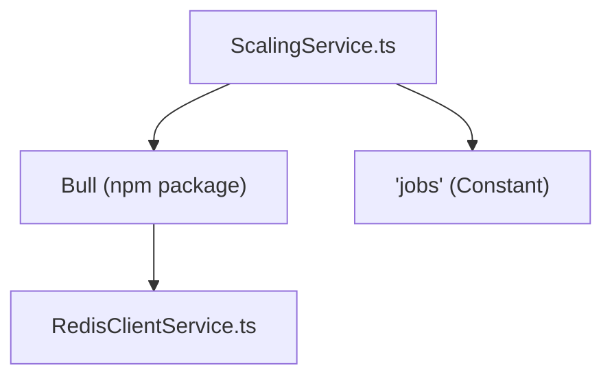
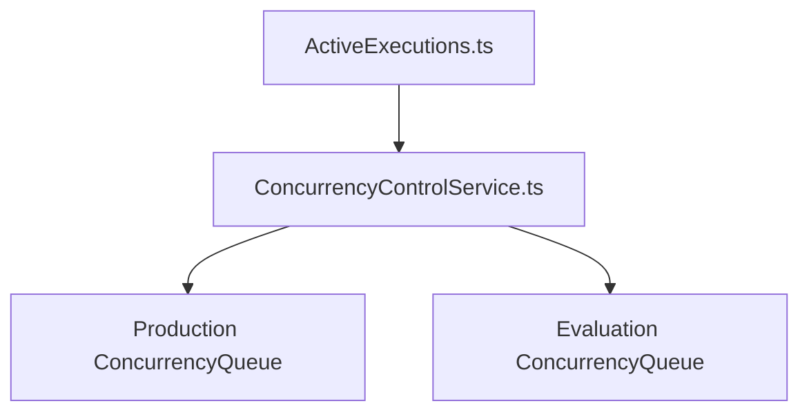

# Distributed Execution and Scaling

Relevant source files

-   [packages/@n8n/backend-common/src/logging/\_\_tests\_\_/logger.test.ts](https://github.com/n8n-io/n8n/blob/88f170b9/packages/@n8n/backend-common/src/logging/__tests__/logger.test.ts)
-   [packages/@n8n/backend-common/src/logging/logger.ts](https://github.com/n8n-io/n8n/blob/88f170b9/packages/@n8n/backend-common/src/logging/logger.ts)
-   [packages/@n8n/benchmark/src/n8n-api-client/n8n-api-client.ts](https://github.com/n8n-io/n8n/blob/88f170b9/packages/@n8n/benchmark/src/n8n-api-client/n8n-api-client.ts)
-   [packages/@n8n/config/src/configs/endpoints.config.ts](https://github.com/n8n-io/n8n/blob/88f170b9/packages/@n8n/config/src/configs/endpoints.config.ts)
-   [packages/@n8n/config/src/configs/executions.config.ts](https://github.com/n8n-io/n8n/blob/88f170b9/packages/@n8n/config/src/configs/executions.config.ts)
-   [packages/@n8n/config/src/configs/scaling-mode.config.ts](https://github.com/n8n-io/n8n/blob/88f170b9/packages/@n8n/config/src/configs/scaling-mode.config.ts)
-   [packages/@n8n/db/src/repositories/\_\_tests\_\_/execution.repository.test.ts](https://github.com/n8n-io/n8n/blob/88f170b9/packages/@n8n/db/src/repositories/__tests__/execution.repository.test.ts)
-   [packages/@n8n/db/src/repositories/execution.repository.ts](https://github.com/n8n-io/n8n/blob/88f170b9/packages/@n8n/db/src/repositories/execution.repository.ts)
-   [packages/@n8n/nodes-langchain/nodes/tools/ToolWorkflow/v2/methods/localResourceMapping.ts](https://github.com/n8n-io/n8n/blob/88f170b9/packages/@n8n/nodes-langchain/nodes/tools/ToolWorkflow/v2/methods/localResourceMapping.ts)
-   [packages/cli/BREAKING-CHANGES.md](https://github.com/n8n-io/n8n/blob/88f170b9/packages/cli/BREAKING-CHANGES.md?plain=1)
-   [packages/cli/src/\_\_tests\_\_/active-executions.test.ts](https://github.com/n8n-io/n8n/blob/88f170b9/packages/cli/src/__tests__/active-executions.test.ts)
-   [packages/cli/src/\_\_tests\_\_/wait-tracker.test.ts](https://github.com/n8n-io/n8n/blob/88f170b9/packages/cli/src/__tests__/wait-tracker.test.ts)
-   [packages/cli/src/\_\_tests\_\_/workflow-execute-additional-data.test.ts](https://github.com/n8n-io/n8n/blob/88f170b9/packages/cli/src/__tests__/workflow-execute-additional-data.test.ts)
-   [packages/cli/src/\_\_tests\_\_/workflow-runner.test.ts](https://github.com/n8n-io/n8n/blob/88f170b9/packages/cli/src/__tests__/workflow-runner.test.ts)
-   [packages/cli/src/abstract-server.ts](https://github.com/n8n-io/n8n/blob/88f170b9/packages/cli/src/abstract-server.ts)
-   [packages/cli/src/active-executions.ts](https://github.com/n8n-io/n8n/blob/88f170b9/packages/cli/src/active-executions.ts)
-   [packages/cli/src/concurrency/\_\_tests\_\_/concurrency-control.service.test.ts](https://github.com/n8n-io/n8n/blob/88f170b9/packages/cli/src/concurrency/__tests__/concurrency-control.service.test.ts)
-   [packages/cli/src/concurrency/\_\_tests\_\_/concurrency-queue.test.ts](https://github.com/n8n-io/n8n/blob/88f170b9/packages/cli/src/concurrency/__tests__/concurrency-queue.test.ts)
-   [packages/cli/src/concurrency/concurrency-control.service.ts](https://github.com/n8n-io/n8n/blob/88f170b9/packages/cli/src/concurrency/concurrency-control.service.ts)
-   [packages/cli/src/concurrency/concurrency-queue.ts](https://github.com/n8n-io/n8n/blob/88f170b9/packages/cli/src/concurrency/concurrency-queue.ts)
-   [packages/cli/src/eventbus/event-message-classes/event-message-node.ts](https://github.com/n8n-io/n8n/blob/88f170b9/packages/cli/src/eventbus/event-message-classes/event-message-node.ts)
-   [packages/cli/src/execution-lifecycle/\_\_tests\_\_/execution-lifecycle-hooks.test.ts](https://github.com/n8n-io/n8n/blob/88f170b9/packages/cli/src/execution-lifecycle/__tests__/execution-lifecycle-hooks.test.ts)
-   [packages/cli/src/execution-lifecycle/execution-lifecycle-hooks.ts](https://github.com/n8n-io/n8n/blob/88f170b9/packages/cli/src/execution-lifecycle/execution-lifecycle-hooks.ts)
-   [packages/cli/src/execution-lifecycle/shared/shared-hook-functions.ts](https://github.com/n8n-io/n8n/blob/88f170b9/packages/cli/src/execution-lifecycle/shared/shared-hook-functions.ts)
-   [packages/cli/src/executions/\_\_tests\_\_/constants.ts](https://github.com/n8n-io/n8n/blob/88f170b9/packages/cli/src/executions/__tests__/constants.ts)
-   [packages/cli/src/executions/\_\_tests\_\_/utils.ts](https://github.com/n8n-io/n8n/blob/88f170b9/packages/cli/src/executions/__tests__/utils.ts)
-   [packages/cli/src/executions/execution-recovery.service.ts](https://github.com/n8n-io/n8n/blob/88f170b9/packages/cli/src/executions/execution-recovery.service.ts)
-   [packages/cli/src/interfaces.ts](https://github.com/n8n-io/n8n/blob/88f170b9/packages/cli/src/interfaces.ts)
-   [packages/cli/src/metrics/\_\_tests\_\_/prometheus-metrics.service.test.ts](https://github.com/n8n-io/n8n/blob/88f170b9/packages/cli/src/metrics/__tests__/prometheus-metrics.service.test.ts)
-   [packages/cli/src/metrics/\_\_tests\_\_/prometheus-metrics.service.unmocked.test.ts](https://github.com/n8n-io/n8n/blob/88f170b9/packages/cli/src/metrics/__tests__/prometheus-metrics.service.unmocked.test.ts)
-   [packages/cli/src/metrics/prometheus-metrics.service.ts](https://github.com/n8n-io/n8n/blob/88f170b9/packages/cli/src/metrics/prometheus-metrics.service.ts)
-   [packages/cli/src/metrics/types.ts](https://github.com/n8n-io/n8n/blob/88f170b9/packages/cli/src/metrics/types.ts)
-   [packages/cli/src/scaling/\_\_tests\_\_/job-processor.service.test.ts](https://github.com/n8n-io/n8n/blob/88f170b9/packages/cli/src/scaling/__tests__/job-processor.service.test.ts)
-   [packages/cli/src/scaling/\_\_tests\_\_/scaling.service.test.ts](https://github.com/n8n-io/n8n/blob/88f170b9/packages/cli/src/scaling/__tests__/scaling.service.test.ts)
-   [packages/cli/src/scaling/\_\_tests\_\_/worker-server.test.ts](https://github.com/n8n-io/n8n/blob/88f170b9/packages/cli/src/scaling/__tests__/worker-server.test.ts)
-   [packages/cli/src/scaling/job-processor.ts](https://github.com/n8n-io/n8n/blob/88f170b9/packages/cli/src/scaling/job-processor.ts)
-   [packages/cli/src/scaling/scaling.service.ts](https://github.com/n8n-io/n8n/blob/88f170b9/packages/cli/src/scaling/scaling.service.ts)
-   [packages/cli/src/scaling/scaling.types.ts](https://github.com/n8n-io/n8n/blob/88f170b9/packages/cli/src/scaling/scaling.types.ts)
-   [packages/cli/src/scaling/worker-server.ts](https://github.com/n8n-io/n8n/blob/88f170b9/packages/cli/src/scaling/worker-server.ts)
-   [packages/cli/src/services/\_\_tests\_\_/redis-client.service.test.ts](https://github.com/n8n-io/n8n/blob/88f170b9/packages/cli/src/services/__tests__/redis-client.service.test.ts)
-   [packages/cli/src/services/redis-client.service.ts](https://github.com/n8n-io/n8n/blob/88f170b9/packages/cli/src/services/redis-client.service.ts)
-   [packages/cli/src/wait-tracker.ts](https://github.com/n8n-io/n8n/blob/88f170b9/packages/cli/src/wait-tracker.ts)
-   [packages/cli/src/webhooks/\_\_tests\_\_/webhook-helpers.test.ts](https://github.com/n8n-io/n8n/blob/88f170b9/packages/cli/src/webhooks/__tests__/webhook-helpers.test.ts)
-   [packages/cli/src/webhooks/webhook-helpers.ts](https://github.com/n8n-io/n8n/blob/88f170b9/packages/cli/src/webhooks/webhook-helpers.ts)
-   [packages/cli/src/workflow-execute-additional-data.ts](https://github.com/n8n-io/n8n/blob/88f170b9/packages/cli/src/workflow-execute-additional-data.ts)
-   [packages/cli/src/workflow-runner.ts](https://github.com/n8n-io/n8n/blob/88f170b9/packages/cli/src/workflow-runner.ts)
-   [packages/cli/src/workflows/\_\_tests\_\_/workflow-execution.service.test.ts](https://github.com/n8n-io/n8n/blob/88f170b9/packages/cli/src/workflows/__tests__/workflow-execution.service.test.ts)
-   [packages/cli/src/workflows/workflow-execution.service.ts](https://github.com/n8n-io/n8n/blob/88f170b9/packages/cli/src/workflows/workflow-execution.service.ts)
-   [packages/cli/src/workflows/workflow.request.ts](https://github.com/n8n-io/n8n/blob/88f170b9/packages/cli/src/workflows/workflow.request.ts)
-   [packages/cli/test/integration/execution.repository.test.ts](https://github.com/n8n-io/n8n/blob/88f170b9/packages/cli/test/integration/execution.repository.test.ts)
-   [packages/cli/test/integration/prometheus-metrics.test.ts](https://github.com/n8n-io/n8n/blob/88f170b9/packages/cli/test/integration/prometheus-metrics.test.ts)
-   [packages/cli/test/integration/shared/db/executions.ts](https://github.com/n8n-io/n8n/blob/88f170b9/packages/cli/test/integration/shared/db/executions.ts)
-   [packages/core/src/execution-engine/node-execution-context/\_\_tests\_\_/local-load-options-context.test.ts](https://github.com/n8n-io/n8n/blob/88f170b9/packages/core/src/execution-engine/node-execution-context/__tests__/local-load-options-context.test.ts)
-   [packages/core/src/execution-engine/node-execution-context/local-load-options-context.ts](https://github.com/n8n-io/n8n/blob/88f170b9/packages/core/src/execution-engine/node-execution-context/local-load-options-context.ts)
-   [packages/frontend/editor-ui/src/app/composables/useBackendStatus.spec.ts](https://github.com/n8n-io/n8n/blob/88f170b9/packages/frontend/editor-ui/src/app/composables/useBackendStatus.spec.ts)
-   [packages/frontend/editor-ui/src/app/composables/useBackendStatus.ts](https://github.com/n8n-io/n8n/blob/88f170b9/packages/frontend/editor-ui/src/app/composables/useBackendStatus.ts)
-   [packages/nodes-base/nodes/ExecuteWorkflow/ExecuteWorkflow/ExecuteWorkflow.node.json](https://github.com/n8n-io/n8n/blob/88f170b9/packages/nodes-base/nodes/ExecuteWorkflow/ExecuteWorkflow/ExecuteWorkflow.node.json)
-   [packages/nodes-base/nodes/ExecuteWorkflow/ExecuteWorkflow/ExecuteWorkflow.node.test.ts](https://github.com/n8n-io/n8n/blob/88f170b9/packages/nodes-base/nodes/ExecuteWorkflow/ExecuteWorkflow/ExecuteWorkflow.node.test.ts)
-   [packages/nodes-base/nodes/ExecuteWorkflow/ExecuteWorkflow/ExecuteWorkflow.node.ts](https://github.com/n8n-io/n8n/blob/88f170b9/packages/nodes-base/nodes/ExecuteWorkflow/ExecuteWorkflow/ExecuteWorkflow.node.ts)
-   [packages/nodes-base/nodes/ExecuteWorkflow/ExecuteWorkflow/methods/localResourceMapping.ts](https://github.com/n8n-io/n8n/blob/88f170b9/packages/nodes-base/nodes/ExecuteWorkflow/ExecuteWorkflow/methods/localResourceMapping.ts)
-   [packages/nodes-base/nodes/ExecuteWorkflow/ExecuteWorkflowTrigger/ExecuteWorkflowTrigger.node.test.ts](https://github.com/n8n-io/n8n/blob/88f170b9/packages/nodes-base/nodes/ExecuteWorkflow/ExecuteWorkflowTrigger/ExecuteWorkflowTrigger.node.test.ts)
-   [packages/nodes-base/nodes/ExecuteWorkflow/ExecuteWorkflowTrigger/ExecuteWorkflowTrigger.node.ts](https://github.com/n8n-io/n8n/blob/88f170b9/packages/nodes-base/nodes/ExecuteWorkflow/ExecuteWorkflowTrigger/ExecuteWorkflowTrigger.node.ts)
-   [packages/nodes-base/utils/workflow-backtracking.test.ts](https://github.com/n8n-io/n8n/blob/88f170b9/packages/nodes-base/utils/workflow-backtracking.test.ts)
-   [packages/nodes-base/utils/workflow-backtracking.ts](https://github.com/n8n-io/n8n/blob/88f170b9/packages/nodes-base/utils/workflow-backtracking.ts)
-   [packages/nodes-base/utils/workflowInputsResourceMapping/GenericFunctions.ts](https://github.com/n8n-io/n8n/blob/88f170b9/packages/nodes-base/utils/workflowInputsResourceMapping/GenericFunctions.ts)
-   [packages/nodes-base/utils/workflowInputsResourceMapping/\_\_tests\_\_/GenericFunctions.test.ts](https://github.com/n8n-io/n8n/blob/88f170b9/packages/nodes-base/utils/workflowInputsResourceMapping/__tests__/GenericFunctions.test.ts)
-   [packages/testing/playwright/pages/ExecutionsPage.ts](https://github.com/n8n-io/n8n/blob/88f170b9/packages/testing/playwright/pages/ExecutionsPage.ts)
-   [packages/testing/playwright/tests/e2e/settings/users/users.spec.ts](https://github.com/n8n-io/n8n/blob/88f170b9/packages/testing/playwright/tests/e2e/settings/users/users.spec.ts)
-   [packages/testing/playwright/tests/e2e/workflows/executions/list.spec.ts](https://github.com/n8n-io/n8n/blob/88f170b9/packages/testing/playwright/tests/e2e/workflows/executions/list.spec.ts)
-   [packages/testing/playwright/workflows/cat-1854-wait-execution-history.json](https://github.com/n8n-io/n8n/blob/88f170b9/packages/testing/playwright/workflows/cat-1854-wait-execution-history.json)
-   [packages/testing/playwright/workflows/webhook-misconfiguration-test.json](https://github.com/n8n-io/n8n/blob/88f170b9/packages/testing/playwright/workflows/webhook-misconfiguration-test.json)

## Purpose and Scope

This document covers n8n's distributed execution architecture, which enables horizontal scaling by distributing workflow executions across multiple worker processes. This includes the queue-based execution system, Bull/Redis integration, worker coordination, concurrency control, and the communication patterns between main and worker processes.

For information about the workflow execution lifecycle within a single process, see **Workflow Execution Lifecycle (2.1)**. For details on the overall runtime architecture including process types, see **Runtime Architecture and Process Models (1.2)**.

---

## Execution Modes Overview

n8n supports two primary execution modes that determine how workflow executions are processed:

| Mode | Description | Use Case |
| --- | --- | --- |
| **Regular** | Workflows execute directly in the main process | Single-instance deployments, development |
| **Queue** | Workflows are enqueued to Redis and processed by worker instances | Production deployments requiring horizontal scaling |

The execution mode is determined by the `EXECUTIONS_MODE` environment variable and accessed via `ExecutionsConfig.mode` [packages/cli/src/workflow-runner.ts95](https://github.com/n8n-io/n8n/blob/88f170b9/packages/cli/src/workflow-runner.ts#L95-L95)

### Mode Selection in WorkflowRunner

When `WorkflowRunner.run()` is called, it decides whether to enqueue or execute directly based on the configuration and execution mode (manual vs. automated) [packages/cli/src/workflow-runner.ts173-176](https://github.com/n8n-io/n8n/blob/88f170b9/packages/cli/src/workflow-runner.ts#L173-L176)

```
const shouldEnqueue =    process.env.OFFLOAD_MANUAL_EXECUTIONS_TO_WORKERS === 'true'        ? this.executionsConfig.mode === 'queue'        : this.executionsConfig.mode === 'queue' && data.executionMode !== 'manual';
```
Sources: [packages/cli/src/workflow-runner.ts95-108](https://github.com/n8n-io/n8n/blob/88f170b9/packages/cli/src/workflow-runner.ts#L95-L108) [packages/cli/src/workflow-runner.ts173-189](https://github.com/n8n-io/n8n/blob/88f170b9/packages/cli/src/workflow-runner.ts#L173-L189)

---

## Queue-Based Architecture

### Bull Queue and Redis

n8n uses [Bull](https://github.com/n8n-io/n8n/blob/88f170b9/Bull) a Redis-backed job queue, to coordinate distributed execution. The queue infrastructure is managed by `ScalingService` [packages/cli/src/scaling/scaling.service.ts40-41](https://github.com/n8n-io/n8n/blob/88f170b9/packages/cli/src/scaling/scaling.service.ts#L40-L41)

**Queue Initialization**

The `ScalingService.setupQueue()` method initializes the Bull instance using the `RedisClientService` to ensure consistent prefixing and connection management [packages/cli/src/scaling/scaling.service.ts60-75](https://github.com/n8n-io/n8n/blob/88f170b9/packages/cli/src/scaling/scaling.service.ts#L60-L75)


Sources: [packages/cli/src/scaling/scaling.service.ts60-75](https://github.com/n8n-io/n8n/blob/88f170b9/packages/cli/src/scaling/scaling.service.ts#L60-L75) [packages/cli/src/scaling/scaling.service.ts24](https://github.com/n8n-io/n8n/blob/88f170b9/packages/cli/src/scaling/scaling.service.ts#L24-L24)

### Job Data Structure

Each job in the queue carries `JobData`, which contains the context necessary for a worker to reconstruct the execution [packages/cli/src/scaling/scaling.types.ts17-23](https://github.com/n8n-io/n8n/blob/88f170b9/packages/cli/src/scaling/scaling.types.ts#L17-L23)

| Field | Type | Description |
| --- | --- | --- |
| `executionId` | string | Unique execution identifier in the database |
| `workflowId` | string | ID of the workflow to execute |
| `loadStaticData` | boolean | If true, worker reloads static data from DB |
| `pushRef` | string? | Reference for UI push updates |

Sources: [packages/cli/src/scaling/scaling.types.ts17-30](https://github.com/n8n-io/n8n/blob/88f170b9/packages/cli/src/scaling/scaling.types.ts#L17-L30)

### Job Lifecycle and Data Flow

> **[Mermaid sequence]**
> *(图表结构无法解析)*

Sources: [packages/cli/src/workflow-runner.ts139-189](https://github.com/n8n-io/n8n/blob/88f170b9/packages/cli/src/workflow-runner.ts#L139-L189) [packages/cli/src/scaling/job-processor.ts72-104](https://github.com/n8n-io/n8n/blob/88f170b9/packages/cli/src/scaling/job-processor.ts#L72-L104) [packages/cli/src/scaling/scaling.service.ts111-134](https://github.com/n8n-io/n8n/blob/88f170b9/packages/cli/src/scaling/scaling.service.ts#L111-L134)

---

## Main Process Responsibilities

### Enqueueing Executions

The `WorkflowRunner.enqueueExecution()` method builds the `JobData` and adds it to the queue via `ScalingService.addJob()` [packages/cli/src/workflow-runner.ts370-410](https://github.com/n8n-io/n8n/blob/88f170b9/packages/cli/src/workflow-runner.ts#L370-L410)

**Priority Logic:**

-   **Realtime (Manual/Chat):** Priority 50 (Higher)
-   **Standard (Triggers):** Priority 100 (Lower)

Sources: [packages/cli/src/workflow-runner.ts396](https://github.com/n8n-io/n8n/blob/88f170b9/packages/cli/src/workflow-runner.ts#L396-L396) [packages/cli/src/scaling/scaling.service.ts226-235](https://github.com/n8n-io/n8n/blob/88f170b9/packages/cli/src/scaling/scaling.service.ts#L226-L235)

### Listening for Worker Progress

Main instances (and Webhook instances) register listeners for `global:progress` events. This allows them to respond to events happening on remote workers [packages/cli/src/scaling/scaling.service.ts300-305](https://github.com/n8n-io/n8n/blob/88f170b9/packages/cli/src/scaling/scaling.service.ts#L300-L305)

**Message Handlers in ScalingService:**

-   `send-chunk`: Forwards streaming data to the UI [packages/cli/src/scaling/scaling.service.ts312-314](https://github.com/n8n-io/n8n/blob/88f170b9/packages/cli/src/scaling/scaling.service.ts#L312-L314)
-   `respond-to-webhook`: Resolves the pending HTTP request in the main process with data generated by the worker [packages/cli/src/scaling/scaling.service.ts316-320](https://github.com/n8n-io/n8n/blob/88f170b9/packages/cli/src/scaling/scaling.service.ts#L316-L320)
-   `job-finished`: Cleans up the local `ActiveExecutions` state [packages/cli/src/scaling/scaling.service.ts340-345](https://github.com/n8n-io/n8n/blob/88f170b9/packages/cli/src/scaling/scaling.service.ts#L340-L345)

Sources: [packages/cli/src/scaling/scaling.service.ts300-370](https://github.com/n8n-io/n8n/blob/88f170b9/packages/cli/src/scaling/scaling.service.ts#L300-L370)

### Queue Recovery

The leader main instance runs `recoverFromQueue()` periodically to handle "dangling" executions (executions marked as `running` in the DB but not present in Redis) [packages/cli/src/scaling/scaling.service.ts458-470](https://github.com/n8n-io/n8n/blob/88f170b9/packages/cli/src/scaling/scaling.service.ts#L458-L470)

**Recovery Mechanism:**

1.  Fetch `running` or `new` executions from `ExecutionRepository` [packages/cli/src/scaling/scaling.service.ts492-495](https://github.com/n8n-io/n8n/blob/88f170b9/packages/cli/src/scaling/scaling.service.ts#L492-L495)
2.  Compare with active jobs in Bull [packages/cli/src/scaling/scaling.service.ts503](https://github.com/n8n-io/n8n/blob/88f170b9/packages/cli/src/scaling/scaling.service.ts#L503-L503)
3.  If an execution is in DB but not in Queue, mark it as `crashed` [packages/cli/src/scaling/scaling.service.ts517-520](https://github.com/n8n-io/n8n/blob/88f170b9/packages/cli/src/scaling/scaling.service.ts#L517-L520)

Sources: [packages/cli/src/scaling/scaling.service.ts490-523](https://github.com/n8n-io/n8n/blob/88f170b9/packages/cli/src/scaling/scaling.service.ts#L490-L523) [packages/cli/src/executions/execution-recovery.service.ts32-43](https://github.com/n8n-io/n8n/blob/88f170b9/packages/cli/src/executions/execution-recovery.service.ts#L32-L43)

---

## Worker Process Responsibilities

### Job Processing in JobProcessor

The `JobProcessor` is the core engine of the worker process. When a job is received, it performs the following steps [packages/cli/src/scaling/job-processor.ts72-150](https://github.com/n8n-io/n8n/blob/88f170b9/packages/cli/src/scaling/job-processor.ts#L72-L150):

1.  **Hydration**: Fetches full execution data from `ExecutionRepository` [packages/cli/src/scaling/job-processor.ts75-78](https://github.com/n8n-io/n8n/blob/88f170b9/packages/cli/src/scaling/job-processor.ts#L75-L78)
2.  **Static Data**: Reloads `staticData` from `WorkflowRepository` if requested [packages/cli/src/scaling/job-processor.ts108-121](https://github.com/n8n-io/n8n/blob/88f170b9/packages/cli/src/scaling/job-processor.ts#L108-L121)
3.  **Timeout Logic**: Calculates execution timeouts based on workflow settings or global config [packages/cli/src/scaling/job-processor.ts125-132](https://github.com/n8n-io/n8n/blob/88f170b9/packages/cli/src/scaling/job-processor.ts#L125-L132)
4.  **Lifecycle Hooks**: Initializes `getLifecycleHooksForScalingWorker` to handle remote communication [packages/cli/src/scaling/job-processor.ts155-165](https://github.com/n8n-io/n8n/blob/88f170b9/packages/cli/src/scaling/job-processor.ts#L155-L165)

### Remote Hook Handlers

Workers use specialized hooks to "call back" to the main process via Redis progress updates:

-   **sendResponse**: Used by Webhook nodes to send data back to the waiting HTTP request on the Main/Webhook process [packages/cli/src/scaling/job-processor.ts172-198](https://github.com/n8n-io/n8n/blob/88f170b9/packages/cli/src/scaling/job-processor.ts#L172-L198)
-   **sendChunk**: Used for streaming AI/LLM responses [packages/cli/src/scaling/job-processor.ts200-209](https://github.com/n8n-io/n8n/blob/88f170b9/packages/cli/src/scaling/job-processor.ts#L200-L209)

Sources: [packages/cli/src/scaling/job-processor.ts172-209](https://github.com/n8n-io/n8n/blob/88f170b9/packages/cli/src/scaling/job-processor.ts#L172-L209) [packages/cli/src/execution-lifecycle/execution-lifecycle-hooks.ts331-392](https://github.com/n8n-io/n8n/blob/88f170b9/packages/cli/src/execution-lifecycle/execution-lifecycle-hooks.ts#L331-L392)

---

## Concurrency Control

n8n implements a throttling mechanism to limit simultaneous executions, primarily used in **Regular Mode**.

### ConcurrencyControlService

The `ConcurrencyControlService` manages two queues: `production` and `evaluation` [packages/cli/src/concurrency/concurrency-control.service.ts26-34](https://github.com/n8n-io/n8n/blob/88f170b9/packages/cli/src/concurrency/concurrency-control.service.ts#L26-L34)

-   **Production**: Trigger-based executions.
-   **Evaluation**: Manual "Test Workflow" executions.


**Note:** In `queue` mode, concurrency is primarily managed by the number of worker processes and the Bull concurrency setting passed to `setupWorker(concurrency)` [packages/cli/src/scaling/scaling.service.ts111-115](https://github.com/n8n-io/n8n/blob/88f170b9/packages/cli/src/scaling/scaling.service.ts#L111-L115)

Sources: [packages/cli/src/concurrency/concurrency-control.service.ts15-77](https://github.com/n8n-io/n8n/blob/88f170b9/packages/cli/src/concurrency/concurrency-control.service.ts#L15-L77) [packages/cli/src/concurrency/concurrency-queue.ts1-30](https://github.com/n8n-io/n8n/blob/88f170b9/packages/cli/src/concurrency/concurrency-queue.ts#L1-L30)

---

## Orchestration and Multi-Main

### Leader Election

In a multi-main setup, n8n uses leader election to ensure singleton tasks (like queue recovery) only run on one instance [packages/cli/src/scaling/scaling.service.ts79](https://github.com/n8n-io/n8n/blob/88f170b9/packages/cli/src/scaling/scaling.service.ts#L79-L79)

-   **InstanceSettings**: Tracks if the current process is the leader [packages/cli/src/scaling/scaling.service.ts79](https://github.com/n8n-io/n8n/blob/88f170b9/packages/cli/src/scaling/scaling.service.ts#L79-L79)
-   **Decorators**: `@OnLeaderTakeover` and `@OnLeaderStepdown` are used to start/stop the recovery scheduler [packages/cli/src/scaling/scaling.service.ts5](https://github.com/n8n-io/n8n/blob/88f170b9/packages/cli/src/scaling/scaling.service.ts#L5-L5)

Sources: [packages/cli/src/scaling/scaling.service.ts79-81](https://github.com/n8n-io/n8n/blob/88f170b9/packages/cli/src/scaling/scaling.service.ts#L79-L81) [packages/cli/src/scaling/scaling.service.ts474-488](https://github.com/n8n-io/n8n/blob/88f170b9/packages/cli/src/scaling/scaling.service.ts#L474-L488)

### Graceful Shutdown

During shutdown, the `ScalingService` ensures jobs are not lost [packages/cli/src/scaling/scaling.service.ts163-169](https://github.com/n8n-io/n8n/blob/88f170b9/packages/cli/src/scaling/scaling.service.ts#L163-L169):

1.  **Main**: Pauses the queue and stops recovery timers [packages/cli/src/scaling/scaling.service.ts176-181](https://github.com/n8n-io/n8n/blob/88f170b9/packages/cli/src/scaling/scaling.service.ts#L176-L181)
2.  **Worker**: Pauses the queue and waits for all `runningJobs` to reach zero before exiting [packages/cli/src/scaling/scaling.service.ts183-197](https://github.com/n8n-io/n8n/blob/88f170b9/packages/cli/src/scaling/scaling.service.ts#L183-L197)

Sources: [packages/cli/src/scaling/scaling.service.ts163-197](https://github.com/n8n-io/n8n/blob/88f170b9/packages/cli/src/scaling/scaling.service.ts#L163-L197) [packages/cli/src/scaling/job-processor.ts57](https://github.com/n8n-io/n8n/blob/88f170b9/packages/cli/src/scaling/job-processor.ts#L57-L57)
