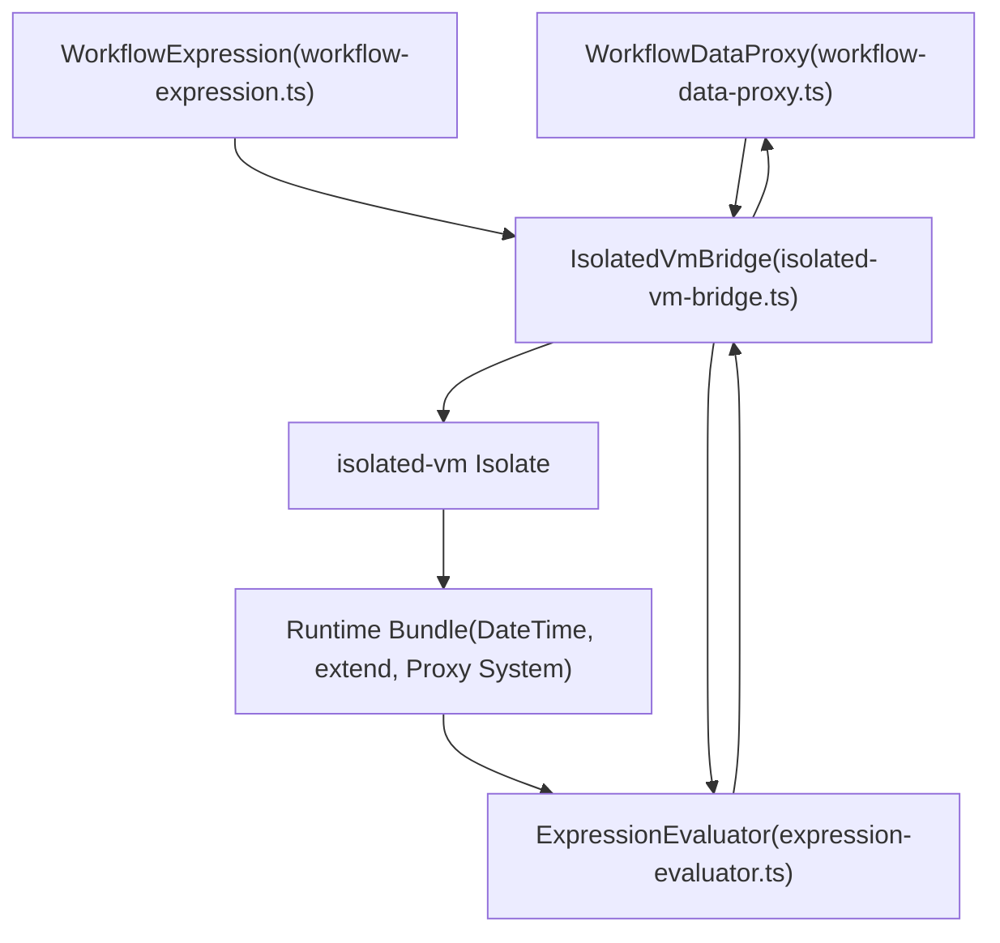
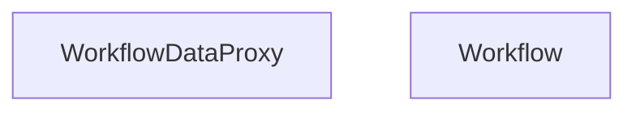
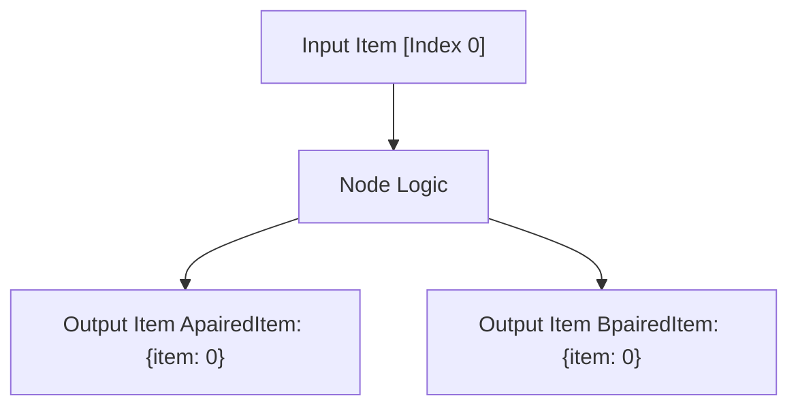

# Workflow Data Access and Expression System

Relevant source files

-   [packages/@n8n/expression-runtime/ARCHITECTURE.md](https://github.com/n8n-io/n8n/blob/88f170b9/packages/@n8n/expression-runtime/ARCHITECTURE.md?plain=1)
-   [packages/@n8n/expression-runtime/README.md](https://github.com/n8n-io/n8n/blob/88f170b9/packages/@n8n/expression-runtime/README.md?plain=1)
-   [packages/@n8n/expression-runtime/docs/architecture-diagram.mmd](https://github.com/n8n-io/n8n/blob/88f170b9/packages/@n8n/expression-runtime/docs/architecture-diagram.mmd)
-   [packages/@n8n/expression-runtime/docs/deep-lazy-proxy.md](https://github.com/n8n-io/n8n/blob/88f170b9/packages/@n8n/expression-runtime/docs/deep-lazy-proxy.md?plain=1)
-   [packages/@n8n/expression-runtime/docs/implementation-phases.md](https://github.com/n8n-io/n8n/blob/88f170b9/packages/@n8n/expression-runtime/docs/implementation-phases.md?plain=1)
-   [packages/@n8n/expression-runtime/esbuild.config.js](https://github.com/n8n-io/n8n/blob/88f170b9/packages/@n8n/expression-runtime/esbuild.config.js)
-   [packages/@n8n/expression-runtime/package.json](https://github.com/n8n-io/n8n/blob/88f170b9/packages/@n8n/expression-runtime/package.json)
-   [packages/@n8n/expression-runtime/src/\_\_tests\_\_/integration.test.ts](https://github.com/n8n-io/n8n/blob/88f170b9/packages/@n8n/expression-runtime/src/__tests__/integration.test.ts)
-   [packages/@n8n/expression-runtime/src/bridge/isolated-vm-bridge.ts](https://github.com/n8n-io/n8n/blob/88f170b9/packages/@n8n/expression-runtime/src/bridge/isolated-vm-bridge.ts)
-   [packages/@n8n/expression-runtime/src/evaluator/\_\_tests\_\_/expression-evaluator-cache.test.ts](https://github.com/n8n-io/n8n/blob/88f170b9/packages/@n8n/expression-runtime/src/evaluator/__tests__/expression-evaluator-cache.test.ts)
-   [packages/@n8n/expression-runtime/src/evaluator/\_\_tests\_\_/lru-cache.test.ts](https://github.com/n8n-io/n8n/blob/88f170b9/packages/@n8n/expression-runtime/src/evaluator/__tests__/lru-cache.test.ts)
-   [packages/@n8n/expression-runtime/src/evaluator/expression-evaluator.ts](https://github.com/n8n-io/n8n/blob/88f170b9/packages/@n8n/expression-runtime/src/evaluator/expression-evaluator.ts)
-   [packages/@n8n/expression-runtime/src/evaluator/lru-cache.ts](https://github.com/n8n-io/n8n/blob/88f170b9/packages/@n8n/expression-runtime/src/evaluator/lru-cache.ts)
-   [packages/@n8n/expression-runtime/src/extensions/\_\_tests\_\_/string-extensions.test.ts](https://github.com/n8n-io/n8n/blob/88f170b9/packages/@n8n/expression-runtime/src/extensions/__tests__/string-extensions.test.ts)
-   [packages/@n8n/expression-runtime/src/extensions/array-extensions.ts](https://github.com/n8n-io/n8n/blob/88f170b9/packages/@n8n/expression-runtime/src/extensions/array-extensions.ts)
-   [packages/@n8n/expression-runtime/src/extensions/boolean-extensions.ts](https://github.com/n8n-io/n8n/blob/88f170b9/packages/@n8n/expression-runtime/src/extensions/boolean-extensions.ts)
-   [packages/@n8n/expression-runtime/src/extensions/date-extensions.ts](https://github.com/n8n-io/n8n/blob/88f170b9/packages/@n8n/expression-runtime/src/extensions/date-extensions.ts)
-   [packages/@n8n/expression-runtime/src/extensions/expression-extension-error.ts](https://github.com/n8n-io/n8n/blob/88f170b9/packages/@n8n/expression-runtime/src/extensions/expression-extension-error.ts)
-   [packages/@n8n/expression-runtime/src/extensions/extend.ts](https://github.com/n8n-io/n8n/blob/88f170b9/packages/@n8n/expression-runtime/src/extensions/extend.ts)
-   [packages/@n8n/expression-runtime/src/extensions/extensions.ts](https://github.com/n8n-io/n8n/blob/88f170b9/packages/@n8n/expression-runtime/src/extensions/extensions.ts)
-   [packages/@n8n/expression-runtime/src/extensions/function-extensions.ts](https://github.com/n8n-io/n8n/blob/88f170b9/packages/@n8n/expression-runtime/src/extensions/function-extensions.ts)
-   [packages/@n8n/expression-runtime/src/extensions/number-extensions.ts](https://github.com/n8n-io/n8n/blob/88f170b9/packages/@n8n/expression-runtime/src/extensions/number-extensions.ts)
-   [packages/@n8n/expression-runtime/src/extensions/object-extensions.ts](https://github.com/n8n-io/n8n/blob/88f170b9/packages/@n8n/expression-runtime/src/extensions/object-extensions.ts)
-   [packages/@n8n/expression-runtime/src/extensions/string-extensions.ts](https://github.com/n8n-io/n8n/blob/88f170b9/packages/@n8n/expression-runtime/src/extensions/string-extensions.ts)
-   [packages/@n8n/expression-runtime/src/index.ts](https://github.com/n8n-io/n8n/blob/88f170b9/packages/@n8n/expression-runtime/src/index.ts)
-   [packages/@n8n/expression-runtime/src/runtime/\_\_tests\_\_/lazy-proxy.test.ts](https://github.com/n8n-io/n8n/blob/88f170b9/packages/@n8n/expression-runtime/src/runtime/__tests__/lazy-proxy.test.ts)
-   [packages/@n8n/expression-runtime/src/runtime/index.ts](https://github.com/n8n-io/n8n/blob/88f170b9/packages/@n8n/expression-runtime/src/runtime/index.ts)
-   [packages/@n8n/expression-runtime/src/runtime/lazy-proxy.ts](https://github.com/n8n-io/n8n/blob/88f170b9/packages/@n8n/expression-runtime/src/runtime/lazy-proxy.ts)
-   [packages/@n8n/expression-runtime/src/runtime/reset.ts](https://github.com/n8n-io/n8n/blob/88f170b9/packages/@n8n/expression-runtime/src/runtime/reset.ts)
-   [packages/@n8n/expression-runtime/src/runtime/safe-globals.ts](https://github.com/n8n-io/n8n/blob/88f170b9/packages/@n8n/expression-runtime/src/runtime/safe-globals.ts)
-   [packages/@n8n/expression-runtime/src/runtime/serialize.ts](https://github.com/n8n-io/n8n/blob/88f170b9/packages/@n8n/expression-runtime/src/runtime/serialize.ts)
-   [packages/@n8n/expression-runtime/src/types/bridge.ts](https://github.com/n8n-io/n8n/blob/88f170b9/packages/@n8n/expression-runtime/src/types/bridge.ts)
-   [packages/@n8n/expression-runtime/src/types/evaluator.ts](https://github.com/n8n-io/n8n/blob/88f170b9/packages/@n8n/expression-runtime/src/types/evaluator.ts)
-   [packages/@n8n/expression-runtime/src/types/index.ts](https://github.com/n8n-io/n8n/blob/88f170b9/packages/@n8n/expression-runtime/src/types/index.ts)
-   [packages/@n8n/expression-runtime/src/types/runtime.ts](https://github.com/n8n-io/n8n/blob/88f170b9/packages/@n8n/expression-runtime/src/types/runtime.ts)
-   [packages/cli/bin/n8n](https://github.com/n8n-io/n8n/blob/88f170b9/packages/cli/bin/n8n)
-   [packages/cli/src/commands/audit.ts](https://github.com/n8n-io/n8n/blob/88f170b9/packages/cli/src/commands/audit.ts)
-   [packages/cli/src/services/cache/cache.types.ts](https://github.com/n8n-io/n8n/blob/88f170b9/packages/cli/src/services/cache/cache.types.ts)
-   [packages/core/src/execution-engine/partial-execution-utils/\_\_tests\_\_/clean-run-data.test.ts](https://github.com/n8n-io/n8n/blob/88f170b9/packages/core/src/execution-engine/partial-execution-utils/__tests__/clean-run-data.test.ts)
-   [packages/core/src/execution-engine/partial-execution-utils/clean-run-data.ts](https://github.com/n8n-io/n8n/blob/88f170b9/packages/core/src/execution-engine/partial-execution-utils/clean-run-data.ts)
-   [packages/frontend/editor-ui/vite/expression-runtime-stub.ts](https://github.com/n8n-io/n8n/blob/88f170b9/packages/frontend/editor-ui/vite/expression-runtime-stub.ts)
-   [packages/testing/performance/benchmarks/expression-engine/fixtures/data.ts](https://github.com/n8n-io/n8n/blob/88f170b9/packages/testing/performance/benchmarks/expression-engine/fixtures/data.ts)
-   [packages/workflow/src/errors/expression.error.ts](https://github.com/n8n-io/n8n/blob/88f170b9/packages/workflow/src/errors/expression.error.ts)
-   [packages/workflow/src/expression.ts](https://github.com/n8n-io/n8n/blob/88f170b9/packages/workflow/src/expression.ts)
-   [packages/workflow/src/extensions/extended-functions.ts](https://github.com/n8n-io/n8n/blob/88f170b9/packages/workflow/src/extensions/extended-functions.ts)
-   [packages/workflow/src/workflow-data-proxy.ts](https://github.com/n8n-io/n8n/blob/88f170b9/packages/workflow/src/workflow-data-proxy.ts)
-   [packages/workflow/src/workflow.ts](https://github.com/n8n-io/n8n/blob/88f170b9/packages/workflow/src/workflow.ts)
-   [packages/workflow/test/ExpressionExtensions/array-extensions.test.ts](https://github.com/n8n-io/n8n/blob/88f170b9/packages/workflow/test/ExpressionExtensions/array-extensions.test.ts)
-   [packages/workflow/test/ExpressionExtensions/date-extensions.test.ts](https://github.com/n8n-io/n8n/blob/88f170b9/packages/workflow/test/ExpressionExtensions/date-extensions.test.ts)
-   [packages/workflow/test/ExpressionExtensions/helpers.ts](https://github.com/n8n-io/n8n/blob/88f170b9/packages/workflow/test/ExpressionExtensions/helpers.ts)
-   [packages/workflow/test/ExpressionExtensions/object-extensions.test.ts](https://github.com/n8n-io/n8n/blob/88f170b9/packages/workflow/test/ExpressionExtensions/object-extensions.test.ts)
-   [packages/workflow/test/ExpressionExtensions/string-extensions.test.ts](https://github.com/n8n-io/n8n/blob/88f170b9/packages/workflow/test/ExpressionExtensions/string-extensions.test.ts)
-   [packages/workflow/test/expression.test.ts](https://github.com/n8n-io/n8n/blob/88f170b9/packages/workflow/test/expression.test.ts)
-   [packages/workflow/test/fixtures/WorkflowDataProxy/agentInfo\_run.json](https://github.com/n8n-io/n8n/blob/88f170b9/packages/workflow/test/fixtures/WorkflowDataProxy/agentInfo_run.json)
-   [packages/workflow/test/fixtures/WorkflowDataProxy/agentInfo\_workflow.json](https://github.com/n8n-io/n8n/blob/88f170b9/packages/workflow/test/fixtures/WorkflowDataProxy/agentInfo_workflow.json)
-   [packages/workflow/test/fixtures/WorkflowDataProxy/memory\_with\_disconnected\_tool\_run.json](https://github.com/n8n-io/n8n/blob/88f170b9/packages/workflow/test/fixtures/WorkflowDataProxy/memory_with_disconnected_tool_run.json)
-   [packages/workflow/test/fixtures/WorkflowDataProxy/memory\_with\_disconnected\_tool\_workflow.json](https://github.com/n8n-io/n8n/blob/88f170b9/packages/workflow/test/fixtures/WorkflowDataProxy/memory_with_disconnected_tool_workflow.json)
-   [packages/workflow/test/fixtures/WorkflowDataProxy/multiple\_inputs\_run.json](https://github.com/n8n-io/n8n/blob/88f170b9/packages/workflow/test/fixtures/WorkflowDataProxy/multiple_inputs_run.json)
-   [packages/workflow/test/fixtures/WorkflowDataProxy/multiple\_inputs\_workflow.json](https://github.com/n8n-io/n8n/blob/88f170b9/packages/workflow/test/fixtures/WorkflowDataProxy/multiple_inputs_workflow.json)
-   [packages/workflow/test/workflow-data-proxy.test.ts](https://github.com/n8n-io/n8n/blob/88f170b9/packages/workflow/test/workflow-data-proxy.test.ts)
-   [packages/workflow/test/workflow.test.ts](https://github.com/n8n-io/n8n/blob/88f170b9/packages/workflow/test/workflow.test.ts)

## Purpose and Scope

This document details how workflows access and manipulate data during execution. It covers the `WorkflowDataProxy` system that abstracts node data, the high-performance `expression-runtime` package with `isolated-vm` sandboxing, and the `WorkflowExecuteAdditionalData` context provided to nodes.

For information about the overall execution lifecycle and `WorkflowRunner`, see [Workflow Execution Lifecycle](https://github.com/n8n-io/n8n/blob/88f170b9/Workflow Execution Lifecycle) For distributed execution patterns, see [Distributed Execution and Scaling](https://github.com/n8n-io/n8n/blob/88f170b9/Distributed Execution and Scaling)

---

## Expression Language Architecture

n8n uses a template expression language allowing workflows to dynamically reference data using `{{ }}` syntax. In modern versions, this is powered by a dedicated `@n8n/expression-runtime` package that provides secure, sandboxed evaluation.

### Expression Evaluation Flow

**Key Components**

-   **WorkflowDataProxy**: Acts as the "Source of Truth" for an expression. it resolves paths like `$json.email` by looking into the `runExecutionData` or `connectionInputData` [packages/workflow/src/workflow-data-proxy.ts55-78](https://github.com/n8n-io/n8n/blob/88f170b9/packages/workflow/src/workflow-data-proxy.ts#L55-L78)
-   **IsolatedVmBridge**: Manages a V8 `isolated-vm` instance. It handles the transfer of data across the memory boundary between the main Node.js process and the sandbox [packages/@n8n/expression-runtime/src/bridge/isolated-vm-bridge.ts55-86](https://github.com/n8n-io/n8n/blob/88f170b9/packages/@n8n/expression-runtime/src/bridge/isolated-vm-bridge.ts#L55-L86)
-   **ExpressionEvaluator**: Compiles and executes the JavaScript inside the `{{ }}` blocks within the sandbox [packages/@n8n/expression-runtime/src/evaluator/expression-evaluator.ts16-30](https://github.com/n8n-io/n8n/blob/88f170b9/packages/@n8n/expression-runtime/src/evaluator/expression-evaluator.ts#L16-L30)

Sources: [packages/workflow/src/workflow-data-proxy.ts55-91](https://github.com/n8n-io/n8n/blob/88f170b9/packages/workflow/src/workflow-data-proxy.ts#L55-L91) [packages/@n8n/expression-runtime/src/bridge/isolated-vm-bridge.ts55-134](https://github.com/n8n-io/n8n/blob/88f170b9/packages/@n8n/expression-runtime/src/bridge/isolated-vm-bridge.ts#L55-L134) [packages/workflow/src/expression.ts176-208](https://github.com/n8n-io/n8n/blob/88f170b9/packages/workflow/src/expression.ts#L176-L208)

---

## WorkflowDataProxy System

The `WorkflowDataProxy` is responsible for providing nodes and expressions with access to workflow context. It uses JavaScript Proxies to lazily resolve data only when requested.

### Data Resolution Logic

The proxy handles several namespaces:

-   **$json / $binary**: Accesses data from the current item being processed [packages/workflow/src/workflow-data-proxy.ts102-111](https://github.com/n8n-io/n8n/blob/88f170b9/packages/workflow/src/workflow-data-proxy.ts#L102-L111)
-   **$node\["Node Name"\]**: Accesses data from a specific named node [packages/workflow/src/workflow-data-proxy.ts119-166](https://github.com/n8n-io/n8n/blob/88f170b9/packages/workflow/src/workflow-data-proxy.ts#L119-L166)
-   **$parameter**: Accesses parameters of the active node [packages/workflow/src/workflow-data-proxy.ts70-71](https://github.com/n8n-io/n8n/blob/88f170b9/packages/workflow/src/workflow-data-proxy.ts#L70-L71)
-   **$vars**: Accesses workflow-level variables [packages/workflow/src/workflow.ts82-83](https://github.com/n8n-io/n8n/blob/88f170b9/packages/workflow/src/workflow.ts#L82-L83)

### Item Matching and Paired Items

When a node has multiple inputs (like a Merge node), the proxy uses `pairedItem` data to ensure expressions resolve to the correct corresponding item from the previous nodes [packages/workflow/src/workflow-data-proxy.ts46-53](https://github.com/n8n-io/n8n/blob/88f170b9/packages/workflow/src/workflow-data-proxy.ts#L46-L53)

Sources: [packages/workflow/src/workflow-data-proxy.ts55-91](https://github.com/n8n-io/n8n/blob/88f170b9/packages/workflow/src/workflow-data-proxy.ts#L55-L91) [packages/workflow/src/workflow.ts59-87](https://github.com/n8n-io/n8n/blob/88f170b9/packages/workflow/src/workflow.ts#L59-L87)

---

## Sandboxed Execution (isolated-vm)

To prevent Remote Code Execution (RCE), expressions are evaluated in a separate V8 Isolate. This provides hard memory limits and prevents access to Node.js built-ins like `require` or `process`.

### Security Hardening

The system implements "Safe Globals" by wrapping standard JS objects in proxies that block dangerous methods (e.g., `Error.prepareStackTrace` which can be used to escape sandboxes) [packages/workflow/src/expression.ts124-152](https://github.com/n8n-io/n8n/blob/88f170b9/packages/workflow/src/expression.ts#L124-L152)

| Blocked Method | Reason |
| --- | --- |
| `Error.prepareStackTrace` | Can be exploited to get a reference to the real global object [packages/workflow/src/expression.ts124-132](https://github.com/n8n-io/n8n/blob/88f170b9/packages/workflow/src/expression.ts#L124-L132) |
| `Object.defineProperty` | Prevents bypassing property access checks [packages/workflow/src/expression.ts53-61](https://github.com/n8n-io/n8n/blob/88f170b9/packages/workflow/src/expression.ts#L53-L61) |
| `captureStackTrace` | V8 stack trace manipulation security risk [packages/workflow/src/expression.ts111-121](https://github.com/n8n-io/n8n/blob/88f170b9/packages/workflow/src/expression.ts#L111-L121) |

### Runtime Initialization

Before each evaluation, the `resetDataProxies()` function is called inside the isolate to clear caches and initialize fresh references to `$json`, `$node`, etc. [packages/@n8n/expression-runtime/src/runtime/reset.ts35-54](https://github.com/n8n-io/n8n/blob/88f170b9/packages/@n8n/expression-runtime/src/runtime/reset.ts#L35-L54)

Sources: [packages/workflow/src/expression.ts62-105](https://github.com/n8n-io/n8n/blob/88f170b9/packages/workflow/src/expression.ts#L62-L105) [packages/workflow/src/expression.ts133-152](https://github.com/n8n-io/n8n/blob/88f170b9/packages/workflow/src/expression.ts#L133-L152) [packages/@n8n/expression-runtime/src/runtime/reset.ts35-130](https://github.com/n8n-io/n8n/blob/88f170b9/packages/@n8n/expression-runtime/src/runtime/reset.ts#L35-L130)

---

## WorkflowExecuteAdditionalData

This object is the primary bridge between the execution engine and the node's `execute()` method. It contains helper functions and workflow-specific metadata.

### Core Functions and Context

Nodes access this via `this.helpers` or `this.workflow`. Key capabilities include:

-   **Credentials**: Resolving and decrypting credentials via `credentialsHelper` [packages/workflow/src/interfaces.ts2134-2140](https://github.com/n8n-io/n8n/blob/88f170b9/packages/workflow/src/interfaces.ts#L2134-L2140)
-   **Sub-workflows**: Triggering other workflows via `executeWorkflow` [packages/workflow/src/interfaces.ts2145-2150](https://github.com/n8n-io/n8n/blob/88f170b9/packages/workflow/src/interfaces.ts#L2145-L2150)
-   **Static Data**: Accessing persistent workflow state that survives between executions [packages/workflow/src/workflow.ts218-233](https://github.com/n8n-io/n8n/blob/88f170b9/packages/workflow/src/workflow.ts#L218-L233)

### Sub-Workflow Execution

When a node calls `executeWorkflow`, the system:

1.  Loads the sub-workflow definition [packages/workflow/src/workflow.ts93-119](https://github.com/n8n-io/n8n/blob/88f170b9/packages/workflow/src/workflow.ts#L93-L119)
2.  Passes the current item data as the input to the sub-workflow's trigger [packages/workflow/src/workflow-data-proxy.ts26-29](https://github.com/n8n-io/n8n/blob/88f170b9/packages/workflow/src/workflow-data-proxy.ts#L26-L29)
3.  Returns the results of the sub-workflow's last node back to the parent [packages/workflow/src/workflow.ts165-208](https://github.com/n8n-io/n8n/blob/88f170b9/packages/workflow/src/workflow.ts#L165-L208)

Sources: [packages/workflow/src/workflow.ts88-135](https://github.com/n8n-io/n8n/blob/88f170b9/packages/workflow/src/workflow.ts#L88-L135) [packages/workflow/src/workflow.ts218-245](https://github.com/n8n-io/n8n/blob/88f170b9/packages/workflow/src/workflow.ts#L218-L245) [packages/workflow/src/interfaces.ts2130-2160](https://github.com/n8n-io/n8n/blob/88f170b9/packages/workflow/src/interfaces.ts#L2130-L2160)

---

## Data Transformation and Item Linking

n8n tracks the lineage of data items through `pairedItem`. This allows a node to know exactly which input item produced a specific output item, even after complex transformations.

### Paired Item Tracking

The `IPairedItemData` interface tracks the source item index and input index [packages/workflow/src/interfaces.ts1044-1049](https://github.com/n8n-io/n8n/blob/88f170b9/packages/workflow/src/interfaces.ts#L1044-L1049)

The `WorkflowDataProxy` uses this data during expression evaluation to resolve `$node["Previous Node"].json` to the specific item that matches the current one, rather than just the first item [packages/workflow/src/workflow-data-proxy.ts46-53](https://github.com/n8n-io/n8n/blob/88f170b9/packages/workflow/src/workflow-data-proxy.ts#L46-L53)

Sources: [packages/workflow/src/workflow-data-proxy.ts46-53](https://github.com/n8n-io/n8n/blob/88f170b9/packages/workflow/src/workflow-data-proxy.ts#L46-L53) [packages/workflow/src/interfaces.ts1044-1049](https://github.com/n8n-io/n8n/blob/88f170b9/packages/workflow/src/interfaces.ts#L1044-L1049)
