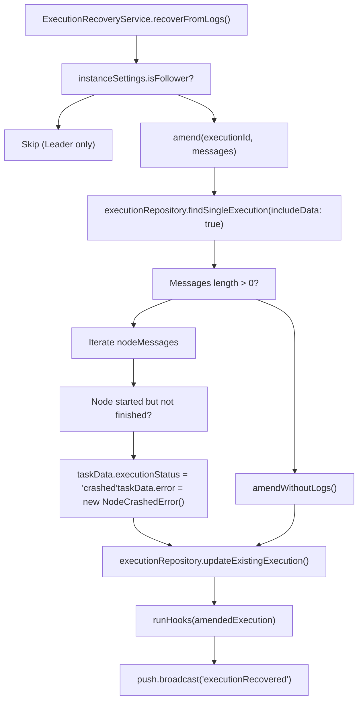
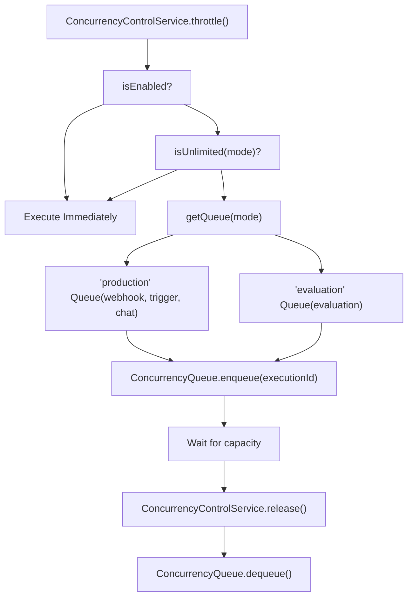
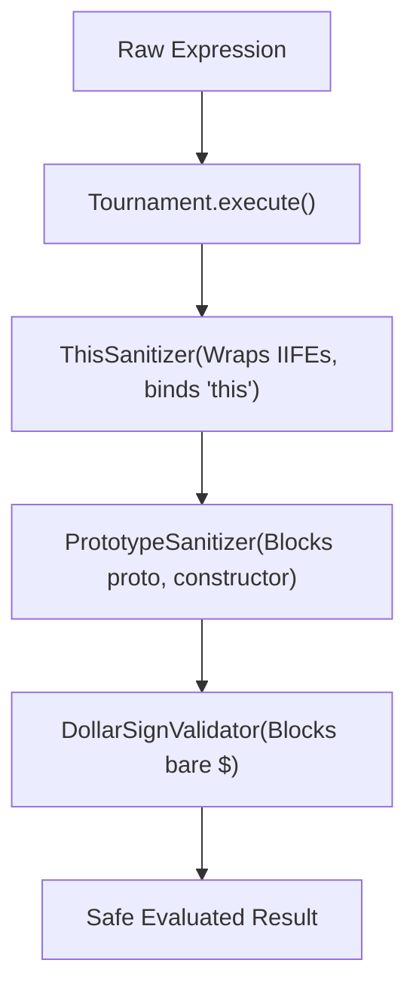

# Execution Recovery and Error Handling

Relevant source files

-   [packages/@n8n/config/src/configs/executions.config.ts](https://github.com/n8n-io/n8n/blob/88f170b9/packages/@n8n/config/src/configs/executions.config.ts)
-   [packages/@n8n/db/src/entities/types-db.ts](https://github.com/n8n-io/n8n/blob/88f170b9/packages/@n8n/db/src/entities/types-db.ts)
-   [packages/@n8n/nodes-langchain/nodes/tools/ToolWorkflow/v2/methods/localResourceMapping.ts](https://github.com/n8n-io/n8n/blob/88f170b9/packages/@n8n/nodes-langchain/nodes/tools/ToolWorkflow/v2/methods/localResourceMapping.ts)
-   [packages/cli/src/concurrency/\_\_tests\_\_/concurrency-control.service.test.ts](https://github.com/n8n-io/n8n/blob/88f170b9/packages/cli/src/concurrency/__tests__/concurrency-control.service.test.ts)
-   [packages/cli/src/concurrency/\_\_tests\_\_/concurrency-queue.test.ts](https://github.com/n8n-io/n8n/blob/88f170b9/packages/cli/src/concurrency/__tests__/concurrency-queue.test.ts)
-   [packages/cli/src/concurrency/concurrency-control.service.ts](https://github.com/n8n-io/n8n/blob/88f170b9/packages/cli/src/concurrency/concurrency-control.service.ts)
-   [packages/cli/src/concurrency/concurrency-queue.ts](https://github.com/n8n-io/n8n/blob/88f170b9/packages/cli/src/concurrency/concurrency-queue.ts)
-   [packages/cli/src/errors/aborted-execution-retry.error.ts](https://github.com/n8n-io/n8n/blob/88f170b9/packages/cli/src/errors/aborted-execution-retry.error.ts)
-   [packages/cli/src/errors/missing-execution-stop.error.ts](https://github.com/n8n-io/n8n/blob/88f170b9/packages/cli/src/errors/missing-execution-stop.error.ts)
-   [packages/cli/src/eventbus/event-message-classes/event-message-node.ts](https://github.com/n8n-io/n8n/blob/88f170b9/packages/cli/src/eventbus/event-message-classes/event-message-node.ts)
-   [packages/cli/src/executions/\_\_tests\_\_/constants.ts](https://github.com/n8n-io/n8n/blob/88f170b9/packages/cli/src/executions/__tests__/constants.ts)
-   [packages/cli/src/executions/\_\_tests\_\_/execution.service.test.ts](https://github.com/n8n-io/n8n/blob/88f170b9/packages/cli/src/executions/__tests__/execution.service.test.ts)
-   [packages/cli/src/executions/\_\_tests\_\_/executions.controller.test.ts](https://github.com/n8n-io/n8n/blob/88f170b9/packages/cli/src/executions/__tests__/executions.controller.test.ts)
-   [packages/cli/src/executions/\_\_tests\_\_/utils.ts](https://github.com/n8n-io/n8n/blob/88f170b9/packages/cli/src/executions/__tests__/utils.ts)
-   [packages/cli/src/executions/execution-recovery.service.ts](https://github.com/n8n-io/n8n/blob/88f170b9/packages/cli/src/executions/execution-recovery.service.ts)
-   [packages/cli/src/executions/execution.service.ts](https://github.com/n8n-io/n8n/blob/88f170b9/packages/cli/src/executions/execution.service.ts)
-   [packages/cli/src/executions/execution.types.ts](https://github.com/n8n-io/n8n/blob/88f170b9/packages/cli/src/executions/execution.types.ts)
-   [packages/cli/src/executions/executions.controller.ts](https://github.com/n8n-io/n8n/blob/88f170b9/packages/cli/src/executions/executions.controller.ts)
-   [packages/cli/src/services/naming.service.ts](https://github.com/n8n-io/n8n/blob/88f170b9/packages/cli/src/services/naming.service.ts)
-   [packages/cli/test/integration/database/repositories/execution.repository.test.ts](https://github.com/n8n-io/n8n/blob/88f170b9/packages/cli/test/integration/database/repositories/execution.repository.test.ts)
-   [packages/cli/test/integration/execution.service.integration.test.ts](https://github.com/n8n-io/n8n/blob/88f170b9/packages/cli/test/integration/execution.service.integration.test.ts)
-   [packages/cli/test/shared/mocking.ts](https://github.com/n8n-io/n8n/blob/88f170b9/packages/cli/test/shared/mocking.ts)
-   [packages/core/src/execution-engine/node-execution-context/\_\_tests\_\_/local-load-options-context.test.ts](https://github.com/n8n-io/n8n/blob/88f170b9/packages/core/src/execution-engine/node-execution-context/__tests__/local-load-options-context.test.ts)
-   [packages/core/src/execution-engine/node-execution-context/local-load-options-context.ts](https://github.com/n8n-io/n8n/blob/88f170b9/packages/core/src/execution-engine/node-execution-context/local-load-options-context.ts)
-   [packages/frontend/editor-ui/src/features/execution/executions/components/ExecutionsFilter.test.ts](https://github.com/n8n-io/n8n/blob/88f170b9/packages/frontend/editor-ui/src/features/execution/executions/components/ExecutionsFilter.test.ts)
-   [packages/frontend/editor-ui/src/features/execution/executions/components/ExecutionsFilter.vue](https://github.com/n8n-io/n8n/blob/88f170b9/packages/frontend/editor-ui/src/features/execution/executions/components/ExecutionsFilter.vue)
-   [packages/frontend/editor-ui/src/features/execution/executions/components/workflow/WorkflowExecutionsSidebar.vue](https://github.com/n8n-io/n8n/blob/88f170b9/packages/frontend/editor-ui/src/features/execution/executions/components/workflow/WorkflowExecutionsSidebar.vue)
-   [packages/frontend/editor-ui/src/features/execution/executions/executions.types.ts](https://github.com/n8n-io/n8n/blob/88f170b9/packages/frontend/editor-ui/src/features/execution/executions/executions.types.ts)
-   [packages/frontend/editor-ui/src/features/execution/executions/executions.utils.test.ts](https://github.com/n8n-io/n8n/blob/88f170b9/packages/frontend/editor-ui/src/features/execution/executions/executions.utils.test.ts)
-   [packages/frontend/editor-ui/src/features/execution/executions/executions.utils.ts](https://github.com/n8n-io/n8n/blob/88f170b9/packages/frontend/editor-ui/src/features/execution/executions/executions.utils.ts)
-   [packages/nodes-base/nodes/ExecuteWorkflow/ExecuteWorkflow/ExecuteWorkflow.node.json](https://github.com/n8n-io/n8n/blob/88f170b9/packages/nodes-base/nodes/ExecuteWorkflow/ExecuteWorkflow/ExecuteWorkflow.node.json)
-   [packages/nodes-base/nodes/ExecuteWorkflow/ExecuteWorkflow/ExecuteWorkflow.node.test.ts](https://github.com/n8n-io/n8n/blob/88f170b9/packages/nodes-base/nodes/ExecuteWorkflow/ExecuteWorkflow/ExecuteWorkflow.node.test.ts)
-   [packages/nodes-base/nodes/ExecuteWorkflow/ExecuteWorkflow/ExecuteWorkflow.node.ts](https://github.com/n8n-io/n8n/blob/88f170b9/packages/nodes-base/nodes/ExecuteWorkflow/ExecuteWorkflow/ExecuteWorkflow.node.ts)
-   [packages/nodes-base/nodes/ExecuteWorkflow/ExecuteWorkflow/methods/localResourceMapping.ts](https://github.com/n8n-io/n8n/blob/88f170b9/packages/nodes-base/nodes/ExecuteWorkflow/ExecuteWorkflow/methods/localResourceMapping.ts)
-   [packages/nodes-base/nodes/ExecuteWorkflow/ExecuteWorkflowTrigger/ExecuteWorkflowTrigger.node.test.ts](https://github.com/n8n-io/n8n/blob/88f170b9/packages/nodes-base/nodes/ExecuteWorkflow/ExecuteWorkflowTrigger/ExecuteWorkflowTrigger.node.test.ts)
-   [packages/nodes-base/nodes/ExecuteWorkflow/ExecuteWorkflowTrigger/ExecuteWorkflowTrigger.node.ts](https://github.com/n8n-io/n8n/blob/88f170b9/packages/nodes-base/nodes/ExecuteWorkflow/ExecuteWorkflowTrigger/ExecuteWorkflowTrigger.node.ts)
-   [packages/nodes-base/nodes/StopAndError/test/node/StopAndError.test.ts](https://github.com/n8n-io/n8n/blob/88f170b9/packages/nodes-base/nodes/StopAndError/test/node/StopAndError.test.ts)
-   [packages/nodes-base/utils/workflow-backtracking.test.ts](https://github.com/n8n-io/n8n/blob/88f170b9/packages/nodes-base/utils/workflow-backtracking.test.ts)
-   [packages/nodes-base/utils/workflow-backtracking.ts](https://github.com/n8n-io/n8n/blob/88f170b9/packages/nodes-base/utils/workflow-backtracking.ts)
-   [packages/nodes-base/utils/workflowInputsResourceMapping/GenericFunctions.ts](https://github.com/n8n-io/n8n/blob/88f170b9/packages/nodes-base/utils/workflowInputsResourceMapping/GenericFunctions.ts)
-   [packages/nodes-base/utils/workflowInputsResourceMapping/\_\_tests\_\_/GenericFunctions.test.ts](https://github.com/n8n-io/n8n/blob/88f170b9/packages/nodes-base/utils/workflowInputsResourceMapping/__tests__/GenericFunctions.test.ts)
-   [packages/workflow/src/errors/abstract/execution-base.error.ts](https://github.com/n8n-io/n8n/blob/88f170b9/packages/workflow/src/errors/abstract/execution-base.error.ts)
-   [packages/workflow/src/errors/abstract/node.error.ts](https://github.com/n8n-io/n8n/blob/88f170b9/packages/workflow/src/errors/abstract/node.error.ts)
-   [packages/workflow/src/errors/base/base.error.ts](https://github.com/n8n-io/n8n/blob/88f170b9/packages/workflow/src/errors/base/base.error.ts)
-   [packages/workflow/src/errors/base/operational.error.ts](https://github.com/n8n-io/n8n/blob/88f170b9/packages/workflow/src/errors/base/operational.error.ts)
-   [packages/workflow/src/errors/base/unexpected.error.ts](https://github.com/n8n-io/n8n/blob/88f170b9/packages/workflow/src/errors/base/unexpected.error.ts)
-   [packages/workflow/src/errors/base/user.error.ts](https://github.com/n8n-io/n8n/blob/88f170b9/packages/workflow/src/errors/base/user.error.ts)
-   [packages/workflow/src/errors/execution-cancelled.error.ts](https://github.com/n8n-io/n8n/blob/88f170b9/packages/workflow/src/errors/execution-cancelled.error.ts)
-   [packages/workflow/src/errors/expression-destructuring.error.ts](https://github.com/n8n-io/n8n/blob/88f170b9/packages/workflow/src/errors/expression-destructuring.error.ts)
-   [packages/workflow/src/errors/expression-reserved-variable.error.ts](https://github.com/n8n-io/n8n/blob/88f170b9/packages/workflow/src/errors/expression-reserved-variable.error.ts)
-   [packages/workflow/src/errors/expression-with-statement.error.ts](https://github.com/n8n-io/n8n/blob/88f170b9/packages/workflow/src/errors/expression-with-statement.error.ts)
-   [packages/workflow/src/errors/index.ts](https://github.com/n8n-io/n8n/blob/88f170b9/packages/workflow/src/errors/index.ts)
-   [packages/workflow/src/errors/node-api.error.ts](https://github.com/n8n-io/n8n/blob/88f170b9/packages/workflow/src/errors/node-api.error.ts)
-   [packages/workflow/src/errors/node-operation.error.ts](https://github.com/n8n-io/n8n/blob/88f170b9/packages/workflow/src/errors/node-operation.error.ts)
-   [packages/workflow/src/errors/subworkflow-operation.error.ts](https://github.com/n8n-io/n8n/blob/88f170b9/packages/workflow/src/errors/subworkflow-operation.error.ts)
-   [packages/workflow/src/errors/trigger-close.error.ts](https://github.com/n8n-io/n8n/blob/88f170b9/packages/workflow/src/errors/trigger-close.error.ts)
-   [packages/workflow/src/errors/workflow-operation.error.ts](https://github.com/n8n-io/n8n/blob/88f170b9/packages/workflow/src/errors/workflow-operation.error.ts)
-   [packages/workflow/src/expression-evaluator-proxy.ts](https://github.com/n8n-io/n8n/blob/88f170b9/packages/workflow/src/expression-evaluator-proxy.ts)
-   [packages/workflow/src/expression-sandboxing.ts](https://github.com/n8n-io/n8n/blob/88f170b9/packages/workflow/src/expression-sandboxing.ts)
-   [packages/workflow/src/extensions/expression-extension.ts](https://github.com/n8n-io/n8n/blob/88f170b9/packages/workflow/src/extensions/expression-extension.ts)
-   [packages/workflow/test/errors/base/operational.error.test.ts](https://github.com/n8n-io/n8n/blob/88f170b9/packages/workflow/test/errors/base/operational.error.test.ts)
-   [packages/workflow/test/errors/base/unexpected.error.test.ts](https://github.com/n8n-io/n8n/blob/88f170b9/packages/workflow/test/errors/base/unexpected.error.test.ts)
-   [packages/workflow/test/errors/base/user.error.test.ts](https://github.com/n8n-io/n8n/blob/88f170b9/packages/workflow/test/errors/base/user.error.test.ts)
-   [packages/workflow/test/errors/node.error.test.ts](https://github.com/n8n-io/n8n/blob/88f170b9/packages/workflow/test/errors/node.error.test.ts)
-   [packages/workflow/test/expression-sandboxing.test.ts](https://github.com/n8n-io/n8n/blob/88f170b9/packages/workflow/test/expression-sandboxing.test.ts)
-   [packages/workflow/test/node-errors.test.ts](https://github.com/n8n-io/n8n/blob/88f170b9/packages/workflow/test/node-errors.test.ts)

This document explains how n8n handles execution failures, crashes, and recovery scenarios. For the complete execution lifecycle, see [Workflow Execution Lifecycle](/n8n-io/n8n/2.1-workflow-execution-lifecycle). For distributed execution, see [Distributed Execution and Scaling](/n8n-io/n8n/2.2-distributed-execution-and-scaling).

## Overview

n8n's error handling and recovery system provides resilience through multiple mechanisms:

-   **Crash Recovery**: Detect and mark executions that crashed due to worker/process failures via `ExecutionRecoveryService`.
-   **Error Workflows**: Automatically execute a separate workflow when an execution fails.
-   **Auto-deactivation**: Disable workflows that repeatedly crash to prevent cascading failures.
-   **Concurrency Control**: Manage execution throughput and handle throttled executions via `ConcurrencyControlService`.
-   **Wait Tracking**: Resume executions paused at Wait nodes via `WaitTracker`.
-   **Node Error Hierarchy**: Structured error classes for specific failure modes (API, validation, connection).

Sources: [packages/cli/src/executions/execution-recovery.service.ts32-43](https://github.com/n8n-io/n8n/blob/88f170b9/packages/cli/src/executions/execution-recovery.service.ts#L32-L43) [packages/cli/src/concurrency/concurrency-control.service.ts26-43](https://github.com/n8n-io/n8n/blob/88f170b9/packages/cli/src/concurrency/concurrency-control.service.ts#L26-L43) [packages/workflow/src/errors/index.ts1-36](https://github.com/n8n-io/n8n/blob/88f170b9/packages/workflow/src/errors/index.ts#L1-L36)

## Execution Crash Recovery

### Crash Detection and Marking

When an execution crashes (process dies, worker killed, etc.), n8n detects and marks it through the `ExecutionRecoveryService`. This service reconstructs what happened using event logs.

**Diagram: ExecutionRecoveryService Logic**

Sources: [packages/cli/src/executions/execution-recovery.service.ts98-120](https://github.com/n8n-io/n8n/blob/88f170b9/packages/cli/src/executions/execution-recovery.service.ts#L98-L120) [packages/cli/src/executions/execution-recovery.service.ts128-201](https://github.com/n8n-io/n8n/blob/88f170b9/packages/cli/src/executions/execution-recovery.service.ts#L128-L201)

### Workflow Auto-deactivation

To prevent repeated crashes, n8n automatically deactivates workflows that fail consistently. This is handled by `autoDeactivateWorkflowsIfNeeded`.

1.  **Threshold Check**: It retrieves the last $N$ executions (defined by `executions.recovery.maxLastExecutions`).
2.  **Crash Counting**: If all of the last $N$ executions have the status `crashed`, the workflow is targeted.
3.  **Deactivation**: `workflowRepository.updateActiveState(workflowId, false)` is called.
4.  **Notification**: The `UserManagementMailer` sends a `notifyWorkflowAutodeactivated` email to the project owner or admin.

Sources: [packages/cli/src/executions/execution-recovery.service.ts45-93](https://github.com/n8n-io/n8n/blob/88f170b9/packages/cli/src/executions/execution-recovery.service.ts#L45-L93) [packages/cli/src/executions/execution-recovery.service.ts177-208](https://github.com/n8n-io/n8n/blob/88f170b9/packages/cli/src/executions/execution-recovery.service.ts#L177-L208)

## Concurrency and Throttling

The `ConcurrencyControlService` prevents system overload by limiting the number of concurrent executions based on the execution mode (production vs evaluation).

**Diagram: Concurrency Control Flow**

Sources: [packages/cli/src/concurrency/concurrency-control.service.ts121-125](https://github.com/n8n-io/n8n/blob/88f170b9/packages/cli/src/concurrency/concurrency-control.service.ts#L121-L125) [packages/cli/src/concurrency/concurrency-control.service.ts202-222](https://github.com/n8n-io/n8n/blob/88f170b9/packages/cli/src/concurrency/concurrency-control.service.ts#L202-L222)

## Node Error Hierarchy

n8n uses a structured error hierarchy in `n8n-workflow` to provide descriptive feedback and handle different failure modes.

### Key Error Classes

| Class | Purpose | File Reference |
| --- | --- | --- |
| `NodeError` | Abstract base for all node-related errors. | [packages/workflow/src/errors/abstract/node.error.ts](https://github.com/n8n-io/n8n/blob/88f170b9/packages/workflow/src/errors/abstract/node.error.ts) |
| `NodeOperationError` | Errors occurring during node execution (e.g., invalid parameters). | [packages/workflow/src/errors/node-operation.error.ts](https://github.com/n8n-io/n8n/blob/88f170b9/packages/workflow/src/errors/node-operation.error.ts) |
| `NodeApiError` | Errors from external APIs (includes HTTP status codes). | [packages/workflow/src/errors/node-api.error.ts](https://github.com/n8n-io/n8n/blob/88f170b9/packages/workflow/src/errors/node-api.error.ts) |
| `ExpressionError` | Errors during expression evaluation. | [packages/workflow/src/errors/expression.error.ts](https://github.com/n8n-io/n8n/blob/88f170b9/packages/workflow/src/errors/expression.error.ts) |
| `ExecutionCancelledError` | Thrown when an execution is stopped manually or via timeout. | [packages/workflow/src/errors/execution-cancelled.error.ts](https://github.com/n8n-io/n8n/blob/88f170b9/packages/workflow/src/errors/execution-cancelled.error.ts) |

### Descriptive Error Mapping

The `NodeError` class contains a `COMMON_ERRORS` map that translates low-level Node.js system errors into human-readable messages:

-   `ECONNREFUSED`: "The service refused the connection - perhaps it is offline"
-   `ENOTFOUND`: "The connection cannot be established... incorrect host value"
-   `ETIMEDOUT`: "The connection timed out..."

Sources: [packages/workflow/src/errors/abstract/node.error.ts8-31](https://github.com/n8n-io/n8n/blob/88f170b9/packages/workflow/src/errors/abstract/node.error.ts#L8-L31) [packages/workflow/src/errors/node-operation.error.ts9-16](https://github.com/n8n-io/n8n/blob/88f170b9/packages/workflow/src/errors/node-operation.error.ts#L9-L16)

## Expression Sandboxing and Security

During execution, expressions are evaluated in a sandbox. The `ThisSanitizer` and `PrototypeSanitizer` prevent malicious expressions from escaping the sandbox or accessing the Node.js `process` or `global` objects.

**Diagram: Expression Sanitization**

Sources: [packages/workflow/src/expression-sandboxing.ts137-210](https://github.com/n8n-io/n8n/blob/88f170b9/packages/workflow/src/expression-sandboxing.ts#L137-L210) [packages/workflow/test/expression-sandboxing.test.ts32-132](https://github.com/n8n-io/n8n/blob/88f170b9/packages/workflow/test/expression-sandboxing.test.ts#L32-L132)

## Wait Tracking and Resumption

The `WaitTracker` service (Leader only) manages executions that are in a `waiting` state.

1.  **Initialization**: On startup, it queries the database for all executions where `status = 'waiting'` and `waitTill` is set.
2.  **Timer Management**: It sets a `setTimeout` for each execution based on the `waitTill` timestamp.
3.  **Resumption**: When the timer expires, it:
    -   Verifies the execution is still in `waiting` status.
    -   Updates status to `running`.
    -   Calls `workflowRunner.run()` to resume processing.

Sources: [packages/cli/src/wait-tracker.ts42-149](https://github.com/n8n-io/n8n/blob/88f170b9/packages/cli/src/wait-tracker.ts#L42-L149)

## Execution Service Operations

The `ExecutionService` provides the business logic for managing execution data, including retries and redaction.

-   **Retry**: The `retry()` function fetches unflattened data of a failed execution, creates a new execution record with `retryOf` set, and triggers the `workflowRunner`.
-   **Redaction**: Before returning execution data to the API, the `ExecutionRedactionServiceProxy` processes the data to remove sensitive information based on user permissions.

Sources: [packages/cli/src/executions/execution.service.ts200-264](https://github.com/n8n-io/n8n/blob/88f170b9/packages/cli/src/executions/execution.service.ts#L200-L264) [packages/cli/src/executions/execution.service.ts127-167](https://github.com/n8n-io/n8n/blob/88f170b9/packages/cli/src/executions/execution.service.ts#L127-L167)
