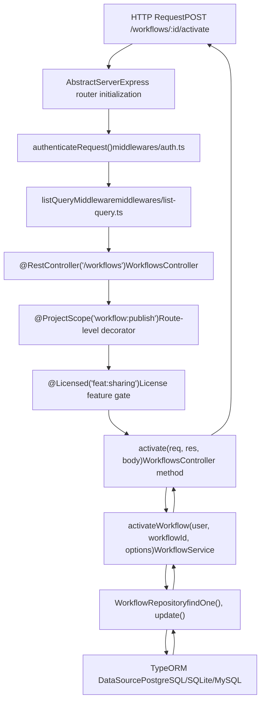
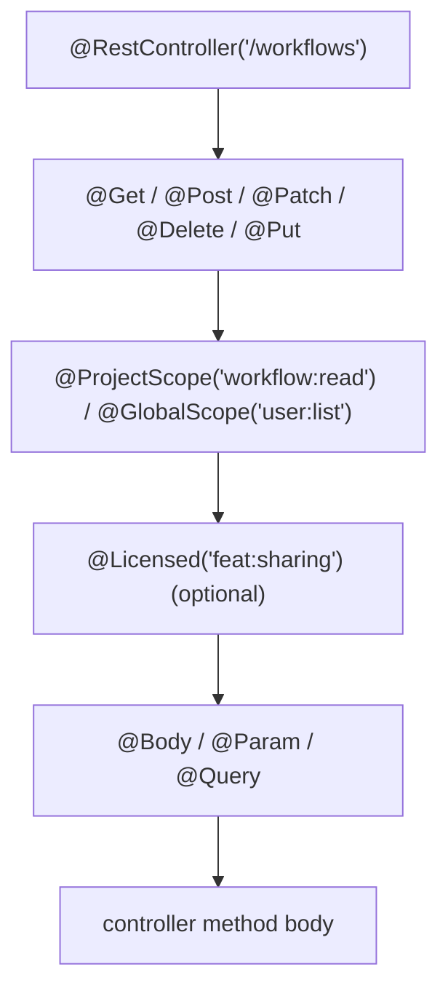
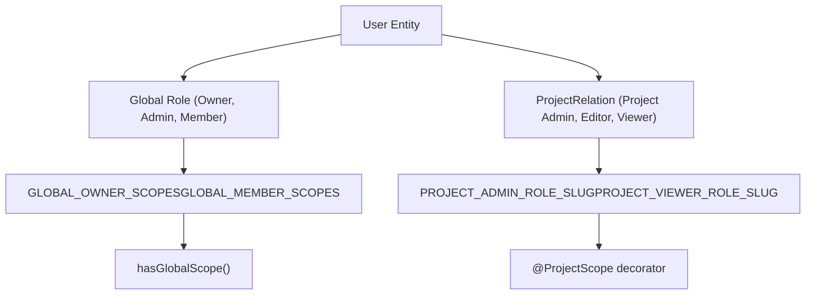

# API and Resource Management

Relevant source files

-   [packages/@n8n/api-types/src/dto/auth/\_\_tests\_\_/resolve-signup-token-query.dto.test.ts](https://github.com/n8n-io/n8n/blob/88f170b9/packages/@n8n/api-types/src/dto/auth/__tests__/resolve-signup-token-query.dto.test.ts)
-   [packages/@n8n/api-types/src/dto/auth/resolve-signup-token-query.dto.ts](https://github.com/n8n-io/n8n/blob/88f170b9/packages/@n8n/api-types/src/dto/auth/resolve-signup-token-query.dto.ts)
-   [packages/@n8n/api-types/src/dto/invitation/\_\_tests\_\_/accept-invitation-request.dto.test.ts](https://github.com/n8n-io/n8n/blob/88f170b9/packages/@n8n/api-types/src/dto/invitation/__tests__/accept-invitation-request.dto.test.ts)
-   [packages/@n8n/api-types/src/dto/invitation/accept-invitation-request.dto.ts](https://github.com/n8n-io/n8n/blob/88f170b9/packages/@n8n/api-types/src/dto/invitation/accept-invitation-request.dto.ts)
-   [packages/@n8n/db/src/entities/execution-entity.ts](https://github.com/n8n-io/n8n/blob/88f170b9/packages/@n8n/db/src/entities/execution-entity.ts)
-   [packages/@n8n/db/src/migrations/common/1768557000000-AddStoredAtToExecutionEntity.ts](https://github.com/n8n-io/n8n/blob/88f170b9/packages/@n8n/db/src/migrations/common/1768557000000-AddStoredAtToExecutionEntity.ts)
-   [packages/@n8n/db/src/utils/test-utils/mock-entity-manager.ts](https://github.com/n8n-io/n8n/blob/88f170b9/packages/@n8n/db/src/utils/test-utils/mock-entity-manager.ts)
-   [packages/@n8n/db/src/utils/test-utils/mock-instance.ts](https://github.com/n8n-io/n8n/blob/88f170b9/packages/@n8n/db/src/utils/test-utils/mock-instance.ts)
-   [packages/@n8n/permissions/src/\_\_tests\_\_/\_\_snapshots\_\_/scope-information.test.ts.snap](https://github.com/n8n-io/n8n/blob/88f170b9/packages/@n8n/permissions/src/__tests__/__snapshots__/scope-information.test.ts.snap)
-   [packages/@n8n/permissions/src/constants.ee.ts](https://github.com/n8n-io/n8n/blob/88f170b9/packages/@n8n/permissions/src/constants.ee.ts)
-   [packages/@n8n/permissions/src/public-api-permissions.ee.ts](https://github.com/n8n-io/n8n/blob/88f170b9/packages/@n8n/permissions/src/public-api-permissions.ee.ts)
-   [packages/@n8n/permissions/src/roles/scopes/global-scopes.ee.ts](https://github.com/n8n-io/n8n/blob/88f170b9/packages/@n8n/permissions/src/roles/scopes/global-scopes.ee.ts)
-   [packages/@n8n/permissions/src/roles/scopes/project-scopes.ee.ts](https://github.com/n8n-io/n8n/blob/88f170b9/packages/@n8n/permissions/src/roles/scopes/project-scopes.ee.ts)
-   [packages/@n8n/permissions/src/roles/scopes/workflow-sharing-scopes.ee.ts](https://github.com/n8n-io/n8n/blob/88f170b9/packages/@n8n/permissions/src/roles/scopes/workflow-sharing-scopes.ee.ts)
-   [packages/@n8n/permissions/src/scope-information.ts](https://github.com/n8n-io/n8n/blob/88f170b9/packages/@n8n/permissions/src/scope-information.ts)
-   [packages/@n8n/permissions/src/utilities/\_\_tests\_\_/get-resource-permissions.test.ts](https://github.com/n8n-io/n8n/blob/88f170b9/packages/@n8n/permissions/src/utilities/__tests__/get-resource-permissions.test.ts)
-   [packages/cli/src/auth/handlers/\_\_tests\_\_/email.auth-handler.test.ts](https://github.com/n8n-io/n8n/blob/88f170b9/packages/cli/src/auth/handlers/__tests__/email.auth-handler.test.ts)
-   [packages/cli/src/auth/handlers/email.auth-handler.ts](https://github.com/n8n-io/n8n/blob/88f170b9/packages/cli/src/auth/handlers/email.auth-handler.ts)
-   [packages/cli/src/auth/jwt.ts](https://github.com/n8n-io/n8n/blob/88f170b9/packages/cli/src/auth/jwt.ts)
-   [packages/cli/src/commands/user-management/reset.ts](https://github.com/n8n-io/n8n/blob/88f170b9/packages/cli/src/commands/user-management/reset.ts)
-   [packages/cli/src/controllers/\_\_tests\_\_/auth.controller.test.ts](https://github.com/n8n-io/n8n/blob/88f170b9/packages/cli/src/controllers/__tests__/auth.controller.test.ts)
-   [packages/cli/src/controllers/\_\_tests\_\_/invitation.controller.test.ts](https://github.com/n8n-io/n8n/blob/88f170b9/packages/cli/src/controllers/__tests__/invitation.controller.test.ts)
-   [packages/cli/src/controllers/\_\_tests\_\_/me.controller.test.ts](https://github.com/n8n-io/n8n/blob/88f170b9/packages/cli/src/controllers/__tests__/me.controller.test.ts)
-   [packages/cli/src/controllers/auth.controller.ts](https://github.com/n8n-io/n8n/blob/88f170b9/packages/cli/src/controllers/auth.controller.ts)
-   [packages/cli/src/controllers/invitation.controller.ts](https://github.com/n8n-io/n8n/blob/88f170b9/packages/cli/src/controllers/invitation.controller.ts)
-   [packages/cli/src/controllers/me.controller.ts](https://github.com/n8n-io/n8n/blob/88f170b9/packages/cli/src/controllers/me.controller.ts)
-   [packages/cli/src/controllers/owner.controller.ts](https://github.com/n8n-io/n8n/blob/88f170b9/packages/cli/src/controllers/owner.controller.ts)
-   [packages/cli/src/controllers/users.controller.ts](https://github.com/n8n-io/n8n/blob/88f170b9/packages/cli/src/controllers/users.controller.ts)
-   [packages/cli/src/executions/\_\_tests\_\_/execution-redaction-proxy.service.test.ts](https://github.com/n8n-io/n8n/blob/88f170b9/packages/cli/src/executions/__tests__/execution-redaction-proxy.service.test.ts)
-   [packages/cli/src/executions/execution-redaction-proxy.service.ts](https://github.com/n8n-io/n8n/blob/88f170b9/packages/cli/src/executions/execution-redaction-proxy.service.ts)
-   [packages/cli/src/public-api/types.ts](https://github.com/n8n-io/n8n/blob/88f170b9/packages/cli/src/public-api/types.ts)
-   [packages/cli/src/public-api/v1/handlers/discover/\_\_tests\_\_/discover.handler.test.ts](https://github.com/n8n-io/n8n/blob/88f170b9/packages/cli/src/public-api/v1/handlers/discover/__tests__/discover.handler.test.ts)
-   [packages/cli/src/public-api/v1/handlers/discover/\_\_tests\_\_/discover.service.test.ts](https://github.com/n8n-io/n8n/blob/88f170b9/packages/cli/src/public-api/v1/handlers/discover/__tests__/discover.service.test.ts)
-   [packages/cli/src/public-api/v1/handlers/discover/discover.handler.ts](https://github.com/n8n-io/n8n/blob/88f170b9/packages/cli/src/public-api/v1/handlers/discover/discover.handler.ts)
-   [packages/cli/src/public-api/v1/handlers/discover/discover.service.ts](https://github.com/n8n-io/n8n/blob/88f170b9/packages/cli/src/public-api/v1/handlers/discover/discover.service.ts)
-   [packages/cli/src/public-api/v1/handlers/discover/spec/paths/discover.yml](https://github.com/n8n-io/n8n/blob/88f170b9/packages/cli/src/public-api/v1/handlers/discover/spec/paths/discover.yml)
-   [packages/cli/src/public-api/v1/handlers/executions/executions.handler.ts](https://github.com/n8n-io/n8n/blob/88f170b9/packages/cli/src/public-api/v1/handlers/executions/executions.handler.ts)
-   [packages/cli/src/public-api/v1/handlers/executions/spec/paths/executions.yml](https://github.com/n8n-io/n8n/blob/88f170b9/packages/cli/src/public-api/v1/handlers/executions/spec/paths/executions.yml)
-   [packages/cli/src/public-api/v1/handlers/executions/spec/schemas/execution.yml](https://github.com/n8n-io/n8n/blob/88f170b9/packages/cli/src/public-api/v1/handlers/executions/spec/schemas/execution.yml)
-   [packages/cli/src/public-api/v1/openapi.yml](https://github.com/n8n-io/n8n/blob/88f170b9/packages/cli/src/public-api/v1/openapi.yml)
-   [packages/cli/src/public-api/v1/shared/middlewares/global.middleware.ts](https://github.com/n8n-io/n8n/blob/88f170b9/packages/cli/src/public-api/v1/shared/middlewares/global.middleware.ts)
-   [packages/cli/src/public-api/v1/shared/spec/parameters/\_index.yml](https://github.com/n8n-io/n8n/blob/88f170b9/packages/cli/src/public-api/v1/shared/spec/parameters/_index.yml)
-   [packages/cli/src/requests.ts](https://github.com/n8n-io/n8n/blob/88f170b9/packages/cli/src/requests.ts)
-   [packages/cli/src/services/\_\_tests\_\_/url.service.test.ts](https://github.com/n8n-io/n8n/blob/88f170b9/packages/cli/src/services/__tests__/url.service.test.ts)
-   [packages/cli/src/services/\_\_tests\_\_/user.service.test.ts](https://github.com/n8n-io/n8n/blob/88f170b9/packages/cli/src/services/__tests__/user.service.test.ts)
-   [packages/cli/src/services/jwt.service.ts](https://github.com/n8n-io/n8n/blob/88f170b9/packages/cli/src/services/jwt.service.ts)
-   [packages/cli/src/services/url.service.ts](https://github.com/n8n-io/n8n/blob/88f170b9/packages/cli/src/services/url.service.ts)
-   [packages/cli/src/services/user.service.ts](https://github.com/n8n-io/n8n/blob/88f170b9/packages/cli/src/services/user.service.ts)
-   [packages/cli/src/sso.ee/\_\_tests\_\_/sso-helpers.test.ts](https://github.com/n8n-io/n8n/blob/88f170b9/packages/cli/src/sso.ee/__tests__/sso-helpers.test.ts)
-   [packages/cli/src/sso.ee/sso-helpers.ts](https://github.com/n8n-io/n8n/blob/88f170b9/packages/cli/src/sso.ee/sso-helpers.ts)
-   [packages/cli/src/workflows/workflow-finder.service.ts](https://github.com/n8n-io/n8n/blob/88f170b9/packages/cli/src/workflows/workflow-finder.service.ts)
-   [packages/cli/test/integration/auth.api.test.ts](https://github.com/n8n-io/n8n/blob/88f170b9/packages/cli/test/integration/auth.api.test.ts)
-   [packages/cli/test/integration/auth.mw.test.ts](https://github.com/n8n-io/n8n/blob/88f170b9/packages/cli/test/integration/auth.mw.test.ts)
-   [packages/cli/test/integration/commands/reset.cmd.test.ts](https://github.com/n8n-io/n8n/blob/88f170b9/packages/cli/test/integration/commands/reset.cmd.test.ts)
-   [packages/cli/test/integration/me.api.test.ts](https://github.com/n8n-io/n8n/blob/88f170b9/packages/cli/test/integration/me.api.test.ts)
-   [packages/cli/test/integration/owner.api.test.ts](https://github.com/n8n-io/n8n/blob/88f170b9/packages/cli/test/integration/owner.api.test.ts)
-   [packages/cli/test/integration/public-api/discover.test.ts](https://github.com/n8n-io/n8n/blob/88f170b9/packages/cli/test/integration/public-api/discover.test.ts)
-   [packages/cli/test/integration/public-api/endpoints-with-scopes-enabled.test.ts](https://github.com/n8n-io/n8n/blob/88f170b9/packages/cli/test/integration/public-api/endpoints-with-scopes-enabled.test.ts)
-   [packages/cli/test/integration/public-api/executions.test.ts](https://github.com/n8n-io/n8n/blob/88f170b9/packages/cli/test/integration/public-api/executions.test.ts)
-   [packages/cli/test/integration/shared/constants.ts](https://github.com/n8n-io/n8n/blob/88f170b9/packages/cli/test/integration/shared/constants.ts)
-   [packages/cli/test/integration/users.api.test.ts](https://github.com/n8n-io/n8n/blob/88f170b9/packages/cli/test/integration/users.api.test.ts)
-   [packages/frontend/@n8n/rest-api-client/src/api/users.ts](https://github.com/n8n-io/n8n/blob/88f170b9/packages/frontend/@n8n/rest-api-client/src/api/users.ts)
-   [packages/frontend/editor-ui/src/app/stores/rbac.store.ts](https://github.com/n8n-io/n8n/blob/88f170b9/packages/frontend/editor-ui/src/app/stores/rbac.store.ts)
-   [packages/frontend/editor-ui/src/features/core/auth/views/SignupView.test.ts](https://github.com/n8n-io/n8n/blob/88f170b9/packages/frontend/editor-ui/src/features/core/auth/views/SignupView.test.ts)
-   [packages/frontend/editor-ui/src/features/core/auth/views/SignupView.vue](https://github.com/n8n-io/n8n/blob/88f170b9/packages/frontend/editor-ui/src/features/core/auth/views/SignupView.vue)
-   [packages/frontend/editor-ui/src/features/settings/users/\_\_tests\_\_/invitation.api.test.ts](https://github.com/n8n-io/n8n/blob/88f170b9/packages/frontend/editor-ui/src/features/settings/users/__tests__/invitation.api.test.ts)
-   [packages/frontend/editor-ui/src/features/settings/users/components/InviteUsersModal.vue](https://github.com/n8n-io/n8n/blob/88f170b9/packages/frontend/editor-ui/src/features/settings/users/components/InviteUsersModal.vue)
-   [packages/frontend/editor-ui/src/features/settings/users/invitation.api.ts](https://github.com/n8n-io/n8n/blob/88f170b9/packages/frontend/editor-ui/src/features/settings/users/invitation.api.ts)
-   [packages/frontend/editor-ui/src/features/settings/users/users.store.ts](https://github.com/n8n-io/n8n/blob/88f170b9/packages/frontend/editor-ui/src/features/settings/users/users.store.ts)
-   [packages/frontend/editor-ui/src/features/settings/users/views/SettingsUsersView.test.ts](https://github.com/n8n-io/n8n/blob/88f170b9/packages/frontend/editor-ui/src/features/settings/users/views/SettingsUsersView.test.ts)
-   [packages/frontend/editor-ui/src/features/settings/users/views/SettingsUsersView.vue](https://github.com/n8n-io/n8n/blob/88f170b9/packages/frontend/editor-ui/src/features/settings/users/views/SettingsUsersView.vue)
-   [packages/nodes-base/nodes/N8n/n8n-api-coverage.json](https://github.com/n8n-io/n8n/blob/88f170b9/packages/nodes-base/nodes/N8n/n8n-api-coverage.json)
-   [packages/nodes-base/nodes/N8n/test/N8n.api-coverage.test.ts](https://github.com/n8n-io/n8n/blob/88f170b9/packages/nodes-base/nodes/N8n/test/N8n.api-coverage.test.ts)
-   [packages/testing/playwright/services/public-api-helper.ts](https://github.com/n8n-io/n8n/blob/88f170b9/packages/testing/playwright/services/public-api-helper.ts)
-   [packages/testing/playwright/tests/e2e/api/discovery.spec.ts](https://github.com/n8n-io/n8n/blob/88f170b9/packages/testing/playwright/tests/e2e/api/discovery.spec.ts)

This document covers the REST API architecture, resource management patterns, and authentication/authorization mechanisms in n8n. It explains how HTTP requests are processed, how resources like workflows and credentials are managed, and how access control is enforced.

The REST API layer lives almost entirely within `packages/cli/src/`. Child pages cover each major subsystem:

| Page | Title | Primary Files |
| --- | --- | --- |
| [Workflows API and Service Layer](/n8n-io/n8n/3.1-workflows-api-and-service-layer) | Workflows API and Service Layer | `workflows/workflows.controller.ts`, `workflows/workflow.service.ts` |
| [Credentials API and Security](/n8n-io/n8n/3.2-credentials-api-and-security) | Credentials API and Security | `credentials/credentials.controller.ts`, `credentials/credentials.service.ts` |
| [Execution Management API](/n8n-io/n8n/3.3-execution-management-api) | Execution Management API | `executions/execution.service.ts`, `executions/execution.repository.ts` |
| [User Management and Authentication](/n8n-io/n8n/3.4-user-management-and-authentication) | User Management and Authentication | `controllers/users.controller.ts`, `controllers/auth.controller.ts` |
| [Project-Based Authorization and Sharing](/n8n-io/n8n/3.5-project-based-authorization-and-sharing) | Project-Based Authorization and Sharing | `services/project.service.ee.ts`, `@n8n/permissions` |
| [Dynamic Credentials and External Secrets](/n8n-io/n8n/3.6-dynamic-credentials-and-external-secrets) | External Secrets Provider Integration | `external-secrets/` |
| [Source Control and Environment Management](/n8n-io/n8n/3.7-source-control-and-environment-management) | Source Control and Environment Management | `environments-ee/source-control/` |

For information about workflow execution internals, see page [2](/n8n-io/n8n/2-workflow-execution-engine). For user interface interactions, see page [6](/n8n-io/n8n/6-user-interface).

---

## API Architecture Overview

The n8n API is built using Express.js with a controller-service-repository pattern. Controllers handle HTTP requests, services contain business logic, and repositories manage database operations.

### REST API Request Flow

**REST API request flow through decorators and service layers**

Sources: [packages/cli/src/workflows/workflows.controller.ts448-480](https://github.com/n8n-io/n8n/blob/88f170b9/packages/cli/src/workflows/workflows.controller.ts#L448-L480) [packages/cli/src/workflows/workflow.service.ts621-750](https://github.com/n8n-io/n8n/blob/88f170b9/packages/cli/src/workflows/workflow.service.ts#L621-L750) [packages/cli/src/middlewares/auth.ts](https://github.com/n8n-io/n8n/blob/88f170b9/packages/cli/src/middlewares/auth.ts) [packages/cli/src/middlewares/list-query.ts](https://github.com/n8n-io/n8n/blob/88f170b9/packages/cli/src/middlewares/list-query.ts)

### Controller Architecture

Controllers are defined using decorators from `@n8n/decorators` and follow a consistent pattern:

**Decorator stack on a typical controller method**

-   `@RestController('/workflows')` — registers the Express router prefix [packages/cli/src/workflows/workflows.controller.ts75](https://github.com/n8n-io/n8n/blob/88f170b9/packages/cli/src/workflows/workflows.controller.ts#L75-L75)
-   `@Get`, `@Post`, `@Patch`, `@Delete` — HTTP method and sub-path [packages/cli/src/controllers/users.controller.ts110](https://github.com/n8n-io/n8n/blob/88f170b9/packages/cli/src/controllers/users.controller.ts#L110-L110)
-   `@ProjectScope('workflow:read')` — enforces per-resource scope check
-   `@GlobalScope('user:list')` — enforces instance-wide scope check [packages/cli/src/controllers/users.controller.ts111](https://github.com/n8n-io/n8n/blob/88f170b9/packages/cli/src/controllers/users.controller.ts#L111-L111)
-   `@Licensed('feat:sharing')` — gates the route behind a license feature flag [packages/cli/src/controllers/users.controller.ts29](https://github.com/n8n-io/n8n/blob/88f170b9/packages/cli/src/controllers/users.controller.ts#L29-L29)
-   `@Body`, `@Param`, `@Query` — bind and validate DTO arguments via class-validator / Zod [packages/cli/src/controllers/users.controller.ts115](https://github.com/n8n-io/n8n/blob/88f170b9/packages/cli/src/controllers/users.controller.ts#L115-L115)

Sources: [packages/cli/src/workflows/workflows.controller.ts75-101](https://github.com/n8n-io/n8n/blob/88f170b9/packages/cli/src/workflows/workflows.controller.ts#L75-L101) [packages/cli/src/controllers/users.controller.ts110-116](https://github.com/n8n-io/n8n/blob/88f170b9/packages/cli/src/controllers/users.controller.ts#L110-L116) [packages/cli/src/controllers/auth.controller.ts53-67](https://github.com/n8n-io/n8n/blob/88f170b9/packages/cli/src/controllers/auth.controller.ts#L53-L67)

### Request Type System

The `requests.ts` file defines strongly-typed request interfaces for all API endpoints:

| Request Type | Purpose | Key Properties |
| --- | --- | --- |
| `AuthenticatedRequest` | Base type for authenticated endpoints | `user: User`, `authInfo` [packages/cli/src/requests.ts4-10](https://github.com/n8n-io/n8n/blob/88f170b9/packages/cli/src/requests.ts#L4-L10) |
| `AuthlessRequest` | Unauthenticated endpoints | No user context [packages/cli/src/requests.ts24-29](https://github.com/n8n-io/n8n/blob/88f170b9/packages/cli/src/requests.ts#L24-L29) |
| `ListQuery.Request` | List endpoints with filtering | `listQueryOptions: Options` [packages/cli/src/requests.ts32-34](https://github.com/n8n-io/n8n/blob/88f170b9/packages/cli/src/requests.ts#L32-L34) |
| `CredentialRequest.*` | Credential operations | Credential-specific params [packages/cli/src/requests.ts67-112](https://github.com/n8n-io/n8n/blob/88f170b9/packages/cli/src/requests.ts#L67-L112) |
| `UserRequest.*` | User management | User-specific params [packages/cli/src/requests.ts126-153](https://github.com/n8n-io/n8n/blob/88f170b9/packages/cli/src/requests.ts#L126-L153) |

Sources: [packages/cli/src/requests.ts1-172](https://github.com/n8n-io/n8n/blob/88f170b9/packages/cli/src/requests.ts#L1-L172)

---

## Workflow Resource Management

Workflows are managed through the `WorkflowsController` and `WorkflowService`. For details, see [Workflows API and Service Layer](/n8n-io/n8n/3.1-workflows-api-and-service-layer).

### Workflow API Endpoints

-   **CRUD Operations**: Handled via `POST /workflows`, `GET /workflows/:id`, `PATCH /workflows/:id`, and `DELETE /workflows/:id`.
-   **Lifecycle**: Activation and deactivation endpoints manage the `active` state and register triggers in the `ActiveWorkflowManager`.
-   **Sharing**: Workflows can be shared with projects using the `@Licensed('feat:sharing')` system.

Sources: [packages/cli/src/workflows/workflows.controller.ts87-700](https://github.com/n8n-io/n8n/blob/88f170b9/packages/cli/src/workflows/workflows.controller.ts#L87-L700) [packages/cli/src/requests.ts57-61](https://github.com/n8n-io/n8n/blob/88f170b9/packages/cli/src/requests.ts#L57-L61)

---

## Credential Resource Management

Credentials involve sensitive data encrypted at rest. For details, see [Credentials API and Security](/n8n-io/n8n/3.2-credentials-api-and-security) and [Dynamic Credentials and External Secrets](/n8n-io/n8n/3.6-dynamic-credentials-and-external-secrets).

### Credential API Endpoints

-   **Encryption**: Data is decrypted only when needed for execution or display (redacted). [packages/cli/src/requests.ts19-22](https://github.com/n8n-io/n8n/blob/88f170b9/packages/cli/src/requests.ts#L19-L22)
-   **Testing**: `POST /credentials/test` allows validating credential connectivity. [packages/cli/src/requests.ts96](https://github.com/n8n-io/n8n/blob/88f170b9/packages/cli/src/requests.ts#L96-L96)
-   **OAuth**: Specific controllers handle OAuth1/2 callback flows. [packages/cli/src/requests.ts177-194](https://github.com/n8n-io/n8n/blob/88f170b9/packages/cli/src/requests.ts#L177-L194)

Sources: [packages/cli/src/requests.ts67-112](https://github.com/n8n-io/n8n/blob/88f170b9/packages/cli/src/requests.ts#L67-L112) [packages/cli/src/requests.ts177-194](https://github.com/n8n-io/n8n/blob/88f170b9/packages/cli/src/requests.ts#L177-L194)

---

## User Management and Authentication

n8n supports multiple authentication methods including local email/password, LDAP, SAML, and OIDC. For details, see [User Management and Authentication](/n8n-io/n8n/3.4-user-management-and-authentication).

### Authentication Flow

**Authentication and MFA Verification**

> **[Mermaid sequence]**
> *(图表结构无法解析)*

Sources: [packages/cli/src/controllers/auth.controller.ts53-107](https://github.com/n8n-io/n8n/blob/88f170b9/packages/cli/src/controllers/auth.controller.ts#L53-L107) [packages/cli/src/controllers/auth.controller.ts159-181](https://github.com/n8n-io/n8n/blob/88f170b9/packages/cli/src/controllers/auth.controller.ts#L159-L181)

### User Lifecycle and Invites

-   **Invitations**: Handled via `InvitationController`. Admins generate tokens or send emails. [packages/cli/src/controllers/invitation.controller.ts42-90](https://github.com/n8n-io/n8n/blob/88f170b9/packages/cli/src/controllers/invitation.controller.ts#L42-L90)
-   **Profile Management**: Users update their own data via `MeController`. [packages/cli/src/controllers/me.controller.ts44-109](https://github.com/n8n-io/n8n/blob/88f170b9/packages/cli/src/controllers/me.controller.ts#L44-L109)
-   **SSO Restrictions**: Users authenticated via LDAP/OIDC are restricted from changing profile info (email/name) in n8n. [packages/cli/src/controllers/me.controller.ts63-79](https://github.com/n8n-io/n8n/blob/88f170b9/packages/cli/src/controllers/me.controller.ts#L63-L79)

Sources: [packages/cli/src/controllers/users.controller.ts53-397](https://github.com/n8n-io/n8n/blob/88f170b9/packages/cli/src/controllers/users.controller.ts#L53-L397) [packages/cli/src/controllers/me.controller.ts29-297](https://github.com/n8n-io/n8n/blob/88f170b9/packages/cli/src/controllers/me.controller.ts#L29-L297) [packages/cli/src/services/user.service.ts103-135](https://github.com/n8n-io/n8n/blob/88f170b9/packages/cli/src/services/user.service.ts#L103-L135)

---

## Project-Based Authorization

n8n uses a scope-based permission system. For details, see [Project-Based Authorization and Sharing](/n8n-io/n8n/3.5-project-based-authorization-and-sharing).

### Scope System

Scopes are defined for every resource and operation (e.g., `workflow:read`, `user:create`).

| Resource | Default Operations | EE / Special Operations |
| --- | --- | --- |
| `workflow` | `create`, `read`, `update`, `delete`, `list` | `share`, `execute`, `move`, `activate`, `publish` |
| `credential` | `create`, `read`, `update`, `delete`, `list` | `share`, `shareGlobally`, `move` |
| `user` | `create`, `read`, `update`, `delete`, `list` | `resetPassword`, `changeRole`, `generateInviteLink` |

Sources: [packages/@n8n/permissions/src/constants.ee.ts3-63](https://github.com/n8n-io/n8n/blob/88f170b9/packages/@n8n/permissions/src/constants.ee.ts#L3-L63) [packages/@n8n/permissions/src/roles/scopes/global-scopes.ee.ts3-135](https://github.com/n8n-io/n8n/blob/88f170b9/packages/@n8n/permissions/src/roles/scopes/global-scopes.ee.ts#L3-L135)

### Global vs Project Scopes

**Permission Hierarchy and Code Entities**

Sources: [packages/@n8n/permissions/src/roles/scopes/global-scopes.ee.ts3-176](https://github.com/n8n-io/n8n/blob/88f170b9/packages/@n8n/permissions/src/roles/scopes/global-scopes.ee.ts#L3-L176) [packages/@n8n/permissions/src/constants.ee.ts81-85](https://github.com/n8n-io/n8n/blob/88f170b9/packages/@n8n/permissions/src/constants.ee.ts#L81-L85) [packages/cli/src/controllers/users.controller.ts35](https://github.com/n8n-io/n8n/blob/88f170b9/packages/cli/src/controllers/users.controller.ts#L35-L35)

---

## Execution and Resource Lifecycle

-   **Execution Management**: Retrieval and deletion of execution history. For details, see [Execution Management API](/n8n-io/n8n/3.3-execution-management-api).
-   **Source Control**: Integration with Git for workflow versioning. For details, see [Source Control and Environment Management](/n8n-io/n8n/3.7-source-control-and-environment-management).
-   **External Secrets**: Dynamic resolution of credential values from providers like Vault or AWS. For details, see [Dynamic Credentials and External Secrets](/n8n-io/n8n/3.6-dynamic-credentials-and-external-secrets).

Sources: [packages/@n8n/permissions/src/constants.ee.ts52](https://github.com/n8n-io/n8n/blob/88f170b9/packages/@n8n/permissions/src/constants.ee.ts#L52-L52) [packages/@n8n/permissions/src/constants.ee.ts22](https://github.com/n8n-io/n8n/blob/88f170b9/packages/@n8n/permissions/src/constants.ee.ts#L22-L22) [packages/@n8n/permissions/src/constants.ee.ts11-12](https://github.com/n8n-io/n8n/blob/88f170b9/packages/@n8n/permissions/src/constants.ee.ts#L11-L12)
