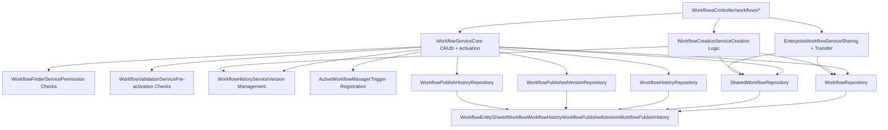
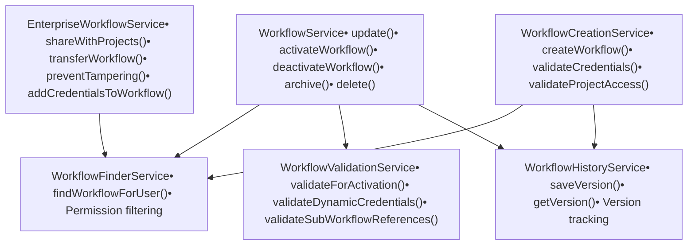
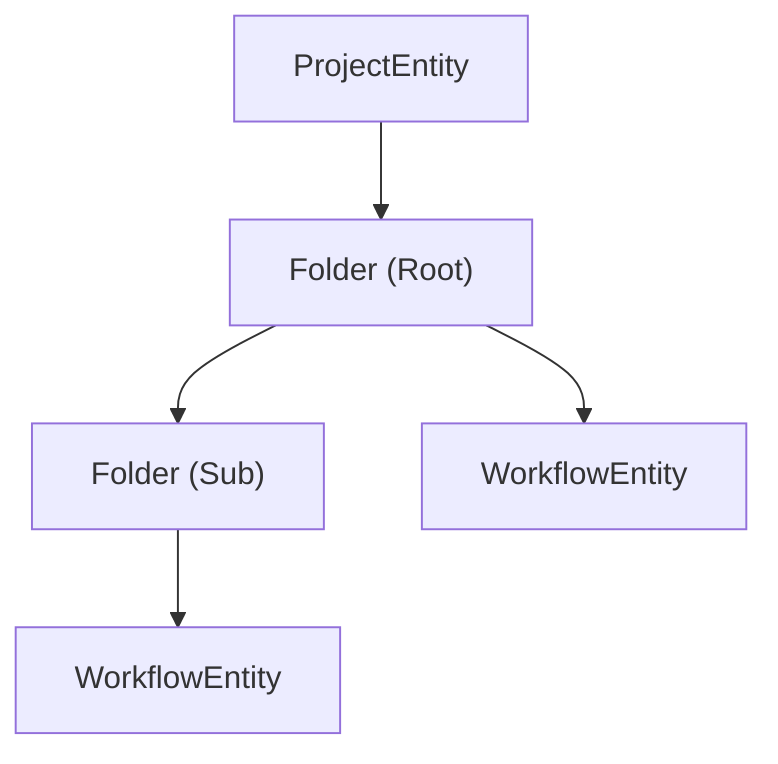

# Workflows API and Service Layer

Relevant source files

-   [packages/@n8n/api-types/src/dto/folders/\_\_tests\_\_/list-folder-query.dto.test.ts](https://github.com/n8n-io/n8n/blob/88f170b9/packages/@n8n/api-types/src/dto/folders/__tests__/list-folder-query.dto.test.ts)
-   [packages/@n8n/api-types/src/dto/folders/\_\_tests\_\_/update-folder.request.dto.test.ts](https://github.com/n8n-io/n8n/blob/88f170b9/packages/@n8n/api-types/src/dto/folders/__tests__/update-folder.request.dto.test.ts)
-   [packages/@n8n/api-types/src/dto/folders/create-folder.dto.ts](https://github.com/n8n-io/n8n/blob/88f170b9/packages/@n8n/api-types/src/dto/folders/create-folder.dto.ts)
-   [packages/@n8n/api-types/src/dto/folders/delete-folder.dto.ts](https://github.com/n8n-io/n8n/blob/88f170b9/packages/@n8n/api-types/src/dto/folders/delete-folder.dto.ts)
-   [packages/@n8n/api-types/src/dto/folders/list-folder-query.dto.ts](https://github.com/n8n-io/n8n/blob/88f170b9/packages/@n8n/api-types/src/dto/folders/list-folder-query.dto.ts)
-   [packages/@n8n/api-types/src/dto/folders/update-folder.dto.ts](https://github.com/n8n-io/n8n/blob/88f170b9/packages/@n8n/api-types/src/dto/folders/update-folder.dto.ts)
-   [packages/@n8n/api-types/src/schemas/\_\_tests\_\_/folder.schema.test.ts](https://github.com/n8n-io/n8n/blob/88f170b9/packages/@n8n/api-types/src/schemas/__tests__/folder.schema.test.ts)
-   [packages/@n8n/api-types/src/schemas/credential-resolver.schema.ts](https://github.com/n8n-io/n8n/blob/88f170b9/packages/@n8n/api-types/src/schemas/credential-resolver.schema.ts)
-   [packages/@n8n/api-types/src/schemas/folder.schema.ts](https://github.com/n8n-io/n8n/blob/88f170b9/packages/@n8n/api-types/src/schemas/folder.schema.ts)
-   [packages/@n8n/config/src/configs/logging.config.ts](https://github.com/n8n-io/n8n/blob/88f170b9/packages/@n8n/config/src/configs/logging.config.ts)
-   [packages/@n8n/config/src/custom-types.ts](https://github.com/n8n-io/n8n/blob/88f170b9/packages/@n8n/config/src/custom-types.ts)
-   [packages/@n8n/config/test/custom-types.test.ts](https://github.com/n8n-io/n8n/blob/88f170b9/packages/@n8n/config/test/custom-types.test.ts)
-   [packages/@n8n/db/src/entities/workflow-published-version.ts](https://github.com/n8n-io/n8n/blob/88f170b9/packages/@n8n/db/src/entities/workflow-published-version.ts)
-   [packages/@n8n/db/src/migrations/common/1772619247762-ChangeWorkflowPublishedVersionFKsToRestrict.ts](https://github.com/n8n-io/n8n/blob/88f170b9/packages/@n8n/db/src/migrations/common/1772619247762-ChangeWorkflowPublishedVersionFKsToRestrict.ts)
-   [packages/@n8n/db/src/repositories/\_\_tests\_\_/workflow.repository.test.ts](https://github.com/n8n-io/n8n/blob/88f170b9/packages/@n8n/db/src/repositories/__tests__/workflow.repository.test.ts)
-   [packages/@n8n/db/src/repositories/folder-tag-mapping.repository.ts](https://github.com/n8n-io/n8n/blob/88f170b9/packages/@n8n/db/src/repositories/folder-tag-mapping.repository.ts)
-   [packages/@n8n/db/src/repositories/folder.repository.ts](https://github.com/n8n-io/n8n/blob/88f170b9/packages/@n8n/db/src/repositories/folder.repository.ts)
-   [packages/@n8n/db/src/repositories/invalid-auth-token.repository.ts](https://github.com/n8n-io/n8n/blob/88f170b9/packages/@n8n/db/src/repositories/invalid-auth-token.repository.ts)
-   [packages/@n8n/db/src/repositories/processed-data.repository.ts](https://github.com/n8n-io/n8n/blob/88f170b9/packages/@n8n/db/src/repositories/processed-data.repository.ts)
-   [packages/@n8n/db/src/repositories/workflow-published-version.repository.ts](https://github.com/n8n-io/n8n/blob/88f170b9/packages/@n8n/db/src/repositories/workflow-published-version.repository.ts)
-   [packages/@n8n/db/src/repositories/workflow.repository.ts](https://github.com/n8n-io/n8n/blob/88f170b9/packages/@n8n/db/src/repositories/workflow.repository.ts)
-   [packages/cli/src/\_\_tests\_\_/active-workflow-manager.test.ts](https://github.com/n8n-io/n8n/blob/88f170b9/packages/cli/src/__tests__/active-workflow-manager.test.ts)
-   [packages/cli/src/\_\_tests\_\_/utils.test.ts](https://github.com/n8n-io/n8n/blob/88f170b9/packages/cli/src/__tests__/utils.test.ts)
-   [packages/cli/src/\_\_tests\_\_/workflow-helpers.test.ts](https://github.com/n8n-io/n8n/blob/88f170b9/packages/cli/src/__tests__/workflow-helpers.test.ts)
-   [packages/cli/src/active-workflow-manager.ts](https://github.com/n8n-io/n8n/blob/88f170b9/packages/cli/src/active-workflow-manager.ts)
-   [packages/cli/src/controllers/folder.controller.ts](https://github.com/n8n-io/n8n/blob/88f170b9/packages/cli/src/controllers/folder.controller.ts)
-   [packages/cli/src/errors/workflow-missing-id.error.ts](https://github.com/n8n-io/n8n/blob/88f170b9/packages/cli/src/errors/workflow-missing-id.error.ts)
-   [packages/cli/src/modules/dynamic-credentials.ee/credential-resolvers.controller.ts](https://github.com/n8n-io/n8n/blob/88f170b9/packages/cli/src/modules/dynamic-credentials.ee/credential-resolvers.controller.ts)
-   [packages/cli/src/modules/dynamic-credentials.ee/services/\_\_tests\_\_/credential-resolver.service.test.ts](https://github.com/n8n-io/n8n/blob/88f170b9/packages/cli/src/modules/dynamic-credentials.ee/services/__tests__/credential-resolver.service.test.ts)
-   [packages/cli/src/modules/dynamic-credentials.ee/services/credential-resolver.service.ts](https://github.com/n8n-io/n8n/blob/88f170b9/packages/cli/src/modules/dynamic-credentials.ee/services/credential-resolver.service.ts)
-   [packages/cli/src/public-api/v1/handlers/workflows/workflows.handler.ts](https://github.com/n8n-io/n8n/blob/88f170b9/packages/cli/src/public-api/v1/handlers/workflows/workflows.handler.ts)
-   [packages/cli/src/scaling/\_\_tests\_\_/multi-main-setup.ee.test.ts](https://github.com/n8n-io/n8n/blob/88f170b9/packages/cli/src/scaling/__tests__/multi-main-setup.ee.test.ts)
-   [packages/cli/src/scaling/multi-main-setup.ee.ts](https://github.com/n8n-io/n8n/blob/88f170b9/packages/cli/src/scaling/multi-main-setup.ee.ts)
-   [packages/cli/src/services/\_\_tests\_\_/credentials-tester.service.test.ts](https://github.com/n8n-io/n8n/blob/88f170b9/packages/cli/src/services/__tests__/credentials-tester.service.test.ts)
-   [packages/cli/src/services/cache/\_\_tests\_\_/cache-mock.service.test.ts](https://github.com/n8n-io/n8n/blob/88f170b9/packages/cli/src/services/cache/__tests__/cache-mock.service.test.ts)
-   [packages/cli/src/services/cache/\_\_tests\_\_/cache.service.test.ts](https://github.com/n8n-io/n8n/blob/88f170b9/packages/cli/src/services/cache/__tests__/cache.service.test.ts)
-   [packages/cli/src/services/cache/cache.constants.ts](https://github.com/n8n-io/n8n/blob/88f170b9/packages/cli/src/services/cache/cache.constants.ts)
-   [packages/cli/src/services/cache/cache.service.ts](https://github.com/n8n-io/n8n/blob/88f170b9/packages/cli/src/services/cache/cache.service.ts)
-   [packages/cli/src/services/credentials-tester.service.ts](https://github.com/n8n-io/n8n/blob/88f170b9/packages/cli/src/services/credentials-tester.service.ts)
-   [packages/cli/src/services/folder.service.ts](https://github.com/n8n-io/n8n/blob/88f170b9/packages/cli/src/services/folder.service.ts)
-   [packages/cli/src/utils.ts](https://github.com/n8n-io/n8n/blob/88f170b9/packages/cli/src/utils.ts)
-   [packages/cli/src/webhooks/\_\_tests\_\_/test-webhook-registrations.service.test.ts](https://github.com/n8n-io/n8n/blob/88f170b9/packages/cli/src/webhooks/__tests__/test-webhook-registrations.service.test.ts)
-   [packages/cli/src/webhooks/\_\_tests\_\_/test-webhooks.test.ts](https://github.com/n8n-io/n8n/blob/88f170b9/packages/cli/src/webhooks/__tests__/test-webhooks.test.ts)
-   [packages/cli/src/webhooks/test-webhook-registrations.service.ts](https://github.com/n8n-io/n8n/blob/88f170b9/packages/cli/src/webhooks/test-webhook-registrations.service.ts)
-   [packages/cli/src/webhooks/test-webhooks.ts](https://github.com/n8n-io/n8n/blob/88f170b9/packages/cli/src/webhooks/test-webhooks.ts)
-   [packages/cli/src/workflow-helpers.ts](https://github.com/n8n-io/n8n/blob/88f170b9/packages/cli/src/workflow-helpers.ts)
-   [packages/cli/src/workflows/\_\_tests\_\_/workflow-creation.service.test.ts](https://github.com/n8n-io/n8n/blob/88f170b9/packages/cli/src/workflows/__tests__/workflow-creation.service.test.ts)
-   [packages/cli/src/workflows/\_\_tests\_\_/workflow.service.test.ts](https://github.com/n8n-io/n8n/blob/88f170b9/packages/cli/src/workflows/__tests__/workflow.service.test.ts)
-   [packages/cli/src/workflows/\_\_tests\_\_/workflows.controller.test.ts](https://github.com/n8n-io/n8n/blob/88f170b9/packages/cli/src/workflows/__tests__/workflows.controller.test.ts)
-   [packages/cli/src/workflows/workflow-creation.service.ts](https://github.com/n8n-io/n8n/blob/88f170b9/packages/cli/src/workflows/workflow-creation.service.ts)
-   [packages/cli/src/workflows/workflow.service.ee.ts](https://github.com/n8n-io/n8n/blob/88f170b9/packages/cli/src/workflows/workflow.service.ee.ts)
-   [packages/cli/src/workflows/workflow.service.ts](https://github.com/n8n-io/n8n/blob/88f170b9/packages/cli/src/workflows/workflow.service.ts)
-   [packages/cli/src/workflows/workflows.controller.ts](https://github.com/n8n-io/n8n/blob/88f170b9/packages/cli/src/workflows/workflows.controller.ts)
-   [packages/cli/test/integration/active-workflow-manager.test.ts](https://github.com/n8n-io/n8n/blob/88f170b9/packages/cli/test/integration/active-workflow-manager.test.ts)
-   [packages/cli/test/integration/folder/folder.controller.test.ts](https://github.com/n8n-io/n8n/blob/88f170b9/packages/cli/test/integration/folder/folder.controller.test.ts)
-   [packages/cli/test/integration/public-api/workflows.test.ts](https://github.com/n8n-io/n8n/blob/88f170b9/packages/cli/test/integration/public-api/workflows.test.ts)
-   [packages/cli/test/integration/shared/db/folders.ts](https://github.com/n8n-io/n8n/blob/88f170b9/packages/cli/test/integration/shared/db/folders.ts)
-   [packages/cli/test/integration/shared/utils/index.ts](https://github.com/n8n-io/n8n/blob/88f170b9/packages/cli/test/integration/shared/utils/index.ts)
-   [packages/cli/test/integration/workflows/workflow.service.test.ts](https://github.com/n8n-io/n8n/blob/88f170b9/packages/cli/test/integration/workflows/workflow.service.test.ts)
-   [packages/cli/test/integration/workflows/workflows.controller.ee.test.ts](https://github.com/n8n-io/n8n/blob/88f170b9/packages/cli/test/integration/workflows/workflows.controller.ee.test.ts)
-   [packages/cli/test/integration/workflows/workflows.controller.test.ts](https://github.com/n8n-io/n8n/blob/88f170b9/packages/cli/test/integration/workflows/workflows.controller.test.ts)
-   [packages/frontend/@n8n/design-system/src/css/message-box.scss](https://github.com/n8n-io/n8n/blob/88f170b9/packages/frontend/@n8n/design-system/src/css/message-box.scss)
-   [packages/frontend/@n8n/rest-api-client/src/api/credentialResolvers.ts](https://github.com/n8n-io/n8n/blob/88f170b9/packages/frontend/@n8n/rest-api-client/src/api/credentialResolvers.ts)
-   [packages/frontend/editor-ui/src/app/api/workflows.test.ts](https://github.com/n8n-io/n8n/blob/88f170b9/packages/frontend/editor-ui/src/app/api/workflows.test.ts)
-   [packages/frontend/editor-ui/src/app/components/WorkflowSettings.test.ts](https://github.com/n8n-io/n8n/blob/88f170b9/packages/frontend/editor-ui/src/app/components/WorkflowSettings.test.ts)
-   [packages/frontend/editor-ui/src/app/components/WorkflowSettings.vue](https://github.com/n8n-io/n8n/blob/88f170b9/packages/frontend/editor-ui/src/app/components/WorkflowSettings.vue)
-   [packages/frontend/editor-ui/src/features/resolvers/ResolversView.test.ts](https://github.com/n8n-io/n8n/blob/88f170b9/packages/frontend/editor-ui/src/features/resolvers/ResolversView.test.ts)
-   [packages/frontend/editor-ui/src/features/resolvers/composables/useCredentialResolvers.test.ts](https://github.com/n8n-io/n8n/blob/88f170b9/packages/frontend/editor-ui/src/features/resolvers/composables/useCredentialResolvers.test.ts)
-   [packages/frontend/editor-ui/src/features/resolvers/composables/useCredentialResolvers.ts](https://github.com/n8n-io/n8n/blob/88f170b9/packages/frontend/editor-ui/src/features/resolvers/composables/useCredentialResolvers.ts)
-   [packages/testing/playwright/helpers/NodeParameterHelper.ts](https://github.com/n8n-io/n8n/blob/88f170b9/packages/testing/playwright/helpers/NodeParameterHelper.ts)
-   [packages/testing/playwright/services/webhook-api-helper.ts](https://github.com/n8n-io/n8n/blob/88f170b9/packages/testing/playwright/services/webhook-api-helper.ts)
-   [packages/testing/playwright/tests/e2e/api/webhook-external.spec.ts](https://github.com/n8n-io/n8n/blob/88f170b9/packages/testing/playwright/tests/e2e/api/webhook-external.spec.ts)
-   [packages/testing/playwright/tests/e2e/nodes/webhook.spec.ts](https://github.com/n8n-io/n8n/blob/88f170b9/packages/testing/playwright/tests/e2e/nodes/webhook.spec.ts)

This document covers the REST API endpoints, service layer architecture, and business logic for workflow management in n8n. This includes CRUD operations, workflow activation/deactivation, sharing, versioning, and validation. For workflow execution mechanics, see [2.1](https://github.com/n8n-io/n8n/blob/88f170b9/2.1) For project-based authorization details, see [3.5](https://github.com/n8n-io/n8n/blob/88f170b9/3.5)

---

## Architecture Overview

The workflow API and service layer follows a three-tier architecture: controllers handle HTTP requests, services implement business logic, and repositories manage data persistence.

**System Architecture: API to Database Flow**

**Sources**: [packages/cli/src/workflows/workflows.controller.ts65-85](https://github.com/n8n-io/n8n/blob/88f170b9/packages/cli/src/workflows/workflows.controller.ts#L65-L85) [packages/cli/src/workflows/workflow.service.ts72-98](https://github.com/n8n-io/n8n/blob/88f170b9/packages/cli/src/workflows/workflow.service.ts#L72-L98) [packages/cli/src/workflows/workflow-creation.service.ts32-50](https://github.com/n8n-io/n8n/blob/88f170b9/packages/cli/src/workflows/workflow-creation.service.ts#L32-L50)

---

## REST API Endpoints

The `WorkflowsController` exposes the following RESTful endpoints for workflow management:

| Method | Path | Scope | Description |
| --- | --- | --- | --- |
| `POST` | `/workflows` | \- | Create new workflow |
| `GET` | `/workflows` | \- | List workflows with filtering/pagination |
| `GET` | `/workflows/:workflowId` | `workflow:read` | Get single workflow |
| `GET` | `/workflows/:workflowId/exists` | \- | Check if workflow exists |
| `PATCH` | `/workflows/:workflowId` | `workflow:update` | Update workflow |
| `DELETE` | `/workflows/:workflowId` | `workflow:delete` | Delete workflow |
| `POST` | `/workflows/:workflowId/archive` | `workflow:delete` | Archive workflow |
| `POST` | `/workflows/:workflowId/unarchive` | `workflow:delete` | Unarchive workflow |
| `POST` | `/workflows/:workflowId/activate` | `workflow:publish` | Activate workflow |
| `POST` | `/workflows/:workflowId/deactivate` | `workflow:unpublish` | Deactivate workflow |
| `POST` | `/workflows/:workflowId/run` | `workflow:execute` | Execute workflow manually |
| `PUT` | `/workflows/:workflowId/share` | `workflow:share` | Share workflow with projects |
| `PUT` | `/workflows/:workflowId/transfer` | `workflow:move` | Transfer workflow to another project |
| `GET` | `/workflows/:workflowId/executions/last-successful` | `workflow:read` | Get last successful execution |
| `GET` | `/workflows/new` | \- | Generate unique workflow name |
| `GET` | `/workflows/from-url` | \- | Import workflow from URL |

**Sources**: [packages/cli/src/workflows/workflows.controller.ts87-701](https://github.com/n8n-io/n8n/blob/88f170b9/packages/cli/src/workflows/workflows.controller.ts#L87-L701)

---

## Service Layer Architecture

The workflow service layer is split across multiple specialized services, each with distinct responsibilities:

**Service Layer Components and Responsibilities**

**Sources**: [packages/cli/src/workflows/workflow.service.ts72-98](https://github.com/n8n-io/n8n/blob/88f170b9/packages/cli/src/workflows/workflow.service.ts#L72-L98) [packages/cli/src/workflows/workflow.service.ee.ts42-58](https://github.com/n8n-io/n8n/blob/88f170b9/packages/cli/src/workflows/workflow.service.ee.ts#L42-L58) [packages/cli/src/workflows/workflow-creation.service.ts32-50](https://github.com/n8n-io/n8n/blob/88f170b9/packages/cli/src/workflows/workflow-creation.service.ts#L32-L50)

---

## Workflow Creation

Workflow creation is handled by `WorkflowCreationService` and involves permission validation, workflow initialization, and history tracking.

**Workflow Creation Flow**

> **[Mermaid sequence]**
> *(图表结构无法解析)*

The creation process enforces security constraints by ensuring users can only create workflows in projects where they have `workflow:create` scope [packages/cli/src/workflows/workflow-creation.service.ts58-64](https://github.com/n8n-io/n8n/blob/88f170b9/packages/cli/src/workflows/workflow-creation.service.ts#L58-L64) Protected fields like `active` and `activeVersionId` are initialized to inactive states [packages/cli/src/workflows/workflow-creation.service.ts80-81](https://github.com/n8n-io/n8n/blob/88f170b9/packages/cli/src/workflows/workflow-creation.service.ts#L80-L81)

**Sources**: [packages/cli/src/workflows/workflow-creation.service.ts52-195](https://github.com/n8n-io/n8n/blob/88f170b9/packages/cli/src/workflows/workflow-creation.service.ts#L52-L195) [packages/cli/src/workflows/workflows.controller.ts87-122](https://github.com/n8n-io/n8n/blob/88f170b9/packages/cli/src/workflows/workflows.controller.ts#L87-L122)

---

## Workflow Update Operations

Workflow updates support partial updates with automatic versioning and conflict detection using checksums.

**Update Process and Versioning**

> **[Mermaid sequence]**
> *(图表结构无法解析)*

If structural changes (nodes or connections) occur, a new `versionId` is generated and a history entry is saved [packages/cli/src/workflows/workflow.service.ts338-360](https://github.com/n8n-io/n8n/blob/88f170b9/packages/cli/src/workflows/workflow.service.ts#L338-L360)

**Sources**: [packages/cli/src/workflows/workflow.service.ts289-512](https://github.com/n8n-io/n8n/blob/88f170b9/packages/cli/src/workflows/workflow.service.ts#L289-L512) [packages/cli/src/workflows/workflows.controller.ts293-346](https://github.com/n8n-io/n8n/blob/88f170b9/packages/cli/src/workflows/workflows.controller.ts#L293-L346)

---

## Workflow Activation and Deactivation

Workflow activation registers triggers with the `ActiveWorkflowManager`. Activation requires validation of node types, dynamic credentials, and sub-workflow references.

**Activation Process with Validation Pipeline**

> **[Mermaid sequence]**
> *(图表结构无法解析)*

The `ActiveWorkflowManager` handles the registration of webhooks and triggers [packages/cli/src/active-workflow-manager.ts150-190](https://github.com/n8n-io/n8n/blob/88f170b9/packages/cli/src/active-workflow-manager.ts#L150-L190)

**Sources**: [packages/cli/src/workflows/workflow.service.ts621-750](https://github.com/n8n-io/n8n/blob/88f170b9/packages/cli/src/workflows/workflow.service.ts#L621-L750) [packages/cli/src/active-workflow-manager.ts1-200](https://github.com/n8n-io/n8n/blob/88f170b9/packages/cli/src/active-workflow-manager.ts#L1-L200)

---

## Folder Management

Folders allow organizing workflows within projects. Folders are managed via the `FolderRepository` and can contain sub-folders and workflows.

**Folder Structure and Retrieval**

The `WorkflowRepository` provides methods to retrieve a unified list of workflows and folders for the UI [packages/@n8n/db/src/repositories/workflow.repository.ts239-250](https://github.com/n8n-io/n8n/blob/88f170b9/packages/@n8n/db/src/repositories/workflow.repository.ts#L239-L250)

**Sources**: [packages/@n8n/db/src/repositories/workflow.repository.ts58-250](https://github.com/n8n-io/n8n/blob/88f170b9/packages/@n8n/db/src/repositories/workflow.repository.ts#L58-L250) [packages/cli/test/integration/folder/folder.controller.test.ts83-200](https://github.com/n8n-io/n8n/blob/88f170b9/packages/cli/test/integration/folder/folder.controller.test.ts#L83-L200)

---

## Workflow Versioning and History

Every structural change results in a new `versionId`. The `WorkflowHistoryService` manages the persistence of these versions in the `WorkflowHistory` table.

**Version State Transitions**

| State | Action | Result |
| --- | --- | --- |
| **Draft** | Create/Update Nodes | New `versionId`, saved to history |
| **Published** | Activate Workflow | `activeVersionId` set to current `versionId` |
| **Archived** | Archive Workflow | `isArchived` = true, `active` = false |

**Sources**: [packages/cli/src/workflows/workflow.service.ts338-360](https://github.com/n8n-io/n8n/blob/88f170b9/packages/cli/src/workflows/workflow.service.ts#L338-L360) [packages/cli/test/integration/workflows/workflow.service.test.ts113-146](https://github.com/n8n-io/n8n/blob/88f170b9/packages/cli/test/integration/workflows/workflow.service.test.ts#L113-L146)

---

## Credential Validation and Tampering Prevention

`EnterpriseWorkflowService` prevents users from saving workflows that use credentials they do not have access to.

**Credential Tampering Prevention Logic**

> **[Mermaid sequence]**
> *(图表结构无法解析)*

**Sources**: [packages/cli/src/workflows/workflow.service.ee.ts165-256](https://github.com/n8n-io/n8n/blob/88f170b9/packages/cli/src/workflows/workflow.service.ee.ts#L165-L256) [packages/cli/src/workflows/workflows.controller.ts322-329](https://github.com/n8n-io/n8n/blob/88f170b9/packages/cli/src/workflows/workflows.controller.ts#L322-L329)

---

## Archive and Delete Operations

Workflows can be archived (soft delete) or permanently deleted. Archiving automatically deactivates the workflow if it was active.

**Archive Process:**

1.  **Permission Check**: Verify `workflow:delete` scope [packages/cli/src/workflows/workflow.service.ts837-840](https://github.com/n8n-io/n8n/blob/88f170b9/packages/cli/src/workflows/workflow.service.ts#L837-L840)
2.  **Deactivation**: Call `ActiveWorkflowManager.remove()` if active [packages/cli/src/workflows/workflow.service.ts846-850](https://github.com/n8n-io/n8n/blob/88f170b9/packages/cli/src/workflows/workflow.service.ts#L846-L850)
3.  **Update**: Set `isArchived = true`, `active = false`, and generate new `versionId` [packages/cli/src/workflows/workflow.service.ts852-858](https://github.com/n8n-io/n8n/blob/88f170b9/packages/cli/src/workflows/workflow.service.ts#L852-L858)
4.  **History**: Save the archived state as a new version [packages/cli/src/workflows/workflow.service.ts863](https://github.com/n8n-io/n8n/blob/88f170b9/packages/cli/src/workflows/workflow.service.ts#L863-L863)

**Sources**: [packages/cli/src/workflows/workflow.service.ts833-869](https://github.com/n8n-io/n8n/blob/88f170b9/packages/cli/src/workflows/workflow.service.ts#L833-L869) [packages/cli/src/workflows/workflows.controller.ts380-446](https://github.com/n8n-io/n8n/blob/88f170b9/packages/cli/src/workflows/workflows.controller.ts#L380-L446)
