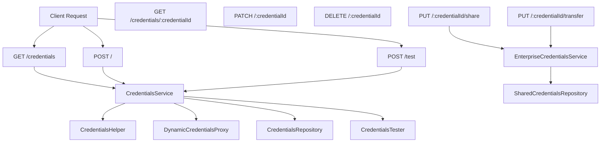
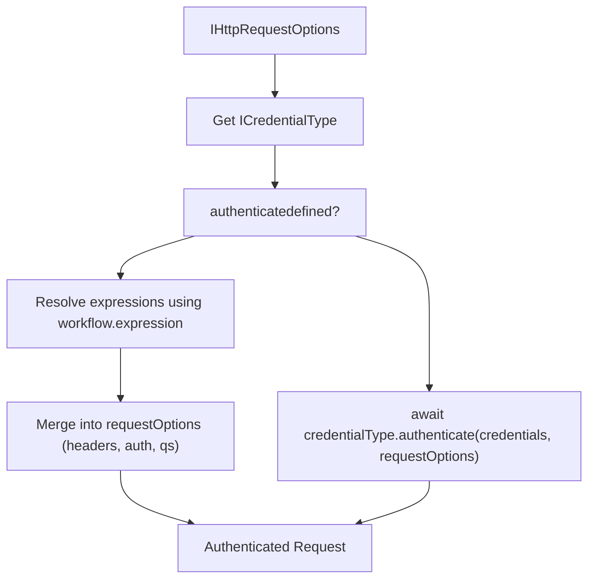
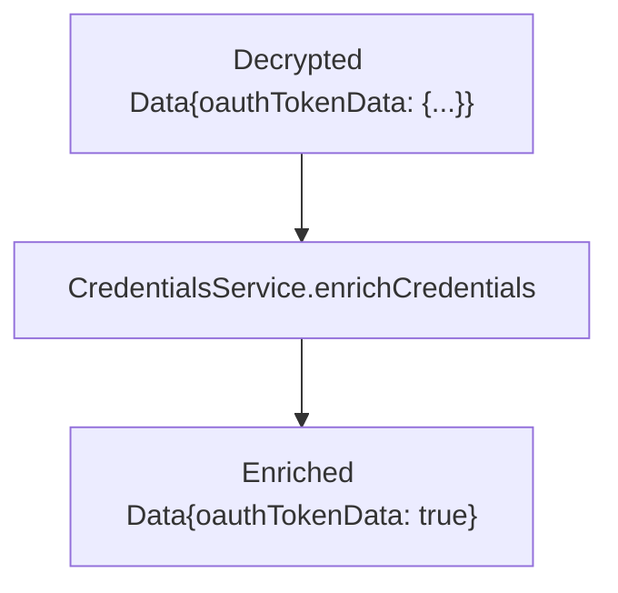

# Credentials API and Security

Relevant source files

-   [packages/@n8n/api-types/src/dto/credentials/\_\_tests\_\_/credentials-get-many-request.dto.test.ts](https://github.com/n8n-io/n8n/blob/88f170b9/packages/@n8n/api-types/src/dto/credentials/__tests__/credentials-get-many-request.dto.test.ts)
-   [packages/@n8n/api-types/src/dto/credentials/\_\_tests\_\_/credentials-get-one-request.dto.test.ts](https://github.com/n8n-io/n8n/blob/88f170b9/packages/@n8n/api-types/src/dto/credentials/__tests__/credentials-get-one-request.dto.test.ts)
-   [packages/@n8n/api-types/src/dto/credentials/credentials-get-many-request.dto.ts](https://github.com/n8n-io/n8n/blob/88f170b9/packages/@n8n/api-types/src/dto/credentials/credentials-get-many-request.dto.ts)
-   [packages/@n8n/api-types/src/dto/credentials/credentials-get-one-request.dto.ts](https://github.com/n8n-io/n8n/blob/88f170b9/packages/@n8n/api-types/src/dto/credentials/credentials-get-one-request.dto.ts)
-   [packages/@n8n/api-types/src/schemas/workflow-execution-status.schema.ts](https://github.com/n8n-io/n8n/blob/88f170b9/packages/@n8n/api-types/src/schemas/workflow-execution-status.schema.ts)
-   [packages/@n8n/client-oauth2/src/index.ts](https://github.com/n8n-io/n8n/blob/88f170b9/packages/@n8n/client-oauth2/src/index.ts)
-   [packages/@n8n/client-oauth2/src/types.ts](https://github.com/n8n-io/n8n/blob/88f170b9/packages/@n8n/client-oauth2/src/types.ts)
-   [packages/@n8n/client-oauth2/src/utils.ts](https://github.com/n8n-io/n8n/blob/88f170b9/packages/@n8n/client-oauth2/src/utils.ts)
-   [packages/@n8n/nodes-langchain/credentials/AzureEntraCognitiveServicesOAuth2Api.credentials.ts](https://github.com/n8n-io/n8n/blob/88f170b9/packages/@n8n/nodes-langchain/credentials/AzureEntraCognitiveServicesOAuth2Api.credentials.ts)
-   [packages/@n8n/nodes-langchain/nodes/llms/LmChatAzureOpenAi/\_\_tests\_\_/N8nOAuth2TokenCredential.test.ts](https://github.com/n8n-io/n8n/blob/88f170b9/packages/@n8n/nodes-langchain/nodes/llms/LmChatAzureOpenAi/__tests__/N8nOAuth2TokenCredential.test.ts)
-   [packages/@n8n/nodes-langchain/nodes/llms/LmChatAzureOpenAi/\_\_tests\_\_/api-key.handler.test.ts](https://github.com/n8n-io/n8n/blob/88f170b9/packages/@n8n/nodes-langchain/nodes/llms/LmChatAzureOpenAi/__tests__/api-key.handler.test.ts)
-   [packages/@n8n/nodes-langchain/nodes/llms/LmChatAzureOpenAi/\_\_tests\_\_/oauth2.handler.test.ts](https://github.com/n8n-io/n8n/blob/88f170b9/packages/@n8n/nodes-langchain/nodes/llms/LmChatAzureOpenAi/__tests__/oauth2.handler.test.ts)
-   [packages/@n8n/nodes-langchain/nodes/llms/LmChatAzureOpenAi/credentials/N8nOAuth2TokenCredential.ts](https://github.com/n8n-io/n8n/blob/88f170b9/packages/@n8n/nodes-langchain/nodes/llms/LmChatAzureOpenAi/credentials/N8nOAuth2TokenCredential.ts)
-   [packages/@n8n/nodes-langchain/nodes/llms/LmChatAzureOpenAi/credentials/api-key.ts](https://github.com/n8n-io/n8n/blob/88f170b9/packages/@n8n/nodes-langchain/nodes/llms/LmChatAzureOpenAi/credentials/api-key.ts)
-   [packages/@n8n/nodes-langchain/nodes/llms/LmChatAzureOpenAi/credentials/oauth2.ts](https://github.com/n8n-io/n8n/blob/88f170b9/packages/@n8n/nodes-langchain/nodes/llms/LmChatAzureOpenAi/credentials/oauth2.ts)
-   [packages/@n8n/nodes-langchain/nodes/llms/LmChatAzureOpenAi/properties.ts](https://github.com/n8n-io/n8n/blob/88f170b9/packages/@n8n/nodes-langchain/nodes/llms/LmChatAzureOpenAi/properties.ts)
-   [packages/cli/src/\_\_tests\_\_/credentials-helper.test.ts](https://github.com/n8n-io/n8n/blob/88f170b9/packages/cli/src/__tests__/credentials-helper.test.ts)
-   [packages/cli/src/controllers/oauth/\_\_tests\_\_/oauth1-credential.controller.test.ts](https://github.com/n8n-io/n8n/blob/88f170b9/packages/cli/src/controllers/oauth/__tests__/oauth1-credential.controller.test.ts)
-   [packages/cli/src/controllers/oauth/\_\_tests\_\_/oauth2-credential.controller.test.ts](https://github.com/n8n-io/n8n/blob/88f170b9/packages/cli/src/controllers/oauth/__tests__/oauth2-credential.controller.test.ts)
-   [packages/cli/src/controllers/oauth/oauth1-credential.controller.ts](https://github.com/n8n-io/n8n/blob/88f170b9/packages/cli/src/controllers/oauth/oauth1-credential.controller.ts)
-   [packages/cli/src/controllers/oauth/oauth2-credential.controller.ts](https://github.com/n8n-io/n8n/blob/88f170b9/packages/cli/src/controllers/oauth/oauth2-credential.controller.ts)
-   [packages/cli/src/controllers/oauth/oauth2-dynamic-client-registration.schema.ts](https://github.com/n8n-io/n8n/blob/88f170b9/packages/cli/src/controllers/oauth/oauth2-dynamic-client-registration.schema.ts)
-   [packages/cli/src/credentials-helper.ts](https://github.com/n8n-io/n8n/blob/88f170b9/packages/cli/src/credentials-helper.ts)
-   [packages/cli/src/credentials/\_\_tests\_\_/credentials.controller.test.ts](https://github.com/n8n-io/n8n/blob/88f170b9/packages/cli/src/credentials/__tests__/credentials.controller.test.ts)
-   [packages/cli/src/credentials/\_\_tests\_\_/credentials.service.test.ts](https://github.com/n8n-io/n8n/blob/88f170b9/packages/cli/src/credentials/__tests__/credentials.service.test.ts)
-   [packages/cli/src/credentials/\_\_tests\_\_/credentials.test-data.ts](https://github.com/n8n-io/n8n/blob/88f170b9/packages/cli/src/credentials/__tests__/credentials.test-data.ts)
-   [packages/cli/src/credentials/\_\_tests\_\_/dynamic-credentials-proxy.test.ts](https://github.com/n8n-io/n8n/blob/88f170b9/packages/cli/src/credentials/__tests__/dynamic-credentials-proxy.test.ts)
-   [packages/cli/src/credentials/\_\_tests\_\_/validation.test.ts](https://github.com/n8n-io/n8n/blob/88f170b9/packages/cli/src/credentials/__tests__/validation.test.ts)
-   [packages/cli/src/credentials/credential-resolution-provider.interface.ts](https://github.com/n8n-io/n8n/blob/88f170b9/packages/cli/src/credentials/credential-resolution-provider.interface.ts)
-   [packages/cli/src/credentials/credentials.controller.ts](https://github.com/n8n-io/n8n/blob/88f170b9/packages/cli/src/credentials/credentials.controller.ts)
-   [packages/cli/src/credentials/credentials.service.ee.ts](https://github.com/n8n-io/n8n/blob/88f170b9/packages/cli/src/credentials/credentials.service.ee.ts)
-   [packages/cli/src/credentials/credentials.service.ts](https://github.com/n8n-io/n8n/blob/88f170b9/packages/cli/src/credentials/credentials.service.ts)
-   [packages/cli/src/credentials/dynamic-credentials-proxy.ts](https://github.com/n8n-io/n8n/blob/88f170b9/packages/cli/src/credentials/dynamic-credentials-proxy.ts)
-   [packages/cli/src/credentials/validation.ts](https://github.com/n8n-io/n8n/blob/88f170b9/packages/cli/src/credentials/validation.ts)
-   [packages/cli/src/middlewares/cors.ts](https://github.com/n8n-io/n8n/blob/88f170b9/packages/cli/src/middlewares/cors.ts)
-   [packages/cli/src/modules/dynamic-credentials.ee/\_\_tests\_\_/dynamic-credentials-cors.integration.test.ts](https://github.com/n8n-io/n8n/blob/88f170b9/packages/cli/src/modules/dynamic-credentials.ee/__tests__/dynamic-credentials-cors.integration.test.ts)
-   [packages/cli/src/modules/dynamic-credentials.ee/\_\_tests\_\_/dynamic-credentials.controller.test.ts](https://github.com/n8n-io/n8n/blob/88f170b9/packages/cli/src/modules/dynamic-credentials.ee/__tests__/dynamic-credentials.controller.test.ts)
-   [packages/cli/src/modules/dynamic-credentials.ee/\_\_tests\_\_/workflow-status.controller.test.ts](https://github.com/n8n-io/n8n/blob/88f170b9/packages/cli/src/modules/dynamic-credentials.ee/__tests__/workflow-status.controller.test.ts)
-   [packages/cli/src/modules/dynamic-credentials.ee/dynamic-credentials.config.ts](https://github.com/n8n-io/n8n/blob/88f170b9/packages/cli/src/modules/dynamic-credentials.ee/dynamic-credentials.config.ts)
-   [packages/cli/src/modules/dynamic-credentials.ee/dynamic-credentials.controller.ts](https://github.com/n8n-io/n8n/blob/88f170b9/packages/cli/src/modules/dynamic-credentials.ee/dynamic-credentials.controller.ts)
-   [packages/cli/src/modules/dynamic-credentials.ee/dynamic-credentials.module.ts](https://github.com/n8n-io/n8n/blob/88f170b9/packages/cli/src/modules/dynamic-credentials.ee/dynamic-credentials.module.ts)
-   [packages/cli/src/modules/dynamic-credentials.ee/services/\_\_tests\_\_/credential-check-proxy.service.test.ts](https://github.com/n8n-io/n8n/blob/88f170b9/packages/cli/src/modules/dynamic-credentials.ee/services/__tests__/credential-check-proxy.service.test.ts)
-   [packages/cli/src/modules/dynamic-credentials.ee/services/\_\_tests\_\_/credential-resolver-registry.service.test.ts](https://github.com/n8n-io/n8n/blob/88f170b9/packages/cli/src/modules/dynamic-credentials.ee/services/__tests__/credential-resolver-registry.service.test.ts)
-   [packages/cli/src/modules/dynamic-credentials.ee/services/\_\_tests\_\_/credential-resolver-workflow.service.test.ts](https://github.com/n8n-io/n8n/blob/88f170b9/packages/cli/src/modules/dynamic-credentials.ee/services/__tests__/credential-resolver-workflow.service.test.ts)
-   [packages/cli/src/modules/dynamic-credentials.ee/services/\_\_tests\_\_/dynamic-credential-cors.service.test.ts](https://github.com/n8n-io/n8n/blob/88f170b9/packages/cli/src/modules/dynamic-credentials.ee/services/__tests__/dynamic-credential-cors.service.test.ts)
-   [packages/cli/src/modules/dynamic-credentials.ee/services/\_\_tests\_\_/dynamic-credential-storage.service.test.ts](https://github.com/n8n-io/n8n/blob/88f170b9/packages/cli/src/modules/dynamic-credentials.ee/services/__tests__/dynamic-credential-storage.service.test.ts)
-   [packages/cli/src/modules/dynamic-credentials.ee/services/\_\_tests\_\_/dynamic-credential.service.test.ts](https://github.com/n8n-io/n8n/blob/88f170b9/packages/cli/src/modules/dynamic-credentials.ee/services/__tests__/dynamic-credential.service.test.ts)
-   [packages/cli/src/modules/dynamic-credentials.ee/services/credential-check-proxy.service.ts](https://github.com/n8n-io/n8n/blob/88f170b9/packages/cli/src/modules/dynamic-credentials.ee/services/credential-check-proxy.service.ts)
-   [packages/cli/src/modules/dynamic-credentials.ee/services/credential-resolver-registry.service.ts](https://github.com/n8n-io/n8n/blob/88f170b9/packages/cli/src/modules/dynamic-credentials.ee/services/credential-resolver-registry.service.ts)
-   [packages/cli/src/modules/dynamic-credentials.ee/services/credential-resolver-workflow.service.ts](https://github.com/n8n-io/n8n/blob/88f170b9/packages/cli/src/modules/dynamic-credentials.ee/services/credential-resolver-workflow.service.ts)
-   [packages/cli/src/modules/dynamic-credentials.ee/services/dynamic-credential-cors.service.ts](https://github.com/n8n-io/n8n/blob/88f170b9/packages/cli/src/modules/dynamic-credentials.ee/services/dynamic-credential-cors.service.ts)
-   [packages/cli/src/modules/dynamic-credentials.ee/services/dynamic-credential-storage.service.ts](https://github.com/n8n-io/n8n/blob/88f170b9/packages/cli/src/modules/dynamic-credentials.ee/services/dynamic-credential-storage.service.ts)
-   [packages/cli/src/modules/dynamic-credentials.ee/services/dynamic-credential.service.ts](https://github.com/n8n-io/n8n/blob/88f170b9/packages/cli/src/modules/dynamic-credentials.ee/services/dynamic-credential.service.ts)
-   [packages/cli/src/modules/dynamic-credentials.ee/services/index.ts](https://github.com/n8n-io/n8n/blob/88f170b9/packages/cli/src/modules/dynamic-credentials.ee/services/index.ts)
-   [packages/cli/src/modules/dynamic-credentials.ee/utils.ts](https://github.com/n8n-io/n8n/blob/88f170b9/packages/cli/src/modules/dynamic-credentials.ee/utils.ts)
-   [packages/cli/src/modules/dynamic-credentials.ee/workflow-status.controller.ts](https://github.com/n8n-io/n8n/blob/88f170b9/packages/cli/src/modules/dynamic-credentials.ee/workflow-status.controller.ts)
-   [packages/cli/src/modules/external-secrets.ee/\_\_tests\_\_/redaction.service.ee.test.ts](https://github.com/n8n-io/n8n/blob/88f170b9/packages/cli/src/modules/external-secrets.ee/__tests__/redaction.service.ee.test.ts)
-   [packages/cli/src/modules/external-secrets.ee/redaction.service.ee.ts](https://github.com/n8n-io/n8n/blob/88f170b9/packages/cli/src/modules/external-secrets.ee/redaction.service.ee.ts)
-   [packages/cli/src/oauth/\_\_tests\_\_/oauth.service.test.ts](https://github.com/n8n-io/n8n/blob/88f170b9/packages/cli/src/oauth/__tests__/oauth.service.test.ts)
-   [packages/cli/src/oauth/oauth.service.ts](https://github.com/n8n-io/n8n/blob/88f170b9/packages/cli/src/oauth/oauth.service.ts)
-   [packages/cli/src/oauth/types.ts](https://github.com/n8n-io/n8n/blob/88f170b9/packages/cli/src/oauth/types.ts)
-   [packages/cli/src/public-api/v1/handlers/credentials/\_\_tests\_\_/credentials.service.test.ts](https://github.com/n8n-io/n8n/blob/88f170b9/packages/cli/src/public-api/v1/handlers/credentials/__tests__/credentials.service.test.ts)
-   [packages/cli/src/public-api/v1/handlers/credentials/credentials.handler.ts](https://github.com/n8n-io/n8n/blob/88f170b9/packages/cli/src/public-api/v1/handlers/credentials/credentials.handler.ts)
-   [packages/cli/src/public-api/v1/handlers/credentials/credentials.service.ts](https://github.com/n8n-io/n8n/blob/88f170b9/packages/cli/src/public-api/v1/handlers/credentials/credentials.service.ts)
-   [packages/cli/templates/oauth-callback.handlebars](https://github.com/n8n-io/n8n/blob/88f170b9/packages/cli/templates/oauth-callback.handlebars)
-   [packages/cli/templates/oauth-error-callback.handlebars](https://github.com/n8n-io/n8n/blob/88f170b9/packages/cli/templates/oauth-error-callback.handlebars)
-   [packages/cli/test/integration/ai/ai.api.test.ts](https://github.com/n8n-io/n8n/blob/88f170b9/packages/cli/test/integration/ai/ai.api.test.ts)
-   [packages/cli/test/integration/controllers/oauth/oauth2.api.test.ts](https://github.com/n8n-io/n8n/blob/88f170b9/packages/cli/test/integration/controllers/oauth/oauth2.api.test.ts)
-   [packages/cli/test/integration/controllers/oauth/oauth2.skip-auth.api.test.ts](https://github.com/n8n-io/n8n/blob/88f170b9/packages/cli/test/integration/controllers/oauth/oauth2.skip-auth.api.test.ts)
-   [packages/cli/test/integration/credentials/credentials.api.ee.test.ts](https://github.com/n8n-io/n8n/blob/88f170b9/packages/cli/test/integration/credentials/credentials.api.ee.test.ts)
-   [packages/cli/test/integration/credentials/credentials.api.test.ts](https://github.com/n8n-io/n8n/blob/88f170b9/packages/cli/test/integration/credentials/credentials.api.test.ts)
-   [packages/cli/test/integration/dynamic-credentials.ee/dynamic-credentials.auth.api.test.ts](https://github.com/n8n-io/n8n/blob/88f170b9/packages/cli/test/integration/dynamic-credentials.ee/dynamic-credentials.auth.api.test.ts)
-   [packages/cli/test/integration/dynamic-credentials.ee/dynamic-credentials.no-auth.api.test.ts](https://github.com/n8n-io/n8n/blob/88f170b9/packages/cli/test/integration/dynamic-credentials.ee/dynamic-credentials.no-auth.api.test.ts)
-   [packages/cli/test/integration/dynamic-credentials.ee/workflow-status.auth.api.test.ts](https://github.com/n8n-io/n8n/blob/88f170b9/packages/cli/test/integration/dynamic-credentials.ee/workflow-status.auth.api.test.ts)
-   [packages/cli/test/integration/dynamic-credentials.ee/workflow-status.no-auth.api.test.ts](https://github.com/n8n-io/n8n/blob/88f170b9/packages/cli/test/integration/dynamic-credentials.ee/workflow-status.no-auth.api.test.ts)
-   [packages/cli/test/integration/public-api/credentials.test.ts](https://github.com/n8n-io/n8n/blob/88f170b9/packages/cli/test/integration/public-api/credentials.test.ts)
-   [packages/core/src/execution-engine/\_\_tests\_\_/routing-node.test.ts](https://github.com/n8n-io/n8n/blob/88f170b9/packages/core/src/execution-engine/__tests__/routing-node.test.ts)
-   [packages/core/src/execution-engine/index.ts](https://github.com/n8n-io/n8n/blob/88f170b9/packages/core/src/execution-engine/index.ts)
-   [packages/core/src/execution-engine/node-execution-context/\_\_tests\_\_/execute-context.test.ts](https://github.com/n8n-io/n8n/blob/88f170b9/packages/core/src/execution-engine/node-execution-context/__tests__/execute-context.test.ts)
-   [packages/core/src/execution-engine/node-execution-context/\_\_tests\_\_/execute-single-context.test.ts](https://github.com/n8n-io/n8n/blob/88f170b9/packages/core/src/execution-engine/node-execution-context/__tests__/execute-single-context.test.ts)
-   [packages/core/src/execution-engine/node-execution-context/\_\_tests\_\_/node-execution-context.test.ts](https://github.com/n8n-io/n8n/blob/88f170b9/packages/core/src/execution-engine/node-execution-context/__tests__/node-execution-context.test.ts)
-   [packages/core/src/execution-engine/node-execution-context/execute-context.ts](https://github.com/n8n-io/n8n/blob/88f170b9/packages/core/src/execution-engine/node-execution-context/execute-context.ts)
-   [packages/core/src/execution-engine/node-execution-context/node-execution-context.ts](https://github.com/n8n-io/n8n/blob/88f170b9/packages/core/src/execution-engine/node-execution-context/node-execution-context.ts)
-   [packages/core/src/execution-engine/node-execution-context/utils/\_\_tests\_\_/credential-check-helper-functions.test.ts](https://github.com/n8n-io/n8n/blob/88f170b9/packages/core/src/execution-engine/node-execution-context/utils/__tests__/credential-check-helper-functions.test.ts)
-   [packages/core/src/execution-engine/node-execution-context/utils/\_\_tests\_\_/request-helper-functions.test.ts](https://github.com/n8n-io/n8n/blob/88f170b9/packages/core/src/execution-engine/node-execution-context/utils/__tests__/request-helper-functions.test.ts)
-   [packages/core/src/execution-engine/node-execution-context/utils/credential-check-helper-functions.ts](https://github.com/n8n-io/n8n/blob/88f170b9/packages/core/src/execution-engine/node-execution-context/utils/credential-check-helper-functions.ts)
-   [packages/core/src/execution-engine/node-execution-context/utils/request-helper-functions.ts](https://github.com/n8n-io/n8n/blob/88f170b9/packages/core/src/execution-engine/node-execution-context/utils/request-helper-functions.ts)
-   [packages/core/src/execution-engine/node-execution-context/utils/request-helpers/\_\_tests\_\_/axios-utils.test.ts](https://github.com/n8n-io/n8n/blob/88f170b9/packages/core/src/execution-engine/node-execution-context/utils/request-helpers/__tests__/axios-utils.test.ts)
-   [packages/core/src/execution-engine/node-execution-context/utils/request-helpers/axios-config.ts](https://github.com/n8n-io/n8n/blob/88f170b9/packages/core/src/execution-engine/node-execution-context/utils/request-helpers/axios-config.ts)
-   [packages/core/src/execution-engine/node-execution-context/utils/request-helpers/axios-utils.ts](https://github.com/n8n-io/n8n/blob/88f170b9/packages/core/src/execution-engine/node-execution-context/utils/request-helpers/axios-utils.ts)
-   [packages/core/src/execution-engine/node-execution-context/utils/request-helpers/index.ts](https://github.com/n8n-io/n8n/blob/88f170b9/packages/core/src/execution-engine/node-execution-context/utils/request-helpers/index.ts)
-   [packages/core/src/execution-engine/routing-node.ts](https://github.com/n8n-io/n8n/blob/88f170b9/packages/core/src/execution-engine/routing-node.ts)
-   [packages/frontend/editor-ui/src/features/ai/chatHub/composables/useDynamicCredentialsStatus.ts](https://github.com/n8n-io/n8n/blob/88f170b9/packages/frontend/editor-ui/src/features/ai/chatHub/composables/useDynamicCredentialsStatus.ts)
-   [packages/nodes-base/credentials/OAuth2Api.credentials.ts](https://github.com/n8n-io/n8n/blob/88f170b9/packages/nodes-base/credentials/OAuth2Api.credentials.ts)

## Purpose and Scope

This document covers the credentials management system in n8n, including REST API endpoints, encryption/decryption, authentication methods, dynamic credential resolution, OAuth flows, data redaction for security, and the project-based sharing model.

---

## REST API Architecture

The credentials API follows a standard REST pattern with `CredentialsController` handling HTTP requests and multiple service layers containing business logic. All endpoints require authentication and enforce project-based permissions via `@ProjectScope` decorators.

### API Endpoints and Service Architecture

**Sources:** [packages/cli/src/credentials/credentials.controller.ts51-64](https://github.com/n8n-io/n8n/blob/88f170b9/packages/cli/src/credentials/credentials.controller.ts#L51-L64) [packages/cli/src/credentials/credentials.service.ts86-105](https://github.com/n8n-io/n8n/blob/88f170b9/packages/cli/src/credentials/credentials.service.ts#L86-L105)

### Request/Response Flow with Scopes

The API automatically includes permission scopes when requested, enabling the frontend to show/hide actions based on user permissions.

> **[Mermaid sequence]**
> *(图表结构无法解析)*

**Sources:** [packages/cli/src/credentials/credentials.controller.ts66-89](https://github.com/n8n-io/n8n/blob/88f170b9/packages/cli/src/credentials/credentials.controller.ts#L66-L89) [packages/cli/src/credentials/credentials.service.ts124-217](https://github.com/n8n-io/n8n/blob/88f170b9/packages/cli/src/credentials/credentials.service.ts#L124-L217)

---

## Credential Storage and Encryption

All credential data is encrypted at rest using the `Credentials` class from `n8n-core`. The `Cipher` service provides encryption/decryption using the instance encryption key from configuration.

### Core Encryption Components

| Component | File | Responsibility |
| --- | --- | --- |
| `Credentials` | `n8n-core` | In-memory credential object with encryption methods |
| `Cipher` | `n8n-core` | Encryption/decryption using instance key |
| `CredentialsHelper` | `packages/cli/src/credentials-helper.ts` | High-level credential operations and resolution |
| `CredentialsService` | `packages/cli/src/credentials/credentials.service.ts` | API layer CRUD and data enrichment |
| `CredentialsRepository` | `packages/@n8n/db` | Database persistence |

**Sources:** [packages/cli/src/credentials-helper.ts83-94](https://github.com/n8n-io/n8n/blob/88f170b9/packages/cli/src/credentials-helper.ts#L83-L94) [packages/cli/src/credentials/credentials.service.ts86-105](https://github.com/n8n-io/n8n/blob/88f170b9/packages/cli/src/credentials/credentials.service.ts#L86-L105)

### Encryption Flow

> **[Mermaid sequence]**
> *(图表结构无法解析)*

**Sources:** [packages/cli/src/credentials/credentials.service.ts477-496](https://github.com/n8n-io/n8n/blob/88f170b9/packages/cli/src/credentials/credentials.service.ts#L477-L496) [packages/cli/src/credentials/credentials.controller.ts178-205](https://github.com/n8n-io/n8n/blob/88f170b9/packages/cli/src/credentials/credentials.controller.ts#L178-L205)

---

## Authentication Methods

The `CredentialsHelper.authenticate()` method adds authentication information to HTTP requests based on the credential type's `authenticate` property.

### Authentication Types

Credential types can define authentication in two ways:

1.  **Declarative (`authenticate.type === 'generic'`)**: Generic authentication using expressions.
2.  **Custom Function**: Programmatic authentication logic.

**Declarative Authentication Flow**

**Sources:** [packages/cli/src/credentials-helper.ts99-155](https://github.com/n8n-io/n8n/blob/88f170b9/packages/cli/src/credentials-helper.ts#L99-L155)

### Pre-Authentication (Token Refresh)

The `preAuthentication()` method handles token refresh for OAuth credentials before making requests. It checks if tokens are expired and refreshes them if needed.

> **[Mermaid sequence]**
> *(图表结构无法解析)*

**Sources:** [packages/cli/src/credentials-helper.ts157-210](https://github.com/n8n-io/n8n/blob/88f170b9/packages/cli/src/credentials-helper.ts#L157-L210)

---

## OAuth Flow and Management

OAuth credentials (OAuth1 and OAuth2) are managed via specialized controllers and the `OauthService`.

### OAuth2 Callback Flow

> **[Mermaid sequence]**
> *(图表结构无法解析)*

**Sources:** [packages/cli/src/controllers/oauth/oauth2-credential.controller.ts38-142](https://github.com/n8n-io/n8n/blob/88f170b9/packages/cli/src/controllers/oauth/oauth2-credential.controller.ts#L38-L142) [packages/cli/src/oauth/oauth.service.ts173-184](https://github.com/n8n-io/n8n/blob/88f170b9/packages/cli/src/oauth/oauth.service.ts#L173-L184)

### OAuth Token Protection

OAuth tokens are never exposed to the frontend. During data enrichment, `oauthTokenData` is replaced with a boolean flag.

**Sources:** [packages/cli/src/credentials/credentials.service.ts334-337](https://github.com/n8n-io/n8n/blob/88f170b9/packages/cli/src/credentials/credentials.service.ts#L334-L337)

---

## Dynamic Credentials and Resolution

n8n supports dynamic credential resolution via external systems (Enterprise Edition).

### Dynamic Resolution Flow

**Sources:** [packages/cli/src/credentials/dynamic-credentials-proxy.ts1-40](https://github.com/n8n-io/n8n/blob/88f170b9/packages/cli/src/credentials/dynamic-credentials-proxy.ts#L1-L40) [packages/cli/src/modules/dynamic-credentials.ee/dynamic-credentials.module.ts30-36](https://github.com/n8n-io/n8n/blob/88f170b9/packages/cli/src/modules/dynamic-credentials.ee/dynamic-credentials.module.ts#L30-L36)

---

## Credential Redaction and Unredaction

To prevent sensitive data leaks, n8n redacts password fields before sending them to the UI and unredacts them when receiving updates.

### Redaction Rules

| Property Type | Action | Value |
| --- | --- | --- |
| `password: true` | Redact | `CREDENTIAL_BLANKING_VALUE` |
| `oauthTokenData` | Redact | `CREDENTIAL_BLANKING_VALUE` |
| `csrfSecret` | Redact | `CREDENTIAL_BLANKING_VALUE` |
| Empty string | Mark | `CREDENTIAL_EMPTY_VALUE` |

**Sources:** [packages/cli/src/credentials/credentials.service.ts619-693](https://github.com/n8n-io/n8n/blob/88f170b9/packages/cli/src/credentials/credentials.service.ts#L619-L693)

### Unredaction Flow (Update)

When a `PATCH` request is received, the `unredact` function compares the new data with existing decrypted data. If a field contains `CREDENTIAL_BLANKING_VALUE`, the original value is preserved.

**Sources:** [packages/cli/src/credentials/credentials.service.ts695-750](https://github.com/n8n-io/n8n/blob/88f170b9/packages/cli/src/credentials/credentials.service.ts#L695-L750) [packages/cli/src/credentials/credentials.controller.ts236-244](https://github.com/n8n-io/n8n/blob/88f170b9/packages/cli/src/credentials/credentials.controller.ts#L236-L244)

---

## Credential Testing

The `/credentials/test` endpoint allows validating credentials against the external service without saving them.

> **[Mermaid sequence]**
> *(图表结构无法解析)*

**Sources:** [packages/cli/src/credentials/credentials.controller.ts140-176](https://github.com/n8n-io/n8n/blob/88f170b9/packages/cli/src/credentials/credentials.controller.ts#L140-L176) [packages/cli/src/services/credentials-tester.service.ts1-100](https://github.com/n8n-io/n8n/blob/88f170b9/packages/cli/src/services/credentials-tester.service.ts#L1-L100) (inferred from `CredentialsService.test` and `CredentialsTester` usage).
